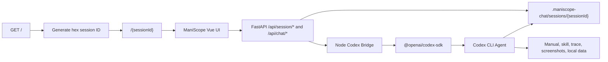

# Codex Chat Implementation Plan

## Goal

Replace the current browser-only `ChatBox.vue` OpenAI call with a session-aware Codex chat system that can collaborate with the user inside ManiScope.

The Codex agent should be able to:

- Converse with the user through text and image input.
- See the current ManiScope live trace without requiring manual export.
- Read the ManiScope manual, trace-analysis skill, current trace JSON, current screenshots, and source data.
- Autonomously run the trace-analysis workflow described in `skills/user-trace-analysis.md`.
- Generate and update text and image artifacts, especially `analysis-report.md` and `trace-step-map.md`.
- Preserve the active ManiScope session across browser refreshes by using the session ID in the URL.

## Key Design Decisions

### URL-Based ManiScope Session

Use the URL path as the current ManiScope session identity.

- Visiting `http://localhost:3000/` creates a new random 5-character hex session ID.
- The frontend redirects to `http://localhost:3000/{sessionId}`.
- Refreshing `http://localhost:3000/{sessionId}` preserves the same session.
- Visiting `http://localhost:3000/` again creates a fresh session.
- Directly visiting an existing session URL restores the server-side live trace if it exists.
- Directly visiting a non-existing valid session URL creates an empty session using that ID.

The session ID should use lowercase hex characters:

```text
0123456789abcdef
```

Five hex characters give 1,048,576 possible IDs. This is enough for local research use, but the backend must still check for collisions before creating a new session.

### Live Trace Mirror

Manual ZIP export should no longer be the only way for an agent to inspect a trace.

Maintain a server-side live trace mirror for the current URL session. The browser remains the source of truth during interaction, while the backend keeps a continuously refreshed copy that Codex can read from disk.

Use a hybrid sync strategy:

1. Incrementally push actions, annotations, and screenshots when they are created.
2. Before every Codex chat turn, run a full sync of the current trace state.

The incremental push improves freshness and avoids large updates. The pre-chat full sync is the correctness guarantee.

### Server-Side Codex Boundary

Codex SDK must run on the server side.

The frontend should never call OpenAI or Codex directly. It should call ManiScope backend APIs. The backend should run or proxy to a Node-based Codex bridge that uses `@openai/codex-sdk`.

The Codex thread should be bound to the ManiScope session ID, not to browser memory.

## Proposed Runtime Architecture



## Server-Side Data Layout

Store session data under the repository root:

```text
.maniscope-chat/
  sessions/
    {sessionId}/
      session-meta.json
      live-session.json
      current-state.json
      codex-threads.json
      images/
        action-0001-source-token_distribution-01.png
        action-0001-target-behavior_details-01.png
        annotation-0002-behavior_details.png
        current-token_distribution.png
        current-candlestick_chart.png
        current-behavior_details.png
      artifacts/
        analysis-report.md
        trace-step-map.md
        analysis-assets/
```

### `session-meta.json`

```json
{
  "sessionId": "ab12f",
  "coin": "ACT",
  "createdAt": "2026-05-06T10:00:00.000Z",
  "lastUpdatedAt": "2026-05-06T10:15:00.000Z",
  "restoredFromExisting": false
}
```

### `live-session.json`

Use the same logical schema as the current export payload:

```json
{
  "exportVersion": "1.0",
  "exportFormat": "live-session",
  "sessionId": "ab12f",
  "exportedAt": null,
  "lastUpdatedAt": "2026-05-06T10:15:00.000Z",
  "coin": "ACT",
  "includesSnapshots": true,
  "imageDirectory": "images",
  "imageCount": 12,
  "config": {
    "snapshotCategories": [],
    "snapshotQuality": "full"
  },
  "annotationSeqId": 3,
  "userActionSequence": [],
  "annotationRecords": []
}
```

The important difference from ZIP export is that image payloads are written as files and referenced by relative paths. The JSON should not retain base64 `dataUrl` fields on disk.

### `current-state.json`

Keep current UI state separate from historical trace events.

```json
{
  "sessionId": "ab12f",
  "coin": "ACT",
  "snapshotTime": "2024-11-09 23:00:00 UTC",
  "selectedUser": null,
  "selectedCardUsers": [],
  "klineTimeWindow": null,
  "behaviorTimeWindow": null,
  "activeBottomTab": "actions",
  "majorViewScreenshots": {
    "token_distribution": "images/current-token_distribution.png",
    "candlestick_chart": "images/current-candlestick_chart.png",
    "behavior_details": "images/current-behavior_details.png"
  }
}
```

This file lets Codex distinguish what the user has done from what the user is currently seeing.

### `codex-threads.json`

```json
{
  "default": {
    "threadId": "codex-thread-id",
    "sessionPath": "/Users/zhiqiu/.codex/sessions/...",
    "createdAt": "2026-05-06T10:00:00.000Z",
    "lastUsedAt": "2026-05-06T10:15:00.000Z"
  },
  "trace-analysis": {
    "threadId": "codex-thread-id-2",
    "sessionPath": "/Users/zhiqiu/.codex/sessions/...",
    "createdAt": "2026-05-06T10:05:00.000Z",
    "lastUsedAt": "2026-05-06T10:15:00.000Z"
  }
}
```

## Frontend Plan

### Routing

The current app is a Vite single-page app, so session routing can be implemented client-side.

Add a small route bootstrap before mounting `CryptoVis`:

- If `window.location.pathname === "/"`, request a fresh session ID from the backend and redirect to `/{sessionId}`.
- If the path is `/{sessionId}`, validate the ID format.
- If invalid, redirect to `/`.
- If valid, pass `sessionId` into `CryptoVis`.

Because Vite history fallback is needed for direct visits to `/{sessionId}`, configure the dev server and any deployment server to serve `index.html` for unknown frontend paths.

### `CryptoVis.vue`

Add session-aware state:

- `maniscopeSessionId`
- `sessionRestoreStatus`
- `lastLiveTraceSyncAt`
- `liveTraceSyncInFlight`

On mount:

1. Load or create backend session by ID.
2. If an existing live trace exists, restore `userActionSequence`, `annotationRecords`, `_annotationSeqId`, and relevant UI state.
3. Continue recording new actions into the same arrays.

Update these methods:

- `logUserAction`: after appending or merging an action, enqueue incremental sync.
- `_maybeCaptureSnapshots`: after screenshots finish, enqueue image sync or full action sync for the affected action.
- `handleSnapshotAnnotation`: after adding an annotation, enqueue annotation sync.
- `applyImport`: after replacing session state, run a full sync.
- `confirmExport`: export from current frontend state as today, but also consider using backend live trace as a fallback once available.

Add a method:

```js
async syncCurrentTrace({ includeCurrentViews = false } = {}) {
  // Build live-session payload from current in-memory arrays.
  // Convert dataUrl screenshots to files through backend upload.
  // Optionally capture current major views first.
}
```

Before every chat turn, call:

```js
await this.syncCurrentTrace({ includeCurrentViews: true })
```

### Replace `ChatBox.vue`

Replace the current `ChatBox.vue` with a Codex-backed chat panel.

The chat UI should follow the Maestro Chat sidebar pattern from `evolve-shell`, adapted to ManiScope:

- It should be a floating sidebar overlay above the existing visualization views, not a panel embedded in the lower-left layout.
- It should open and close from a header button.
- When open, it should dock to the right side of the viewport by default and use a substantial width, for example `min(520px, 42vw)`, with a responsive mobile full-width mode.
- It should have a high `z-index`, its own shadow and border, and should not resize or compress Token Distribution, K-line, Behavior Details, Control Panel, or the bottom action views.
- It should preserve the current Codex thread and draft while closed. Closing the sidebar should hide it, not unmount and lose state.
- It should include an explicit close button in the sidebar header.
- It should support optional resizing later, but the first version can use a fixed responsive width.

Required UI features:

- Text messages.
- Image upload through file picker.
- Paste image from clipboard.
- Drag and drop images.
- Attachment previews before send.
- Markdown rendering for assistant messages.
- Collapsible agent activity: commands, file changes, web searches, todo list, and errors.
- Artifact cards for generated Markdown reports and generated images.
- Session indicator, for example `Session ab12f`, with copy-link action.
- Clear chat action that clears only the Codex thread for this ManiScope session, not the ManiScope trace.

Do not expose any OpenAI key in Vite environment variables.

## Backend Plan

### FastAPI Session APIs

Add a new router, for example `front/server/chat_session_service.py`.

Proposed endpoints:

#### `POST /api/sessions`

Create a new random 5-character hex session ID.

Behavior:

- Generate random hex ID.
- Check `.maniscope-chat/sessions/{sessionId}` does not exist.
- Retry on collision.
- Create session folder and `session-meta.json`.
- Return session metadata.

#### `GET /api/sessions/{sessionId}`

Load session metadata and existing live trace if present.

Behavior:

- Validate session ID against `^[0-9a-f]{5}$`.
- If folder exists, return metadata plus live trace summary.
- If folder does not exist, create a new empty session using the provided ID.
- Return enough data for frontend restoration.

#### `POST /api/sessions/{sessionId}/sync`

Write the complete current trace mirror.

Request body should include:

- `coin`
- `annotationSeqId`
- `snapshotCategories`
- `snapshotQuality`
- `userActionSequence`
- `annotationRecords`
- `currentState`
- optional current-view screenshots

Behavior:

- Validate session ID.
- Decode base64 image data URLs into files under `images/`.
- Replace `dataUrl` and `sketchDataUrl` fields with `imagePath` fields.
- Write `live-session.json` atomically.
- Write `current-state.json` atomically.
- Update `session-meta.json`.

#### `POST /api/sessions/{sessionId}/events`

Append or update incremental trace events.

This can be implemented after full sync works. It should handle:

- New action.
- Merged action update.
- New annotation.
- Updated screenshots for an action.

For the first implementation, this endpoint can internally load the current JSON, update it, and rewrite atomically.

#### `GET /api/sessions/{sessionId}/export`

Optional backend export endpoint.

Returns a ZIP built from the live server mirror. This is useful as a consistency check against the existing frontend export path.

### Node Codex Bridge

Add a Node service or subprocess wrapper because `@openai/codex-sdk` is TypeScript/Node-oriented.

Suggested location:

```text
front/codex-bridge/
  package.json
  src/server.ts
  src/codexThreads.ts
  src/sessionStore.ts
  src/sse.ts
```

FastAPI can either proxy requests to this bridge or spawn it as a managed process during backend startup. The first implementation can run it as a separate local service, then we can decide whether to orchestrate it from `start.py` or FastAPI later.

Thread options:

```ts
codex.startThread({
  workingDirectory: "/Users/zhiqiu/offline_code/research_ntu/NtuCapstone",
  skipGitRepoCheck: false,
  sandboxMode: "workspace-write",
  approvalPolicy: "never",
  model: process.env.CODEX_MODEL,
  modelReasoningEffort: "high",
  networkAccessEnabled: false,
  webSearchMode: "disabled"
})
```

Use `danger-full-access` only if `workspace-write` blocks required local analysis operations.

### Chat APIs

Expose these through FastAPI, backed by the Node Codex bridge:

#### `POST /api/chat/{sessionId}/message`

Send a user message and stream Codex events.

Request:

```json
{
  "threadKey": "trace-analysis",
  "message": "Analyze what I have done so far.",
  "attachments": [
    {
      "kind": "uploaded_image",
      "path": "uploads/user-image-0001.png"
    }
  ],
  "includeCurrentTrace": true,
  "includeCurrentViews": true
}
```

Response:

Server-Sent Events with normalized event types:

- `thread`
- `agent_message`
- `reasoning`
- `command`
- `file_change`
- `mcp_tool_call`
- `web_search`
- `todo_list`
- `artifact`
- `done`
- `error`

#### `GET /api/chat/{sessionId}/history`

Return parsed Codex conversation history for this session and thread key.

#### `DELETE /api/chat/{sessionId}/threads/{threadKey}`

Clear one Codex thread binding. This does not delete the ManiScope trace.

## Codex Prompt Plan

For the first turn in a `trace-analysis` thread, build a system context like this:

```text
You are a Codex agent collaborating with a user inside ManiScope.

You must analyze the current live ManiScope trace for the active session.

Read these files first:
- docs/reports/user-manual.en.md
- skills/user-trace-analysis.md
- .maniscope-chat/sessions/{sessionId}/live-session.json
- .maniscope-chat/sessions/{sessionId}/current-state.json

Screenshots are under:
- .maniscope-chat/sessions/{sessionId}/images

Generated artifacts should be written under:
- .maniscope-chat/sessions/{sessionId}/artifacts

When the user asks for trace analysis, follow `skills/user-trace-analysis.md`.
Produce or update:
- artifacts/analysis-report.md
- artifacts/trace-step-map.md

Distinguish observed user actions, user-authored annotations, and your own inferred analysis.
Use top-down recommendations and classify atomic actions as Visual or Statistical.
```

For follow-up turns, send only the user message plus a short reminder that the live trace may have changed and should be re-read if the question depends on current state.

If the user includes image attachments, pass them to Codex as structured input:

```ts
await thread.runStreamed([
  { type: "text", text: prompt },
  { type: "local_image", path: "/absolute/path/to/uploaded.png" }
])
```

For important current-view screenshots, also attach:

- `current-token_distribution.png`
- `current-candlestick_chart.png`
- `current-behavior_details.png`

For very large traces, do not attach every screenshot. Let Codex inspect the image directory, and attach only contact sheets or the most recent/current screenshots by default.

## Artifact Handling

After each Codex turn:

1. Scan `.maniscope-chat/sessions/{sessionId}/artifacts`.
2. Detect new or changed Markdown files and images.
3. Emit `artifact` SSE events to the frontend.
4. Render artifact cards in the chat UI.

Artifact metadata:

```json
{
  "id": "analysis-report",
  "kind": "markdown",
  "title": "Analysis Report",
  "path": "artifacts/analysis-report.md",
  "updatedAt": "2026-05-06T10:15:00.000Z"
}
```

Serve artifacts through backend IDs rather than exposing arbitrary filesystem paths.

## Import And Export Semantics

### Export

The existing frontend export path can remain.

Later, add backend export from the live mirror:

- It should produce the same `session.json` plus `images/` ZIP contract.
- This is useful for validating the live mirror.

### Import

Importing into `/{sessionId}` should replace the current ManiScope session state.

After import:

1. Replace frontend `userActionSequence` and `annotationRecords`.
2. Restore `_annotationSeqId`.
3. Run full sync to backend.
4. Keep the same URL session ID.
5. Log `import_session` after the replacement as today.

## Collision Handling

Session creation must be backend-owned to avoid frontend-only collisions.

Algorithm:

```text
for attempt in 1..20:
  id = random 5-char hex
  if session folder does not exist:
    create folder atomically
    return id
return 503
```

Use atomic directory creation so two concurrent requests cannot claim the same ID.

## Restoration Behavior

When opening `/{sessionId}`:

1. Frontend calls `GET /api/sessions/{sessionId}`.
2. Backend validates the ID.
3. If existing `live-session.json` exists, return it.
4. Frontend restores:
   - `userActionSequence`
   - `annotationRecords`
   - `_annotationSeqId`
   - snapshot settings if present
   - current coin if compatible
5. If the session does not exist, backend creates an empty one.

Do not automatically restore transient chart zoom or selected users in the first version unless the current-state restoration is straightforward. Restoring trace records is the first priority.

## Safety And Path Rules

- Accept only session IDs matching `^[0-9a-f]{5}$`.
- All session data must stay under `.maniscope-chat/sessions/{sessionId}`.
- Do not accept arbitrary absolute paths from the browser.
- Store uploaded user images under `.maniscope-chat/sessions/{sessionId}/uploads`.
- Serve images and artifacts through backend endpoints.
- Disable Codex web search by default.
- Keep Codex credentials server-side.
- Avoid deleting session folders from the UI in the first version.

## Implementation Milestones

### Milestone 1: Session URL And Backend Store

- Add frontend session bootstrap and redirect from `/` to `/{sessionId}`.
- Add FastAPI session router.
- Add session ID collision-safe creation.
- Add restore behavior for existing sessions.
- Add basic session indicator in the UI.

Acceptance checks:

- Visiting `/` redirects to a new 5-character hex path.
- Refreshing `/{sessionId}` keeps the same session ID.
- Visiting `/` again creates a different session ID.
- Directly visiting an existing session ID restores metadata.

### Milestone 2: Full Live Trace Sync

- Add full `syncCurrentTrace()` in `CryptoVis.vue`.
- Add `POST /api/sessions/{sessionId}/sync`.
- Reuse `sessionIO.js` extraction logic or factor common code so export and sync share image-path behavior.
- Decode image data URLs on the backend and write PNGs.
- Write `live-session.json` and `current-state.json`.

Acceptance checks:

- After actions and annotations, calling sync writes a valid live trace folder.
- `live-session.json` has relative image paths and no base64 image fields.
- Existing manual export still works.

### Milestone 3: Incremental Sync

- Add a debounced sync queue.
- Push action metadata after `logUserAction`.
- Push annotation metadata after annotation creation.
- Push screenshot updates after `_maybeCaptureSnapshots`.
- Keep full pre-chat sync as fallback and correctness guarantee.

Acceptance checks:

- Server live trace updates without manual export.
- Rapid hover or zoom merges do not create inconsistent duplicate records.
- A full sync repairs any missed incremental update.

### Milestone 4: Codex Bridge

- Add Node bridge with `@openai/codex-sdk`.
- Add Codex thread cache per ManiScope session.
- Add SSE event normalization.
- Add history parsing from Codex session files.
- Add bridge startup documentation.

Acceptance checks:

- Backend can start a Codex thread for a session.
- Follow-up messages resume the same thread.
- SSE streams assistant messages and command events.
- Thread metadata is stored under the session folder.

### Milestone 5: Codex Chat UI

- Replace `ChatBox.vue`.
- Render the Codex chat as a floating, closable sidebar overlay that follows the Maestro Chat interaction model.
- Keep the sidebar outside the left panel split so it does not consume Control Panel space or sit in the bottom-left corner.
- Add text input, image attachments, markdown rendering, and activity panel.
- Add chat history restore.
- Add artifact cards.
- Call full trace sync before each chat turn.

Acceptance checks:

- User can chat after refresh and continue the same session thread.
- Opening the chat shows a large floating sidebar above the existing views.
- Closing and reopening the sidebar does not erase messages, thread ID, attachments, or draft text.
- The existing dashboard layout does not shrink when chat opens.
- User can attach an image.
- Codex can read the current live trace path and summarize recent actions.
- Errors are shown without losing the local message draft.

### Milestone 6: Trace Analysis Workflow

- Add trace-analysis thread mode.
- Inject `user-manual.en.md`, `user-trace-analysis.md`, `live-session.json`, and `current-state.json` into the first prompt.
- Ensure Codex writes artifacts under the session artifact folder.
- Add artifact discovery after each turn.

Acceptance checks:

- Asking "analyze what I have done so far" creates or updates `analysis-report.md`.
- Asking for a step map creates or updates `trace-step-map.md`.
- The report references current trace screenshots by relative path.
- The UI shows generated artifacts.

### Milestone 7: Current View Capture

- Use the existing major-view render API to capture current Token Distribution, K-line, and Behavior Details views before analysis-heavy turns.
- Store these as `images/current-*.png`.
- Include them in `current-state.json`.
- Attach them to Codex when the user asks about what is currently visible.

Acceptance checks:

- Current-view screenshots are refreshed before chat turns.
- Codex can compare current view state against historical trace actions.

## Open Risks

- Large base64 screenshots can make full sync slow. Mitigation: incremental upload plus only full sync before chat.
- Codex may over-read all screenshots on large traces. Mitigation: generate contact sheets and pass current or high-value images first.
- Vue state restoration after direct URL load may be partial. Mitigation: restore trace records first, then gradually restore deeper UI state.
- Running a separate Node bridge adds process management. Mitigation: start as a documented separate service first, then integrate orchestration after behavior is stable.
- `workspace-write` sandbox might be too restrictive for some local analysis commands. Mitigation: begin with `workspace-write`, escalate to `danger-full-access` only if required.

## First Implementation Target

The first useful implementation should support this workflow:

1. User opens `/` and is redirected to `/{sessionId}`.
2. User interacts with ManiScope.
3. The browser syncs the live trace to `.maniscope-chat/sessions/{sessionId}`.
4. User opens chat and asks what they have done so far.
5. Before sending, the frontend performs a full trace sync and captures current major views.
6. Codex reads the live trace folder and answers.
7. If asked for full analysis, Codex writes `analysis-report.md` and `trace-step-map.md`.
8. Refreshing `/{sessionId}` preserves the same trace and chat thread.
