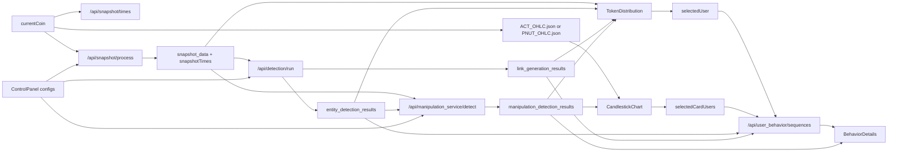

# Frontend View Data Dependencies

## Scope

This note maps the data dependencies of the ManiScope frontend views. It excludes the bottom-center recorded-action graph, implemented by `UserActionTree.vue`, because that graph view was explicitly out of scope.

The bottom-center `User Actions` and `Annotations` timeline tabs are included because they are list views rather than the recorded-action graph.

Primary source files:

- `front/src/components/CryptoVis.vue`
- `front/src/components/ControlPanel.vue`
- `front/src/components/TokenDistribution.vue`
- `front/src/components/CandlestickChart.vue`
- `front/src/components/BehaviorDetails.vue`
- `front/src/components/UserActionTimeline.vue`
- `front/src/components/AnnotationTimeline.vue`
- `front/src/components/ChatBox.vue`
- `front/src/utils/sessionIO.js`
- `front/src/utils/viewSnapshot.js`
- `front/server/snapshot_service.py`
- `front/server/detection_service.py`
- `front/server/manipulation_detection_service.py`
- `front/server/user_behavior_service.py`

## Overall Architecture

`CryptoVis.vue` is the state owner and orchestration layer. Most views are presentational or interaction-heavy components that receive state as props and emit events back to `CryptoVis.vue`.

The main refresh pipeline is:

1. Load available snapshot times for the selected coin from `/api/snapshot/times`.
2. Load the selected holder snapshot from `/api/snapshot/process`.
3. Run entity and link detection through `/api/detection/run`.
4. Run manipulation detection through `/api/manipulation_service/detect`.
5. Fan out the resulting state to Token Distribution, K-line, and Behavior Details.

## Data Sources

ACT data is under `front/public/data`. PNUT data is under `front/public/data2`.

| Data source | Used by | Purpose |
|---|---|---|
| `hourly_balance_snapshots.json` | `snapshot_service.py` | Holder balances by hourly snapshot. |
| `transfer_network_stats.csv` | `snapshot_service.py`, `detection_service.py` | Related-user discovery and network relation detection. |
| `sorted_transfers.csv` | `detection_service.py` | Direct transfer, funding, same-sender, and same-recipient relation detection. |
| `user_relations.json` | `detection_service.py` | Precomputed relation data used by network-based detection paths. |
| `user_actions.json` | `detection_service.py` | Trading action sequence similarity. |
| `user_balance_1min.json`, `user_balance_1h.json`, `user_balance_1d.json` | `detection_service.py` | Balance sequence similarity. |
| `user_earnings_1min.json`, `user_earnings_1h.json`, `user_earnings_1d.json` | `detection_service.py` | Earning sequence similarity. |
| `sorted_trades.csv` | `manipulation_detection_service.py` | Round-trip and same-direction manipulation detection. |
| `user_behavior_sequences.json` | `user_behavior_service.py` | Behavior Details timelines for selected users or card users. |
| `ACT_OHLC.json`, `PNUT_OHLC.json` | `CandlestickChart.vue` | K-line OHLC and volume data by granularity. |

## View Summary

| View | Component | Direct inputs | Backend or public data | Derived state |
|---|---|---|---|---|
| App shell, coin switch, export/import | `CryptoVis.vue` | `currentCoin`, session state, all dashboard state | `/api/snapshot/times`, `/api/snapshot/process`, `/api/detection/run`, `/api/manipulation_service/detect`, import files | Global state, refresh chain, snapshot capture routing, exported session archive. |
| Control Panel | `ControlPanel.vue` | Snapshot, entity, link, and manipulation configs; loading flags | None directly | Emits configuration actions to parent. |
| Token Distribution | `TokenDistribution.vue` | Snapshot data, entity results, link results, manipulation results | None in normal flow | Holder nodes, related-user ring, entity groups, relation links, suspicious-user highlights. |
| K-line and manipulation cards | `CandlestickChart.vue` | Current coin, manipulation results, sync target time window, sequential-time flag | `ACT_OHLC.json` or `PNUT_OHLC.json` | Aggregated OHLC, manipulation counts per bin, round-trip cards, same-direction cards, card mini timelines. |
| Behavior Details | `BehaviorDetails.vue` | Selected user, selected card users, behavior data, entity info, snapshot time, manipulation results, sync target time window | Behavior data fetched by parent from `/api/user_behavior/sequences` | Filtered event timelines, balance areas, earning bars, transfer lines, manipulation boxes. |
| User Actions timeline | `UserActionTimeline.vue` | `userActionSequence`, snapshot capture categories, snapshot quality | None | Action list cards, JSON detail panes, screenshot thumbnails. |
| Annotations timeline | `AnnotationTimeline.vue` | `annotationRecords` | None | Annotation list cards, selected item summaries, sketch thumbnails. |
| AI Chat | `ChatBox.vue` | Local chat messages and `VITE_OPENAI_API_KEY` | OpenAI Chat Completions API | Local chat transcript. It does not consume live dashboard state. |

## Per-View Dependencies

### App Shell And State Hub

Component: `CryptoVis.vue`

Responsibilities:

- Owns the selected coin, snapshot configuration, entity detection configuration, link detection configuration, and manipulation detection configuration.
- Owns all derived analysis state: `snapshot_data`, `entity_detection_results`, `link_generation_results`, `manipulation_detection_results`, `selectedUser`, `selectedCardUsers`, `behaviorDetailData`, `selectedEntityInfo`, `klineTimeWindow`, and `behaviorTimeWindow`.
- Owns investigation-session state: `userActionSequence`, `annotationRecords`, snapshot capture settings, export state, and import state.
- Coordinates all cross-view synchronization and action logging.

External dependencies:

- `/api/snapshot/times` for valid snapshot timestamps.
- `/api/snapshot/process` for current holder snapshot and related-user candidates.
- `/api/detection/run` for entity and link relations.
- `/api/manipulation_service/detect` for round-trip and same-direction manipulation events.
- `/api/user_behavior/sequences` for Behavior Details data after a user or card selection.

Important dependency behavior:

- `handleUpdateSnapshot()` runs snapshot loading, entity/link detection, and manipulation detection in sequence.
- `handleRunDetection()` reruns entity detection and may rerun manipulation detection if entity-based manipulation detection is enabled.
- `handleUpdateLinks()` reruns only link detection and then reapplies manipulation-based relation overlays.
- `processManipulationRelations()` converts manipulation results into entity or link relation maps when manipulation-based relations are enabled.
- `generateBehaviorDetailData()` expands a selected user through entity and link results before fetching behavior sequences.
- `handleManipulationCardClick()` bypasses relation expansion and fetches behavior sequences for the card participants.

### Control Panel

Component: `ControlPanel.vue`

Direct props:

- `snapshotConfig`
- `snapshotTimes`
- `entityConfig`
- `linkConfig`
- `manipulationConfig`
- `loading`
- `loadingLinks`
- `loadingManipulation`
- `lastResultCount`

External dependencies:

- None directly. All data loading happens in `CryptoVis.vue`.

Emitted events:

- `update-snapshot`
- `run-detection`
- `request-manipulation-detection`
- `update-links`
- `log-action`

Derived state:

- Local UI-only state for expanded/collapsed sections: `activeSection`, `activeManipulationSection`, and `activeLinkSection`.

Important dependency behavior:

- The component uses `v-model` directly on object props such as `snapshotConfig` and `entityConfig`. This means the parent-owned config objects are mutated before the user presses an action button. This currently works because the parent passes mutable objects, but it is an implicit dependency worth documenting.

### Token Distribution

Component: `TokenDistribution.vue`

Direct props:

- `snapshotData`
- `entityDetectionResults`
- `linkDetectionResults`
- `manipulationDetectionResults`

External dependencies:

- None in the normal app flow. There is a legacy `runManipulationDetection()` method that calls `/api/manipulation/detect`, but the main app path uses `CryptoVis.vue` and `/api/manipulation_service/detect`.

Derived state:

- `displayTime` from `snapshotData.time`.
- Active user count from `snapshotData.balances.users` and `snapshotData.balances.related_users`.
- Bubble radii from holder balances and the local `scaleFactor`.
- The "Others" ring from `snapshotData.balances.users.Others`.
- Entity group nodes from `entityDetectionResults`.
- Link overlays from relation maps in `linkDetectionResults`.
- Suspicious red strokes from participants in `manipulationDetectionResults`.
- Snapshot payload for `TokenSnapshot.vue`.

Emitted events:

- `user-selected` when a holder node is clicked.
- `log-action` for scale changes, link toggles, hovers, and hover cancellation.
- `snapshot-input` when a token snapshot annotation is saved.

Important dependency behavior:

- Entity groups are rendered by mapping `entityDetectionResults[].users` onto top-holder nodes. Single-member entity groups are dismantled and treated as independent nodes.
- Link overlays are read from `target_relations_for_links`, `target_related_relations_for_links`, and `target_related_relations_for_entity`.
- Manipulation results do not change graph structure, but they update node styling and tooltips through `suspiciousTraders`.
- Related users are included in the graph only if the snapshot service returned them in `snapshotData.balances.related_users`.

### K-Line And Manipulation Cards

Component: `CandlestickChart.vue`

Direct props:

- `manipulationResults`
- `currentCoin`
- `syncTargetTimeWindow`
- `isSequentialTime`

External dependencies:

- Fetches `front/public/data/ACT_OHLC.json` for ACT.
- Fetches `front/public/data2/PNUT_OHLC.json` for PNUT.

Derived state:

- `actOhlc`, despite the name, stores the loaded OHLC object for the active coin.
- `ohlc` stores the currently selected granularity series.
- `roundTripCount` and `sameDirectionCount` are added to each OHLC bin from `manipulationResults`.
- `aggregatedCards` groups manipulation results by OHLC bin and splits them into round-trip and same-direction cards.
- `topCards` and `bottomCards` are derived from `aggregatedCards`.
- Card mini charts are drawn from each card's raw manipulation transactions.
- Card-to-chart bands are drawn from card positions and the current K-line x-scale.

Emitted events:

- `time-window-changed` when the K-line zoom window changes.
- `card-click` with the clicked card's unique users.
- `log-action` for sync, granularity changes, hovers, card scrolls, and K-line alignment clicks.
- `snapshot-input` when a K-line snapshot annotation is saved.

Important dependency behavior:

- The K-line does not call the backend for OHLC. It loads static public JSON directly.
- Manipulation cards depend on both `manipulationResults` and the currently selected OHLC granularity because results are binned against `ohlc`.
- The K-line can synchronize to Behavior Details through `syncTargetTimeWindow`, but the sync button is disabled when Behavior Details is in sequential-time mode.
- `CryptoVis.vue` passes `selected-user` and `entity-info` to this component, but `CandlestickChart.vue` does not declare those props. Therefore the current K-line implementation does not actually depend on selected user or entity info.

### Behavior Details

Component: `BehaviorDetails.vue`

Direct props:

- `selectedUser`
- `selectedUsersList`
- `behaviorData`
- `entityInfo`
- `snapshotTime`
- `manipulationResults`
- `syncTargetTimeWindow`

External dependencies:

- No direct backend fetch. `CryptoVis.vue` fetches `/api/user_behavior/sequences` and passes the resulting `behaviorData`.

Parent-side behavior data dependencies:

- In single-user mode, `CryptoVis.vue` starts with `selectedUser`.
- It expands the user set through `entity_detection_results` if the selected user is inside an entity.
- It expands the user set through `link_generation_results.target_relations_for_links` and `link_generation_results.target_related_relations_for_links`.
- It fetches all expanded users from `/api/user_behavior/sequences`.
- In manipulation-card mode, it fetches exactly the card users.

Derived state:

- `usersToDraw` from `behaviorData`, `selectedUsersList`, `showRelatedUsers`, and `selectedUser`.
- `sortedUsers`, with selected user centered and entity members placed nearby in single-user mode.
- `filteredData`, filtering events to `event.timestamp <= snapshotTime`.
- Per-user balance sequences from transfer and trade events.
- Per-user earning events from sell trades and weighted average buy price.
- Manipulation boxes from `manipulationResults` where participants overlap the currently drawn users.
- Transfer lines where both transfer counterparties are visible.
- Snapshot payload for `BehaviorSnapshot.vue`.

Emitted events:

- `time-window-changed` when absolute-time zoom changes.
- `user-selected` when a user label is clicked.
- `log-action` for toggles, hovers, sync, and sequential-time zoom.
- `snapshot-input` when a behavior snapshot annotation is saved.

Important dependency behavior:

- `Sequential Time` changes the x-axis from absolute time to an ordered timestamp index. In this mode, the component logs zoom events itself rather than emitting a synchronizable absolute time window.
- `Show Related Users` only matters in single-user mode. In card mode, `selectedUsersList` controls the users.
- Manipulation boxes are visual overlays only; the detection results are computed outside the component.

### User Actions Timeline

Component: `UserActionTimeline.vue`

Direct props:

- `actions`
- `snapshotCategories`
- `snapshotQuality`

External dependencies:

- None.

Derived state:

- Formatted action labels.
- Formatted source and target view names.
- Expanded JSON details for `actionInfo` and `relatedViewWithViewState`.
- Source and target screenshot thumbnails from `action.sourceSnapshot` and `action.targetSnapshot`.

Emitted events:

- `toggle-category`
- `change-quality`

Important dependency behavior:

- The timeline is purely session-state driven. It displays what `CryptoVis.vue` logged, including screenshots captured by `viewSnapshot.js`.
- The snapshot settings it exposes mutate `CryptoVis.vue` capture behavior for future logged actions.

### Annotations Timeline

Component: `AnnotationTimeline.vue`

Direct props:

- `annotations`

External dependencies:

- None.

Derived state:

- Formatted annotation time.
- Formatted source view name.
- Selected item count summaries.
- Expanded selected-item JSON.
- Sketch thumbnails and full sketch previews.

Important dependency behavior:

- Annotation records are created in `CryptoVis.vue` from snapshot modals in Token Distribution, K-line, and Behavior Details.
- This view does not inspect the underlying chart data. It only renders the saved annotation payload.

### AI Chat

Component: `ChatBox.vue`

Direct state:

- Local `messages`
- Local `inputText`
- Local `loading`
- Local `errorMsg`

External dependencies:

- `VITE_OPENAI_API_KEY`
- `https://api.openai.com/v1/chat/completions`

Derived state:

- Rendered chat transcript.

Important dependency behavior:

- The system prompt contains a static ManiScope manual excerpt.
- The chat does not receive live props from `CryptoVis.vue`, so it cannot directly inspect current selected coin, selected users, detection results, chart windows, actions, or annotations unless that context is manually typed by the user.

## Snapshot And Export Dependencies

Three main chart views can open annotation snapshots:

- Token Distribution uses `TokenSnapshot.vue`.
- K-line uses `CandlestickSnapshot.vue`.
- Behavior Details uses `BehaviorSnapshot.vue`.

`viewSnapshot.js` is used for automatic action screenshots. Its dependencies are DOM-oriented:

- It maps action view names such as `kline_chart` to DOM panels such as `candlestick_chart`.
- It skips `system`, `all_views`, and `control_panel` as direct capture targets.
- It delegates K-line capture to `CandlestickChart.captureImage()` when available.
- It serializes SVG for Token Distribution and Behavior Details, except Token Distribution hover actions use full DOM capture so HTML tooltips are included.

`sessionIO.js` handles session export/import:

- It builds a `session.json` payload from `userActionSequence`, `annotationRecords`, snapshot capture config, and metadata.
- If snapshots are included, it extracts PNG images into `images/`.
- It restores image data URLs from ZIP imports.

## Important Couplings And Risks

1. `ControlPanel.vue` mutates object props directly through `v-model`. This creates an implicit dependency on parent object mutability.
2. `TokenDistribution.vue` declares `entityDetectionResults` as `Object` but treats it as an array.
3. `CandlestickChart.vue` receives `selected-user` and `entity-info` from the parent, but it does not declare or use them.
4. `TokenDistribution.vue` still contains a legacy manipulation-detection method that calls `/api/manipulation/detect`, while the active app path uses `/api/manipulation_service/detect`.
5. `BehaviorDetails.vue` depends on parent-side expansion logic for related/entity users. Reading the component alone will not reveal how its `behaviorData` user set is chosen.
6. Manipulation-based relations are computed client-side in `CryptoVis.vue` from manipulation results and then merged into `link_generation_results`. This means relation overlays are not always raw backend output.

## Bottom Line

The frontend has a hub-and-spoke data architecture. `CryptoVis.vue` owns the investigation state and backend orchestration. Token Distribution, K-line, and Behavior Details render different projections of the same snapshot, detection, manipulation, and behavior-sequence state. The bottom-center timelines render session metadata generated by user interactions, while the excluded Action Tree graph renders the same session state as a visual graph.
