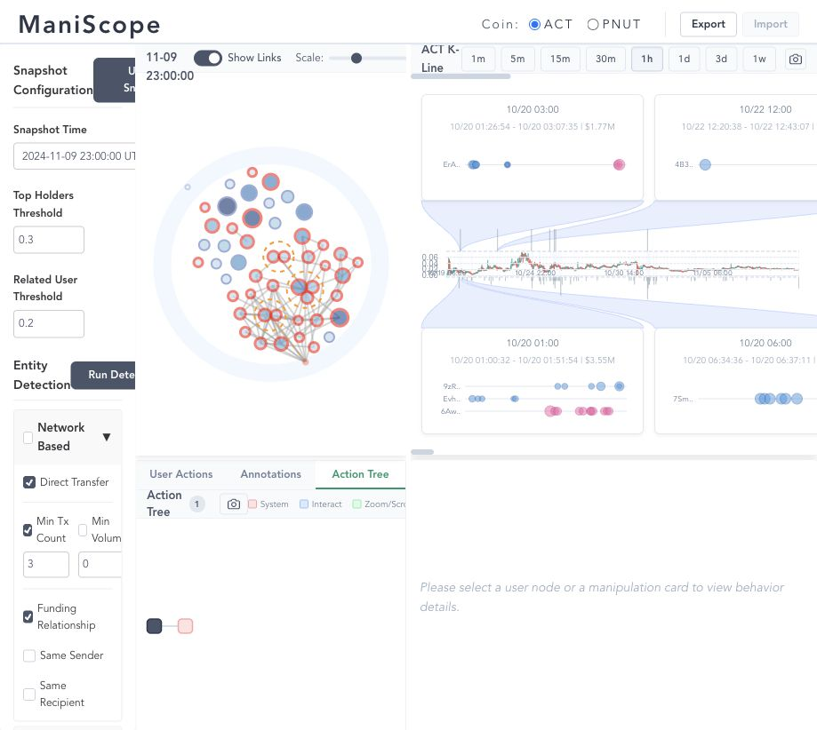
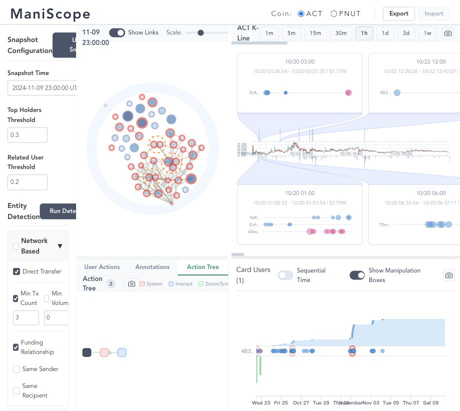
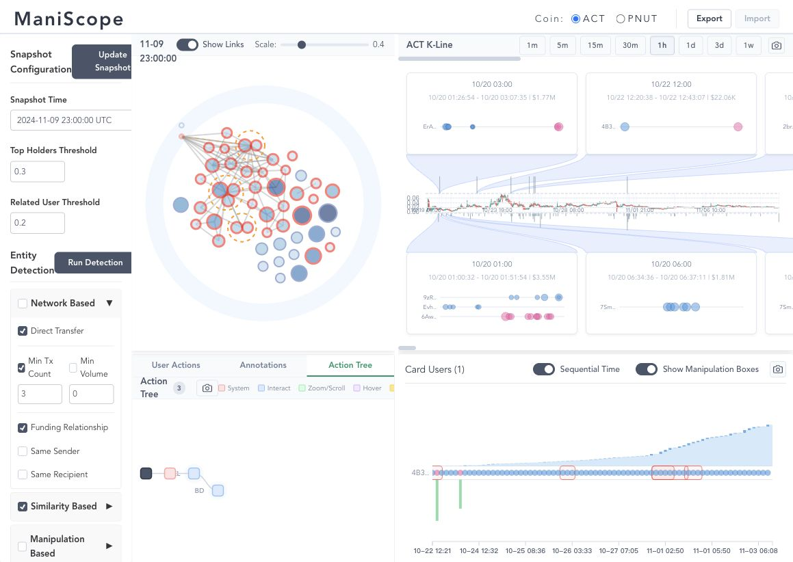
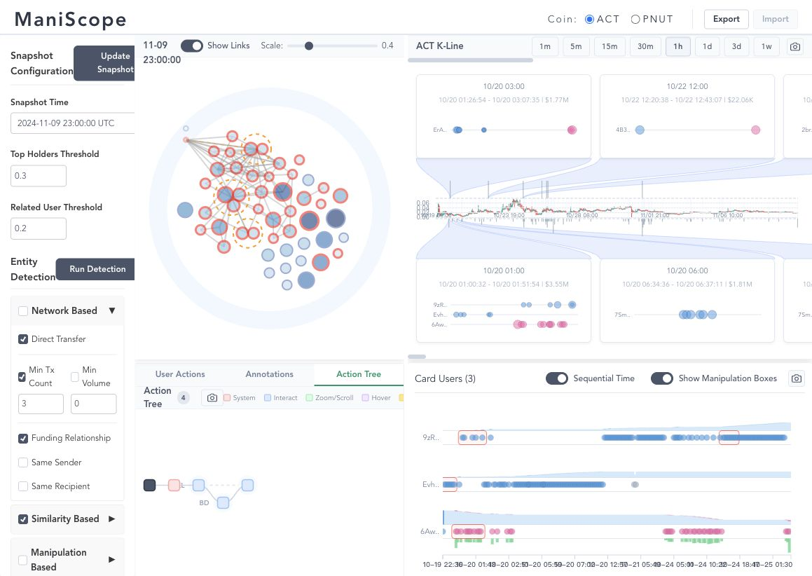
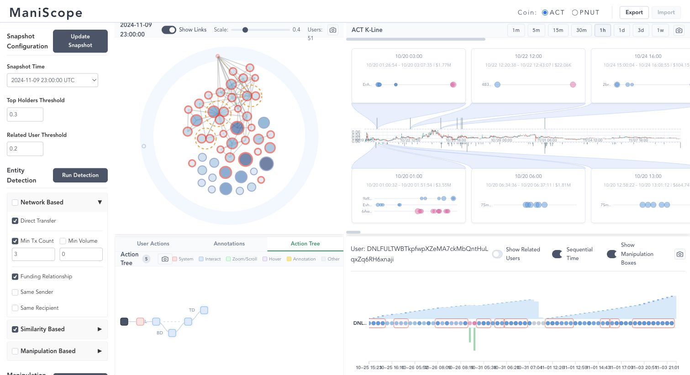
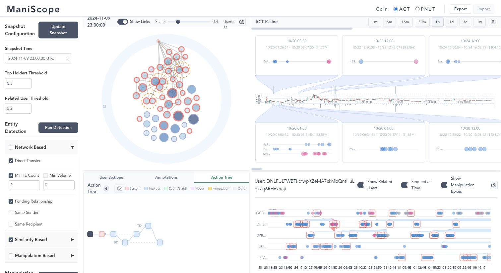
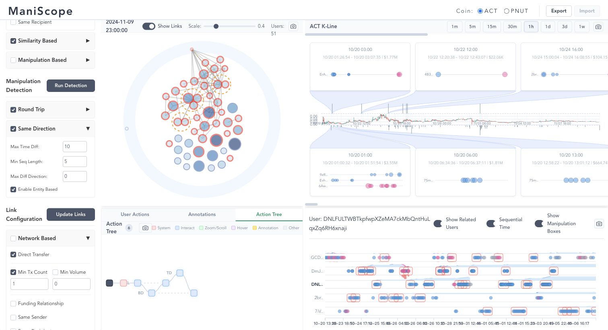

# ACT Dataset GUI Investigation

Date: 2026-04-25  
Tool: ManiScope at `localhost:3000`  
Browser scale: reduced from default to approximately 67% with four `Ctrl` + `-` zoom steps  
Dataset: ACT

## Scope

This report records a GUI-first investigation of the ACT dataset. I used `user-manual.en.md` to understand the intended workflow, then inspected the website through the browser interface. I did not use repository code or raw data files to analyze the market. The conclusions below are based on what was visible in ManiScope.

The question I focused on was whether ACT shows price-manipulation signals under the visible ManiScope configuration.

## Actions Taken

1. Opened `user-manual.en.md` and noted the recommended workflow: select the coin, inspect Token Distribution, inspect K-line manipulation cards, click suspicious users or manipulation cards, then compare Behavior Details.
2. Opened `http://localhost:3000`.
3. Reduced browser zoom to approximately 67% so the three-column dashboard could be viewed at once.
4. Confirmed ACT was selected in the header.
5. Used the latest visible snapshot, `2024-11-09 23:00:00 UTC`, with `Top Holders Threshold = 0.3`, `Related User Threshold = 0.2`, `Show Links` on, graph scale near `0.4`, and `Users = 51`.
6. Inspected the Token Distribution and K-line overview.
7. Selected a visible round-trip manipulation card at `10/20 03:00`.
8. Enabled Sequential Time for the selected round-trip behavior view.
9. Selected a same-direction manipulation card at `10/20 01:00`.
10. Selected a prominent red-stroked holder node from the Token Distribution graph.
11. Enabled Show Related Users for that selected holder.
12. Scrolled the control panel to confirm the visible manipulation-detection rules.

## Screenshots

### 1. ACT Overview At 67% Scale

The overview shows ACT selected, snapshot `2024-11-09 23:00:00 UTC`, `Show Links` enabled, and `Users = 51`. The Token Distribution view contains a dense cluster of red-stroked nodes. According to the manual, red strokes indicate users involved in detected manipulation results under the current rules. The graph also shows orange dashed entity boundaries and many grey link overlays, which suggests the flagged wallets are not isolated one-off accounts.

The K-line view shows multiple manipulation cards connected to specific candlestick intervals. Visible examples include:

- Round Trip at `10/20 03:00`, with span `10/20 01:26:54 - 10/20 03:07:35` and approximately `$1.77M`.
- Round Trip at `10/22 12:00`, with span `10/22 12:20:38 - 10/22 12:43:07` and approximately `$22.06K`.
- Same Direction at `10/20 01:00`, with span `10/20 01:00:32 - 10/20 01:51:54` and approximately `$3.55M`.
- Same Direction at `10/20 06:00`, with span `10/20 06:34:36 - 10/20 06:37:11` and approximately `$1.81M`.

Initial interpretation: ACT has broad manipulation signals, not just a single suspicious interval.

### 2. Round-Trip Card Behavior

I clicked the `10/20 03:00` Round Trip card. Behavior Details switched to `Card Users (1)`. The selected card user row shows repeated action points and a large balance step pattern. The row is aligned with the K-line card that reports approximately `$1.77M`.

This supports a manipulation signal because the card is not just a marker on the price chart. Clicking it exposes the underlying wallet behavior that ManiScope associated with the event.

### 3. Round-Trip Behavior In Sequential Time

After enabling Sequential Time, the same selected user showed a long ordered sequence of repeated actions and multiple red manipulation boxes on the behavior row. This view is useful because it separates event order from absolute time. The repeated boxed pattern supports the idea that the wallet behavior is structured rather than accidental.

This is moderate evidence of manipulation. It is still one card user, so by itself it is weaker than a multi-user coordination signal, but it confirms that the round-trip detector is attached to a recognizable behavior sequence.

### 4. Same-Direction Card Users

I clicked the `10/20 01:00` Same Direction card. Behavior Details switched to `Card Users (3)`. This is stronger evidence than the one-user round-trip card because the view shows three participant rows with dense action sequences and manipulation boxes.

The rows appear to share clustered activity during the selected event window. Under the manual's definition, Same Direction detection flags consecutive same-side actions, and here the GUI shows the detector grouping multiple users into the card. This suggests coordinated or entity-level behavior rather than a single wallet acting alone.

### 5. Selected Red-Stroked Holder

I selected a prominent red-stroked holder node from the Token Distribution graph. Behavior Details switched from card mode to a single selected user:

`DNLFULTWBTkpfwpXZeMA7ckMbQntHuLqxZq6RH6xnajj`

The selected holder has a long repeated behavior sequence with several red manipulation boxes. This confirms that the red node encoding in the distribution graph maps to detailed manipulation evidence in the behavior panel.

### 6. Selected Holder With Related Users

I enabled Show Related Users for the selected holder. The behavior panel expanded into multiple related wallet rows. Several rows show repeated blue and pink action points with red manipulation boxes at overlapping periods.

This is one of the strongest screenshots in the investigation. It connects three layers of evidence:

- A red-stroked holder in the Token Distribution graph.
- Related wallet rows in Behavior Details.
- Repeated manipulation boxes across several related wallets.

The pattern is consistent with coordinated behavior or a shared entity structure.

### 7. Manipulation Detection Settings

The visible settings confirm both manipulation rule families were enabled:

- Round Trip: enabled.
- Same Direction: enabled.
- Same Direction settings: `Max Time Diff = 10`, `Min Seq Length = 5`, `Max Diff Direction = 0`, `Enable Entity Based` checked.

The earlier visible Round Trip settings showed `Max Time Diff = 120`, `Max Position Diff = 100`, `Max Earning = 1000`, and `Enable Entity Based` checked.

These settings matter because the evidence is produced by active default detector rules, including entity-based detection. The conclusion should therefore be read as "ACT shows manipulation signals under ManiScope's current default rules", not as a final legal or forensic proof.

## Findings

ACT shows strong manipulation signals in ManiScope.

The main reason is convergence across multiple views. The Token Distribution view marks many ACT holders with red manipulation strokes and places many of them inside a dense linked cluster. The K-line view shows multiple manipulation cards tied to specific price intervals, including high-value visible cards around `10/20`. The Behavior Details view then confirms that selected cards and holders contain repeated action sequences and manipulation boxes.

The same-direction evidence is especially strong because the selected `10/20 01:00` card contains three card users, not just one wallet. Related-user inspection also shows several wallets with overlapping boxed behavior. This makes the ACT case look more like coordinated trading behavior than isolated noise from a single active wallet.

## Cautions

The GUI evidence is persuasive, but it is not a complete proof of malicious manipulation. The result depends on the active thresholds, especially entity-based merging. A formal claim would need raw trade-log validation, address-level provenance, and sensitivity tests with stricter and looser detection settings.

The practical conclusion from the GUI is that ACT should be treated as a high-priority manipulation-risk dataset. The visible evidence justifies deeper forensic review.
