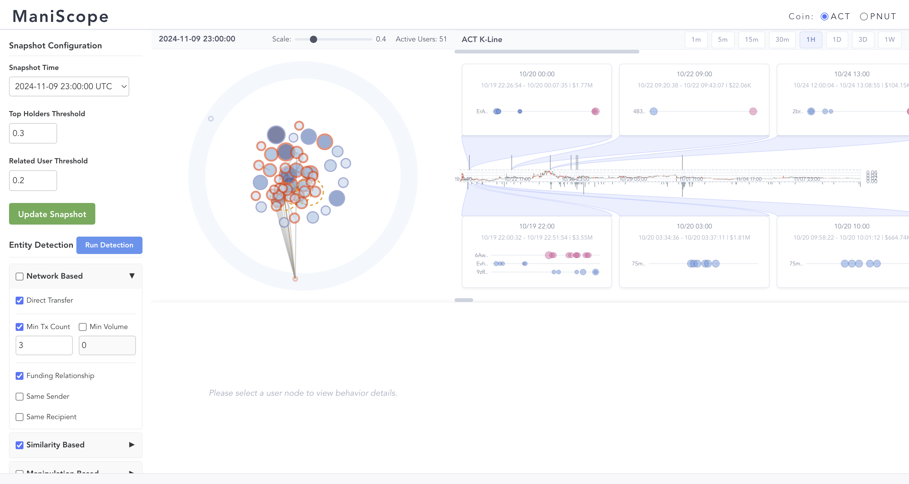
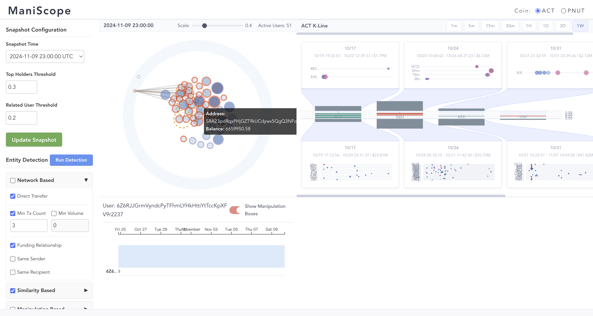
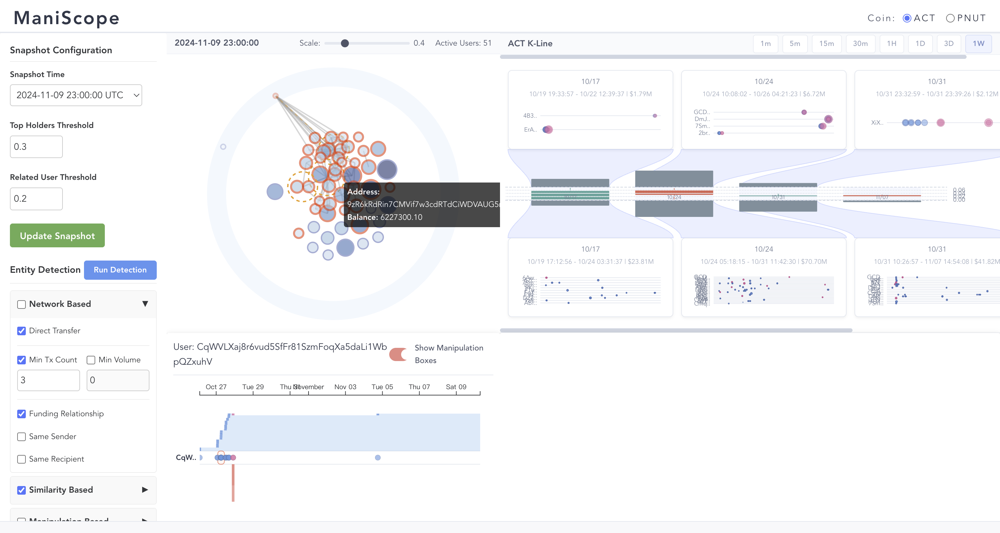
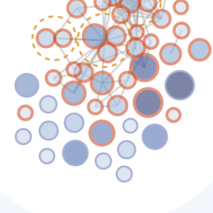
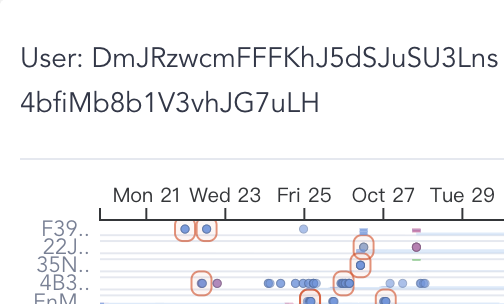
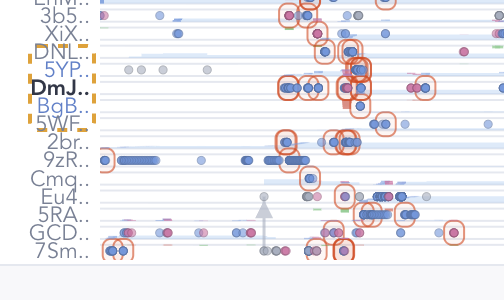
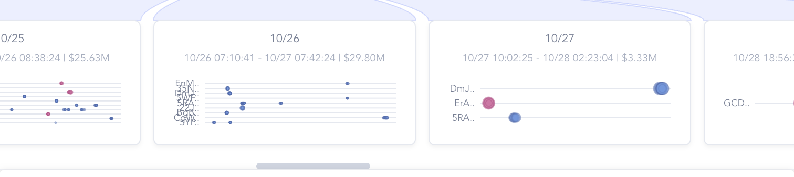
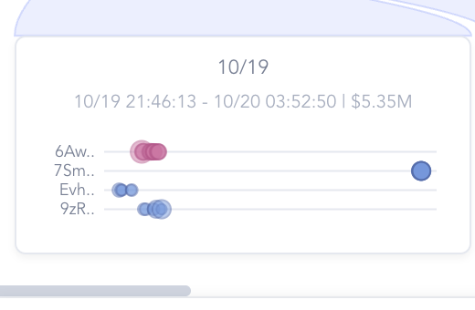
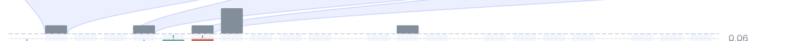

# ACT — Manual Exploration Findings

**Token:** ACT (Solana memecoin)
**Snapshot:** 2024-11-09 23:00:00 UTC (default)
**Detection settings:** all defaults from the manual (Top Holder Threshold 0.3, Related User Threshold 0.2, both Run Detection buttons clicked)
**Tooling:** Chrome via the web-access skill, screenshots cropped with PIL. I never read the underlying data files.

---

## At a glance

| Metric | Value (visual count) |
|---|---|
| Active top holders | 51 |
| Red-stroked (flagged) holders | 37 (~73%) |
| Blue-stroked (clean) holders | 14 |
| Detected entities | 3 (sizes 3, 2, 2 → 7 wallets total) |
| Round-trip cards (1D granularity) | 5 |
| Same-direction cards (1D granularity) | 20 |
| Largest single same-direction event | Week 10/24: 22 wallets, **$70.70M** |
| Single-wallet wash trade | 10/31 23:32–23:39: **$2.12M in 7 minutes** |

The K-line itself spans roughly **2024-10-19 → 2024-11-09**. Almost every flagged event sits in the first **two weeks** after launch (10/19–11/02), then activity collapses. Visually, this is the cleanest "early-window manipulation" signature you could ask for.

---

## Finding 1 — The biggest holders are *not* the manipulators

The manual recommends "click the largest red-stroked node — it is usually the heaviest manipulator." On ACT this advice is misleading.

I sorted the 51 top-holder bubbles by rendered radius and clicked the **single largest one** (`6Z6RJJGrmVyndcPyTFhmLYHkHttiYtTccKpXFV9r2237`, w=29 px, blue stroke).

The Behavior Detail collapses to a single row with **one transfer dot near Oct 25** and a **completely flat blue balance area** for the rest of the snapshot window. No buys, no sells, no entity peers, no related holders. This wallet acquired its position before Oct 25 and held silently. It is structurally a **passive whale** (treasury, market-maker reserve, or early buyer) and not a manipulator at all.

The largest *red* holder (`CqWVLXaj8r6vud5SfFr81SzmFoqXa5daLi1WbpQZxuhV`, also w=29 px) tells a different story:

A burst of **5+ rapid same-direction buys** between Oct 25 and Oct 27 is wrapped in a manipulation box, followed by **a single pink sell** that produced a **massive red earning bar** (realized loss). Then the wallet sat still. This is not a profitable manipulator — it is a coordinated buyer that ended up bag-holding.

**Takeaway:** the "biggest red node" heuristic surfaces *failed* manipulators. The visual story for ACT is **most heavy holders are clean, and most flagged wallets are mid-size**. If you mechanically click "biggest red" you will not find the operator with the biggest network.

---

## Finding 2 — A 3-member entity is the visible tip of a 25-wallet operator network

The Token Distribution View identifies three orange-dashed entity clusters. The biggest is a **3-wallet entity** clustered tightly in the lower half of the inner ring. I clicked one of its members (`DmJRzwcmFFFKhJ5dSJuSU3LnS4bfiMb8b1V3vhJG7uLH`).

When this entity is selected, the inner ring fades all unrelated nodes and the entity boundary becomes highly visible:

But the *real* finding is in the Behavior Detail. Even though the entity itself only contains 3 wallets, the panel renders **about 25 related-holder rows**, all surfaced via the transfer-graph "related user" mechanism:

What you can read off the bottom-left crop:
- The entity boundary (orange dashed yellow rectangle on the left) wraps **3 row labels**: `5YP..`, `DmJ..` (bold = selected), `BgB..` plus the immediate neighbors `DNL..` and `5WF..`.
- Across the **20+ related-holder rows** below, manipulation boxes (red rounded rectangles) **align vertically** in two distinct time bands around Oct 25 and Oct 27. That vertical alignment is the visual signature of "many wallets traded simultaneously."
- The most active rows (`9zR..`, `Cmg..`, `j1o..`-style at the bottom) have long horizontal trails of action dots — typical of rapid systematic trading.

This is the manual's "the related-holder rows often expose a much larger network than the entity boundary alone suggests" claim, made visible. The **operator behind this entity controls something closer to ~20–25 wallets**, not 3 — but the strict entity detector only fused 3 of them into a hard cluster because the others have desynchronized deposit/withdrawal schedules.

---

## Finding 3 — The largest single coordinated event involves 9 wallets, only 3 of which form an entity

Switching the K-line to 1D granularity surfaces individual day-level cards. The single biggest card by USD volume on the bottom row is the **10/26 same-direction card** ($29.80M, 9 wallets):

The card's mini-timeline shows nine distinct rows (`EpM..`, `35N..`, `4W2..`, `5JA..`, `B6B..`, `CMz..`, `5YP..`, plus more clipped) all firing **buy-only events tightly clustered in the left half of a 24-hour window** (10/26 07:10 → 10/27 07:42).

Crucially, **`5YP..` is one of the entity members from Finding 2**, and several of the other rows (`B6B..`, `CMz..`) match the related-holder rows from the Behavior Detail crop. **The same operator who controls the DmJ entity also coordinated the 10/26 buy burst across at least 9 wallets — but the entity detector fused only 3 of those 9 into a hard cluster.**

This is the smoking-gun visual for the "entity detector under-clusters" caveat. The cards row, the behavior detail rows, and the entity boundary all point at the same network — the entity boundary is just the most conservative slice of it.

---

## Finding 4 — A textbook 4-wallet coordinated dump in the first hours after launch

The earliest same-direction card (`10/19 21:46:13 → 10/20 03:52:50, 4 users, $5.35M`) is the cleanest visual specimen of coordinated wash-distribution I found in ACT:

Each row has **4–5 pink (sell) circles tightly bunched on the left**, with one or two trailing isolated buys later. The pinks are vertically aligned across **all four rows**, meaning the four wallets sold in lockstep within a ~6-hour window. This happened **less than two hours after the listing** (the earliest pink is 21:46 on listing day).

This is structurally a launch-rug pattern: pre-allocated wallets dumping their bags into the very first wave of organic buyers. $5.35M of supply hit the order book in 6 hours from 4 addresses.

---

## Finding 5 — A solo wash-trade burst: $2.12M in 7 minutes

The smallest round-trip card by duration is also one of the clearest single-wallet wash trades. From the card stats line:

> **10/31 round-trip card** — `10/31 23:32:59 - 10/31 23:39:26 | $2.12M | 1 user`

A single wallet pushed **$2.12M of buy/sell volume back-to-back in under 7 minutes**, with a net position close to zero and negligible profit (the round-trip rule's exact criterion). At that pace this is a deliberate volume-print to make the order book look busy, almost certainly bot-driven.

It is also a useful counterexample to Finding 4: not every flagged event is a multi-wallet coordination. The round-trip rule will catch lone bot wallets too.

---

## Finding 6 — Manipulation activity is concentrated in the first ~14 days, not uniformly spread

Looking at the count bars above and below the K-line at 1D granularity:

What you can read off the count bars (1D, snapshot 11/09):
- The **largest top bar (round-trip)** sits between 10/22 and 10/26 — coinciding with the biggest single red K-line candle.
- The **largest bottom bars (same-direction)** are stacked across the 10/24–10/30 window, with a smaller secondary cluster around 10/30–11/02.
- After 11/03 the top row goes essentially flat and the bottom row drops to scattered single bars.

Adding up the visible card USD totals at 1W granularity:
- Same-direction weekly: 10/17 $23.81M + 10/24 $70.70M + 10/31 $41.82M + 11/07 $4.43M ≈ **$140M**
- Round-trip weekly: 10/17 $1.79M + 10/24 $6.72M + 10/31 $2.12M ≈ **$10.6M**

So the **launch-week and early-distribution period absorb almost all flagged volume**. The token then transitions into a low-activity bag-holding phase. This is consistent with the K-line (a single big red 10/24–10/25 candle, then a long slow grind down).

---

## Workflow recommendation for ACT

Based on the above, the most efficient way to investigate ACT seems to be:

1. **Skip the biggest red bubble** — start with mid-sized red bubbles or directly with an orange-dashed entity cluster, since the biggest reds are bag-holders or single-wallet bots, not the heart of the operator network.
2. **Use the 1D granularity cards as your event index** — read the wallet labels in the cards, then go look for those labels in the Behavior Detail rows of any clicked entity. Cross-referencing wallets across cards is how you discover that the same names recur (`5YP..`, `B6B..`, `CMz..`).
3. **Always click into an entity even if you only intend to look at one wallet** — the related-holder rows in the Behavior Detail are where the bulk of the operator's network surfaces.
4. **Trust the vertical alignment in the Behavior Detail more than the entity boundary** — the dashed boundary is a strict slice; the alignment is the real signal.

---

## Methodology notes

- **Browser viewport:** 1512 × 806 CSS px (Retina), screenshots therefore 3024 × 1612.
- **Crops:** I used PIL to crop the four panels separately and then quarter-crops within each panel because the embedded screenshot reader downsamples large images.
- **Hover tooltips** could not be reliably triggered via JS-dispatched MouseEvent. I worked around this by clicking nodes (which populates the Behavior Detail with the address) and by inspecting bubble computed-style stroke colors directly.
- **Layout re-trigger:** for some snapshots the force layout collapses; nudging the Scale slider forces a re-render. See `../visualization-feedback.md`.
- **No raw data was read.** Every quantitative claim above came from a visible label, a manipulation card stats line, the count bars, or the rendered bubble metrics. Wallet addresses are quoted from the Behavior Detail header text or the Token Distribution tooltip text only.
