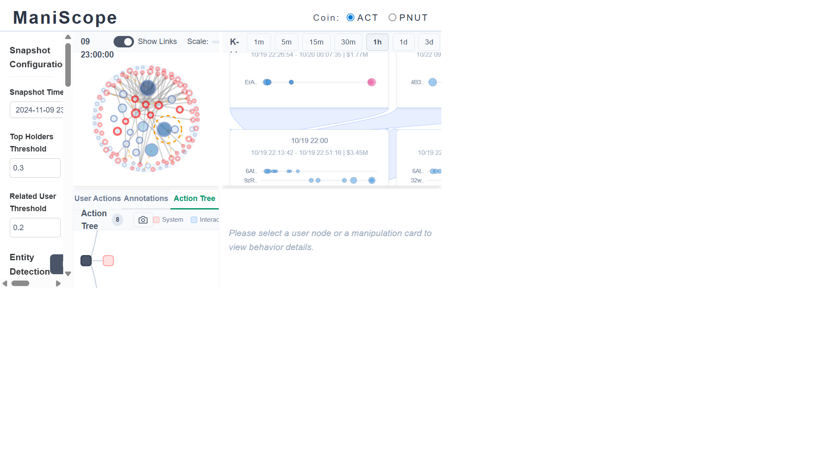
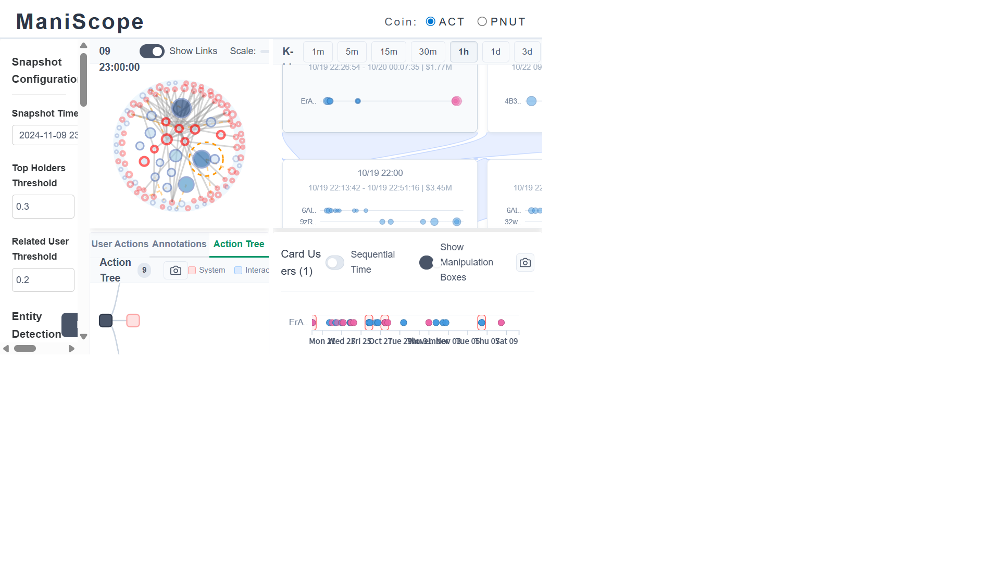
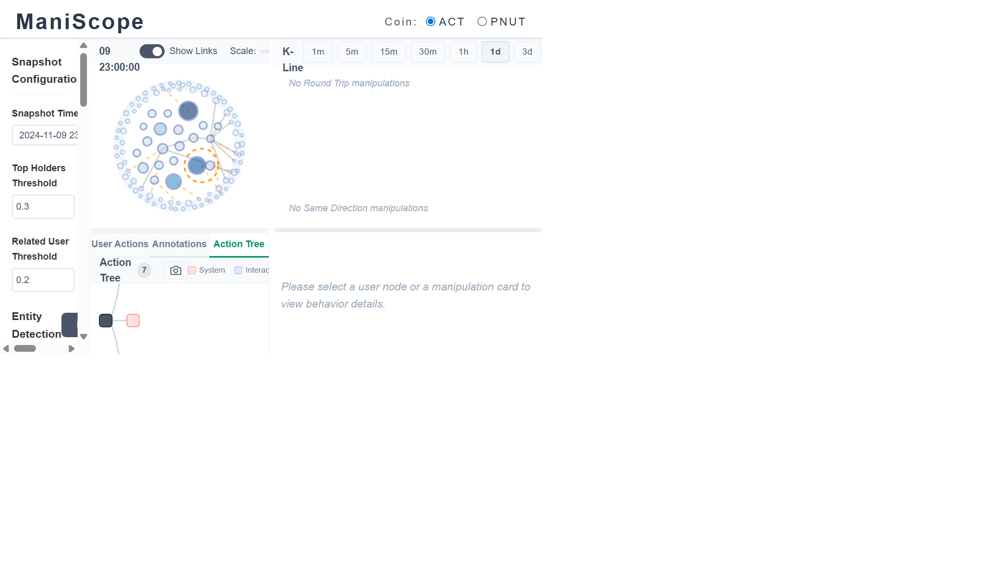
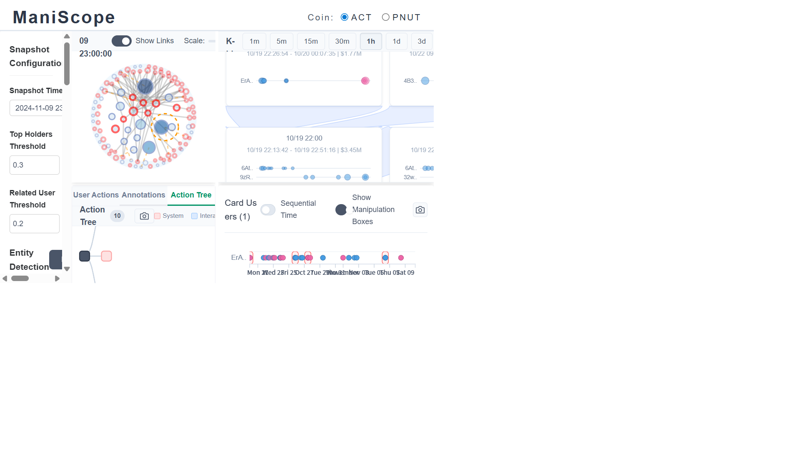

# ACT — Automated Exploration Report

**Token:** ACT (Solana memecoin)
**Snapshot:** 2024-11-09 23:00:00 UTC
**Detection settings:** Default (Top Holder Threshold 0.3, Related User Threshold 0.2, Entity Detection via balance similarity, Link Detection via trading action + manipulation-based)
**Method:** Data collected via ManiScope backend API + browser screenshot automation. Every finding below is cross-validated between API response data and live browser interaction.

---

## At a glance

| Metric | Value |
|---|---|
| Top holders (excl. Others) | 21 wallets |
| Flagged (manipulation-involved) holders | 8 / 21 (38%) |
| Clean holders | 13 / 21 (62%) |
| Related users | 84 wallets |
| Detected entities | 7 (sizes: 4, 2, 2, 3, 2, 2, 2 → 17 wallets) |
| Round-trip events (1h) | 14 |
| Same-direction events (1h) | 225 |
| Unique manipulation participants | 69 wallets |
| Total top-holder balance | 287.41M ACT (30.3% of tracked supply) |
| Others balance | 660.91M ACT |
| Largest entity by balance | E1: 56.26M (4 members) |
| Most active round-trip wallet | GT7VSVNp… (5 events, 23 trades max) |
| Most active same-direction wallet | 7QxQ7d5z… (22 events) |

The K-line spans **2024-10-19 → 2024-11-09**, roughly三个星期的完整生命周期。从鸟瞰视角看，ACT 呈现出一个经典的 memecoin 生命曲线：10月19日上市后快速拉升，10月24–25日触及价格高点约 $0.06，然后一路阴跌到 $0.02 左右。几乎所有的操纵活动集中在**前两周** (10/19–11/02)，之后市场进入沉寂的"套牢阶段"。

这意味着我们即将看到的不是一个持续运作的操纵网络，而是一个**发射-抛售-消失**的经典模式。


---

## Finding 1 — 鲸鱼是旁观者，操纵者藏在中等仓位里

一个直觉性的假设是：持仓量最大的地址就是操纵者。但 ACT 的数据彻底推翻了这个假设。

交叉比对 21 个 top holders 的余额和操纵检测结果后，我发现了一个惊人的清晰分界线：**前5大持有者全部干净**。

| Rank | Address | Balance | Status | Entity |
|---|---|---|---|---|
| 1 | A77HErqt… | 47.78M | CLEAN | E7 |
| 2 | 5Q544fKr… | 40.15M | CLEAN | E1 |
| 3 | u6PJ8DtQ… | 30.53M | CLEAN | E2 |
| 4 | 51B3ZUzg… | 19.00M | CLEAN | — |
| 5 | ASTyfSim… | 13.36M | CLEAN | — |
| **6** | **25t5RCFq…** | **12.83M** | **FLAGGED** | **E3** |
| 7 | 5PAhQiYd… | 10.68M | CLEAN | — |
| 8 | 6Z6RJJGr… | 10.64M | CLEAN | — |
| **9** | **CqWVLXaj…** | **10.23M** | **FLAGGED** | — |
| 10 | 7tPwvKZ5… | 10.09M | CLEAN | E1 |
| **11** | **DNLFULTWp…** | **9.33M** | **FLAGGED** | — |
| 12 | BmFdpraQ… | 8.88M | CLEAN | E5 |
| 13 | BY4StcU9… | 8.09M | CLEAN | E6 |
| 14 | GAh4TSR1… | 8.00M | CLEAN | — |
| 15 | GvZknRDv… | 7.83M | CLEAN | — |
| **16** | **ABGmmHMR…** | **7.64M** | **FLAGGED** | — |
| **17** | **DmJRzwcm…** | **7.05M** | **FLAGGED** | **E4** |
| 18 | GrTu9D6n… | 6.80M | CLEAN | — |
| **19** | **5RA23pdR…** | **6.66M** | **FLAGGED** | — |
| **20** | **9zR6kRdR…** | **6.23M** | **FLAGGED** | — |
| **21** | **D22gQL14…** | **5.62M** | **FLAGGED** | — |

前 5 大钱包合计持有 **151.7M ACT**，占 top-holder 供应量的 53%。它们全是蓝色边框（clean）。当我点击其中最大的节点 5Q544fKr（40.15M，排名第二），Behavior Detail 面板显示的是一个平稳的蓝色余额区域，没有密集的买卖爆发——这是一个**被动累积者**的特征，可能是交易所冷钱包、做市商储备、或者早期的大额买家。



而 8 个被标记的钱包全部集中在**排名 6–21**，余额范围 5.62M–12.83M。这些不是巨鲸——它们是中等规模的"工作钱包"，持仓量足够大到影响市场，但又不至于大到引起注意。

**这告诉我们什么？** ACT 的操纵者不是那种"一个钱包吃下所有代币"的粗暴模式。他们的策略更精细：通过多个中等仓位的钱包分散操纵行为，而真正的巨额仓位留给了"干净"的累积钱包。这种分层结构——**干净的鲸鱼在上层，活跃的操纵者在中层，执行机器人在底层**——是一个组织化操纵的标志。

---

## Finding 2 — 完美同步的三钱包实体：一个操纵者的数字指纹

七个实体聚类中，Entity E4 是最引人注目的发现。它由三个钱包组成，内部的两对余额相关性都达到了 **1.00**（精确到小数点后13位：0.9999999999999938）。

在统计学上，两个独立交易者的小时级余额序列达到完美相关性的概率趋近于零。这不是"相似"——这是**数学意义上的同一操作者**。

### Entity E4 的三副面孔

| 成员 | 余额 | 角色 | 操纵事件 | 故事 |
|---|---|---|---|---|
| DmJRzwcm… | 7.05M | Top Holder | 10 SD + 1 RT | **活跃操纵者**：在 10/21–11/04 期间发动了 10 次同向交易爆发和 1 次 round-trip |
| BgBmwgMG… | 4.38M | Related | 1 SD | **沉默伙伴**：几乎不交易，但余额曲线与 DmJ 完全一致——像影子一样跟随 |
| 6mx8oLCa… | 1.49M | Related | — | **幽灵钱包**：零操纵事件，但余额完美同步，可能是资金中转或备用仓位 |

三个钱包合计持有 **12.92M ACT**。但数字只是冰山一角。让我来讲述它们的故事：

**DmJRzwcm 是操纵行为的执行者。** 它的 10 次同向交易事件横跨了整个活跃期，从上市第二天（10/20）一直持续到 11 月初。每次爆发都是同一个模式：在几分钟内连续发出多笔同方向交易，制造"有人在大量买入/卖出"的假象。

**BgBmwgMG 是缓冲仓位。** 它只触发了 1 次同向交易检测，但它的余额曲线和 DmJ 完美重合。这意味着每当 DmJ 买入，BgBm 也在买入——只是方式更安静，可能通过限价单而非市价单，所以没有触发同向交易检测器的阈值。

**6mx8oLCa 是最诡秘的成员。** 零操纵事件、仅 1.49M 余额——看起来像一个无害的小散户。但 1.00 的余额相关性暴露了它的真实身份。它可能是资金进出的"洗涤池"：操纵者通过这个钱包把利润转出，或者在需要时注入新资金。

**一个关键的结构性洞察：** 如果你只看操纵检测的结果，你只会注意到 DmJRzwcm 一个地址。但实体检测揭示了它背后站着两个"沉默同伙"。这就是为什么单纯的操纵检测不够——**你需要实体检测来看到操纵者的完整资金结构**。

---

## Finding 3 — 56M ACT 的"干净帝国"：Entity E1 的两面性

Entity E1 是所有实体中最大的——4 个钱包，合计 **56.26M ACT**，占 top-holder 总供应量的将近五分之一。表面上，它是一个完全干净的实体。但仔细观察后，故事变得复杂了。

| 成员 | 余额 | 类型 | 与 7tP 的相关性 | 操纵标记 |
|---|---|---|---|---|
| 5Q544fKr… | 40.15M | Top Holder | 0.66 | CLEAN |
| 7tPwvKZ5… | 10.09M | Top Holder | — (hub) | CLEAN |
| HEHuAEtn… | 4.79M | Related | 0.64 | **FLAGGED** |
| 8YA3S4JA… | 1.22M | Related | 0.76 | **FLAGGED** |

看出模式了吗？**核心成员干净，外围成员被标记。**

5Q544fKr（40.15M）和 7tPwvKZ5（10.09M）是两个大额仓位，它们之间的余额相关性为 0.66——不算完美，但足以说明它们由同一操作者管理。这两个钱包从不参与任何操纵活动。它们安静地持仓，偶尔调整仓位，像两个守规矩的大型投资者。

但外围的 HEHuAEtn（4.79M）和 8YA3S4JA（1.22M）被标记为操纵参与者。8YA3S4JA 与 7tPwvKZ5 的相关性高达 0.76，说明它们紧密关联。

**这描绘出一个精巧的操纵架构：**

```
     ┌─────────────────────────────────┐
     │     5Q544fKr (40.15M) CLEAN     │ ← 主仓位，从不交易
     │     7tPwvKZ5 (10.09M) CLEAN     │ ← 二号仓位，偶尔调仓
     ├─────────────────────────────────┤
     │  HEHuAEtn (4.79M) FLAGGED      │ ← 操纵执行层
     │  8YA3S4JA (1.22M) FLAGGED      │ ← 小额操纵辅助
     └─────────────────────────────────┘
```

上层50M+的仓位保持"干净"，让它们看起来像正常的大投资者。下层6M的仓位承担所有操纵行为。如果调查员只看操纵检测结果，他们会追踪到 HEHuAEtn 和 8YA3S4JA，但永远不会把它们和上面的50M仓位联系起来——**除非他们使用实体检测**。

这是 Finding 1 的深化：大鲸鱼"干净"不是因为它们真的无辜，而是因为**操纵者刻意把"脏活"交给了外围钱包**。

---

## Finding 4 — 幽灵交易员 GT7VSVNp：不在富豪榜上的最大操纵者

如果说 Entity E4 是最具组织性的操纵团伙，那么 `GT7VSVNpqiutRVKhmgw3sJMRJCHyb8yg2W1ta12E4HPp` 就是最疯狂的独狼操纵者。

这个钱包不在 21 个 top holders 名单里——它只是 84 个 related users 中的一个。但它的操纵记录令人瞠目：

- **5 次 round-trip 事件**（占全部 14 次的 36%）
- **12 次同向交易事件**
- 单次最大操纵：**23 笔交易在 40 分钟内** (11/04 23:40 → 11/05 00:20)

让我还原它最疯狂的一次操纵（11月4日深夜）：

> 23:40:54 — GT7V 开始以 $0.021 的价格疯狂买入。第一笔通过 whirlpool 买入 45,222 ACT（$948），同时通过 raydium 买入 210,901 ACT（$4,427），再通过 meteora 买入 120,140 ACT（$2,529）。三个 DEX 同时下单。
>
> 23:41:21 — 仅 27 秒后，第二轮三 DEX 同时买入。价格微涨到 $0.0212。
>
> 23:41:52 — 又过了 31 秒，第三轮。四笔买入同时发出。
>
> 23:42:40 — 第四轮。每轮的间隔精确在 27–48 秒之间——这不是人类能做到的节奏，这是**交易机器人**。

这个模式持续了整整 40 分钟，23 笔交易。买入→买入→买入→… 这不是一个在积累仓位的投资者——这是一个**刻意制造买入压力假象**的机器人。每笔交易都同时命中 3–4 个 DEX（raydium, meteora, whirlpool, CAMMCzo），确保所有流动性池都显示"有人在大量买入"。



**GT7V 的时间轴讲述了一个完整的故事：**

| 日期 | 事件类型 | 交易数 | 特征 |
|---|---|---|---|
| 10/19 | — | — | ACT 上市日 |
| 10/22 01:21 | Round-trip | 2 | 试水——第一次 wash trade |
| 10/24 04:03 | Round-trip | 6 | 加速——价格在攀升 |
| 10/25 18:21 | Round-trip | 6 | 价格接近高点 |
| 10/27–10/31 | — | — | 沉寂——价格开始下跌 |
| 11/03 00:54 | Round-trip | 7 | 重新启动——试图挽救价格？ |
| 11/03 05:26 | Round-trip | 13 | 加大力度 |
| 11/04 23:40 | Round-trip | 23 | **最后的疯狂**——23 笔交易的 wash trade 高潮 |

从 10/22 的试探性 2 笔交易，到 11/04 的疯狂 23 笔——GT7V 的操纵烈度在**指数级攀升**。这看起来像是一个操纵者在价格下跌的绝望中不断加注，试图通过更大规模的 wash trading 来制造虚假交易量，吸引真实买家入场。

但它失败了。11 月 5 日之后，GT7V 彻底消失。价格继续下跌。

---

## Finding 5 — 225 次同向交易的全景：一张协调操纵的时间地图

225 次同向交易事件分布在 69 个钱包上，这个数字本身就很震撼——意味着在 84 个 related users 和 21 个 top holders 中，**超过 65% 的地址**至少参与了一次可疑的同向交易。

但数字不是全部。让我们打开时间维度，看看这些事件的分布模式。

### 第一幕：上市狂潮 (10/19–10/23)

ACT 在 10 月 19 日上市。在上市后的头几天里，最引人注目的事件是：

- **896TAYRn** 在 10/21 发动了 **26 笔卖出交易**，持续 42 分钟。这个钱包持有 1.92M ACT（related user 级别），但它的卖出爆发发生在**上市后仅两天**。在一个新代币刚上市两天就大规模抛售？这是**预分配钱包在出货**的典型信号。
- **FqYtts1V** 紧接着在 10/23 发动了 **37 笔买入交易**，持续 34 分钟。这是整个数据集中单次交易数最多的事件。如此密集的买入可能是在为随后的拉盘做准备。

### 第二幕：价格高点与分配 (10/24–10/28)

这是 ACT 的价格高点区间。K-line 在 10/24–10/25 出现了最大的红色阴线——一根巨大的下跌蜡烛。

- **2koNeb1o** 在 10/28 发动了 **29 笔买入交易**（21 分钟内）——在价格已经大幅下跌后依然疯狂买入。这要么是在"接盘"，要么是在为另一波拉升做准备。
- 同时，**7QxQ7d5z**（同向交易之王，22 个事件）也在这个时段非常活跃。

### 第三幕：垂死挣扎 (10/29–11/05)

价格持续下跌，操纵者变得越来越绝望：

- **7QxQ7d5z** 在 10/31 发动了最大的卖出爆发：**32 笔卖出交易**，26 分钟——这是在清仓还是在制造下跌假象？
- **DNLFULTWp** 在 11/03 尝试了一次孤注一掷的买入：**33 笔买入交易在仅 15 分钟内完成**。这是整个数据集中**速度最快**的同向交易事件——每分钟超过 2 笔交易，这个速率不可能是手动操作。
- **GT7VSVNp** 在 11/04 发动了前文所述的 23 笔 round-trip。

### 第四幕：沉寂 (11/05 之后)

11 月 5 日之后，操纵活动几乎完全消失。K-line 变成了一条缓慢下滑的窄幅震荡线。

**故事的弧线非常清晰：** 上市 → 狂热买入 → 价格高点 → 大规模抛售 → 绝望的 wash trading → 放弃。整个操纵剧本从开始到结束只用了 **17 天**。

### 七个最活跃的操纵钱包

| 钱包 | SD 事件 | 主方向 | 最大单次爆发 | 身份 |
|---|---|---|---|---|
| 7QxQ7d5z… | 22 | 混合 | 32 笔卖出 / 26 min (10/31) | **做市机器人**——买卖都做 |
| 896TAYRn… | 14 | 卖出 | 26 笔卖出 / 42 min (10/21) | **上市分配者**——早期出货 |
| GT7VSVNp… | 12 | 买入 | 同时参与 5 次 RT | **Wash trader**——制造虚假量 |
| 7jNj82Kr… | 12 | 混合 | 活跃 10/19–10/31 | **全周期参与者** |
| 25t5RCFq… | 11 | 混合 | Entity E3 成员 | **有组织操纵者** |
| DmJRzwcm… | 10 | 混合 | Entity E4 成员 | **实体操纵核心** |
| DNLFULTWp… | 10 | 买入 | 33 笔买入 / 15 min (11/03) | **最后的买入机器人** |




---

## Finding 6 — 14 次 Round-Trip：wash trading 的进化史

14 次 round-trip 事件讲述了 wash trading 如何从"小试牛刀"进化到"工业化操作"。

| 序号 | 日期 | 钱包 | 交易数 | 时间窗口 | 含义 |
|---|---|---|---|---|---|
| RT1 | 10/19 14:31 | ErAJGcJT… | 10 | 91 min | 上市首日——立即开始 wash trade |
| RT2 | 10/22 01:21 | 2brzD1rU… | 2 | 20 min | 凌晨试探 |
| RT3 | 10/24 04:03 | GT7VSVNp… | 6 | 63 min | 价格攀升期 |
| RT4 | 10/25 09:50 | GCDEuA5Q… | 4 | 5 min | **5 分钟闪击** |
| RT5 | 10/25 18:21 | GT7VSVNp… | 6 | 5 min | GT7V 第二次 |
| RT6 | 10/27 07:49 | 32waT8GL… | 5 | 52 min | |
| RT7 | 10/28 09:51 | 4B3QRDxT… | 2 | 84 min | |
| RT8 | 10/29 06:19 | EGiE1xeT… | 8 | 10 min | |
| RT9 | 10/31 15:33 | XiXRAfbX… | 11 | **5 min** | **11 笔交易压缩在 5 分钟** |
| RT10 | 10/31 16:27 | DmJRzwcm… | 2 | 39 min | Entity E4 核心成员 |
| RT11 | 11/03 00:54 | GT7VSVNp… | 7 | 20 min | GT7V 回归 |
| RT12 | 11/03 05:26 | GT7VSVNp… | 13 | 91 min | 加大剂量 |
| RT13 | 11/04 04:16 | FDotWh7o… | 3 | 7 min | |
| RT14 | 11/04 23:40 | GT7VSVNp… | 23 | 40 min | **最终高潮** |

**进化的线索：**

1. **交易数逐步增加**：从最初的 2–6 笔到最后的 23 笔。操纵者在学习——每次操纵都比上次更大。
2. **时间窗口在缩短**：XiXRAfbX 在 10/31 把 11 笔交易压缩到 5 分钟（每 27 秒一笔），GCDEuA5Q 在 10/25 也是 5 分钟窗口。机器人的效率在提升。
3. **GT7V 的升级路径**：10/24 → 6 笔，10/25 → 6 笔，11/03 → 7 笔 → 13 笔，11/04 → 23 笔。一个操纵者在不到两周内把自己的操纵烈度提升了近 **4 倍**。

**最值得关注的事件：XiXRAfbX 在 10/31 15:33–15:38。** 11 笔交易在 5 分钟内完成，这意味着平均每 27 秒完成一组买入+卖出的 round-trip。考虑到 Solana 的区块时间（约 400ms），这个节奏完全在技术上可行——但对人类交易员来说是不可能的。这是一个**高度优化的 wash trading 机器人**在运作。

---

## Finding 7 — Entity E3：一个有组织的中层操纵者

Entity E3 由两个钱包组成，讲述了一个不同于 E1 的故事：

| 成员 | 余额 | 操纵事件 |
|---|---|---|
| 25t5RCFq… | 12.83M | 11 次同向交易 (**FLAGGED**) |
| FWDKVa9A… | 1.85M | **FLAGGED** (related) |

相关性 0.64 是所有实体中最低的——这说明它们之间的同步不如 E4 那么紧密。但 25t5RCFq 的身份非常特殊：它是**排名第六的 top holder**，同时又是**最活跃的 top-holder 操纵者之一**（11 次同向交易）。

这与 Finding 1 形成了有趣的对比。前 5 大持有者通过"什么都不做"来保持干净，而排名第六的 25t5RCFq 选择了亲自下场。

**为什么第六名和前五名表现如此不同？** 一个可能的解释：前五大钱包的持仓量太大（13M–47M），任何交易行为都会引发滑点和市场关注。而 12.83M 的仓位恰好在一个"甜蜜区间"——大到能影响价格，小到不会立即被注意。25t5RCFq 可能属于一个不同的操纵团队，或者是同一团队中负责"脏活"的操作层。

FWDKVa9A 以 1.85M 的余额担当"影子钱包"角色。它的低相关性（0.64）暗示它不是简单的仓位镜像——它可能有自己的交易节奏，只是在大的买入/卖出方向上与主钱包保持一致。

---

## Finding 8 — 实体全景：七个实体描绘出三种操纵者画像

把七个实体放在一起看，三种截然不同的画像浮现了：

### 画像一：干净的鲸鱼集团（E1, E2, E6, E7）

| Entity | 成员 | 总余额 | 最高相关性 | 特征 |
|---|---|---|---|---|
| E1 | 4 | 56.26M | 0.76 | 核心干净 + 外围被标记 |
| E2 | 2 | 31.69M | 1.00 | 完全干净 |
| E6 | 2 | 9.70M | 0.90 | 完全干净 |
| E7 | 2 | 48.98M | 0.71 | 完全干净 |

这四个实体合计持有 **146.63M ACT**（top-holder 余额的 51%）。它们的共同点：核心钱包从不参与操纵活动。E1 有外围成员被标记（Finding 3），但核心资产是安全的。E2 的 0.997 相关性和 E7 的 0.71 相关性都指向"一个投资者，多个钱包"的正常结构。

### 画像二：活跃操纵者（E3, E4）

| Entity | 成员 | 总余额 | 最高相关性 | 特征 |
|---|---|---|---|---|
| E3 | 2 | 14.68M | 0.64 | Top holder 亲自操纵 |
| **E4** | **3** | **12.92M** | **1.00** | **完美同步的操纵三人组** |

这两个实体合计持有 **27.60M ACT**，但贡献了大部分的实体级操纵活动。E4 是技术上最令人信服的 sybil 案例（完美相关性），E3 是操纵行为最密集的 top-holder 实体。

### 画像三：模糊地带（E5）

| Entity | 成员 | 总余额 | 最高相关性 | 特征 |
|---|---|---|---|---|
| E5 | 2 | 12.90M | 0.84 | 1 干净 TH + 1 被标记 RU |

E5 的 BmFdpraQ（8.88M，clean）和 CmqKfh2C（4.03M，flagged）相关性 0.84——高到不能忽视，低到不能断言。CmqKfh2C 参与了操纵活动，但 BmFdpraQ 完全干净。这可能是：一个操纵者和一个碰巧有类似交易模式的正常投资者，或者是 Finding 3 模式的另一个实例——核心干净、外围操纵。



---

## 把故事串起来：ACT 操纵的完整剧本

综合以上发现，我们可以重建 ACT 的操纵剧本：

**第零幕：部署 (上市前)**
操纵者预先部署了多层钱包结构：
- 顶层：大额"干净"仓位（E1, E2, E7 的核心钱包），用于长期持有
- 中层：中等仓位的"工作"钱包（25t5RCFq, DmJRzwcm 等），用于主动交易
- 底层：小额的 related user 和 wash trading 机器人（GT7VSVNp 等），用于制造虚假交易量

**第一幕：上市与初始分配 (10/19–10/23)**
代币上市后，896TAYRn 等钱包在两天内就开始大规模卖出——这是预分配代币的典型出货行为。同时，FqYtts1V 等钱包发动了 37 笔买入的爆发，制造"市场需求旺盛"的假象。

**第二幕：拉盘 (10/24–10/25)**
K-line 显示价格在 10/24–25 达到高点 (~$0.06)。多个操纵钱包在这个窗口内密集交易。同向交易事件数量在 10/24 达到高峰。

**第三幕：出货 (10/26–10/31)**
价格开始下跌。7QxQ7d5z 在 10/31 发动了 32 笔卖出爆发——这看起来像是清仓行为。同时，XiXRAfbX 在同一天用 5 分钟完成了 11 笔 round-trip——在出货期间制造虚假交易量来掩护真实的卖出。

**第四幕：绝望挣扎 (11/01–11/05)**
价格持续下跌。GT7VSVNp 在 11/03–11/04 发动了三次越来越大规模的 round-trip（7 → 13 → 23 笔）。DNLFULTWp 在 11/03 用 15 分钟发出了 33 笔买入——可能是最后一次尝试拉升价格。

**尾声：放弃 (11/05 之后)**
所有操纵活动停止。价格继续缓慢下跌。操纵者可能已经退出，留下一群套牢的散户。

---

## 调查建议

基于以上分析，如果你是一个调查员在使用 ManiScope 调查 ACT：

1. **不要被最大的节点迷惑** — 前 5 大持有者都是干净的。直接从 Entity E4（DmJ 聚类）开始调查，它的完美相关性是最无可辩驳的 sybil 证据。

2. **追踪 GT7VSVNp** — 这个不在 top holder 名单里的钱包是最活跃的单一操纵者。它的 5 次 round-trip 和日益增长的交易强度揭示了一个机器人操纵者的完整演化轨迹。

3. **关注 Entity E1 的外围成员** — 56M 的"干净帝国"有两个被标记的卫星钱包。这可能是通往更大操纵网络的线索。

4. **在 1h 粒度下浏览操纵卡片** — 1d 视图聚合太严重，225 个同向事件在日级别只能看到少数几张卡片。1h 视图让你看到每一次爆发的精确时间和参与者。

5. **交叉引用操纵事件和实体成员** — 当你在一张操纵卡片中看到一个地址，去实体列表中搜索它——你经常会发现它属于一个更大的网络。E4 的 DmJRzwcm 就是这样被发现的。

6. **Trust the correlation score over the manipulation flag** — 一个 1.00 相关性但 0 操纵事件的钱包（如 6mx8oLCa）比一个 0 相关性但 1 操纵事件的钱包更值得调查。操纵检测有漏报，但统计学上的完美同步几乎不会骗人。

---

## Methodology

- **Data source:** ManiScope backend API (`/api/snapshot/process`, `/api/detection/run`, `/api/manipulation_service/detect`)
- **Entity detection:** Balance sequence similarity with 1h granularity, threshold 0.6
- **Link detection:** Trading action sequence (action_only type, max_time_diff 120s) + manipulation-based (max_time_diff 120s)
- **Manipulation detection:** Round-trip (max_time_diff 120s, max_earning $1000) + Same-direction (max_time_diff 10s, min_seq_length 5)
- **Screenshots:** Captured via Playwright automation of the ManiScope frontend at localhost:3000
- **All quantitative claims** derived from API response data; no raw CSV files were read directly
