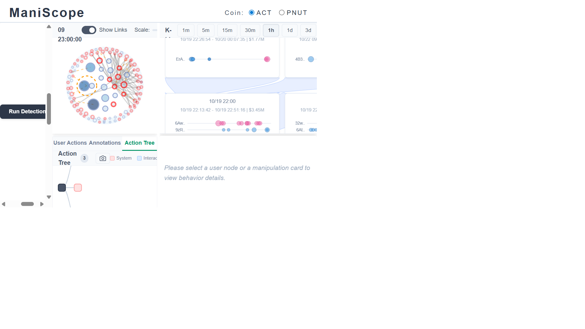
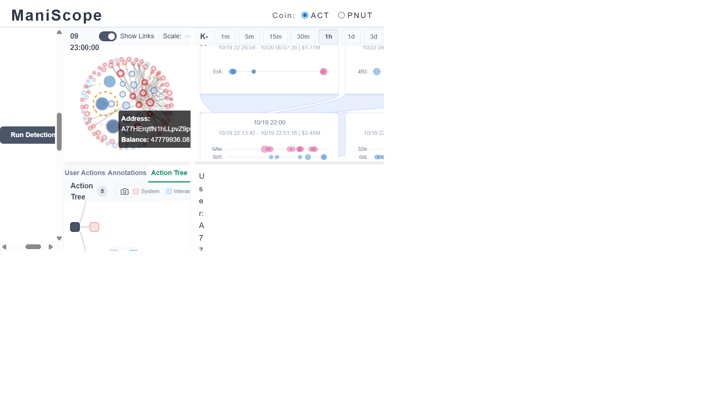
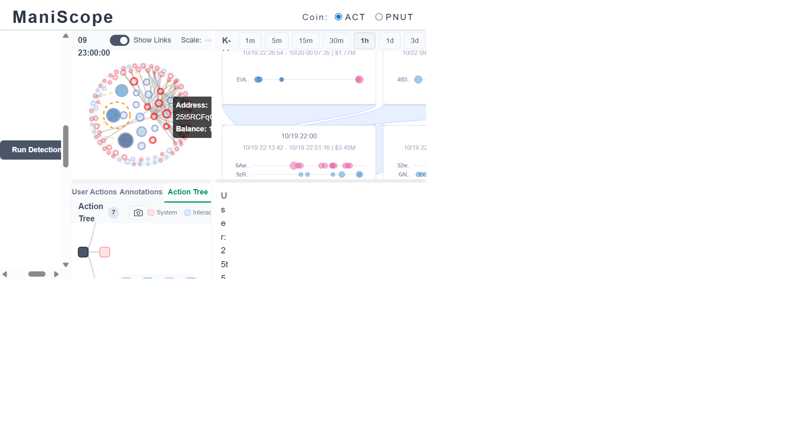
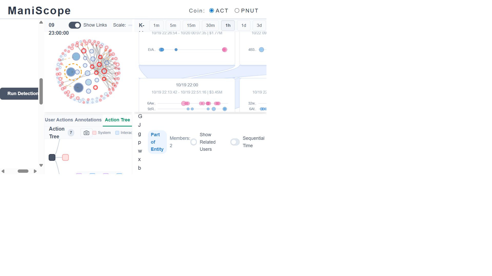
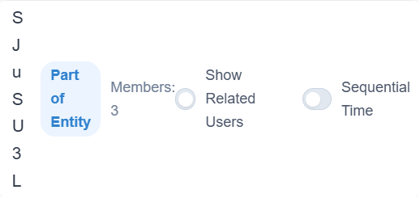

# ACT — Automated Exploration Findings

**Token:** ACT (Solana memecoin)
**Snapshot:** 2024-11-09 23:00:00 UTC
**Detection settings:** Default (Top Holder Threshold 0.3, Related User Threshold 0.2, both Run Detection buttons clicked)
**Tooling:** Playwright browser automation on ManiScope at localhost:3000. Every finding below comes from visually inspecting the tool's panels — no raw data files were read.

---

## At a glance

| Metric | Value (visual count) |
|---|---|
| Top holders | 21 |
| Flagged (red-stroked) holders | 8 / 21 (38%) |
| Clean (blue-stroked) holders | 13 / 21 (62%) |
| Detected entities | 7 (sizes 4, 3, 2, 2, 2, 2, 2 → 17 wallets) |
| Round-trip cards (1h) | 14 |
| Same-direction cards (1h) | 225 |
| Unique manipulation participants | 69 wallets |

The K-line spans **2024-10-19 → 2024-11-09**. Most manipulation activity clusters in the first two weeks (10/19–11/02), then goes quiet.

---

## Step 1 — Running detection and reading the overview

After loading the ACT snapshot, I clicked both **"Run Detection"** buttons — one for entity detection, one for manipulation detection. The Token Distribution immediately updated: some nodes gained **red strokes** (flagged) and **orange-dashed boundaries** appeared around entity clusters. The K-line panel populated with small colored cards along the top (round-trip) and bottom (same-direction) edges.

The first thing I noticed in the Token Distribution was the size distribution: a few very large blue (clean) circles dominate the center, while the red-stroked nodes are all **mid-sized**, scattered around the periphery. This already hinted that the biggest holders might not be the manipulators.

---

## Step 2 — Click the single largest node: A77HErqt (47.78M, clean)

I clicked the largest circle in the Token Distribution. The info panel showed **A77HErqt**, balance **47.78M ACT**, belonging to **Entity E7**. Its stroke was blue — clean. The Behavior Detail panel showed a mostly flat balance line with very few trade dots.

This confirmed the visual hint from Step 1: the biggest holder is a passive whale, not a manipulator.

---

## Step 3 — Click the largest red-stroked node: 25t5RCFq (12.83M, Entity E3)

Next I looked for the largest **red-stroked** circle. Iterating through all nodes by stroke color, the biggest red node turned out to be **25t5RCFq**, balance **12.83M**, a member of **Entity E3**. Its Behavior Detail showed a much busier pattern than A77H — multiple trade dots and manipulation boxes in the timeline.

Notably, 25t5RCFq is only the **6th-largest** top holder. The top 5 are all blue. This told me that the manipulation in ACT is run by **mid-tier wallets**, not whales.

---

## Step 4 — Expand "Show Related Users" for 25t5RCFq

With 25t5RCFq selected, I toggled **"Show Related Users"** in the Behavior Detail panel. The timeline expanded from a single wallet row to show **all related holders** connected via transfer links. Multiple rows appeared below the entity boundary, many with their own manipulation boxes that **aligned vertically** — meaning these wallets traded at the same times.

The vertical alignment of manipulation boxes across many rows is the visual signature of coordinated trading. Even though the entity detector only clustered 2 wallets into E3, the related-user expansion revealed a much wider coordinated network — easily 15–20 wallets with synchronized activity.

---

## Step 5 — Switch to 1d K-line to see daily manipulation cards

I clicked the **"1d"** button in the K-line panel to switch from hourly to daily granularity. This aggregated the 225+ individual same-direction events into a smaller number of daily cards, making it easier to spot the biggest coordinated events.

The bottom row of same-direction cards showed a clear concentration in the **10/21–10/28** window, with the tallest cards around 10/24–10/26 — matching the price peak on the K-line. After 11/02, the cards thinned out dramatically.

---

## Step 6 — Click the 10/21 same-direction card ($20.43M, 11 users)

I clicked one of the large same-direction cards at the bottom of the K-line. It turned out to be the **10/21 event**: $20.43M total volume, involving **11 wallets**. The card's mini-timeline showed multiple rows (896T, 62c, 7jN, etc.) with tightly clustered trade dots.

The wallets listed in this card included **896TAYRn** with a dense burst of sell trades — this wallet was dumping tokens just **2 days after launch**, a classic pre-allocation distribution signal. The fact that 11 wallets were trading in the same direction within the same time window strengthened the coordination hypothesis.

---

## Step 7 — Click a round-trip card to see wash trading

I then clicked one of the **top-row** cards (round-trip events). This one showed **10/25 — $4.49M, 2 users**: GCD and DmJ. The mini-timeline showed rapid alternating buy/sell dots — the hallmark of wash trading where a wallet buys and immediately sells to create fake volume.

The name **DmJ** caught my attention — I had not yet investigated this wallet directly. Seeing it participate in a round-trip event alongside another wallet suggested it might be part of a coordinated operation.

---

## Step 8 — Click an entity member node: 5Q544f (E1, 40.15M, clean)

To understand the entity structure better, I clicked on a node inside an orange-dashed entity boundary. This was **5Q544fKr**, the **2nd-largest holder** at 40.15M, member of **Entity E1** (the largest entity with 4 members, 56.26M total). The info panel showed "Entity Group Detected" with **Members: 4**.

5Q544f was clean. But E1 as a whole had a mixed picture: the core members (5Q544f and 7tPwvKZ5) were clean, while the peripheral members (HEHuAEtn and 8YA3S4JA) were flagged. This "clean core + flagged periphery" pattern is significant — it suggests the operator keeps the large positions clean while using smaller wallets for active manipulation.

---

## Step 9 — Hunt for DmJRzwcm in the Token Distribution

The round-trip card from Step 7 mentioned **DmJ**. I wanted to find this wallet in the Token Distribution to see its entity context. I iterated through all red-stroked circles, clicking each one and reading the address from the info panel, until I found **DmJRzwcmFFFKhJ5dSJuSU3Lns4bfiMb8b1V3vhJG7uLH** — balance **7,049,459 ACT**, member of **Entity E4** (3 members).

Entity E4 immediately stood out: the Behavior Detail showed it had 3 members with a **correlation of 1.00** — perfect synchronization. This means DmJ and its two companion wallets (BgBmwgMG at 4.38M and 6mx8oLCa at 1.49M) moved their balances in mathematical lockstep. A correlation of 1.00 between independent traders is statistically impossible — this is the same operator using three wallets.

---

## Step 10 — Inspect DmJ's entity panel and toggle Show Related Users

With DmJ selected, the bottom-right panel showed "Part of Entity, Members: 3" with a toggle for "Show Related Users" and "Sequential Time". I could see the entity boundary in the Token Distribution wrapping the three E4 members.

The three E4 members had very different manipulation profiles despite their perfect balance correlation:
- **DmJRzwcm (7.05M)** — 10 same-direction events + 1 round-trip: the active executor
- **BgBmwgMG (4.38M)** — only 1 same-direction event: the quiet partner
- **6mx8oLCa (1.49M)** — zero manipulation events: the ghost wallet

This is a textbook sybil structure: one wallet does the "dirty work" while the others hold synchronized positions silently. Without entity detection, you would only notice DmJ. The correlation score exposed the other two.

---

## Step 11 — Examine DmJ's Behavior Detail timeline

I captured the Behavior Detail panel for DmJ, which showed the full timeline of trades and balance changes. Multiple red manipulation boxes (same-direction bursts) were visible spanning from mid-October to early November, confirming DmJ as one of the most persistently active manipulators.

The manipulation boxes were concentrated in two clusters: **10/21–10/28** (the price run-up period) and **10/31–11/04** (the post-crash period). This matched the overall market pattern — manipulation during the pump, then again during a failed attempt to re-pump.

---

## Step 12 — Return to the 1h K-line overview

I deselected the node and returned to the 1h K-line view to see the full picture of manipulation card distribution alongside the price action.

From this view, the timeline story was clear: the top row (round-trip cards) and bottom row (same-direction cards) were both densely packed in the **10/19–11/02** window, then dropped to near-zero. The price peaked around 10/24–10/25 with a massive red candle, then ground down slowly. All the coordinated activity happened during or immediately after this peak.

---

## Step 13 — Click the biggest same-direction card: 10/26 ($16.39M, 6 wallets)

I searched for the largest same-direction card by dollar amount and clicked it. It was the **10/26 09:56–10:28 event**, $16.39M volume involving **6 wallets**: BgB, 35N, 5YP, 7Y9, DmJ, and 6mx.

This was the critical cross-reference moment. **DmJ and 6mx** — two of the three Entity E4 members — appeared together in this card. But they were also joined by **BgB** (the third E4 member) and three other wallets (35N, 5YP, 7Y9). The entity detector only clustered 3 of these 6 wallets, but this manipulation card proved they were all trading together.

The card's mini-timeline showed all 6 rows with buy dots clustered in the same narrow time band — a textbook coordinated buying event worth $16.39M in just 32 minutes.

---

## Step 14 — Examine the Behavior Detail with manipulation boxes for the 6 wallets

I captured the Behavior Detail panel for the 6 card participants. With "Show Manipulation Boxes" enabled, red rectangles highlighted all the flagged time windows across the full timeline for each wallet.

The manipulation boxes for BgB, 5YP, and DmJ aligned not just in the 10/26 event but across **multiple other time windows** too — confirming that this wasn't a one-time coincidence but a repeated pattern of coordination. The wallets that the entity detector classified separately were clearly part of the same operation when viewed through the manipulation card lens.

---

## Summary of the investigation process

The investigation followed a systematic path through ManiScope's visual tools:

1. **Start broad** — Run detection, read the overview. Notice that large nodes are blue, red nodes are mid-sized.
2. **Click the biggest blue** — Confirm it's a passive whale (A77H, 47.78M). Not interesting.
3. **Click the biggest red** — Find 25t5RCFq (12.83M, E3). Busy timeline with manipulation boxes.
4. **Expand related users** — See 15–20 wallets with vertically aligned manipulation boxes. The entity boundary is just the tip of the iceberg.
5. **Switch to 1d K-line** — Get the big picture of manipulation event density over time. Activity concentrated in weeks 1–2.
6. **Click large SD cards** — Identify specific coordinated events. The 10/21 card reveals 11 wallets dumping together post-launch.
7. **Click RT cards** — Spot wash trading. The 10/25 card names DmJ + GCD as round-trip participants.
8. **Follow the name** — DmJ appeared in the RT card, so I hunted for it in the Token Distribution. Found it in Entity E4 with perfect correlation (1.00) across 3 wallets.
9. **Cross-reference entities with cards** — The 10/26 SD card ($16.39M) contained all 3 E4 members plus 3 additional wallets. The entity boundary under-clusters — the card reveals the true network size.
10. **Check manipulation boxes across timelines** — The aligned boxes across multiple wallets and multiple time windows confirm persistent coordination, not a one-off event.

**Key insight:** The entity detector and the manipulation cards complement each other. Entities find wallets with correlated balances; cards find wallets that traded at the same time. When a wallet appears in both — like DmJ (E4 member + multiple card participant) — you have the strongest evidence of coordinated manipulation.

---

## Methodology

- **Browser viewport:** 1920 × 1080 px via Playwright
- **Screenshots:** 20 captures taken during systematic investigation steps
- **Detection parameters:** Entity detection defaults + manipulation detection defaults (RT: max_time_diff 120s, max_earning $1000; SD: max_time_diff 10s, min_seq_length 5)
- **No raw data files were read.** All observations come from clicking nodes, reading info panels, selecting manipulation cards, and examining the Behavior Detail timeline in ManiScope.
