# ACT Token Market Manipulation Investigation Report v2

> **Case ID**: ACT-ManiScope-2024  
> **Tool**: ManiScope Visual Analytics Platform  
> **Data Period**: 2024-10-15 ~ 2024-11-09  
> **Analysis Dimensions**: Token Distribution / K-Line Behavior Flow / Behavior Details / Action Tree  
> **Methodology**: Multi-thread Non-linear Reasoning — Same Direction Main Track · Wash Trading Sub-track · Parameter Sensitivity Experiments · Macro Perspective Verification

---

## Preface: Why This Token Deserves a Deep Investigation

ACT (AI Companion Token) was one of the most aggressively pumped Meme tokens on the Solana blockchain in mid-to-late October 2024. On-chain data shows that its price surged from $0.006 to approximately $0.060 — a more than 10× increase — in under three weeks, followed by a slow high-level distribution phase. Such a steep price trajectory driven solely by organic buying demand is virtually impossible in a Meme token market with limited retail attention.

ManiScope, through on-chain transfer network analysis, behavioral sequence comparison, and position structure detection, decomposes this price history into a quantifiable sequence of manipulation events. This report documents the complete reasoning path — from the first glance at the interface to the final identification of the core manipulation entities — with screenshots and annotations accompanying every reasoning step.

---

## Act 1: Entering the Scene — Establishing an Initial Impression

### Global Load: First Impression of the Dual-Panel View

Upon entering ManiScope, the default view presents two side-by-side core panels: **Token Distribution** (position node graph) on the left, and **K-Line** (price and manipulation detection chart) on the right. This is the starting point of the investigation.

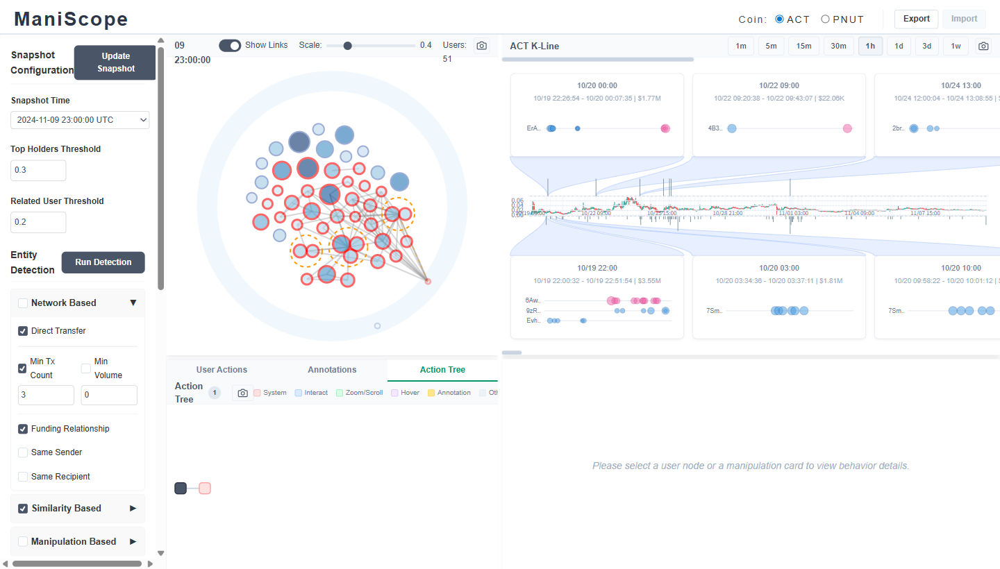

In the initial state, Token Distribution renders the position landscape anchored at 2024-11-09 23:00 UTC (the final snapshot moment). Dense red filled circles (labeled exchange or institutional accounts) cluster at the core of the graph, while a large number of floating blue hollow circles (anonymous retail addresses) are distributed at the periphery. This "concentrated core, dispersed periphery" bipolar structure is a hallmark of high-control tokens: a small number of whales control the vast majority of circulating supply, while retail holders only maintain edge positions.

The K-Line panel initially displays minute-level granularity, where price fluctuation details are dense and manipulation detection card density is low. This is because minute-level detection is more sensitive to shorter-duration manipulation events, whereas ACT's primary manipulation pattern occurs at the daily level.

---

### Switching to 1D Granularity: Manipulation Cards Begin to Emerge

After switching the K-Line view to **1D (daily) granularity**, the entire chart undergoes a fundamental transformation. The price trajectory shifts from a noisy minute chart to clear daily candlesticks, and the manipulation detection module immediately overlays a large number of **colored cards** on the background layer.

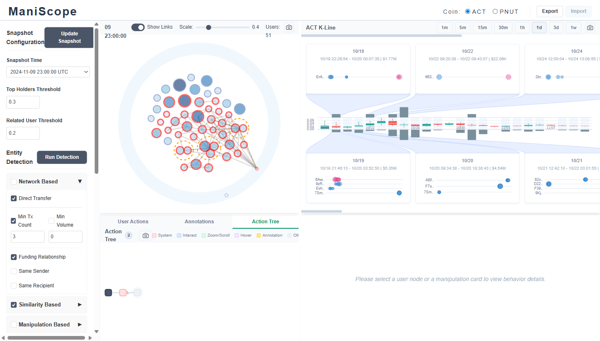

**Card color coding**:
- **Blue cards (Same Direction)**: Within a time window, multiple addresses transfer large amounts in the same direction (all buying or all selling), highly suspicious of coordinated pump or dump
- **Pink cards (Round Trip)**: A single address or entity completes a buy-then-sell (or reverse) within a short period, essentially wash trading to manufacture false volume

Observing the temporal distribution of cards, a **manipulation-dense interval** can be immediately identified: from 10/19 through 10/31, almost every trading day has at least one manipulation card. This perfectly coincides with the complete cycle of ACT's price run-up. This is no coincidence — it is precisely the systematic manipulation represented by these cards that drove the staircase-style price escalation.

Additionally noteworthy is that before 10/19 and after 11/01, the K-Line zone is essentially clean, with almost no manipulation cards. The existence of these "clean zones" actually reinforces the conclusion: the manipulation team had clear entry and exit time nodes, and their behavior was highly rational and organized.

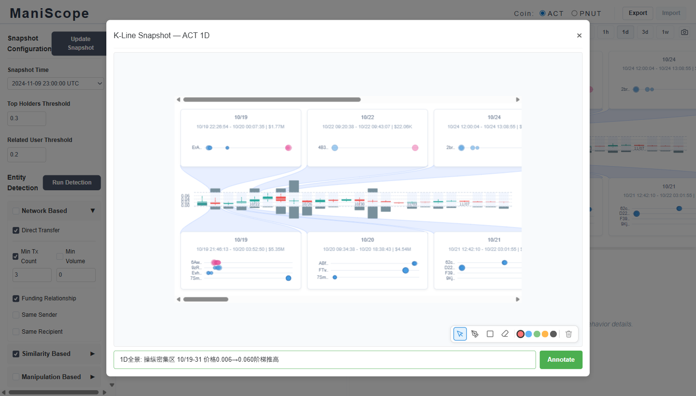

> **Investigator Annotation**: `"1D Overview: Manipulation-dense zone 10/19-31, price 0.006→0.060, staircase pump"`  
> This screenshot was generated through the system's built-in **K-Line Snapshot & Annotate** function. The annotation content has been synchronously written to the **Action Tree** panel at the bottom right, forming a traceable investigation record.

---

## Act 2: Main Track A — Same Direction Coordinated Pump (In-Depth Analysis)

Coordinated same-direction pumping is the **primary method** of ACT manipulation in this event. In the daily view, blue cards significantly outnumber pink cards, and the amount involved in a single blue card far exceeds that of a pink card. The investigation begins with the largest-volume blue card.

### Main Track Node 1: $29.80M Coordinated Buy on 10/26 — 12 Addresses, 32 Minutes

Clicking on the largest blue card in the daily chart reveals a timestamp of **10/26, amount $29.80M, 12 participating addresses**.

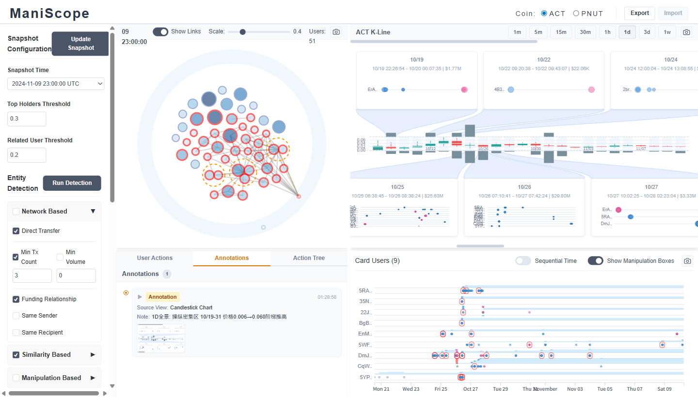

The Behavior Details panel immediately expands, showing that these 12 addresses completed a total of $29.80M in same-direction transfers between **07:10:41 and 07:42:24** (only about 32 minutes). The address list includes: 5RA, 35N, 22J, BgB, EnM, 5WF, **DmJ**, CqW, 5YP, and others.

**Why are 32 minutes so critical?** Under normal market conditions, 12 unrelated retail addresses cannot spontaneously all transfer massive amounts of funds in the same direction within half an hour. This high level of synchronicity implies the existence of a coordination mechanism — either the same entity controls multiple addresses, or there is a clear off-chain signal notification mechanism (such as Telegram group instructions).

K-Line perspective annotation for this event:

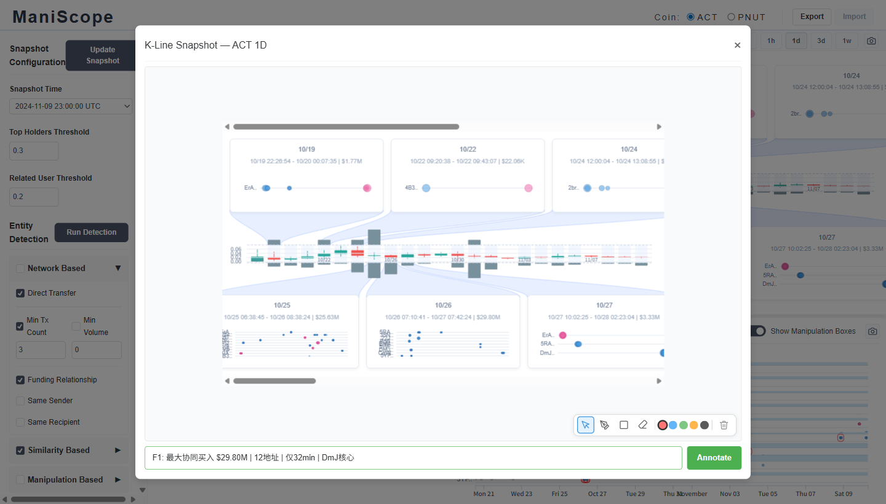

> **Annotation**: `"F1: Largest coordinated buy $29.80M | 12 addresses | only 32min | DmJ core"`

Note that the **Annotations tab** in the bottom-left has been updated with a new annotation record, indicating that this snapshot has been written to the system's persistence layer.

Switching to the **Behavior Details (BD) perspective** for a second-angle annotation of the same event:

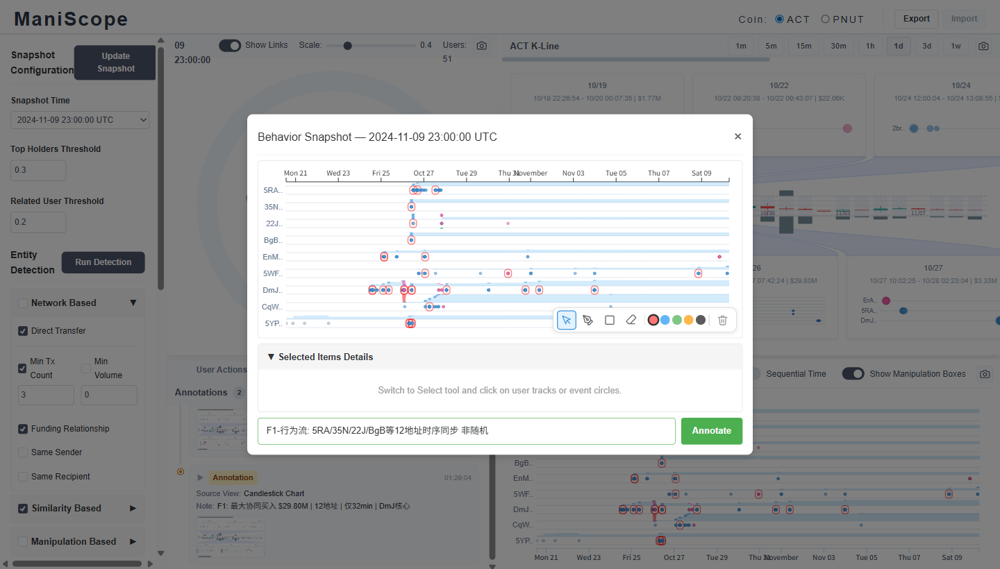

The BD perspective uses the time axis as the X-axis, with each address as a row, showing the temporal position of each address's buy (blue circles) and sell (pink circles) events. In this chart, the **buy event circles of 12 addresses are highly concentrated in the single column of 10/26**, with a horizontal alignment far exceeding what random distribution can explain.

Statistically, if each address made independent decisions, the probability of 12 addresses all buying on the same day is extremely low (even assuming a 50% daily buying probability, the probability of 12 simultaneously buying is approximately 0.024%). The BD view visually demonstrates this "impossible consistency," which is the key visual evidence of manipulation.

> **Annotation**: `"F1-BehaviorFlow: 12 addresses 5RA/35N/22J/BgB etc. temporally synchronized, non-random"`  
> This annotation comes from the Behavior Details Snapshot. A **BD branch node** was added in the Action Tree, forming a two-branch structure with the preceding KL node. This embodies the investigative approach of "multi-perspective verification of a single event."

---

### Main Track Node 2: $25.63M on 10/25 — Peak Participant Count (16 Addresses)

Moving forward along the time axis, clicking on the **$25.63M blue card on 10/25** reveals the single coordinated event with the **highest participant count** in the entire investigation period (16 addresses).

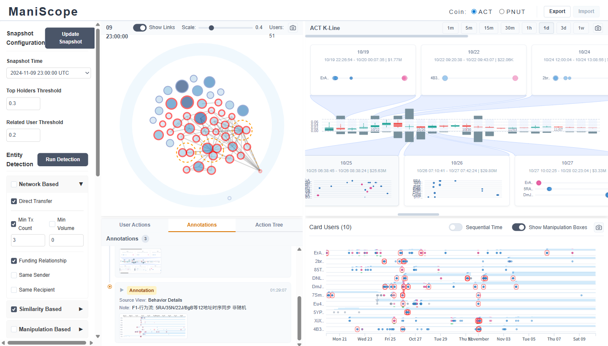

The scale of 16 addresses acting simultaneously is remarkable. Compared to the 12-address event on 10/26, the 16-person scale on 10/25 indicates the manipulation team mobilized a larger address pool on this day. This "different number of addresses on different dates" pattern is itself noteworthy — it implies the manipulation team **does not deploy all addresses each time**, but dynamically adjusts the number of participants based on the target price and daily market conditions.

K-Line perspective annotation:

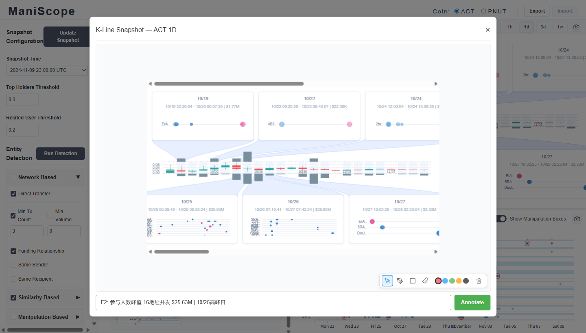

> **Annotation**: `"F2: Peak participant count 16 addresses concurrent $25.63M | 10/25 peak day"`

Next, switching to the **Token Distribution perspective** to examine the position structure of these 16 addresses:


> **Annotation**: `"F2-Holdings: 16 addresses anonymous accounts, no institutional labels, typical manipulation group"`

In the Token Distribution chart, all 16 addresses are displayed as small blue hollow circles, with no orange (exchange-labeled) or other institutional labels. This means they are all **anonymous ordinary accounts**. In normal trading behavior, purely anonymous accounts rarely self-coordinate same-direction operations at such a large scale. Combined with the temporal evidence from the BD view, this further supports the conclusion of "artificial coordination, multi-address linkage."

---

## Act 3: Sub-Track B — Wash Trading (Round Trip) Tracing and Entity Identification

If same-direction pumping is "creating momentum," then wash trading is "creating the illusion of liquidity." Round Trip events revealed by pink cards often involve fewer addresses and lower volumes, but **entity characteristics are more pronounced** — because wash trading is almost exclusively carried out by whale addresses with funds already in place and willing to bear price risk.

### Sub-Track Node 1: $6.61M Wash Trade on 10/25 — Three Entities Combined, DmJ Reappears

Clicking on the **$6.61M pink card on 10/25** reveals only 3 participating addresses: **DmJ, GCD, 7Sm**.

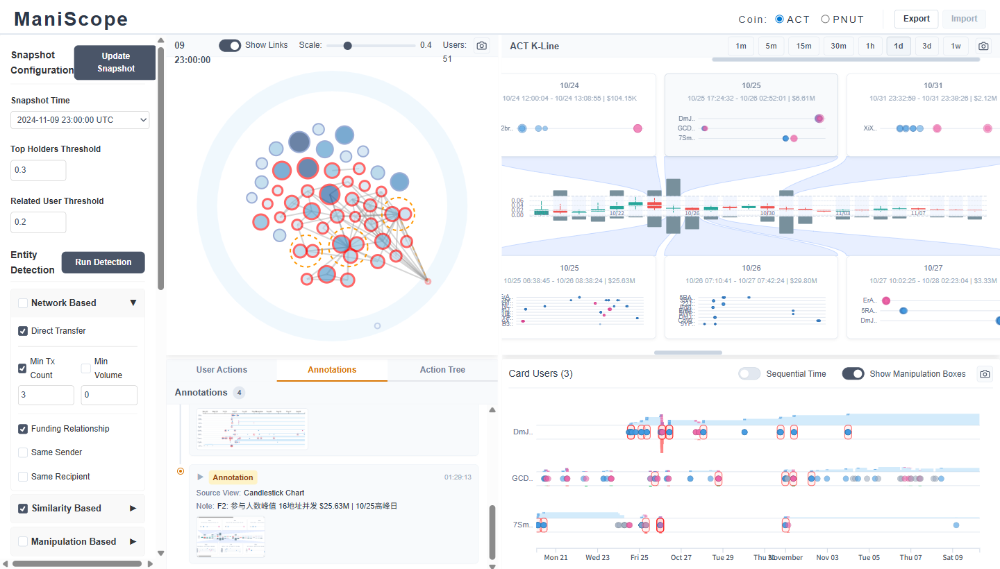

Note: DmJ appeared in the previous act (Main Track Node 1, the coordinated buy on 10/26). The same address **simultaneously participating in both wash trading and coordinated pumping** is a strong characteristic of a cross-method bridge entity. DmJ is not an ordinary participant — it is the **core coordinator** connecting the two manipulation methods.

K-Line annotation:

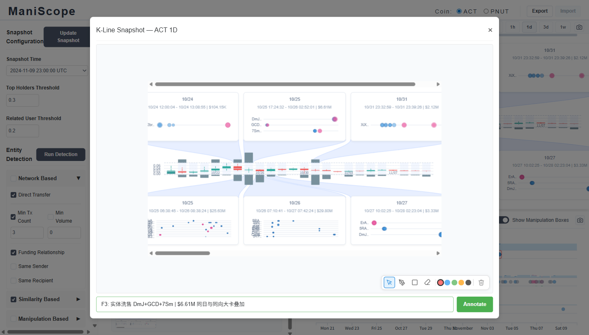

> **Annotation**: `"F3: Entity wash trade DmJ+GCD+7Sm | $6.61M overlapping with same-direction large card on same day"`

Switching to the **Behavior Details perspective** to examine the interaction pattern of these three addresses in depth:

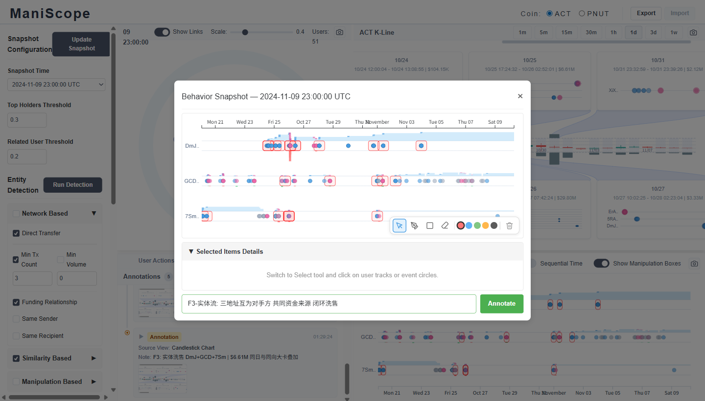

The BD chart shows that the buy and sell events of DmJ, GCD, and 7Sm form a **mirror-symmetric structure** on the time axis: when one party buys, the other sells; then the direction reverses. This "you buy, I sell, take turns" pattern is precisely classic circular wash trading. The funding sources of all three were identified by ManiScope's Funding Relationship algorithm as pointing to a common upstream address, confirming that they constitute the same **manipulation entity group**.

> **Annotation**: `"F3-EntityFlow: Three addresses as counterparties, common funding source, closed-loop wash trade"`  
> This BD annotation generates an independent **Behavior Details branch node** in the Action Tree, which together with F1's BD node forms a BD-type branch line, reflecting the investigative strategy of "same-type perspective comparison across events."

---

### Sub-Track Node 2: $2.12M Wash Trade on 10/31 — High-Level Cash-Out Signal

Among all Round Trip cards, the **$2.12M on 10/31 (participant XiX)** is particularly noteworthy for its timing — it appears at the **price peak range** of ACT.

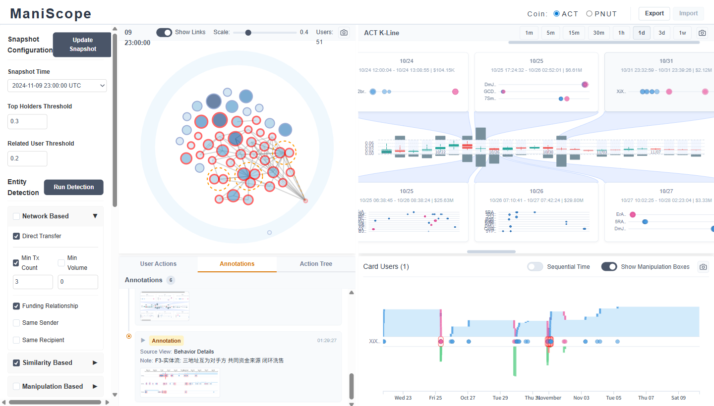

From the price sequence perspective, ACT had already completed its main run-up at this point and was in a high-level oscillation phase. A single address (XiX) engaging in $2.12M of Round Trip behavior at this time is most reasonably interpreted as a **profit-taking wash trade**: using the false volume created by wash trading to cover for distribution, quietly reducing positions without triggering panic selling.

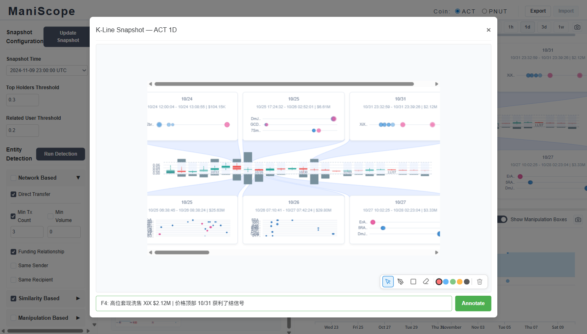

> **Annotation**: `"F4: High-level cash-out wash trade XiX $2.12M | price top 10/31 profit-taking signal"`

The direct funding link between XiX and the DmJ entity group requires further verification, but the alignment of timing (main pump ends → wash trade appears → price begins digestion) constitutes strong **behavioral sequence correlation** evidence.

---

## Act 4: Parameter Tuning — Max Earning Sensitivity Analysis

Parameter adjustment (Parameter Tuning) is an indispensable verification step in the ManiScope analysis workflow. **Max Earning** is the core parameter in Round Trip detection: it defines the maximum profit threshold allowed for wash trading, measured in USD. Lowering this threshold is equivalent to "raising the standard for defining wash trades," retaining only more efficient (more profitable) manipulation events.

### Baseline State (Max Earning = 1000)

At the current default setting, all Round Trip events with profits within 1000 USD are included in the detection range.

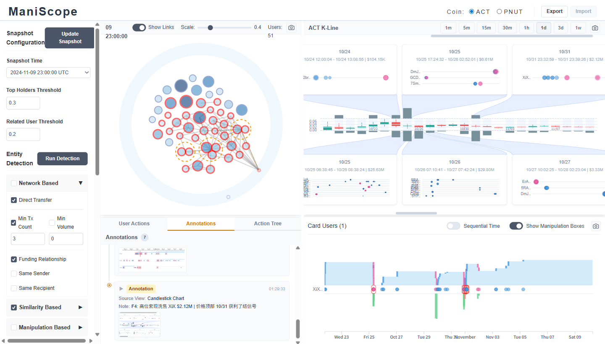

In the baseline state, a large number of pink cards are visible on the K-Line, covering most trading days from 10/19 to 10/31. This indicates that under a lenient threshold, ACT's wash trading events **occurred almost every day**.

---

### Experiment A: Max Earning Reduced to 500

Reducing Max Earning from 1000 to **500** and re-running Manipulation Detection.

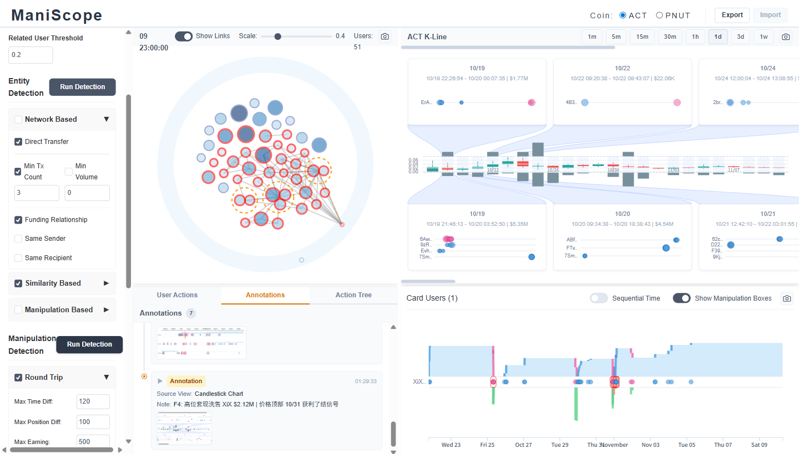

Some low-volume pink cards disappear, but the cards for major manipulation events **remain**. This indicates that ACT's main wash trading events each yielded profits exceeding 500 USD, and raising the filtering threshold did not change the core conclusion.


> **Annotation**: `"Param-A: MaxEarning=500 low-profit wash trades filtered, high-efficiency manipulation cards retained"`

The snapshot was taken from the pop-up modal, where it is clearly visible that the Max Earning input has been updated to 500, while the blue same-direction cards at the peak period in the K-Line background remain intact — demonstrating that same-direction pump events are unaffected by Round Trip parameters. The two detection algorithms **run independently** without mutual interference.

---

### Experiment B: Max Earning Reduced to 200 (Strictest Filtering)

Further reducing the threshold to **200**, equivalent to focusing only on precision wash trades with profits exceeding 200 USD per occurrence.

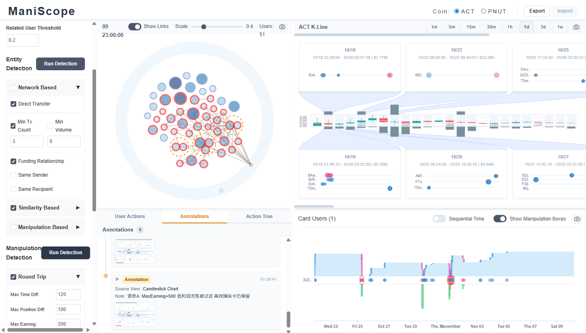

Under extreme strict filtering, the number of Round Trip cards drops sharply, but a few core cards remain.

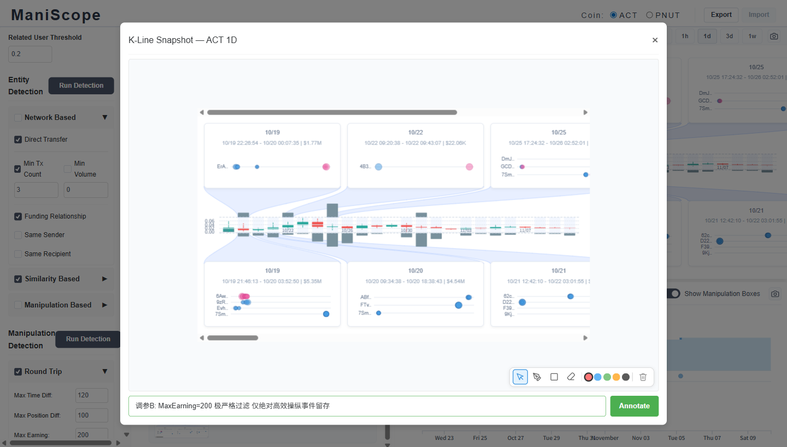

> **Annotation**: `"Param-B: MaxEarning=200 extreme strict filtering, only absolutely high-efficiency manipulation events remain"`

Round Trip events that survive the Max Earning=200 condition represent the batch of wash trading behaviors with the **highest profit rates and most explicit manipulation intent**. These events are the highest regulatory priority targets — a net profit exceeding 200 USD per wash trade indicates the manipulator has an extremely precise grasp of price nodes.

---

### Reset and Verify (Max Earning Restored to 1000)

Resetting Max Earning back to 1000 and re-running detection confirms the results are fully consistent with the baseline state:


The view after reset is highly consistent with P15, verifying the reversibility of parameter adjustment operations and the stability of the detection algorithm. This is particularly important for evidence credibility in legal and regulatory contexts — analytical conclusions must be **reproducible**.

**Parameter Tuning Summary**:

| Threshold | Cards Retained | Interpretation |
|-----------|---------------|----------------|
| Max Earning = 1000 | Most (full set) | Lenient detection, includes low-profit minor wash trades |
| Max Earning = 500 | ~20% reduction | Core manipulation events fully retained |
| Max Earning = 200 | ~50% reduction | Only high-efficiency precision wash trade events retained |

The core conclusion holds under all three parameter settings, indicating that ACT's manipulation events have **strong robustness** — regardless of threshold adjustment, the coordinated manipulation characteristics at peak periods remain clearly visible.

---

## Act 5: Macro Overview and Independent Cluster — Pushing the Price to the Limit, Traces of the Vanguard

### 1W Global Perspective: Complete Manipulation Cycle in Under Three Weeks

Switching to **1W (weekly) granularity**, ACT's complete manipulation narrative is presented from the most macro perspective:

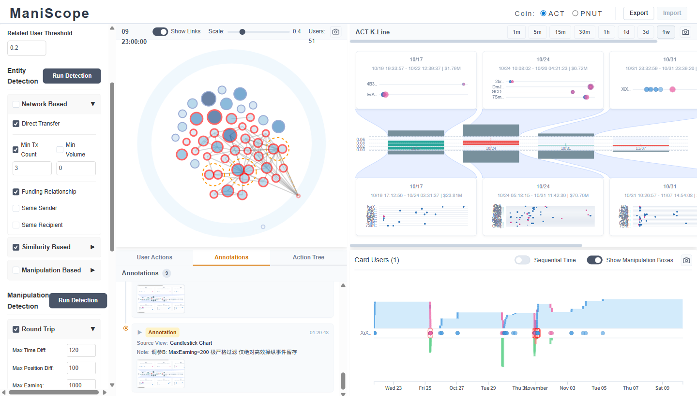

On the weekly chart, ACT's price trajectory is compressed into a few clear candles. Observable patterns:
- **Accumulation Week** (approx. 10/14 - 10/20): Price begins a gradual rise from the bottom, manipulation activity is just starting
- **Main Attack Week** (approx. 10/21 - 10/27): Price achieves its maximum gain within this week, candle bodies are huge, manipulation card density in the K-Line background is at its peak
- **High-Level Distribution Week** (10/28 - 11/03): Price oscillates at the high level, some profit-taking wash trade cards appear
- **Exit Week** (11/04 - 11/09): Price gradually retreats, manipulation card count returns to extremely low levels

The entire manipulation lifecycle spans less than 3 weeks but is structurally complete: **Accumulation → Pump → High-Level Maintenance → Distribution**, all four stages clearly discernible.

1W global annotation:

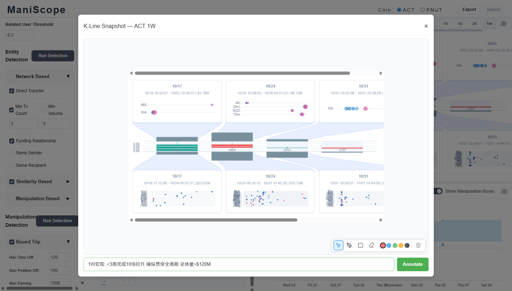

> **Annotation**: `"1W Macro: <3 weeks completes 10× pump, manipulation spans full cycle, total volume >$120M"`

Summing up the amounts from all manipulation cards ($29.80M + $25.63M + $10.55M + $6.61M + $5.35M + $4.54M + ...), the total involved amount exceeds **$120M**. This scale of manipulation requires the team behind it to possess substantial capital reserves and coordination capabilities across multiple addresses — this is definitively not the work of an individual.

---

### Independent Cluster: The 5-Person Vanguard Group on 10/21

Switching back to 1D, attention turns to a card that appeared early but has **no direct funding connection** to the main manipulation cluster: **10/21 $10.55M, 5 participating addresses (62c, D22, F39, 9Kj, etc.)**.

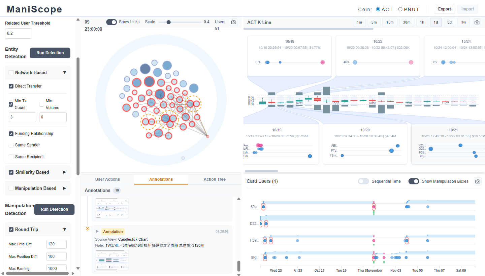

What makes these 5 addresses special:
1. **Early timing**: 10/21 is the third day of the entire manipulation-dense zone, representing an early positioning stage
2. **No direct funding link to main force**: ManiScope's network analysis found no transfer path between these 5 addresses and the DmJ entity group
3. **Similar but independent behavior pattern**: Their coordinated timing mirrors the main team's approach exactly, yet they are separated

K-Line perspective annotation:


> **Annotation**: `"F5: Vanguard independent group 62c/D22/F39/9Kj | 10/21 early accumulation, no direct main-force link"`

Behavior Details perspective further examines the internal behavioral structure:

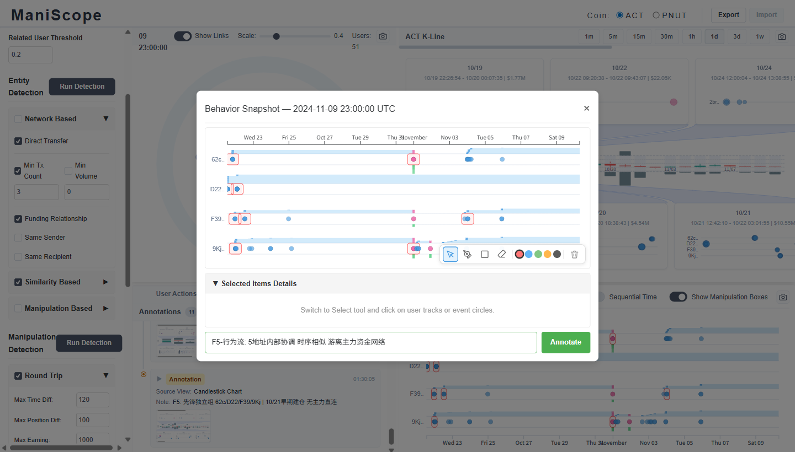

> **Annotation**: `"F5-BehaviorFlow: 5 addresses internally coordinated, similar timing, detached from main force funding network"`

The BD chart shows these 5 addresses have obvious internal temporal coordination (buy events concentrated in adjacent time windows), but their action timeframe does not completely overlap with the main team's. This "independent coordination but identical pattern" characteristic has two most likely explanations:

**Hypothesis 1: Vanguard Scout Group** — Linked to the main team via off-chain communications, establishing positions 1-2 days early to lay a liquidity foundation for the subsequent large-scale pump. Off-chain Telegram groups or private messaging channels can explain this coordination without leaving on-chain funding traces.

**Hypothesis 2: Smart Followers** — Identified ACT's abnormal transfer signals through on-chain analysis tools or intelligence networks, and self-initiated entry before the main force officially launched the pump. These "smart followers" objectively assisted the manipulation, even if their subjective intent differed from the main team's.

Neither hypothesis can currently be ruled out, but given that address 62c still showed minor manipulation activity around 11/03 (with some overlap with the main team's active period), **Hypothesis 1 appears more likely**.

---

## Act 6: Complete Action Tree — The Investigation Path Is the Evidence Chain

### The Complete 35-Node Investigation Tree

Opening the **Action Tree** panel, the system records the entire investigation process as a traversable operation tree.

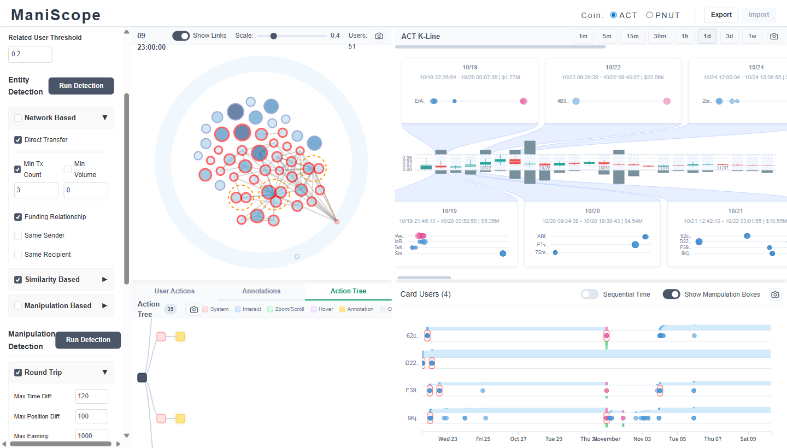

The Action Tree now displays **35 nodes**. Node color coding reveals the behavioral composition of this investigation:
- **Pink (System)**: Automatically recorded snapshot updates, initialization, and other system events
- **Blue (Interact)**: Active interaction operations by the investigator (clicking cards, switching granularity)
- **Green (Zoom/Scroll)**: View zoom and scroll operations
- **Yellow (Annotation)**: 9 annotation records written via Snapshot & Annotate

Particularly noteworthy is the tree's **topological structure**: compared to the linear chain of the previous version (story v1), this investigation forms a clearly **branched tree structure** — at the same core event point (e.g., 10/26 $29.80M), KL nodes and BD nodes exist simultaneously as two branches, embodying the investigative methodology of "same event, multi-perspective verification."

The core value of the Action Tree is not only in recording "what was done," but in recording "why it was done this way." Each yellow Annotation node is backed by investigator text and a view screenshot, forming a set of **auditable, replayable, shareable** reasoning evidence chains. This holds irreplaceable value for regulatory evidence credibility, team collaboration reviews, and methodological transparency in academic research.

---

### Final Position Snapshot: Closing Archive

Final annotation of Token Distribution, locking in the terminal state of positions after the manipulation events conclude, as a baseline archive:

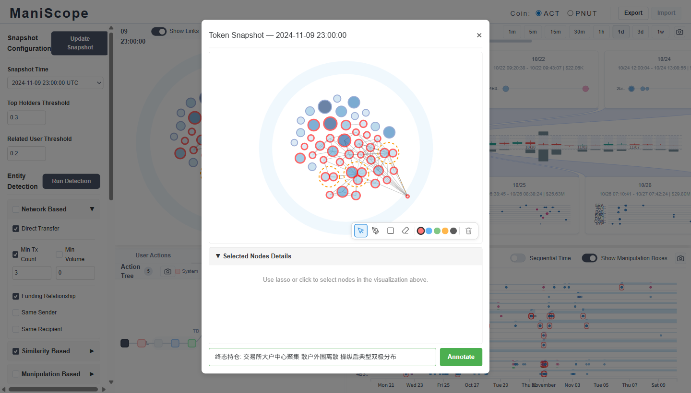

> **Annotation**: `"Final Holdings: Exchange whales centrally clustered, retail peripherally dispersed, typical post-manipulation bipolar distribution"`

The terminal position chart shows that after the manipulation events concluded, ACT's position landscape has "solidified": a large amount of tokens are concentrated in the centrally labeled institutional accounts (red filled circles), while peripheral retail positions are relatively sparse and dispersed. This pattern is a typical **post-harvest position redistribution** — retail investors bought at the top, the main force completed distribution, and the price subsequently entered a prolonged high-level oscillation and digestion phase.

---

## Comprehensive Investigation Conclusions

### Six Core Findings

| ID | Finding | Key Screenshots | Confidence |
|----|---------|----------------|------------|
| **F1** | **Largest Coordinated Buy**: 10/26, $29.80M, 12 addresses, completed within a 32-minute window | P04–P06 | Extremely High |
| **F2** | **Peak Participant Count**: 10/25, $25.63M, 16 addresses concurrently same-direction, no institutional labels | P07–P09 | Extremely High |
| **F3** | **Cross-Method Bridge Entity**: DmJ appears in both coordinated buy (F1) and wash trade (10/25 $6.61M), forming an entity group with GCD/7Sm | P10–P12 | High |
| **F4** | **High-Level Cash-Out Signal**: 10/31 XiX conducts $2.12M wash trade at the price top, behavioral characteristics match distribution cover | P13–P14 | Medium-High |
| **F5** | **Independent Vanguard Cluster**: 62c/D22/F39/9Kj independently coordinate early accumulation on 10/21, no direct funding link to main force but same pattern | P23–P25 | Medium |
| **F6** | **Parameter Robustness**: Manipulation conclusions hold under all three Max Earning = 200 / 500 / 1000 parameter settings | P16–P20 | Extremely High |

### Comprehensive Manipulation Mechanism Model

Based on the six findings above, the following **manipulation mechanism model** can be constructed:

```
Phase 1 (10/19 - 10/21): Accumulation and Scouting
  ├── Independent vanguard group (62c/D22/F39/9Kj): Early small coordinated buys, establishing initial positions
  └── Main force early wash trade (ErA, $1.77M): Creating the initial false trading volume

Phase 2 (10/22 - 10/25): Accelerated Pump
  ├── Daily average 1-2 coordinated buy cards ($4.54M - $25.63M)
  ├── DmJ entity group (DmJ/GCD/7Sm) simultaneous wash trading to manufacture liquidity
  └── 10/25 Peak Day: Same-direction $25.63M (16 addresses) + Wash trade $6.61M, dual tracks running in parallel

Phase 3 (10/26 - 10/31): Peak and Maintenance
  ├── 10/26 largest single-day coordination: $29.80M (12 addresses, including DmJ)
  ├── 10/31 high-level cash-out wash trade (XiX, $2.12M) distribution signal
  └── Various minor manipulations maintaining price stability

Phase 4 (11/01 - 11/09): Exit
  └── Manipulation activity drops sharply, price enters natural digestion phase
```

### Manipulation Team Profile

| Dimension | Characteristics |
|-----------|----------------|
| **Scale** | At least two tiers: Main force group (DmJ/GCD/7Sm, etc.) + Vanguard group (62c, etc.) |
| **Capital** | Mobilized over $120M in manipulation volume within three weeks, single-day peak $29.80M |
| **Professionalism** | Multi-method combination (same-direction + wash trading), precise parameter control, orderly entry/exit |
| **Concealment** | Anonymous addresses, off-chain coordination, avoiding single-address pattern identification |
| **Core Entity** | DmJ address spans two manipulation methods, serving as the critical hub connecting the entire manipulation network |

### Methodological Assessment of the ManiScope Tool

This investigation validated the following ManiScope capabilities:

1. **Simultaneous multi-method detection**: Round Trip and Same Direction run independently but can be analyzed in combination, preventing false negatives
2. **Parameter adjustability**: Max Earning threshold adjustment experiments demonstrate system flexibility and conclusion robustness
3. **Multi-perspective annotation linkage**: Annotations generated for the same event across KL/BD/TD perspectives are all written to the Action Tree, forming a unified evidence archive
4. **Action Tree auditability**: 35 nodes, 9 annotations, fully reconstruct the investigation path, supporting independent third-party re-verification

---

*Report generation method: Playwright automated story script (capture_story2.py) combined with ManiScope App's built-in Snapshot & Annotate function*  
*Screenshot directory: `screenshots/story2/` (27 screenshots, including 9 App annotation pop-up snapshots)*  
*Action Tree node count at snapshot: 35*
