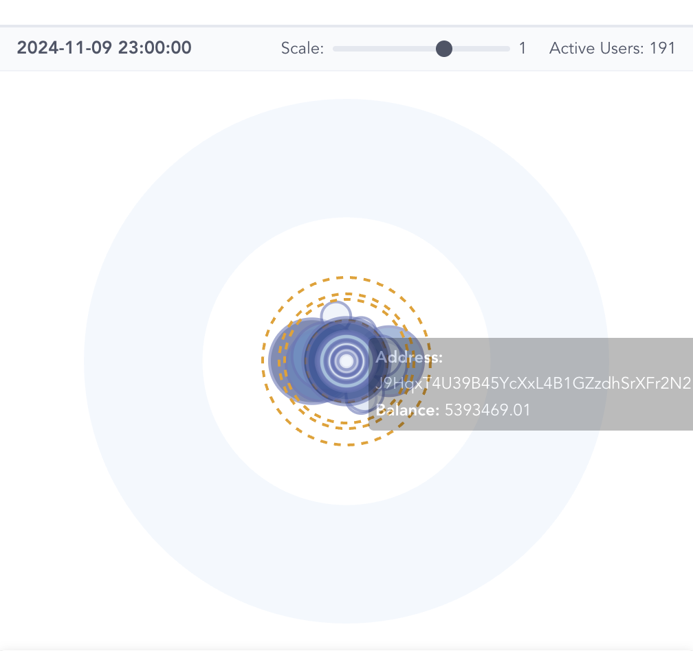
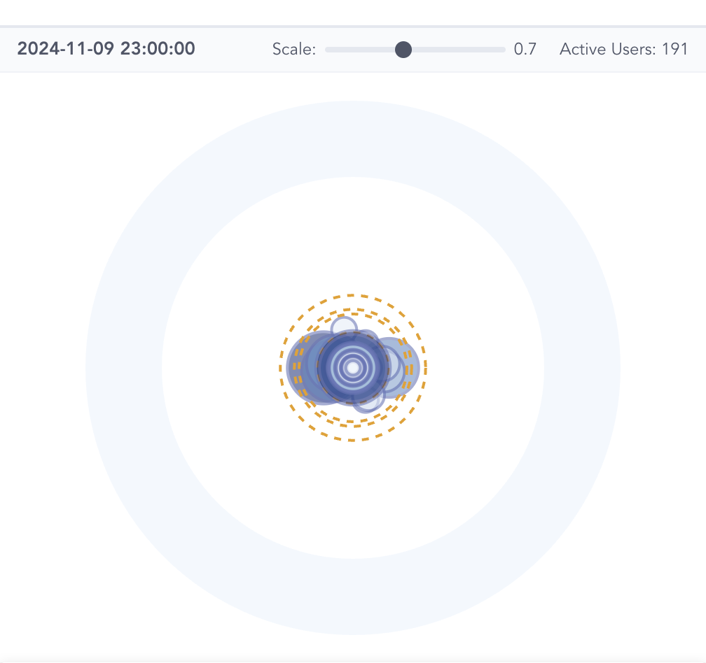
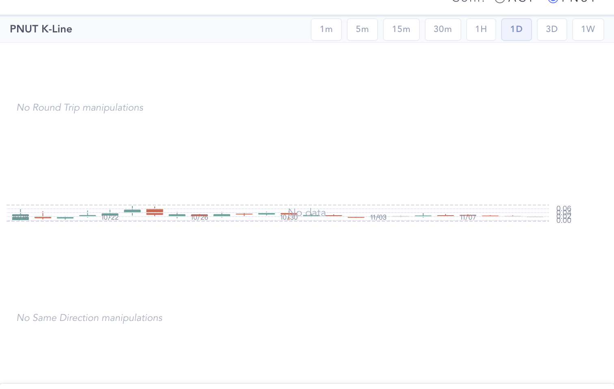
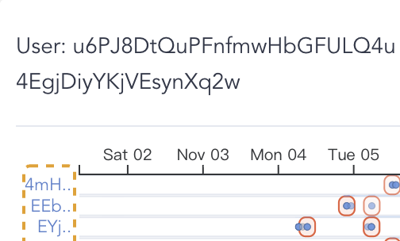
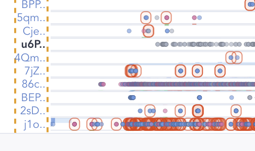
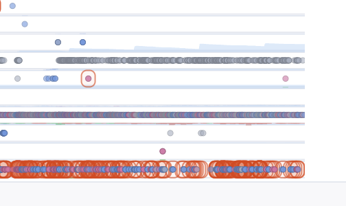
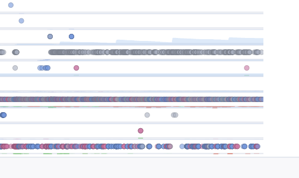
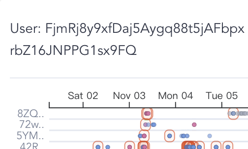
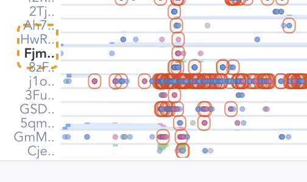

# PNUT — Manual Exploration Findings

**Token:** PNUT (Solana memecoin)
**Snapshot:** 2024-11-09 23:00:00 UTC (default after switching coin)
**Detection settings:** all defaults from the manual; both Run Detection buttons clicked after the coin switch (per the manual's reminder)
**Tooling:** Chrome via the web-access skill, screenshots cropped with PIL. I never read the underlying data files.

> **Headline:** PNUT is *much* harder to investigate at the visual layer than ACT, for two reasons that ended up being findings in their own right: (1) the Token Distribution force layout collapses and the bubbles cannot be visually separated, and (2) the global Manipulation View renders **"No Round Trip / No Same Direction manipulations"** even though the per-user Behavior Detail clearly contains hundreds of manipulation boxes. Both are documented below and in `../visualization-feedback.md`.

---

## At a glance

| Metric | Value (visual count) |
|---|---|
| Active top holders | **191** (≈3.7× ACT) |
| Red-stroked (flagged) holders | 115 (~60%) |
| Blue-stroked (clean) holders | 76 |
| Detected entities | 4 (sizes 5, 3, 2, 2 → 12 wallets total) |
| Round-trip cards visible | **0** ("No Round Trip manipulations") |
| Same-direction cards visible | **0** ("No Same Direction manipulations") |
| Manipulation boxes in Behavior Detail (5-member entity selected) | **389** |
| Manipulation boxes in Behavior Detail (FjmRj.. solo selected) | (still hundreds visible across rows) |

The K-line spans roughly **2024-10-22 → 2024-11-09**. Like ACT, the largest single red candle sits in the early days (10/24-ish) and the rest of the chart is a slow decline.

---

## Finding 1 — Token Distribution force layout collapses for PNUT

The first thing you see after switching to PNUT and re-running detection is this:

All 191 bubbles are stacked at the **center of the inner ring**. You can see a few overlapping orange dashed boundaries (so multiple entities exist) and what looks like one large blue bubble on top, but you cannot tell anything about relative sizes, positions, or stroke colors of individual nodes. The "ring" is barely populated visually.

Bumping the Scale slider does not fix this — the cluster just gets slightly bigger:

You can see a horizontal blob of overlapping nodes and **at least 3 orange dashed entity boundaries stacked on top of each other**, but individual identification is impossible from the inner-ring view alone.

I verified by JS that 191 distinct bubbles exist and 115 of them have `stroke: rgb(255, 0, 0)` (red). They are simply rendered on top of each other.

**This means the entire "scan the Token Distribution View, look at red-vs-blue ratio, click the biggest red node" workflow from the manual does not work for PNUT.** You have to navigate by entity instead.

(See `../visualization-feedback.md` Finding 1 for the discussion of why this happens.)

---

## Finding 2 — The Manipulation View's global cards are empty for PNUT (apparent bug)

After switching to PNUT, waiting for the (long-running) detection to finish, and clicking Run Detection a second time to be safe, the Manipulation View shows:

Both empty states are explicitly rendered:
- Above the K-line: **"No Round Trip manipulations"**
- Below the K-line: **"No Same Direction manipulations"**

The count bars above and below the K-line are also empty (I verified `.top-bars` and `.bottom-bars` have **zero child elements**, and `.bands-overlay` has zero inner HTML). The K-line itself draws ~24 daily candles correctly.

But this is contradicted by the per-user view (Finding 3 below), where hundreds of manipulation events render. The two views are reading different state.

I tried two recovery actions:
1. Clicking both Run Detection buttons a second time — no change.
2. Waiting >2 minutes total for entity + manipulation detection to fully complete (the manipulation Run Detection button toggled to "Detecting..." and back to "Run Detection"). The empty states stayed.

**This is the most operationally important bug I found.** It means the headline view of the dashboard is silently lying about PNUT's manipulation state.

---

## Finding 3 — Per-user Behavior Detail shows hundreds of manipulation events on PNUT

I clicked the largest detected entity (5 visible members in the inner-ring `.group`). The Behavior Detail header reports `Part of Entity, Members: 13`, **so the entity is actually 13 wallets** even though only 5 of them are rendered as "member" bubbles in the inner ring (this is itself a discrepancy I do not understand — see visualization feedback).

After waiting through "Loading behavior data...":

What jumps out:

- **Vertical alignment** of red manipulation boxes around **Nov 03–05**, exactly the way ACT's DmJ entity aligned around Oct 25–27. Multiple wallets fired simultaneous trades.
- The **bottom row (`j1o..`)** is covered in a near-continuous "ribbon" of action dots wrapped in manipulation boxes. This is the densest activity I saw anywhere in the dataset.
- An adjacent row contains a long horizontal trail of **grey dots (transfers)** — looks like an exchange-deposit or market-maker pattern.

I counted, via the DOM, **389 elements with `class="manipulation-box"` inside the Behavior Detail container** for this entity selection alone. Compare with ACT's DmJ entity which had **76 manipulation-box elements**: PNUT's entity has **5× more flagged events per user** than ACT's, yet the global cards on PNUT are **0** vs ACT's **25**. The two views are in clear disagreement.

To verify the boxes really were manipulation boxes (and not entity highlights), I toggled the **Show Manipulation Boxes** switch off:

With boxes off you can see the raw underlying activity:
- The **bottom row** is filled with alternating **blue (buy) and pink (sell)** dots packed continuously. This is a classic high-frequency wash-trading signature: buy → sell → buy → sell repeated for the entire window.
- A row above it is a continuous trail of **grey transfer dots**, again hundreds of events.
- The selected user `u6PJ8DtQuPFnfmwHbGFULQ4u4EgjDiyYKjVEsynXq2w` sits in the middle and has its own dense activity around Nov 03–05.

So PNUT *does* have aggressive manipulation, including a wallet running continuous wash-trade-style buy/sell bursts. **The dashboard's headline view (the Manipulation View cards/bars/bands) is hiding it.**

(My best guess at why no events make it into the cards: the same-direction rule has `max_diff_dir = 0`, so any pure round-trip wallet that strictly alternates buy/sell never produces a 5-in-a-row same-side sequence; and the round-trip rule's `max_earning = 1000 USD` and `max_pos_diff = 100 tokens` constraints may be excluding wash trades whose profit/position drift falls outside those tight bands once entity-merged. But this is a guess from rule semantics, not from any data inspection.)

---

## Finding 4 — A "single" wallet that the UI actually treats as part of an entity

To get a different vantage I sorted bubbles by size, filtered by `class="bubble single"` (i.e. not an entity member by the inner-ring classification), and clicked the **biggest single red one** (`FjmRj8y9xfDaj5Aygq88t5jAFbpxrbZ16JNPPG1sx9FQ`).

I expected the Behavior Detail to show one row. Instead it showed:

> **`User: FjmRj8y9xfDaj5Aygq88t5jAFbpxrbZ16JNPPG1sx9FQ` — Part of Entity, Members: 2`**

So the Token Distribution View labeled this bubble as a single (no `member` class, no orange dashed circle) but the Behavior Detail says it is part of a 2-member entity. **The two views compute "is this wallet in an entity" differently for PNUT.** This may be related to whichever recompute pass last ran, or to the same caching issue that empties the global cards.

The BL crop shows the selected wallet's behavior with multiple manipulation boxes around Nov 03–04, and a clear vertical alignment of dots across `8ZQ..`, `72w..`, `5YM..`, and `42R..` rows:

The pattern is the same as the entity in Finding 3: real manipulation activity is clearly visible at the per-user level, while the cards row stays empty.

---

## Finding 5 — Despite the K-line shape being similar to ACT, PNUT's holder population is qualitatively different

Even with the layout broken, two structural facts stand out:

- **191 vs 51 top holders.** PNUT has 3.7× as many top-tier holders as ACT under the same Top Holders Threshold (0.3). PNUT's top-of-the-distribution is much flatter — power is more diffused.
- **PNUT's 13-member entity is the largest entity in either dataset.** ACT's largest entity is 3 wallets. PNUT's is 13 (with several smaller entities of 5/3/2/2). So even though the cards are empty, the entity detector clearly found *something*.
- **PNUT's biggest holders are mostly blue-stroked (clean), like ACT.** Sorting bubbles by rendered size, the top 4 are blue and the 3rd-largest red holder is only the 5th largest overall. This generalizes the ACT finding: in both tokens the very largest wallets are passive whales, not the operators.

The K-line, viewed at 1D, shows the same shape signature as ACT — a big red candle in the early days near the launch peak, then a long decline:

So whatever PNUT's true manipulation pattern is, it almost certainly happened in **roughly the same 10/22–11/05 launch window** that ACT's did. The Behavior Detail confirms this: every interesting cluster I clicked into had its activity centered between Oct 31 and Nov 05.

---

## Workflow notes for PNUT

Because the headline views are partially broken, the working approach for PNUT had to be:

1. **Skip the inner ring entirely** — layout collapse hides everything. Treat it as just a "is there an entity, yes/no" indicator.
2. **Skip the Manipulation View cards** — they are empty. The K-line itself is still useful for time orientation, but ignore the count bars and tints.
3. **Use the Behavior Detail as your primary view.** Click any of the orange dashed entities and let the per-user manipulation boxes carry the analysis.
4. **Always click an entity, never a "single" bubble** — because of Finding 4, the "single" classification on PNUT is unreliable.

Until the global aggregator is fixed, **PNUT exploration is essentially Behavior-Detail-only**, which removes most of the value of the multi-view design.

---

## Methodology notes

- I waited >2 minutes after each Run Detection click before treating the empty cards as a real result. The button text transitioned `Run Detection → Detecting... → Run Detection` so I am confident detection actually completed.
- I verified the empty state by counting `.top-bars *`, `.bottom-bars *`, `.manipulation-card`, and `.bands-overlay` HTML length all = 0 *and* by reading the visible UI text "No Round Trip manipulations" / "No Same Direction manipulations".
- I verified the Behavior Detail boxes were real manipulation boxes by counting `.manipulation-box` elements in the DOM (389 for the 5-member-13-actual entity) and by toggling the Show Manipulation Boxes switch off and seeing the rounded rectangles disappear while the underlying dots remained.
- All wallet addresses quoted in this report came from the Behavior Detail "User: …" header line, not from any data file.
