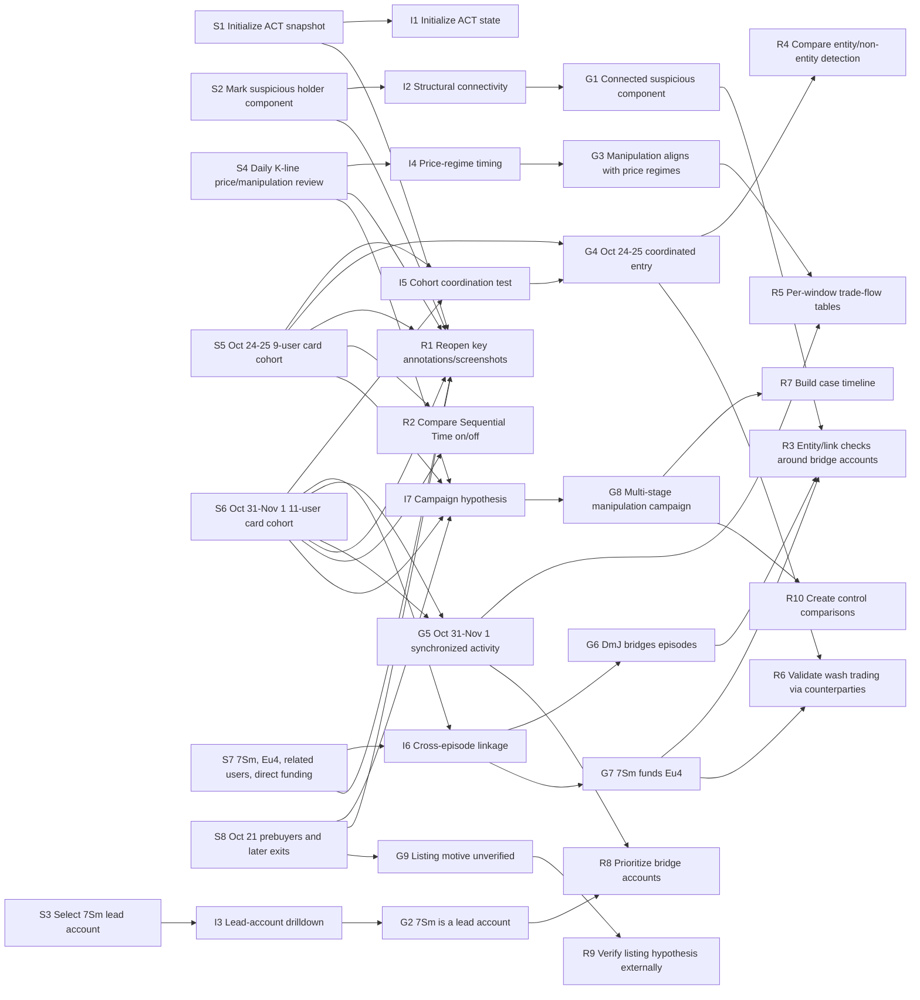

# Trace Step Mapping: Intentions, Insights, And Recommendations

This addendum maps the ACT session's trace steps to inferred user intentions, insights, and recommendations. It complements [`analysis-report.md`](analysis-report.md) by making the reasoning dependencies explicit.

## 1. Suggested Representation

The most useful representation is a claim-traceability graph:

- **Step nodes** represent observable trace evidence: actions, annotations, screenshots, and view states.
- **Intention nodes** explain what the user appeared to be trying to do.
- **Insight nodes** capture what the user explicitly recorded or what the analysis inferred.
- **Recommendation nodes** capture what should be done next because of the evidence and insight.

I would not use a graph with all 19 raw actions as first-class nodes in the main report. It becomes noisy because scroll and hover actions create many low-value edges. Instead, use the eight analytical steps below as compact evidence nodes, and keep the action indices inside each step.

## 2. Step Nodes

| Step ID | Trace Evidence | What Happened | Why It Matters |
|---|---|---|---|
| S1 | Action 0; [`action-0001-target-token_distribution-02.png`](images/action-0001-target-token_distribution-02.png); [`action-0001-target-kline_chart-01.png`](images/action-0001-target-kline_chart-01.png) | User initialized ACT at snapshot `2024-11-09 23:00:00 UTC`. | Establishes baseline state, default detector results, and end-of-window perspective. |
| S2 | Annotation 0; [`annotation-0000-token_distribution.png`](images/annotation-0000-token_distribution.png) | User marked a suspicious holder component in Token Distribution. | First strong evidence that the user was thinking about structural connectivity among suspicious holders. |
| S3 | Actions 1 to 3; [`action-0002-target-behavior_details-01.png`](images/action-0002-target-behavior_details-01.png); [`action-0004-target-behavior_details-01.png`](images/action-0004-target-behavior_details-01.png) | User selected `7SmhQ9r2TLLgS5cmWoFSVGZZw7sEySmZXzwBVscrc7qb` and inspected Behavior Details. | Shows a move from graph-level suspicion to account-level behavior. |
| S4 | Action 4; annotations 1 to 3; [`annotation-0001-candlestick_chart.png`](images/annotation-0001-candlestick_chart.png); [`annotation-0002-candlestick_chart.png`](images/annotation-0002-candlestick_chart.png); [`annotation-0003-candlestick_chart.png`](images/annotation-0003-candlestick_chart.png) | User changed K-line to `1d`, inspected price phases, and annotated manipulation windows. | Indicates the user was relating manipulation events to market price regimes. |
| S5 | Actions 5 to 9; annotation 4; [`action-0009-source-kline_chart-01.png`](images/action-0009-source-kline_chart-01.png); [`action-0009-target-behavior_details-01.png`](images/action-0009-target-behavior_details-01.png); [`annotation-0004-behavior_details.png`](images/annotation-0004-behavior_details.png) | User scrolled cards, clicked a 9-user card around Oct 24 to 25, and annotated coordinated new-entry buying. | Establishes the first card-cohort test. |
| S6 | Actions 10 to 14; annotations 5 to 7; [`annotation-0005-behavior_details.png`](images/annotation-0005-behavior_details.png); [`annotation-0006-candlestick_chart.png`](images/annotation-0006-candlestick_chart.png); [`annotation-0007-behavior_details.png`](images/annotation-0007-behavior_details.png) | User toggled Sequential Time, clicked an 11-user card around Oct 31 to Nov 1, and compared behavior windows. | Establishes a second coordinated episode and links it to the first through repeated actor `DmJ...`. |
| S7 | Actions 15 to 17; annotations 8 and 9; [`annotation-0008-behavior_details.png`](images/annotation-0008-behavior_details.png); [`annotation-0009-behavior_details.png`](images/annotation-0009-behavior_details.png) | User selected `7Sm...`, enabled related users, and annotated direct funding and behavioral similarity. | Converts temporal similarity into stronger entity/funding evidence. |
| S8 | Action 18; annotation 10; [`annotation-0010-behavior_details.png`](images/annotation-0010-behavior_details.png) | User inspected early Oct 21 buyers who later sold in the suspicious window and retained holdings. | Supports a campaign-level accumulation, manipulation, and profit-taking narrative. |

## 3. Claim Nodes

### Intentions

| ID | Level | Intention |
|---|---|---|
| I1 | Low | Initialize ACT and inspect the default suspicious state. |
| I2 | Mid | Determine whether suspicious holders are structurally connected. |
| I3 | Mid | Identify a lead account and inspect its behavior. |
| I4 | Mid | Relate manipulation-card activity to price regimes. |
| I5 | Mid | Test whether manipulation-card cohorts behave like coordinated groups. |
| I6 | Mid | Check whether separate manipulation episodes are linked by repeated or funded accounts. |
| I7 | High | Build a coherent ACT manipulation campaign hypothesis. |

### Insights

| ID | Level | Insight |
|---|---|---|
| G1 | Low | The selected suspicious holder area is a dense connected component with entity groups. |
| G2 | Low | `7Sm...c7qb` is a key account worth drilling into. |
| G3 | Mid | Manipulation activity clusters around important price regimes, especially after the Oct 20 to 23 price rise and during declines. |
| G4 | Mid | The Oct 24 to 25 card cohort shows coordinated new-entry buying. |
| G5 | Mid | The Oct 31 to Nov 1 card cohort shows broader simultaneous suspicious behavior. |
| G6 | Mid | `DmJ...` bridges the Oct 24 to 25 and Oct 31 to Nov 1 episodes. |
| G7 | Mid | `7Sm...c7qb` directly funds `Eu4...Vzh`, strengthening the entity/collusion hypothesis. |
| G8 | High | The trace supports a multi-stage campaign hypothesis: accumulation, price support or inflation, synchronized manipulation, and later profit-taking. |
| G9 | High | The exchange-listing motive is plausible as a user hypothesis but unverified by the trace. |

### Recommendations

| ID | Level | Recommendation |
|---|---|---|
| R1 | Low | Reopen and compare the key annotations and screenshots for S2, S4, S5, S6, S7, and S8. |
| R2 | Low | Inspect Behavior Details for the same card cohorts with Sequential Time both on and off. |
| R3 | Mid | Run entity and link checks around bridge accounts: `DmJ...`, `7Sm...`, `Eu4...`, `9Kj...`, and `62c...`. |
| R4 | Mid | Compare entity-based versus non-entity manipulation detection. |
| R5 | Mid | Build per-window trade-flow tables for Oct 21, Oct 24 to 25, Oct 31 to Nov 1, and Oct 31 to Nov 2. |
| R6 | Mid | Validate wash-trading claims through counterparties, funding links, and same-window opposite-side trades. |
| R7 | High | Build a case timeline for the suspected ACT manipulation campaign. |
| R8 | High | Prioritize bridge accounts before peripheral one-window participants. |
| R9 | High | Verify the exchange-listing hypothesis externally before using it as a conclusion. |
| R10 | High | Create control comparisons against non-card holders or unrelated card users. |

## 4. Traceability Matrix

| Step | Directly Hints At Intentions | Supports Insights | Triggers Recommendations | Rationale |
|---|---|---|---|---|
| S1 | I1 | Baseline for G3 to G8 | R1 | The session begins from a fixed ACT snapshot and current detector output, so later observations should be interpreted relative to this baseline. |
| S2 | I2 | G1 | R1, R3 | A user-authored annotation explicitly identifies a connected suspicious component and entity groups, which justifies deeper entity/link checking. |
| S3 | I3, I6 | G2, later G7 | R3, R8 | Selecting `7Sm...c7qb` makes it a lead account. Later evidence shows it funds `Eu4...`, so this early selection becomes more important retrospectively. |
| S4 | I4, I7 | G3, part of G8, G9 as hypothesis context | R1, R5, R7, R9 | Daily granularity and K-line annotations show the user was reasoning over price phases and manipulation timing, not just individual trades. |
| S5 | I5 | G4, part of G8 | R2, R4, R5, R6, R7 | The 9-user card click plus Behavior Details annotation is the first concrete cohort-level behavior test. It raises the question of whether same-window buying is coordinated or entity-linked. |
| S6 | I5, I6, I7 | G5, G6, part of G8 | R2, R3, R4, R5, R6, R7, R8 | Sequential Time and a second card cohort show the user was comparing behavior order and repeated actors across episodes. `DmJ...` becomes a bridge account. |
| S7 | I6 | G7 | R3, R6, R8 | Direct funding between `7Sm...` and `Eu4...` makes the collusion/entity hypothesis stronger than behavior similarity alone. |
| S8 | I7 | G8, G9 | R5, R7, R9, R10 | The final annotation generalizes the investigation into early accumulation, later selling, retained holdings, and possible listing-driven price inflation. |

## 5. Graph

## 6. How To Read The Graph

The graph has three useful patterns:

- **S2 -> I2 -> G1 -> R3**: the Token Distribution annotation directly leads from structural-connectivity intent to entity/link checking.
- **S5 and S6 -> I5/I6 -> G4/G5/G6 -> R4/R5/R6/R8**: the two card-cohort episodes drive most mid-level recommendations because they are the best evidence for coordinated behavior and repeated actors.
- **S4, S5, S6, S8 -> I7 -> G8 -> R7/R10**: the high-level campaign hypothesis only emerges after multiple views and time windows are combined. It should not be attributed to a single action.

## 7. Suggestions For Future Trace Analysis

- Keep two artifacts: a narrative report and a traceability map. The narrative explains the case; the map explains why the case follows from the trace.
- Use step-level nodes, not raw action-level nodes, unless analyzing micro-interaction usability. Raw action graphs are too noisy for insight analysis.
- Treat annotations as claim nodes authored by the user, and use actions/screenshots as evidence nodes.
- Put recommendations downstream of insights, not directly downstream of actions, unless the recommendation is purely UI-oriented.
- Add confidence labels if the graph is used for research coding. For example, "direct evidence", "strong inference", and "weak hypothesis".
- Keep unverified motives, such as the exchange-listing hypothesis, as separate nodes so they do not contaminate stronger trace-supported findings.
