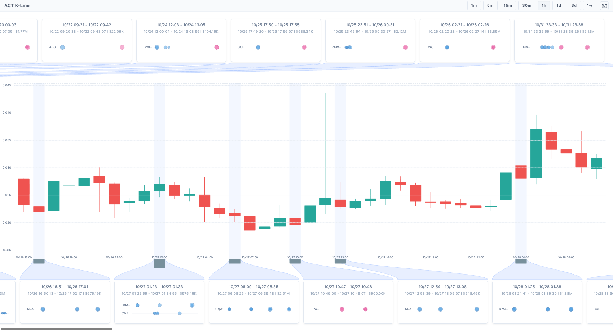
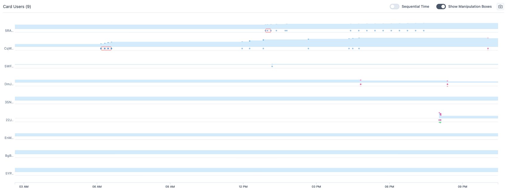
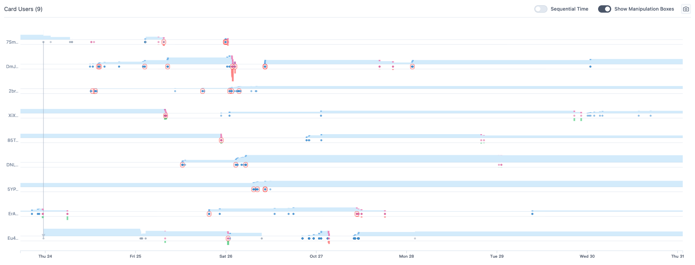
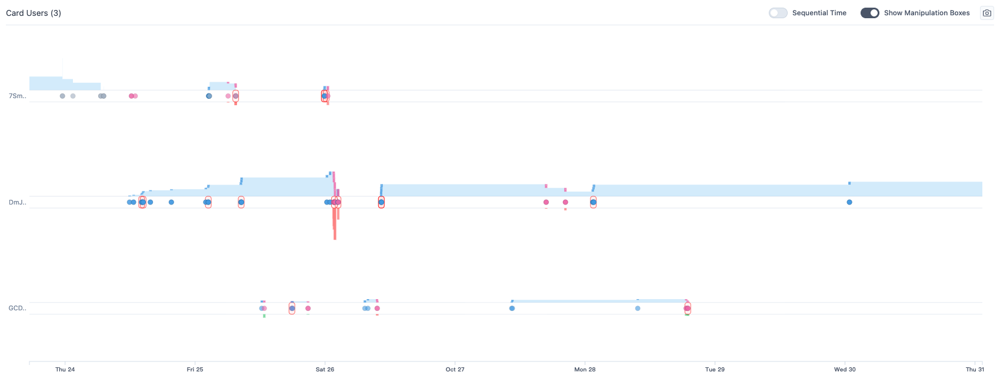
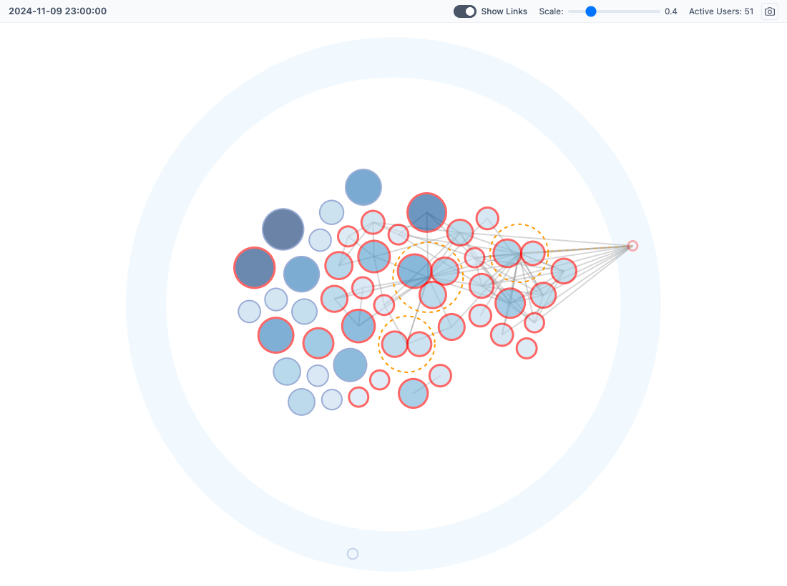

# ManiScope Trace Analysis Report

## Scope

Trace: `maniscope-session-ACT-20260501-025125`  
Coin: ACT  
Exported: `2026-04-30T18:51:25.070Z`  
Inputs: `session.json`, exported screenshots under `images/`, the ManiScope user manual, local ACT data, and follow-up rendered evidence under `continued-investigation-assets/`.

This report reconstructs the user reasoning from scratch, then summarizes the follow-up investigation that was executed after building the Recommendation Plan Forest.

## User Reasoning Summary

The user began with a snapshot-level risk assessment. They updated the ACT snapshot at `2024-11-09 23:00:00 UTC`, inspected Token Distribution with links enabled, and annotated a concentrated top-holder structure. Their early notes state that roughly 51 active users hold about 30% of the token supply, that most of the prominent holders are red-stroked as suspicious, and that three orange dashed entity groups include large accounts. The user then synthesized this into the high-level insight that a small number of whales control most circulating supply while retail holders remain peripheral.

The second reasoning thread was role differentiation. The user selected `6Z6RJJ...` and treated it as a top holder with about 10M tokens but no visible manipulation behavior, then interpreted its Behavior Details as transfer-acquired whale storage. They then selected `CqWVLX...`, which was flagged by same-direction detection, but interpreted the short purchase burst as normal progressive accumulation. The trace then moves to `DNLFULT...` and `DmJRzw...`, where the user focused on related-user behavior, frequent buys, transfers out, and likely functional-account behavior.

The third reasoning thread was the same-direction card investigation. The user scrolled K-line same-direction cards into the Oct. 25-27 region, clicked a 9-user card, changed Behavior Details time mode, clicked another 9-user card, and finally clicked a 3-user card. Their annotations connect these cards to Oct. 26-27 price movement, alternating buy/sell same-direction activity, and component membership. Their final high-level insight claims that the selected addresses form a large colluding group.

## Reconstructed Hypotheses

- `H1`: ACT holder structure is manipulation-prone because supply is concentrated and suspicious holders are linked into entities/components.
- `H2`: Suspicious visual flags require role differentiation because some large or flagged wallets are storage or normal accumulation rather than direct manipulators.
- `H3`: The Oct. 26-27 same-direction card users indicate a larger coordinated manipulation pattern, but individual support differs by wallet.

The canonical graph is in `reasoning-graph.json`; the generated readable forest is in `user-reasoning-forest.md`.

## Follow-Up Adjacent Hypothesis

The Recommendation Plan Forest included one Hypothesis Expansion branch. After executing it, the follow-up evidence was strong enough to promote a new adjacent hypothesis into the augmented reasoning graph:

- `H_AGENT_1`: The larger ACT coordination group contains differentiated roles, including high-frequency buyers, net sellers, round-trip-like actors, and transfer-linked functional accounts.

This new tree is generated in `augmented-reasoning-forest.md` and is backed mainly by A16/A21 role summaries plus rendered Behavior Details evidence.

## Key Follow-Up Findings

- A13, the first 9-user clicked card cohort, has 49 trades by 5 of 9 card users inside the selected Behavior Details window. It bought 9.95M ACT and sold 8.30M ACT. The same 1-minute OHLC window ranged from +45.0% above its opening price to -49.8% below it, then closed -23.1% from the first minute open.
- The rendered K-line follow-up shows dense same-direction cards around Oct. 26-27, including card totals of 15.85M, 9.83M, and 2.51M tokens in the focused window.
- The current render API link component connects 16 of 17 selected/clicked follow-up users, but `CqWVLX...` remains isolated in that link-derived component summary.
- Raw transfer data is much weaker than the visual component claim: among selected/clicked follow-up users there is only one direct internal transfer, `7SmhQ9... -> Eu4DNn...` for 5.56M ACT on Oct. 23. The component evidence is therefore model-link and timing evidence, not direct-transfer proof.
- A16 has 377 trades by all 9 card users with 37.93M ACT bought and 34.47M ACT sold. A21 has 150 trades by 3 users. These cohorts are role-differentiated rather than homogeneous.

## Evidence Images

- 
- 
- 
- 
- 

## Interpretation

The trace supports the user's broad interpretation that ACT had a high manipulation-risk structure and that the Oct. 26-27 same-direction activity is suspicious. The follow-up investigation strengthens that interpretation with exact trade and price-window evidence. It also narrows the strongest claim: the selected users do not all have equal support, and the large-component claim depends mainly on ManiScope link/entity modeling and manipulation-time proximity rather than raw direct transfers.

The promoted adjacent hypothesis makes that narrowing explicit: the suspicious group is better treated as a role-differentiated coordination structure than as a set of homogeneous same-direction actors.

## Caveats

- The exported trace records card users but not the exact clicked card object or card index, so the follow-up used the captured screenshots, session card-user lists, the current render API card summaries, and local raw data to reconstruct the card windows.
- Behavior Details visual marks can be sampled. Exact counts and token amounts in this report come from CSV/JSON data, not dot counting.
- The in-app browser automation surface was unavailable in this session, so the render pass used the available Playwright browser tool against the same local frontend and saved all render outputs as trace-local PNG files.
