# ACT Trace Analysis Report

Trace: `maniscope-session-ACT-20260501-025125`  
Coin: ACT  
Exported at: `2026-04-30T18:51:25.070Z`  
Actions: 24  
Annotations: 18  
Screenshots: 36

## Scope And Method

This is a fresh full trace analysis using the updated `skills/user-trace-analysis/SKILL.md` workflow. Outputs are under `analysis-results/`. Original trace screenshots are linked as `../images/...`; follow-up render evidence is saved under `continued-investigation-assets/`.

I separated three evidence layers:

- Observed trace evidence: `session.json`, exported action screenshots, and user annotations.
- Analyst inference: reconstructed tasks, analytic questions, hypotheses, findings, and insights.
- Follow-up validation: local ACT CSV/JSON calculations plus rendered ManiScope views generated through the local frontend render API.

No external web evidence was used. Card-window timestamps used for local validation are read from the visible K-line card labels in the exported screenshots and rendered views, because `session.json` stores clicked users but not each card's machine-readable time span.

## System Semantics Used

The user manual and frontend source establish these view meanings:

- Token Distribution shows top holders and related users. Red strokes indicate users in manipulation results, blue strokes indicate unflagged users, grey links are soft relationships, and orange dashed boundaries are detected entity groups.
- K-line cards above the chart are round-trip events. K-line cards below the chart are same-direction events. Clicking a card loads its participant wallets into Behavior Details.
- Behavior Details uses action dots, balance areas, earnings bars, transfer lines, and red manipulation boxes. Sequential Time changes the x-axis from absolute time to event order.

## Reconstructed Intention Space

The trace supports three high-level hypotheses:

1. ACT top-holder supply is centralized and many high-balance holders are flagged or linked.
2. Whales and flagged accounts have different roles, so passive storage should be separated from active coordination.
3. A large colluding ACT component coordinated same-direction and round-trip behavior around Oct 25-27.

These hypotheses were pursued through three strategies: top-holder topology triage, wallet role classification, and manipulation-card cohort comparison.

## Observed Trace Evidence

### Token Distribution And Centralization

The trace begins with the default ACT snapshot at `2024-11-09 23:00:00 UTC`, 30 percent top-holder threshold, and related-user threshold 0.2. The user toggled Token Distribution links off and on, then annotated a graph with 51 active users and many red-stroked nodes.

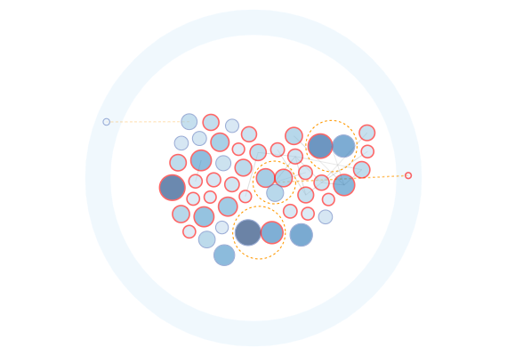

The user then marked three orange dashed entity groups and a larger connected component that contains two of those entities plus other holders.

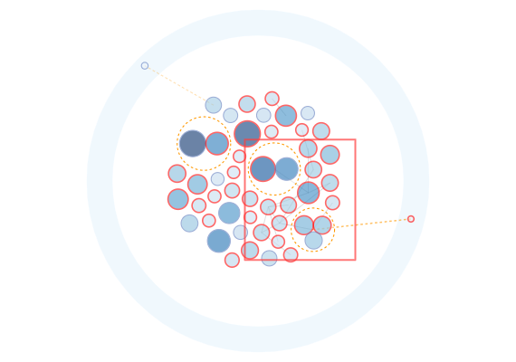

Observed finding: the user treated the holder map as a component-level risk signal, not just as a list of large holders.

### Role Separation From Wallet Inspection

The user selected individual wallets before committing to the group hypothesis:

| Wallet address | All trades | Buys / sells | All USD | Net tokens | Events | Snapshot balance | First trade |
| --- | --- | --- | --- | --- | --- | --- | --- |
| 6Z6RJJGrmVyndcPyTFhmLYHkHttiYtTccKpXFV9r2237 | 0 | 0 / 0 | $0.00 | 0.00M | 3 | 10.64M | none |
| CqWVLXaj8r6vud5SfFr81SzmFoqXa5daLi1WbpQZxuhV | 29 | 27 / 2 | $279,596.52 | 10.23M | 25 | 10.23M | 2024-10-25T18:38:26Z |
| DNLFULTWBTkpfwpXZeMA7ckMbQntHuLqxZq6RH6xnaji | 168 | 165 / 3 | $459,115.69 | 17.16M | 165 | 9.33M | 2024-10-25T04:23:53Z |
| DmJRzwcmFFFKhJ5dSJuSU3Lns4bfiMb8b1V3vhJG7uLH | 125 | 103 / 22 | $714,065.70 | 7.05M | 124 | 7.05M | 2024-10-24T03:53:43Z |
| 7SmhQ9r2TLLgS5cmWoFSVGZZw7sEySmZXzwBVscrc7qb | 41 | 27 / 14 | $178,977.58 | 2.66M | 61 | 0.54M | 2024-10-19T17:49:58Z |
| GCDEuA5Q6KugDcN5wxnorwkeSrMYiPJse24pDfFbLZXz | 121 | 60 / 61 | $455,757.79 | 2.19M | 85 | 2.33M | 2024-10-20T02:28:27Z |

Trace interpretation:

- `6Z6...237` is a high-balance holder with no trades in the local trade CSV and only 3 behavior-sequence events. This supports the user's passive-storage interpretation.
- `CqW...uhV` has 29 trades and a positive net balance, which fits the user's normal accumulator note.
- `DNL...aji` and `DmJ...uLH` have much higher activity, with 168 and 125 trades respectively. These are better treated as active functional accounts than as passive whales.

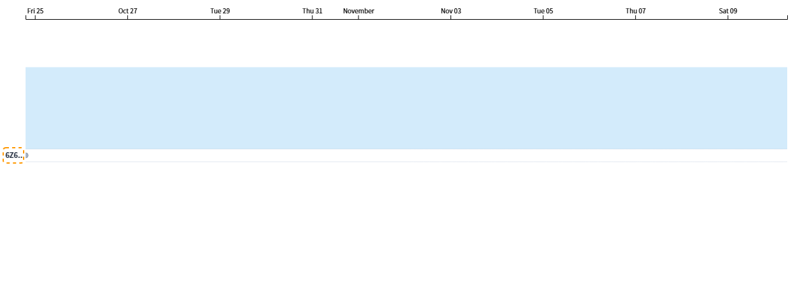

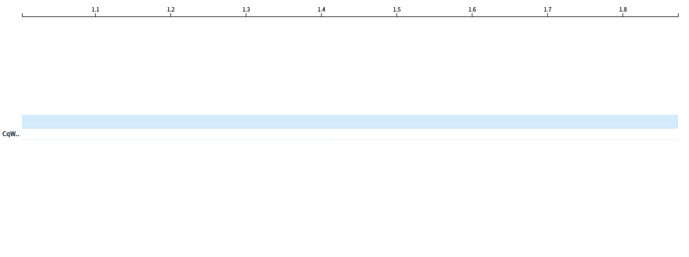

### Manipulation-Card Cohorts

The main suspicious activity sequence starts when the user scrolls the same-direction card row, clicks a 9-user card around A13, switches Behavior Details time mode, clicks a second 9-user card around A16, then clicks a 3-user round-trip card around A21.

| Card | Users | Window used for local validation | Trades | Buys / sells | Clicked USD | Market share | Net tokens | Users with trades |
| --- | --- | --- | --- | --- | --- | --- | --- | --- |
| A13 | 9 | 2024-10-25T08:38:45Z to 2024-10-26T08:38:24Z | 115 | 99 / 16 | $846,294.23 | 1.52% | 20.17M | 8 |
| A16 | 9 | 2024-10-26T07:10:41Z to 2024-10-27T07:42:24Z | 35 | 19 / 16 | $256,955.53 | 0.84% | -2.03M | 4 |
| A21 | 3 | 2024-10-25T17:24:32Z to 2024-10-26T02:52:01Z | 36 | 16 / 20 | $271,203.00 | 1.24% | -3.39M | 2 |

Exact clicked users are preserved here for auditability:

| Card | Wallet address | Trades | Buys / sells | USD in card window | Net tokens | Snapshot balance |
| --- | --- | --- | --- | --- | --- | --- |
| A13 | DmJRzwcmFFFKhJ5dSJuSU3Lns4bfiMb8b1V3vhJG7uLH | 34 | 18 / 16 | $278,854.02 | -1.78M | 7.05M |
| A13 | 22JYebQtQSLchTXiRJVCx7hpPamN1YzLJKHET52S6eBm | 6 | 6 / 0 | $208,870.46 | 6.92M | 2.80M |
| A13 | BgBmwgMG1cRQxHKkgYd42Gz8rpXtSNcnqgazWGPfdDon | 6 | 6 / 0 | $98,289.00 | 4.38M | 4.38M |
| A13 | 35NoW8F4Q3Gcqf3Wf4RMmoAgS7FHchCjv3R2F241zuPQ | 6 | 6 / 0 | $97,891.00 | 4.23M | 4.23M |
| A13 | 5RA23pdRqxPHjGZT9kUCdywx5QgQ3NFo5NXiNSsCCVEz | 26 | 26 / 0 | $97,270.36 | 3.21M | 6.66M |
| A13 | 5YPynSvVjWB6EQeFNg3WiKoGsm7J9doxpBY3sVMy1xYv | 28 | 28 / 0 | $28,287.68 | 1.60M | 4.60M |
| A13 | EnMAi9raXU8KMBP3YLKAsLL1EnucWrggtBAxZAsmLBZ3 | 7 | 7 / 0 | $19,757.71 | 0.69M | 3.56M |
| A13 | CqWVLXaj8r6vud5SfFr81SzmFoqXa5daLi1WbpQZxuhV | 2 | 2 / 0 | $17,074.00 | 0.94M | 10.23M |
| A16 | Eu4DNnkPbV9kMj81FwaZMHPqAHsBAVrwbtjGfKdRhVzh | 4 | 0 / 4 | $80,734.01 | -3.90M | 5.39M |
| A16 | 85TMiRBoDjZiFjHUwrrBkqZDh4o3SHMPtgbDXM7N7Qff | 10 | 10 / 0 | $79,750.69 | 2.78M | 3.04M |
| A16 | ErAJGcJTEUqa11ag1MxLWZjqoqzgTtZKJk9cQiN9T3ZU | 17 | 5 / 12 | $79,711.01 | -1.67M | 3.29M |
| A16 | XiXRAfbXGgNsZw2hwPdqBsU461kXFfYgTMV8sgjRSvN | 4 | 4 / 0 | $16,759.82 | 0.76M | 3.58M |
| A16 | 7SmhQ9r2TLLgS5cmWoFSVGZZw7sEySmZXzwBVscrc7qb | 0 | 0 / 0 | $0.00 | 0.00M | 0.54M |
| A16 | DmJRzwcmFFFKhJ5dSJuSU3Lns4bfiMb8b1V3vhJG7uLH | 0 | 0 / 0 | $0.00 | 0.00M | 7.05M |
| A16 | 2brzD1rU8m71zf23bfgtw3vn9pqZG2CDxYU3nQ5pPizN | 0 | 0 / 0 | $0.00 | 0.00M | 4.13M |
| A16 | DNLFULTWBTkpfwpXZeMA7ckMbQntHuLqxZq6RH6xnaji | 0 | 0 / 0 | $0.00 | 0.00M | 9.33M |
| A16 | 5YPynSvVjWB6EQeFNg3WiKoGsm7J9doxpBY3sVMy1xYv | 0 | 0 / 0 | $0.00 | 0.00M | 4.60M |
| A21 | DmJRzwcmFFFKhJ5dSJuSU3Lns4bfiMb8b1V3vhJG7uLH | 28 | 12 / 16 | $244,289.02 | -3.39M | 7.05M |
| A21 | GCDEuA5Q6KugDcN5wxnorwkeSrMYiPJse24pDfFbLZXz | 8 | 4 / 4 | $26,913.98 | 0.00M | 2.33M |

Observed trace evidence supports the user's visual reasoning:

- A13 shows a 9-user card where DmJ sells while multiple other wallets buy in the same broad window.
- A16 shows a 9-user card with alternating buy and sell clusters. The exact card-window calculation is mixed: only 4 of the 9 wallets trade in that narrow screenshot-derived window, but those 4 still account for $256,955.53.
- A21 shows a compact 3-user round-trip card. DmJ and GCDE trade in the A21 window; 7Sm is important through overlap with A16 and a direct transfer to Eu4, not through a trade inside the exact A21 window.

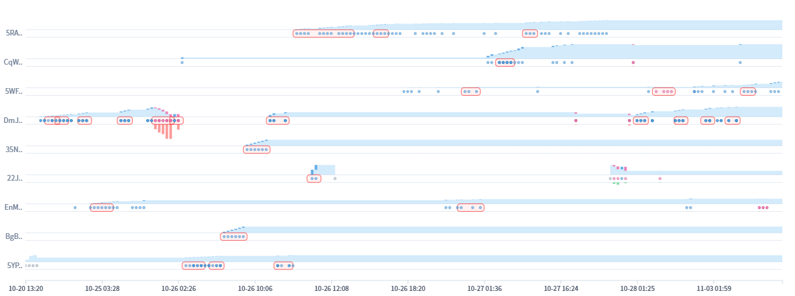

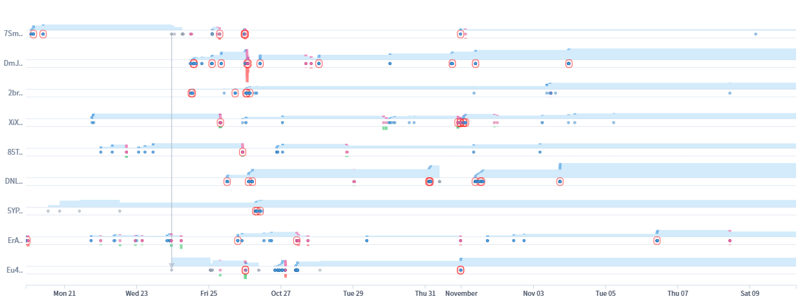

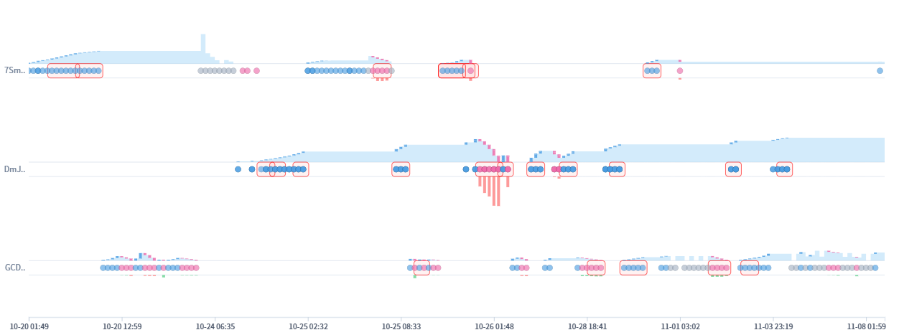

## Follow-Up Validation

Rendered views saved from the local ManiScope frontend:

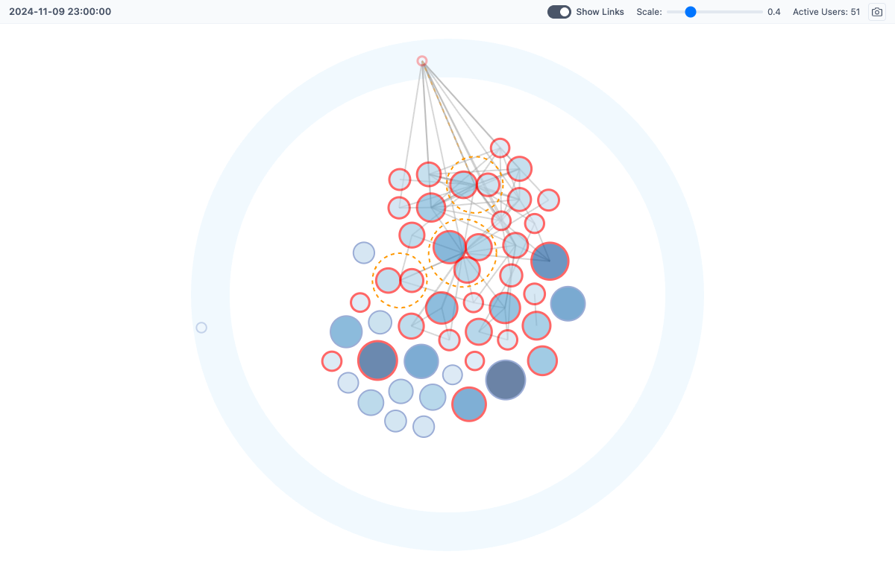

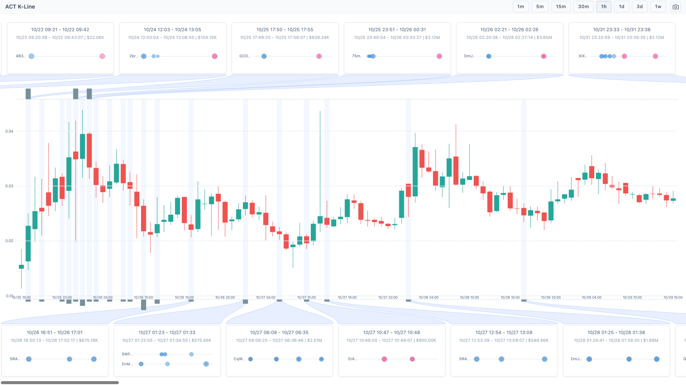

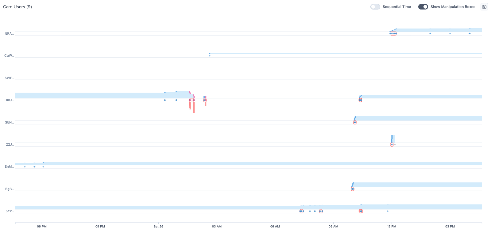

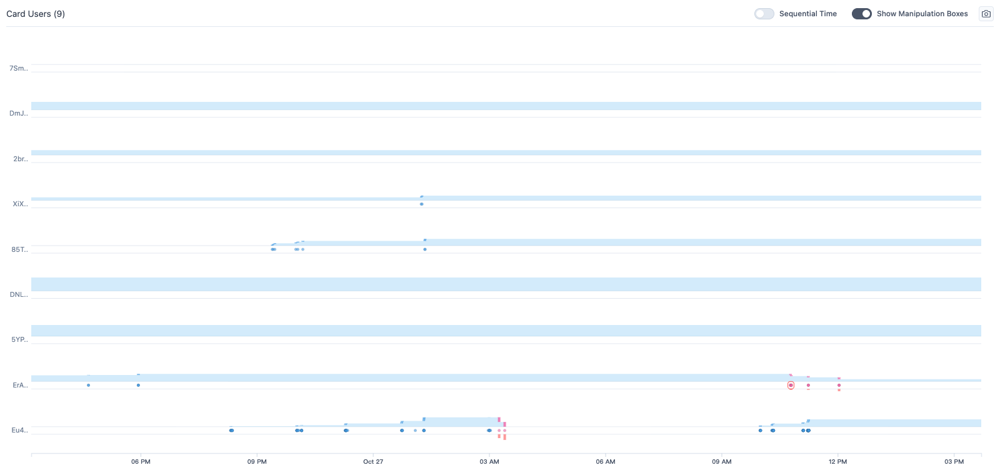

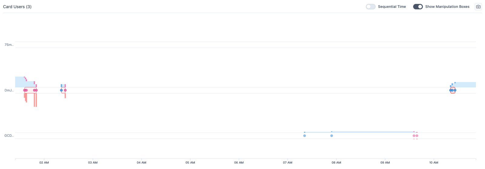

### Price-Window Contrast

| Window | 1H rows covered | Open | Close | High | Low | Open-to-close |
| --- | --- | --- | --- | --- | --- | --- |
| A13 | 2024-10-25T09:00:00Z to 2024-10-26T08:00:00Z | 0.016268 | 0.023241 | 0.043826 | 0.014645 | 42.86% |
| A16 | 2024-10-26T08:00:00Z to 2024-10-27T07:00:00Z | 0.028001 | 0.024391 | 0.043633 | 0.015091 | -12.89% |
| A21 | 2024-10-25T18:00:00Z to 2024-10-26T02:00:00Z | 0.039521 | 0.021756 | 0.039800 | 0.020490 | -44.95% |
| Oct 25-27 | 2024-10-25T00:00:00Z to 2024-10-27T23:00:00Z | 0.028541 | 0.035021 | 0.043826 | 0.011287 | 22.71% |

Interpretation: the user was right to focus on a volatile price region, but the follow-up data supports careful wording. A13 has a strong open-to-close increase and a very large intrawindow high. A16 and A21 are volatile but open-to-close negative in their narrow card windows. This validates price relevance more strongly than direct causality.

### Sibling Window Search

Top clicked-wallet days:

| Day | Trades | Clicked users active | Clicked USD | Buy USD | Sell USD |
| --- | --- | --- | --- | --- | --- |
| 2024-10-26 | 145 | 15 | $1,016,541.84 | $921,989.16 | $94,552.68 |
| 2024-10-25 | 200 | 12 | $850,677.08 | $512,818.37 | $337,858.71 |
| 2024-10-27 | 65 | 7 | $527,550.49 | $254,376.24 | $273,174.24 |
| 2024-10-31 | 97 | 8 | $458,933.16 | $311,840.36 | $147,092.80 |
| 2024-10-24 | 91 | 6 | $381,948.84 | $278,761.76 | $103,187.08 |

Top clicked-wallet hours:

| Hour | Trades | Clicked users active | Clicked USD | Buy USD | Sell USD |
| --- | --- | --- | --- | --- | --- |
| 2024-10-26T04:00:00Z | 22 | 3 | $281,749.36 | $281,749.36 | $0.00 |
| 2024-10-26T02:00:00Z | 24 | 4 | $244,103.30 | $244,103.30 | $0.00 |
| 2024-10-27T12:00:00Z | 11 | 2 | $203,842.44 | $46,427.64 | $157,414.80 |
| 2024-10-31T15:00:00Z | 30 | 5 | $170,422.68 | $121,975.72 | $48,446.97 |
| 2024-10-25T16:00:00Z | 19 | 5 | $124,156.94 | $53,542.24 | $70,614.70 |

This expands the user's path: Oct 25, Oct 26, and Oct 27 are indeed the highest clicked-wallet concentration days, but Oct 31 also appears as a later sibling window worth checking if the investigation continues.

### Transfer Evidence

Direct internal transfers among all clicked card wallets are sparse. The follow-up found one direct internal transfer: 7Sm...7qb transferred 5.56M tokens to Eu4...Vzh at `2024-10-23T15:31:44Z`. No direct internal transfer was found inside the A21 exact card window.

This supports a behavior-linked adjacent A21 hypothesis, but it does not support claiming that A21 is a direct-transfer component.

## Findings And Insights

- Finding 1: The trace begins from a concentrated ACT holder map with many red-stroked top holders and strict entity groups inside a larger link neighborhood.
- Finding 2: Wallet role separation is necessary. 6Z6 is storage-like, CqW is accumulator-like, and DNL/DmJ are active functional accounts.
- Finding 3: A13, A16, and A21 form a coherent clicked-card sequence around Oct 25-27, with repeated wallets across cards. A13 and A16 overlap through DmJ...uLH and 5YP...xYv; A16 and A21 overlap through 7Sm...7qb and DmJ...uLH.
- Insight 1: The user's high-level collusion claim is supported by the trace and strengthened by local data, especially through repeated card membership, role specialization, and volatile price-window alignment.
- Insight 2: Price impact remains a cautious inference. The evidence supports relevance and plausibility, not single-window causality.
- Insight 3: The A21 3-user card deserves a separate adjacent hypothesis: it is a smaller behavior-linked round-trip mechanism nested inside the broader H3 group.

## Recommendations Executed

The Recommendation Plan Forest was executed, not only written. Results are in `continued-investigation-report.md` and merged into `reasoning-graph-patch-001.json`.

- Evidence Completion: classify A13, A16, and A21 roles through exact local data. Executed.
- Evidence Completion: quantify OHLC and market-share contrast for clicked card windows. Executed.
- Evidence Completion: validate selected wallet role profiles. Executed.
- Hypothesis Expansion: resolve whether A21 should become an adjacent hypothesis. Executed and promoted with a caveat that direct-transfer evidence is absent inside A21.

## Caveats

- The exported trace does not store machine-readable clicked card time spans, so A13, A16, and A21 validation windows were reconstructed from visible K-line card labels.
- Behavior Details renders can downsample dense event rows; exact counts come from local CSV/JSON, not dot counting.
- Local data validation is supporting evidence. It was not necessarily visible to the user during the original trace.
