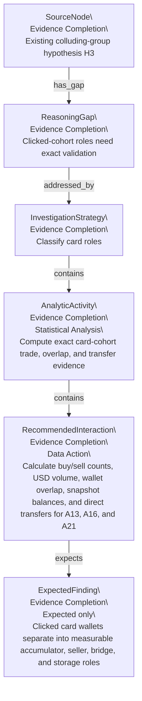
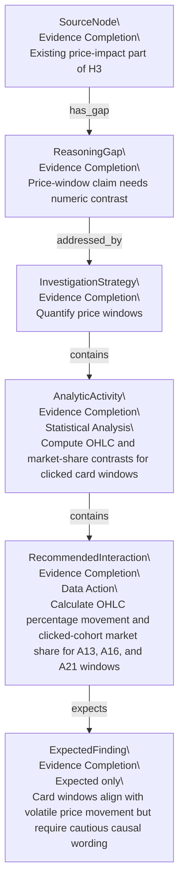
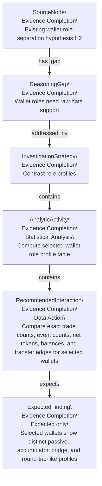
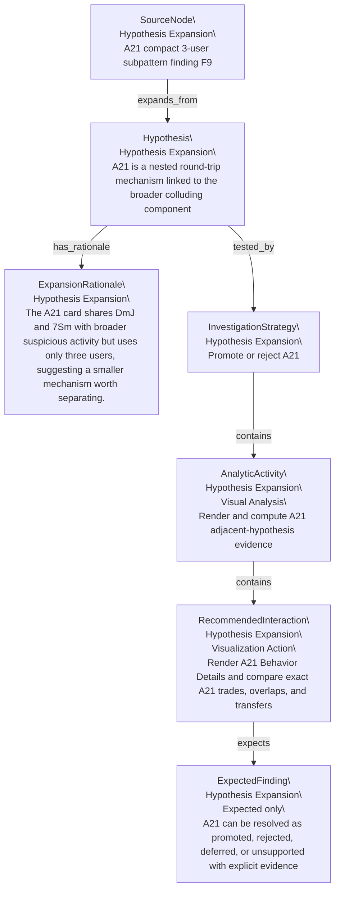

# Recommendation Plan Forest

This file is mechanically generated from `recommendation-plan-graph.json`. It is prescriptive: Expected Findings are plan targets, not evidence-backed Findings.

## Tree 1: SRC_H3_ROLE

Existing colluding-group hypothesis H3

| Instance ID | Canonical ID | Parent | Relation | Kind | Recommendation Type | Status | Label |
|---|---|---|---|---|---|---|---|
| SRC_H3_ROLE | SRC_H3_ROLE |  |  | SourceNode | Evidence Completion | planned | Existing colluding-group hypothesis H3 |
| RG1@SRC_H3_ROLE.1 | RG1 | SRC_H3_ROLE | has_gap | ReasoningGap | Evidence Completion | planned | Clicked-cohort roles need exact validation |
| RS1@SRC_H3_ROLE.1.1 | RS1 | RG1@SRC_H3_ROLE.1 | addressed_by | InvestigationStrategy | Evidence Completion | planned | Classify card roles |
| AA_RS1@SRC_H3_ROLE.1.1.1 | AA_RS1 | RS1@SRC_H3_ROLE.1.1 | contains | AnalyticActivity | Evidence Completion | planned | Compute exact card-cohort trade, overlap, and transfer evidence |
| RI_RS1@SRC_H3_ROLE.1.1.1.1 | RI_RS1 | AA_RS1@SRC_H3_ROLE.1.1.1 | contains | RecommendedInteraction | Evidence Completion | planned | Calculate buy/sell counts, USD volume, wallet overlap, snapshot balances, and direct transfers for A13, A16, and A21 |
| EF_RS1@SRC_H3_ROLE.1.1.1.1.1 | EF_RS1 | RI_RS1@SRC_H3_ROLE.1.1.1.1 | expects | ExpectedFinding | Evidence Completion | planned | Clicked card wallets separate into measurable accumulator, seller, bridge, and storage roles |

### Node Detail Context

| Node | Explanation | Evidence Summary | Reasoning Role |
|---|---|---|---|
| SRC_H3_ROLE | This source node points to the existing colluding-group hypothesis H3, specifically the part that needs stronger role evidence. | H3 is supported by visual card and component evidence from the user trace. | Anchors an Evidence Completion branch to the original user reasoning tree. |
| RG1 | The trace shows clicked card cohorts visually, but it does not yet quantify whether those wallets have distinct functional roles. | A13, A16, and A21 were inspected through K-line cards and Behavior Details screenshots. | Defines the missing evidence that RS1 should fill. |
| RS1 | Operationalize the collusion hypothesis by classifying the A13, A16, and A21 clicked manipulation-card wallets into accumulators, sellers, round-trip-like actors, passive storage addresses, and transfer-linked facilitators. The target includes the 9-user Behavior Details card selected around interaction 16 (A16) plus the A13 9-user card and the A21 3-user card. | Inputs are the A13, A16, and A21 clicked-card users, local ACT trades, transfers, and balance snapshots. | Turns the clicked-card role gap into concrete cohort classification work. |
| AA_RS1 | Compute trade, overlap, transfer, and balance evidence for the clicked card cohorts. | Uses local ACT trade, transfer, behavior sequence, and balance files. | Mid-level Statistical Analysis activity under RS1. |
| RI_RS1 | Calculate buy/sell counts, USD volume, shared wallets, balances, and direct transfer edges for A13, A16, and A21. | Requires scripts or command-line data processing rather than only GUI inspection. | Low-level RecommendedInteraction that should produce EF_RS1 or a contrary result. |
| EF_RS1 | This expected finding predicts that the clicked card wallets will separate into measurable roles such as accumulator, seller, bridge, and storage. | No new evidence yet; this is the target evidence shape for RS1. | Expected outcome that becomes real only if follow-up produces a Finding node. |

### Strategy Context

| Strategy | Explanation | Target Context | Analytic Contrast | Search Concepts | Decision Criteria | Falsification Criteria |
|---|---|---|---|---|---|---|
| RS1 | Operationalize the collusion hypothesis by classifying the A13, A16, and A21 clicked manipulation-card wallets into accumulators, sellers, round-trip-like actors, passive storage addresses, and transfer-linked facilitators. The target includes the 9-user Behavior Details card selected around interaction 16 (A16) plus the A13 9-user card and the A21 3-user card. | A13, A16, and A21 clicked card users from the ACT trace. | Coordinated role-specialized behavior versus a visually dense but functionally mixed set of unrelated traders. | per-wallet buy/sell counts USD volume by role shared wallets across cards direct transfer edges snapshot balances | Support increases if the same wallets recur across cards, exact trades show complementary buy/sell roles, and transfer or balance evidence explains why some card users have few visible trades in the selected window. | Support weakens if most users have no trades in the card windows, if activity is low-volume relative to the market, or if repeated wallets do not connect across the suspicious windows. |

## Tree 2: SRC_H3_PRICE

Existing price-impact part of H3

| Instance ID | Canonical ID | Parent | Relation | Kind | Recommendation Type | Status | Label |
|---|---|---|---|---|---|---|---|
| SRC_H3_PRICE | SRC_H3_PRICE |  |  | SourceNode | Evidence Completion | planned | Existing price-impact part of H3 |
| RG2@SRC_H3_PRICE.1 | RG2 | SRC_H3_PRICE | has_gap | ReasoningGap | Evidence Completion | planned | Price-window claim needs numeric contrast |
| RS2@SRC_H3_PRICE.1.1 | RS2 | RG2@SRC_H3_PRICE.1 | addressed_by | InvestigationStrategy | Evidence Completion | planned | Quantify price windows |
| AA_RS2@SRC_H3_PRICE.1.1.1 | AA_RS2 | RS2@SRC_H3_PRICE.1.1 | contains | AnalyticActivity | Evidence Completion | planned | Compute OHLC and market-share contrasts for clicked card windows |
| RI_RS2@SRC_H3_PRICE.1.1.1.1 | RI_RS2 | AA_RS2@SRC_H3_PRICE.1.1.1 | contains | RecommendedInteraction | Evidence Completion | planned | Calculate OHLC percentage movement and clicked-cohort market share for A13, A16, and A21 windows |
| EF_RS2@SRC_H3_PRICE.1.1.1.1.1 | EF_RS2 | RI_RS2@SRC_H3_PRICE.1.1.1.1 | expects | ExpectedFinding | Evidence Completion | planned | Card windows align with volatile price movement but require cautious causal wording |

### Node Detail Context

| Node | Explanation | Evidence Summary | Reasoning Role |
|---|---|---|---|
| SRC_H3_PRICE | This source node points to the price-window part of the existing H3 reasoning. | The user annotated the K-line region as price-relevant to suspicious activity. | Anchors an Evidence Completion branch to a weak causal claim. |
| RG2 | The trace contains a visual price-impact claim, but it does not quantify OHLC movement or clicked-wallet market share. | Annotation 12 says the suspicious activity clearly affected price, but the trace alone cannot prove causality. | Defines the missing numeric contrast that RS2 should fill. |
| RS2 | Turn the visual price-impact note into a bounded contrast: compute OHLC movement and clicked-cohort market share for the A13, A16, and A21 card windows visible in the K-line screenshots. This tests whether the user marked materially volatile windows without overclaiming that the card users alone caused the price move. | Inputs are ACT OHLC records, clicked-card windows, and local trades for the same windows. | Turns a visual price interpretation into bounded statistical validation. |
| AA_RS2 | Compute OHLC movement and market-share contrasts for the clicked card windows. | Uses ACT OHLC data and clicked-cohort trade data. | Mid-level Statistical Analysis activity under RS2. |
| RI_RS2 | Calculate open-close movement, high-low volatility, and clicked-cohort market share for A13, A16, and A21. | Requires local data calculations beyond GUI-displayed statistics. | Low-level RecommendedInteraction that should produce EF_RS2 or a contrary result. |
| EF_RS2 | This expected finding predicts that the card windows are price-relevant but require cautious causal wording. | No new evidence yet; this is the target evidence shape for RS2. | Expected outcome that should refine F6 and H3 if supported. |

### Strategy Context

| Strategy | Explanation | Target Context | Analytic Contrast | Search Concepts | Decision Criteria | Falsification Criteria |
|---|---|---|---|---|---|---|
| RS2 | Turn the visual price-impact note into a bounded contrast: compute OHLC movement and clicked-cohort market share for the A13, A16, and A21 card windows visible in the K-line screenshots. This tests whether the user marked materially volatile windows without overclaiming that the card users alone caused the price move. | K-line cards visible around actions 13, 16, and 21, plus the Oct 25 to Oct 28 rendered K-line follow-up view. | Price-window relevance versus unsupported causality. | OHLC open close high low market volume share window-level buy/sell imbalance visual card alignment | Support increases if card windows overlap volatile OHLC movement and material clicked-wallet volume; causality remains tentative unless clicked wallets dominate or closely precede the price movement. | Support weakens if the card windows are price-flat, if clicked-wallet volume is trivial, or if activity timing follows rather than precedes the price move. |

## Tree 3: SRC_H2_ROLE

Existing wallet-role separation hypothesis H2

| Instance ID | Canonical ID | Parent | Relation | Kind | Recommendation Type | Status | Label |
|---|---|---|---|---|---|---|---|
| SRC_H2_ROLE | SRC_H2_ROLE |  |  | SourceNode | Evidence Completion | planned | Existing wallet-role separation hypothesis H2 |
| RG3@SRC_H2_ROLE.1 | RG3 | SRC_H2_ROLE | has_gap | ReasoningGap | Evidence Completion | planned | Wallet roles need raw-data support |
| RS3@SRC_H2_ROLE.1.1 | RS3 | RG3@SRC_H2_ROLE.1 | addressed_by | InvestigationStrategy | Evidence Completion | planned | Contrast role profiles |
| AA_RS3@SRC_H2_ROLE.1.1.1 | AA_RS3 | RS3@SRC_H2_ROLE.1.1 | contains | AnalyticActivity | Evidence Completion | planned | Compute selected-wallet role profile table |
| RI_RS3@SRC_H2_ROLE.1.1.1.1 | RI_RS3 | AA_RS3@SRC_H2_ROLE.1.1.1 | contains | RecommendedInteraction | Evidence Completion | planned | Compare exact trade counts, event counts, net tokens, balances, and transfer edges for selected wallets |
| EF_RS3@SRC_H2_ROLE.1.1.1.1.1 | EF_RS3 | RI_RS3@SRC_H2_ROLE.1.1.1.1 | expects | ExpectedFinding | Evidence Completion | planned | Selected wallets show distinct passive, accumulator, bridge, and round-trip-like profiles |

### Node Detail Context

| Node | Explanation | Evidence Summary | Reasoning Role |
|---|---|---|---|
| SRC_H2_ROLE | This source node points to the existing role-separation hypothesis H2. | H2 is supported by selected-wallet Behavior Details views and annotations. | Anchors an Evidence Completion branch to the wallet-role reasoning tree. |
| RG3 | The trace visually suggests wallet roles, but raw data is needed to confirm whether the selected wallets actually differ in behavior. | The selected wallets include 6Z6, CqW, DNL, DmJ, 7Sm, and GCDE. | Defines the missing raw-data support that RS3 should fill. |
| RS3 | Test the user role separation by comparing selected wallets from the trace: 6Z6 as a passive top holder, CqW as a progressive accumulator, DNL and DmJ as active functional accounts, plus 7Sm and GCDE from the A21 card. The strategy checks exact trade counts, event counts, net tokens, snapshot balances, and direct transfer evidence. | Inputs are selected-wallet behavior sequences, trade records, transfer records, and balance snapshots. | Turns the role-separation hypothesis into wallet-profile comparison work. |
| AA_RS3 | Compute a selected-wallet role profile table. | Uses local behavior, trade, transfer, and balance data. | Mid-level Statistical Analysis activity under RS3. |
| RI_RS3 | Compare exact trade counts, event counts, net tokens, balances, and transfer edges for selected wallets. | Requires scripted data calculation and table comparison. | Low-level RecommendedInteraction that should produce EF_RS3 or a contrary result. |
| EF_RS3 | This expected finding predicts that selected wallets show distinct passive, accumulator, bridge, and round-trip-like profiles. | No new evidence yet; this is the target evidence shape for RS3. | Expected outcome that should strengthen or weaken H2. |

### Strategy Context

| Strategy | Explanation | Target Context | Analytic Contrast | Search Concepts | Decision Criteria | Falsification Criteria |
|---|---|---|---|---|---|---|
| RS3 | Test the user role separation by comparing selected wallets from the trace: 6Z6 as a passive top holder, CqW as a progressive accumulator, DNL and DmJ as active functional accounts, plus 7Sm and GCDE from the A21 card. The strategy checks exact trade counts, event counts, net tokens, snapshot balances, and direct transfer evidence. | Selected wallets from actions 3, 4, 7, 9, and 21. | Passive storage and directional accumulation versus active manipulation or routing behavior. | zero-trade storage whale high-frequency accumulator net seller behavior sequence event count direct transfer edge | Support increases if raw data reproduces the visual role split: 6Z6 has storage-like behavior, CqW/DNL/DmJ have materially different trade/event patterns, and A21 users show round-trip or nested behavior. | Support weakens if the selected wallets all share similar trade and transfer profiles or if the supposedly passive whale has hidden high-frequency trading. |

## Tree 4: SRC_F9_EXP

A21 compact 3-user subpattern finding F9

| Instance ID | Canonical ID | Parent | Relation | Kind | Recommendation Type | Status | Label |
|---|---|---|---|---|---|---|---|
| SRC_F9_EXP | SRC_F9_EXP |  |  | SourceNode | Hypothesis Expansion | planned | A21 compact 3-user subpattern finding F9 |
| PH1@SRC_F9_EXP.1 | PH1 | SRC_F9_EXP | expands_from | Hypothesis | Hypothesis Expansion | planned | A21 is a nested round-trip mechanism linked to the broader colluding component |
| ER1@SRC_F9_EXP.1.1 | ER1 | PH1@SRC_F9_EXP.1 | has_rationale | ExpansionRationale | Hypothesis Expansion | planned | The A21 card shares DmJ and 7Sm with broader suspicious activity but uses only three users, suggesting a smaller mechanism worth separating. |
| RS4@SRC_F9_EXP.1.2 | RS4 | PH1@SRC_F9_EXP.1 | tested_by | InvestigationStrategy | Hypothesis Expansion | planned | Promote or reject A21 |
| AA_RS4@SRC_F9_EXP.1.2.1 | AA_RS4 | RS4@SRC_F9_EXP.1.2 | contains | AnalyticActivity | Hypothesis Expansion | planned | Render and compute A21 adjacent-hypothesis evidence |
| RI_RS4@SRC_F9_EXP.1.2.1.1 | RI_RS4 | AA_RS4@SRC_F9_EXP.1.2.1 | contains | RecommendedInteraction | Hypothesis Expansion | planned | Render A21 Behavior Details and compare exact A21 trades, overlaps, and transfers |
| EF_RS4@SRC_F9_EXP.1.2.1.1.1 | EF_RS4 | RI_RS4@SRC_F9_EXP.1.2.1.1 | expects | ExpectedFinding | Hypothesis Expansion | planned | A21 can be resolved as promoted, rejected, deferred, or unsupported with explicit evidence |

### Node Detail Context

| Node | Explanation | Evidence Summary | Reasoning Role |
|---|---|---|---|
| SRC_F9_EXP | This source node points to F9, the compact A21 3-user subpattern finding. | F9 comes from the A21 card and the user annotation that the three addresses fall within the same connected component. | Anchors a Hypothesis Expansion branch to an observed subpattern. |
| PH1 | This proposed hypothesis asks whether A21 is not merely another H3 example, but a smaller nested round-trip mechanism linked to the broader colluding component. | It is motivated by the A21 card involving 7Sm, DmJ, and GCDE and by overlap with broader suspicious activity. | Top-level proposed Intention for the adjacent-hypothesis plan branch. |
| ER1 | The rationale is that A21 shares wallets with broader suspicious activity while remaining compact enough to deserve a separate mechanism check. | The source evidence is F9 and the A21 Behavior Details card. | Explains why the plan should grow a new hypothesis rather than only fill an existing gap. |
| RS4 | Resolve the Hypothesis Expansion by checking whether the A21 3-user card is an evidence-backed adjacent hypothesis rather than just another example of H3. Inspect exact A21 trades, overlaps with A16 and A13, direct transfer evidence, and a rendered Behavior Details view for the A21 card window. Promote only if it has a coherent smaller mechanism; reject or mark unsupported if it lacks exact trades or only repeats the parent hypothesis without new structure. | Inputs are exact A21 trades, overlap with A13/A16, transfer checks, and rendered Behavior Details evidence. | Tests whether the proposed adjacent hypothesis should be promoted, rejected, deferred, or qualified. |
| AA_RS4 | Render and compute A21 adjacent-hypothesis evidence. | Uses both rendered ManiScope views and local ACT data calculations. | Mid-level mixed investigation activity under RS4. |
| RI_RS4 | Render A21 Behavior Details and compare exact A21 trades, overlaps, and transfers. | Requires a visual render plus statistical checks. | Low-level RecommendedInteraction that resolves EF_RS4. |
| EF_RS4 | This expected finding predicts that A21 can be explicitly resolved as promoted, rejected, deferred, or unsupported. | No new evidence yet; this is the target evidence shape for RS4. | Expected outcome that determines whether a new adjacent-hypothesis tree should exist. |

### Strategy Context

| Strategy | Explanation | Target Context | Analytic Contrast | Search Concepts | Decision Criteria | Falsification Criteria |
|---|---|---|---|---|---|---|
| RS4 | Resolve the Hypothesis Expansion by checking whether the A21 3-user card is an evidence-backed adjacent hypothesis rather than just another example of H3. Inspect exact A21 trades, overlaps with A16 and A13, direct transfer evidence, and a rendered Behavior Details view for the A21 card window. Promote only if it has a coherent smaller mechanism; reject or mark unsupported if it lacks exact trades or only repeats the parent hypothesis without new structure. | The A21 card with 7Sm...7qb, DmJ...uLH, and GCDE...ZXz; exact wallet addresses are preserved in the evidence tables and local data summary. | A nested behavior-linked round-trip mechanism versus an unsupported direct-transfer component or a duplicate of the broader H3 group. | A21 exact buy/sell symmetry A16 overlap A13 overlap direct internal transfer absence or presence rendered Behavior Details evidence | Promote if A21 has exact window trades, meaningful overlap with broader suspicious wallets, and a coherent 3-user pattern; qualify the hypothesis if direct transfers are absent. | Reject or mark unsupported if A21 users do not trade in the window, have no meaningful overlap with broader suspicious users, or only share a visual card without raw-data support. |

## Reading Notes

- Evidence Completion branches fill Reasoning Gaps under existing reasoning.
- Hypothesis Expansion branches propose new Hypotheses from existing reasoning.
- Expected Findings must be converted to real Findings only after follow-up evidence exists.
