# User Reasoning Forest

This file is mechanically generated from `reasoning-graph.json`. Each tree is rooted at one Hypothesis. Shared canonical nodes are duplicated into tree node instances, and each duplicate keeps its `canonicalId`.

## Tree 1: H1

ACT top-holder supply is centralized and many high-balance holders are flagged or linked

| Instance ID | Canonical ID | Parent | Relation | Kind | Scope | Salience | Confidence | Label | Explanation | Evidence Summary | Reasoning Role |
|---|---|---|---|---|---|---|---|---|---|---|---|
| H1 | H1 |  |  | Hypothesis | High |  | Strong inference | ACT top-holder supply is centralized and many high-balance holders are flagged or linked | The user treated the ACT holder map as highly centralized and suspicious because the final Token Distribution view showed a small top-holder set covering a large supply share, with many central holders visually flagged or linked. | The support comes from the user concentration annotation, the token-distribution screenshots, and the analyst synthesis of the final holder graph. | Top-level Hypothesis for the Token Distribution branch of the User Reasoning Forest. |
| INS1@H1.1 | INS1 | H1 | supports | Insight | High |  | Strong inference | The ACT investigation starts from a concentrated top-holder map where suspicious styling and entity/link structure make a component-level manipulation hypothesis plausible. | The first insight is that concentration, suspicious styling, entity grouping, and links together make a component-level manipulation hypothesis plausible. | This aggregates early Token Distribution annotations and screenshots. | High-level Finding-space synthesis supporting H1. |
| F1@H1.1.1 | F1 | INS1@H1.1 | supports | Finding | Mid |  | Direct evidence | At the final snapshot, 51 active top/related users cover the configured 30 percent top-holder target, and many central nodes are red-stroked as suspicious. | The final Token Distribution snapshot shows that a configured top-holder group is large enough to be visible but still highly concentrated, with many central nodes styled as suspicious. | Action 0 and annotation 0 show 51 users covering the configured 30 percent target and many red-stroked suspicious nodes. | Mid-level Finding supporting the centralized-holder Hypothesis H1. |
| I0@H1.1.1.1 | I0 | F1@H1.1.1 | produces | Interaction | Low | primary | Direct evidence | Update ACT snapshot with default thresholds | This Model Action updates the ACT snapshot with the default detector and holder thresholds so the initial Token Distribution and K-line views can be inspected. | The immediate evidence is the post-update K-line and Token Distribution screenshots. | Initializes the visual evidence path for H1 and later card-cohort analysis. |
| IA0@H1.1.1.2 | IA0 | F1@H1.1.1 | produces | Interaction | Low | primary | Direct evidence | Annotate token_distribution: Approximately 51 users hold 30% of the token supply - highly centralized. Most are marked with red circles,... | This primary Synthesis Action records the user's interpretation: Annotate token_distribution: Approximately 51 users hold 30% of the token supply - highly centralized. Most are marked with red circles,... | Evidence references: annotation:0, screenshot:../images/annotation-0000-token_distribution.png. | Turns a visual observation into explicit user-authored reasoning evidence. |
| F2@H1.1.2 | F2 | INS1@H1.1 | supports | Finding | Mid |  | Direct evidence | Three orange dashed entity groups sit inside or near a larger linked component, including normal-looking nodes inside suspicious neighborhoods. | The user observed multiple detected entity groups and a larger linked component, which suggests suspicious grouping is not isolated to a single wallet. | Annotations 1 and 2 point to orange entity circles and component links in the Token Distribution screenshot. | Mid-level Finding supporting the topology part of H1. |
| IA1@H1.1.2.1 | IA1 | F2@H1.1.2 | produces | Interaction | Low | primary | Direct evidence | Annotate token_distribution: Several large, dark-colored nodes are grouped by three orange dashed circles, representing entities detecte... | This primary Synthesis Action records the user's interpretation: Annotate token_distribution: Several large, dark-colored nodes are grouped by three orange dashed circles, representing entities detecte... | Evidence references: annotation:1, screenshot:../images/annotation-0001-token_distribution.png. | Turns a visual observation into explicit user-authored reasoning evidence. |
| IA2@H1.1.2.2 | IA2 | F2@H1.1.2 | produces | Interaction | Low | primary | Direct evidence | Annotate token_distribution: Two of the three entities, along with several other holders, are connected within a single component (commu... | This primary Synthesis Action records the user's interpretation: Annotate token_distribution: Two of the three entities, along with several other holders, are connected within a single component (commu... | Evidence references: annotation:2, screenshot:../images/annotation-0002-token_distribution.png. | Turns a visual observation into explicit user-authored reasoning evidence. |
| I1@H1.1.2.3 | I1 | F2@H1.1.2 | produces | Interaction | Low | supporting | Direct evidence | Hide Token Distribution links |  |  |  |
| I2@H1.1.2.4 | I2 | F2@H1.1.2 | produces | Interaction | Low | supporting | Direct evidence | Show Token Distribution links |  |  |  |
| F1@H1.2 | F1 | H1 | supports | Finding | Mid |  | Direct evidence | At the final snapshot, 51 active top/related users cover the configured 30 percent top-holder target, and many central nodes are red-stroked as suspicious. | The final Token Distribution snapshot shows that a configured top-holder group is large enough to be visible but still highly concentrated, with many central nodes styled as suspicious. | Action 0 and annotation 0 show 51 users covering the configured 30 percent target and many red-stroked suspicious nodes. | Mid-level Finding supporting the centralized-holder Hypothesis H1. |
| I0@H1.2.1 | I0 | F1@H1.2 | produces | Interaction | Low | primary | Direct evidence | Update ACT snapshot with default thresholds | This Model Action updates the ACT snapshot with the default detector and holder thresholds so the initial Token Distribution and K-line views can be inspected. | The immediate evidence is the post-update K-line and Token Distribution screenshots. | Initializes the visual evidence path for H1 and later card-cohort analysis. |
| IA0@H1.2.2 | IA0 | F1@H1.2 | produces | Interaction | Low | primary | Direct evidence | Annotate token_distribution: Approximately 51 users hold 30% of the token supply - highly centralized. Most are marked with red circles,... | This primary Synthesis Action records the user's interpretation: Annotate token_distribution: Approximately 51 users hold 30% of the token supply - highly centralized. Most are marked with red circles,... | Evidence references: annotation:0, screenshot:../images/annotation-0000-token_distribution.png. | Turns a visual observation into explicit user-authored reasoning evidence. |
| F2@H1.3 | F2 | H1 | supports | Finding | Mid |  | Direct evidence | Three orange dashed entity groups sit inside or near a larger linked component, including normal-looking nodes inside suspicious neighborhoods. | The user observed multiple detected entity groups and a larger linked component, which suggests suspicious grouping is not isolated to a single wallet. | Annotations 1 and 2 point to orange entity circles and component links in the Token Distribution screenshot. | Mid-level Finding supporting the topology part of H1. |
| IA1@H1.3.1 | IA1 | F2@H1.3 | produces | Interaction | Low | primary | Direct evidence | Annotate token_distribution: Several large, dark-colored nodes are grouped by three orange dashed circles, representing entities detecte... | This primary Synthesis Action records the user's interpretation: Annotate token_distribution: Several large, dark-colored nodes are grouped by three orange dashed circles, representing entities detecte... | Evidence references: annotation:1, screenshot:../images/annotation-0001-token_distribution.png. | Turns a visual observation into explicit user-authored reasoning evidence. |
| IA2@H1.3.2 | IA2 | F2@H1.3 | produces | Interaction | Low | primary | Direct evidence | Annotate token_distribution: Two of the three entities, along with several other holders, are connected within a single component (commu... | This primary Synthesis Action records the user's interpretation: Annotate token_distribution: Two of the three entities, along with several other holders, are connected within a single component (commu... | Evidence references: annotation:2, screenshot:../images/annotation-0002-token_distribution.png. | Turns a visual observation into explicit user-authored reasoning evidence. |
| I1@H1.3.3 | I1 | F2@H1.3 | produces | Interaction | Low | supporting | Direct evidence | Hide Token Distribution links |  |  |  |
| I2@H1.3.4 | I2 | F2@H1.3 | produces | Interaction | Low | supporting | Direct evidence | Show Token Distribution links |  |  |  |
| AQ1@H1.4 | AQ1 | H1 | contains | AnalyticQuestion | Mid |  | Strong inference | How centralized is the ACT holder graph and how many central holders are suspicious or linked? | This question asks whether the ACT holder graph is concentrated enough, and suspiciously connected enough, to justify deeper investigation. | The user inspected the Token Distribution view, annotated the 51-user concentration, and noted entity/group and component structure. | Mid-level Intention that motivates the Token Distribution visual analysis. |
| T1@H1.4.1 | T1 | AQ1@H1.4 | contains | Task | Low |  | Direct evidence | Inspect Token Distribution concentration, entity boundaries, and links | The user first inspected the Token Distribution view to understand concentration, suspicious markings, entity boundaries, and visible links. | Action 0 and early Token Distribution annotations provide the logged evidence. | Low-level Task that starts the holder-graph reasoning path. |
| I0@H1.4.1.1 | I0 | T1@H1.4.1 | motivates | Interaction | Low | primary | Direct evidence | Update ACT snapshot with default thresholds | This Model Action updates the ACT snapshot with the default detector and holder thresholds so the initial Token Distribution and K-line views can be inspected. | The immediate evidence is the post-update K-line and Token Distribution screenshots. | Initializes the visual evidence path for H1 and later card-cohort analysis. |
| AA1@H1.4.1.2 | AA1 | T1@H1.4.1 | motivates | AnalyticActivity | Mid |  | Direct evidence | Visual review of top-holder network and link/entity overlays | This Visual Analysis activity reviews the top-holder network and link/entity overlays in Token Distribution. | The activity uses the Token Distribution screenshots and concentration/entity annotations. | Mid-level Action-space unit that produces the holder-concentration and component Findings. |
| I0@H1.4.1.2.1 | I0 | AA1@H1.4.1.2 | contains | Interaction | Low | primary | Direct evidence | Update ACT snapshot with default thresholds | This Model Action updates the ACT snapshot with the default detector and holder thresholds so the initial Token Distribution and K-line views can be inspected. | The immediate evidence is the post-update K-line and Token Distribution screenshots. | Initializes the visual evidence path for H1 and later card-cohort analysis. |
| IA0@H1.4.1.2.2 | IA0 | AA1@H1.4.1.2 | contains | Interaction | Low | primary | Direct evidence | Annotate token_distribution: Approximately 51 users hold 30% of the token supply - highly centralized. Most are marked with red circles,... | This primary Synthesis Action records the user's interpretation: Annotate token_distribution: Approximately 51 users hold 30% of the token supply - highly centralized. Most are marked with red circles,... | Evidence references: annotation:0, screenshot:../images/annotation-0000-token_distribution.png. | Turns a visual observation into explicit user-authored reasoning evidence. |
| IA1@H1.4.1.2.3 | IA1 | AA1@H1.4.1.2 | contains | Interaction | Low | primary | Direct evidence | Annotate token_distribution: Several large, dark-colored nodes are grouped by three orange dashed circles, representing entities detecte... | This primary Synthesis Action records the user's interpretation: Annotate token_distribution: Several large, dark-colored nodes are grouped by three orange dashed circles, representing entities detecte... | Evidence references: annotation:1, screenshot:../images/annotation-0001-token_distribution.png. | Turns a visual observation into explicit user-authored reasoning evidence. |
| IA19@H1.4.1.2.4 | IA19 | AA1@H1.4.1.2 | contains | Interaction | Low | primary | Direct evidence | Annotate token_distribution: Most of these addresses belong to the identified component. | This primary Synthesis Action records the user's interpretation: Annotate token_distribution: Most of these addresses belong to the identified component. | Evidence references: annotation:19, screenshot:../images/annotation-0019-token_distribution.png. | Turns a visual observation into explicit user-authored reasoning evidence. |
| IA2@H1.4.1.2.5 | IA2 | AA1@H1.4.1.2 | contains | Interaction | Low | primary | Direct evidence | Annotate token_distribution: Two of the three entities, along with several other holders, are connected within a single component (commu... | This primary Synthesis Action records the user's interpretation: Annotate token_distribution: Two of the three entities, along with several other holders, are connected within a single component (commu... | Evidence references: annotation:2, screenshot:../images/annotation-0002-token_distribution.png. | Turns a visual observation into explicit user-authored reasoning evidence. |
| IA3@H1.4.1.2.6 | IA3 | AA1@H1.4.1.2 | contains | Interaction | Low | primary | Direct evidence | Annotate system: A small number of whales control the vast majority of the circulating supply, while retail holders occupy o... | This primary Synthesis Action records the user's interpretation: Annotate system: A small number of whales control the vast majority of the circulating supply, while retail holders occupy o... | Evidence references: annotation:3. | Turns a visual observation into explicit user-authored reasoning evidence. |
| I1@H1.4.1.2.7 | I1 | AA1@H1.4.1.2 | contains | Interaction | Low | supporting | Direct evidence | Hide Token Distribution links |  |  |  |
| I2@H1.4.1.2.8 | I2 | AA1@H1.4.1.2 | contains | Interaction | Low | supporting | Direct evidence | Show Token Distribution links |  |  |  |
| I1@H1.4.1.3 | I1 | T1@H1.4.1 | motivates | Interaction | Low | supporting | Direct evidence | Hide Token Distribution links |  |  |  |
| I2@H1.4.1.4 | I2 | T1@H1.4.1 | motivates | Interaction | Low | supporting | Direct evidence | Show Token Distribution links |  |  |  |
| AA1@H1.4.2 | AA1 | AQ1@H1.4 | motivates | AnalyticActivity | Mid |  | Direct evidence | Visual review of top-holder network and link/entity overlays | This Visual Analysis activity reviews the top-holder network and link/entity overlays in Token Distribution. | The activity uses the Token Distribution screenshots and concentration/entity annotations. | Mid-level Action-space unit that produces the holder-concentration and component Findings. |
| I0@H1.4.2.1 | I0 | AA1@H1.4.2 | contains | Interaction | Low | primary | Direct evidence | Update ACT snapshot with default thresholds | This Model Action updates the ACT snapshot with the default detector and holder thresholds so the initial Token Distribution and K-line views can be inspected. | The immediate evidence is the post-update K-line and Token Distribution screenshots. | Initializes the visual evidence path for H1 and later card-cohort analysis. |
| IA0@H1.4.2.2 | IA0 | AA1@H1.4.2 | contains | Interaction | Low | primary | Direct evidence | Annotate token_distribution: Approximately 51 users hold 30% of the token supply - highly centralized. Most are marked with red circles,... | This primary Synthesis Action records the user's interpretation: Annotate token_distribution: Approximately 51 users hold 30% of the token supply - highly centralized. Most are marked with red circles,... | Evidence references: annotation:0, screenshot:../images/annotation-0000-token_distribution.png. | Turns a visual observation into explicit user-authored reasoning evidence. |
| IA1@H1.4.2.3 | IA1 | AA1@H1.4.2 | contains | Interaction | Low | primary | Direct evidence | Annotate token_distribution: Several large, dark-colored nodes are grouped by three orange dashed circles, representing entities detecte... | This primary Synthesis Action records the user's interpretation: Annotate token_distribution: Several large, dark-colored nodes are grouped by three orange dashed circles, representing entities detecte... | Evidence references: annotation:1, screenshot:../images/annotation-0001-token_distribution.png. | Turns a visual observation into explicit user-authored reasoning evidence. |
| IA19@H1.4.2.4 | IA19 | AA1@H1.4.2 | contains | Interaction | Low | primary | Direct evidence | Annotate token_distribution: Most of these addresses belong to the identified component. | This primary Synthesis Action records the user's interpretation: Annotate token_distribution: Most of these addresses belong to the identified component. | Evidence references: annotation:19, screenshot:../images/annotation-0019-token_distribution.png. | Turns a visual observation into explicit user-authored reasoning evidence. |
| IA2@H1.4.2.5 | IA2 | AA1@H1.4.2 | contains | Interaction | Low | primary | Direct evidence | Annotate token_distribution: Two of the three entities, along with several other holders, are connected within a single component (commu... | This primary Synthesis Action records the user's interpretation: Annotate token_distribution: Two of the three entities, along with several other holders, are connected within a single component (commu... | Evidence references: annotation:2, screenshot:../images/annotation-0002-token_distribution.png. | Turns a visual observation into explicit user-authored reasoning evidence. |
| IA3@H1.4.2.6 | IA3 | AA1@H1.4.2 | contains | Interaction | Low | primary | Direct evidence | Annotate system: A small number of whales control the vast majority of the circulating supply, while retail holders occupy o... | This primary Synthesis Action records the user's interpretation: Annotate system: A small number of whales control the vast majority of the circulating supply, while retail holders occupy o... | Evidence references: annotation:3. | Turns a visual observation into explicit user-authored reasoning evidence. |
| I1@H1.4.2.7 | I1 | AA1@H1.4.2 | contains | Interaction | Low | supporting | Direct evidence | Hide Token Distribution links |  |  |  |
| I2@H1.4.2.8 | I2 | AA1@H1.4.2 | contains | Interaction | Low | supporting | Direct evidence | Show Token Distribution links |  |  |  |
| IS1@H1.5 | IS1 | H1 | motivates | InvestigationStrategy | High |  | Strong inference | Use Token Distribution topology to triage central suspicious holder structure | The strategy is to use Token Distribution topology as a triage surface: concentration, suspicious styling, entity groups, and links identify where deeper wallet or card investigation should focus. | The strategy is inferred from the user concentration and component annotations on Token Distribution screenshots. | High-level Action-space strategy supporting H1. |
| AA1@H1.5.1 | AA1 | IS1@H1.5 | contains | AnalyticActivity | Mid |  | Direct evidence | Visual review of top-holder network and link/entity overlays | This Visual Analysis activity reviews the top-holder network and link/entity overlays in Token Distribution. | The activity uses the Token Distribution screenshots and concentration/entity annotations. | Mid-level Action-space unit that produces the holder-concentration and component Findings. |
| I0@H1.5.1.1 | I0 | AA1@H1.5.1 | contains | Interaction | Low | primary | Direct evidence | Update ACT snapshot with default thresholds | This Model Action updates the ACT snapshot with the default detector and holder thresholds so the initial Token Distribution and K-line views can be inspected. | The immediate evidence is the post-update K-line and Token Distribution screenshots. | Initializes the visual evidence path for H1 and later card-cohort analysis. |
| IA0@H1.5.1.2 | IA0 | AA1@H1.5.1 | contains | Interaction | Low | primary | Direct evidence | Annotate token_distribution: Approximately 51 users hold 30% of the token supply - highly centralized. Most are marked with red circles,... | This primary Synthesis Action records the user's interpretation: Annotate token_distribution: Approximately 51 users hold 30% of the token supply - highly centralized. Most are marked with red circles,... | Evidence references: annotation:0, screenshot:../images/annotation-0000-token_distribution.png. | Turns a visual observation into explicit user-authored reasoning evidence. |
| IA1@H1.5.1.3 | IA1 | AA1@H1.5.1 | contains | Interaction | Low | primary | Direct evidence | Annotate token_distribution: Several large, dark-colored nodes are grouped by three orange dashed circles, representing entities detecte... | This primary Synthesis Action records the user's interpretation: Annotate token_distribution: Several large, dark-colored nodes are grouped by three orange dashed circles, representing entities detecte... | Evidence references: annotation:1, screenshot:../images/annotation-0001-token_distribution.png. | Turns a visual observation into explicit user-authored reasoning evidence. |
| IA19@H1.5.1.4 | IA19 | AA1@H1.5.1 | contains | Interaction | Low | primary | Direct evidence | Annotate token_distribution: Most of these addresses belong to the identified component. | This primary Synthesis Action records the user's interpretation: Annotate token_distribution: Most of these addresses belong to the identified component. | Evidence references: annotation:19, screenshot:../images/annotation-0019-token_distribution.png. | Turns a visual observation into explicit user-authored reasoning evidence. |
| IA2@H1.5.1.5 | IA2 | AA1@H1.5.1 | contains | Interaction | Low | primary | Direct evidence | Annotate token_distribution: Two of the three entities, along with several other holders, are connected within a single component (commu... | This primary Synthesis Action records the user's interpretation: Annotate token_distribution: Two of the three entities, along with several other holders, are connected within a single component (commu... | Evidence references: annotation:2, screenshot:../images/annotation-0002-token_distribution.png. | Turns a visual observation into explicit user-authored reasoning evidence. |
| IA3@H1.5.1.6 | IA3 | AA1@H1.5.1 | contains | Interaction | Low | primary | Direct evidence | Annotate system: A small number of whales control the vast majority of the circulating supply, while retail holders occupy o... | This primary Synthesis Action records the user's interpretation: Annotate system: A small number of whales control the vast majority of the circulating supply, while retail holders occupy o... | Evidence references: annotation:3. | Turns a visual observation into explicit user-authored reasoning evidence. |
| I1@H1.5.1.7 | I1 | AA1@H1.5.1 | contains | Interaction | Low | supporting | Direct evidence | Hide Token Distribution links |  |  |  |
| I2@H1.5.1.8 | I2 | AA1@H1.5.1 | contains | Interaction | Low | supporting | Direct evidence | Show Token Distribution links |  |  |  |

```mermaid
flowchart BT
  n_H1["Hypothesis\\nACT top-holder supply is centralized and many high-balance holders are flagged or linked\\nStrong inference"]
  n_INS1_H1_1["Insight\\nThe ACT investigation starts from a concentrated top-holder map where suspicious styling and entity/link structure make a component-level manipulation hypothesis plausible.\\nStrong inference"]
  n_F1_H1_1_1["Finding\\nAt the final snapshot, 51 active top/related users cover the configured 30 percent top-holder target, and many central nodes are red-stroked as suspicious.\\nDirect evidence"]
  n_I0_H1_1_1_1["Interaction\\nsalience: primary\\nModel Action\\nUpdate ACT snapshot with default thresholds\\nDirect evidence"]
  n_IA0_H1_1_1_2["Interaction\\nsalience: primary\\nSynthesis Action\\nAnnotate token_distribution: Approximately 51 users hold 30% of the token supply - highly centralized. Most are marked with red circles,...\\nDirect evidence"]
  n_F2_H1_1_2["Finding\\nThree orange dashed entity groups sit inside or near a larger linked component, including normal-looking nodes inside suspicious neighborhoods.\\nDirect evidence"]
  n_IA1_H1_1_2_1["Interaction\\nsalience: primary\\nSynthesis Action\\nAnnotate token_distribution: Several large, dark-colored nodes are grouped by three orange dashed circles, representing entities detecte...\\nDirect evidence"]
  n_IA2_H1_1_2_2["Interaction\\nsalience: primary\\nSynthesis Action\\nAnnotate token_distribution: Two of the three entities, along with several other holders, are connected within a single component (commu...\\nDirect evidence"]
  n_I1_H1_1_2_3["Interaction\\nsalience: supporting\\nVisualization Action\\nHide Token Distribution links\\nDirect evidence"]
  n_I2_H1_1_2_4["Interaction\\nsalience: supporting\\nVisualization Action\\nShow Token Distribution links\\nDirect evidence"]
  n_F1_H1_2["Finding\\nAt the final snapshot, 51 active top/related users cover the configured 30 percent top-holder target, and many central nodes are red-stroked as suspicious.\\nDirect evidence"]
  n_I0_H1_2_1["Interaction\\nsalience: primary\\nModel Action\\nUpdate ACT snapshot with default thresholds\\nDirect evidence"]
  n_IA0_H1_2_2["Interaction\\nsalience: primary\\nSynthesis Action\\nAnnotate token_distribution: Approximately 51 users hold 30% of the token supply - highly centralized. Most are marked with red circles,...\\nDirect evidence"]
  n_F2_H1_3["Finding\\nThree orange dashed entity groups sit inside or near a larger linked component, including normal-looking nodes inside suspicious neighborhoods.\\nDirect evidence"]
  n_IA1_H1_3_1["Interaction\\nsalience: primary\\nSynthesis Action\\nAnnotate token_distribution: Several large, dark-colored nodes are grouped by three orange dashed circles, representing entities detecte...\\nDirect evidence"]
  n_IA2_H1_3_2["Interaction\\nsalience: primary\\nSynthesis Action\\nAnnotate token_distribution: Two of the three entities, along with several other holders, are connected within a single component (commu...\\nDirect evidence"]
  n_I1_H1_3_3["Interaction\\nsalience: supporting\\nVisualization Action\\nHide Token Distribution links\\nDirect evidence"]
  n_I2_H1_3_4["Interaction\\nsalience: supporting\\nVisualization Action\\nShow Token Distribution links\\nDirect evidence"]
  n_AQ1_H1_4["AnalyticQuestion\\nHow centralized is the ACT holder graph and how many central holders are suspicious or linked?\\nStrong inference"]
  n_T1_H1_4_1["Task\\nInspect Token Distribution concentration, entity boundaries, and links\\nDirect evidence"]
  n_I0_H1_4_1_1["Interaction\\nsalience: primary\\nModel Action\\nUpdate ACT snapshot with default thresholds\\nDirect evidence"]
  n_AA1_H1_4_1_2["AnalyticActivity\\nVisual Analysis\\nVisual review of top-holder network and link/entity overlays\\nDirect evidence"]
  n_I0_H1_4_1_2_1["Interaction\\nsalience: primary\\nModel Action\\nUpdate ACT snapshot with default thresholds\\nDirect evidence"]
  n_IA0_H1_4_1_2_2["Interaction\\nsalience: primary\\nSynthesis Action\\nAnnotate token_distribution: Approximately 51 users hold 30% of the token supply - highly centralized. Most are marked with red circles,...\\nDirect evidence"]
  n_IA1_H1_4_1_2_3["Interaction\\nsalience: primary\\nSynthesis Action\\nAnnotate token_distribution: Several large, dark-colored nodes are grouped by three orange dashed circles, representing entities detecte...\\nDirect evidence"]
  n_IA19_H1_4_1_2_4["Interaction\\nsalience: primary\\nSynthesis Action\\nAnnotate token_distribution: Most of these addresses belong to the identified component.\\nDirect evidence"]
  n_IA2_H1_4_1_2_5["Interaction\\nsalience: primary\\nSynthesis Action\\nAnnotate token_distribution: Two of the three entities, along with several other holders, are connected within a single component (commu...\\nDirect evidence"]
  n_IA3_H1_4_1_2_6["Interaction\\nsalience: primary\\nSynthesis Action\\nAnnotate system: A small number of whales control the vast majority of the circulating supply, while retail holders occupy o...\\nDirect evidence"]
  n_I1_H1_4_1_2_7["Interaction\\nsalience: supporting\\nVisualization Action\\nHide Token Distribution links\\nDirect evidence"]
  n_I2_H1_4_1_2_8["Interaction\\nsalience: supporting\\nVisualization Action\\nShow Token Distribution links\\nDirect evidence"]
  n_I1_H1_4_1_3["Interaction\\nsalience: supporting\\nVisualization Action\\nHide Token Distribution links\\nDirect evidence"]
  n_I2_H1_4_1_4["Interaction\\nsalience: supporting\\nVisualization Action\\nShow Token Distribution links\\nDirect evidence"]
  n_AA1_H1_4_2["AnalyticActivity\\nVisual Analysis\\nVisual review of top-holder network and link/entity overlays\\nDirect evidence"]
  n_I0_H1_4_2_1["Interaction\\nsalience: primary\\nModel Action\\nUpdate ACT snapshot with default thresholds\\nDirect evidence"]
  n_IA0_H1_4_2_2["Interaction\\nsalience: primary\\nSynthesis Action\\nAnnotate token_distribution: Approximately 51 users hold 30% of the token supply - highly centralized. Most are marked with red circles,...\\nDirect evidence"]
  n_IA1_H1_4_2_3["Interaction\\nsalience: primary\\nSynthesis Action\\nAnnotate token_distribution: Several large, dark-colored nodes are grouped by three orange dashed circles, representing entities detecte...\\nDirect evidence"]
  n_IA19_H1_4_2_4["Interaction\\nsalience: primary\\nSynthesis Action\\nAnnotate token_distribution: Most of these addresses belong to the identified component.\\nDirect evidence"]
  n_IA2_H1_4_2_5["Interaction\\nsalience: primary\\nSynthesis Action\\nAnnotate token_distribution: Two of the three entities, along with several other holders, are connected within a single component (commu...\\nDirect evidence"]
  n_IA3_H1_4_2_6["Interaction\\nsalience: primary\\nSynthesis Action\\nAnnotate system: A small number of whales control the vast majority of the circulating supply, while retail holders occupy o...\\nDirect evidence"]
  n_I1_H1_4_2_7["Interaction\\nsalience: supporting\\nVisualization Action\\nHide Token Distribution links\\nDirect evidence"]
  n_I2_H1_4_2_8["Interaction\\nsalience: supporting\\nVisualization Action\\nShow Token Distribution links\\nDirect evidence"]
  n_IS1_H1_5["InvestigationStrategy\\nUse Token Distribution topology to triage central suspicious holder structure\\nStrong inference"]
  n_AA1_H1_5_1["AnalyticActivity\\nVisual Analysis\\nVisual review of top-holder network and link/entity overlays\\nDirect evidence"]
  n_I0_H1_5_1_1["Interaction\\nsalience: primary\\nModel Action\\nUpdate ACT snapshot with default thresholds\\nDirect evidence"]
  n_IA0_H1_5_1_2["Interaction\\nsalience: primary\\nSynthesis Action\\nAnnotate token_distribution: Approximately 51 users hold 30% of the token supply - highly centralized. Most are marked with red circles,...\\nDirect evidence"]
  n_IA1_H1_5_1_3["Interaction\\nsalience: primary\\nSynthesis Action\\nAnnotate token_distribution: Several large, dark-colored nodes are grouped by three orange dashed circles, representing entities detecte...\\nDirect evidence"]
  n_IA19_H1_5_1_4["Interaction\\nsalience: primary\\nSynthesis Action\\nAnnotate token_distribution: Most of these addresses belong to the identified component.\\nDirect evidence"]
  n_IA2_H1_5_1_5["Interaction\\nsalience: primary\\nSynthesis Action\\nAnnotate token_distribution: Two of the three entities, along with several other holders, are connected within a single component (commu...\\nDirect evidence"]
  n_IA3_H1_5_1_6["Interaction\\nsalience: primary\\nSynthesis Action\\nAnnotate system: A small number of whales control the vast majority of the circulating supply, while retail holders occupy o...\\nDirect evidence"]
  n_I1_H1_5_1_7["Interaction\\nsalience: supporting\\nVisualization Action\\nHide Token Distribution links\\nDirect evidence"]
  n_I2_H1_5_1_8["Interaction\\nsalience: supporting\\nVisualization Action\\nShow Token Distribution links\\nDirect evidence"]
  n_INS1_H1_1 -->|supports| n_H1
  n_F1_H1_1_1 -->|supports| n_INS1_H1_1
  n_I0_H1_1_1_1 -->|produces| n_F1_H1_1_1
  n_IA0_H1_1_1_2 -->|produces| n_F1_H1_1_1
  n_F2_H1_1_2 -->|supports| n_INS1_H1_1
  n_IA1_H1_1_2_1 -->|produces| n_F2_H1_1_2
  n_IA2_H1_1_2_2 -->|produces| n_F2_H1_1_2
  n_I1_H1_1_2_3 -->|produces| n_F2_H1_1_2
  n_I2_H1_1_2_4 -->|produces| n_F2_H1_1_2
  n_F1_H1_2 -->|supports| n_H1
  n_I0_H1_2_1 -->|produces| n_F1_H1_2
  n_IA0_H1_2_2 -->|produces| n_F1_H1_2
  n_F2_H1_3 -->|supports| n_H1
  n_IA1_H1_3_1 -->|produces| n_F2_H1_3
  n_IA2_H1_3_2 -->|produces| n_F2_H1_3
  n_I1_H1_3_3 -->|produces| n_F2_H1_3
  n_I2_H1_3_4 -->|produces| n_F2_H1_3
  n_AQ1_H1_4 -->|contains| n_H1
  n_T1_H1_4_1 -->|contains| n_AQ1_H1_4
  n_I0_H1_4_1_1 -->|motivates| n_T1_H1_4_1
  n_AA1_H1_4_1_2 -->|motivates| n_T1_H1_4_1
  n_I0_H1_4_1_2_1 -->|contains| n_AA1_H1_4_1_2
  n_IA0_H1_4_1_2_2 -->|contains| n_AA1_H1_4_1_2
  n_IA1_H1_4_1_2_3 -->|contains| n_AA1_H1_4_1_2
  n_IA19_H1_4_1_2_4 -->|contains| n_AA1_H1_4_1_2
  n_IA2_H1_4_1_2_5 -->|contains| n_AA1_H1_4_1_2
  n_IA3_H1_4_1_2_6 -->|contains| n_AA1_H1_4_1_2
  n_I1_H1_4_1_2_7 -->|contains| n_AA1_H1_4_1_2
  n_I2_H1_4_1_2_8 -->|contains| n_AA1_H1_4_1_2
  n_I1_H1_4_1_3 -->|motivates| n_T1_H1_4_1
  n_I2_H1_4_1_4 -->|motivates| n_T1_H1_4_1
  n_AA1_H1_4_2 -->|motivates| n_AQ1_H1_4
  n_I0_H1_4_2_1 -->|contains| n_AA1_H1_4_2
  n_IA0_H1_4_2_2 -->|contains| n_AA1_H1_4_2
  n_IA1_H1_4_2_3 -->|contains| n_AA1_H1_4_2
  n_IA19_H1_4_2_4 -->|contains| n_AA1_H1_4_2
  n_IA2_H1_4_2_5 -->|contains| n_AA1_H1_4_2
  n_IA3_H1_4_2_6 -->|contains| n_AA1_H1_4_2
  n_I1_H1_4_2_7 -->|contains| n_AA1_H1_4_2
  n_I2_H1_4_2_8 -->|contains| n_AA1_H1_4_2
  n_IS1_H1_5 -->|motivates| n_H1
  n_AA1_H1_5_1 -->|contains| n_IS1_H1_5
  n_I0_H1_5_1_1 -->|contains| n_AA1_H1_5_1
  n_IA0_H1_5_1_2 -->|contains| n_AA1_H1_5_1
  n_IA1_H1_5_1_3 -->|contains| n_AA1_H1_5_1
  n_IA19_H1_5_1_4 -->|contains| n_AA1_H1_5_1
  n_IA2_H1_5_1_5 -->|contains| n_AA1_H1_5_1
  n_IA3_H1_5_1_6 -->|contains| n_AA1_H1_5_1
  n_I1_H1_5_1_7 -->|contains| n_AA1_H1_5_1
  n_I2_H1_5_1_8 -->|contains| n_AA1_H1_5_1
```



## Tree 2: H2

Whales and flagged accounts have different roles, so passive storage should be separated from active coordination

| Instance ID | Canonical ID | Parent | Relation | Kind | Scope | Salience | Confidence | Label | Explanation | Evidence Summary | Reasoning Role |
|---|---|---|---|---|---|---|---|---|---|---|---|
| H2 | H2 |  |  | Hypothesis | High |  | Strong inference | Whales and flagged accounts have different roles, so passive storage should be separated from active coordination | The user did not treat every whale as the same kind of suspect. They compared selected high-balance wallets to separate passive storage, normal accumulation, transfer routing, and active manipulation behavior. | The support comes from Behavior Details selections and annotations for 6Z6, CqW, DNL, DmJ, and related wallets. | Top-level Hypothesis that organizes the wallet-role analysis branch. |
| INS2@H2.1 | INS2 | H2 | supports | Insight | High |  | Strong inference | The user refined the case from simple whale suspicion into role separation: passive storage, normal accumulation, functional routing, and active manipulation can coexist in one holder map. | The second insight is that the trace supports role separation rather than a flat whale-equals-manipulator interpretation. | This aggregates the 6Z6, CqW, DNL, DmJ, and related-wallet Behavior Details annotations. | High-level Finding-space synthesis supporting H2. |
| F3@H2.1.1 | F3 | INS2@H2.1 | supports | Finding | Low |  | Direct evidence | 6Z6...237 is a top holder with about 10M tokens but no observed manipulative behavior in the trace; its Behavior Details evidence is transfer/storage dominated. | The 6Z6 wallet appears to be a large holder but not visibly manipulative in the trace, so it functions as a storage-like contrast case. | The Behavior Details annotation says tokens were acquired through transfers and does not show the same manipulation pattern. | Mid-level Finding that supports role separation in H2. |
| I3@H2.1.1.1 | I3 | F3@H2.1.1 | produces | Interaction | Low | primary | Direct evidence | Select top holder 6Z6 in Token Distribution | This Visualization Action selects the top holder 6Z6 in Token Distribution and opens its Behavior Details view. | The evidence is the source Token Distribution screenshot and the target Behavior Details screenshot. | Starts the passive-whale contrast case for H2. |
| IA5@H2.1.1.2 | IA5 | F3@H2.1.1 | produces | Interaction | Low | primary | Direct evidence | Annotate behavior_details: A whale, but not a manipulator - tokens were acquired through transfers. | This primary Synthesis Action records the user's interpretation: Annotate behavior_details: A whale, but not a manipulator - tokens were acquired through transfers. | Evidence references: annotation:5, screenshot:../images/annotation-0005-behavior_details.png. | Turns a visual observation into explicit user-authored reasoning evidence. |
| IA4@H2.1.1.3 | IA4 | F3@H2.1.1 | produces | Interaction | Low | supporting | Direct evidence | Annotate token_distribution: Top holder 6z6 holds 10M tokens but shows no manipulative behavior. |  |  |  |
| F4@H2.1.2 | F4 | INS2@H2.1 | supports | Finding | Low |  | Direct evidence | CqW...uhV is visually treated as a normal progressive accumulator despite being near manipulation evidence. | The CqW wallet is treated as a progressive accumulator, which separates ordinary or less suspicious accumulation from overt manipulation behavior. | The Behavior Details annotation describes four purchases in a short window and frames the account as a normal accumulator. | Mid-level Finding that refines the wallet-role taxonomy under H2. |
| I4@H2.1.2.1 | I4 | F4@H2.1.2 | produces | Interaction | Low | primary | Direct evidence | Select CqW in Token Distribution | This Visualization Action selects CqW in Token Distribution to inspect whether its behavior is accumulation or manipulation. | The evidence is the selected Token Distribution source view and CqW Behavior Details target view. | Starts the progressive-accumulator contrast case for H2. |
| IA7@H2.1.2.2 | IA7 | F4@H2.1.2 | produces | Interaction | Low | primary | Direct evidence | Annotate behavior_details: The holder progressively accumulates tokens; four purchases within a short window triggered a same-directio... | This primary Synthesis Action records the user's interpretation: Annotate behavior_details: The holder progressively accumulates tokens; four purchases within a short window triggered a same-directio... | Evidence references: annotation:7, screenshot:../images/annotation-0007-behavior_details.png. | Turns a visual observation into explicit user-authored reasoning evidence. |
| I5@H2.1.2.3 | I5 | F4@H2.1.2 | produces | Interaction | Low | supporting | Direct evidence | Zoom CqW Behavior Details window |  |  |  |
| I6@H2.1.2.4 | I6 | F4@H2.1.2 | produces | Interaction | Low | supporting | Direct evidence | Toggle CqW Behavior Details to sequential time |  |  |  |
| F5@H2.1.3 | F5 | INS2@H2.1 | supports | Finding | Mid |  | Strong inference | DNL, DmJ, and nearby related wallets were investigated as functional accounts that buy, transfer, and potentially route activity to less suspicious-looking addresses. | The user investigated DNL, DmJ, and related wallets as active functional accounts because their Behavior Details views showed buys, transfers, and routing-like behavior. | Annotations 8, 9, and 10 describe direct transfers and similar-amount purchases among the selected wallets. | Mid-level Finding supporting the active-account part of H2. |
| I7@H2.1.3.1 | I7 | F5@H2.1.3 | produces | Interaction | Low | primary | Direct evidence | Select DNL in Token Distribution | This Visualization Action selects DNL in Token Distribution to inspect a more active account. | The evidence is the DNL source and Behavior Details target screenshots. | Adds an active-account case to the role-separation analysis. |
| I9@H2.1.3.2 | I9 | F5@H2.1.3 | produces | Interaction | Low | primary | Direct evidence | Select DmJ from Behavior Details | This Visualization Action selects DmJ from Behavior Details for closer inspection. | The logged action records the DmJ selection in the Behavior Details workflow. | Connects the selected-wallet role analysis to later clicked-card cohorts that also include DmJ. |
| IA10@H2.1.3.3 | IA10 | F5@H2.1.3 | produces | Interaction | Low | primary | Direct evidence | Annotate behavior_details: Another address bought a similar amount during the same period; investigating whether this affected the pri... | This primary Synthesis Action records the user's interpretation: Annotate behavior_details: Another address bought a similar amount during the same period; investigating whether this affected the pri... | Evidence references: annotation:10, screenshot:../images/annotation-0010-behavior_details.png. | Turns a visual observation into explicit user-authored reasoning evidence. |
| IA9@H2.1.3.4 | IA9 | F5@H2.1.3 | produces | Interaction | Low | primary | Direct evidence | Annotate behavior_details: Direct transfers to another seemingly normal account are observed - likely used to avoid detection. | This primary Synthesis Action records the user's interpretation: Annotate behavior_details: Direct transfers to another seemingly normal account are observed - likely used to avoid detection. | Evidence references: annotation:9, screenshot:../images/annotation-0009-behavior_details.png. | Turns a visual observation into explicit user-authored reasoning evidence. |
| I10@H2.1.3.5 | I10 | F5@H2.1.3 | produces | Interaction | Low | supporting | Direct evidence | Show related users for DmJ |  |  |  |
| I8@H2.1.3.6 | I8 | F5@H2.1.3 | produces | Interaction | Low | supporting | Direct evidence | Show related users for DNL |  |  |  |
| IA8@H2.1.3.7 | IA8 | F5@H2.1.3 | produces | Interaction | Low | supporting | Direct evidence | Annotate token_distribution: Located within the flagged component. Frequently buys and transfers out tokens - appears to be a functional... |  |  |  |
| F3@H2.2 | F3 | H2 | supports | Finding | Low |  | Direct evidence | 6Z6...237 is a top holder with about 10M tokens but no observed manipulative behavior in the trace; its Behavior Details evidence is transfer/storage dominated. | The 6Z6 wallet appears to be a large holder but not visibly manipulative in the trace, so it functions as a storage-like contrast case. | The Behavior Details annotation says tokens were acquired through transfers and does not show the same manipulation pattern. | Mid-level Finding that supports role separation in H2. |
| I3@H2.2.1 | I3 | F3@H2.2 | produces | Interaction | Low | primary | Direct evidence | Select top holder 6Z6 in Token Distribution | This Visualization Action selects the top holder 6Z6 in Token Distribution and opens its Behavior Details view. | The evidence is the source Token Distribution screenshot and the target Behavior Details screenshot. | Starts the passive-whale contrast case for H2. |
| IA5@H2.2.2 | IA5 | F3@H2.2 | produces | Interaction | Low | primary | Direct evidence | Annotate behavior_details: A whale, but not a manipulator - tokens were acquired through transfers. | This primary Synthesis Action records the user's interpretation: Annotate behavior_details: A whale, but not a manipulator - tokens were acquired through transfers. | Evidence references: annotation:5, screenshot:../images/annotation-0005-behavior_details.png. | Turns a visual observation into explicit user-authored reasoning evidence. |
| IA4@H2.2.3 | IA4 | F3@H2.2 | produces | Interaction | Low | supporting | Direct evidence | Annotate token_distribution: Top holder 6z6 holds 10M tokens but shows no manipulative behavior. |  |  |  |
| F5@H2.3 | F5 | H2 | supports | Finding | Mid |  | Strong inference | DNL, DmJ, and nearby related wallets were investigated as functional accounts that buy, transfer, and potentially route activity to less suspicious-looking addresses. | The user investigated DNL, DmJ, and related wallets as active functional accounts because their Behavior Details views showed buys, transfers, and routing-like behavior. | Annotations 8, 9, and 10 describe direct transfers and similar-amount purchases among the selected wallets. | Mid-level Finding supporting the active-account part of H2. |
| I7@H2.3.1 | I7 | F5@H2.3 | produces | Interaction | Low | primary | Direct evidence | Select DNL in Token Distribution | This Visualization Action selects DNL in Token Distribution to inspect a more active account. | The evidence is the DNL source and Behavior Details target screenshots. | Adds an active-account case to the role-separation analysis. |
| I9@H2.3.2 | I9 | F5@H2.3 | produces | Interaction | Low | primary | Direct evidence | Select DmJ from Behavior Details | This Visualization Action selects DmJ from Behavior Details for closer inspection. | The logged action records the DmJ selection in the Behavior Details workflow. | Connects the selected-wallet role analysis to later clicked-card cohorts that also include DmJ. |
| IA10@H2.3.3 | IA10 | F5@H2.3 | produces | Interaction | Low | primary | Direct evidence | Annotate behavior_details: Another address bought a similar amount during the same period; investigating whether this affected the pri... | This primary Synthesis Action records the user's interpretation: Annotate behavior_details: Another address bought a similar amount during the same period; investigating whether this affected the pri... | Evidence references: annotation:10, screenshot:../images/annotation-0010-behavior_details.png. | Turns a visual observation into explicit user-authored reasoning evidence. |
| IA9@H2.3.4 | IA9 | F5@H2.3 | produces | Interaction | Low | primary | Direct evidence | Annotate behavior_details: Direct transfers to another seemingly normal account are observed - likely used to avoid detection. | This primary Synthesis Action records the user's interpretation: Annotate behavior_details: Direct transfers to another seemingly normal account are observed - likely used to avoid detection. | Evidence references: annotation:9, screenshot:../images/annotation-0009-behavior_details.png. | Turns a visual observation into explicit user-authored reasoning evidence. |
| I10@H2.3.5 | I10 | F5@H2.3 | produces | Interaction | Low | supporting | Direct evidence | Show related users for DmJ |  |  |  |
| I8@H2.3.6 | I8 | F5@H2.3 | produces | Interaction | Low | supporting | Direct evidence | Show related users for DNL |  |  |  |
| IA8@H2.3.7 | IA8 | F5@H2.3 | produces | Interaction | Low | supporting | Direct evidence | Annotate token_distribution: Located within the flagged component. Frequently buys and transfers out tokens - appears to be a functional... |  |  |  |
| AQ2@H2.4 | AQ2 | H2 | contains | AnalyticQuestion | Mid |  | Strong inference | Which high-balance wallets behave like passive storage, normal accumulators, or active functional accounts? | This question asks which selected wallets are passive holders, normal accumulators, or active accounts involved in routing or manipulation. | The user opened Behavior Details for selected wallets and annotated differences in acquisition mode, purchase pattern, and transfer behavior. | Mid-level Intention that motivates the selected-wallet role analysis. |
| T2@H2.4.1 | T2 | AQ2@H2.4 | contains | Task | Low |  | Direct evidence | Inspect selected wallets in Behavior Details to assign likely roles | The user selected specific wallets and inspected their Behavior Details to assign likely behavioral roles. | Actions 3, 4, 7, and 9 open wallet details for the role-comparison branch. | Low-level Task that turns the role-separation question into concrete wallet inspections. |
| I3@H2.4.1.1 | I3 | T2@H2.4.1 | motivates | Interaction | Low | primary | Direct evidence | Select top holder 6Z6 in Token Distribution | This Visualization Action selects the top holder 6Z6 in Token Distribution and opens its Behavior Details view. | The evidence is the source Token Distribution screenshot and the target Behavior Details screenshot. | Starts the passive-whale contrast case for H2. |
| I4@H2.4.1.2 | I4 | T2@H2.4.1 | motivates | Interaction | Low | primary | Direct evidence | Select CqW in Token Distribution | This Visualization Action selects CqW in Token Distribution to inspect whether its behavior is accumulation or manipulation. | The evidence is the selected Token Distribution source view and CqW Behavior Details target view. | Starts the progressive-accumulator contrast case for H2. |
| I7@H2.4.1.3 | I7 | T2@H2.4.1 | motivates | Interaction | Low | primary | Direct evidence | Select DNL in Token Distribution | This Visualization Action selects DNL in Token Distribution to inspect a more active account. | The evidence is the DNL source and Behavior Details target screenshots. | Adds an active-account case to the role-separation analysis. |
| I9@H2.4.1.4 | I9 | T2@H2.4.1 | motivates | Interaction | Low | primary | Direct evidence | Select DmJ from Behavior Details | This Visualization Action selects DmJ from Behavior Details for closer inspection. | The logged action records the DmJ selection in the Behavior Details workflow. | Connects the selected-wallet role analysis to later clicked-card cohorts that also include DmJ. |
| AA2@H2.4.1.5 | AA2 | T2@H2.4.1 | motivates | AnalyticActivity | Mid |  | Direct evidence | Visual role review of selected wallets and related users | This Visual Analysis activity compares selected wallet Behavior Details views to separate storage, accumulation, and active routing roles. | The activity uses Behavior Details screenshots and annotations for the selected wallets. | Mid-level Action-space unit that produces the wallet-role Findings. |
| I3@H2.4.1.5.1 | I3 | AA2@H2.4.1.5 | contains | Interaction | Low | primary | Direct evidence | Select top holder 6Z6 in Token Distribution | This Visualization Action selects the top holder 6Z6 in Token Distribution and opens its Behavior Details view. | The evidence is the source Token Distribution screenshot and the target Behavior Details screenshot. | Starts the passive-whale contrast case for H2. |
| I4@H2.4.1.5.2 | I4 | AA2@H2.4.1.5 | contains | Interaction | Low | primary | Direct evidence | Select CqW in Token Distribution | This Visualization Action selects CqW in Token Distribution to inspect whether its behavior is accumulation or manipulation. | The evidence is the selected Token Distribution source view and CqW Behavior Details target view. | Starts the progressive-accumulator contrast case for H2. |
| I7@H2.4.1.5.3 | I7 | AA2@H2.4.1.5 | contains | Interaction | Low | primary | Direct evidence | Select DNL in Token Distribution | This Visualization Action selects DNL in Token Distribution to inspect a more active account. | The evidence is the DNL source and Behavior Details target screenshots. | Adds an active-account case to the role-separation analysis. |
| I9@H2.4.1.5.4 | I9 | AA2@H2.4.1.5 | contains | Interaction | Low | primary | Direct evidence | Select DmJ from Behavior Details | This Visualization Action selects DmJ from Behavior Details for closer inspection. | The logged action records the DmJ selection in the Behavior Details workflow. | Connects the selected-wallet role analysis to later clicked-card cohorts that also include DmJ. |
| IA10@H2.4.1.5.5 | IA10 | AA2@H2.4.1.5 | contains | Interaction | Low | primary | Direct evidence | Annotate behavior_details: Another address bought a similar amount during the same period; investigating whether this affected the pri... | This primary Synthesis Action records the user's interpretation: Annotate behavior_details: Another address bought a similar amount during the same period; investigating whether this affected the pri... | Evidence references: annotation:10, screenshot:../images/annotation-0010-behavior_details.png. | Turns a visual observation into explicit user-authored reasoning evidence. |
| IA5@H2.4.1.5.6 | IA5 | AA2@H2.4.1.5 | contains | Interaction | Low | primary | Direct evidence | Annotate behavior_details: A whale, but not a manipulator - tokens were acquired through transfers. | This primary Synthesis Action records the user's interpretation: Annotate behavior_details: A whale, but not a manipulator - tokens were acquired through transfers. | Evidence references: annotation:5, screenshot:../images/annotation-0005-behavior_details.png. | Turns a visual observation into explicit user-authored reasoning evidence. |
| IA7@H2.4.1.5.7 | IA7 | AA2@H2.4.1.5 | contains | Interaction | Low | primary | Direct evidence | Annotate behavior_details: The holder progressively accumulates tokens; four purchases within a short window triggered a same-directio... | This primary Synthesis Action records the user's interpretation: Annotate behavior_details: The holder progressively accumulates tokens; four purchases within a short window triggered a same-directio... | Evidence references: annotation:7, screenshot:../images/annotation-0007-behavior_details.png. | Turns a visual observation into explicit user-authored reasoning evidence. |
| IA9@H2.4.1.5.8 | IA9 | AA2@H2.4.1.5 | contains | Interaction | Low | primary | Direct evidence | Annotate behavior_details: Direct transfers to another seemingly normal account are observed - likely used to avoid detection. | This primary Synthesis Action records the user's interpretation: Annotate behavior_details: Direct transfers to another seemingly normal account are observed - likely used to avoid detection. | Evidence references: annotation:9, screenshot:../images/annotation-0009-behavior_details.png. | Turns a visual observation into explicit user-authored reasoning evidence. |
| I10@H2.4.1.5.9 | I10 | AA2@H2.4.1.5 | contains | Interaction | Low | supporting | Direct evidence | Show related users for DmJ |  |  |  |
| I5@H2.4.1.5.10 | I5 | AA2@H2.4.1.5 | contains | Interaction | Low | supporting | Direct evidence | Zoom CqW Behavior Details window |  |  |  |
| I6@H2.4.1.5.11 | I6 | AA2@H2.4.1.5 | contains | Interaction | Low | supporting | Direct evidence | Toggle CqW Behavior Details to sequential time |  |  |  |
| I8@H2.4.1.5.12 | I8 | AA2@H2.4.1.5 | contains | Interaction | Low | supporting | Direct evidence | Show related users for DNL |  |  |  |
| IA4@H2.4.1.5.13 | IA4 | AA2@H2.4.1.5 | contains | Interaction | Low | supporting | Direct evidence | Annotate token_distribution: Top holder 6z6 holds 10M tokens but shows no manipulative behavior. |  |  |  |
| IA6@H2.4.1.5.14 | IA6 | AA2@H2.4.1.5 | contains | Interaction | Low | supporting | Direct evidence | Annotate token_distribution: Same-direction manipulation detected, but no entity affiliation. |  |  |  |
| IA8@H2.4.1.5.15 | IA8 | AA2@H2.4.1.5 | contains | Interaction | Low | supporting | Direct evidence | Annotate token_distribution: Located within the flagged component. Frequently buys and transfers out tokens - appears to be a functional... |  |  |  |
| I11@H2.4.1.5.16 | I11 | AA2@H2.4.1.5 | contains | Interaction | Low | low | Direct evidence | Hover DmJ Behavior Details label |  |  |  |
| I10@H2.4.1.6 | I10 | T2@H2.4.1 | motivates | Interaction | Low | supporting | Direct evidence | Show related users for DmJ |  |  |  |
| I5@H2.4.1.7 | I5 | T2@H2.4.1 | motivates | Interaction | Low | supporting | Direct evidence | Zoom CqW Behavior Details window |  |  |  |
| I6@H2.4.1.8 | I6 | T2@H2.4.1 | motivates | Interaction | Low | supporting | Direct evidence | Toggle CqW Behavior Details to sequential time |  |  |  |
| I8@H2.4.1.9 | I8 | T2@H2.4.1 | motivates | Interaction | Low | supporting | Direct evidence | Show related users for DNL |  |  |  |
| I11@H2.4.1.10 | I11 | T2@H2.4.1 | motivates | Interaction | Low | low | Direct evidence | Hover DmJ Behavior Details label |  |  |  |
| AA2@H2.4.2 | AA2 | AQ2@H2.4 | motivates | AnalyticActivity | Mid |  | Direct evidence | Visual role review of selected wallets and related users | This Visual Analysis activity compares selected wallet Behavior Details views to separate storage, accumulation, and active routing roles. | The activity uses Behavior Details screenshots and annotations for the selected wallets. | Mid-level Action-space unit that produces the wallet-role Findings. |
| I3@H2.4.2.1 | I3 | AA2@H2.4.2 | contains | Interaction | Low | primary | Direct evidence | Select top holder 6Z6 in Token Distribution | This Visualization Action selects the top holder 6Z6 in Token Distribution and opens its Behavior Details view. | The evidence is the source Token Distribution screenshot and the target Behavior Details screenshot. | Starts the passive-whale contrast case for H2. |
| I4@H2.4.2.2 | I4 | AA2@H2.4.2 | contains | Interaction | Low | primary | Direct evidence | Select CqW in Token Distribution | This Visualization Action selects CqW in Token Distribution to inspect whether its behavior is accumulation or manipulation. | The evidence is the selected Token Distribution source view and CqW Behavior Details target view. | Starts the progressive-accumulator contrast case for H2. |
| I7@H2.4.2.3 | I7 | AA2@H2.4.2 | contains | Interaction | Low | primary | Direct evidence | Select DNL in Token Distribution | This Visualization Action selects DNL in Token Distribution to inspect a more active account. | The evidence is the DNL source and Behavior Details target screenshots. | Adds an active-account case to the role-separation analysis. |
| I9@H2.4.2.4 | I9 | AA2@H2.4.2 | contains | Interaction | Low | primary | Direct evidence | Select DmJ from Behavior Details | This Visualization Action selects DmJ from Behavior Details for closer inspection. | The logged action records the DmJ selection in the Behavior Details workflow. | Connects the selected-wallet role analysis to later clicked-card cohorts that also include DmJ. |
| IA10@H2.4.2.5 | IA10 | AA2@H2.4.2 | contains | Interaction | Low | primary | Direct evidence | Annotate behavior_details: Another address bought a similar amount during the same period; investigating whether this affected the pri... | This primary Synthesis Action records the user's interpretation: Annotate behavior_details: Another address bought a similar amount during the same period; investigating whether this affected the pri... | Evidence references: annotation:10, screenshot:../images/annotation-0010-behavior_details.png. | Turns a visual observation into explicit user-authored reasoning evidence. |
| IA5@H2.4.2.6 | IA5 | AA2@H2.4.2 | contains | Interaction | Low | primary | Direct evidence | Annotate behavior_details: A whale, but not a manipulator - tokens were acquired through transfers. | This primary Synthesis Action records the user's interpretation: Annotate behavior_details: A whale, but not a manipulator - tokens were acquired through transfers. | Evidence references: annotation:5, screenshot:../images/annotation-0005-behavior_details.png. | Turns a visual observation into explicit user-authored reasoning evidence. |
| IA7@H2.4.2.7 | IA7 | AA2@H2.4.2 | contains | Interaction | Low | primary | Direct evidence | Annotate behavior_details: The holder progressively accumulates tokens; four purchases within a short window triggered a same-directio... | This primary Synthesis Action records the user's interpretation: Annotate behavior_details: The holder progressively accumulates tokens; four purchases within a short window triggered a same-directio... | Evidence references: annotation:7, screenshot:../images/annotation-0007-behavior_details.png. | Turns a visual observation into explicit user-authored reasoning evidence. |
| IA9@H2.4.2.8 | IA9 | AA2@H2.4.2 | contains | Interaction | Low | primary | Direct evidence | Annotate behavior_details: Direct transfers to another seemingly normal account are observed - likely used to avoid detection. | This primary Synthesis Action records the user's interpretation: Annotate behavior_details: Direct transfers to another seemingly normal account are observed - likely used to avoid detection. | Evidence references: annotation:9, screenshot:../images/annotation-0009-behavior_details.png. | Turns a visual observation into explicit user-authored reasoning evidence. |
| I10@H2.4.2.9 | I10 | AA2@H2.4.2 | contains | Interaction | Low | supporting | Direct evidence | Show related users for DmJ |  |  |  |
| I5@H2.4.2.10 | I5 | AA2@H2.4.2 | contains | Interaction | Low | supporting | Direct evidence | Zoom CqW Behavior Details window |  |  |  |
| I6@H2.4.2.11 | I6 | AA2@H2.4.2 | contains | Interaction | Low | supporting | Direct evidence | Toggle CqW Behavior Details to sequential time |  |  |  |
| I8@H2.4.2.12 | I8 | AA2@H2.4.2 | contains | Interaction | Low | supporting | Direct evidence | Show related users for DNL |  |  |  |
| IA4@H2.4.2.13 | IA4 | AA2@H2.4.2 | contains | Interaction | Low | supporting | Direct evidence | Annotate token_distribution: Top holder 6z6 holds 10M tokens but shows no manipulative behavior. |  |  |  |
| IA6@H2.4.2.14 | IA6 | AA2@H2.4.2 | contains | Interaction | Low | supporting | Direct evidence | Annotate token_distribution: Same-direction manipulation detected, but no entity affiliation. |  |  |  |
| IA8@H2.4.2.15 | IA8 | AA2@H2.4.2 | contains | Interaction | Low | supporting | Direct evidence | Annotate token_distribution: Located within the flagged component. Frequently buys and transfers out tokens - appears to be a functional... |  |  |  |
| I11@H2.4.2.16 | I11 | AA2@H2.4.2 | contains | Interaction | Low | low | Direct evidence | Hover DmJ Behavior Details label |  |  |  |
| IS2@H2.5 | IS2 | H2 | motivates | InvestigationStrategy | High |  | Strong inference | Classify wallet roles by contrasting balance storage, trade direction, transfers, and related-user context | The strategy is to classify selected wallets by contrasting balance storage, trading direction, transfers, and related-user context instead of assuming every large holder is manipulative. | The strategy is inferred from wallet-level Behavior Details annotations for 6Z6, CqW, DNL, DmJ, and related accounts. | High-level Action-space strategy supporting H2. |
| AA2@H2.5.1 | AA2 | IS2@H2.5 | contains | AnalyticActivity | Mid |  | Direct evidence | Visual role review of selected wallets and related users | This Visual Analysis activity compares selected wallet Behavior Details views to separate storage, accumulation, and active routing roles. | The activity uses Behavior Details screenshots and annotations for the selected wallets. | Mid-level Action-space unit that produces the wallet-role Findings. |
| I3@H2.5.1.1 | I3 | AA2@H2.5.1 | contains | Interaction | Low | primary | Direct evidence | Select top holder 6Z6 in Token Distribution | This Visualization Action selects the top holder 6Z6 in Token Distribution and opens its Behavior Details view. | The evidence is the source Token Distribution screenshot and the target Behavior Details screenshot. | Starts the passive-whale contrast case for H2. |
| I4@H2.5.1.2 | I4 | AA2@H2.5.1 | contains | Interaction | Low | primary | Direct evidence | Select CqW in Token Distribution | This Visualization Action selects CqW in Token Distribution to inspect whether its behavior is accumulation or manipulation. | The evidence is the selected Token Distribution source view and CqW Behavior Details target view. | Starts the progressive-accumulator contrast case for H2. |
| I7@H2.5.1.3 | I7 | AA2@H2.5.1 | contains | Interaction | Low | primary | Direct evidence | Select DNL in Token Distribution | This Visualization Action selects DNL in Token Distribution to inspect a more active account. | The evidence is the DNL source and Behavior Details target screenshots. | Adds an active-account case to the role-separation analysis. |
| I9@H2.5.1.4 | I9 | AA2@H2.5.1 | contains | Interaction | Low | primary | Direct evidence | Select DmJ from Behavior Details | This Visualization Action selects DmJ from Behavior Details for closer inspection. | The logged action records the DmJ selection in the Behavior Details workflow. | Connects the selected-wallet role analysis to later clicked-card cohorts that also include DmJ. |
| IA10@H2.5.1.5 | IA10 | AA2@H2.5.1 | contains | Interaction | Low | primary | Direct evidence | Annotate behavior_details: Another address bought a similar amount during the same period; investigating whether this affected the pri... | This primary Synthesis Action records the user's interpretation: Annotate behavior_details: Another address bought a similar amount during the same period; investigating whether this affected the pri... | Evidence references: annotation:10, screenshot:../images/annotation-0010-behavior_details.png. | Turns a visual observation into explicit user-authored reasoning evidence. |
| IA5@H2.5.1.6 | IA5 | AA2@H2.5.1 | contains | Interaction | Low | primary | Direct evidence | Annotate behavior_details: A whale, but not a manipulator - tokens were acquired through transfers. | This primary Synthesis Action records the user's interpretation: Annotate behavior_details: A whale, but not a manipulator - tokens were acquired through transfers. | Evidence references: annotation:5, screenshot:../images/annotation-0005-behavior_details.png. | Turns a visual observation into explicit user-authored reasoning evidence. |
| IA7@H2.5.1.7 | IA7 | AA2@H2.5.1 | contains | Interaction | Low | primary | Direct evidence | Annotate behavior_details: The holder progressively accumulates tokens; four purchases within a short window triggered a same-directio... | This primary Synthesis Action records the user's interpretation: Annotate behavior_details: The holder progressively accumulates tokens; four purchases within a short window triggered a same-directio... | Evidence references: annotation:7, screenshot:../images/annotation-0007-behavior_details.png. | Turns a visual observation into explicit user-authored reasoning evidence. |
| IA9@H2.5.1.8 | IA9 | AA2@H2.5.1 | contains | Interaction | Low | primary | Direct evidence | Annotate behavior_details: Direct transfers to another seemingly normal account are observed - likely used to avoid detection. | This primary Synthesis Action records the user's interpretation: Annotate behavior_details: Direct transfers to another seemingly normal account are observed - likely used to avoid detection. | Evidence references: annotation:9, screenshot:../images/annotation-0009-behavior_details.png. | Turns a visual observation into explicit user-authored reasoning evidence. |
| I10@H2.5.1.9 | I10 | AA2@H2.5.1 | contains | Interaction | Low | supporting | Direct evidence | Show related users for DmJ |  |  |  |
| I5@H2.5.1.10 | I5 | AA2@H2.5.1 | contains | Interaction | Low | supporting | Direct evidence | Zoom CqW Behavior Details window |  |  |  |
| I6@H2.5.1.11 | I6 | AA2@H2.5.1 | contains | Interaction | Low | supporting | Direct evidence | Toggle CqW Behavior Details to sequential time |  |  |  |
| I8@H2.5.1.12 | I8 | AA2@H2.5.1 | contains | Interaction | Low | supporting | Direct evidence | Show related users for DNL |  |  |  |
| IA4@H2.5.1.13 | IA4 | AA2@H2.5.1 | contains | Interaction | Low | supporting | Direct evidence | Annotate token_distribution: Top holder 6z6 holds 10M tokens but shows no manipulative behavior. |  |  |  |
| IA6@H2.5.1.14 | IA6 | AA2@H2.5.1 | contains | Interaction | Low | supporting | Direct evidence | Annotate token_distribution: Same-direction manipulation detected, but no entity affiliation. |  |  |  |
| IA8@H2.5.1.15 | IA8 | AA2@H2.5.1 | contains | Interaction | Low | supporting | Direct evidence | Annotate token_distribution: Located within the flagged component. Frequently buys and transfers out tokens - appears to be a functional... |  |  |  |
| I11@H2.5.1.16 | I11 | AA2@H2.5.1 | contains | Interaction | Low | low | Direct evidence | Hover DmJ Behavior Details label |  |  |  |

```mermaid
flowchart BT
  n_H2["Hypothesis\\nWhales and flagged accounts have different roles, so passive storage should be separated from active coordination\\nStrong inference"]
  n_INS2_H2_1["Insight\\nThe user refined the case from simple whale suspicion into role separation: passive storage, normal accumulation, functional routing, and active manipulation can coexist in one holder map.\\nStrong inference"]
  n_F3_H2_1_1["Finding\\n6Z6...237 is a top holder with about 10M tokens but no observed manipulative behavior in the trace; its Behavior Details evidence is transfer/storage dominated.\\nDirect evidence"]
  n_I3_H2_1_1_1["Interaction\\nsalience: primary\\nVisualization Action\\nSelect top holder 6Z6 in Token Distribution\\nDirect evidence"]
  n_IA5_H2_1_1_2["Interaction\\nsalience: primary\\nSynthesis Action\\nAnnotate behavior_details: A whale, but not a manipulator - tokens were acquired through transfers.\\nDirect evidence"]
  n_IA4_H2_1_1_3["Interaction\\nsalience: supporting\\nSynthesis Action\\nAnnotate token_distribution: Top holder 6z6 holds 10M tokens but shows no manipulative behavior.\\nDirect evidence"]
  n_F4_H2_1_2["Finding\\nCqW...uhV is visually treated as a normal progressive accumulator despite being near manipulation evidence.\\nDirect evidence"]
  n_I4_H2_1_2_1["Interaction\\nsalience: primary\\nVisualization Action\\nSelect CqW in Token Distribution\\nDirect evidence"]
  n_IA7_H2_1_2_2["Interaction\\nsalience: primary\\nSynthesis Action\\nAnnotate behavior_details: The holder progressively accumulates tokens; four purchases within a short window triggered a same-directio...\\nDirect evidence"]
  n_I5_H2_1_2_3["Interaction\\nsalience: supporting\\nVisualization Action\\nZoom CqW Behavior Details window\\nDirect evidence"]
  n_I6_H2_1_2_4["Interaction\\nsalience: supporting\\nVisualization Action\\nToggle CqW Behavior Details to sequential time\\nDirect evidence"]
  n_F5_H2_1_3["Finding\\nDNL, DmJ, and nearby related wallets were investigated as functional accounts that buy, transfer, and potentially route activity to less suspicious-looking addresses.\\nStrong inference"]
  n_I7_H2_1_3_1["Interaction\\nsalience: primary\\nVisualization Action\\nSelect DNL in Token Distribution\\nDirect evidence"]
  n_I9_H2_1_3_2["Interaction\\nsalience: primary\\nVisualization Action\\nSelect DmJ from Behavior Details\\nDirect evidence"]
  n_IA10_H2_1_3_3["Interaction\\nsalience: primary\\nSynthesis Action\\nAnnotate behavior_details: Another address bought a similar amount during the same period; investigating whether this affected the pri...\\nDirect evidence"]
  n_IA9_H2_1_3_4["Interaction\\nsalience: primary\\nSynthesis Action\\nAnnotate behavior_details: Direct transfers to another seemingly normal account are observed - likely used to avoid detection.\\nDirect evidence"]
  n_I10_H2_1_3_5["Interaction\\nsalience: supporting\\nVisualization Action\\nShow related users for DmJ\\nDirect evidence"]
  n_I8_H2_1_3_6["Interaction\\nsalience: supporting\\nVisualization Action\\nShow related users for DNL\\nDirect evidence"]
  n_IA8_H2_1_3_7["Interaction\\nsalience: supporting\\nSynthesis Action\\nAnnotate token_distribution: Located within the flagged component. Frequently buys and transfers out tokens - appears to be a functional...\\nDirect evidence"]
  n_F3_H2_2["Finding\\n6Z6...237 is a top holder with about 10M tokens but no observed manipulative behavior in the trace; its Behavior Details evidence is transfer/storage dominated.\\nDirect evidence"]
  n_I3_H2_2_1["Interaction\\nsalience: primary\\nVisualization Action\\nSelect top holder 6Z6 in Token Distribution\\nDirect evidence"]
  n_IA5_H2_2_2["Interaction\\nsalience: primary\\nSynthesis Action\\nAnnotate behavior_details: A whale, but not a manipulator - tokens were acquired through transfers.\\nDirect evidence"]
  n_IA4_H2_2_3["Interaction\\nsalience: supporting\\nSynthesis Action\\nAnnotate token_distribution: Top holder 6z6 holds 10M tokens but shows no manipulative behavior.\\nDirect evidence"]
  n_F5_H2_3["Finding\\nDNL, DmJ, and nearby related wallets were investigated as functional accounts that buy, transfer, and potentially route activity to less suspicious-looking addresses.\\nStrong inference"]
  n_I7_H2_3_1["Interaction\\nsalience: primary\\nVisualization Action\\nSelect DNL in Token Distribution\\nDirect evidence"]
  n_I9_H2_3_2["Interaction\\nsalience: primary\\nVisualization Action\\nSelect DmJ from Behavior Details\\nDirect evidence"]
  n_IA10_H2_3_3["Interaction\\nsalience: primary\\nSynthesis Action\\nAnnotate behavior_details: Another address bought a similar amount during the same period; investigating whether this affected the pri...\\nDirect evidence"]
  n_IA9_H2_3_4["Interaction\\nsalience: primary\\nSynthesis Action\\nAnnotate behavior_details: Direct transfers to another seemingly normal account are observed - likely used to avoid detection.\\nDirect evidence"]
  n_I10_H2_3_5["Interaction\\nsalience: supporting\\nVisualization Action\\nShow related users for DmJ\\nDirect evidence"]
  n_I8_H2_3_6["Interaction\\nsalience: supporting\\nVisualization Action\\nShow related users for DNL\\nDirect evidence"]
  n_IA8_H2_3_7["Interaction\\nsalience: supporting\\nSynthesis Action\\nAnnotate token_distribution: Located within the flagged component. Frequently buys and transfers out tokens - appears to be a functional...\\nDirect evidence"]
  n_AQ2_H2_4["AnalyticQuestion\\nWhich high-balance wallets behave like passive storage, normal accumulators, or active functional accounts?\\nStrong inference"]
  n_T2_H2_4_1["Task\\nInspect selected wallets in Behavior Details to assign likely roles\\nDirect evidence"]
  n_I3_H2_4_1_1["Interaction\\nsalience: primary\\nVisualization Action\\nSelect top holder 6Z6 in Token Distribution\\nDirect evidence"]
  n_I4_H2_4_1_2["Interaction\\nsalience: primary\\nVisualization Action\\nSelect CqW in Token Distribution\\nDirect evidence"]
  n_I7_H2_4_1_3["Interaction\\nsalience: primary\\nVisualization Action\\nSelect DNL in Token Distribution\\nDirect evidence"]
  n_I9_H2_4_1_4["Interaction\\nsalience: primary\\nVisualization Action\\nSelect DmJ from Behavior Details\\nDirect evidence"]
  n_AA2_H2_4_1_5["AnalyticActivity\\nVisual Analysis\\nVisual role review of selected wallets and related users\\nDirect evidence"]
  n_I3_H2_4_1_5_1["Interaction\\nsalience: primary\\nVisualization Action\\nSelect top holder 6Z6 in Token Distribution\\nDirect evidence"]
  n_I4_H2_4_1_5_2["Interaction\\nsalience: primary\\nVisualization Action\\nSelect CqW in Token Distribution\\nDirect evidence"]
  n_I7_H2_4_1_5_3["Interaction\\nsalience: primary\\nVisualization Action\\nSelect DNL in Token Distribution\\nDirect evidence"]
  n_I9_H2_4_1_5_4["Interaction\\nsalience: primary\\nVisualization Action\\nSelect DmJ from Behavior Details\\nDirect evidence"]
  n_IA10_H2_4_1_5_5["Interaction\\nsalience: primary\\nSynthesis Action\\nAnnotate behavior_details: Another address bought a similar amount during the same period; investigating whether this affected the pri...\\nDirect evidence"]
  n_IA5_H2_4_1_5_6["Interaction\\nsalience: primary\\nSynthesis Action\\nAnnotate behavior_details: A whale, but not a manipulator - tokens were acquired through transfers.\\nDirect evidence"]
  n_IA7_H2_4_1_5_7["Interaction\\nsalience: primary\\nSynthesis Action\\nAnnotate behavior_details: The holder progressively accumulates tokens; four purchases within a short window triggered a same-directio...\\nDirect evidence"]
  n_IA9_H2_4_1_5_8["Interaction\\nsalience: primary\\nSynthesis Action\\nAnnotate behavior_details: Direct transfers to another seemingly normal account are observed - likely used to avoid detection.\\nDirect evidence"]
  n_I10_H2_4_1_5_9["Interaction\\nsalience: supporting\\nVisualization Action\\nShow related users for DmJ\\nDirect evidence"]
  n_I5_H2_4_1_5_10["Interaction\\nsalience: supporting\\nVisualization Action\\nZoom CqW Behavior Details window\\nDirect evidence"]
  n_I6_H2_4_1_5_11["Interaction\\nsalience: supporting\\nVisualization Action\\nToggle CqW Behavior Details to sequential time\\nDirect evidence"]
  n_I8_H2_4_1_5_12["Interaction\\nsalience: supporting\\nVisualization Action\\nShow related users for DNL\\nDirect evidence"]
  n_IA4_H2_4_1_5_13["Interaction\\nsalience: supporting\\nSynthesis Action\\nAnnotate token_distribution: Top holder 6z6 holds 10M tokens but shows no manipulative behavior.\\nDirect evidence"]
  n_IA6_H2_4_1_5_14["Interaction\\nsalience: supporting\\nSynthesis Action\\nAnnotate token_distribution: Same-direction manipulation detected, but no entity affiliation.\\nDirect evidence"]
  n_IA8_H2_4_1_5_15["Interaction\\nsalience: supporting\\nSynthesis Action\\nAnnotate token_distribution: Located within the flagged component. Frequently buys and transfers out tokens - appears to be a functional...\\nDirect evidence"]
  n_I11_H2_4_1_5_16["Interaction\\nsalience: low\\nVisualization Action\\nHover DmJ Behavior Details label\\nDirect evidence"]
  n_I10_H2_4_1_6["Interaction\\nsalience: supporting\\nVisualization Action\\nShow related users for DmJ\\nDirect evidence"]
  n_I5_H2_4_1_7["Interaction\\nsalience: supporting\\nVisualization Action\\nZoom CqW Behavior Details window\\nDirect evidence"]
  n_I6_H2_4_1_8["Interaction\\nsalience: supporting\\nVisualization Action\\nToggle CqW Behavior Details to sequential time\\nDirect evidence"]
  n_I8_H2_4_1_9["Interaction\\nsalience: supporting\\nVisualization Action\\nShow related users for DNL\\nDirect evidence"]
  n_I11_H2_4_1_10["Interaction\\nsalience: low\\nVisualization Action\\nHover DmJ Behavior Details label\\nDirect evidence"]
  n_AA2_H2_4_2["AnalyticActivity\\nVisual Analysis\\nVisual role review of selected wallets and related users\\nDirect evidence"]
  n_I3_H2_4_2_1["Interaction\\nsalience: primary\\nVisualization Action\\nSelect top holder 6Z6 in Token Distribution\\nDirect evidence"]
  n_I4_H2_4_2_2["Interaction\\nsalience: primary\\nVisualization Action\\nSelect CqW in Token Distribution\\nDirect evidence"]
  n_I7_H2_4_2_3["Interaction\\nsalience: primary\\nVisualization Action\\nSelect DNL in Token Distribution\\nDirect evidence"]
  n_I9_H2_4_2_4["Interaction\\nsalience: primary\\nVisualization Action\\nSelect DmJ from Behavior Details\\nDirect evidence"]
  n_IA10_H2_4_2_5["Interaction\\nsalience: primary\\nSynthesis Action\\nAnnotate behavior_details: Another address bought a similar amount during the same period; investigating whether this affected the pri...\\nDirect evidence"]
  n_IA5_H2_4_2_6["Interaction\\nsalience: primary\\nSynthesis Action\\nAnnotate behavior_details: A whale, but not a manipulator - tokens were acquired through transfers.\\nDirect evidence"]
  n_IA7_H2_4_2_7["Interaction\\nsalience: primary\\nSynthesis Action\\nAnnotate behavior_details: The holder progressively accumulates tokens; four purchases within a short window triggered a same-directio...\\nDirect evidence"]
  n_IA9_H2_4_2_8["Interaction\\nsalience: primary\\nSynthesis Action\\nAnnotate behavior_details: Direct transfers to another seemingly normal account are observed - likely used to avoid detection.\\nDirect evidence"]
  n_I10_H2_4_2_9["Interaction\\nsalience: supporting\\nVisualization Action\\nShow related users for DmJ\\nDirect evidence"]
  n_I5_H2_4_2_10["Interaction\\nsalience: supporting\\nVisualization Action\\nZoom CqW Behavior Details window\\nDirect evidence"]
  n_I6_H2_4_2_11["Interaction\\nsalience: supporting\\nVisualization Action\\nToggle CqW Behavior Details to sequential time\\nDirect evidence"]
  n_I8_H2_4_2_12["Interaction\\nsalience: supporting\\nVisualization Action\\nShow related users for DNL\\nDirect evidence"]
  n_IA4_H2_4_2_13["Interaction\\nsalience: supporting\\nSynthesis Action\\nAnnotate token_distribution: Top holder 6z6 holds 10M tokens but shows no manipulative behavior.\\nDirect evidence"]
  n_IA6_H2_4_2_14["Interaction\\nsalience: supporting\\nSynthesis Action\\nAnnotate token_distribution: Same-direction manipulation detected, but no entity affiliation.\\nDirect evidence"]
  n_IA8_H2_4_2_15["Interaction\\nsalience: supporting\\nSynthesis Action\\nAnnotate token_distribution: Located within the flagged component. Frequently buys and transfers out tokens - appears to be a functional...\\nDirect evidence"]
  n_I11_H2_4_2_16["Interaction\\nsalience: low\\nVisualization Action\\nHover DmJ Behavior Details label\\nDirect evidence"]
  n_IS2_H2_5["InvestigationStrategy\\nClassify wallet roles by contrasting balance storage, trade direction, transfers, and related-user context\\nStrong inference"]
  n_AA2_H2_5_1["AnalyticActivity\\nVisual Analysis\\nVisual role review of selected wallets and related users\\nDirect evidence"]
  n_I3_H2_5_1_1["Interaction\\nsalience: primary\\nVisualization Action\\nSelect top holder 6Z6 in Token Distribution\\nDirect evidence"]
  n_I4_H2_5_1_2["Interaction\\nsalience: primary\\nVisualization Action\\nSelect CqW in Token Distribution\\nDirect evidence"]
  n_I7_H2_5_1_3["Interaction\\nsalience: primary\\nVisualization Action\\nSelect DNL in Token Distribution\\nDirect evidence"]
  n_I9_H2_5_1_4["Interaction\\nsalience: primary\\nVisualization Action\\nSelect DmJ from Behavior Details\\nDirect evidence"]
  n_IA10_H2_5_1_5["Interaction\\nsalience: primary\\nSynthesis Action\\nAnnotate behavior_details: Another address bought a similar amount during the same period; investigating whether this affected the pri...\\nDirect evidence"]
  n_IA5_H2_5_1_6["Interaction\\nsalience: primary\\nSynthesis Action\\nAnnotate behavior_details: A whale, but not a manipulator - tokens were acquired through transfers.\\nDirect evidence"]
  n_IA7_H2_5_1_7["Interaction\\nsalience: primary\\nSynthesis Action\\nAnnotate behavior_details: The holder progressively accumulates tokens; four purchases within a short window triggered a same-directio...\\nDirect evidence"]
  n_IA9_H2_5_1_8["Interaction\\nsalience: primary\\nSynthesis Action\\nAnnotate behavior_details: Direct transfers to another seemingly normal account are observed - likely used to avoid detection.\\nDirect evidence"]
  n_I10_H2_5_1_9["Interaction\\nsalience: supporting\\nVisualization Action\\nShow related users for DmJ\\nDirect evidence"]
  n_I5_H2_5_1_10["Interaction\\nsalience: supporting\\nVisualization Action\\nZoom CqW Behavior Details window\\nDirect evidence"]
  n_I6_H2_5_1_11["Interaction\\nsalience: supporting\\nVisualization Action\\nToggle CqW Behavior Details to sequential time\\nDirect evidence"]
  n_I8_H2_5_1_12["Interaction\\nsalience: supporting\\nVisualization Action\\nShow related users for DNL\\nDirect evidence"]
  n_IA4_H2_5_1_13["Interaction\\nsalience: supporting\\nSynthesis Action\\nAnnotate token_distribution: Top holder 6z6 holds 10M tokens but shows no manipulative behavior.\\nDirect evidence"]
  n_IA6_H2_5_1_14["Interaction\\nsalience: supporting\\nSynthesis Action\\nAnnotate token_distribution: Same-direction manipulation detected, but no entity affiliation.\\nDirect evidence"]
  n_IA8_H2_5_1_15["Interaction\\nsalience: supporting\\nSynthesis Action\\nAnnotate token_distribution: Located within the flagged component. Frequently buys and transfers out tokens - appears to be a functional...\\nDirect evidence"]
  n_I11_H2_5_1_16["Interaction\\nsalience: low\\nVisualization Action\\nHover DmJ Behavior Details label\\nDirect evidence"]
  n_INS2_H2_1 -->|supports| n_H2
  n_F3_H2_1_1 -->|supports| n_INS2_H2_1
  n_I3_H2_1_1_1 -->|produces| n_F3_H2_1_1
  n_IA5_H2_1_1_2 -->|produces| n_F3_H2_1_1
  n_IA4_H2_1_1_3 -->|produces| n_F3_H2_1_1
  n_F4_H2_1_2 -->|supports| n_INS2_H2_1
  n_I4_H2_1_2_1 -->|produces| n_F4_H2_1_2
  n_IA7_H2_1_2_2 -->|produces| n_F4_H2_1_2
  n_I5_H2_1_2_3 -->|produces| n_F4_H2_1_2
  n_I6_H2_1_2_4 -->|produces| n_F4_H2_1_2
  n_F5_H2_1_3 -->|supports| n_INS2_H2_1
  n_I7_H2_1_3_1 -->|produces| n_F5_H2_1_3
  n_I9_H2_1_3_2 -->|produces| n_F5_H2_1_3
  n_IA10_H2_1_3_3 -->|produces| n_F5_H2_1_3
  n_IA9_H2_1_3_4 -->|produces| n_F5_H2_1_3
  n_I10_H2_1_3_5 -->|produces| n_F5_H2_1_3
  n_I8_H2_1_3_6 -->|produces| n_F5_H2_1_3
  n_IA8_H2_1_3_7 -->|produces| n_F5_H2_1_3
  n_F3_H2_2 -->|supports| n_H2
  n_I3_H2_2_1 -->|produces| n_F3_H2_2
  n_IA5_H2_2_2 -->|produces| n_F3_H2_2
  n_IA4_H2_2_3 -->|produces| n_F3_H2_2
  n_F5_H2_3 -->|supports| n_H2
  n_I7_H2_3_1 -->|produces| n_F5_H2_3
  n_I9_H2_3_2 -->|produces| n_F5_H2_3
  n_IA10_H2_3_3 -->|produces| n_F5_H2_3
  n_IA9_H2_3_4 -->|produces| n_F5_H2_3
  n_I10_H2_3_5 -->|produces| n_F5_H2_3
  n_I8_H2_3_6 -->|produces| n_F5_H2_3
  n_IA8_H2_3_7 -->|produces| n_F5_H2_3
  n_AQ2_H2_4 -->|contains| n_H2
  n_T2_H2_4_1 -->|contains| n_AQ2_H2_4
  n_I3_H2_4_1_1 -->|motivates| n_T2_H2_4_1
  n_I4_H2_4_1_2 -->|motivates| n_T2_H2_4_1
  n_I7_H2_4_1_3 -->|motivates| n_T2_H2_4_1
  n_I9_H2_4_1_4 -->|motivates| n_T2_H2_4_1
  n_AA2_H2_4_1_5 -->|motivates| n_T2_H2_4_1
  n_I3_H2_4_1_5_1 -->|contains| n_AA2_H2_4_1_5
  n_I4_H2_4_1_5_2 -->|contains| n_AA2_H2_4_1_5
  n_I7_H2_4_1_5_3 -->|contains| n_AA2_H2_4_1_5
  n_I9_H2_4_1_5_4 -->|contains| n_AA2_H2_4_1_5
  n_IA10_H2_4_1_5_5 -->|contains| n_AA2_H2_4_1_5
  n_IA5_H2_4_1_5_6 -->|contains| n_AA2_H2_4_1_5
  n_IA7_H2_4_1_5_7 -->|contains| n_AA2_H2_4_1_5
  n_IA9_H2_4_1_5_8 -->|contains| n_AA2_H2_4_1_5
  n_I10_H2_4_1_5_9 -->|contains| n_AA2_H2_4_1_5
  n_I5_H2_4_1_5_10 -->|contains| n_AA2_H2_4_1_5
  n_I6_H2_4_1_5_11 -->|contains| n_AA2_H2_4_1_5
  n_I8_H2_4_1_5_12 -->|contains| n_AA2_H2_4_1_5
  n_IA4_H2_4_1_5_13 -->|contains| n_AA2_H2_4_1_5
  n_IA6_H2_4_1_5_14 -->|contains| n_AA2_H2_4_1_5
  n_IA8_H2_4_1_5_15 -->|contains| n_AA2_H2_4_1_5
  n_I11_H2_4_1_5_16 -->|contains| n_AA2_H2_4_1_5
  n_I10_H2_4_1_6 -->|motivates| n_T2_H2_4_1
  n_I5_H2_4_1_7 -->|motivates| n_T2_H2_4_1
  n_I6_H2_4_1_8 -->|motivates| n_T2_H2_4_1
  n_I8_H2_4_1_9 -->|motivates| n_T2_H2_4_1
  n_I11_H2_4_1_10 -->|motivates| n_T2_H2_4_1
  n_AA2_H2_4_2 -->|motivates| n_AQ2_H2_4
  n_I3_H2_4_2_1 -->|contains| n_AA2_H2_4_2
  n_I4_H2_4_2_2 -->|contains| n_AA2_H2_4_2
  n_I7_H2_4_2_3 -->|contains| n_AA2_H2_4_2
  n_I9_H2_4_2_4 -->|contains| n_AA2_H2_4_2
  n_IA10_H2_4_2_5 -->|contains| n_AA2_H2_4_2
  n_IA5_H2_4_2_6 -->|contains| n_AA2_H2_4_2
  n_IA7_H2_4_2_7 -->|contains| n_AA2_H2_4_2
  n_IA9_H2_4_2_8 -->|contains| n_AA2_H2_4_2
  n_I10_H2_4_2_9 -->|contains| n_AA2_H2_4_2
  n_I5_H2_4_2_10 -->|contains| n_AA2_H2_4_2
  n_I6_H2_4_2_11 -->|contains| n_AA2_H2_4_2
  n_I8_H2_4_2_12 -->|contains| n_AA2_H2_4_2
  n_IA4_H2_4_2_13 -->|contains| n_AA2_H2_4_2
  n_IA6_H2_4_2_14 -->|contains| n_AA2_H2_4_2
  n_IA8_H2_4_2_15 -->|contains| n_AA2_H2_4_2
  n_I11_H2_4_2_16 -->|contains| n_AA2_H2_4_2
  n_IS2_H2_5 -->|motivates| n_H2
  n_AA2_H2_5_1 -->|contains| n_IS2_H2_5
  n_I3_H2_5_1_1 -->|contains| n_AA2_H2_5_1
  n_I4_H2_5_1_2 -->|contains| n_AA2_H2_5_1
  n_I7_H2_5_1_3 -->|contains| n_AA2_H2_5_1
  n_I9_H2_5_1_4 -->|contains| n_AA2_H2_5_1
  n_IA10_H2_5_1_5 -->|contains| n_AA2_H2_5_1
  n_IA5_H2_5_1_6 -->|contains| n_AA2_H2_5_1
  n_IA7_H2_5_1_7 -->|contains| n_AA2_H2_5_1
  n_IA9_H2_5_1_8 -->|contains| n_AA2_H2_5_1
  n_I10_H2_5_1_9 -->|contains| n_AA2_H2_5_1
  n_I5_H2_5_1_10 -->|contains| n_AA2_H2_5_1
  n_I6_H2_5_1_11 -->|contains| n_AA2_H2_5_1
  n_I8_H2_5_1_12 -->|contains| n_AA2_H2_5_1
  n_IA4_H2_5_1_13 -->|contains| n_AA2_H2_5_1
  n_IA6_H2_5_1_14 -->|contains| n_AA2_H2_5_1
  n_IA8_H2_5_1_15 -->|contains| n_AA2_H2_5_1
  n_I11_H2_5_1_16 -->|contains| n_AA2_H2_5_1
```

## Tree 3: H3

A large colluding ACT component coordinated same-direction and round-trip behavior around Oct 25-27

| Instance ID | Canonical ID | Parent | Relation | Kind | Scope | Salience | Confidence | Label | Explanation | Evidence Summary | Reasoning Role |
|---|---|---|---|---|---|---|---|---|---|---|---|
| H3 | H3 |  |  | Hypothesis | High |  | Strong inference | A large colluding ACT component coordinated same-direction and round-trip behavior around Oct 25-27 | The user formed a broader collusion hypothesis by combining clicked K-line manipulation cards, Behavior Details sequences, and Token Distribution component membership around the October 25 to October 27 period. | The support comes from A13, A16, and A21 card screenshots, Behavior Details annotations, and the later Token Distribution component annotation. | Top-level Hypothesis for the coordinated trading and component-membership branch. |
| INS3@H3.1 | INS3 | H3 | supports | Insight | High |  | Strong inference | The user synthesized selected wallets, clicked manipulation cards, and Token Distribution membership into a claim that these addresses form a large colluding group. | The third insight is that selected wallets, clicked card cohorts, and component membership converge on a large colluding-group interpretation. | This aggregates A13, A16, A21 card evidence and the final Token Distribution component-membership annotations. | High-level Finding-space synthesis supporting H3. |
| IA18@H3.1.1 | IA18 | INS3@H3.1 | produces | Interaction | Low | primary | Direct evidence | Annotate system: These addresses are also part of the same component - forming a large colluding group. | This primary Synthesis Action records the user's interpretation: Annotate system: These addresses are also part of the same component - forming a large colluding group. | Evidence references: annotation:18. | Turns a visual observation into explicit user-authored reasoning evidence. |
| IA19@H3.1.2 | IA19 | INS3@H3.1 | produces | Interaction | Low | primary | Direct evidence | Annotate token_distribution: Most of these addresses belong to the identified component. | This primary Synthesis Action records the user's interpretation: Annotate token_distribution: Most of these addresses belong to the identified component. | Evidence references: annotation:19, screenshot:../images/annotation-0019-token_distribution.png. | Turns a visual observation into explicit user-authored reasoning evidence. |
| F6@H3.1.3 | F6 | INS3@H3.1 | supports | Finding | Mid |  | Direct evidence | The user marked the Oct 23-27 K-line region as price-relevant to the suspicious activity, but the trace alone does not prove causality. | The user marked an Oct 23 to Oct 27 K-line region as price-relevant, but the trace itself only shows visual alignment and user interpretation, not causality. | Annotation 12 on the candlestick chart states that suspicious activity affected the price. | Mid-level Finding supporting H3 while preserving a causal-evidence caveat. |
| I13@H3.1.3.1 | I13 | F6@H3.1.3 | produces | Interaction | Low | primary | Direct evidence | Click 9-user same-direction card around A13 | This Visualization Action clicks the 9-user same-direction card around A13 in the K-line view. | The evidence is the K-line card screenshot and the resulting 9-user Behavior Details view. | Opens a primary cohort supporting the same-direction coordination part of H3. |
| I16@H3.1.3.2 | I16 | F6@H3.1.3 | produces | Interaction | Low | primary | Direct evidence | Click 9-user manipulation card around A16 | This Visualization Action clicks the 9-user manipulation card around A16 in the K-line view. | The evidence is the K-line card screenshot and the resulting Behavior Details view. | Opens the A16 cohort that supports the same-direction and round-trip interpretation. |
| I21@H3.1.3.3 | I21 | F6@H3.1.3 | produces | Interaction | Low | primary | Direct evidence | Click 3-user round-trip card around A21 | This Visualization Action clicks the 3-user round-trip card around A21 in the K-line view. | The evidence is the K-line card screenshot and the resulting 3-user Behavior Details view. | Opens the compact A21 cohort that motivates the adjacent hypothesis. |
| IA12@H3.1.3.4 | IA12 | F6@H3.1.3 | produces | Interaction | Low | primary | Direct evidence | Annotate candlestick_chart: This clearly affected the price. | This primary Synthesis Action records the user's interpretation: Annotate candlestick_chart: This clearly affected the price. | Evidence references: annotation:12, screenshot:../images/annotation-0012-candlestick_chart.png. | Turns a visual observation into explicit user-authored reasoning evidence. |
| I12@H3.1.3.5 | I12 | F6@H3.1.3 | produces | Interaction | Low | supporting | Direct evidence | Scroll same-direction manipulation cards |  |  |  |
| F7@H3.1.4 | F7 | INS3@H3.1 | supports | Finding | Mid |  | Direct evidence | The A13 9-user Behavior Details card exposed dense same-window activity around Oct 26, including DmJ and multiple buyers in red manipulation boxes. | The A13 9-user card exposed a dense same-window cohort, including DmJ and multiple buyers after a sell event. | Action 13 opens the card and annotation 13 describes 26.17M tokens traded within 32 minutes. | Mid-level Finding supporting the same-direction coordination part of H3. |
| I13@H3.1.4.1 | I13 | F7@H3.1.4 | produces | Interaction | Low | primary | Direct evidence | Click 9-user same-direction card around A13 | This Visualization Action clicks the 9-user same-direction card around A13 in the K-line view. | The evidence is the K-line card screenshot and the resulting 9-user Behavior Details view. | Opens a primary cohort supporting the same-direction coordination part of H3. |
| I15@H3.1.4.2 | I15 | F7@H3.1.4 | produces | Interaction | Low | primary | Direct evidence | Switch A13 cohort Behavior Details to absolute time | This Visualization Action switches the A13 cohort Behavior Details view to absolute time. | The evidence is the Behavior Details screenshot after the time-mode change. | Helps compare cohort events against calendar time and price windows. |
| IA13@H3.1.4.3 | IA13 | F7@H3.1.4 | produces | Interaction | Low | primary | Direct evidence | Annotate behavior_details: Oct 26, within 32 minutes: 26.17M tokens traded in the same direction. After DMj's sell, 9 addresses buy fr... | This primary Synthesis Action records the user's interpretation: Annotate behavior_details: Oct 26, within 32 minutes: 26.17M tokens traded in the same direction. After DMj's sell, 9 addresses buy fr... | Evidence references: annotation:13, screenshot:../images/annotation-0013-behavior_details.png. | Turns a visual observation into explicit user-authored reasoning evidence. |
| F8@H3.1.5 | F8 | INS3@H3.1 | supports | Finding | Mid |  | Direct evidence | The 9-user Behavior Details card selected around interaction 16 (A16) showed alternating buy/sell clusters consistent with a same-direction plus round-trip pattern. | The 9-user Behavior Details card selected around interaction 16 (A16) showed alternating buy and sell clusters, which the user interpreted as same-direction plus round-trip behavior. | Action 16 opens the A16 card and annotation 14 identifies alternating buy/sell behavior. | Mid-level Finding supporting the round-trip-pattern part of H3. |
| I16@H3.1.5.1 | I16 | F8@H3.1.5 | produces | Interaction | Low | primary | Direct evidence | Click 9-user manipulation card around A16 | This Visualization Action clicks the 9-user manipulation card around A16 in the K-line view. | The evidence is the K-line card screenshot and the resulting Behavior Details view. | Opens the A16 cohort that supports the same-direction and round-trip interpretation. |
| I18@H3.1.5.2 | I18 | F8@H3.1.5 | produces | Interaction | Low | primary | Direct evidence | Switch A16 cohort Behavior Details to sequential time | This Visualization Action switches the A16 cohort Behavior Details view to sequential time. | The evidence is the Behavior Details screenshot after the sequential-time toggle. | Supports closer inspection of event order inside the A16 cohort. |
| I19@H3.1.5.3 | I19 | F8@H3.1.5 | produces | Interaction | Low | primary | Direct evidence | Zoom A16 sequential Behavior Details to later events | This Visualization Action zooms the A16 sequential Behavior Details view to later events. | The evidence is the logged zoom/navigation action in the A16 sequence. | Narrows the A16 visual comparison to later event ordering. |
| I20@H3.1.5.4 | I20 | F8@H3.1.5 | produces | Interaction | Low | primary | Direct evidence | Zoom A16 sequential Behavior Details to earlier events | This Visualization Action zooms the A16 sequential Behavior Details view to earlier events. | The evidence is the logged zoom/navigation action in the A16 sequence. | Completes the A16 event-order comparison by checking earlier events. |
| IA14@H3.1.5.5 | IA14 | F8@H3.1.5 | produces | Interaction | Low | primary | Direct evidence | Annotate behavior_details: Same-direction trading alternates between buys and sells (round-trip pattern). | This primary Synthesis Action records the user's interpretation: Annotate behavior_details: Same-direction trading alternates between buys and sells (round-trip pattern). | Evidence references: annotation:14, screenshot:../images/annotation-0014-behavior_details.png. | Turns a visual observation into explicit user-authored reasoning evidence. |
| IA15@H3.1.5.6 | IA15 | F8@H3.1.5 | produces | Interaction | Low | supporting | Direct evidence | Annotate behavior_details: Behavior snapshot annotation 15 |  |  |  |
| F9@H3.1.6 | F9 | INS3@H3.1 | supports | Finding | Mid |  | Direct evidence | The A21 3-user card showed a compact DmJ, 7Sm, and GCDE subpattern that the user linked to the same connected component. | The A21 3-user card showed a compact subpattern involving DmJ, 7Sm, and GCDE that the user connected to the broader component. | Action 21 opens the A21 card and annotation 17 states that the three addresses fall within the same connected component. | Mid-level Finding that motivates the adjacent A21 hypothesis branch. |
| I21@H3.1.6.1 | I21 | F9@H3.1.6 | produces | Interaction | Low | primary | Direct evidence | Click 3-user round-trip card around A21 | This Visualization Action clicks the 3-user round-trip card around A21 in the K-line view. | The evidence is the K-line card screenshot and the resulting 3-user Behavior Details view. | Opens the compact A21 cohort that motivates the adjacent hypothesis. |
| IA17@H3.1.6.2 | IA17 | F9@H3.1.6 | produces | Interaction | Low | primary | Direct evidence | Annotate behavior_details: Three addresses fall within the same connected component. | This primary Synthesis Action records the user's interpretation: Annotate behavior_details: Three addresses fall within the same connected component. | Evidence references: annotation:17, screenshot:../images/annotation-0017-behavior_details.png. | Turns a visual observation into explicit user-authored reasoning evidence. |
| F7@H3.2 | F7 | H3 | supports | Finding | Mid |  | Direct evidence | The A13 9-user Behavior Details card exposed dense same-window activity around Oct 26, including DmJ and multiple buyers in red manipulation boxes. | The A13 9-user card exposed a dense same-window cohort, including DmJ and multiple buyers after a sell event. | Action 13 opens the card and annotation 13 describes 26.17M tokens traded within 32 minutes. | Mid-level Finding supporting the same-direction coordination part of H3. |
| I13@H3.2.1 | I13 | F7@H3.2 | produces | Interaction | Low | primary | Direct evidence | Click 9-user same-direction card around A13 | This Visualization Action clicks the 9-user same-direction card around A13 in the K-line view. | The evidence is the K-line card screenshot and the resulting 9-user Behavior Details view. | Opens a primary cohort supporting the same-direction coordination part of H3. |
| I15@H3.2.2 | I15 | F7@H3.2 | produces | Interaction | Low | primary | Direct evidence | Switch A13 cohort Behavior Details to absolute time | This Visualization Action switches the A13 cohort Behavior Details view to absolute time. | The evidence is the Behavior Details screenshot after the time-mode change. | Helps compare cohort events against calendar time and price windows. |
| IA13@H3.2.3 | IA13 | F7@H3.2 | produces | Interaction | Low | primary | Direct evidence | Annotate behavior_details: Oct 26, within 32 minutes: 26.17M tokens traded in the same direction. After DMj's sell, 9 addresses buy fr... | This primary Synthesis Action records the user's interpretation: Annotate behavior_details: Oct 26, within 32 minutes: 26.17M tokens traded in the same direction. After DMj's sell, 9 addresses buy fr... | Evidence references: annotation:13, screenshot:../images/annotation-0013-behavior_details.png. | Turns a visual observation into explicit user-authored reasoning evidence. |
| F8@H3.3 | F8 | H3 | supports | Finding | Mid |  | Direct evidence | The 9-user Behavior Details card selected around interaction 16 (A16) showed alternating buy/sell clusters consistent with a same-direction plus round-trip pattern. | The 9-user Behavior Details card selected around interaction 16 (A16) showed alternating buy and sell clusters, which the user interpreted as same-direction plus round-trip behavior. | Action 16 opens the A16 card and annotation 14 identifies alternating buy/sell behavior. | Mid-level Finding supporting the round-trip-pattern part of H3. |
| I16@H3.3.1 | I16 | F8@H3.3 | produces | Interaction | Low | primary | Direct evidence | Click 9-user manipulation card around A16 | This Visualization Action clicks the 9-user manipulation card around A16 in the K-line view. | The evidence is the K-line card screenshot and the resulting Behavior Details view. | Opens the A16 cohort that supports the same-direction and round-trip interpretation. |
| I18@H3.3.2 | I18 | F8@H3.3 | produces | Interaction | Low | primary | Direct evidence | Switch A16 cohort Behavior Details to sequential time | This Visualization Action switches the A16 cohort Behavior Details view to sequential time. | The evidence is the Behavior Details screenshot after the sequential-time toggle. | Supports closer inspection of event order inside the A16 cohort. |
| I19@H3.3.3 | I19 | F8@H3.3 | produces | Interaction | Low | primary | Direct evidence | Zoom A16 sequential Behavior Details to later events | This Visualization Action zooms the A16 sequential Behavior Details view to later events. | The evidence is the logged zoom/navigation action in the A16 sequence. | Narrows the A16 visual comparison to later event ordering. |
| I20@H3.3.4 | I20 | F8@H3.3 | produces | Interaction | Low | primary | Direct evidence | Zoom A16 sequential Behavior Details to earlier events | This Visualization Action zooms the A16 sequential Behavior Details view to earlier events. | The evidence is the logged zoom/navigation action in the A16 sequence. | Completes the A16 event-order comparison by checking earlier events. |
| IA14@H3.3.5 | IA14 | F8@H3.3 | produces | Interaction | Low | primary | Direct evidence | Annotate behavior_details: Same-direction trading alternates between buys and sells (round-trip pattern). | This primary Synthesis Action records the user's interpretation: Annotate behavior_details: Same-direction trading alternates between buys and sells (round-trip pattern). | Evidence references: annotation:14, screenshot:../images/annotation-0014-behavior_details.png. | Turns a visual observation into explicit user-authored reasoning evidence. |
| IA15@H3.3.6 | IA15 | F8@H3.3 | produces | Interaction | Low | supporting | Direct evidence | Annotate behavior_details: Behavior snapshot annotation 15 |  |  |  |
| F9@H3.4 | F9 | H3 | supports | Finding | Mid |  | Direct evidence | The A21 3-user card showed a compact DmJ, 7Sm, and GCDE subpattern that the user linked to the same connected component. | The A21 3-user card showed a compact subpattern involving DmJ, 7Sm, and GCDE that the user connected to the broader component. | Action 21 opens the A21 card and annotation 17 states that the three addresses fall within the same connected component. | Mid-level Finding that motivates the adjacent A21 hypothesis branch. |
| I21@H3.4.1 | I21 | F9@H3.4 | produces | Interaction | Low | primary | Direct evidence | Click 3-user round-trip card around A21 | This Visualization Action clicks the 3-user round-trip card around A21 in the K-line view. | The evidence is the K-line card screenshot and the resulting 3-user Behavior Details view. | Opens the compact A21 cohort that motivates the adjacent hypothesis. |
| IA17@H3.4.2 | IA17 | F9@H3.4 | produces | Interaction | Low | primary | Direct evidence | Annotate behavior_details: Three addresses fall within the same connected component. | This primary Synthesis Action records the user's interpretation: Annotate behavior_details: Three addresses fall within the same connected component. | Evidence references: annotation:17, screenshot:../images/annotation-0017-behavior_details.png. | Turns a visual observation into explicit user-authored reasoning evidence. |
| AQ3@H3.5 | AQ3 | H3 | contains | AnalyticQuestion | Mid |  | Strong inference | Do the clicked manipulation-card cohorts show coordinated behavior and price-window relevance? | This question asks whether the manipulation-card cohorts show coordinated behavior and whether those cohorts align with relevant K-line price windows. | The user clicked A13, A16, and A21 K-line cards, changed Behavior Details time modes, zoomed event sequences, and annotated same-direction and round-trip patterns. | Mid-level Intention that motivates the clicked-card cohort analysis. |
| T3@H3.5.1 | T3 | AQ3@H3.5 | contains | Task | Low |  | Direct evidence | Open manipulation-card cohorts and compare their event sequences | The user opened manipulation-card cohorts and compared the resulting Behavior Details sequences. | Actions 13, 16, and 21 are the key card clicks for the A13, A16, and A21 cohorts. | Low-level Task that grounds the collusion hypothesis in card-level visual evidence. |
| I13@H3.5.1.1 | I13 | T3@H3.5.1 | motivates | Interaction | Low | primary | Direct evidence | Click 9-user same-direction card around A13 | This Visualization Action clicks the 9-user same-direction card around A13 in the K-line view. | The evidence is the K-line card screenshot and the resulting 9-user Behavior Details view. | Opens a primary cohort supporting the same-direction coordination part of H3. |
| I15@H3.5.1.2 | I15 | T3@H3.5.1 | motivates | Interaction | Low | primary | Direct evidence | Switch A13 cohort Behavior Details to absolute time | This Visualization Action switches the A13 cohort Behavior Details view to absolute time. | The evidence is the Behavior Details screenshot after the time-mode change. | Helps compare cohort events against calendar time and price windows. |
| I16@H3.5.1.3 | I16 | T3@H3.5.1 | motivates | Interaction | Low | primary | Direct evidence | Click 9-user manipulation card around A16 | This Visualization Action clicks the 9-user manipulation card around A16 in the K-line view. | The evidence is the K-line card screenshot and the resulting Behavior Details view. | Opens the A16 cohort that supports the same-direction and round-trip interpretation. |
| I18@H3.5.1.4 | I18 | T3@H3.5.1 | motivates | Interaction | Low | primary | Direct evidence | Switch A16 cohort Behavior Details to sequential time | This Visualization Action switches the A16 cohort Behavior Details view to sequential time. | The evidence is the Behavior Details screenshot after the sequential-time toggle. | Supports closer inspection of event order inside the A16 cohort. |
| I19@H3.5.1.5 | I19 | T3@H3.5.1 | motivates | Interaction | Low | primary | Direct evidence | Zoom A16 sequential Behavior Details to later events | This Visualization Action zooms the A16 sequential Behavior Details view to later events. | The evidence is the logged zoom/navigation action in the A16 sequence. | Narrows the A16 visual comparison to later event ordering. |
| I20@H3.5.1.6 | I20 | T3@H3.5.1 | motivates | Interaction | Low | primary | Direct evidence | Zoom A16 sequential Behavior Details to earlier events | This Visualization Action zooms the A16 sequential Behavior Details view to earlier events. | The evidence is the logged zoom/navigation action in the A16 sequence. | Completes the A16 event-order comparison by checking earlier events. |
| I21@H3.5.1.7 | I21 | T3@H3.5.1 | motivates | Interaction | Low | primary | Direct evidence | Click 3-user round-trip card around A21 | This Visualization Action clicks the 3-user round-trip card around A21 in the K-line view. | The evidence is the K-line card screenshot and the resulting 3-user Behavior Details view. | Opens the compact A21 cohort that motivates the adjacent hypothesis. |
| AA3@H3.5.1.8 | AA3 | T3@H3.5.1 | motivates | AnalyticActivity | Mid |  | Direct evidence | Visual comparison of manipulation-card cohorts and price windows | This Visual Analysis activity compares manipulation-card cohorts and the K-line windows they came from. | The activity uses K-line card clicks, Behavior Details views, time-mode changes, zoom operations, and user annotations. | Mid-level Action-space unit that produces the card-cohort and price-window Findings. |
| I13@H3.5.1.8.1 | I13 | AA3@H3.5.1.8 | contains | Interaction | Low | primary | Direct evidence | Click 9-user same-direction card around A13 | This Visualization Action clicks the 9-user same-direction card around A13 in the K-line view. | The evidence is the K-line card screenshot and the resulting 9-user Behavior Details view. | Opens a primary cohort supporting the same-direction coordination part of H3. |
| I15@H3.5.1.8.2 | I15 | AA3@H3.5.1.8 | contains | Interaction | Low | primary | Direct evidence | Switch A13 cohort Behavior Details to absolute time | This Visualization Action switches the A13 cohort Behavior Details view to absolute time. | The evidence is the Behavior Details screenshot after the time-mode change. | Helps compare cohort events against calendar time and price windows. |
| I16@H3.5.1.8.3 | I16 | AA3@H3.5.1.8 | contains | Interaction | Low | primary | Direct evidence | Click 9-user manipulation card around A16 | This Visualization Action clicks the 9-user manipulation card around A16 in the K-line view. | The evidence is the K-line card screenshot and the resulting Behavior Details view. | Opens the A16 cohort that supports the same-direction and round-trip interpretation. |
| I18@H3.5.1.8.4 | I18 | AA3@H3.5.1.8 | contains | Interaction | Low | primary | Direct evidence | Switch A16 cohort Behavior Details to sequential time | This Visualization Action switches the A16 cohort Behavior Details view to sequential time. | The evidence is the Behavior Details screenshot after the sequential-time toggle. | Supports closer inspection of event order inside the A16 cohort. |
| I19@H3.5.1.8.5 | I19 | AA3@H3.5.1.8 | contains | Interaction | Low | primary | Direct evidence | Zoom A16 sequential Behavior Details to later events | This Visualization Action zooms the A16 sequential Behavior Details view to later events. | The evidence is the logged zoom/navigation action in the A16 sequence. | Narrows the A16 visual comparison to later event ordering. |
| I20@H3.5.1.8.6 | I20 | AA3@H3.5.1.8 | contains | Interaction | Low | primary | Direct evidence | Zoom A16 sequential Behavior Details to earlier events | This Visualization Action zooms the A16 sequential Behavior Details view to earlier events. | The evidence is the logged zoom/navigation action in the A16 sequence. | Completes the A16 event-order comparison by checking earlier events. |
| I21@H3.5.1.8.7 | I21 | AA3@H3.5.1.8 | contains | Interaction | Low | primary | Direct evidence | Click 3-user round-trip card around A21 | This Visualization Action clicks the 3-user round-trip card around A21 in the K-line view. | The evidence is the K-line card screenshot and the resulting 3-user Behavior Details view. | Opens the compact A21 cohort that motivates the adjacent hypothesis. |
| IA12@H3.5.1.8.8 | IA12 | AA3@H3.5.1.8 | contains | Interaction | Low | primary | Direct evidence | Annotate candlestick_chart: This clearly affected the price. | This primary Synthesis Action records the user's interpretation: Annotate candlestick_chart: This clearly affected the price. | Evidence references: annotation:12, screenshot:../images/annotation-0012-candlestick_chart.png. | Turns a visual observation into explicit user-authored reasoning evidence. |
| IA13@H3.5.1.8.9 | IA13 | AA3@H3.5.1.8 | contains | Interaction | Low | primary | Direct evidence | Annotate behavior_details: Oct 26, within 32 minutes: 26.17M tokens traded in the same direction. After DMj's sell, 9 addresses buy fr... | This primary Synthesis Action records the user's interpretation: Annotate behavior_details: Oct 26, within 32 minutes: 26.17M tokens traded in the same direction. After DMj's sell, 9 addresses buy fr... | Evidence references: annotation:13, screenshot:../images/annotation-0013-behavior_details.png. | Turns a visual observation into explicit user-authored reasoning evidence. |
| IA14@H3.5.1.8.10 | IA14 | AA3@H3.5.1.8 | contains | Interaction | Low | primary | Direct evidence | Annotate behavior_details: Same-direction trading alternates between buys and sells (round-trip pattern). | This primary Synthesis Action records the user's interpretation: Annotate behavior_details: Same-direction trading alternates between buys and sells (round-trip pattern). | Evidence references: annotation:14, screenshot:../images/annotation-0014-behavior_details.png. | Turns a visual observation into explicit user-authored reasoning evidence. |
| IA17@H3.5.1.8.11 | IA17 | AA3@H3.5.1.8 | contains | Interaction | Low | primary | Direct evidence | Annotate behavior_details: Three addresses fall within the same connected component. | This primary Synthesis Action records the user's interpretation: Annotate behavior_details: Three addresses fall within the same connected component. | Evidence references: annotation:17, screenshot:../images/annotation-0017-behavior_details.png. | Turns a visual observation into explicit user-authored reasoning evidence. |
| IA18@H3.5.1.8.12 | IA18 | AA3@H3.5.1.8 | contains | Interaction | Low | primary | Direct evidence | Annotate system: These addresses are also part of the same component - forming a large colluding group. | This primary Synthesis Action records the user's interpretation: Annotate system: These addresses are also part of the same component - forming a large colluding group. | Evidence references: annotation:18. | Turns a visual observation into explicit user-authored reasoning evidence. |
| IA19@H3.5.1.8.13 | IA19 | AA3@H3.5.1.8 | contains | Interaction | Low | primary | Direct evidence | Annotate token_distribution: Most of these addresses belong to the identified component. | This primary Synthesis Action records the user's interpretation: Annotate token_distribution: Most of these addresses belong to the identified component. | Evidence references: annotation:19, screenshot:../images/annotation-0019-token_distribution.png. | Turns a visual observation into explicit user-authored reasoning evidence. |
| I12@H3.5.1.8.14 | I12 | AA3@H3.5.1.8 | contains | Interaction | Low | supporting | Direct evidence | Scroll same-direction manipulation cards |  |  |  |
| I14@H3.5.1.8.15 | I14 | AA3@H3.5.1.8 | contains | Interaction | Low | supporting | Direct evidence | Scroll manipulation cards after A13 |  |  |  |
| I17@H3.5.1.8.16 | I17 | AA3@H3.5.1.8 | contains | Interaction | Low | supporting | Direct evidence | Scroll manipulation cards after A16 |  |  |  |
| I22@H3.5.1.8.17 | I22 | AA3@H3.5.1.8 | contains | Interaction | Low | supporting | Direct evidence | Scroll manipulation cards near A21 |  |  |  |
| IA15@H3.5.1.8.18 | IA15 | AA3@H3.5.1.8 | contains | Interaction | Low | supporting | Direct evidence | Annotate behavior_details: Behavior snapshot annotation 15 |  |  |  |
| I12@H3.5.1.9 | I12 | T3@H3.5.1 | motivates | Interaction | Low | supporting | Direct evidence | Scroll same-direction manipulation cards |  |  |  |
| I14@H3.5.1.10 | I14 | T3@H3.5.1 | motivates | Interaction | Low | supporting | Direct evidence | Scroll manipulation cards after A13 |  |  |  |
| I17@H3.5.1.11 | I17 | T3@H3.5.1 | motivates | Interaction | Low | supporting | Direct evidence | Scroll manipulation cards after A16 |  |  |  |
| I22@H3.5.1.12 | I22 | T3@H3.5.1 | motivates | Interaction | Low | supporting | Direct evidence | Scroll manipulation cards near A21 |  |  |  |
| AA3@H3.5.2 | AA3 | AQ3@H3.5 | motivates | AnalyticActivity | Mid |  | Direct evidence | Visual comparison of manipulation-card cohorts and price windows | This Visual Analysis activity compares manipulation-card cohorts and the K-line windows they came from. | The activity uses K-line card clicks, Behavior Details views, time-mode changes, zoom operations, and user annotations. | Mid-level Action-space unit that produces the card-cohort and price-window Findings. |
| I13@H3.5.2.1 | I13 | AA3@H3.5.2 | contains | Interaction | Low | primary | Direct evidence | Click 9-user same-direction card around A13 | This Visualization Action clicks the 9-user same-direction card around A13 in the K-line view. | The evidence is the K-line card screenshot and the resulting 9-user Behavior Details view. | Opens a primary cohort supporting the same-direction coordination part of H3. |
| I15@H3.5.2.2 | I15 | AA3@H3.5.2 | contains | Interaction | Low | primary | Direct evidence | Switch A13 cohort Behavior Details to absolute time | This Visualization Action switches the A13 cohort Behavior Details view to absolute time. | The evidence is the Behavior Details screenshot after the time-mode change. | Helps compare cohort events against calendar time and price windows. |
| I16@H3.5.2.3 | I16 | AA3@H3.5.2 | contains | Interaction | Low | primary | Direct evidence | Click 9-user manipulation card around A16 | This Visualization Action clicks the 9-user manipulation card around A16 in the K-line view. | The evidence is the K-line card screenshot and the resulting Behavior Details view. | Opens the A16 cohort that supports the same-direction and round-trip interpretation. |
| I18@H3.5.2.4 | I18 | AA3@H3.5.2 | contains | Interaction | Low | primary | Direct evidence | Switch A16 cohort Behavior Details to sequential time | This Visualization Action switches the A16 cohort Behavior Details view to sequential time. | The evidence is the Behavior Details screenshot after the sequential-time toggle. | Supports closer inspection of event order inside the A16 cohort. |
| I19@H3.5.2.5 | I19 | AA3@H3.5.2 | contains | Interaction | Low | primary | Direct evidence | Zoom A16 sequential Behavior Details to later events | This Visualization Action zooms the A16 sequential Behavior Details view to later events. | The evidence is the logged zoom/navigation action in the A16 sequence. | Narrows the A16 visual comparison to later event ordering. |
| I20@H3.5.2.6 | I20 | AA3@H3.5.2 | contains | Interaction | Low | primary | Direct evidence | Zoom A16 sequential Behavior Details to earlier events | This Visualization Action zooms the A16 sequential Behavior Details view to earlier events. | The evidence is the logged zoom/navigation action in the A16 sequence. | Completes the A16 event-order comparison by checking earlier events. |
| I21@H3.5.2.7 | I21 | AA3@H3.5.2 | contains | Interaction | Low | primary | Direct evidence | Click 3-user round-trip card around A21 | This Visualization Action clicks the 3-user round-trip card around A21 in the K-line view. | The evidence is the K-line card screenshot and the resulting 3-user Behavior Details view. | Opens the compact A21 cohort that motivates the adjacent hypothesis. |
| IA12@H3.5.2.8 | IA12 | AA3@H3.5.2 | contains | Interaction | Low | primary | Direct evidence | Annotate candlestick_chart: This clearly affected the price. | This primary Synthesis Action records the user's interpretation: Annotate candlestick_chart: This clearly affected the price. | Evidence references: annotation:12, screenshot:../images/annotation-0012-candlestick_chart.png. | Turns a visual observation into explicit user-authored reasoning evidence. |
| IA13@H3.5.2.9 | IA13 | AA3@H3.5.2 | contains | Interaction | Low | primary | Direct evidence | Annotate behavior_details: Oct 26, within 32 minutes: 26.17M tokens traded in the same direction. After DMj's sell, 9 addresses buy fr... | This primary Synthesis Action records the user's interpretation: Annotate behavior_details: Oct 26, within 32 minutes: 26.17M tokens traded in the same direction. After DMj's sell, 9 addresses buy fr... | Evidence references: annotation:13, screenshot:../images/annotation-0013-behavior_details.png. | Turns a visual observation into explicit user-authored reasoning evidence. |
| IA14@H3.5.2.10 | IA14 | AA3@H3.5.2 | contains | Interaction | Low | primary | Direct evidence | Annotate behavior_details: Same-direction trading alternates between buys and sells (round-trip pattern). | This primary Synthesis Action records the user's interpretation: Annotate behavior_details: Same-direction trading alternates between buys and sells (round-trip pattern). | Evidence references: annotation:14, screenshot:../images/annotation-0014-behavior_details.png. | Turns a visual observation into explicit user-authored reasoning evidence. |
| IA17@H3.5.2.11 | IA17 | AA3@H3.5.2 | contains | Interaction | Low | primary | Direct evidence | Annotate behavior_details: Three addresses fall within the same connected component. | This primary Synthesis Action records the user's interpretation: Annotate behavior_details: Three addresses fall within the same connected component. | Evidence references: annotation:17, screenshot:../images/annotation-0017-behavior_details.png. | Turns a visual observation into explicit user-authored reasoning evidence. |
| IA18@H3.5.2.12 | IA18 | AA3@H3.5.2 | contains | Interaction | Low | primary | Direct evidence | Annotate system: These addresses are also part of the same component - forming a large colluding group. | This primary Synthesis Action records the user's interpretation: Annotate system: These addresses are also part of the same component - forming a large colluding group. | Evidence references: annotation:18. | Turns a visual observation into explicit user-authored reasoning evidence. |
| IA19@H3.5.2.13 | IA19 | AA3@H3.5.2 | contains | Interaction | Low | primary | Direct evidence | Annotate token_distribution: Most of these addresses belong to the identified component. | This primary Synthesis Action records the user's interpretation: Annotate token_distribution: Most of these addresses belong to the identified component. | Evidence references: annotation:19, screenshot:../images/annotation-0019-token_distribution.png. | Turns a visual observation into explicit user-authored reasoning evidence. |
| I12@H3.5.2.14 | I12 | AA3@H3.5.2 | contains | Interaction | Low | supporting | Direct evidence | Scroll same-direction manipulation cards |  |  |  |
| I14@H3.5.2.15 | I14 | AA3@H3.5.2 | contains | Interaction | Low | supporting | Direct evidence | Scroll manipulation cards after A13 |  |  |  |
| I17@H3.5.2.16 | I17 | AA3@H3.5.2 | contains | Interaction | Low | supporting | Direct evidence | Scroll manipulation cards after A16 |  |  |  |
| I22@H3.5.2.17 | I22 | AA3@H3.5.2 | contains | Interaction | Low | supporting | Direct evidence | Scroll manipulation cards near A21 |  |  |  |
| IA15@H3.5.2.18 | IA15 | AA3@H3.5.2 | contains | Interaction | Low | supporting | Direct evidence | Annotate behavior_details: Behavior snapshot annotation 15 |  |  |  |
| IS3@H3.6 | IS3 | H3 | motivates | InvestigationStrategy | High |  | Strong inference | Compare card cohorts across K-line timing, Behavior Details sequences, and component membership | The strategy is to compare manipulation-card cohorts across K-line timing, Behavior Details sequences, and Token Distribution component membership. | The strategy is inferred from the A13, A16, and A21 card clicks and the final component-membership annotations. | High-level Action-space strategy supporting H3. |
| AA3@H3.6.1 | AA3 | IS3@H3.6 | contains | AnalyticActivity | Mid |  | Direct evidence | Visual comparison of manipulation-card cohorts and price windows | This Visual Analysis activity compares manipulation-card cohorts and the K-line windows they came from. | The activity uses K-line card clicks, Behavior Details views, time-mode changes, zoom operations, and user annotations. | Mid-level Action-space unit that produces the card-cohort and price-window Findings. |
| I13@H3.6.1.1 | I13 | AA3@H3.6.1 | contains | Interaction | Low | primary | Direct evidence | Click 9-user same-direction card around A13 | This Visualization Action clicks the 9-user same-direction card around A13 in the K-line view. | The evidence is the K-line card screenshot and the resulting 9-user Behavior Details view. | Opens a primary cohort supporting the same-direction coordination part of H3. |
| I15@H3.6.1.2 | I15 | AA3@H3.6.1 | contains | Interaction | Low | primary | Direct evidence | Switch A13 cohort Behavior Details to absolute time | This Visualization Action switches the A13 cohort Behavior Details view to absolute time. | The evidence is the Behavior Details screenshot after the time-mode change. | Helps compare cohort events against calendar time and price windows. |
| I16@H3.6.1.3 | I16 | AA3@H3.6.1 | contains | Interaction | Low | primary | Direct evidence | Click 9-user manipulation card around A16 | This Visualization Action clicks the 9-user manipulation card around A16 in the K-line view. | The evidence is the K-line card screenshot and the resulting Behavior Details view. | Opens the A16 cohort that supports the same-direction and round-trip interpretation. |
| I18@H3.6.1.4 | I18 | AA3@H3.6.1 | contains | Interaction | Low | primary | Direct evidence | Switch A16 cohort Behavior Details to sequential time | This Visualization Action switches the A16 cohort Behavior Details view to sequential time. | The evidence is the Behavior Details screenshot after the sequential-time toggle. | Supports closer inspection of event order inside the A16 cohort. |
| I19@H3.6.1.5 | I19 | AA3@H3.6.1 | contains | Interaction | Low | primary | Direct evidence | Zoom A16 sequential Behavior Details to later events | This Visualization Action zooms the A16 sequential Behavior Details view to later events. | The evidence is the logged zoom/navigation action in the A16 sequence. | Narrows the A16 visual comparison to later event ordering. |
| I20@H3.6.1.6 | I20 | AA3@H3.6.1 | contains | Interaction | Low | primary | Direct evidence | Zoom A16 sequential Behavior Details to earlier events | This Visualization Action zooms the A16 sequential Behavior Details view to earlier events. | The evidence is the logged zoom/navigation action in the A16 sequence. | Completes the A16 event-order comparison by checking earlier events. |
| I21@H3.6.1.7 | I21 | AA3@H3.6.1 | contains | Interaction | Low | primary | Direct evidence | Click 3-user round-trip card around A21 | This Visualization Action clicks the 3-user round-trip card around A21 in the K-line view. | The evidence is the K-line card screenshot and the resulting 3-user Behavior Details view. | Opens the compact A21 cohort that motivates the adjacent hypothesis. |
| IA12@H3.6.1.8 | IA12 | AA3@H3.6.1 | contains | Interaction | Low | primary | Direct evidence | Annotate candlestick_chart: This clearly affected the price. | This primary Synthesis Action records the user's interpretation: Annotate candlestick_chart: This clearly affected the price. | Evidence references: annotation:12, screenshot:../images/annotation-0012-candlestick_chart.png. | Turns a visual observation into explicit user-authored reasoning evidence. |
| IA13@H3.6.1.9 | IA13 | AA3@H3.6.1 | contains | Interaction | Low | primary | Direct evidence | Annotate behavior_details: Oct 26, within 32 minutes: 26.17M tokens traded in the same direction. After DMj's sell, 9 addresses buy fr... | This primary Synthesis Action records the user's interpretation: Annotate behavior_details: Oct 26, within 32 minutes: 26.17M tokens traded in the same direction. After DMj's sell, 9 addresses buy fr... | Evidence references: annotation:13, screenshot:../images/annotation-0013-behavior_details.png. | Turns a visual observation into explicit user-authored reasoning evidence. |
| IA14@H3.6.1.10 | IA14 | AA3@H3.6.1 | contains | Interaction | Low | primary | Direct evidence | Annotate behavior_details: Same-direction trading alternates between buys and sells (round-trip pattern). | This primary Synthesis Action records the user's interpretation: Annotate behavior_details: Same-direction trading alternates between buys and sells (round-trip pattern). | Evidence references: annotation:14, screenshot:../images/annotation-0014-behavior_details.png. | Turns a visual observation into explicit user-authored reasoning evidence. |
| IA17@H3.6.1.11 | IA17 | AA3@H3.6.1 | contains | Interaction | Low | primary | Direct evidence | Annotate behavior_details: Three addresses fall within the same connected component. | This primary Synthesis Action records the user's interpretation: Annotate behavior_details: Three addresses fall within the same connected component. | Evidence references: annotation:17, screenshot:../images/annotation-0017-behavior_details.png. | Turns a visual observation into explicit user-authored reasoning evidence. |
| IA18@H3.6.1.12 | IA18 | AA3@H3.6.1 | contains | Interaction | Low | primary | Direct evidence | Annotate system: These addresses are also part of the same component - forming a large colluding group. | This primary Synthesis Action records the user's interpretation: Annotate system: These addresses are also part of the same component - forming a large colluding group. | Evidence references: annotation:18. | Turns a visual observation into explicit user-authored reasoning evidence. |
| IA19@H3.6.1.13 | IA19 | AA3@H3.6.1 | contains | Interaction | Low | primary | Direct evidence | Annotate token_distribution: Most of these addresses belong to the identified component. | This primary Synthesis Action records the user's interpretation: Annotate token_distribution: Most of these addresses belong to the identified component. | Evidence references: annotation:19, screenshot:../images/annotation-0019-token_distribution.png. | Turns a visual observation into explicit user-authored reasoning evidence. |
| I12@H3.6.1.14 | I12 | AA3@H3.6.1 | contains | Interaction | Low | supporting | Direct evidence | Scroll same-direction manipulation cards |  |  |  |
| I14@H3.6.1.15 | I14 | AA3@H3.6.1 | contains | Interaction | Low | supporting | Direct evidence | Scroll manipulation cards after A13 |  |  |  |
| I17@H3.6.1.16 | I17 | AA3@H3.6.1 | contains | Interaction | Low | supporting | Direct evidence | Scroll manipulation cards after A16 |  |  |  |
| I22@H3.6.1.17 | I22 | AA3@H3.6.1 | contains | Interaction | Low | supporting | Direct evidence | Scroll manipulation cards near A21 |  |  |  |
| IA15@H3.6.1.18 | IA15 | AA3@H3.6.1 | contains | Interaction | Low | supporting | Direct evidence | Annotate behavior_details: Behavior snapshot annotation 15 |  |  |  |

```mermaid
flowchart BT
  n_H3["Hypothesis\\nA large colluding ACT component coordinated same-direction and round-trip behavior around Oct 25-27\\nStrong inference"]
  n_INS3_H3_1["Insight\\nThe user synthesized selected wallets, clicked manipulation cards, and Token Distribution membership into a claim that these addresses form a large colluding group.\\nStrong inference"]
  n_IA18_H3_1_1["Interaction\\nsalience: primary\\nSynthesis Action\\nAnnotate system: These addresses are also part of the same component - forming a large colluding group.\\nDirect evidence"]
  n_IA19_H3_1_2["Interaction\\nsalience: primary\\nSynthesis Action\\nAnnotate token_distribution: Most of these addresses belong to the identified component.\\nDirect evidence"]
  n_F6_H3_1_3["Finding\\nThe user marked the Oct 23-27 K-line region as price-relevant to the suspicious activity, but the trace alone does not prove causality.\\nDirect evidence"]
  n_I13_H3_1_3_1["Interaction\\nsalience: primary\\nVisualization Action\\nClick 9-user same-direction card around A13\\nDirect evidence"]
  n_I16_H3_1_3_2["Interaction\\nsalience: primary\\nVisualization Action\\nClick 9-user manipulation card around A16\\nDirect evidence"]
  n_I21_H3_1_3_3["Interaction\\nsalience: primary\\nVisualization Action\\nClick 3-user round-trip card around A21\\nDirect evidence"]
  n_IA12_H3_1_3_4["Interaction\\nsalience: primary\\nSynthesis Action\\nAnnotate candlestick_chart: This clearly affected the price.\\nDirect evidence"]
  n_I12_H3_1_3_5["Interaction\\nsalience: supporting\\nVisualization Action\\nScroll same-direction manipulation cards\\nDirect evidence"]
  n_F7_H3_1_4["Finding\\nThe A13 9-user Behavior Details card exposed dense same-window activity around Oct 26, including DmJ and multiple buyers in red manipulation boxes.\\nDirect evidence"]
  n_I13_H3_1_4_1["Interaction\\nsalience: primary\\nVisualization Action\\nClick 9-user same-direction card around A13\\nDirect evidence"]
  n_I15_H3_1_4_2["Interaction\\nsalience: primary\\nVisualization Action\\nSwitch A13 cohort Behavior Details to absolute time\\nDirect evidence"]
  n_IA13_H3_1_4_3["Interaction\\nsalience: primary\\nSynthesis Action\\nAnnotate behavior_details: Oct 26, within 32 minutes: 26.17M tokens traded in the same direction. After DMj's sell, 9 addresses buy fr...\\nDirect evidence"]
  n_F8_H3_1_5["Finding\\nThe 9-user Behavior Details card selected around interaction 16 (A16) showed alternating buy/sell clusters consistent with a same-direction plus round-trip pattern.\\nDirect evidence"]
  n_I16_H3_1_5_1["Interaction\\nsalience: primary\\nVisualization Action\\nClick 9-user manipulation card around A16\\nDirect evidence"]
  n_I18_H3_1_5_2["Interaction\\nsalience: primary\\nVisualization Action\\nSwitch A16 cohort Behavior Details to sequential time\\nDirect evidence"]
  n_I19_H3_1_5_3["Interaction\\nsalience: primary\\nVisualization Action\\nZoom A16 sequential Behavior Details to later events\\nDirect evidence"]
  n_I20_H3_1_5_4["Interaction\\nsalience: primary\\nVisualization Action\\nZoom A16 sequential Behavior Details to earlier events\\nDirect evidence"]
  n_IA14_H3_1_5_5["Interaction\\nsalience: primary\\nSynthesis Action\\nAnnotate behavior_details: Same-direction trading alternates between buys and sells (round-trip pattern).\\nDirect evidence"]
  n_IA15_H3_1_5_6["Interaction\\nsalience: supporting\\nSynthesis Action\\nAnnotate behavior_details: Behavior snapshot annotation 15\\nDirect evidence"]
  n_F9_H3_1_6["Finding\\nThe A21 3-user card showed a compact DmJ, 7Sm, and GCDE subpattern that the user linked to the same connected component.\\nDirect evidence"]
  n_I21_H3_1_6_1["Interaction\\nsalience: primary\\nVisualization Action\\nClick 3-user round-trip card around A21\\nDirect evidence"]
  n_IA17_H3_1_6_2["Interaction\\nsalience: primary\\nSynthesis Action\\nAnnotate behavior_details: Three addresses fall within the same connected component.\\nDirect evidence"]
  n_F7_H3_2["Finding\\nThe A13 9-user Behavior Details card exposed dense same-window activity around Oct 26, including DmJ and multiple buyers in red manipulation boxes.\\nDirect evidence"]
  n_I13_H3_2_1["Interaction\\nsalience: primary\\nVisualization Action\\nClick 9-user same-direction card around A13\\nDirect evidence"]
  n_I15_H3_2_2["Interaction\\nsalience: primary\\nVisualization Action\\nSwitch A13 cohort Behavior Details to absolute time\\nDirect evidence"]
  n_IA13_H3_2_3["Interaction\\nsalience: primary\\nSynthesis Action\\nAnnotate behavior_details: Oct 26, within 32 minutes: 26.17M tokens traded in the same direction. After DMj's sell, 9 addresses buy fr...\\nDirect evidence"]
  n_F8_H3_3["Finding\\nThe 9-user Behavior Details card selected around interaction 16 (A16) showed alternating buy/sell clusters consistent with a same-direction plus round-trip pattern.\\nDirect evidence"]
  n_I16_H3_3_1["Interaction\\nsalience: primary\\nVisualization Action\\nClick 9-user manipulation card around A16\\nDirect evidence"]
  n_I18_H3_3_2["Interaction\\nsalience: primary\\nVisualization Action\\nSwitch A16 cohort Behavior Details to sequential time\\nDirect evidence"]
  n_I19_H3_3_3["Interaction\\nsalience: primary\\nVisualization Action\\nZoom A16 sequential Behavior Details to later events\\nDirect evidence"]
  n_I20_H3_3_4["Interaction\\nsalience: primary\\nVisualization Action\\nZoom A16 sequential Behavior Details to earlier events\\nDirect evidence"]
  n_IA14_H3_3_5["Interaction\\nsalience: primary\\nSynthesis Action\\nAnnotate behavior_details: Same-direction trading alternates between buys and sells (round-trip pattern).\\nDirect evidence"]
  n_IA15_H3_3_6["Interaction\\nsalience: supporting\\nSynthesis Action\\nAnnotate behavior_details: Behavior snapshot annotation 15\\nDirect evidence"]
  n_F9_H3_4["Finding\\nThe A21 3-user card showed a compact DmJ, 7Sm, and GCDE subpattern that the user linked to the same connected component.\\nDirect evidence"]
  n_I21_H3_4_1["Interaction\\nsalience: primary\\nVisualization Action\\nClick 3-user round-trip card around A21\\nDirect evidence"]
  n_IA17_H3_4_2["Interaction\\nsalience: primary\\nSynthesis Action\\nAnnotate behavior_details: Three addresses fall within the same connected component.\\nDirect evidence"]
  n_AQ3_H3_5["AnalyticQuestion\\nDo the clicked manipulation-card cohorts show coordinated behavior and price-window relevance?\\nStrong inference"]
  n_T3_H3_5_1["Task\\nOpen manipulation-card cohorts and compare their event sequences\\nDirect evidence"]
  n_I13_H3_5_1_1["Interaction\\nsalience: primary\\nVisualization Action\\nClick 9-user same-direction card around A13\\nDirect evidence"]
  n_I15_H3_5_1_2["Interaction\\nsalience: primary\\nVisualization Action\\nSwitch A13 cohort Behavior Details to absolute time\\nDirect evidence"]
  n_I16_H3_5_1_3["Interaction\\nsalience: primary\\nVisualization Action\\nClick 9-user manipulation card around A16\\nDirect evidence"]
  n_I18_H3_5_1_4["Interaction\\nsalience: primary\\nVisualization Action\\nSwitch A16 cohort Behavior Details to sequential time\\nDirect evidence"]
  n_I19_H3_5_1_5["Interaction\\nsalience: primary\\nVisualization Action\\nZoom A16 sequential Behavior Details to later events\\nDirect evidence"]
  n_I20_H3_5_1_6["Interaction\\nsalience: primary\\nVisualization Action\\nZoom A16 sequential Behavior Details to earlier events\\nDirect evidence"]
  n_I21_H3_5_1_7["Interaction\\nsalience: primary\\nVisualization Action\\nClick 3-user round-trip card around A21\\nDirect evidence"]
  n_AA3_H3_5_1_8["AnalyticActivity\\nVisual Analysis\\nVisual comparison of manipulation-card cohorts and price windows\\nDirect evidence"]
  n_I13_H3_5_1_8_1["Interaction\\nsalience: primary\\nVisualization Action\\nClick 9-user same-direction card around A13\\nDirect evidence"]
  n_I15_H3_5_1_8_2["Interaction\\nsalience: primary\\nVisualization Action\\nSwitch A13 cohort Behavior Details to absolute time\\nDirect evidence"]
  n_I16_H3_5_1_8_3["Interaction\\nsalience: primary\\nVisualization Action\\nClick 9-user manipulation card around A16\\nDirect evidence"]
  n_I18_H3_5_1_8_4["Interaction\\nsalience: primary\\nVisualization Action\\nSwitch A16 cohort Behavior Details to sequential time\\nDirect evidence"]
  n_I19_H3_5_1_8_5["Interaction\\nsalience: primary\\nVisualization Action\\nZoom A16 sequential Behavior Details to later events\\nDirect evidence"]
  n_I20_H3_5_1_8_6["Interaction\\nsalience: primary\\nVisualization Action\\nZoom A16 sequential Behavior Details to earlier events\\nDirect evidence"]
  n_I21_H3_5_1_8_7["Interaction\\nsalience: primary\\nVisualization Action\\nClick 3-user round-trip card around A21\\nDirect evidence"]
  n_IA12_H3_5_1_8_8["Interaction\\nsalience: primary\\nSynthesis Action\\nAnnotate candlestick_chart: This clearly affected the price.\\nDirect evidence"]
  n_IA13_H3_5_1_8_9["Interaction\\nsalience: primary\\nSynthesis Action\\nAnnotate behavior_details: Oct 26, within 32 minutes: 26.17M tokens traded in the same direction. After DMj's sell, 9 addresses buy fr...\\nDirect evidence"]
  n_IA14_H3_5_1_8_10["Interaction\\nsalience: primary\\nSynthesis Action\\nAnnotate behavior_details: Same-direction trading alternates between buys and sells (round-trip pattern).\\nDirect evidence"]
  n_IA17_H3_5_1_8_11["Interaction\\nsalience: primary\\nSynthesis Action\\nAnnotate behavior_details: Three addresses fall within the same connected component.\\nDirect evidence"]
  n_IA18_H3_5_1_8_12["Interaction\\nsalience: primary\\nSynthesis Action\\nAnnotate system: These addresses are also part of the same component - forming a large colluding group.\\nDirect evidence"]
  n_IA19_H3_5_1_8_13["Interaction\\nsalience: primary\\nSynthesis Action\\nAnnotate token_distribution: Most of these addresses belong to the identified component.\\nDirect evidence"]
  n_I12_H3_5_1_8_14["Interaction\\nsalience: supporting\\nVisualization Action\\nScroll same-direction manipulation cards\\nDirect evidence"]
  n_I14_H3_5_1_8_15["Interaction\\nsalience: supporting\\nVisualization Action\\nScroll manipulation cards after A13\\nDirect evidence"]
  n_I17_H3_5_1_8_16["Interaction\\nsalience: supporting\\nVisualization Action\\nScroll manipulation cards after A16\\nDirect evidence"]
  n_I22_H3_5_1_8_17["Interaction\\nsalience: supporting\\nVisualization Action\\nScroll manipulation cards near A21\\nDirect evidence"]
  n_IA15_H3_5_1_8_18["Interaction\\nsalience: supporting\\nSynthesis Action\\nAnnotate behavior_details: Behavior snapshot annotation 15\\nDirect evidence"]
  n_I12_H3_5_1_9["Interaction\\nsalience: supporting\\nVisualization Action\\nScroll same-direction manipulation cards\\nDirect evidence"]
  n_I14_H3_5_1_10["Interaction\\nsalience: supporting\\nVisualization Action\\nScroll manipulation cards after A13\\nDirect evidence"]
  n_I17_H3_5_1_11["Interaction\\nsalience: supporting\\nVisualization Action\\nScroll manipulation cards after A16\\nDirect evidence"]
  n_I22_H3_5_1_12["Interaction\\nsalience: supporting\\nVisualization Action\\nScroll manipulation cards near A21\\nDirect evidence"]
  n_AA3_H3_5_2["AnalyticActivity\\nVisual Analysis\\nVisual comparison of manipulation-card cohorts and price windows\\nDirect evidence"]
  n_I13_H3_5_2_1["Interaction\\nsalience: primary\\nVisualization Action\\nClick 9-user same-direction card around A13\\nDirect evidence"]
  n_I15_H3_5_2_2["Interaction\\nsalience: primary\\nVisualization Action\\nSwitch A13 cohort Behavior Details to absolute time\\nDirect evidence"]
  n_I16_H3_5_2_3["Interaction\\nsalience: primary\\nVisualization Action\\nClick 9-user manipulation card around A16\\nDirect evidence"]
  n_I18_H3_5_2_4["Interaction\\nsalience: primary\\nVisualization Action\\nSwitch A16 cohort Behavior Details to sequential time\\nDirect evidence"]
  n_I19_H3_5_2_5["Interaction\\nsalience: primary\\nVisualization Action\\nZoom A16 sequential Behavior Details to later events\\nDirect evidence"]
  n_I20_H3_5_2_6["Interaction\\nsalience: primary\\nVisualization Action\\nZoom A16 sequential Behavior Details to earlier events\\nDirect evidence"]
  n_I21_H3_5_2_7["Interaction\\nsalience: primary\\nVisualization Action\\nClick 3-user round-trip card around A21\\nDirect evidence"]
  n_IA12_H3_5_2_8["Interaction\\nsalience: primary\\nSynthesis Action\\nAnnotate candlestick_chart: This clearly affected the price.\\nDirect evidence"]
  n_IA13_H3_5_2_9["Interaction\\nsalience: primary\\nSynthesis Action\\nAnnotate behavior_details: Oct 26, within 32 minutes: 26.17M tokens traded in the same direction. After DMj's sell, 9 addresses buy fr...\\nDirect evidence"]
  n_IA14_H3_5_2_10["Interaction\\nsalience: primary\\nSynthesis Action\\nAnnotate behavior_details: Same-direction trading alternates between buys and sells (round-trip pattern).\\nDirect evidence"]
  n_IA17_H3_5_2_11["Interaction\\nsalience: primary\\nSynthesis Action\\nAnnotate behavior_details: Three addresses fall within the same connected component.\\nDirect evidence"]
  n_IA18_H3_5_2_12["Interaction\\nsalience: primary\\nSynthesis Action\\nAnnotate system: These addresses are also part of the same component - forming a large colluding group.\\nDirect evidence"]
  n_IA19_H3_5_2_13["Interaction\\nsalience: primary\\nSynthesis Action\\nAnnotate token_distribution: Most of these addresses belong to the identified component.\\nDirect evidence"]
  n_I12_H3_5_2_14["Interaction\\nsalience: supporting\\nVisualization Action\\nScroll same-direction manipulation cards\\nDirect evidence"]
  n_I14_H3_5_2_15["Interaction\\nsalience: supporting\\nVisualization Action\\nScroll manipulation cards after A13\\nDirect evidence"]
  n_I17_H3_5_2_16["Interaction\\nsalience: supporting\\nVisualization Action\\nScroll manipulation cards after A16\\nDirect evidence"]
  n_I22_H3_5_2_17["Interaction\\nsalience: supporting\\nVisualization Action\\nScroll manipulation cards near A21\\nDirect evidence"]
  n_IA15_H3_5_2_18["Interaction\\nsalience: supporting\\nSynthesis Action\\nAnnotate behavior_details: Behavior snapshot annotation 15\\nDirect evidence"]
  n_IS3_H3_6["InvestigationStrategy\\nCompare card cohorts across K-line timing, Behavior Details sequences, and component membership\\nStrong inference"]
  n_AA3_H3_6_1["AnalyticActivity\\nVisual Analysis\\nVisual comparison of manipulation-card cohorts and price windows\\nDirect evidence"]
  n_I13_H3_6_1_1["Interaction\\nsalience: primary\\nVisualization Action\\nClick 9-user same-direction card around A13\\nDirect evidence"]
  n_I15_H3_6_1_2["Interaction\\nsalience: primary\\nVisualization Action\\nSwitch A13 cohort Behavior Details to absolute time\\nDirect evidence"]
  n_I16_H3_6_1_3["Interaction\\nsalience: primary\\nVisualization Action\\nClick 9-user manipulation card around A16\\nDirect evidence"]
  n_I18_H3_6_1_4["Interaction\\nsalience: primary\\nVisualization Action\\nSwitch A16 cohort Behavior Details to sequential time\\nDirect evidence"]
  n_I19_H3_6_1_5["Interaction\\nsalience: primary\\nVisualization Action\\nZoom A16 sequential Behavior Details to later events\\nDirect evidence"]
  n_I20_H3_6_1_6["Interaction\\nsalience: primary\\nVisualization Action\\nZoom A16 sequential Behavior Details to earlier events\\nDirect evidence"]
  n_I21_H3_6_1_7["Interaction\\nsalience: primary\\nVisualization Action\\nClick 3-user round-trip card around A21\\nDirect evidence"]
  n_IA12_H3_6_1_8["Interaction\\nsalience: primary\\nSynthesis Action\\nAnnotate candlestick_chart: This clearly affected the price.\\nDirect evidence"]
  n_IA13_H3_6_1_9["Interaction\\nsalience: primary\\nSynthesis Action\\nAnnotate behavior_details: Oct 26, within 32 minutes: 26.17M tokens traded in the same direction. After DMj's sell, 9 addresses buy fr...\\nDirect evidence"]
  n_IA14_H3_6_1_10["Interaction\\nsalience: primary\\nSynthesis Action\\nAnnotate behavior_details: Same-direction trading alternates between buys and sells (round-trip pattern).\\nDirect evidence"]
  n_IA17_H3_6_1_11["Interaction\\nsalience: primary\\nSynthesis Action\\nAnnotate behavior_details: Three addresses fall within the same connected component.\\nDirect evidence"]
  n_IA18_H3_6_1_12["Interaction\\nsalience: primary\\nSynthesis Action\\nAnnotate system: These addresses are also part of the same component - forming a large colluding group.\\nDirect evidence"]
  n_IA19_H3_6_1_13["Interaction\\nsalience: primary\\nSynthesis Action\\nAnnotate token_distribution: Most of these addresses belong to the identified component.\\nDirect evidence"]
  n_I12_H3_6_1_14["Interaction\\nsalience: supporting\\nVisualization Action\\nScroll same-direction manipulation cards\\nDirect evidence"]
  n_I14_H3_6_1_15["Interaction\\nsalience: supporting\\nVisualization Action\\nScroll manipulation cards after A13\\nDirect evidence"]
  n_I17_H3_6_1_16["Interaction\\nsalience: supporting\\nVisualization Action\\nScroll manipulation cards after A16\\nDirect evidence"]
  n_I22_H3_6_1_17["Interaction\\nsalience: supporting\\nVisualization Action\\nScroll manipulation cards near A21\\nDirect evidence"]
  n_IA15_H3_6_1_18["Interaction\\nsalience: supporting\\nSynthesis Action\\nAnnotate behavior_details: Behavior snapshot annotation 15\\nDirect evidence"]
  n_INS3_H3_1 -->|supports| n_H3
  n_IA18_H3_1_1 -->|produces| n_INS3_H3_1
  n_IA19_H3_1_2 -->|produces| n_INS3_H3_1
  n_F6_H3_1_3 -->|supports| n_INS3_H3_1
  n_I13_H3_1_3_1 -->|produces| n_F6_H3_1_3
  n_I16_H3_1_3_2 -->|produces| n_F6_H3_1_3
  n_I21_H3_1_3_3 -->|produces| n_F6_H3_1_3
  n_IA12_H3_1_3_4 -->|produces| n_F6_H3_1_3
  n_I12_H3_1_3_5 -->|produces| n_F6_H3_1_3
  n_F7_H3_1_4 -->|supports| n_INS3_H3_1
  n_I13_H3_1_4_1 -->|produces| n_F7_H3_1_4
  n_I15_H3_1_4_2 -->|produces| n_F7_H3_1_4
  n_IA13_H3_1_4_3 -->|produces| n_F7_H3_1_4
  n_F8_H3_1_5 -->|supports| n_INS3_H3_1
  n_I16_H3_1_5_1 -->|produces| n_F8_H3_1_5
  n_I18_H3_1_5_2 -->|produces| n_F8_H3_1_5
  n_I19_H3_1_5_3 -->|produces| n_F8_H3_1_5
  n_I20_H3_1_5_4 -->|produces| n_F8_H3_1_5
  n_IA14_H3_1_5_5 -->|produces| n_F8_H3_1_5
  n_IA15_H3_1_5_6 -->|produces| n_F8_H3_1_5
  n_F9_H3_1_6 -->|supports| n_INS3_H3_1
  n_I21_H3_1_6_1 -->|produces| n_F9_H3_1_6
  n_IA17_H3_1_6_2 -->|produces| n_F9_H3_1_6
  n_F7_H3_2 -->|supports| n_H3
  n_I13_H3_2_1 -->|produces| n_F7_H3_2
  n_I15_H3_2_2 -->|produces| n_F7_H3_2
  n_IA13_H3_2_3 -->|produces| n_F7_H3_2
  n_F8_H3_3 -->|supports| n_H3
  n_I16_H3_3_1 -->|produces| n_F8_H3_3
  n_I18_H3_3_2 -->|produces| n_F8_H3_3
  n_I19_H3_3_3 -->|produces| n_F8_H3_3
  n_I20_H3_3_4 -->|produces| n_F8_H3_3
  n_IA14_H3_3_5 -->|produces| n_F8_H3_3
  n_IA15_H3_3_6 -->|produces| n_F8_H3_3
  n_F9_H3_4 -->|supports| n_H3
  n_I21_H3_4_1 -->|produces| n_F9_H3_4
  n_IA17_H3_4_2 -->|produces| n_F9_H3_4
  n_AQ3_H3_5 -->|contains| n_H3
  n_T3_H3_5_1 -->|contains| n_AQ3_H3_5
  n_I13_H3_5_1_1 -->|motivates| n_T3_H3_5_1
  n_I15_H3_5_1_2 -->|motivates| n_T3_H3_5_1
  n_I16_H3_5_1_3 -->|motivates| n_T3_H3_5_1
  n_I18_H3_5_1_4 -->|motivates| n_T3_H3_5_1
  n_I19_H3_5_1_5 -->|motivates| n_T3_H3_5_1
  n_I20_H3_5_1_6 -->|motivates| n_T3_H3_5_1
  n_I21_H3_5_1_7 -->|motivates| n_T3_H3_5_1
  n_AA3_H3_5_1_8 -->|motivates| n_T3_H3_5_1
  n_I13_H3_5_1_8_1 -->|contains| n_AA3_H3_5_1_8
  n_I15_H3_5_1_8_2 -->|contains| n_AA3_H3_5_1_8
  n_I16_H3_5_1_8_3 -->|contains| n_AA3_H3_5_1_8
  n_I18_H3_5_1_8_4 -->|contains| n_AA3_H3_5_1_8
  n_I19_H3_5_1_8_5 -->|contains| n_AA3_H3_5_1_8
  n_I20_H3_5_1_8_6 -->|contains| n_AA3_H3_5_1_8
  n_I21_H3_5_1_8_7 -->|contains| n_AA3_H3_5_1_8
  n_IA12_H3_5_1_8_8 -->|contains| n_AA3_H3_5_1_8
  n_IA13_H3_5_1_8_9 -->|contains| n_AA3_H3_5_1_8
  n_IA14_H3_5_1_8_10 -->|contains| n_AA3_H3_5_1_8
  n_IA17_H3_5_1_8_11 -->|contains| n_AA3_H3_5_1_8
  n_IA18_H3_5_1_8_12 -->|contains| n_AA3_H3_5_1_8
  n_IA19_H3_5_1_8_13 -->|contains| n_AA3_H3_5_1_8
  n_I12_H3_5_1_8_14 -->|contains| n_AA3_H3_5_1_8
  n_I14_H3_5_1_8_15 -->|contains| n_AA3_H3_5_1_8
  n_I17_H3_5_1_8_16 -->|contains| n_AA3_H3_5_1_8
  n_I22_H3_5_1_8_17 -->|contains| n_AA3_H3_5_1_8
  n_IA15_H3_5_1_8_18 -->|contains| n_AA3_H3_5_1_8
  n_I12_H3_5_1_9 -->|motivates| n_T3_H3_5_1
  n_I14_H3_5_1_10 -->|motivates| n_T3_H3_5_1
  n_I17_H3_5_1_11 -->|motivates| n_T3_H3_5_1
  n_I22_H3_5_1_12 -->|motivates| n_T3_H3_5_1
  n_AA3_H3_5_2 -->|motivates| n_AQ3_H3_5
  n_I13_H3_5_2_1 -->|contains| n_AA3_H3_5_2
  n_I15_H3_5_2_2 -->|contains| n_AA3_H3_5_2
  n_I16_H3_5_2_3 -->|contains| n_AA3_H3_5_2
  n_I18_H3_5_2_4 -->|contains| n_AA3_H3_5_2
  n_I19_H3_5_2_5 -->|contains| n_AA3_H3_5_2
  n_I20_H3_5_2_6 -->|contains| n_AA3_H3_5_2
  n_I21_H3_5_2_7 -->|contains| n_AA3_H3_5_2
  n_IA12_H3_5_2_8 -->|contains| n_AA3_H3_5_2
  n_IA13_H3_5_2_9 -->|contains| n_AA3_H3_5_2
  n_IA14_H3_5_2_10 -->|contains| n_AA3_H3_5_2
  n_IA17_H3_5_2_11 -->|contains| n_AA3_H3_5_2
  n_IA18_H3_5_2_12 -->|contains| n_AA3_H3_5_2
  n_IA19_H3_5_2_13 -->|contains| n_AA3_H3_5_2
  n_I12_H3_5_2_14 -->|contains| n_AA3_H3_5_2
  n_I14_H3_5_2_15 -->|contains| n_AA3_H3_5_2
  n_I17_H3_5_2_16 -->|contains| n_AA3_H3_5_2
  n_I22_H3_5_2_17 -->|contains| n_AA3_H3_5_2
  n_IA15_H3_5_2_18 -->|contains| n_AA3_H3_5_2
  n_IS3_H3_6 -->|motivates| n_H3
  n_AA3_H3_6_1 -->|contains| n_IS3_H3_6
  n_I13_H3_6_1_1 -->|contains| n_AA3_H3_6_1
  n_I15_H3_6_1_2 -->|contains| n_AA3_H3_6_1
  n_I16_H3_6_1_3 -->|contains| n_AA3_H3_6_1
  n_I18_H3_6_1_4 -->|contains| n_AA3_H3_6_1
  n_I19_H3_6_1_5 -->|contains| n_AA3_H3_6_1
  n_I20_H3_6_1_6 -->|contains| n_AA3_H3_6_1
  n_I21_H3_6_1_7 -->|contains| n_AA3_H3_6_1
  n_IA12_H3_6_1_8 -->|contains| n_AA3_H3_6_1
  n_IA13_H3_6_1_9 -->|contains| n_AA3_H3_6_1
  n_IA14_H3_6_1_10 -->|contains| n_AA3_H3_6_1
  n_IA17_H3_6_1_11 -->|contains| n_AA3_H3_6_1
  n_IA18_H3_6_1_12 -->|contains| n_AA3_H3_6_1
  n_IA19_H3_6_1_13 -->|contains| n_AA3_H3_6_1
  n_I12_H3_6_1_14 -->|contains| n_AA3_H3_6_1
  n_I14_H3_6_1_15 -->|contains| n_AA3_H3_6_1
  n_I17_H3_6_1_16 -->|contains| n_AA3_H3_6_1
  n_I22_H3_6_1_17 -->|contains| n_AA3_H3_6_1
  n_IA15_H3_6_1_18 -->|contains| n_AA3_H3_6_1
```

## Reading Notes

- Edges point from lower-level evidence toward higher-level reasoning support.
- `contradicts` edges mark counter-evidence and should be read as weakening the parent claim.
- Duplicate tree nodes with the same `canonicalId` are shared graph nodes expanded mechanically for readability.
- Interaction leaves are preserved by default, with `salience` indicating how central each logged user action is to the reasoning path.
