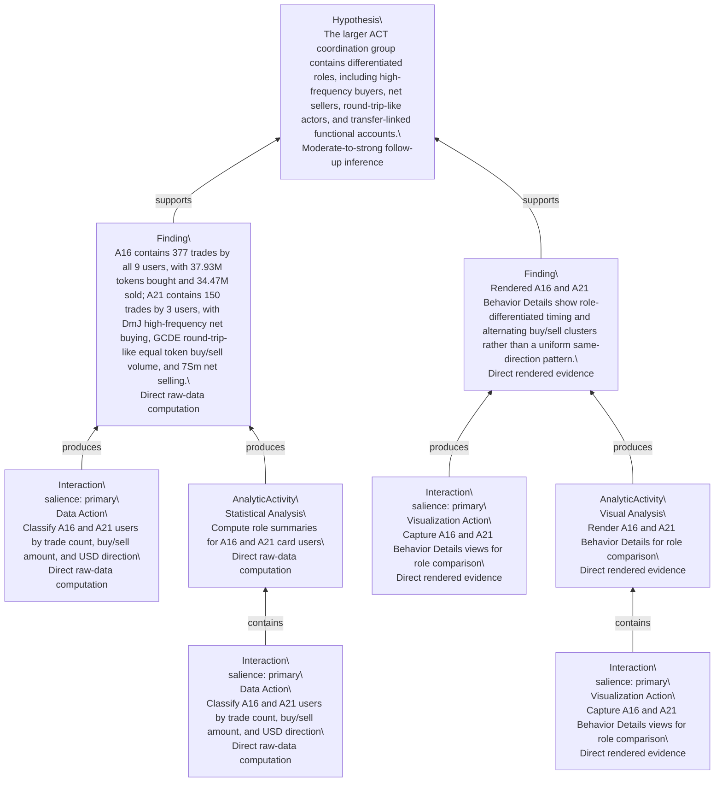

# User Reasoning Forest

This file is mechanically generated from `reasoning-graph.json`. Each tree is rooted at one Hypothesis. Shared canonical nodes are duplicated into tree node instances, and each duplicate keeps its `canonicalId`.

## Tree 1: H1

ACT holder structure is manipulation-prone because supply is concentrated and suspicious holders are linked into entities/components.

| Instance ID | Canonical ID | Parent | Relation | Kind | Scope | Salience | Confidence | Label |
|---|---|---|---|---|---|---|---|---|
| H1 | H1 |  |  | Hypothesis | High |  | Strong trace-supported inference | ACT holder structure is manipulation-prone because supply is concentrated and suspicious holders are linked into entities/components. |
| IN3@H1.1 | IN3 | H1 | supports | Insight | High |  | Direct user-authored note | A small number of whales control the vast majority of the circulating supply, while retail holders occupy only peripheral positions. |
| IA3@H1.1.1 | IA3 | IN3@H1.1 | produces | Interaction | Low | primary | Direct trace annotation evidence | Create high-level insight 3 from system |
| AA1@H1.1.2 | AA1 | IN3@H1.1 | produces | AnalyticActivity | Mid |  | Direct trace reconstruction | Visual scan of supply concentration, entities, and link/component structure |
| I0@H1.1.2.1 | I0 | AA1@H1.1.2 | contains | Interaction | Low | primary | Direct trace evidence | Update ACT snapshot at 2024-11-09 23:00 UTC and rerun detections |
| I2@H1.1.2.2 | I2 | AA1@H1.1.2 | contains | Interaction | Low | primary | Direct trace evidence | Toggle Token Distribution links on |
| IA0@H1.1.2.3 | IA0 | AA1@H1.1.2 | contains | Interaction | Low | primary | Direct trace annotation evidence | Create annotation 0 from token_distribution |
| IA1@H1.1.2.4 | IA1 | AA1@H1.1.2 | contains | Interaction | Low | primary | Direct trace annotation evidence | Create annotation 1 from token_distribution |
| IA2@H1.1.2.5 | IA2 | AA1@H1.1.2 | contains | Interaction | Low | primary | Direct trace annotation evidence | Create annotation 2 from token_distribution |
| IA3@H1.1.2.6 | IA3 | AA1@H1.1.2 | contains | Interaction | Low | primary | Direct trace annotation evidence | Create high-level insight 3 from system |
| I1@H1.1.2.7 | I1 | AA1@H1.1.2 | contains | Interaction | Low | low | Direct trace evidence | Toggle Token Distribution links off |
| AF4@H1.2 | AF4 | H1 | supports | Finding | Mid |  | Direct rendered evidence plus render API data | Rendered Token Distribution preserves the visual component basis: 49 processed top users cover 30.29% of user-held balance, with three balance-sequence entity groups and visible link overlays. |
| AAA4@H1.2.1 | AAA4 | AF4@H1.2 | produces | AnalyticActivity | Mid |  | Direct rendered evidence | Render Token Distribution with links enabled for component evidence |
| AI4@H1.2.1.1 | AI4 | AAA4@H1.2.1 | contains | Interaction | Low | supporting | Direct rendered evidence | Capture Token Distribution with links enabled at the analyzed snapshot |
| AI4@H1.2.2 | AI4 | AF4@H1.2 | produces | Interaction | Low | supporting | Direct rendered evidence | Capture Token Distribution with links enabled at the analyzed snapshot |
| F0@H1.3 | F0 | H1 | supports | Finding | Mid |  | Direct user-authored note | Approximately 51 users hold 30% of the token supply, which is highly centralized. Most are marked with red circles, indicating prior suspicious behavior. |
| IA0@H1.3.1 | IA0 | F0@H1.3 | produces | Interaction | Low | primary | Direct trace annotation evidence | Create annotation 0 from token_distribution |
| AA1@H1.3.2 | AA1 | F0@H1.3 | produces | AnalyticActivity | Mid |  | Direct trace reconstruction | Visual scan of supply concentration, entities, and link/component structure |
| I0@H1.3.2.1 | I0 | AA1@H1.3.2 | contains | Interaction | Low | primary | Direct trace evidence | Update ACT snapshot at 2024-11-09 23:00 UTC and rerun detections |
| I2@H1.3.2.2 | I2 | AA1@H1.3.2 | contains | Interaction | Low | primary | Direct trace evidence | Toggle Token Distribution links on |
| IA0@H1.3.2.3 | IA0 | AA1@H1.3.2 | contains | Interaction | Low | primary | Direct trace annotation evidence | Create annotation 0 from token_distribution |
| IA1@H1.3.2.4 | IA1 | AA1@H1.3.2 | contains | Interaction | Low | primary | Direct trace annotation evidence | Create annotation 1 from token_distribution |
| IA2@H1.3.2.5 | IA2 | AA1@H1.3.2 | contains | Interaction | Low | primary | Direct trace annotation evidence | Create annotation 2 from token_distribution |
| IA3@H1.3.2.6 | IA3 | AA1@H1.3.2 | contains | Interaction | Low | primary | Direct trace annotation evidence | Create high-level insight 3 from system |
| I1@H1.3.2.7 | I1 | AA1@H1.3.2 | contains | Interaction | Low | low | Direct trace evidence | Toggle Token Distribution links off |
| F1@H1.4 | F1 | H1 | supports | Finding | Mid |  | Direct user-authored note | Several large, dark-colored nodes are grouped by three orange dashed circles, representing entities detected by the system's rules. These three entities collectively hold substantial funds. Notably, each entity contains at least one account that appears normal alongside several suspicious ones, likely an intentional strategy to maintain a "clean-looking" account. |
| IA1@H1.4.1 | IA1 | F1@H1.4 | produces | Interaction | Low | primary | Direct trace annotation evidence | Create annotation 1 from token_distribution |
| AA1@H1.4.2 | AA1 | F1@H1.4 | produces | AnalyticActivity | Mid |  | Direct trace reconstruction | Visual scan of supply concentration, entities, and link/component structure |
| I0@H1.4.2.1 | I0 | AA1@H1.4.2 | contains | Interaction | Low | primary | Direct trace evidence | Update ACT snapshot at 2024-11-09 23:00 UTC and rerun detections |
| I2@H1.4.2.2 | I2 | AA1@H1.4.2 | contains | Interaction | Low | primary | Direct trace evidence | Toggle Token Distribution links on |
| IA0@H1.4.2.3 | IA0 | AA1@H1.4.2 | contains | Interaction | Low | primary | Direct trace annotation evidence | Create annotation 0 from token_distribution |
| IA1@H1.4.2.4 | IA1 | AA1@H1.4.2 | contains | Interaction | Low | primary | Direct trace annotation evidence | Create annotation 1 from token_distribution |
| IA2@H1.4.2.5 | IA2 | AA1@H1.4.2 | contains | Interaction | Low | primary | Direct trace annotation evidence | Create annotation 2 from token_distribution |
| IA3@H1.4.2.6 | IA3 | AA1@H1.4.2 | contains | Interaction | Low | primary | Direct trace annotation evidence | Create high-level insight 3 from system |
| I1@H1.4.2.7 | I1 | AA1@H1.4.2 | contains | Interaction | Low | low | Direct trace evidence | Toggle Token Distribution links off |
| F2@H1.5 | F2 | H1 | supports | Finding | Mid |  | Direct user-authored note | Two of the three entities, along with several other holders, are connected within a single component (community). This token carries a high manipulation risk and creates a poor initial impression. |
| IA2@H1.5.1 | IA2 | F2@H1.5 | produces | Interaction | Low | primary | Direct trace annotation evidence | Create annotation 2 from token_distribution |
| AA1@H1.5.2 | AA1 | F2@H1.5 | produces | AnalyticActivity | Mid |  | Direct trace reconstruction | Visual scan of supply concentration, entities, and link/component structure |
| I0@H1.5.2.1 | I0 | AA1@H1.5.2 | contains | Interaction | Low | primary | Direct trace evidence | Update ACT snapshot at 2024-11-09 23:00 UTC and rerun detections |
| I2@H1.5.2.2 | I2 | AA1@H1.5.2 | contains | Interaction | Low | primary | Direct trace evidence | Toggle Token Distribution links on |
| IA0@H1.5.2.3 | IA0 | AA1@H1.5.2 | contains | Interaction | Low | primary | Direct trace annotation evidence | Create annotation 0 from token_distribution |
| IA1@H1.5.2.4 | IA1 | AA1@H1.5.2 | contains | Interaction | Low | primary | Direct trace annotation evidence | Create annotation 1 from token_distribution |
| IA2@H1.5.2.5 | IA2 | AA1@H1.5.2 | contains | Interaction | Low | primary | Direct trace annotation evidence | Create annotation 2 from token_distribution |
| IA3@H1.5.2.6 | IA3 | AA1@H1.5.2 | contains | Interaction | Low | primary | Direct trace annotation evidence | Create high-level insight 3 from system |
| I1@H1.5.2.7 | I1 | AA1@H1.5.2 | contains | Interaction | Low | low | Direct trace evidence | Toggle Token Distribution links off |
| AQ1@H1.6 | AQ1 | H1 | contains | AnalyticQuestion | Mid |  | Analyst inference from early trace sequence | How concentrated and connected is the ACT holder graph at the selected snapshot? |
| F0@H1.6.1 | F0 | AQ1@H1.6 | supports | Finding | Mid |  | Direct user-authored note | Approximately 51 users hold 30% of the token supply, which is highly centralized. Most are marked with red circles, indicating prior suspicious behavior. |
| IA0@H1.6.1.1 | IA0 | F0@H1.6.1 | produces | Interaction | Low | primary | Direct trace annotation evidence | Create annotation 0 from token_distribution |
| AA1@H1.6.1.2 | AA1 | F0@H1.6.1 | produces | AnalyticActivity | Mid |  | Direct trace reconstruction | Visual scan of supply concentration, entities, and link/component structure |
| I0@H1.6.1.2.1 | I0 | AA1@H1.6.1.2 | contains | Interaction | Low | primary | Direct trace evidence | Update ACT snapshot at 2024-11-09 23:00 UTC and rerun detections |
| I2@H1.6.1.2.2 | I2 | AA1@H1.6.1.2 | contains | Interaction | Low | primary | Direct trace evidence | Toggle Token Distribution links on |
| IA0@H1.6.1.2.3 | IA0 | AA1@H1.6.1.2 | contains | Interaction | Low | primary | Direct trace annotation evidence | Create annotation 0 from token_distribution |
| IA1@H1.6.1.2.4 | IA1 | AA1@H1.6.1.2 | contains | Interaction | Low | primary | Direct trace annotation evidence | Create annotation 1 from token_distribution |
| IA2@H1.6.1.2.5 | IA2 | AA1@H1.6.1.2 | contains | Interaction | Low | primary | Direct trace annotation evidence | Create annotation 2 from token_distribution |
| IA3@H1.6.1.2.6 | IA3 | AA1@H1.6.1.2 | contains | Interaction | Low | primary | Direct trace annotation evidence | Create high-level insight 3 from system |
| I1@H1.6.1.2.7 | I1 | AA1@H1.6.1.2 | contains | Interaction | Low | low | Direct trace evidence | Toggle Token Distribution links off |
| F1@H1.6.2 | F1 | AQ1@H1.6 | supports | Finding | Mid |  | Direct user-authored note | Several large, dark-colored nodes are grouped by three orange dashed circles, representing entities detected by the system's rules. These three entities collectively hold substantial funds. Notably, each entity contains at least one account that appears normal alongside several suspicious ones, likely an intentional strategy to maintain a "clean-looking" account. |
| IA1@H1.6.2.1 | IA1 | F1@H1.6.2 | produces | Interaction | Low | primary | Direct trace annotation evidence | Create annotation 1 from token_distribution |
| AA1@H1.6.2.2 | AA1 | F1@H1.6.2 | produces | AnalyticActivity | Mid |  | Direct trace reconstruction | Visual scan of supply concentration, entities, and link/component structure |
| I0@H1.6.2.2.1 | I0 | AA1@H1.6.2.2 | contains | Interaction | Low | primary | Direct trace evidence | Update ACT snapshot at 2024-11-09 23:00 UTC and rerun detections |
| I2@H1.6.2.2.2 | I2 | AA1@H1.6.2.2 | contains | Interaction | Low | primary | Direct trace evidence | Toggle Token Distribution links on |
| IA0@H1.6.2.2.3 | IA0 | AA1@H1.6.2.2 | contains | Interaction | Low | primary | Direct trace annotation evidence | Create annotation 0 from token_distribution |
| IA1@H1.6.2.2.4 | IA1 | AA1@H1.6.2.2 | contains | Interaction | Low | primary | Direct trace annotation evidence | Create annotation 1 from token_distribution |
| IA2@H1.6.2.2.5 | IA2 | AA1@H1.6.2.2 | contains | Interaction | Low | primary | Direct trace annotation evidence | Create annotation 2 from token_distribution |
| IA3@H1.6.2.2.6 | IA3 | AA1@H1.6.2.2 | contains | Interaction | Low | primary | Direct trace annotation evidence | Create high-level insight 3 from system |
| I1@H1.6.2.2.7 | I1 | AA1@H1.6.2.2 | contains | Interaction | Low | low | Direct trace evidence | Toggle Token Distribution links off |
| F2@H1.6.3 | F2 | AQ1@H1.6 | supports | Finding | Mid |  | Direct user-authored note | Two of the three entities, along with several other holders, are connected within a single component (community). This token carries a high manipulation risk and creates a poor initial impression. |
| IA2@H1.6.3.1 | IA2 | F2@H1.6.3 | produces | Interaction | Low | primary | Direct trace annotation evidence | Create annotation 2 from token_distribution |
| AA1@H1.6.3.2 | AA1 | F2@H1.6.3 | produces | AnalyticActivity | Mid |  | Direct trace reconstruction | Visual scan of supply concentration, entities, and link/component structure |
| I0@H1.6.3.2.1 | I0 | AA1@H1.6.3.2 | contains | Interaction | Low | primary | Direct trace evidence | Update ACT snapshot at 2024-11-09 23:00 UTC and rerun detections |
| I2@H1.6.3.2.2 | I2 | AA1@H1.6.3.2 | contains | Interaction | Low | primary | Direct trace evidence | Toggle Token Distribution links on |
| IA0@H1.6.3.2.3 | IA0 | AA1@H1.6.3.2 | contains | Interaction | Low | primary | Direct trace annotation evidence | Create annotation 0 from token_distribution |
| IA1@H1.6.3.2.4 | IA1 | AA1@H1.6.3.2 | contains | Interaction | Low | primary | Direct trace annotation evidence | Create annotation 1 from token_distribution |
| IA2@H1.6.3.2.5 | IA2 | AA1@H1.6.3.2 | contains | Interaction | Low | primary | Direct trace annotation evidence | Create annotation 2 from token_distribution |
| IA3@H1.6.3.2.6 | IA3 | AA1@H1.6.3.2 | contains | Interaction | Low | primary | Direct trace annotation evidence | Create high-level insight 3 from system |
| I1@H1.6.3.2.7 | I1 | AA1@H1.6.3.2 | contains | Interaction | Low | low | Direct trace evidence | Toggle Token Distribution links off |
| AA1@H1.6.4 | AA1 | AQ1@H1.6 | motivates | AnalyticActivity | Mid |  | Direct trace reconstruction | Visual scan of supply concentration, entities, and link/component structure |
| I0@H1.6.4.1 | I0 | AA1@H1.6.4 | contains | Interaction | Low | primary | Direct trace evidence | Update ACT snapshot at 2024-11-09 23:00 UTC and rerun detections |
| I2@H1.6.4.2 | I2 | AA1@H1.6.4 | contains | Interaction | Low | primary | Direct trace evidence | Toggle Token Distribution links on |
| IA0@H1.6.4.3 | IA0 | AA1@H1.6.4 | contains | Interaction | Low | primary | Direct trace annotation evidence | Create annotation 0 from token_distribution |
| IA1@H1.6.4.4 | IA1 | AA1@H1.6.4 | contains | Interaction | Low | primary | Direct trace annotation evidence | Create annotation 1 from token_distribution |
| IA2@H1.6.4.5 | IA2 | AA1@H1.6.4 | contains | Interaction | Low | primary | Direct trace annotation evidence | Create annotation 2 from token_distribution |
| IA3@H1.6.4.6 | IA3 | AA1@H1.6.4 | contains | Interaction | Low | primary | Direct trace annotation evidence | Create high-level insight 3 from system |
| I1@H1.6.4.7 | I1 | AA1@H1.6.4 | contains | Interaction | Low | low | Direct trace evidence | Toggle Token Distribution links off |

```mermaid
flowchart BT
  n_H1["Hypothesis\\nACT holder structure is manipulation-prone because supply is concentrated and suspicious holders are linked into entities/components.\\nStrong trace-supported inference"]
  n_IN3_H1_1["Insight\\nA small number of whales control the vast majority of the circulating supply, while retail holders occupy only peripheral positions.\\nDirect user-authored note"]
  n_IA3_H1_1_1["Interaction\\nsalience: primary\\nSynthesis Action\\nCreate high-level insight 3 from system\\nDirect trace annotation evidence"]
  n_AA1_H1_1_2["AnalyticActivity\\nVisual Analysis\\nVisual scan of supply concentration, entities, and link/component structure\\nDirect trace reconstruction"]
  n_I0_H1_1_2_1["Interaction\\nsalience: primary\\nModel Action\\nUpdate ACT snapshot at 2024-11-09 23:00 UTC and rerun detections\\nDirect trace evidence"]
  n_I2_H1_1_2_2["Interaction\\nsalience: primary\\nVisualization Action\\nToggle Token Distribution links on\\nDirect trace evidence"]
  n_IA0_H1_1_2_3["Interaction\\nsalience: primary\\nSynthesis Action\\nCreate annotation 0 from token_distribution\\nDirect trace annotation evidence"]
  n_IA1_H1_1_2_4["Interaction\\nsalience: primary\\nSynthesis Action\\nCreate annotation 1 from token_distribution\\nDirect trace annotation evidence"]
  n_IA2_H1_1_2_5["Interaction\\nsalience: primary\\nSynthesis Action\\nCreate annotation 2 from token_distribution\\nDirect trace annotation evidence"]
  n_IA3_H1_1_2_6["Interaction\\nsalience: primary\\nSynthesis Action\\nCreate high-level insight 3 from system\\nDirect trace annotation evidence"]
  n_I1_H1_1_2_7["Interaction\\nsalience: low\\nVisualization Action\\nToggle Token Distribution links off\\nDirect trace evidence"]
  n_AF4_H1_2["Finding\\nRendered Token Distribution preserves the visual component basis: 49 processed top users cover 30.29% of user-held balance, with three balance-sequence entity groups and visible link overlays.\\nDirect rendered evidence plus render API data"]
  n_AAA4_H1_2_1["AnalyticActivity\\nVisual Analysis\\nRender Token Distribution with links enabled for component evidence\\nDirect rendered evidence"]
  n_AI4_H1_2_1_1["Interaction\\nsalience: supporting\\nVisualization Action\\nCapture Token Distribution with links enabled at the analyzed snapshot\\nDirect rendered evidence"]
  n_AI4_H1_2_2["Interaction\\nsalience: supporting\\nVisualization Action\\nCapture Token Distribution with links enabled at the analyzed snapshot\\nDirect rendered evidence"]
  n_F0_H1_3["Finding\\nApproximately 51 users hold 30% of the token supply, which is highly centralized. Most are marked with red circles, indicating prior suspicious behavior.\\nDirect user-authored note"]
  n_IA0_H1_3_1["Interaction\\nsalience: primary\\nSynthesis Action\\nCreate annotation 0 from token_distribution\\nDirect trace annotation evidence"]
  n_AA1_H1_3_2["AnalyticActivity\\nVisual Analysis\\nVisual scan of supply concentration, entities, and link/component structure\\nDirect trace reconstruction"]
  n_I0_H1_3_2_1["Interaction\\nsalience: primary\\nModel Action\\nUpdate ACT snapshot at 2024-11-09 23:00 UTC and rerun detections\\nDirect trace evidence"]
  n_I2_H1_3_2_2["Interaction\\nsalience: primary\\nVisualization Action\\nToggle Token Distribution links on\\nDirect trace evidence"]
  n_IA0_H1_3_2_3["Interaction\\nsalience: primary\\nSynthesis Action\\nCreate annotation 0 from token_distribution\\nDirect trace annotation evidence"]
  n_IA1_H1_3_2_4["Interaction\\nsalience: primary\\nSynthesis Action\\nCreate annotation 1 from token_distribution\\nDirect trace annotation evidence"]
  n_IA2_H1_3_2_5["Interaction\\nsalience: primary\\nSynthesis Action\\nCreate annotation 2 from token_distribution\\nDirect trace annotation evidence"]
  n_IA3_H1_3_2_6["Interaction\\nsalience: primary\\nSynthesis Action\\nCreate high-level insight 3 from system\\nDirect trace annotation evidence"]
  n_I1_H1_3_2_7["Interaction\\nsalience: low\\nVisualization Action\\nToggle Token Distribution links off\\nDirect trace evidence"]
  n_F1_H1_4["Finding\\nSeveral large, dark-colored nodes are grouped by three orange dashed circles, representing entities detected by the system's rules. These three entities collectively hold substantial funds. Notably, each entity contains at least one account that appears normal alongside several suspicious ones, likely an intentional strategy to maintain a \"clean-looking\" account.\\nDirect user-authored note"]
  n_IA1_H1_4_1["Interaction\\nsalience: primary\\nSynthesis Action\\nCreate annotation 1 from token_distribution\\nDirect trace annotation evidence"]
  n_AA1_H1_4_2["AnalyticActivity\\nVisual Analysis\\nVisual scan of supply concentration, entities, and link/component structure\\nDirect trace reconstruction"]
  n_I0_H1_4_2_1["Interaction\\nsalience: primary\\nModel Action\\nUpdate ACT snapshot at 2024-11-09 23:00 UTC and rerun detections\\nDirect trace evidence"]
  n_I2_H1_4_2_2["Interaction\\nsalience: primary\\nVisualization Action\\nToggle Token Distribution links on\\nDirect trace evidence"]
  n_IA0_H1_4_2_3["Interaction\\nsalience: primary\\nSynthesis Action\\nCreate annotation 0 from token_distribution\\nDirect trace annotation evidence"]
  n_IA1_H1_4_2_4["Interaction\\nsalience: primary\\nSynthesis Action\\nCreate annotation 1 from token_distribution\\nDirect trace annotation evidence"]
  n_IA2_H1_4_2_5["Interaction\\nsalience: primary\\nSynthesis Action\\nCreate annotation 2 from token_distribution\\nDirect trace annotation evidence"]
  n_IA3_H1_4_2_6["Interaction\\nsalience: primary\\nSynthesis Action\\nCreate high-level insight 3 from system\\nDirect trace annotation evidence"]
  n_I1_H1_4_2_7["Interaction\\nsalience: low\\nVisualization Action\\nToggle Token Distribution links off\\nDirect trace evidence"]
  n_F2_H1_5["Finding\\nTwo of the three entities, along with several other holders, are connected within a single component (community). This token carries a high manipulation risk and creates a poor initial impression.\\nDirect user-authored note"]
  n_IA2_H1_5_1["Interaction\\nsalience: primary\\nSynthesis Action\\nCreate annotation 2 from token_distribution\\nDirect trace annotation evidence"]
  n_AA1_H1_5_2["AnalyticActivity\\nVisual Analysis\\nVisual scan of supply concentration, entities, and link/component structure\\nDirect trace reconstruction"]
  n_I0_H1_5_2_1["Interaction\\nsalience: primary\\nModel Action\\nUpdate ACT snapshot at 2024-11-09 23:00 UTC and rerun detections\\nDirect trace evidence"]
  n_I2_H1_5_2_2["Interaction\\nsalience: primary\\nVisualization Action\\nToggle Token Distribution links on\\nDirect trace evidence"]
  n_IA0_H1_5_2_3["Interaction\\nsalience: primary\\nSynthesis Action\\nCreate annotation 0 from token_distribution\\nDirect trace annotation evidence"]
  n_IA1_H1_5_2_4["Interaction\\nsalience: primary\\nSynthesis Action\\nCreate annotation 1 from token_distribution\\nDirect trace annotation evidence"]
  n_IA2_H1_5_2_5["Interaction\\nsalience: primary\\nSynthesis Action\\nCreate annotation 2 from token_distribution\\nDirect trace annotation evidence"]
  n_IA3_H1_5_2_6["Interaction\\nsalience: primary\\nSynthesis Action\\nCreate high-level insight 3 from system\\nDirect trace annotation evidence"]
  n_I1_H1_5_2_7["Interaction\\nsalience: low\\nVisualization Action\\nToggle Token Distribution links off\\nDirect trace evidence"]
  n_AQ1_H1_6["AnalyticQuestion\\nHow concentrated and connected is the ACT holder graph at the selected snapshot?\\nAnalyst inference from early trace sequence"]
  n_F0_H1_6_1["Finding\\nApproximately 51 users hold 30% of the token supply, which is highly centralized. Most are marked with red circles, indicating prior suspicious behavior.\\nDirect user-authored note"]
  n_IA0_H1_6_1_1["Interaction\\nsalience: primary\\nSynthesis Action\\nCreate annotation 0 from token_distribution\\nDirect trace annotation evidence"]
  n_AA1_H1_6_1_2["AnalyticActivity\\nVisual Analysis\\nVisual scan of supply concentration, entities, and link/component structure\\nDirect trace reconstruction"]
  n_I0_H1_6_1_2_1["Interaction\\nsalience: primary\\nModel Action\\nUpdate ACT snapshot at 2024-11-09 23:00 UTC and rerun detections\\nDirect trace evidence"]
  n_I2_H1_6_1_2_2["Interaction\\nsalience: primary\\nVisualization Action\\nToggle Token Distribution links on\\nDirect trace evidence"]
  n_IA0_H1_6_1_2_3["Interaction\\nsalience: primary\\nSynthesis Action\\nCreate annotation 0 from token_distribution\\nDirect trace annotation evidence"]
  n_IA1_H1_6_1_2_4["Interaction\\nsalience: primary\\nSynthesis Action\\nCreate annotation 1 from token_distribution\\nDirect trace annotation evidence"]
  n_IA2_H1_6_1_2_5["Interaction\\nsalience: primary\\nSynthesis Action\\nCreate annotation 2 from token_distribution\\nDirect trace annotation evidence"]
  n_IA3_H1_6_1_2_6["Interaction\\nsalience: primary\\nSynthesis Action\\nCreate high-level insight 3 from system\\nDirect trace annotation evidence"]
  n_I1_H1_6_1_2_7["Interaction\\nsalience: low\\nVisualization Action\\nToggle Token Distribution links off\\nDirect trace evidence"]
  n_F1_H1_6_2["Finding\\nSeveral large, dark-colored nodes are grouped by three orange dashed circles, representing entities detected by the system's rules. These three entities collectively hold substantial funds. Notably, each entity contains at least one account that appears normal alongside several suspicious ones, likely an intentional strategy to maintain a \"clean-looking\" account.\\nDirect user-authored note"]
  n_IA1_H1_6_2_1["Interaction\\nsalience: primary\\nSynthesis Action\\nCreate annotation 1 from token_distribution\\nDirect trace annotation evidence"]
  n_AA1_H1_6_2_2["AnalyticActivity\\nVisual Analysis\\nVisual scan of supply concentration, entities, and link/component structure\\nDirect trace reconstruction"]
  n_I0_H1_6_2_2_1["Interaction\\nsalience: primary\\nModel Action\\nUpdate ACT snapshot at 2024-11-09 23:00 UTC and rerun detections\\nDirect trace evidence"]
  n_I2_H1_6_2_2_2["Interaction\\nsalience: primary\\nVisualization Action\\nToggle Token Distribution links on\\nDirect trace evidence"]
  n_IA0_H1_6_2_2_3["Interaction\\nsalience: primary\\nSynthesis Action\\nCreate annotation 0 from token_distribution\\nDirect trace annotation evidence"]
  n_IA1_H1_6_2_2_4["Interaction\\nsalience: primary\\nSynthesis Action\\nCreate annotation 1 from token_distribution\\nDirect trace annotation evidence"]
  n_IA2_H1_6_2_2_5["Interaction\\nsalience: primary\\nSynthesis Action\\nCreate annotation 2 from token_distribution\\nDirect trace annotation evidence"]
  n_IA3_H1_6_2_2_6["Interaction\\nsalience: primary\\nSynthesis Action\\nCreate high-level insight 3 from system\\nDirect trace annotation evidence"]
  n_I1_H1_6_2_2_7["Interaction\\nsalience: low\\nVisualization Action\\nToggle Token Distribution links off\\nDirect trace evidence"]
  n_F2_H1_6_3["Finding\\nTwo of the three entities, along with several other holders, are connected within a single component (community). This token carries a high manipulation risk and creates a poor initial impression.\\nDirect user-authored note"]
  n_IA2_H1_6_3_1["Interaction\\nsalience: primary\\nSynthesis Action\\nCreate annotation 2 from token_distribution\\nDirect trace annotation evidence"]
  n_AA1_H1_6_3_2["AnalyticActivity\\nVisual Analysis\\nVisual scan of supply concentration, entities, and link/component structure\\nDirect trace reconstruction"]
  n_I0_H1_6_3_2_1["Interaction\\nsalience: primary\\nModel Action\\nUpdate ACT snapshot at 2024-11-09 23:00 UTC and rerun detections\\nDirect trace evidence"]
  n_I2_H1_6_3_2_2["Interaction\\nsalience: primary\\nVisualization Action\\nToggle Token Distribution links on\\nDirect trace evidence"]
  n_IA0_H1_6_3_2_3["Interaction\\nsalience: primary\\nSynthesis Action\\nCreate annotation 0 from token_distribution\\nDirect trace annotation evidence"]
  n_IA1_H1_6_3_2_4["Interaction\\nsalience: primary\\nSynthesis Action\\nCreate annotation 1 from token_distribution\\nDirect trace annotation evidence"]
  n_IA2_H1_6_3_2_5["Interaction\\nsalience: primary\\nSynthesis Action\\nCreate annotation 2 from token_distribution\\nDirect trace annotation evidence"]
  n_IA3_H1_6_3_2_6["Interaction\\nsalience: primary\\nSynthesis Action\\nCreate high-level insight 3 from system\\nDirect trace annotation evidence"]
  n_I1_H1_6_3_2_7["Interaction\\nsalience: low\\nVisualization Action\\nToggle Token Distribution links off\\nDirect trace evidence"]
  n_AA1_H1_6_4["AnalyticActivity\\nVisual Analysis\\nVisual scan of supply concentration, entities, and link/component structure\\nDirect trace reconstruction"]
  n_I0_H1_6_4_1["Interaction\\nsalience: primary\\nModel Action\\nUpdate ACT snapshot at 2024-11-09 23:00 UTC and rerun detections\\nDirect trace evidence"]
  n_I2_H1_6_4_2["Interaction\\nsalience: primary\\nVisualization Action\\nToggle Token Distribution links on\\nDirect trace evidence"]
  n_IA0_H1_6_4_3["Interaction\\nsalience: primary\\nSynthesis Action\\nCreate annotation 0 from token_distribution\\nDirect trace annotation evidence"]
  n_IA1_H1_6_4_4["Interaction\\nsalience: primary\\nSynthesis Action\\nCreate annotation 1 from token_distribution\\nDirect trace annotation evidence"]
  n_IA2_H1_6_4_5["Interaction\\nsalience: primary\\nSynthesis Action\\nCreate annotation 2 from token_distribution\\nDirect trace annotation evidence"]
  n_IA3_H1_6_4_6["Interaction\\nsalience: primary\\nSynthesis Action\\nCreate high-level insight 3 from system\\nDirect trace annotation evidence"]
  n_I1_H1_6_4_7["Interaction\\nsalience: low\\nVisualization Action\\nToggle Token Distribution links off\\nDirect trace evidence"]
  n_IN3_H1_1 -->|supports| n_H1
  n_IA3_H1_1_1 -->|produces| n_IN3_H1_1
  n_AA1_H1_1_2 -->|produces| n_IN3_H1_1
  n_I0_H1_1_2_1 -->|contains| n_AA1_H1_1_2
  n_I2_H1_1_2_2 -->|contains| n_AA1_H1_1_2
  n_IA0_H1_1_2_3 -->|contains| n_AA1_H1_1_2
  n_IA1_H1_1_2_4 -->|contains| n_AA1_H1_1_2
  n_IA2_H1_1_2_5 -->|contains| n_AA1_H1_1_2
  n_IA3_H1_1_2_6 -->|contains| n_AA1_H1_1_2
  n_I1_H1_1_2_7 -->|contains| n_AA1_H1_1_2
  n_AF4_H1_2 -->|supports| n_H1
  n_AAA4_H1_2_1 -->|produces| n_AF4_H1_2
  n_AI4_H1_2_1_1 -->|contains| n_AAA4_H1_2_1
  n_AI4_H1_2_2 -->|produces| n_AF4_H1_2
  n_F0_H1_3 -->|supports| n_H1
  n_IA0_H1_3_1 -->|produces| n_F0_H1_3
  n_AA1_H1_3_2 -->|produces| n_F0_H1_3
  n_I0_H1_3_2_1 -->|contains| n_AA1_H1_3_2
  n_I2_H1_3_2_2 -->|contains| n_AA1_H1_3_2
  n_IA0_H1_3_2_3 -->|contains| n_AA1_H1_3_2
  n_IA1_H1_3_2_4 -->|contains| n_AA1_H1_3_2
  n_IA2_H1_3_2_5 -->|contains| n_AA1_H1_3_2
  n_IA3_H1_3_2_6 -->|contains| n_AA1_H1_3_2
  n_I1_H1_3_2_7 -->|contains| n_AA1_H1_3_2
  n_F1_H1_4 -->|supports| n_H1
  n_IA1_H1_4_1 -->|produces| n_F1_H1_4
  n_AA1_H1_4_2 -->|produces| n_F1_H1_4
  n_I0_H1_4_2_1 -->|contains| n_AA1_H1_4_2
  n_I2_H1_4_2_2 -->|contains| n_AA1_H1_4_2
  n_IA0_H1_4_2_3 -->|contains| n_AA1_H1_4_2
  n_IA1_H1_4_2_4 -->|contains| n_AA1_H1_4_2
  n_IA2_H1_4_2_5 -->|contains| n_AA1_H1_4_2
  n_IA3_H1_4_2_6 -->|contains| n_AA1_H1_4_2
  n_I1_H1_4_2_7 -->|contains| n_AA1_H1_4_2
  n_F2_H1_5 -->|supports| n_H1
  n_IA2_H1_5_1 -->|produces| n_F2_H1_5
  n_AA1_H1_5_2 -->|produces| n_F2_H1_5
  n_I0_H1_5_2_1 -->|contains| n_AA1_H1_5_2
  n_I2_H1_5_2_2 -->|contains| n_AA1_H1_5_2
  n_IA0_H1_5_2_3 -->|contains| n_AA1_H1_5_2
  n_IA1_H1_5_2_4 -->|contains| n_AA1_H1_5_2
  n_IA2_H1_5_2_5 -->|contains| n_AA1_H1_5_2
  n_IA3_H1_5_2_6 -->|contains| n_AA1_H1_5_2
  n_I1_H1_5_2_7 -->|contains| n_AA1_H1_5_2
  n_AQ1_H1_6 -->|contains| n_H1
  n_F0_H1_6_1 -->|supports| n_AQ1_H1_6
  n_IA0_H1_6_1_1 -->|produces| n_F0_H1_6_1
  n_AA1_H1_6_1_2 -->|produces| n_F0_H1_6_1
  n_I0_H1_6_1_2_1 -->|contains| n_AA1_H1_6_1_2
  n_I2_H1_6_1_2_2 -->|contains| n_AA1_H1_6_1_2
  n_IA0_H1_6_1_2_3 -->|contains| n_AA1_H1_6_1_2
  n_IA1_H1_6_1_2_4 -->|contains| n_AA1_H1_6_1_2
  n_IA2_H1_6_1_2_5 -->|contains| n_AA1_H1_6_1_2
  n_IA3_H1_6_1_2_6 -->|contains| n_AA1_H1_6_1_2
  n_I1_H1_6_1_2_7 -->|contains| n_AA1_H1_6_1_2
  n_F1_H1_6_2 -->|supports| n_AQ1_H1_6
  n_IA1_H1_6_2_1 -->|produces| n_F1_H1_6_2
  n_AA1_H1_6_2_2 -->|produces| n_F1_H1_6_2
  n_I0_H1_6_2_2_1 -->|contains| n_AA1_H1_6_2_2
  n_I2_H1_6_2_2_2 -->|contains| n_AA1_H1_6_2_2
  n_IA0_H1_6_2_2_3 -->|contains| n_AA1_H1_6_2_2
  n_IA1_H1_6_2_2_4 -->|contains| n_AA1_H1_6_2_2
  n_IA2_H1_6_2_2_5 -->|contains| n_AA1_H1_6_2_2
  n_IA3_H1_6_2_2_6 -->|contains| n_AA1_H1_6_2_2
  n_I1_H1_6_2_2_7 -->|contains| n_AA1_H1_6_2_2
  n_F2_H1_6_3 -->|supports| n_AQ1_H1_6
  n_IA2_H1_6_3_1 -->|produces| n_F2_H1_6_3
  n_AA1_H1_6_3_2 -->|produces| n_F2_H1_6_3
  n_I0_H1_6_3_2_1 -->|contains| n_AA1_H1_6_3_2
  n_I2_H1_6_3_2_2 -->|contains| n_AA1_H1_6_3_2
  n_IA0_H1_6_3_2_3 -->|contains| n_AA1_H1_6_3_2
  n_IA1_H1_6_3_2_4 -->|contains| n_AA1_H1_6_3_2
  n_IA2_H1_6_3_2_5 -->|contains| n_AA1_H1_6_3_2
  n_IA3_H1_6_3_2_6 -->|contains| n_AA1_H1_6_3_2
  n_I1_H1_6_3_2_7 -->|contains| n_AA1_H1_6_3_2
  n_AA1_H1_6_4 -->|motivates| n_AQ1_H1_6
  n_I0_H1_6_4_1 -->|contains| n_AA1_H1_6_4
  n_I2_H1_6_4_2 -->|contains| n_AA1_H1_6_4
  n_IA0_H1_6_4_3 -->|contains| n_AA1_H1_6_4
  n_IA1_H1_6_4_4 -->|contains| n_AA1_H1_6_4
  n_IA2_H1_6_4_5 -->|contains| n_AA1_H1_6_4
  n_IA3_H1_6_4_6 -->|contains| n_AA1_H1_6_4
  n_I1_H1_6_4_7 -->|contains| n_AA1_H1_6_4
```

## Tree 2: H2

Suspicious visual flags require role differentiation: some large or flagged wallets are storage or normal accumulation rather than direct manipulators.

| Instance ID | Canonical ID | Parent | Relation | Kind | Scope | Salience | Confidence | Label |
|---|---|---|---|---|---|---|---|---|
| H2 | H2 |  |  | Hypothesis | High |  | Moderate trace-supported inference | Suspicious visual flags require role differentiation: some large or flagged wallets are storage or normal accumulation rather than direct manipulators. |
| AIN1@H2.1 | AIN1 | H2 | supports | Insight | High |  | Strong follow-up synthesis | Follow-up evidence supports a core coordinated-manipulation interpretation, but it refines the user insight: the strongest support is link/model timing plus role-differentiated trade behavior, not direct-transfer proof or equal participation by every clicked user. |
| AF1@H2.1.1 | AF1 | AIN1@H2.1 | supports | Finding | Mid |  | Direct raw-data computation | A13 has 49 trades by 5 of 9 users in the user-selected behavior window: 9.95M tokens bought, 8.30M sold, and the 1-minute price path ranged from +45.0% to -49.8% before closing -23.1%. |
| AI1@H2.1.1.1 | AI1 | AF1@H2.1.1 | produces | Interaction | Low | primary | Direct raw-data computation | Calculate A13, A16, and A21 buy/sell totals and price-window changes from ACT raw data |
| AAA1@H2.1.1.2 | AAA1 | AF1@H2.1.1 | produces | AnalyticActivity | Mid |  | Direct raw-data computation | Compute clicked-card trade and OHLC statistics |
| AI1@H2.1.1.2.1 | AI1 | AAA1@H2.1.1.2 | contains | Interaction | Low | primary | Direct raw-data computation | Calculate A13, A16, and A21 buy/sell totals and price-window changes from ACT raw data |
| AF2@H2.1.2 | AF2 | AIN1@H2.1 | supports | Finding | Mid |  | Direct rendered evidence plus render metadata | Rendered K-line and Behavior Details confirm dense same-direction card and row-level activity around Oct. 26-27, including hourly cards with 15.85M, 9.83M, and 2.51M token card totals. |
| AI2@H2.1.2.1 | AI2 | AF2@H2.1.2 | produces | Interaction | Low | primary | Direct rendered evidence | Capture follow-up K-line and A13 Behavior Details views with the ManiScope render API |
| AAA2@H2.1.2.2 | AAA2 | AF2@H2.1.2 | produces | AnalyticActivity | Mid |  | Direct rendered evidence | Render K-line and A13 Behavior Details for follow-up visual evidence |
| AI2@H2.1.2.2.1 | AI2 | AAA2@H2.1.2.2 | contains | Interaction | Low | primary | Direct rendered evidence | Capture follow-up K-line and A13 Behavior Details views with the ManiScope render API |
| AF3@H2.1.3 | AF3 | AIN1@H2.1 | supports | Finding | Mid |  | Direct render API data and raw transfer computation | The current link-derived component connects 16 of 17 selected/clicked follow-up users while CqW remains isolated; raw transfers show only one direct internal transfer among those users, 7Sm to Eu4 for 5.56M tokens on Oct. 23. |
| AI3@H2.1.3.1 | AI3 | AF3@H2.1.3 | produces | Interaction | Low | primary | Direct raw-data and render-data computation | Compare render API link components with raw transfer edges among selected and clicked users |
| AAA3@H2.1.3.2 | AAA3 | AF3@H2.1.3 | produces | AnalyticActivity | Mid |  | Direct render API data and raw-data computation | Extract entity, link-component, and direct-transfer evidence for selected users |
| AI3@H2.1.3.2.1 | AI3 | AAA3@H2.1.3.2 | contains | Interaction | Low | primary | Direct raw-data and render-data computation | Compare render API link components with raw transfer edges among selected and clicked users |
| AF4@H2.1.4 | AF4 | AIN1@H2.1 | supports | Finding | Mid |  | Direct rendered evidence plus render API data | Rendered Token Distribution preserves the visual component basis: 49 processed top users cover 30.29% of user-held balance, with three balance-sequence entity groups and visible link overlays. |
| AAA4@H2.1.4.1 | AAA4 | AF4@H2.1.4 | produces | AnalyticActivity | Mid |  | Direct rendered evidence | Render Token Distribution with links enabled for component evidence |
| AI4@H2.1.4.1.1 | AI4 | AAA4@H2.1.4.1 | contains | Interaction | Low | supporting | Direct rendered evidence | Capture Token Distribution with links enabled at the analyzed snapshot |
| AI4@H2.1.4.2 | AI4 | AF4@H2.1.4 | produces | Interaction | Low | supporting | Direct rendered evidence | Capture Token Distribution with links enabled at the analyzed snapshot |
| AF5@H2.1.5 | AF5 | AIN1@H2.1 | supports | Finding | Mid |  | Direct raw-data computation | A16 contains 377 trades by all 9 users, with 37.93M tokens bought and 34.47M sold; A21 contains 150 trades by 3 users, with DmJ high-frequency net buying, GCDE round-trip-like equal token buy/sell volume, and 7Sm net selling. |
| AI5@H2.1.5.1 | AI5 | AF5@H2.1.5 | produces | Interaction | Low | primary | Direct raw-data computation | Classify A16 and A21 users by trade count, buy/sell amount, and USD direction |
| AAA5@H2.1.5.2 | AAA5 | AF5@H2.1.5 | produces | AnalyticActivity | Mid |  | Direct raw-data computation | Compute role summaries for A16 and A21 card users |
| AI5@H2.1.5.2.1 | AI5 | AAA5@H2.1.5.2 | contains | Interaction | Low | primary | Direct raw-data computation | Classify A16 and A21 users by trade count, buy/sell amount, and USD direction |
| AF6@H2.1.6 | AF6 | AIN1@H2.1 | supports | Finding | Mid |  | Direct rendered evidence | Rendered A16 and A21 Behavior Details show role-differentiated timing and alternating buy/sell clusters rather than a uniform same-direction pattern. |
| AI6@H2.1.6.1 | AI6 | AF6@H2.1.6 | produces | Interaction | Low | primary | Direct rendered evidence | Capture A16 and A21 Behavior Details views for role comparison |
| AAA6@H2.1.6.2 | AAA6 | AF6@H2.1.6 | produces | AnalyticActivity | Mid |  | Direct rendered evidence | Render A16 and A21 Behavior Details for role comparison |
| AI6@H2.1.6.2.1 | AI6 | AAA6@H2.1.6.2 | contains | Interaction | Low | primary | Direct rendered evidence | Capture A16 and A21 Behavior Details views for role comparison |
| AIS1@H2.1.7 | AIS1 | AIN1@H2.1 | produces | InvestigationStrategy | High |  | Direct follow-up execution record | Execute all Recommendation Plan Forest branches for the ACT trace follow-up |
| AAA1@H2.1.7.1 | AAA1 | AIS1@H2.1.7 | contains | AnalyticActivity | Mid |  | Direct raw-data computation | Compute clicked-card trade and OHLC statistics |
| AI1@H2.1.7.1.1 | AI1 | AAA1@H2.1.7.1 | contains | Interaction | Low | primary | Direct raw-data computation | Calculate A13, A16, and A21 buy/sell totals and price-window changes from ACT raw data |
| AAA2@H2.1.7.2 | AAA2 | AIS1@H2.1.7 | contains | AnalyticActivity | Mid |  | Direct rendered evidence | Render K-line and A13 Behavior Details for follow-up visual evidence |
| AI2@H2.1.7.2.1 | AI2 | AAA2@H2.1.7.2 | contains | Interaction | Low | primary | Direct rendered evidence | Capture follow-up K-line and A13 Behavior Details views with the ManiScope render API |
| AAA3@H2.1.7.3 | AAA3 | AIS1@H2.1.7 | contains | AnalyticActivity | Mid |  | Direct render API data and raw-data computation | Extract entity, link-component, and direct-transfer evidence for selected users |
| AI3@H2.1.7.3.1 | AI3 | AAA3@H2.1.7.3 | contains | Interaction | Low | primary | Direct raw-data and render-data computation | Compare render API link components with raw transfer edges among selected and clicked users |
| AAA4@H2.1.7.4 | AAA4 | AIS1@H2.1.7 | contains | AnalyticActivity | Mid |  | Direct rendered evidence | Render Token Distribution with links enabled for component evidence |
| AI4@H2.1.7.4.1 | AI4 | AAA4@H2.1.7.4 | contains | Interaction | Low | supporting | Direct rendered evidence | Capture Token Distribution with links enabled at the analyzed snapshot |
| AAA5@H2.1.7.5 | AAA5 | AIS1@H2.1.7 | contains | AnalyticActivity | Mid |  | Direct raw-data computation | Compute role summaries for A16 and A21 card users |
| AI5@H2.1.7.5.1 | AI5 | AAA5@H2.1.7.5 | contains | Interaction | Low | primary | Direct raw-data computation | Classify A16 and A21 users by trade count, buy/sell amount, and USD direction |
| AAA6@H2.1.7.6 | AAA6 | AIS1@H2.1.7 | contains | AnalyticActivity | Mid |  | Direct rendered evidence | Render A16 and A21 Behavior Details for role comparison |
| AI6@H2.1.7.6.1 | AI6 | AAA6@H2.1.7.6 | contains | Interaction | Low | primary | Direct rendered evidence | Capture A16 and A21 Behavior Details views for role comparison |
| F10@H2.2 | F10 | H2 | supports | Finding | Mid |  | Direct user-authored note | Another address bought a similar amount during the same period; the user investigated whether this affected the price and confirmed that it did. |
| IA10@H2.2.1 | IA10 | F10@H2.2 | produces | Interaction | Low | primary | Direct trace annotation evidence | Create annotation 10 from behavior_details |
| AA4@H2.2.2 | AA4 | F10@H2.2 | produces | AnalyticActivity | Mid |  | Direct trace reconstruction | Visual review of DNL and DmJ related-user behavior and transfer-like patterns |
| I10@H2.2.2.1 | I10 | AA4@H2.2.2 | contains | Interaction | Low | primary | Direct trace evidence | Show related users for DmJ in Behavior Details |
| I7@H2.2.2.2 | I7 | AA4@H2.2.2 | contains | Interaction | Low | primary | Direct trace evidence | Select holder DNL from Token Distribution |
| I8@H2.2.2.3 | I8 | AA4@H2.2.2 | contains | Interaction | Low | primary | Direct trace evidence | Show related users for DNL in Behavior Details |
| I9@H2.2.2.4 | I9 | AA4@H2.2.2 | contains | Interaction | Low | primary | Direct trace evidence | Select DmJ from Behavior Details |
| IA10@H2.2.2.5 | IA10 | AA4@H2.2.2 | contains | Interaction | Low | primary | Direct trace annotation evidence | Create annotation 10 from behavior_details |
| IA8@H2.2.2.6 | IA8 | AA4@H2.2.2 | contains | Interaction | Low | primary | Direct trace annotation evidence | Create annotation 8 from token_distribution |
| IA9@H2.2.2.7 | IA9 | AA4@H2.2.2 | contains | Interaction | Low | supporting | Direct trace annotation evidence | Create annotation 9 from behavior_details |
| I11@H2.2.2.8 | I11 | AA4@H2.2.2 | contains | Interaction | Low | low | Direct trace evidence | Hover DmJ user label in Behavior Details |
| F4@H2.3 | F4 | H2 | supports | Finding | Low |  | Direct user-authored note | Top holder 6z6 holds 10M tokens but shows no manipulative behavior. |
| AA2@H2.3.1 | AA2 | F4@H2.3 | produces | AnalyticActivity | Mid |  | Direct trace reconstruction | Visual review of top holder 6Z6 as potential non-manipulating whale |
| I3@H2.3.1.1 | I3 | AA2@H2.3.1 | contains | Interaction | Low | primary | Direct trace evidence | Select holder 6Z6 from Token Distribution |
| IA4@H2.3.1.2 | IA4 | AA2@H2.3.1 | contains | Interaction | Low | supporting | Direct trace annotation evidence | Create annotation 4 from token_distribution |
| IA5@H2.3.1.3 | IA5 | AA2@H2.3.1 | contains | Interaction | Low | supporting | Direct trace annotation evidence | Create annotation 5 from behavior_details |
| IA4@H2.3.2 | IA4 | F4@H2.3 | produces | Interaction | Low | supporting | Direct trace annotation evidence | Create annotation 4 from token_distribution |
| F5@H2.4 | F5 | H2 | supports | Finding | Low |  | Direct user-authored note | A whale, but not a manipulator, because tokens were acquired through transfers. |
| AA2@H2.4.1 | AA2 | F5@H2.4 | produces | AnalyticActivity | Mid |  | Direct trace reconstruction | Visual review of top holder 6Z6 as potential non-manipulating whale |
| I3@H2.4.1.1 | I3 | AA2@H2.4.1 | contains | Interaction | Low | primary | Direct trace evidence | Select holder 6Z6 from Token Distribution |
| IA4@H2.4.1.2 | IA4 | AA2@H2.4.1 | contains | Interaction | Low | supporting | Direct trace annotation evidence | Create annotation 4 from token_distribution |
| IA5@H2.4.1.3 | IA5 | AA2@H2.4.1 | contains | Interaction | Low | supporting | Direct trace annotation evidence | Create annotation 5 from behavior_details |
| IA5@H2.4.2 | IA5 | F5@H2.4 | produces | Interaction | Low | supporting | Direct trace annotation evidence | Create annotation 5 from behavior_details |
| F6@H2.5 | F6 | H2 | supports | Finding | Low |  | Direct user-authored note | Same-direction manipulation detected, but no entity affiliation. |
| F7@H2.5.1 | F7 | F6@H2.5 | supports | Finding | Low |  | Direct user-authored note | The holder progressively accumulates tokens; four purchases within a short window triggered a same-direction ramp detection. Upon closer review, this appears to be a normal holder |
| AA3@H2.5.1.1 | AA3 | F7@H2.5.1 | produces | AnalyticActivity | Mid |  | Direct trace reconstruction | Visual review of CqW same-direction flag against its behavior sequence |
| I4@H2.5.1.1.1 | I4 | AA3@H2.5.1.1 | contains | Interaction | Low | primary | Direct trace evidence | Select holder CqW from Token Distribution |
| I5@H2.5.1.1.2 | I5 | AA3@H2.5.1.1 | contains | Interaction | Low | primary | Direct trace evidence | Zoom Behavior Details for CqW into the Oct. 26-27 window |
| I6@H2.5.1.1.3 | I6 | AA3@H2.5.1.1 | contains | Interaction | Low | primary | Direct trace evidence | Toggle Sequential Time on for CqW behavior review |
| IA6@H2.5.1.1.4 | IA6 | AA3@H2.5.1.1 | contains | Interaction | Low | supporting | Direct trace annotation evidence | Create annotation 6 from token_distribution |
| IA7@H2.5.1.1.5 | IA7 | AA3@H2.5.1.1 | contains | Interaction | Low | supporting | Direct trace annotation evidence | Create annotation 7 from behavior_details |
| IA7@H2.5.1.2 | IA7 | F7@H2.5.1 | produces | Interaction | Low | supporting | Direct trace annotation evidence | Create annotation 7 from behavior_details |
| AA3@H2.5.2 | AA3 | F6@H2.5 | produces | AnalyticActivity | Mid |  | Direct trace reconstruction | Visual review of CqW same-direction flag against its behavior sequence |
| I4@H2.5.2.1 | I4 | AA3@H2.5.2 | contains | Interaction | Low | primary | Direct trace evidence | Select holder CqW from Token Distribution |
| I5@H2.5.2.2 | I5 | AA3@H2.5.2 | contains | Interaction | Low | primary | Direct trace evidence | Zoom Behavior Details for CqW into the Oct. 26-27 window |
| I6@H2.5.2.3 | I6 | AA3@H2.5.2 | contains | Interaction | Low | primary | Direct trace evidence | Toggle Sequential Time on for CqW behavior review |
| IA6@H2.5.2.4 | IA6 | AA3@H2.5.2 | contains | Interaction | Low | supporting | Direct trace annotation evidence | Create annotation 6 from token_distribution |
| IA7@H2.5.2.5 | IA7 | AA3@H2.5.2 | contains | Interaction | Low | supporting | Direct trace annotation evidence | Create annotation 7 from behavior_details |
| IA6@H2.5.3 | IA6 | F6@H2.5 | produces | Interaction | Low | supporting | Direct trace annotation evidence | Create annotation 6 from token_distribution |
| F7@H2.6 | F7 | H2 | supports | Finding | Low |  | Direct user-authored note | The holder progressively accumulates tokens; four purchases within a short window triggered a same-direction ramp detection. Upon closer review, this appears to be a normal holder |
| AA3@H2.6.1 | AA3 | F7@H2.6 | produces | AnalyticActivity | Mid |  | Direct trace reconstruction | Visual review of CqW same-direction flag against its behavior sequence |
| I4@H2.6.1.1 | I4 | AA3@H2.6.1 | contains | Interaction | Low | primary | Direct trace evidence | Select holder CqW from Token Distribution |
| I5@H2.6.1.2 | I5 | AA3@H2.6.1 | contains | Interaction | Low | primary | Direct trace evidence | Zoom Behavior Details for CqW into the Oct. 26-27 window |
| I6@H2.6.1.3 | I6 | AA3@H2.6.1 | contains | Interaction | Low | primary | Direct trace evidence | Toggle Sequential Time on for CqW behavior review |
| IA6@H2.6.1.4 | IA6 | AA3@H2.6.1 | contains | Interaction | Low | supporting | Direct trace annotation evidence | Create annotation 6 from token_distribution |
| IA7@H2.6.1.5 | IA7 | AA3@H2.6.1 | contains | Interaction | Low | supporting | Direct trace annotation evidence | Create annotation 7 from behavior_details |
| IA7@H2.6.2 | IA7 | F7@H2.6 | produces | Interaction | Low | supporting | Direct trace annotation evidence | Create annotation 7 from behavior_details |
| F8@H2.7 | F8 | H2 | supports | Finding | Mid |  | Direct user-authored note | Located within the flagged component. Frequently buys and transfers out tokens, and appears to be a functional account serving an entity. |
| IA8@H2.7.1 | IA8 | F8@H2.7 | produces | Interaction | Low | primary | Direct trace annotation evidence | Create annotation 8 from token_distribution |
| F9@H2.7.2 | F9 | F8@H2.7 | supports | Finding | Low |  | Direct user-authored note | Direct transfers to another seemingly normal account are observed, likely used to avoid detection. |
| AA4@H2.7.2.1 | AA4 | F9@H2.7.2 | produces | AnalyticActivity | Mid |  | Direct trace reconstruction | Visual review of DNL and DmJ related-user behavior and transfer-like patterns |
| I10@H2.7.2.1.1 | I10 | AA4@H2.7.2.1 | contains | Interaction | Low | primary | Direct trace evidence | Show related users for DmJ in Behavior Details |
| I7@H2.7.2.1.2 | I7 | AA4@H2.7.2.1 | contains | Interaction | Low | primary | Direct trace evidence | Select holder DNL from Token Distribution |
| I8@H2.7.2.1.3 | I8 | AA4@H2.7.2.1 | contains | Interaction | Low | primary | Direct trace evidence | Show related users for DNL in Behavior Details |
| I9@H2.7.2.1.4 | I9 | AA4@H2.7.2.1 | contains | Interaction | Low | primary | Direct trace evidence | Select DmJ from Behavior Details |
| IA10@H2.7.2.1.5 | IA10 | AA4@H2.7.2.1 | contains | Interaction | Low | primary | Direct trace annotation evidence | Create annotation 10 from behavior_details |
| IA8@H2.7.2.1.6 | IA8 | AA4@H2.7.2.1 | contains | Interaction | Low | primary | Direct trace annotation evidence | Create annotation 8 from token_distribution |
| IA9@H2.7.2.1.7 | IA9 | AA4@H2.7.2.1 | contains | Interaction | Low | supporting | Direct trace annotation evidence | Create annotation 9 from behavior_details |
| I11@H2.7.2.1.8 | I11 | AA4@H2.7.2.1 | contains | Interaction | Low | low | Direct trace evidence | Hover DmJ user label in Behavior Details |
| IA9@H2.7.2.2 | IA9 | F9@H2.7.2 | produces | Interaction | Low | supporting | Direct trace annotation evidence | Create annotation 9 from behavior_details |
| AA4@H2.7.3 | AA4 | F8@H2.7 | produces | AnalyticActivity | Mid |  | Direct trace reconstruction | Visual review of DNL and DmJ related-user behavior and transfer-like patterns |
| I10@H2.7.3.1 | I10 | AA4@H2.7.3 | contains | Interaction | Low | primary | Direct trace evidence | Show related users for DmJ in Behavior Details |
| I7@H2.7.3.2 | I7 | AA4@H2.7.3 | contains | Interaction | Low | primary | Direct trace evidence | Select holder DNL from Token Distribution |
| I8@H2.7.3.3 | I8 | AA4@H2.7.3 | contains | Interaction | Low | primary | Direct trace evidence | Show related users for DNL in Behavior Details |
| I9@H2.7.3.4 | I9 | AA4@H2.7.3 | contains | Interaction | Low | primary | Direct trace evidence | Select DmJ from Behavior Details |
| IA10@H2.7.3.5 | IA10 | AA4@H2.7.3 | contains | Interaction | Low | primary | Direct trace annotation evidence | Create annotation 10 from behavior_details |
| IA8@H2.7.3.6 | IA8 | AA4@H2.7.3 | contains | Interaction | Low | primary | Direct trace annotation evidence | Create annotation 8 from token_distribution |
| IA9@H2.7.3.7 | IA9 | AA4@H2.7.3 | contains | Interaction | Low | supporting | Direct trace annotation evidence | Create annotation 9 from behavior_details |
| I11@H2.7.3.8 | I11 | AA4@H2.7.3 | contains | Interaction | Low | low | Direct trace evidence | Hover DmJ user label in Behavior Details |
| F9@H2.8 | F9 | H2 | supports | Finding | Low |  | Direct user-authored note | Direct transfers to another seemingly normal account are observed, likely used to avoid detection. |
| AA4@H2.8.1 | AA4 | F9@H2.8 | produces | AnalyticActivity | Mid |  | Direct trace reconstruction | Visual review of DNL and DmJ related-user behavior and transfer-like patterns |
| I10@H2.8.1.1 | I10 | AA4@H2.8.1 | contains | Interaction | Low | primary | Direct trace evidence | Show related users for DmJ in Behavior Details |
| I7@H2.8.1.2 | I7 | AA4@H2.8.1 | contains | Interaction | Low | primary | Direct trace evidence | Select holder DNL from Token Distribution |
| I8@H2.8.1.3 | I8 | AA4@H2.8.1 | contains | Interaction | Low | primary | Direct trace evidence | Show related users for DNL in Behavior Details |
| I9@H2.8.1.4 | I9 | AA4@H2.8.1 | contains | Interaction | Low | primary | Direct trace evidence | Select DmJ from Behavior Details |
| IA10@H2.8.1.5 | IA10 | AA4@H2.8.1 | contains | Interaction | Low | primary | Direct trace annotation evidence | Create annotation 10 from behavior_details |
| IA8@H2.8.1.6 | IA8 | AA4@H2.8.1 | contains | Interaction | Low | primary | Direct trace annotation evidence | Create annotation 8 from token_distribution |
| IA9@H2.8.1.7 | IA9 | AA4@H2.8.1 | contains | Interaction | Low | supporting | Direct trace annotation evidence | Create annotation 9 from behavior_details |
| I11@H2.8.1.8 | I11 | AA4@H2.8.1 | contains | Interaction | Low | low | Direct trace evidence | Hover DmJ user label in Behavior Details |
| IA9@H2.8.2 | IA9 | F9@H2.8 | produces | Interaction | Low | supporting | Direct trace annotation evidence | Create annotation 9 from behavior_details |
| AQ2@H2.9 | AQ2 | H2 | contains | AnalyticQuestion | Mid |  | Analyst inference from selected wallet sequence | Which selected holders are benign, functional, or directly manipulative? |
| F4@H2.9.1 | F4 | AQ2@H2.9 | supports | Finding | Low |  | Direct user-authored note | Top holder 6z6 holds 10M tokens but shows no manipulative behavior. |
| AA2@H2.9.1.1 | AA2 | F4@H2.9.1 | produces | AnalyticActivity | Mid |  | Direct trace reconstruction | Visual review of top holder 6Z6 as potential non-manipulating whale |
| I3@H2.9.1.1.1 | I3 | AA2@H2.9.1.1 | contains | Interaction | Low | primary | Direct trace evidence | Select holder 6Z6 from Token Distribution |
| IA4@H2.9.1.1.2 | IA4 | AA2@H2.9.1.1 | contains | Interaction | Low | supporting | Direct trace annotation evidence | Create annotation 4 from token_distribution |
| IA5@H2.9.1.1.3 | IA5 | AA2@H2.9.1.1 | contains | Interaction | Low | supporting | Direct trace annotation evidence | Create annotation 5 from behavior_details |
| IA4@H2.9.1.2 | IA4 | F4@H2.9.1 | produces | Interaction | Low | supporting | Direct trace annotation evidence | Create annotation 4 from token_distribution |
| F5@H2.9.2 | F5 | AQ2@H2.9 | supports | Finding | Low |  | Direct user-authored note | A whale, but not a manipulator, because tokens were acquired through transfers. |
| AA2@H2.9.2.1 | AA2 | F5@H2.9.2 | produces | AnalyticActivity | Mid |  | Direct trace reconstruction | Visual review of top holder 6Z6 as potential non-manipulating whale |
| I3@H2.9.2.1.1 | I3 | AA2@H2.9.2.1 | contains | Interaction | Low | primary | Direct trace evidence | Select holder 6Z6 from Token Distribution |
| IA4@H2.9.2.1.2 | IA4 | AA2@H2.9.2.1 | contains | Interaction | Low | supporting | Direct trace annotation evidence | Create annotation 4 from token_distribution |
| IA5@H2.9.2.1.3 | IA5 | AA2@H2.9.2.1 | contains | Interaction | Low | supporting | Direct trace annotation evidence | Create annotation 5 from behavior_details |
| IA5@H2.9.2.2 | IA5 | F5@H2.9.2 | produces | Interaction | Low | supporting | Direct trace annotation evidence | Create annotation 5 from behavior_details |
| F6@H2.9.3 | F6 | AQ2@H2.9 | supports | Finding | Low |  | Direct user-authored note | Same-direction manipulation detected, but no entity affiliation. |
| F7@H2.9.3.1 | F7 | F6@H2.9.3 | supports | Finding | Low |  | Direct user-authored note | The holder progressively accumulates tokens; four purchases within a short window triggered a same-direction ramp detection. Upon closer review, this appears to be a normal holder |
| AA3@H2.9.3.1.1 | AA3 | F7@H2.9.3.1 | produces | AnalyticActivity | Mid |  | Direct trace reconstruction | Visual review of CqW same-direction flag against its behavior sequence |
| I4@H2.9.3.1.1.1 | I4 | AA3@H2.9.3.1.1 | contains | Interaction | Low | primary | Direct trace evidence | Select holder CqW from Token Distribution |
| I5@H2.9.3.1.1.2 | I5 | AA3@H2.9.3.1.1 | contains | Interaction | Low | primary | Direct trace evidence | Zoom Behavior Details for CqW into the Oct. 26-27 window |
| I6@H2.9.3.1.1.3 | I6 | AA3@H2.9.3.1.1 | contains | Interaction | Low | primary | Direct trace evidence | Toggle Sequential Time on for CqW behavior review |
| IA6@H2.9.3.1.1.4 | IA6 | AA3@H2.9.3.1.1 | contains | Interaction | Low | supporting | Direct trace annotation evidence | Create annotation 6 from token_distribution |
| IA7@H2.9.3.1.1.5 | IA7 | AA3@H2.9.3.1.1 | contains | Interaction | Low | supporting | Direct trace annotation evidence | Create annotation 7 from behavior_details |
| IA7@H2.9.3.1.2 | IA7 | F7@H2.9.3.1 | produces | Interaction | Low | supporting | Direct trace annotation evidence | Create annotation 7 from behavior_details |
| AA3@H2.9.3.2 | AA3 | F6@H2.9.3 | produces | AnalyticActivity | Mid |  | Direct trace reconstruction | Visual review of CqW same-direction flag against its behavior sequence |
| I4@H2.9.3.2.1 | I4 | AA3@H2.9.3.2 | contains | Interaction | Low | primary | Direct trace evidence | Select holder CqW from Token Distribution |
| I5@H2.9.3.2.2 | I5 | AA3@H2.9.3.2 | contains | Interaction | Low | primary | Direct trace evidence | Zoom Behavior Details for CqW into the Oct. 26-27 window |
| I6@H2.9.3.2.3 | I6 | AA3@H2.9.3.2 | contains | Interaction | Low | primary | Direct trace evidence | Toggle Sequential Time on for CqW behavior review |
| IA6@H2.9.3.2.4 | IA6 | AA3@H2.9.3.2 | contains | Interaction | Low | supporting | Direct trace annotation evidence | Create annotation 6 from token_distribution |
| IA7@H2.9.3.2.5 | IA7 | AA3@H2.9.3.2 | contains | Interaction | Low | supporting | Direct trace annotation evidence | Create annotation 7 from behavior_details |
| IA6@H2.9.3.3 | IA6 | F6@H2.9.3 | produces | Interaction | Low | supporting | Direct trace annotation evidence | Create annotation 6 from token_distribution |
| F7@H2.9.4 | F7 | AQ2@H2.9 | supports | Finding | Low |  | Direct user-authored note | The holder progressively accumulates tokens; four purchases within a short window triggered a same-direction ramp detection. Upon closer review, this appears to be a normal holder |
| AA3@H2.9.4.1 | AA3 | F7@H2.9.4 | produces | AnalyticActivity | Mid |  | Direct trace reconstruction | Visual review of CqW same-direction flag against its behavior sequence |
| I4@H2.9.4.1.1 | I4 | AA3@H2.9.4.1 | contains | Interaction | Low | primary | Direct trace evidence | Select holder CqW from Token Distribution |
| I5@H2.9.4.1.2 | I5 | AA3@H2.9.4.1 | contains | Interaction | Low | primary | Direct trace evidence | Zoom Behavior Details for CqW into the Oct. 26-27 window |
| I6@H2.9.4.1.3 | I6 | AA3@H2.9.4.1 | contains | Interaction | Low | primary | Direct trace evidence | Toggle Sequential Time on for CqW behavior review |
| IA6@H2.9.4.1.4 | IA6 | AA3@H2.9.4.1 | contains | Interaction | Low | supporting | Direct trace annotation evidence | Create annotation 6 from token_distribution |
| IA7@H2.9.4.1.5 | IA7 | AA3@H2.9.4.1 | contains | Interaction | Low | supporting | Direct trace annotation evidence | Create annotation 7 from behavior_details |
| IA7@H2.9.4.2 | IA7 | F7@H2.9.4 | produces | Interaction | Low | supporting | Direct trace annotation evidence | Create annotation 7 from behavior_details |
| F8@H2.9.5 | F8 | AQ2@H2.9 | supports | Finding | Mid |  | Direct user-authored note | Located within the flagged component. Frequently buys and transfers out tokens, and appears to be a functional account serving an entity. |
| IA8@H2.9.5.1 | IA8 | F8@H2.9.5 | produces | Interaction | Low | primary | Direct trace annotation evidence | Create annotation 8 from token_distribution |
| F9@H2.9.5.2 | F9 | F8@H2.9.5 | supports | Finding | Low |  | Direct user-authored note | Direct transfers to another seemingly normal account are observed, likely used to avoid detection. |
| AA4@H2.9.5.2.1 | AA4 | F9@H2.9.5.2 | produces | AnalyticActivity | Mid |  | Direct trace reconstruction | Visual review of DNL and DmJ related-user behavior and transfer-like patterns |
| I10@H2.9.5.2.1.1 | I10 | AA4@H2.9.5.2.1 | contains | Interaction | Low | primary | Direct trace evidence | Show related users for DmJ in Behavior Details |
| I7@H2.9.5.2.1.2 | I7 | AA4@H2.9.5.2.1 | contains | Interaction | Low | primary | Direct trace evidence | Select holder DNL from Token Distribution |
| I8@H2.9.5.2.1.3 | I8 | AA4@H2.9.5.2.1 | contains | Interaction | Low | primary | Direct trace evidence | Show related users for DNL in Behavior Details |
| I9@H2.9.5.2.1.4 | I9 | AA4@H2.9.5.2.1 | contains | Interaction | Low | primary | Direct trace evidence | Select DmJ from Behavior Details |
| IA10@H2.9.5.2.1.5 | IA10 | AA4@H2.9.5.2.1 | contains | Interaction | Low | primary | Direct trace annotation evidence | Create annotation 10 from behavior_details |
| IA8@H2.9.5.2.1.6 | IA8 | AA4@H2.9.5.2.1 | contains | Interaction | Low | primary | Direct trace annotation evidence | Create annotation 8 from token_distribution |
| IA9@H2.9.5.2.1.7 | IA9 | AA4@H2.9.5.2.1 | contains | Interaction | Low | supporting | Direct trace annotation evidence | Create annotation 9 from behavior_details |
| I11@H2.9.5.2.1.8 | I11 | AA4@H2.9.5.2.1 | contains | Interaction | Low | low | Direct trace evidence | Hover DmJ user label in Behavior Details |
| IA9@H2.9.5.2.2 | IA9 | F9@H2.9.5.2 | produces | Interaction | Low | supporting | Direct trace annotation evidence | Create annotation 9 from behavior_details |
| AA4@H2.9.5.3 | AA4 | F8@H2.9.5 | produces | AnalyticActivity | Mid |  | Direct trace reconstruction | Visual review of DNL and DmJ related-user behavior and transfer-like patterns |
| I10@H2.9.5.3.1 | I10 | AA4@H2.9.5.3 | contains | Interaction | Low | primary | Direct trace evidence | Show related users for DmJ in Behavior Details |
| I7@H2.9.5.3.2 | I7 | AA4@H2.9.5.3 | contains | Interaction | Low | primary | Direct trace evidence | Select holder DNL from Token Distribution |
| I8@H2.9.5.3.3 | I8 | AA4@H2.9.5.3 | contains | Interaction | Low | primary | Direct trace evidence | Show related users for DNL in Behavior Details |
| I9@H2.9.5.3.4 | I9 | AA4@H2.9.5.3 | contains | Interaction | Low | primary | Direct trace evidence | Select DmJ from Behavior Details |
| IA10@H2.9.5.3.5 | IA10 | AA4@H2.9.5.3 | contains | Interaction | Low | primary | Direct trace annotation evidence | Create annotation 10 from behavior_details |
| IA8@H2.9.5.3.6 | IA8 | AA4@H2.9.5.3 | contains | Interaction | Low | primary | Direct trace annotation evidence | Create annotation 8 from token_distribution |
| IA9@H2.9.5.3.7 | IA9 | AA4@H2.9.5.3 | contains | Interaction | Low | supporting | Direct trace annotation evidence | Create annotation 9 from behavior_details |
| I11@H2.9.5.3.8 | I11 | AA4@H2.9.5.3 | contains | Interaction | Low | low | Direct trace evidence | Hover DmJ user label in Behavior Details |
| F9@H2.9.6 | F9 | AQ2@H2.9 | supports | Finding | Low |  | Direct user-authored note | Direct transfers to another seemingly normal account are observed, likely used to avoid detection. |
| AA4@H2.9.6.1 | AA4 | F9@H2.9.6 | produces | AnalyticActivity | Mid |  | Direct trace reconstruction | Visual review of DNL and DmJ related-user behavior and transfer-like patterns |
| I10@H2.9.6.1.1 | I10 | AA4@H2.9.6.1 | contains | Interaction | Low | primary | Direct trace evidence | Show related users for DmJ in Behavior Details |
| I7@H2.9.6.1.2 | I7 | AA4@H2.9.6.1 | contains | Interaction | Low | primary | Direct trace evidence | Select holder DNL from Token Distribution |
| I8@H2.9.6.1.3 | I8 | AA4@H2.9.6.1 | contains | Interaction | Low | primary | Direct trace evidence | Show related users for DNL in Behavior Details |
| I9@H2.9.6.1.4 | I9 | AA4@H2.9.6.1 | contains | Interaction | Low | primary | Direct trace evidence | Select DmJ from Behavior Details |
| IA10@H2.9.6.1.5 | IA10 | AA4@H2.9.6.1 | contains | Interaction | Low | primary | Direct trace annotation evidence | Create annotation 10 from behavior_details |
| IA8@H2.9.6.1.6 | IA8 | AA4@H2.9.6.1 | contains | Interaction | Low | primary | Direct trace annotation evidence | Create annotation 8 from token_distribution |
| IA9@H2.9.6.1.7 | IA9 | AA4@H2.9.6.1 | contains | Interaction | Low | supporting | Direct trace annotation evidence | Create annotation 9 from behavior_details |
| I11@H2.9.6.1.8 | I11 | AA4@H2.9.6.1 | contains | Interaction | Low | low | Direct trace evidence | Hover DmJ user label in Behavior Details |
| IA9@H2.9.6.2 | IA9 | F9@H2.9.6 | produces | Interaction | Low | supporting | Direct trace annotation evidence | Create annotation 9 from behavior_details |
| AA2@H2.9.7 | AA2 | AQ2@H2.9 | motivates | AnalyticActivity | Mid |  | Direct trace reconstruction | Visual review of top holder 6Z6 as potential non-manipulating whale |
| I3@H2.9.7.1 | I3 | AA2@H2.9.7 | contains | Interaction | Low | primary | Direct trace evidence | Select holder 6Z6 from Token Distribution |
| IA4@H2.9.7.2 | IA4 | AA2@H2.9.7 | contains | Interaction | Low | supporting | Direct trace annotation evidence | Create annotation 4 from token_distribution |
| IA5@H2.9.7.3 | IA5 | AA2@H2.9.7 | contains | Interaction | Low | supporting | Direct trace annotation evidence | Create annotation 5 from behavior_details |
| AA3@H2.9.8 | AA3 | AQ2@H2.9 | motivates | AnalyticActivity | Mid |  | Direct trace reconstruction | Visual review of CqW same-direction flag against its behavior sequence |
| I4@H2.9.8.1 | I4 | AA3@H2.9.8 | contains | Interaction | Low | primary | Direct trace evidence | Select holder CqW from Token Distribution |
| I5@H2.9.8.2 | I5 | AA3@H2.9.8 | contains | Interaction | Low | primary | Direct trace evidence | Zoom Behavior Details for CqW into the Oct. 26-27 window |
| I6@H2.9.8.3 | I6 | AA3@H2.9.8 | contains | Interaction | Low | primary | Direct trace evidence | Toggle Sequential Time on for CqW behavior review |
| IA6@H2.9.8.4 | IA6 | AA3@H2.9.8 | contains | Interaction | Low | supporting | Direct trace annotation evidence | Create annotation 6 from token_distribution |
| IA7@H2.9.8.5 | IA7 | AA3@H2.9.8 | contains | Interaction | Low | supporting | Direct trace annotation evidence | Create annotation 7 from behavior_details |
| AA4@H2.9.9 | AA4 | AQ2@H2.9 | motivates | AnalyticActivity | Mid |  | Direct trace reconstruction | Visual review of DNL and DmJ related-user behavior and transfer-like patterns |
| I10@H2.9.9.1 | I10 | AA4@H2.9.9 | contains | Interaction | Low | primary | Direct trace evidence | Show related users for DmJ in Behavior Details |
| I7@H2.9.9.2 | I7 | AA4@H2.9.9 | contains | Interaction | Low | primary | Direct trace evidence | Select holder DNL from Token Distribution |
| I8@H2.9.9.3 | I8 | AA4@H2.9.9 | contains | Interaction | Low | primary | Direct trace evidence | Show related users for DNL in Behavior Details |
| I9@H2.9.9.4 | I9 | AA4@H2.9.9 | contains | Interaction | Low | primary | Direct trace evidence | Select DmJ from Behavior Details |
| IA10@H2.9.9.5 | IA10 | AA4@H2.9.9 | contains | Interaction | Low | primary | Direct trace annotation evidence | Create annotation 10 from behavior_details |
| IA8@H2.9.9.6 | IA8 | AA4@H2.9.9 | contains | Interaction | Low | primary | Direct trace annotation evidence | Create annotation 8 from token_distribution |
| IA9@H2.9.9.7 | IA9 | AA4@H2.9.9 | contains | Interaction | Low | supporting | Direct trace annotation evidence | Create annotation 9 from behavior_details |
| I11@H2.9.9.8 | I11 | AA4@H2.9.9 | contains | Interaction | Low | low | Direct trace evidence | Hover DmJ user label in Behavior Details |

```mermaid
flowchart BT
  n_H2["Hypothesis\\nSuspicious visual flags require role differentiation: some large or flagged wallets are storage or normal accumulation rather than direct manipulators.\\nModerate trace-supported inference"]
  n_AIN1_H2_1["Insight\\nFollow-up evidence supports a core coordinated-manipulation interpretation, but it refines the user insight: the strongest support is link/model timing plus role-differentiated trade behavior, not direct-transfer proof or equal participation by every clicked user.\\nStrong follow-up synthesis"]
  n_AF1_H2_1_1["Finding\\nA13 has 49 trades by 5 of 9 users in the user-selected behavior window: 9.95M tokens bought, 8.30M sold, and the 1-minute price path ranged from +45.0% to -49.8% before closing -23.1%.\\nDirect raw-data computation"]
  n_AI1_H2_1_1_1["Interaction\\nsalience: primary\\nData Action\\nCalculate A13, A16, and A21 buy/sell totals and price-window changes from ACT raw data\\nDirect raw-data computation"]
  n_AAA1_H2_1_1_2["AnalyticActivity\\nStatistical Analysis\\nCompute clicked-card trade and OHLC statistics\\nDirect raw-data computation"]
  n_AI1_H2_1_1_2_1["Interaction\\nsalience: primary\\nData Action\\nCalculate A13, A16, and A21 buy/sell totals and price-window changes from ACT raw data\\nDirect raw-data computation"]
  n_AF2_H2_1_2["Finding\\nRendered K-line and Behavior Details confirm dense same-direction card and row-level activity around Oct. 26-27, including hourly cards with 15.85M, 9.83M, and 2.51M token card totals.\\nDirect rendered evidence plus render metadata"]
  n_AI2_H2_1_2_1["Interaction\\nsalience: primary\\nVisualization Action\\nCapture follow-up K-line and A13 Behavior Details views with the ManiScope render API\\nDirect rendered evidence"]
  n_AAA2_H2_1_2_2["AnalyticActivity\\nVisual Analysis\\nRender K-line and A13 Behavior Details for follow-up visual evidence\\nDirect rendered evidence"]
  n_AI2_H2_1_2_2_1["Interaction\\nsalience: primary\\nVisualization Action\\nCapture follow-up K-line and A13 Behavior Details views with the ManiScope render API\\nDirect rendered evidence"]
  n_AF3_H2_1_3["Finding\\nThe current link-derived component connects 16 of 17 selected/clicked follow-up users while CqW remains isolated; raw transfers show only one direct internal transfer among those users, 7Sm to Eu4 for 5.56M tokens on Oct. 23.\\nDirect render API data and raw transfer computation"]
  n_AI3_H2_1_3_1["Interaction\\nsalience: primary\\nData Action\\nCompare render API link components with raw transfer edges among selected and clicked users\\nDirect raw-data and render-data computation"]
  n_AAA3_H2_1_3_2["AnalyticActivity\\nStatistical Analysis\\nExtract entity, link-component, and direct-transfer evidence for selected users\\nDirect render API data and raw-data computation"]
  n_AI3_H2_1_3_2_1["Interaction\\nsalience: primary\\nData Action\\nCompare render API link components with raw transfer edges among selected and clicked users\\nDirect raw-data and render-data computation"]
  n_AF4_H2_1_4["Finding\\nRendered Token Distribution preserves the visual component basis: 49 processed top users cover 30.29% of user-held balance, with three balance-sequence entity groups and visible link overlays.\\nDirect rendered evidence plus render API data"]
  n_AAA4_H2_1_4_1["AnalyticActivity\\nVisual Analysis\\nRender Token Distribution with links enabled for component evidence\\nDirect rendered evidence"]
  n_AI4_H2_1_4_1_1["Interaction\\nsalience: supporting\\nVisualization Action\\nCapture Token Distribution with links enabled at the analyzed snapshot\\nDirect rendered evidence"]
  n_AI4_H2_1_4_2["Interaction\\nsalience: supporting\\nVisualization Action\\nCapture Token Distribution with links enabled at the analyzed snapshot\\nDirect rendered evidence"]
  n_AF5_H2_1_5["Finding\\nA16 contains 377 trades by all 9 users, with 37.93M tokens bought and 34.47M sold; A21 contains 150 trades by 3 users, with DmJ high-frequency net buying, GCDE round-trip-like equal token buy/sell volume, and 7Sm net selling.\\nDirect raw-data computation"]
  n_AI5_H2_1_5_1["Interaction\\nsalience: primary\\nData Action\\nClassify A16 and A21 users by trade count, buy/sell amount, and USD direction\\nDirect raw-data computation"]
  n_AAA5_H2_1_5_2["AnalyticActivity\\nStatistical Analysis\\nCompute role summaries for A16 and A21 card users\\nDirect raw-data computation"]
  n_AI5_H2_1_5_2_1["Interaction\\nsalience: primary\\nData Action\\nClassify A16 and A21 users by trade count, buy/sell amount, and USD direction\\nDirect raw-data computation"]
  n_AF6_H2_1_6["Finding\\nRendered A16 and A21 Behavior Details show role-differentiated timing and alternating buy/sell clusters rather than a uniform same-direction pattern.\\nDirect rendered evidence"]
  n_AI6_H2_1_6_1["Interaction\\nsalience: primary\\nVisualization Action\\nCapture A16 and A21 Behavior Details views for role comparison\\nDirect rendered evidence"]
  n_AAA6_H2_1_6_2["AnalyticActivity\\nVisual Analysis\\nRender A16 and A21 Behavior Details for role comparison\\nDirect rendered evidence"]
  n_AI6_H2_1_6_2_1["Interaction\\nsalience: primary\\nVisualization Action\\nCapture A16 and A21 Behavior Details views for role comparison\\nDirect rendered evidence"]
  n_AIS1_H2_1_7["InvestigationStrategy\\nExecute all Recommendation Plan Forest branches for the ACT trace follow-up\\nDirect follow-up execution record"]
  n_AAA1_H2_1_7_1["AnalyticActivity\\nStatistical Analysis\\nCompute clicked-card trade and OHLC statistics\\nDirect raw-data computation"]
  n_AI1_H2_1_7_1_1["Interaction\\nsalience: primary\\nData Action\\nCalculate A13, A16, and A21 buy/sell totals and price-window changes from ACT raw data\\nDirect raw-data computation"]
  n_AAA2_H2_1_7_2["AnalyticActivity\\nVisual Analysis\\nRender K-line and A13 Behavior Details for follow-up visual evidence\\nDirect rendered evidence"]
  n_AI2_H2_1_7_2_1["Interaction\\nsalience: primary\\nVisualization Action\\nCapture follow-up K-line and A13 Behavior Details views with the ManiScope render API\\nDirect rendered evidence"]
  n_AAA3_H2_1_7_3["AnalyticActivity\\nStatistical Analysis\\nExtract entity, link-component, and direct-transfer evidence for selected users\\nDirect render API data and raw-data computation"]
  n_AI3_H2_1_7_3_1["Interaction\\nsalience: primary\\nData Action\\nCompare render API link components with raw transfer edges among selected and clicked users\\nDirect raw-data and render-data computation"]
  n_AAA4_H2_1_7_4["AnalyticActivity\\nVisual Analysis\\nRender Token Distribution with links enabled for component evidence\\nDirect rendered evidence"]
  n_AI4_H2_1_7_4_1["Interaction\\nsalience: supporting\\nVisualization Action\\nCapture Token Distribution with links enabled at the analyzed snapshot\\nDirect rendered evidence"]
  n_AAA5_H2_1_7_5["AnalyticActivity\\nStatistical Analysis\\nCompute role summaries for A16 and A21 card users\\nDirect raw-data computation"]
  n_AI5_H2_1_7_5_1["Interaction\\nsalience: primary\\nData Action\\nClassify A16 and A21 users by trade count, buy/sell amount, and USD direction\\nDirect raw-data computation"]
  n_AAA6_H2_1_7_6["AnalyticActivity\\nVisual Analysis\\nRender A16 and A21 Behavior Details for role comparison\\nDirect rendered evidence"]
  n_AI6_H2_1_7_6_1["Interaction\\nsalience: primary\\nVisualization Action\\nCapture A16 and A21 Behavior Details views for role comparison\\nDirect rendered evidence"]
  n_F10_H2_2["Finding\\nAnother address bought a similar amount during the same period; the user investigated whether this affected the price and confirmed that it did.\\nDirect user-authored note"]
  n_IA10_H2_2_1["Interaction\\nsalience: primary\\nSynthesis Action\\nCreate annotation 10 from behavior_details\\nDirect trace annotation evidence"]
  n_AA4_H2_2_2["AnalyticActivity\\nVisual Analysis\\nVisual review of DNL and DmJ related-user behavior and transfer-like patterns\\nDirect trace reconstruction"]
  n_I10_H2_2_2_1["Interaction\\nsalience: primary\\nVisualization Action\\nShow related users for DmJ in Behavior Details\\nDirect trace evidence"]
  n_I7_H2_2_2_2["Interaction\\nsalience: primary\\nVisualization Action\\nSelect holder DNL from Token Distribution\\nDirect trace evidence"]
  n_I8_H2_2_2_3["Interaction\\nsalience: primary\\nVisualization Action\\nShow related users for DNL in Behavior Details\\nDirect trace evidence"]
  n_I9_H2_2_2_4["Interaction\\nsalience: primary\\nVisualization Action\\nSelect DmJ from Behavior Details\\nDirect trace evidence"]
  n_IA10_H2_2_2_5["Interaction\\nsalience: primary\\nSynthesis Action\\nCreate annotation 10 from behavior_details\\nDirect trace annotation evidence"]
  n_IA8_H2_2_2_6["Interaction\\nsalience: primary\\nSynthesis Action\\nCreate annotation 8 from token_distribution\\nDirect trace annotation evidence"]
  n_IA9_H2_2_2_7["Interaction\\nsalience: supporting\\nSynthesis Action\\nCreate annotation 9 from behavior_details\\nDirect trace annotation evidence"]
  n_I11_H2_2_2_8["Interaction\\nsalience: low\\nVisualization Action\\nHover DmJ user label in Behavior Details\\nDirect trace evidence"]
  n_F4_H2_3["Finding\\nTop holder 6z6 holds 10M tokens but shows no manipulative behavior.\\nDirect user-authored note"]
  n_AA2_H2_3_1["AnalyticActivity\\nVisual Analysis\\nVisual review of top holder 6Z6 as potential non-manipulating whale\\nDirect trace reconstruction"]
  n_I3_H2_3_1_1["Interaction\\nsalience: primary\\nVisualization Action\\nSelect holder 6Z6 from Token Distribution\\nDirect trace evidence"]
  n_IA4_H2_3_1_2["Interaction\\nsalience: supporting\\nSynthesis Action\\nCreate annotation 4 from token_distribution\\nDirect trace annotation evidence"]
  n_IA5_H2_3_1_3["Interaction\\nsalience: supporting\\nSynthesis Action\\nCreate annotation 5 from behavior_details\\nDirect trace annotation evidence"]
  n_IA4_H2_3_2["Interaction\\nsalience: supporting\\nSynthesis Action\\nCreate annotation 4 from token_distribution\\nDirect trace annotation evidence"]
  n_F5_H2_4["Finding\\nA whale, but not a manipulator, because tokens were acquired through transfers.\\nDirect user-authored note"]
  n_AA2_H2_4_1["AnalyticActivity\\nVisual Analysis\\nVisual review of top holder 6Z6 as potential non-manipulating whale\\nDirect trace reconstruction"]
  n_I3_H2_4_1_1["Interaction\\nsalience: primary\\nVisualization Action\\nSelect holder 6Z6 from Token Distribution\\nDirect trace evidence"]
  n_IA4_H2_4_1_2["Interaction\\nsalience: supporting\\nSynthesis Action\\nCreate annotation 4 from token_distribution\\nDirect trace annotation evidence"]
  n_IA5_H2_4_1_3["Interaction\\nsalience: supporting\\nSynthesis Action\\nCreate annotation 5 from behavior_details\\nDirect trace annotation evidence"]
  n_IA5_H2_4_2["Interaction\\nsalience: supporting\\nSynthesis Action\\nCreate annotation 5 from behavior_details\\nDirect trace annotation evidence"]
  n_F6_H2_5["Finding\\nSame-direction manipulation detected, but no entity affiliation.\\nDirect user-authored note"]
  n_F7_H2_5_1["Finding\\nThe holder progressively accumulates tokens; four purchases within a short window triggered a same-direction ramp detection. Upon closer review, this appears to be a normal holder\\nDirect user-authored note"]
  n_AA3_H2_5_1_1["AnalyticActivity\\nVisual Analysis\\nVisual review of CqW same-direction flag against its behavior sequence\\nDirect trace reconstruction"]
  n_I4_H2_5_1_1_1["Interaction\\nsalience: primary\\nVisualization Action\\nSelect holder CqW from Token Distribution\\nDirect trace evidence"]
  n_I5_H2_5_1_1_2["Interaction\\nsalience: primary\\nVisualization Action\\nZoom Behavior Details for CqW into the Oct. 26-27 window\\nDirect trace evidence"]
  n_I6_H2_5_1_1_3["Interaction\\nsalience: primary\\nVisualization Action\\nToggle Sequential Time on for CqW behavior review\\nDirect trace evidence"]
  n_IA6_H2_5_1_1_4["Interaction\\nsalience: supporting\\nSynthesis Action\\nCreate annotation 6 from token_distribution\\nDirect trace annotation evidence"]
  n_IA7_H2_5_1_1_5["Interaction\\nsalience: supporting\\nSynthesis Action\\nCreate annotation 7 from behavior_details\\nDirect trace annotation evidence"]
  n_IA7_H2_5_1_2["Interaction\\nsalience: supporting\\nSynthesis Action\\nCreate annotation 7 from behavior_details\\nDirect trace annotation evidence"]
  n_AA3_H2_5_2["AnalyticActivity\\nVisual Analysis\\nVisual review of CqW same-direction flag against its behavior sequence\\nDirect trace reconstruction"]
  n_I4_H2_5_2_1["Interaction\\nsalience: primary\\nVisualization Action\\nSelect holder CqW from Token Distribution\\nDirect trace evidence"]
  n_I5_H2_5_2_2["Interaction\\nsalience: primary\\nVisualization Action\\nZoom Behavior Details for CqW into the Oct. 26-27 window\\nDirect trace evidence"]
  n_I6_H2_5_2_3["Interaction\\nsalience: primary\\nVisualization Action\\nToggle Sequential Time on for CqW behavior review\\nDirect trace evidence"]
  n_IA6_H2_5_2_4["Interaction\\nsalience: supporting\\nSynthesis Action\\nCreate annotation 6 from token_distribution\\nDirect trace annotation evidence"]
  n_IA7_H2_5_2_5["Interaction\\nsalience: supporting\\nSynthesis Action\\nCreate annotation 7 from behavior_details\\nDirect trace annotation evidence"]
  n_IA6_H2_5_3["Interaction\\nsalience: supporting\\nSynthesis Action\\nCreate annotation 6 from token_distribution\\nDirect trace annotation evidence"]
  n_F7_H2_6["Finding\\nThe holder progressively accumulates tokens; four purchases within a short window triggered a same-direction ramp detection. Upon closer review, this appears to be a normal holder\\nDirect user-authored note"]
  n_AA3_H2_6_1["AnalyticActivity\\nVisual Analysis\\nVisual review of CqW same-direction flag against its behavior sequence\\nDirect trace reconstruction"]
  n_I4_H2_6_1_1["Interaction\\nsalience: primary\\nVisualization Action\\nSelect holder CqW from Token Distribution\\nDirect trace evidence"]
  n_I5_H2_6_1_2["Interaction\\nsalience: primary\\nVisualization Action\\nZoom Behavior Details for CqW into the Oct. 26-27 window\\nDirect trace evidence"]
  n_I6_H2_6_1_3["Interaction\\nsalience: primary\\nVisualization Action\\nToggle Sequential Time on for CqW behavior review\\nDirect trace evidence"]
  n_IA6_H2_6_1_4["Interaction\\nsalience: supporting\\nSynthesis Action\\nCreate annotation 6 from token_distribution\\nDirect trace annotation evidence"]
  n_IA7_H2_6_1_5["Interaction\\nsalience: supporting\\nSynthesis Action\\nCreate annotation 7 from behavior_details\\nDirect trace annotation evidence"]
  n_IA7_H2_6_2["Interaction\\nsalience: supporting\\nSynthesis Action\\nCreate annotation 7 from behavior_details\\nDirect trace annotation evidence"]
  n_F8_H2_7["Finding\\nLocated within the flagged component. Frequently buys and transfers out tokens, and appears to be a functional account serving an entity.\\nDirect user-authored note"]
  n_IA8_H2_7_1["Interaction\\nsalience: primary\\nSynthesis Action\\nCreate annotation 8 from token_distribution\\nDirect trace annotation evidence"]
  n_F9_H2_7_2["Finding\\nDirect transfers to another seemingly normal account are observed, likely used to avoid detection.\\nDirect user-authored note"]
  n_AA4_H2_7_2_1["AnalyticActivity\\nVisual Analysis\\nVisual review of DNL and DmJ related-user behavior and transfer-like patterns\\nDirect trace reconstruction"]
  n_I10_H2_7_2_1_1["Interaction\\nsalience: primary\\nVisualization Action\\nShow related users for DmJ in Behavior Details\\nDirect trace evidence"]
  n_I7_H2_7_2_1_2["Interaction\\nsalience: primary\\nVisualization Action\\nSelect holder DNL from Token Distribution\\nDirect trace evidence"]
  n_I8_H2_7_2_1_3["Interaction\\nsalience: primary\\nVisualization Action\\nShow related users for DNL in Behavior Details\\nDirect trace evidence"]
  n_I9_H2_7_2_1_4["Interaction\\nsalience: primary\\nVisualization Action\\nSelect DmJ from Behavior Details\\nDirect trace evidence"]
  n_IA10_H2_7_2_1_5["Interaction\\nsalience: primary\\nSynthesis Action\\nCreate annotation 10 from behavior_details\\nDirect trace annotation evidence"]
  n_IA8_H2_7_2_1_6["Interaction\\nsalience: primary\\nSynthesis Action\\nCreate annotation 8 from token_distribution\\nDirect trace annotation evidence"]
  n_IA9_H2_7_2_1_7["Interaction\\nsalience: supporting\\nSynthesis Action\\nCreate annotation 9 from behavior_details\\nDirect trace annotation evidence"]
  n_I11_H2_7_2_1_8["Interaction\\nsalience: low\\nVisualization Action\\nHover DmJ user label in Behavior Details\\nDirect trace evidence"]
  n_IA9_H2_7_2_2["Interaction\\nsalience: supporting\\nSynthesis Action\\nCreate annotation 9 from behavior_details\\nDirect trace annotation evidence"]
  n_AA4_H2_7_3["AnalyticActivity\\nVisual Analysis\\nVisual review of DNL and DmJ related-user behavior and transfer-like patterns\\nDirect trace reconstruction"]
  n_I10_H2_7_3_1["Interaction\\nsalience: primary\\nVisualization Action\\nShow related users for DmJ in Behavior Details\\nDirect trace evidence"]
  n_I7_H2_7_3_2["Interaction\\nsalience: primary\\nVisualization Action\\nSelect holder DNL from Token Distribution\\nDirect trace evidence"]
  n_I8_H2_7_3_3["Interaction\\nsalience: primary\\nVisualization Action\\nShow related users for DNL in Behavior Details\\nDirect trace evidence"]
  n_I9_H2_7_3_4["Interaction\\nsalience: primary\\nVisualization Action\\nSelect DmJ from Behavior Details\\nDirect trace evidence"]
  n_IA10_H2_7_3_5["Interaction\\nsalience: primary\\nSynthesis Action\\nCreate annotation 10 from behavior_details\\nDirect trace annotation evidence"]
  n_IA8_H2_7_3_6["Interaction\\nsalience: primary\\nSynthesis Action\\nCreate annotation 8 from token_distribution\\nDirect trace annotation evidence"]
  n_IA9_H2_7_3_7["Interaction\\nsalience: supporting\\nSynthesis Action\\nCreate annotation 9 from behavior_details\\nDirect trace annotation evidence"]
  n_I11_H2_7_3_8["Interaction\\nsalience: low\\nVisualization Action\\nHover DmJ user label in Behavior Details\\nDirect trace evidence"]
  n_F9_H2_8["Finding\\nDirect transfers to another seemingly normal account are observed, likely used to avoid detection.\\nDirect user-authored note"]
  n_AA4_H2_8_1["AnalyticActivity\\nVisual Analysis\\nVisual review of DNL and DmJ related-user behavior and transfer-like patterns\\nDirect trace reconstruction"]
  n_I10_H2_8_1_1["Interaction\\nsalience: primary\\nVisualization Action\\nShow related users for DmJ in Behavior Details\\nDirect trace evidence"]
  n_I7_H2_8_1_2["Interaction\\nsalience: primary\\nVisualization Action\\nSelect holder DNL from Token Distribution\\nDirect trace evidence"]
  n_I8_H2_8_1_3["Interaction\\nsalience: primary\\nVisualization Action\\nShow related users for DNL in Behavior Details\\nDirect trace evidence"]
  n_I9_H2_8_1_4["Interaction\\nsalience: primary\\nVisualization Action\\nSelect DmJ from Behavior Details\\nDirect trace evidence"]
  n_IA10_H2_8_1_5["Interaction\\nsalience: primary\\nSynthesis Action\\nCreate annotation 10 from behavior_details\\nDirect trace annotation evidence"]
  n_IA8_H2_8_1_6["Interaction\\nsalience: primary\\nSynthesis Action\\nCreate annotation 8 from token_distribution\\nDirect trace annotation evidence"]
  n_IA9_H2_8_1_7["Interaction\\nsalience: supporting\\nSynthesis Action\\nCreate annotation 9 from behavior_details\\nDirect trace annotation evidence"]
  n_I11_H2_8_1_8["Interaction\\nsalience: low\\nVisualization Action\\nHover DmJ user label in Behavior Details\\nDirect trace evidence"]
  n_IA9_H2_8_2["Interaction\\nsalience: supporting\\nSynthesis Action\\nCreate annotation 9 from behavior_details\\nDirect trace annotation evidence"]
  n_AQ2_H2_9["AnalyticQuestion\\nWhich selected holders are benign, functional, or directly manipulative?\\nAnalyst inference from selected wallet sequence"]
  n_F4_H2_9_1["Finding\\nTop holder 6z6 holds 10M tokens but shows no manipulative behavior.\\nDirect user-authored note"]
  n_AA2_H2_9_1_1["AnalyticActivity\\nVisual Analysis\\nVisual review of top holder 6Z6 as potential non-manipulating whale\\nDirect trace reconstruction"]
  n_I3_H2_9_1_1_1["Interaction\\nsalience: primary\\nVisualization Action\\nSelect holder 6Z6 from Token Distribution\\nDirect trace evidence"]
  n_IA4_H2_9_1_1_2["Interaction\\nsalience: supporting\\nSynthesis Action\\nCreate annotation 4 from token_distribution\\nDirect trace annotation evidence"]
  n_IA5_H2_9_1_1_3["Interaction\\nsalience: supporting\\nSynthesis Action\\nCreate annotation 5 from behavior_details\\nDirect trace annotation evidence"]
  n_IA4_H2_9_1_2["Interaction\\nsalience: supporting\\nSynthesis Action\\nCreate annotation 4 from token_distribution\\nDirect trace annotation evidence"]
  n_F5_H2_9_2["Finding\\nA whale, but not a manipulator, because tokens were acquired through transfers.\\nDirect user-authored note"]
  n_AA2_H2_9_2_1["AnalyticActivity\\nVisual Analysis\\nVisual review of top holder 6Z6 as potential non-manipulating whale\\nDirect trace reconstruction"]
  n_I3_H2_9_2_1_1["Interaction\\nsalience: primary\\nVisualization Action\\nSelect holder 6Z6 from Token Distribution\\nDirect trace evidence"]
  n_IA4_H2_9_2_1_2["Interaction\\nsalience: supporting\\nSynthesis Action\\nCreate annotation 4 from token_distribution\\nDirect trace annotation evidence"]
  n_IA5_H2_9_2_1_3["Interaction\\nsalience: supporting\\nSynthesis Action\\nCreate annotation 5 from behavior_details\\nDirect trace annotation evidence"]
  n_IA5_H2_9_2_2["Interaction\\nsalience: supporting\\nSynthesis Action\\nCreate annotation 5 from behavior_details\\nDirect trace annotation evidence"]
  n_F6_H2_9_3["Finding\\nSame-direction manipulation detected, but no entity affiliation.\\nDirect user-authored note"]
  n_F7_H2_9_3_1["Finding\\nThe holder progressively accumulates tokens; four purchases within a short window triggered a same-direction ramp detection. Upon closer review, this appears to be a normal holder\\nDirect user-authored note"]
  n_AA3_H2_9_3_1_1["AnalyticActivity\\nVisual Analysis\\nVisual review of CqW same-direction flag against its behavior sequence\\nDirect trace reconstruction"]
  n_I4_H2_9_3_1_1_1["Interaction\\nsalience: primary\\nVisualization Action\\nSelect holder CqW from Token Distribution\\nDirect trace evidence"]
  n_I5_H2_9_3_1_1_2["Interaction\\nsalience: primary\\nVisualization Action\\nZoom Behavior Details for CqW into the Oct. 26-27 window\\nDirect trace evidence"]
  n_I6_H2_9_3_1_1_3["Interaction\\nsalience: primary\\nVisualization Action\\nToggle Sequential Time on for CqW behavior review\\nDirect trace evidence"]
  n_IA6_H2_9_3_1_1_4["Interaction\\nsalience: supporting\\nSynthesis Action\\nCreate annotation 6 from token_distribution\\nDirect trace annotation evidence"]
  n_IA7_H2_9_3_1_1_5["Interaction\\nsalience: supporting\\nSynthesis Action\\nCreate annotation 7 from behavior_details\\nDirect trace annotation evidence"]
  n_IA7_H2_9_3_1_2["Interaction\\nsalience: supporting\\nSynthesis Action\\nCreate annotation 7 from behavior_details\\nDirect trace annotation evidence"]
  n_AA3_H2_9_3_2["AnalyticActivity\\nVisual Analysis\\nVisual review of CqW same-direction flag against its behavior sequence\\nDirect trace reconstruction"]
  n_I4_H2_9_3_2_1["Interaction\\nsalience: primary\\nVisualization Action\\nSelect holder CqW from Token Distribution\\nDirect trace evidence"]
  n_I5_H2_9_3_2_2["Interaction\\nsalience: primary\\nVisualization Action\\nZoom Behavior Details for CqW into the Oct. 26-27 window\\nDirect trace evidence"]
  n_I6_H2_9_3_2_3["Interaction\\nsalience: primary\\nVisualization Action\\nToggle Sequential Time on for CqW behavior review\\nDirect trace evidence"]
  n_IA6_H2_9_3_2_4["Interaction\\nsalience: supporting\\nSynthesis Action\\nCreate annotation 6 from token_distribution\\nDirect trace annotation evidence"]
  n_IA7_H2_9_3_2_5["Interaction\\nsalience: supporting\\nSynthesis Action\\nCreate annotation 7 from behavior_details\\nDirect trace annotation evidence"]
  n_IA6_H2_9_3_3["Interaction\\nsalience: supporting\\nSynthesis Action\\nCreate annotation 6 from token_distribution\\nDirect trace annotation evidence"]
  n_F7_H2_9_4["Finding\\nThe holder progressively accumulates tokens; four purchases within a short window triggered a same-direction ramp detection. Upon closer review, this appears to be a normal holder\\nDirect user-authored note"]
  n_AA3_H2_9_4_1["AnalyticActivity\\nVisual Analysis\\nVisual review of CqW same-direction flag against its behavior sequence\\nDirect trace reconstruction"]
  n_I4_H2_9_4_1_1["Interaction\\nsalience: primary\\nVisualization Action\\nSelect holder CqW from Token Distribution\\nDirect trace evidence"]
  n_I5_H2_9_4_1_2["Interaction\\nsalience: primary\\nVisualization Action\\nZoom Behavior Details for CqW into the Oct. 26-27 window\\nDirect trace evidence"]
  n_I6_H2_9_4_1_3["Interaction\\nsalience: primary\\nVisualization Action\\nToggle Sequential Time on for CqW behavior review\\nDirect trace evidence"]
  n_IA6_H2_9_4_1_4["Interaction\\nsalience: supporting\\nSynthesis Action\\nCreate annotation 6 from token_distribution\\nDirect trace annotation evidence"]
  n_IA7_H2_9_4_1_5["Interaction\\nsalience: supporting\\nSynthesis Action\\nCreate annotation 7 from behavior_details\\nDirect trace annotation evidence"]
  n_IA7_H2_9_4_2["Interaction\\nsalience: supporting\\nSynthesis Action\\nCreate annotation 7 from behavior_details\\nDirect trace annotation evidence"]
  n_F8_H2_9_5["Finding\\nLocated within the flagged component. Frequently buys and transfers out tokens, and appears to be a functional account serving an entity.\\nDirect user-authored note"]
  n_IA8_H2_9_5_1["Interaction\\nsalience: primary\\nSynthesis Action\\nCreate annotation 8 from token_distribution\\nDirect trace annotation evidence"]
  n_F9_H2_9_5_2["Finding\\nDirect transfers to another seemingly normal account are observed, likely used to avoid detection.\\nDirect user-authored note"]
  n_AA4_H2_9_5_2_1["AnalyticActivity\\nVisual Analysis\\nVisual review of DNL and DmJ related-user behavior and transfer-like patterns\\nDirect trace reconstruction"]
  n_I10_H2_9_5_2_1_1["Interaction\\nsalience: primary\\nVisualization Action\\nShow related users for DmJ in Behavior Details\\nDirect trace evidence"]
  n_I7_H2_9_5_2_1_2["Interaction\\nsalience: primary\\nVisualization Action\\nSelect holder DNL from Token Distribution\\nDirect trace evidence"]
  n_I8_H2_9_5_2_1_3["Interaction\\nsalience: primary\\nVisualization Action\\nShow related users for DNL in Behavior Details\\nDirect trace evidence"]
  n_I9_H2_9_5_2_1_4["Interaction\\nsalience: primary\\nVisualization Action\\nSelect DmJ from Behavior Details\\nDirect trace evidence"]
  n_IA10_H2_9_5_2_1_5["Interaction\\nsalience: primary\\nSynthesis Action\\nCreate annotation 10 from behavior_details\\nDirect trace annotation evidence"]
  n_IA8_H2_9_5_2_1_6["Interaction\\nsalience: primary\\nSynthesis Action\\nCreate annotation 8 from token_distribution\\nDirect trace annotation evidence"]
  n_IA9_H2_9_5_2_1_7["Interaction\\nsalience: supporting\\nSynthesis Action\\nCreate annotation 9 from behavior_details\\nDirect trace annotation evidence"]
  n_I11_H2_9_5_2_1_8["Interaction\\nsalience: low\\nVisualization Action\\nHover DmJ user label in Behavior Details\\nDirect trace evidence"]
  n_IA9_H2_9_5_2_2["Interaction\\nsalience: supporting\\nSynthesis Action\\nCreate annotation 9 from behavior_details\\nDirect trace annotation evidence"]
  n_AA4_H2_9_5_3["AnalyticActivity\\nVisual Analysis\\nVisual review of DNL and DmJ related-user behavior and transfer-like patterns\\nDirect trace reconstruction"]
  n_I10_H2_9_5_3_1["Interaction\\nsalience: primary\\nVisualization Action\\nShow related users for DmJ in Behavior Details\\nDirect trace evidence"]
  n_I7_H2_9_5_3_2["Interaction\\nsalience: primary\\nVisualization Action\\nSelect holder DNL from Token Distribution\\nDirect trace evidence"]
  n_I8_H2_9_5_3_3["Interaction\\nsalience: primary\\nVisualization Action\\nShow related users for DNL in Behavior Details\\nDirect trace evidence"]
  n_I9_H2_9_5_3_4["Interaction\\nsalience: primary\\nVisualization Action\\nSelect DmJ from Behavior Details\\nDirect trace evidence"]
  n_IA10_H2_9_5_3_5["Interaction\\nsalience: primary\\nSynthesis Action\\nCreate annotation 10 from behavior_details\\nDirect trace annotation evidence"]
  n_IA8_H2_9_5_3_6["Interaction\\nsalience: primary\\nSynthesis Action\\nCreate annotation 8 from token_distribution\\nDirect trace annotation evidence"]
  n_IA9_H2_9_5_3_7["Interaction\\nsalience: supporting\\nSynthesis Action\\nCreate annotation 9 from behavior_details\\nDirect trace annotation evidence"]
  n_I11_H2_9_5_3_8["Interaction\\nsalience: low\\nVisualization Action\\nHover DmJ user label in Behavior Details\\nDirect trace evidence"]
  n_F9_H2_9_6["Finding\\nDirect transfers to another seemingly normal account are observed, likely used to avoid detection.\\nDirect user-authored note"]
  n_AA4_H2_9_6_1["AnalyticActivity\\nVisual Analysis\\nVisual review of DNL and DmJ related-user behavior and transfer-like patterns\\nDirect trace reconstruction"]
  n_I10_H2_9_6_1_1["Interaction\\nsalience: primary\\nVisualization Action\\nShow related users for DmJ in Behavior Details\\nDirect trace evidence"]
  n_I7_H2_9_6_1_2["Interaction\\nsalience: primary\\nVisualization Action\\nSelect holder DNL from Token Distribution\\nDirect trace evidence"]
  n_I8_H2_9_6_1_3["Interaction\\nsalience: primary\\nVisualization Action\\nShow related users for DNL in Behavior Details\\nDirect trace evidence"]
  n_I9_H2_9_6_1_4["Interaction\\nsalience: primary\\nVisualization Action\\nSelect DmJ from Behavior Details\\nDirect trace evidence"]
  n_IA10_H2_9_6_1_5["Interaction\\nsalience: primary\\nSynthesis Action\\nCreate annotation 10 from behavior_details\\nDirect trace annotation evidence"]
  n_IA8_H2_9_6_1_6["Interaction\\nsalience: primary\\nSynthesis Action\\nCreate annotation 8 from token_distribution\\nDirect trace annotation evidence"]
  n_IA9_H2_9_6_1_7["Interaction\\nsalience: supporting\\nSynthesis Action\\nCreate annotation 9 from behavior_details\\nDirect trace annotation evidence"]
  n_I11_H2_9_6_1_8["Interaction\\nsalience: low\\nVisualization Action\\nHover DmJ user label in Behavior Details\\nDirect trace evidence"]
  n_IA9_H2_9_6_2["Interaction\\nsalience: supporting\\nSynthesis Action\\nCreate annotation 9 from behavior_details\\nDirect trace annotation evidence"]
  n_AA2_H2_9_7["AnalyticActivity\\nVisual Analysis\\nVisual review of top holder 6Z6 as potential non-manipulating whale\\nDirect trace reconstruction"]
  n_I3_H2_9_7_1["Interaction\\nsalience: primary\\nVisualization Action\\nSelect holder 6Z6 from Token Distribution\\nDirect trace evidence"]
  n_IA4_H2_9_7_2["Interaction\\nsalience: supporting\\nSynthesis Action\\nCreate annotation 4 from token_distribution\\nDirect trace annotation evidence"]
  n_IA5_H2_9_7_3["Interaction\\nsalience: supporting\\nSynthesis Action\\nCreate annotation 5 from behavior_details\\nDirect trace annotation evidence"]
  n_AA3_H2_9_8["AnalyticActivity\\nVisual Analysis\\nVisual review of CqW same-direction flag against its behavior sequence\\nDirect trace reconstruction"]
  n_I4_H2_9_8_1["Interaction\\nsalience: primary\\nVisualization Action\\nSelect holder CqW from Token Distribution\\nDirect trace evidence"]
  n_I5_H2_9_8_2["Interaction\\nsalience: primary\\nVisualization Action\\nZoom Behavior Details for CqW into the Oct. 26-27 window\\nDirect trace evidence"]
  n_I6_H2_9_8_3["Interaction\\nsalience: primary\\nVisualization Action\\nToggle Sequential Time on for CqW behavior review\\nDirect trace evidence"]
  n_IA6_H2_9_8_4["Interaction\\nsalience: supporting\\nSynthesis Action\\nCreate annotation 6 from token_distribution\\nDirect trace annotation evidence"]
  n_IA7_H2_9_8_5["Interaction\\nsalience: supporting\\nSynthesis Action\\nCreate annotation 7 from behavior_details\\nDirect trace annotation evidence"]
  n_AA4_H2_9_9["AnalyticActivity\\nVisual Analysis\\nVisual review of DNL and DmJ related-user behavior and transfer-like patterns\\nDirect trace reconstruction"]
  n_I10_H2_9_9_1["Interaction\\nsalience: primary\\nVisualization Action\\nShow related users for DmJ in Behavior Details\\nDirect trace evidence"]
  n_I7_H2_9_9_2["Interaction\\nsalience: primary\\nVisualization Action\\nSelect holder DNL from Token Distribution\\nDirect trace evidence"]
  n_I8_H2_9_9_3["Interaction\\nsalience: primary\\nVisualization Action\\nShow related users for DNL in Behavior Details\\nDirect trace evidence"]
  n_I9_H2_9_9_4["Interaction\\nsalience: primary\\nVisualization Action\\nSelect DmJ from Behavior Details\\nDirect trace evidence"]
  n_IA10_H2_9_9_5["Interaction\\nsalience: primary\\nSynthesis Action\\nCreate annotation 10 from behavior_details\\nDirect trace annotation evidence"]
  n_IA8_H2_9_9_6["Interaction\\nsalience: primary\\nSynthesis Action\\nCreate annotation 8 from token_distribution\\nDirect trace annotation evidence"]
  n_IA9_H2_9_9_7["Interaction\\nsalience: supporting\\nSynthesis Action\\nCreate annotation 9 from behavior_details\\nDirect trace annotation evidence"]
  n_I11_H2_9_9_8["Interaction\\nsalience: low\\nVisualization Action\\nHover DmJ user label in Behavior Details\\nDirect trace evidence"]
  n_AIN1_H2_1 -->|supports| n_H2
  n_AF1_H2_1_1 -->|supports| n_AIN1_H2_1
  n_AI1_H2_1_1_1 -->|produces| n_AF1_H2_1_1
  n_AAA1_H2_1_1_2 -->|produces| n_AF1_H2_1_1
  n_AI1_H2_1_1_2_1 -->|contains| n_AAA1_H2_1_1_2
  n_AF2_H2_1_2 -->|supports| n_AIN1_H2_1
  n_AI2_H2_1_2_1 -->|produces| n_AF2_H2_1_2
  n_AAA2_H2_1_2_2 -->|produces| n_AF2_H2_1_2
  n_AI2_H2_1_2_2_1 -->|contains| n_AAA2_H2_1_2_2
  n_AF3_H2_1_3 -->|supports| n_AIN1_H2_1
  n_AI3_H2_1_3_1 -->|produces| n_AF3_H2_1_3
  n_AAA3_H2_1_3_2 -->|produces| n_AF3_H2_1_3
  n_AI3_H2_1_3_2_1 -->|contains| n_AAA3_H2_1_3_2
  n_AF4_H2_1_4 -->|supports| n_AIN1_H2_1
  n_AAA4_H2_1_4_1 -->|produces| n_AF4_H2_1_4
  n_AI4_H2_1_4_1_1 -->|contains| n_AAA4_H2_1_4_1
  n_AI4_H2_1_4_2 -->|produces| n_AF4_H2_1_4
  n_AF5_H2_1_5 -->|supports| n_AIN1_H2_1
  n_AI5_H2_1_5_1 -->|produces| n_AF5_H2_1_5
  n_AAA5_H2_1_5_2 -->|produces| n_AF5_H2_1_5
  n_AI5_H2_1_5_2_1 -->|contains| n_AAA5_H2_1_5_2
  n_AF6_H2_1_6 -->|supports| n_AIN1_H2_1
  n_AI6_H2_1_6_1 -->|produces| n_AF6_H2_1_6
  n_AAA6_H2_1_6_2 -->|produces| n_AF6_H2_1_6
  n_AI6_H2_1_6_2_1 -->|contains| n_AAA6_H2_1_6_2
  n_AIS1_H2_1_7 -->|produces| n_AIN1_H2_1
  n_AAA1_H2_1_7_1 -->|contains| n_AIS1_H2_1_7
  n_AI1_H2_1_7_1_1 -->|contains| n_AAA1_H2_1_7_1
  n_AAA2_H2_1_7_2 -->|contains| n_AIS1_H2_1_7
  n_AI2_H2_1_7_2_1 -->|contains| n_AAA2_H2_1_7_2
  n_AAA3_H2_1_7_3 -->|contains| n_AIS1_H2_1_7
  n_AI3_H2_1_7_3_1 -->|contains| n_AAA3_H2_1_7_3
  n_AAA4_H2_1_7_4 -->|contains| n_AIS1_H2_1_7
  n_AI4_H2_1_7_4_1 -->|contains| n_AAA4_H2_1_7_4
  n_AAA5_H2_1_7_5 -->|contains| n_AIS1_H2_1_7
  n_AI5_H2_1_7_5_1 -->|contains| n_AAA5_H2_1_7_5
  n_AAA6_H2_1_7_6 -->|contains| n_AIS1_H2_1_7
  n_AI6_H2_1_7_6_1 -->|contains| n_AAA6_H2_1_7_6
  n_F10_H2_2 -->|supports| n_H2
  n_IA10_H2_2_1 -->|produces| n_F10_H2_2
  n_AA4_H2_2_2 -->|produces| n_F10_H2_2
  n_I10_H2_2_2_1 -->|contains| n_AA4_H2_2_2
  n_I7_H2_2_2_2 -->|contains| n_AA4_H2_2_2
  n_I8_H2_2_2_3 -->|contains| n_AA4_H2_2_2
  n_I9_H2_2_2_4 -->|contains| n_AA4_H2_2_2
  n_IA10_H2_2_2_5 -->|contains| n_AA4_H2_2_2
  n_IA8_H2_2_2_6 -->|contains| n_AA4_H2_2_2
  n_IA9_H2_2_2_7 -->|contains| n_AA4_H2_2_2
  n_I11_H2_2_2_8 -->|contains| n_AA4_H2_2_2
  n_F4_H2_3 -->|supports| n_H2
  n_AA2_H2_3_1 -->|produces| n_F4_H2_3
  n_I3_H2_3_1_1 -->|contains| n_AA2_H2_3_1
  n_IA4_H2_3_1_2 -->|contains| n_AA2_H2_3_1
  n_IA5_H2_3_1_3 -->|contains| n_AA2_H2_3_1
  n_IA4_H2_3_2 -->|produces| n_F4_H2_3
  n_F5_H2_4 -->|supports| n_H2
  n_AA2_H2_4_1 -->|produces| n_F5_H2_4
  n_I3_H2_4_1_1 -->|contains| n_AA2_H2_4_1
  n_IA4_H2_4_1_2 -->|contains| n_AA2_H2_4_1
  n_IA5_H2_4_1_3 -->|contains| n_AA2_H2_4_1
  n_IA5_H2_4_2 -->|produces| n_F5_H2_4
  n_F6_H2_5 -->|supports| n_H2
  n_F7_H2_5_1 -->|supports| n_F6_H2_5
  n_AA3_H2_5_1_1 -->|produces| n_F7_H2_5_1
  n_I4_H2_5_1_1_1 -->|contains| n_AA3_H2_5_1_1
  n_I5_H2_5_1_1_2 -->|contains| n_AA3_H2_5_1_1
  n_I6_H2_5_1_1_3 -->|contains| n_AA3_H2_5_1_1
  n_IA6_H2_5_1_1_4 -->|contains| n_AA3_H2_5_1_1
  n_IA7_H2_5_1_1_5 -->|contains| n_AA3_H2_5_1_1
  n_IA7_H2_5_1_2 -->|produces| n_F7_H2_5_1
  n_AA3_H2_5_2 -->|produces| n_F6_H2_5
  n_I4_H2_5_2_1 -->|contains| n_AA3_H2_5_2
  n_I5_H2_5_2_2 -->|contains| n_AA3_H2_5_2
  n_I6_H2_5_2_3 -->|contains| n_AA3_H2_5_2
  n_IA6_H2_5_2_4 -->|contains| n_AA3_H2_5_2
  n_IA7_H2_5_2_5 -->|contains| n_AA3_H2_5_2
  n_IA6_H2_5_3 -->|produces| n_F6_H2_5
  n_F7_H2_6 -->|supports| n_H2
  n_AA3_H2_6_1 -->|produces| n_F7_H2_6
  n_I4_H2_6_1_1 -->|contains| n_AA3_H2_6_1
  n_I5_H2_6_1_2 -->|contains| n_AA3_H2_6_1
  n_I6_H2_6_1_3 -->|contains| n_AA3_H2_6_1
  n_IA6_H2_6_1_4 -->|contains| n_AA3_H2_6_1
  n_IA7_H2_6_1_5 -->|contains| n_AA3_H2_6_1
  n_IA7_H2_6_2 -->|produces| n_F7_H2_6
  n_F8_H2_7 -->|supports| n_H2
  n_IA8_H2_7_1 -->|produces| n_F8_H2_7
  n_F9_H2_7_2 -->|supports| n_F8_H2_7
  n_AA4_H2_7_2_1 -->|produces| n_F9_H2_7_2
  n_I10_H2_7_2_1_1 -->|contains| n_AA4_H2_7_2_1
  n_I7_H2_7_2_1_2 -->|contains| n_AA4_H2_7_2_1
  n_I8_H2_7_2_1_3 -->|contains| n_AA4_H2_7_2_1
  n_I9_H2_7_2_1_4 -->|contains| n_AA4_H2_7_2_1
  n_IA10_H2_7_2_1_5 -->|contains| n_AA4_H2_7_2_1
  n_IA8_H2_7_2_1_6 -->|contains| n_AA4_H2_7_2_1
  n_IA9_H2_7_2_1_7 -->|contains| n_AA4_H2_7_2_1
  n_I11_H2_7_2_1_8 -->|contains| n_AA4_H2_7_2_1
  n_IA9_H2_7_2_2 -->|produces| n_F9_H2_7_2
  n_AA4_H2_7_3 -->|produces| n_F8_H2_7
  n_I10_H2_7_3_1 -->|contains| n_AA4_H2_7_3
  n_I7_H2_7_3_2 -->|contains| n_AA4_H2_7_3
  n_I8_H2_7_3_3 -->|contains| n_AA4_H2_7_3
  n_I9_H2_7_3_4 -->|contains| n_AA4_H2_7_3
  n_IA10_H2_7_3_5 -->|contains| n_AA4_H2_7_3
  n_IA8_H2_7_3_6 -->|contains| n_AA4_H2_7_3
  n_IA9_H2_7_3_7 -->|contains| n_AA4_H2_7_3
  n_I11_H2_7_3_8 -->|contains| n_AA4_H2_7_3
  n_F9_H2_8 -->|supports| n_H2
  n_AA4_H2_8_1 -->|produces| n_F9_H2_8
  n_I10_H2_8_1_1 -->|contains| n_AA4_H2_8_1
  n_I7_H2_8_1_2 -->|contains| n_AA4_H2_8_1
  n_I8_H2_8_1_3 -->|contains| n_AA4_H2_8_1
  n_I9_H2_8_1_4 -->|contains| n_AA4_H2_8_1
  n_IA10_H2_8_1_5 -->|contains| n_AA4_H2_8_1
  n_IA8_H2_8_1_6 -->|contains| n_AA4_H2_8_1
  n_IA9_H2_8_1_7 -->|contains| n_AA4_H2_8_1
  n_I11_H2_8_1_8 -->|contains| n_AA4_H2_8_1
  n_IA9_H2_8_2 -->|produces| n_F9_H2_8
  n_AQ2_H2_9 -->|contains| n_H2
  n_F4_H2_9_1 -->|supports| n_AQ2_H2_9
  n_AA2_H2_9_1_1 -->|produces| n_F4_H2_9_1
  n_I3_H2_9_1_1_1 -->|contains| n_AA2_H2_9_1_1
  n_IA4_H2_9_1_1_2 -->|contains| n_AA2_H2_9_1_1
  n_IA5_H2_9_1_1_3 -->|contains| n_AA2_H2_9_1_1
  n_IA4_H2_9_1_2 -->|produces| n_F4_H2_9_1
  n_F5_H2_9_2 -->|supports| n_AQ2_H2_9
  n_AA2_H2_9_2_1 -->|produces| n_F5_H2_9_2
  n_I3_H2_9_2_1_1 -->|contains| n_AA2_H2_9_2_1
  n_IA4_H2_9_2_1_2 -->|contains| n_AA2_H2_9_2_1
  n_IA5_H2_9_2_1_3 -->|contains| n_AA2_H2_9_2_1
  n_IA5_H2_9_2_2 -->|produces| n_F5_H2_9_2
  n_F6_H2_9_3 -->|supports| n_AQ2_H2_9
  n_F7_H2_9_3_1 -->|supports| n_F6_H2_9_3
  n_AA3_H2_9_3_1_1 -->|produces| n_F7_H2_9_3_1
  n_I4_H2_9_3_1_1_1 -->|contains| n_AA3_H2_9_3_1_1
  n_I5_H2_9_3_1_1_2 -->|contains| n_AA3_H2_9_3_1_1
  n_I6_H2_9_3_1_1_3 -->|contains| n_AA3_H2_9_3_1_1
  n_IA6_H2_9_3_1_1_4 -->|contains| n_AA3_H2_9_3_1_1
  n_IA7_H2_9_3_1_1_5 -->|contains| n_AA3_H2_9_3_1_1
  n_IA7_H2_9_3_1_2 -->|produces| n_F7_H2_9_3_1
  n_AA3_H2_9_3_2 -->|produces| n_F6_H2_9_3
  n_I4_H2_9_3_2_1 -->|contains| n_AA3_H2_9_3_2
  n_I5_H2_9_3_2_2 -->|contains| n_AA3_H2_9_3_2
  n_I6_H2_9_3_2_3 -->|contains| n_AA3_H2_9_3_2
  n_IA6_H2_9_3_2_4 -->|contains| n_AA3_H2_9_3_2
  n_IA7_H2_9_3_2_5 -->|contains| n_AA3_H2_9_3_2
  n_IA6_H2_9_3_3 -->|produces| n_F6_H2_9_3
  n_F7_H2_9_4 -->|supports| n_AQ2_H2_9
  n_AA3_H2_9_4_1 -->|produces| n_F7_H2_9_4
  n_I4_H2_9_4_1_1 -->|contains| n_AA3_H2_9_4_1
  n_I5_H2_9_4_1_2 -->|contains| n_AA3_H2_9_4_1
  n_I6_H2_9_4_1_3 -->|contains| n_AA3_H2_9_4_1
  n_IA6_H2_9_4_1_4 -->|contains| n_AA3_H2_9_4_1
  n_IA7_H2_9_4_1_5 -->|contains| n_AA3_H2_9_4_1
  n_IA7_H2_9_4_2 -->|produces| n_F7_H2_9_4
  n_F8_H2_9_5 -->|supports| n_AQ2_H2_9
  n_IA8_H2_9_5_1 -->|produces| n_F8_H2_9_5
  n_F9_H2_9_5_2 -->|supports| n_F8_H2_9_5
  n_AA4_H2_9_5_2_1 -->|produces| n_F9_H2_9_5_2
  n_I10_H2_9_5_2_1_1 -->|contains| n_AA4_H2_9_5_2_1
  n_I7_H2_9_5_2_1_2 -->|contains| n_AA4_H2_9_5_2_1
  n_I8_H2_9_5_2_1_3 -->|contains| n_AA4_H2_9_5_2_1
  n_I9_H2_9_5_2_1_4 -->|contains| n_AA4_H2_9_5_2_1
  n_IA10_H2_9_5_2_1_5 -->|contains| n_AA4_H2_9_5_2_1
  n_IA8_H2_9_5_2_1_6 -->|contains| n_AA4_H2_9_5_2_1
  n_IA9_H2_9_5_2_1_7 -->|contains| n_AA4_H2_9_5_2_1
  n_I11_H2_9_5_2_1_8 -->|contains| n_AA4_H2_9_5_2_1
  n_IA9_H2_9_5_2_2 -->|produces| n_F9_H2_9_5_2
  n_AA4_H2_9_5_3 -->|produces| n_F8_H2_9_5
  n_I10_H2_9_5_3_1 -->|contains| n_AA4_H2_9_5_3
  n_I7_H2_9_5_3_2 -->|contains| n_AA4_H2_9_5_3
  n_I8_H2_9_5_3_3 -->|contains| n_AA4_H2_9_5_3
  n_I9_H2_9_5_3_4 -->|contains| n_AA4_H2_9_5_3
  n_IA10_H2_9_5_3_5 -->|contains| n_AA4_H2_9_5_3
  n_IA8_H2_9_5_3_6 -->|contains| n_AA4_H2_9_5_3
  n_IA9_H2_9_5_3_7 -->|contains| n_AA4_H2_9_5_3
  n_I11_H2_9_5_3_8 -->|contains| n_AA4_H2_9_5_3
  n_F9_H2_9_6 -->|supports| n_AQ2_H2_9
  n_AA4_H2_9_6_1 -->|produces| n_F9_H2_9_6
  n_I10_H2_9_6_1_1 -->|contains| n_AA4_H2_9_6_1
  n_I7_H2_9_6_1_2 -->|contains| n_AA4_H2_9_6_1
  n_I8_H2_9_6_1_3 -->|contains| n_AA4_H2_9_6_1
  n_I9_H2_9_6_1_4 -->|contains| n_AA4_H2_9_6_1
  n_IA10_H2_9_6_1_5 -->|contains| n_AA4_H2_9_6_1
  n_IA8_H2_9_6_1_6 -->|contains| n_AA4_H2_9_6_1
  n_IA9_H2_9_6_1_7 -->|contains| n_AA4_H2_9_6_1
  n_I11_H2_9_6_1_8 -->|contains| n_AA4_H2_9_6_1
  n_IA9_H2_9_6_2 -->|produces| n_F9_H2_9_6
  n_AA2_H2_9_7 -->|motivates| n_AQ2_H2_9
  n_I3_H2_9_7_1 -->|contains| n_AA2_H2_9_7
  n_IA4_H2_9_7_2 -->|contains| n_AA2_H2_9_7
  n_IA5_H2_9_7_3 -->|contains| n_AA2_H2_9_7
  n_AA3_H2_9_8 -->|motivates| n_AQ2_H2_9
  n_I4_H2_9_8_1 -->|contains| n_AA3_H2_9_8
  n_I5_H2_9_8_2 -->|contains| n_AA3_H2_9_8
  n_I6_H2_9_8_3 -->|contains| n_AA3_H2_9_8
  n_IA6_H2_9_8_4 -->|contains| n_AA3_H2_9_8
  n_IA7_H2_9_8_5 -->|contains| n_AA3_H2_9_8
  n_AA4_H2_9_9 -->|motivates| n_AQ2_H2_9
  n_I10_H2_9_9_1 -->|contains| n_AA4_H2_9_9
  n_I7_H2_9_9_2 -->|contains| n_AA4_H2_9_9
  n_I8_H2_9_9_3 -->|contains| n_AA4_H2_9_9
  n_I9_H2_9_9_4 -->|contains| n_AA4_H2_9_9
  n_IA10_H2_9_9_5 -->|contains| n_AA4_H2_9_9
  n_IA8_H2_9_9_6 -->|contains| n_AA4_H2_9_9
  n_IA9_H2_9_9_7 -->|contains| n_AA4_H2_9_9
  n_I11_H2_9_9_8 -->|contains| n_AA4_H2_9_9
```

## Tree 3: H3

The Oct. 26-27 same-direction card users indicate a larger coordinated manipulation pattern, but individual support differs by wallet.

| Instance ID | Canonical ID | Parent | Relation | Kind | Scope | Salience | Confidence | Label |
|---|---|---|---|---|---|---|---|---|
| H3 | H3 |  |  | Hypothesis | High |  | Strong trace-supported inference with unresolved membership details | The Oct. 26-27 same-direction card users indicate a larger coordinated manipulation pattern, but individual support differs by wallet. |
| AIN1@H3.1 | AIN1 | H3 | supports | Insight | High |  | Strong follow-up synthesis | Follow-up evidence supports a core coordinated-manipulation interpretation, but it refines the user insight: the strongest support is link/model timing plus role-differentiated trade behavior, not direct-transfer proof or equal participation by every clicked user. |
| AF1@H3.1.1 | AF1 | AIN1@H3.1 | supports | Finding | Mid |  | Direct raw-data computation | A13 has 49 trades by 5 of 9 users in the user-selected behavior window: 9.95M tokens bought, 8.30M sold, and the 1-minute price path ranged from +45.0% to -49.8% before closing -23.1%. |
| AI1@H3.1.1.1 | AI1 | AF1@H3.1.1 | produces | Interaction | Low | primary | Direct raw-data computation | Calculate A13, A16, and A21 buy/sell totals and price-window changes from ACT raw data |
| AAA1@H3.1.1.2 | AAA1 | AF1@H3.1.1 | produces | AnalyticActivity | Mid |  | Direct raw-data computation | Compute clicked-card trade and OHLC statistics |
| AI1@H3.1.1.2.1 | AI1 | AAA1@H3.1.1.2 | contains | Interaction | Low | primary | Direct raw-data computation | Calculate A13, A16, and A21 buy/sell totals and price-window changes from ACT raw data |
| AF2@H3.1.2 | AF2 | AIN1@H3.1 | supports | Finding | Mid |  | Direct rendered evidence plus render metadata | Rendered K-line and Behavior Details confirm dense same-direction card and row-level activity around Oct. 26-27, including hourly cards with 15.85M, 9.83M, and 2.51M token card totals. |
| AI2@H3.1.2.1 | AI2 | AF2@H3.1.2 | produces | Interaction | Low | primary | Direct rendered evidence | Capture follow-up K-line and A13 Behavior Details views with the ManiScope render API |
| AAA2@H3.1.2.2 | AAA2 | AF2@H3.1.2 | produces | AnalyticActivity | Mid |  | Direct rendered evidence | Render K-line and A13 Behavior Details for follow-up visual evidence |
| AI2@H3.1.2.2.1 | AI2 | AAA2@H3.1.2.2 | contains | Interaction | Low | primary | Direct rendered evidence | Capture follow-up K-line and A13 Behavior Details views with the ManiScope render API |
| AF3@H3.1.3 | AF3 | AIN1@H3.1 | supports | Finding | Mid |  | Direct render API data and raw transfer computation | The current link-derived component connects 16 of 17 selected/clicked follow-up users while CqW remains isolated; raw transfers show only one direct internal transfer among those users, 7Sm to Eu4 for 5.56M tokens on Oct. 23. |
| AI3@H3.1.3.1 | AI3 | AF3@H3.1.3 | produces | Interaction | Low | primary | Direct raw-data and render-data computation | Compare render API link components with raw transfer edges among selected and clicked users |
| AAA3@H3.1.3.2 | AAA3 | AF3@H3.1.3 | produces | AnalyticActivity | Mid |  | Direct render API data and raw-data computation | Extract entity, link-component, and direct-transfer evidence for selected users |
| AI3@H3.1.3.2.1 | AI3 | AAA3@H3.1.3.2 | contains | Interaction | Low | primary | Direct raw-data and render-data computation | Compare render API link components with raw transfer edges among selected and clicked users |
| AF4@H3.1.4 | AF4 | AIN1@H3.1 | supports | Finding | Mid |  | Direct rendered evidence plus render API data | Rendered Token Distribution preserves the visual component basis: 49 processed top users cover 30.29% of user-held balance, with three balance-sequence entity groups and visible link overlays. |
| AAA4@H3.1.4.1 | AAA4 | AF4@H3.1.4 | produces | AnalyticActivity | Mid |  | Direct rendered evidence | Render Token Distribution with links enabled for component evidence |
| AI4@H3.1.4.1.1 | AI4 | AAA4@H3.1.4.1 | contains | Interaction | Low | supporting | Direct rendered evidence | Capture Token Distribution with links enabled at the analyzed snapshot |
| AI4@H3.1.4.2 | AI4 | AF4@H3.1.4 | produces | Interaction | Low | supporting | Direct rendered evidence | Capture Token Distribution with links enabled at the analyzed snapshot |
| AF5@H3.1.5 | AF5 | AIN1@H3.1 | supports | Finding | Mid |  | Direct raw-data computation | A16 contains 377 trades by all 9 users, with 37.93M tokens bought and 34.47M sold; A21 contains 150 trades by 3 users, with DmJ high-frequency net buying, GCDE round-trip-like equal token buy/sell volume, and 7Sm net selling. |
| AI5@H3.1.5.1 | AI5 | AF5@H3.1.5 | produces | Interaction | Low | primary | Direct raw-data computation | Classify A16 and A21 users by trade count, buy/sell amount, and USD direction |
| AAA5@H3.1.5.2 | AAA5 | AF5@H3.1.5 | produces | AnalyticActivity | Mid |  | Direct raw-data computation | Compute role summaries for A16 and A21 card users |
| AI5@H3.1.5.2.1 | AI5 | AAA5@H3.1.5.2 | contains | Interaction | Low | primary | Direct raw-data computation | Classify A16 and A21 users by trade count, buy/sell amount, and USD direction |
| AF6@H3.1.6 | AF6 | AIN1@H3.1 | supports | Finding | Mid |  | Direct rendered evidence | Rendered A16 and A21 Behavior Details show role-differentiated timing and alternating buy/sell clusters rather than a uniform same-direction pattern. |
| AI6@H3.1.6.1 | AI6 | AF6@H3.1.6 | produces | Interaction | Low | primary | Direct rendered evidence | Capture A16 and A21 Behavior Details views for role comparison |
| AAA6@H3.1.6.2 | AAA6 | AF6@H3.1.6 | produces | AnalyticActivity | Mid |  | Direct rendered evidence | Render A16 and A21 Behavior Details for role comparison |
| AI6@H3.1.6.2.1 | AI6 | AAA6@H3.1.6.2 | contains | Interaction | Low | primary | Direct rendered evidence | Capture A16 and A21 Behavior Details views for role comparison |
| AIS1@H3.1.7 | AIS1 | AIN1@H3.1 | produces | InvestigationStrategy | High |  | Direct follow-up execution record | Execute all Recommendation Plan Forest branches for the ACT trace follow-up |
| AAA1@H3.1.7.1 | AAA1 | AIS1@H3.1.7 | contains | AnalyticActivity | Mid |  | Direct raw-data computation | Compute clicked-card trade and OHLC statistics |
| AI1@H3.1.7.1.1 | AI1 | AAA1@H3.1.7.1 | contains | Interaction | Low | primary | Direct raw-data computation | Calculate A13, A16, and A21 buy/sell totals and price-window changes from ACT raw data |
| AAA2@H3.1.7.2 | AAA2 | AIS1@H3.1.7 | contains | AnalyticActivity | Mid |  | Direct rendered evidence | Render K-line and A13 Behavior Details for follow-up visual evidence |
| AI2@H3.1.7.2.1 | AI2 | AAA2@H3.1.7.2 | contains | Interaction | Low | primary | Direct rendered evidence | Capture follow-up K-line and A13 Behavior Details views with the ManiScope render API |
| AAA3@H3.1.7.3 | AAA3 | AIS1@H3.1.7 | contains | AnalyticActivity | Mid |  | Direct render API data and raw-data computation | Extract entity, link-component, and direct-transfer evidence for selected users |
| AI3@H3.1.7.3.1 | AI3 | AAA3@H3.1.7.3 | contains | Interaction | Low | primary | Direct raw-data and render-data computation | Compare render API link components with raw transfer edges among selected and clicked users |
| AAA4@H3.1.7.4 | AAA4 | AIS1@H3.1.7 | contains | AnalyticActivity | Mid |  | Direct rendered evidence | Render Token Distribution with links enabled for component evidence |
| AI4@H3.1.7.4.1 | AI4 | AAA4@H3.1.7.4 | contains | Interaction | Low | supporting | Direct rendered evidence | Capture Token Distribution with links enabled at the analyzed snapshot |
| AAA5@H3.1.7.5 | AAA5 | AIS1@H3.1.7 | contains | AnalyticActivity | Mid |  | Direct raw-data computation | Compute role summaries for A16 and A21 card users |
| AI5@H3.1.7.5.1 | AI5 | AAA5@H3.1.7.5 | contains | Interaction | Low | primary | Direct raw-data computation | Classify A16 and A21 users by trade count, buy/sell amount, and USD direction |
| AAA6@H3.1.7.6 | AAA6 | AIS1@H3.1.7 | contains | AnalyticActivity | Mid |  | Direct rendered evidence | Render A16 and A21 Behavior Details for role comparison |
| AI6@H3.1.7.6.1 | AI6 | AAA6@H3.1.7.6 | contains | Interaction | Low | primary | Direct rendered evidence | Capture A16 and A21 Behavior Details views for role comparison |
| IN16@H3.2 | IN16 | H3 | supports | Insight | High |  | Direct user-authored note | These addresses are also part of the same component, forming a large colluding group. |
| IA16@H3.2.1 | IA16 | IN16@H3.2 | produces | Interaction | Low | primary | Direct trace annotation evidence | Create high-level insight 18 from system |
| AF3@H3.2.2 | AF3 | IN16@H3.2 | supports | Finding | Mid |  | Direct render API data and raw transfer computation | The current link-derived component connects 16 of 17 selected/clicked follow-up users while CqW remains isolated; raw transfers show only one direct internal transfer among those users, 7Sm to Eu4 for 5.56M tokens on Oct. 23. |
| AI3@H3.2.2.1 | AI3 | AF3@H3.2.2 | produces | Interaction | Low | primary | Direct raw-data and render-data computation | Compare render API link components with raw transfer edges among selected and clicked users |
| AAA3@H3.2.2.2 | AAA3 | AF3@H3.2.2 | produces | AnalyticActivity | Mid |  | Direct render API data and raw-data computation | Extract entity, link-component, and direct-transfer evidence for selected users |
| AI3@H3.2.2.2.1 | AI3 | AAA3@H3.2.2.2 | contains | Interaction | Low | primary | Direct raw-data and render-data computation | Compare render API link components with raw transfer edges among selected and clicked users |
| F17@H3.2.3 | F17 | IN16@H3.2 | supports | Finding | Mid |  | Direct user-authored note | Most of these addresses belong to the identified component. |
| IA17@H3.2.3.1 | IA17 | F17@H3.2.3 | produces | Interaction | Low | primary | Direct trace annotation evidence | Create annotation 19 from token_distribution |
| AA6@H3.2.3.2 | AA6 | F17@H3.2.3 | produces | AnalyticActivity | Mid |  | Direct trace reconstruction | Visual review of follow-on 9-user and 3-user same-direction cards for component and round-trip evidence |
| I16@H3.2.3.2.1 | I16 | AA6@H3.2.3.2 | contains | Interaction | Low | primary | Direct trace evidence | Click second same-direction card with 9 card users |
| I18@H3.2.3.2.2 | I18 | AA6@H3.2.3.2 | contains | Interaction | Low | primary | Direct trace evidence | Toggle Sequential Time on for second 9-user card users |
| I19@H3.2.3.2.3 | I19 | AA6@H3.2.3.2 | contains | Interaction | Low | primary | Direct trace evidence | Zoom sequential Behavior Details for second 9-user card users |
| I20@H3.2.3.2.4 | I20 | AA6@H3.2.3.2 | contains | Interaction | Low | primary | Direct trace evidence | Zoom sequential Behavior Details again for second 9-user card users |
| I21@H3.2.3.2.5 | I21 | AA6@H3.2.3.2 | contains | Interaction | Low | primary | Direct trace evidence | Click same-direction card with 3 card users |
| IA15@H3.2.3.2.6 | IA15 | AA6@H3.2.3.2 | contains | Interaction | Low | primary | Direct trace annotation evidence | Create annotation 17 from behavior_details |
| IA16@H3.2.3.2.7 | IA16 | AA6@H3.2.3.2 | contains | Interaction | Low | primary | Direct trace annotation evidence | Create high-level insight 18 from system |
| IA17@H3.2.3.2.8 | IA17 | AA6@H3.2.3.2 | contains | Interaction | Low | primary | Direct trace annotation evidence | Create annotation 19 from token_distribution |
| I17@H3.2.3.2.9 | I17 | AA6@H3.2.3.2 | contains | Interaction | Low | supporting | Direct trace evidence | Scroll same-direction cards after the second 9-user card click |
| I22@H3.2.3.2.10 | I22 | AA6@H3.2.3.2 | contains | Interaction | Low | supporting | Direct trace evidence | Scroll same-direction cards after the 3-user card click |
| AA6@H3.2.4 | AA6 | IN16@H3.2 | produces | AnalyticActivity | Mid |  | Direct trace reconstruction | Visual review of follow-on 9-user and 3-user same-direction cards for component and round-trip evidence |
| I16@H3.2.4.1 | I16 | AA6@H3.2.4 | contains | Interaction | Low | primary | Direct trace evidence | Click second same-direction card with 9 card users |
| I18@H3.2.4.2 | I18 | AA6@H3.2.4 | contains | Interaction | Low | primary | Direct trace evidence | Toggle Sequential Time on for second 9-user card users |
| I19@H3.2.4.3 | I19 | AA6@H3.2.4 | contains | Interaction | Low | primary | Direct trace evidence | Zoom sequential Behavior Details for second 9-user card users |
| I20@H3.2.4.4 | I20 | AA6@H3.2.4 | contains | Interaction | Low | primary | Direct trace evidence | Zoom sequential Behavior Details again for second 9-user card users |
| I21@H3.2.4.5 | I21 | AA6@H3.2.4 | contains | Interaction | Low | primary | Direct trace evidence | Click same-direction card with 3 card users |
| IA15@H3.2.4.6 | IA15 | AA6@H3.2.4 | contains | Interaction | Low | primary | Direct trace annotation evidence | Create annotation 17 from behavior_details |
| IA16@H3.2.4.7 | IA16 | AA6@H3.2.4 | contains | Interaction | Low | primary | Direct trace annotation evidence | Create high-level insight 18 from system |
| IA17@H3.2.4.8 | IA17 | AA6@H3.2.4 | contains | Interaction | Low | primary | Direct trace annotation evidence | Create annotation 19 from token_distribution |
| I17@H3.2.4.9 | I17 | AA6@H3.2.4 | contains | Interaction | Low | supporting | Direct trace evidence | Scroll same-direction cards after the second 9-user card click |
| I22@H3.2.4.10 | I22 | AA6@H3.2.4 | contains | Interaction | Low | supporting | Direct trace evidence | Scroll same-direction cards after the 3-user card click |
| F10@H3.3 | F10 | H3 | supports | Finding | Mid |  | Direct user-authored note | Another address bought a similar amount during the same period; the user investigated whether this affected the price and confirmed that it did. |
| IA10@H3.3.1 | IA10 | F10@H3.3 | produces | Interaction | Low | primary | Direct trace annotation evidence | Create annotation 10 from behavior_details |
| AA4@H3.3.2 | AA4 | F10@H3.3 | produces | AnalyticActivity | Mid |  | Direct trace reconstruction | Visual review of DNL and DmJ related-user behavior and transfer-like patterns |
| I10@H3.3.2.1 | I10 | AA4@H3.3.2 | contains | Interaction | Low | primary | Direct trace evidence | Show related users for DmJ in Behavior Details |
| I7@H3.3.2.2 | I7 | AA4@H3.3.2 | contains | Interaction | Low | primary | Direct trace evidence | Select holder DNL from Token Distribution |
| I8@H3.3.2.3 | I8 | AA4@H3.3.2 | contains | Interaction | Low | primary | Direct trace evidence | Show related users for DNL in Behavior Details |
| I9@H3.3.2.4 | I9 | AA4@H3.3.2 | contains | Interaction | Low | primary | Direct trace evidence | Select DmJ from Behavior Details |
| IA10@H3.3.2.5 | IA10 | AA4@H3.3.2 | contains | Interaction | Low | primary | Direct trace annotation evidence | Create annotation 10 from behavior_details |
| IA8@H3.3.2.6 | IA8 | AA4@H3.3.2 | contains | Interaction | Low | primary | Direct trace annotation evidence | Create annotation 8 from token_distribution |
| IA9@H3.3.2.7 | IA9 | AA4@H3.3.2 | contains | Interaction | Low | supporting | Direct trace annotation evidence | Create annotation 9 from behavior_details |
| I11@H3.3.2.8 | I11 | AA4@H3.3.2 | contains | Interaction | Low | low | Direct trace evidence | Hover DmJ user label in Behavior Details |
| F11@H3.4 | F11 | H3 | supports | Finding | Low |  | Direct user-authored note | This clearly affected the price. |
| AF1@H3.4.1 | AF1 | F11@H3.4 | supports | Finding | Mid |  | Direct raw-data computation | A13 has 49 trades by 5 of 9 users in the user-selected behavior window: 9.95M tokens bought, 8.30M sold, and the 1-minute price path ranged from +45.0% to -49.8% before closing -23.1%. |
| AI1@H3.4.1.1 | AI1 | AF1@H3.4.1 | produces | Interaction | Low | primary | Direct raw-data computation | Calculate A13, A16, and A21 buy/sell totals and price-window changes from ACT raw data |
| AAA1@H3.4.1.2 | AAA1 | AF1@H3.4.1 | produces | AnalyticActivity | Mid |  | Direct raw-data computation | Compute clicked-card trade and OHLC statistics |
| AI1@H3.4.1.2.1 | AI1 | AAA1@H3.4.1.2 | contains | Interaction | Low | primary | Direct raw-data computation | Calculate A13, A16, and A21 buy/sell totals and price-window changes from ACT raw data |
| AF2@H3.4.2 | AF2 | F11@H3.4 | supports | Finding | Mid |  | Direct rendered evidence plus render metadata | Rendered K-line and Behavior Details confirm dense same-direction card and row-level activity around Oct. 26-27, including hourly cards with 15.85M, 9.83M, and 2.51M token card totals. |
| AI2@H3.4.2.1 | AI2 | AF2@H3.4.2 | produces | Interaction | Low | primary | Direct rendered evidence | Capture follow-up K-line and A13 Behavior Details views with the ManiScope render API |
| AAA2@H3.4.2.2 | AAA2 | AF2@H3.4.2 | produces | AnalyticActivity | Mid |  | Direct rendered evidence | Render K-line and A13 Behavior Details for follow-up visual evidence |
| AI2@H3.4.2.2.1 | AI2 | AAA2@H3.4.2.2 | contains | Interaction | Low | primary | Direct rendered evidence | Capture follow-up K-line and A13 Behavior Details views with the ManiScope render API |
| AA5@H3.4.3 | AA5 | F11@H3.4 | produces | AnalyticActivity | Mid |  | Direct trace reconstruction | Visual review of the Oct. 26-27 9-user same-direction card |
| I12@H3.4.3.1 | I12 | AA5@H3.4.3 | contains | Interaction | Low | primary | Direct trace evidence | Scroll same-direction manipulation cards to Oct. 25-27 |
| I13@H3.4.3.2 | I13 | AA5@H3.4.3 | contains | Interaction | Low | primary | Direct trace evidence | Click same-direction card with 9 card users |
| I15@H3.4.3.3 | I15 | AA5@H3.4.3 | contains | Interaction | Low | primary | Direct trace evidence | Toggle Sequential Time off for the 9-user card users |
| IA12@H3.4.3.4 | IA12 | AA5@H3.4.3 | contains | Interaction | Low | primary | Direct trace annotation evidence | Create annotation 13 from behavior_details |
| IA13@H3.4.3.5 | IA13 | AA5@H3.4.3 | contains | Interaction | Low | primary | Direct trace annotation evidence | Create annotation 14 from behavior_details |
| I14@H3.4.3.6 | I14 | AA5@H3.4.3 | contains | Interaction | Low | supporting | Direct trace evidence | Scroll same-direction cards after the 9-user card click |
| IA11@H3.4.3.7 | IA11 | AA5@H3.4.3 | contains | Interaction | Low | supporting | Direct trace annotation evidence | Create annotation 12 from candlestick_chart |
| IA14@H3.4.3.8 | IA14 | AA5@H3.4.3 | contains | Interaction | Low | supporting | Direct trace annotation evidence | Create annotation 15 from behavior_details |
| IA11@H3.4.4 | IA11 | F11@H3.4 | produces | Interaction | Low | supporting | Direct trace annotation evidence | Create annotation 12 from candlestick_chart |
| F12@H3.5 | F12 | H3 | supports | Finding | Mid |  | Direct user-authored note | Oct 26, within 32 minutes: 26.17M tokens traded in the same direction. After DMj's sell, 9 addresses buy frequently in the same direction. |
| IA12@H3.5.1 | IA12 | F12@H3.5 | produces | Interaction | Low | primary | Direct trace annotation evidence | Create annotation 13 from behavior_details |
| AF5@H3.5.2 | AF5 | F12@H3.5 | supports | Finding | Mid |  | Direct raw-data computation | A16 contains 377 trades by all 9 users, with 37.93M tokens bought and 34.47M sold; A21 contains 150 trades by 3 users, with DmJ high-frequency net buying, GCDE round-trip-like equal token buy/sell volume, and 7Sm net selling. |
| AI5@H3.5.2.1 | AI5 | AF5@H3.5.2 | produces | Interaction | Low | primary | Direct raw-data computation | Classify A16 and A21 users by trade count, buy/sell amount, and USD direction |
| AAA5@H3.5.2.2 | AAA5 | AF5@H3.5.2 | produces | AnalyticActivity | Mid |  | Direct raw-data computation | Compute role summaries for A16 and A21 card users |
| AI5@H3.5.2.2.1 | AI5 | AAA5@H3.5.2.2 | contains | Interaction | Low | primary | Direct raw-data computation | Classify A16 and A21 users by trade count, buy/sell amount, and USD direction |
| AF6@H3.5.3 | AF6 | F12@H3.5 | supports | Finding | Mid |  | Direct rendered evidence | Rendered A16 and A21 Behavior Details show role-differentiated timing and alternating buy/sell clusters rather than a uniform same-direction pattern. |
| AI6@H3.5.3.1 | AI6 | AF6@H3.5.3 | produces | Interaction | Low | primary | Direct rendered evidence | Capture A16 and A21 Behavior Details views for role comparison |
| AAA6@H3.5.3.2 | AAA6 | AF6@H3.5.3 | produces | AnalyticActivity | Mid |  | Direct rendered evidence | Render A16 and A21 Behavior Details for role comparison |
| AI6@H3.5.3.2.1 | AI6 | AAA6@H3.5.3.2 | contains | Interaction | Low | primary | Direct rendered evidence | Capture A16 and A21 Behavior Details views for role comparison |
| AA5@H3.5.4 | AA5 | F12@H3.5 | produces | AnalyticActivity | Mid |  | Direct trace reconstruction | Visual review of the Oct. 26-27 9-user same-direction card |
| I12@H3.5.4.1 | I12 | AA5@H3.5.4 | contains | Interaction | Low | primary | Direct trace evidence | Scroll same-direction manipulation cards to Oct. 25-27 |
| I13@H3.5.4.2 | I13 | AA5@H3.5.4 | contains | Interaction | Low | primary | Direct trace evidence | Click same-direction card with 9 card users |
| I15@H3.5.4.3 | I15 | AA5@H3.5.4 | contains | Interaction | Low | primary | Direct trace evidence | Toggle Sequential Time off for the 9-user card users |
| IA12@H3.5.4.4 | IA12 | AA5@H3.5.4 | contains | Interaction | Low | primary | Direct trace annotation evidence | Create annotation 13 from behavior_details |
| IA13@H3.5.4.5 | IA13 | AA5@H3.5.4 | contains | Interaction | Low | primary | Direct trace annotation evidence | Create annotation 14 from behavior_details |
| I14@H3.5.4.6 | I14 | AA5@H3.5.4 | contains | Interaction | Low | supporting | Direct trace evidence | Scroll same-direction cards after the 9-user card click |
| IA11@H3.5.4.7 | IA11 | AA5@H3.5.4 | contains | Interaction | Low | supporting | Direct trace annotation evidence | Create annotation 12 from candlestick_chart |
| IA14@H3.5.4.8 | IA14 | AA5@H3.5.4 | contains | Interaction | Low | supporting | Direct trace annotation evidence | Create annotation 15 from behavior_details |
| F13@H3.6 | F13 | H3 | supports | Finding | Mid |  | Direct user-authored note | Same-direction trading alternates between buys and sells (round-trip pattern). |
| IA13@H3.6.1 | IA13 | F13@H3.6 | produces | Interaction | Low | primary | Direct trace annotation evidence | Create annotation 14 from behavior_details |
| AA5@H3.6.2 | AA5 | F13@H3.6 | produces | AnalyticActivity | Mid |  | Direct trace reconstruction | Visual review of the Oct. 26-27 9-user same-direction card |
| I12@H3.6.2.1 | I12 | AA5@H3.6.2 | contains | Interaction | Low | primary | Direct trace evidence | Scroll same-direction manipulation cards to Oct. 25-27 |
| I13@H3.6.2.2 | I13 | AA5@H3.6.2 | contains | Interaction | Low | primary | Direct trace evidence | Click same-direction card with 9 card users |
| I15@H3.6.2.3 | I15 | AA5@H3.6.2 | contains | Interaction | Low | primary | Direct trace evidence | Toggle Sequential Time off for the 9-user card users |
| IA12@H3.6.2.4 | IA12 | AA5@H3.6.2 | contains | Interaction | Low | primary | Direct trace annotation evidence | Create annotation 13 from behavior_details |
| IA13@H3.6.2.5 | IA13 | AA5@H3.6.2 | contains | Interaction | Low | primary | Direct trace annotation evidence | Create annotation 14 from behavior_details |
| I14@H3.6.2.6 | I14 | AA5@H3.6.2 | contains | Interaction | Low | supporting | Direct trace evidence | Scroll same-direction cards after the 9-user card click |
| IA11@H3.6.2.7 | IA11 | AA5@H3.6.2 | contains | Interaction | Low | supporting | Direct trace annotation evidence | Create annotation 12 from candlestick_chart |
| IA14@H3.6.2.8 | IA14 | AA5@H3.6.2 | contains | Interaction | Low | supporting | Direct trace annotation evidence | Create annotation 15 from behavior_details |
| F14@H3.7 | F14 | H3 | supports | Finding | Low |  | Direct user-authored note | Visual annotation 15 without text |
| AA5@H3.7.1 | AA5 | F14@H3.7 | produces | AnalyticActivity | Mid |  | Direct trace reconstruction | Visual review of the Oct. 26-27 9-user same-direction card |
| I12@H3.7.1.1 | I12 | AA5@H3.7.1 | contains | Interaction | Low | primary | Direct trace evidence | Scroll same-direction manipulation cards to Oct. 25-27 |
| I13@H3.7.1.2 | I13 | AA5@H3.7.1 | contains | Interaction | Low | primary | Direct trace evidence | Click same-direction card with 9 card users |
| I15@H3.7.1.3 | I15 | AA5@H3.7.1 | contains | Interaction | Low | primary | Direct trace evidence | Toggle Sequential Time off for the 9-user card users |
| IA12@H3.7.1.4 | IA12 | AA5@H3.7.1 | contains | Interaction | Low | primary | Direct trace annotation evidence | Create annotation 13 from behavior_details |
| IA13@H3.7.1.5 | IA13 | AA5@H3.7.1 | contains | Interaction | Low | primary | Direct trace annotation evidence | Create annotation 14 from behavior_details |
| I14@H3.7.1.6 | I14 | AA5@H3.7.1 | contains | Interaction | Low | supporting | Direct trace evidence | Scroll same-direction cards after the 9-user card click |
| IA11@H3.7.1.7 | IA11 | AA5@H3.7.1 | contains | Interaction | Low | supporting | Direct trace annotation evidence | Create annotation 12 from candlestick_chart |
| IA14@H3.7.1.8 | IA14 | AA5@H3.7.1 | contains | Interaction | Low | supporting | Direct trace annotation evidence | Create annotation 15 from behavior_details |
| IA14@H3.7.2 | IA14 | F14@H3.7 | produces | Interaction | Low | supporting | Direct trace annotation evidence | Create annotation 15 from behavior_details |
| F15@H3.8 | F15 | H3 | supports | Finding | Mid |  | Direct user-authored note | Three addresses fall within the same connected component. |
| IA15@H3.8.1 | IA15 | F15@H3.8 | produces | Interaction | Low | primary | Direct trace annotation evidence | Create annotation 17 from behavior_details |
| AA6@H3.8.2 | AA6 | F15@H3.8 | produces | AnalyticActivity | Mid |  | Direct trace reconstruction | Visual review of follow-on 9-user and 3-user same-direction cards for component and round-trip evidence |
| I16@H3.8.2.1 | I16 | AA6@H3.8.2 | contains | Interaction | Low | primary | Direct trace evidence | Click second same-direction card with 9 card users |
| I18@H3.8.2.2 | I18 | AA6@H3.8.2 | contains | Interaction | Low | primary | Direct trace evidence | Toggle Sequential Time on for second 9-user card users |
| I19@H3.8.2.3 | I19 | AA6@H3.8.2 | contains | Interaction | Low | primary | Direct trace evidence | Zoom sequential Behavior Details for second 9-user card users |
| I20@H3.8.2.4 | I20 | AA6@H3.8.2 | contains | Interaction | Low | primary | Direct trace evidence | Zoom sequential Behavior Details again for second 9-user card users |
| I21@H3.8.2.5 | I21 | AA6@H3.8.2 | contains | Interaction | Low | primary | Direct trace evidence | Click same-direction card with 3 card users |
| IA15@H3.8.2.6 | IA15 | AA6@H3.8.2 | contains | Interaction | Low | primary | Direct trace annotation evidence | Create annotation 17 from behavior_details |
| IA16@H3.8.2.7 | IA16 | AA6@H3.8.2 | contains | Interaction | Low | primary | Direct trace annotation evidence | Create high-level insight 18 from system |
| IA17@H3.8.2.8 | IA17 | AA6@H3.8.2 | contains | Interaction | Low | primary | Direct trace annotation evidence | Create annotation 19 from token_distribution |
| I17@H3.8.2.9 | I17 | AA6@H3.8.2 | contains | Interaction | Low | supporting | Direct trace evidence | Scroll same-direction cards after the second 9-user card click |
| I22@H3.8.2.10 | I22 | AA6@H3.8.2 | contains | Interaction | Low | supporting | Direct trace evidence | Scroll same-direction cards after the 3-user card click |
| F17@H3.9 | F17 | H3 | supports | Finding | Mid |  | Direct user-authored note | Most of these addresses belong to the identified component. |
| IA17@H3.9.1 | IA17 | F17@H3.9 | produces | Interaction | Low | primary | Direct trace annotation evidence | Create annotation 19 from token_distribution |
| AA6@H3.9.2 | AA6 | F17@H3.9 | produces | AnalyticActivity | Mid |  | Direct trace reconstruction | Visual review of follow-on 9-user and 3-user same-direction cards for component and round-trip evidence |
| I16@H3.9.2.1 | I16 | AA6@H3.9.2 | contains | Interaction | Low | primary | Direct trace evidence | Click second same-direction card with 9 card users |
| I18@H3.9.2.2 | I18 | AA6@H3.9.2 | contains | Interaction | Low | primary | Direct trace evidence | Toggle Sequential Time on for second 9-user card users |
| I19@H3.9.2.3 | I19 | AA6@H3.9.2 | contains | Interaction | Low | primary | Direct trace evidence | Zoom sequential Behavior Details for second 9-user card users |
| I20@H3.9.2.4 | I20 | AA6@H3.9.2 | contains | Interaction | Low | primary | Direct trace evidence | Zoom sequential Behavior Details again for second 9-user card users |
| I21@H3.9.2.5 | I21 | AA6@H3.9.2 | contains | Interaction | Low | primary | Direct trace evidence | Click same-direction card with 3 card users |
| IA15@H3.9.2.6 | IA15 | AA6@H3.9.2 | contains | Interaction | Low | primary | Direct trace annotation evidence | Create annotation 17 from behavior_details |
| IA16@H3.9.2.7 | IA16 | AA6@H3.9.2 | contains | Interaction | Low | primary | Direct trace annotation evidence | Create high-level insight 18 from system |
| IA17@H3.9.2.8 | IA17 | AA6@H3.9.2 | contains | Interaction | Low | primary | Direct trace annotation evidence | Create annotation 19 from token_distribution |
| I17@H3.9.2.9 | I17 | AA6@H3.9.2 | contains | Interaction | Low | supporting | Direct trace evidence | Scroll same-direction cards after the second 9-user card click |
| I22@H3.9.2.10 | I22 | AA6@H3.9.2 | contains | Interaction | Low | supporting | Direct trace evidence | Scroll same-direction cards after the 3-user card click |
| F8@H3.10 | F8 | H3 | supports | Finding | Mid |  | Direct user-authored note | Located within the flagged component. Frequently buys and transfers out tokens, and appears to be a functional account serving an entity. |
| IA8@H3.10.1 | IA8 | F8@H3.10 | produces | Interaction | Low | primary | Direct trace annotation evidence | Create annotation 8 from token_distribution |
| F9@H3.10.2 | F9 | F8@H3.10 | supports | Finding | Low |  | Direct user-authored note | Direct transfers to another seemingly normal account are observed, likely used to avoid detection. |
| AA4@H3.10.2.1 | AA4 | F9@H3.10.2 | produces | AnalyticActivity | Mid |  | Direct trace reconstruction | Visual review of DNL and DmJ related-user behavior and transfer-like patterns |
| I10@H3.10.2.1.1 | I10 | AA4@H3.10.2.1 | contains | Interaction | Low | primary | Direct trace evidence | Show related users for DmJ in Behavior Details |
| I7@H3.10.2.1.2 | I7 | AA4@H3.10.2.1 | contains | Interaction | Low | primary | Direct trace evidence | Select holder DNL from Token Distribution |
| I8@H3.10.2.1.3 | I8 | AA4@H3.10.2.1 | contains | Interaction | Low | primary | Direct trace evidence | Show related users for DNL in Behavior Details |
| I9@H3.10.2.1.4 | I9 | AA4@H3.10.2.1 | contains | Interaction | Low | primary | Direct trace evidence | Select DmJ from Behavior Details |
| IA10@H3.10.2.1.5 | IA10 | AA4@H3.10.2.1 | contains | Interaction | Low | primary | Direct trace annotation evidence | Create annotation 10 from behavior_details |
| IA8@H3.10.2.1.6 | IA8 | AA4@H3.10.2.1 | contains | Interaction | Low | primary | Direct trace annotation evidence | Create annotation 8 from token_distribution |
| IA9@H3.10.2.1.7 | IA9 | AA4@H3.10.2.1 | contains | Interaction | Low | supporting | Direct trace annotation evidence | Create annotation 9 from behavior_details |
| I11@H3.10.2.1.8 | I11 | AA4@H3.10.2.1 | contains | Interaction | Low | low | Direct trace evidence | Hover DmJ user label in Behavior Details |
| IA9@H3.10.2.2 | IA9 | F9@H3.10.2 | produces | Interaction | Low | supporting | Direct trace annotation evidence | Create annotation 9 from behavior_details |
| AA4@H3.10.3 | AA4 | F8@H3.10 | produces | AnalyticActivity | Mid |  | Direct trace reconstruction | Visual review of DNL and DmJ related-user behavior and transfer-like patterns |
| I10@H3.10.3.1 | I10 | AA4@H3.10.3 | contains | Interaction | Low | primary | Direct trace evidence | Show related users for DmJ in Behavior Details |
| I7@H3.10.3.2 | I7 | AA4@H3.10.3 | contains | Interaction | Low | primary | Direct trace evidence | Select holder DNL from Token Distribution |
| I8@H3.10.3.3 | I8 | AA4@H3.10.3 | contains | Interaction | Low | primary | Direct trace evidence | Show related users for DNL in Behavior Details |
| I9@H3.10.3.4 | I9 | AA4@H3.10.3 | contains | Interaction | Low | primary | Direct trace evidence | Select DmJ from Behavior Details |
| IA10@H3.10.3.5 | IA10 | AA4@H3.10.3 | contains | Interaction | Low | primary | Direct trace annotation evidence | Create annotation 10 from behavior_details |
| IA8@H3.10.3.6 | IA8 | AA4@H3.10.3 | contains | Interaction | Low | primary | Direct trace annotation evidence | Create annotation 8 from token_distribution |
| IA9@H3.10.3.7 | IA9 | AA4@H3.10.3 | contains | Interaction | Low | supporting | Direct trace annotation evidence | Create annotation 9 from behavior_details |
| I11@H3.10.3.8 | I11 | AA4@H3.10.3 | contains | Interaction | Low | low | Direct trace evidence | Hover DmJ user label in Behavior Details |
| F9@H3.11 | F9 | H3 | supports | Finding | Low |  | Direct user-authored note | Direct transfers to another seemingly normal account are observed, likely used to avoid detection. |
| AA4@H3.11.1 | AA4 | F9@H3.11 | produces | AnalyticActivity | Mid |  | Direct trace reconstruction | Visual review of DNL and DmJ related-user behavior and transfer-like patterns |
| I10@H3.11.1.1 | I10 | AA4@H3.11.1 | contains | Interaction | Low | primary | Direct trace evidence | Show related users for DmJ in Behavior Details |
| I7@H3.11.1.2 | I7 | AA4@H3.11.1 | contains | Interaction | Low | primary | Direct trace evidence | Select holder DNL from Token Distribution |
| I8@H3.11.1.3 | I8 | AA4@H3.11.1 | contains | Interaction | Low | primary | Direct trace evidence | Show related users for DNL in Behavior Details |
| I9@H3.11.1.4 | I9 | AA4@H3.11.1 | contains | Interaction | Low | primary | Direct trace evidence | Select DmJ from Behavior Details |
| IA10@H3.11.1.5 | IA10 | AA4@H3.11.1 | contains | Interaction | Low | primary | Direct trace annotation evidence | Create annotation 10 from behavior_details |
| IA8@H3.11.1.6 | IA8 | AA4@H3.11.1 | contains | Interaction | Low | primary | Direct trace annotation evidence | Create annotation 8 from token_distribution |
| IA9@H3.11.1.7 | IA9 | AA4@H3.11.1 | contains | Interaction | Low | supporting | Direct trace annotation evidence | Create annotation 9 from behavior_details |
| I11@H3.11.1.8 | I11 | AA4@H3.11.1 | contains | Interaction | Low | low | Direct trace evidence | Hover DmJ user label in Behavior Details |
| IA9@H3.11.2 | IA9 | F9@H3.11 | produces | Interaction | Low | supporting | Direct trace annotation evidence | Create annotation 9 from behavior_details |
| AQ3@H3.12 | AQ3 | H3 | contains | AnalyticQuestion | Mid |  | Analyst inference from manipulation-card sequence | Do the clicked same-direction manipulation cards show coordinated behavior around the Oct. 26-27 market window? |
| F11@H3.12.1 | F11 | AQ3@H3.12 | supports | Finding | Low |  | Direct user-authored note | This clearly affected the price. |
| AF1@H3.12.1.1 | AF1 | F11@H3.12.1 | supports | Finding | Mid |  | Direct raw-data computation | A13 has 49 trades by 5 of 9 users in the user-selected behavior window: 9.95M tokens bought, 8.30M sold, and the 1-minute price path ranged from +45.0% to -49.8% before closing -23.1%. |
| AI1@H3.12.1.1.1 | AI1 | AF1@H3.12.1.1 | produces | Interaction | Low | primary | Direct raw-data computation | Calculate A13, A16, and A21 buy/sell totals and price-window changes from ACT raw data |
| AAA1@H3.12.1.1.2 | AAA1 | AF1@H3.12.1.1 | produces | AnalyticActivity | Mid |  | Direct raw-data computation | Compute clicked-card trade and OHLC statistics |
| AI1@H3.12.1.1.2.1 | AI1 | AAA1@H3.12.1.1.2 | contains | Interaction | Low | primary | Direct raw-data computation | Calculate A13, A16, and A21 buy/sell totals and price-window changes from ACT raw data |
| AF2@H3.12.1.2 | AF2 | F11@H3.12.1 | supports | Finding | Mid |  | Direct rendered evidence plus render metadata | Rendered K-line and Behavior Details confirm dense same-direction card and row-level activity around Oct. 26-27, including hourly cards with 15.85M, 9.83M, and 2.51M token card totals. |
| AI2@H3.12.1.2.1 | AI2 | AF2@H3.12.1.2 | produces | Interaction | Low | primary | Direct rendered evidence | Capture follow-up K-line and A13 Behavior Details views with the ManiScope render API |
| AAA2@H3.12.1.2.2 | AAA2 | AF2@H3.12.1.2 | produces | AnalyticActivity | Mid |  | Direct rendered evidence | Render K-line and A13 Behavior Details for follow-up visual evidence |
| AI2@H3.12.1.2.2.1 | AI2 | AAA2@H3.12.1.2.2 | contains | Interaction | Low | primary | Direct rendered evidence | Capture follow-up K-line and A13 Behavior Details views with the ManiScope render API |
| AA5@H3.12.1.3 | AA5 | F11@H3.12.1 | produces | AnalyticActivity | Mid |  | Direct trace reconstruction | Visual review of the Oct. 26-27 9-user same-direction card |
| I12@H3.12.1.3.1 | I12 | AA5@H3.12.1.3 | contains | Interaction | Low | primary | Direct trace evidence | Scroll same-direction manipulation cards to Oct. 25-27 |
| I13@H3.12.1.3.2 | I13 | AA5@H3.12.1.3 | contains | Interaction | Low | primary | Direct trace evidence | Click same-direction card with 9 card users |
| I15@H3.12.1.3.3 | I15 | AA5@H3.12.1.3 | contains | Interaction | Low | primary | Direct trace evidence | Toggle Sequential Time off for the 9-user card users |
| IA12@H3.12.1.3.4 | IA12 | AA5@H3.12.1.3 | contains | Interaction | Low | primary | Direct trace annotation evidence | Create annotation 13 from behavior_details |
| IA13@H3.12.1.3.5 | IA13 | AA5@H3.12.1.3 | contains | Interaction | Low | primary | Direct trace annotation evidence | Create annotation 14 from behavior_details |
| I14@H3.12.1.3.6 | I14 | AA5@H3.12.1.3 | contains | Interaction | Low | supporting | Direct trace evidence | Scroll same-direction cards after the 9-user card click |
| IA11@H3.12.1.3.7 | IA11 | AA5@H3.12.1.3 | contains | Interaction | Low | supporting | Direct trace annotation evidence | Create annotation 12 from candlestick_chart |
| IA14@H3.12.1.3.8 | IA14 | AA5@H3.12.1.3 | contains | Interaction | Low | supporting | Direct trace annotation evidence | Create annotation 15 from behavior_details |
| IA11@H3.12.1.4 | IA11 | F11@H3.12.1 | produces | Interaction | Low | supporting | Direct trace annotation evidence | Create annotation 12 from candlestick_chart |
| F12@H3.12.2 | F12 | AQ3@H3.12 | supports | Finding | Mid |  | Direct user-authored note | Oct 26, within 32 minutes: 26.17M tokens traded in the same direction. After DMj's sell, 9 addresses buy frequently in the same direction. |
| IA12@H3.12.2.1 | IA12 | F12@H3.12.2 | produces | Interaction | Low | primary | Direct trace annotation evidence | Create annotation 13 from behavior_details |
| AF5@H3.12.2.2 | AF5 | F12@H3.12.2 | supports | Finding | Mid |  | Direct raw-data computation | A16 contains 377 trades by all 9 users, with 37.93M tokens bought and 34.47M sold; A21 contains 150 trades by 3 users, with DmJ high-frequency net buying, GCDE round-trip-like equal token buy/sell volume, and 7Sm net selling. |
| AI5@H3.12.2.2.1 | AI5 | AF5@H3.12.2.2 | produces | Interaction | Low | primary | Direct raw-data computation | Classify A16 and A21 users by trade count, buy/sell amount, and USD direction |
| AAA5@H3.12.2.2.2 | AAA5 | AF5@H3.12.2.2 | produces | AnalyticActivity | Mid |  | Direct raw-data computation | Compute role summaries for A16 and A21 card users |
| AI5@H3.12.2.2.2.1 | AI5 | AAA5@H3.12.2.2.2 | contains | Interaction | Low | primary | Direct raw-data computation | Classify A16 and A21 users by trade count, buy/sell amount, and USD direction |
| AF6@H3.12.2.3 | AF6 | F12@H3.12.2 | supports | Finding | Mid |  | Direct rendered evidence | Rendered A16 and A21 Behavior Details show role-differentiated timing and alternating buy/sell clusters rather than a uniform same-direction pattern. |
| AI6@H3.12.2.3.1 | AI6 | AF6@H3.12.2.3 | produces | Interaction | Low | primary | Direct rendered evidence | Capture A16 and A21 Behavior Details views for role comparison |
| AAA6@H3.12.2.3.2 | AAA6 | AF6@H3.12.2.3 | produces | AnalyticActivity | Mid |  | Direct rendered evidence | Render A16 and A21 Behavior Details for role comparison |
| AI6@H3.12.2.3.2.1 | AI6 | AAA6@H3.12.2.3.2 | contains | Interaction | Low | primary | Direct rendered evidence | Capture A16 and A21 Behavior Details views for role comparison |
| AA5@H3.12.2.4 | AA5 | F12@H3.12.2 | produces | AnalyticActivity | Mid |  | Direct trace reconstruction | Visual review of the Oct. 26-27 9-user same-direction card |
| I12@H3.12.2.4.1 | I12 | AA5@H3.12.2.4 | contains | Interaction | Low | primary | Direct trace evidence | Scroll same-direction manipulation cards to Oct. 25-27 |
| I13@H3.12.2.4.2 | I13 | AA5@H3.12.2.4 | contains | Interaction | Low | primary | Direct trace evidence | Click same-direction card with 9 card users |
| I15@H3.12.2.4.3 | I15 | AA5@H3.12.2.4 | contains | Interaction | Low | primary | Direct trace evidence | Toggle Sequential Time off for the 9-user card users |
| IA12@H3.12.2.4.4 | IA12 | AA5@H3.12.2.4 | contains | Interaction | Low | primary | Direct trace annotation evidence | Create annotation 13 from behavior_details |
| IA13@H3.12.2.4.5 | IA13 | AA5@H3.12.2.4 | contains | Interaction | Low | primary | Direct trace annotation evidence | Create annotation 14 from behavior_details |
| I14@H3.12.2.4.6 | I14 | AA5@H3.12.2.4 | contains | Interaction | Low | supporting | Direct trace evidence | Scroll same-direction cards after the 9-user card click |
| IA11@H3.12.2.4.7 | IA11 | AA5@H3.12.2.4 | contains | Interaction | Low | supporting | Direct trace annotation evidence | Create annotation 12 from candlestick_chart |
| IA14@H3.12.2.4.8 | IA14 | AA5@H3.12.2.4 | contains | Interaction | Low | supporting | Direct trace annotation evidence | Create annotation 15 from behavior_details |
| F13@H3.12.3 | F13 | AQ3@H3.12 | supports | Finding | Mid |  | Direct user-authored note | Same-direction trading alternates between buys and sells (round-trip pattern). |
| IA13@H3.12.3.1 | IA13 | F13@H3.12.3 | produces | Interaction | Low | primary | Direct trace annotation evidence | Create annotation 14 from behavior_details |
| AA5@H3.12.3.2 | AA5 | F13@H3.12.3 | produces | AnalyticActivity | Mid |  | Direct trace reconstruction | Visual review of the Oct. 26-27 9-user same-direction card |
| I12@H3.12.3.2.1 | I12 | AA5@H3.12.3.2 | contains | Interaction | Low | primary | Direct trace evidence | Scroll same-direction manipulation cards to Oct. 25-27 |
| I13@H3.12.3.2.2 | I13 | AA5@H3.12.3.2 | contains | Interaction | Low | primary | Direct trace evidence | Click same-direction card with 9 card users |
| I15@H3.12.3.2.3 | I15 | AA5@H3.12.3.2 | contains | Interaction | Low | primary | Direct trace evidence | Toggle Sequential Time off for the 9-user card users |
| IA12@H3.12.3.2.4 | IA12 | AA5@H3.12.3.2 | contains | Interaction | Low | primary | Direct trace annotation evidence | Create annotation 13 from behavior_details |
| IA13@H3.12.3.2.5 | IA13 | AA5@H3.12.3.2 | contains | Interaction | Low | primary | Direct trace annotation evidence | Create annotation 14 from behavior_details |
| I14@H3.12.3.2.6 | I14 | AA5@H3.12.3.2 | contains | Interaction | Low | supporting | Direct trace evidence | Scroll same-direction cards after the 9-user card click |
| IA11@H3.12.3.2.7 | IA11 | AA5@H3.12.3.2 | contains | Interaction | Low | supporting | Direct trace annotation evidence | Create annotation 12 from candlestick_chart |
| IA14@H3.12.3.2.8 | IA14 | AA5@H3.12.3.2 | contains | Interaction | Low | supporting | Direct trace annotation evidence | Create annotation 15 from behavior_details |
| F14@H3.12.4 | F14 | AQ3@H3.12 | supports | Finding | Low |  | Direct user-authored note | Visual annotation 15 without text |
| AA5@H3.12.4.1 | AA5 | F14@H3.12.4 | produces | AnalyticActivity | Mid |  | Direct trace reconstruction | Visual review of the Oct. 26-27 9-user same-direction card |
| I12@H3.12.4.1.1 | I12 | AA5@H3.12.4.1 | contains | Interaction | Low | primary | Direct trace evidence | Scroll same-direction manipulation cards to Oct. 25-27 |
| I13@H3.12.4.1.2 | I13 | AA5@H3.12.4.1 | contains | Interaction | Low | primary | Direct trace evidence | Click same-direction card with 9 card users |
| I15@H3.12.4.1.3 | I15 | AA5@H3.12.4.1 | contains | Interaction | Low | primary | Direct trace evidence | Toggle Sequential Time off for the 9-user card users |
| IA12@H3.12.4.1.4 | IA12 | AA5@H3.12.4.1 | contains | Interaction | Low | primary | Direct trace annotation evidence | Create annotation 13 from behavior_details |
| IA13@H3.12.4.1.5 | IA13 | AA5@H3.12.4.1 | contains | Interaction | Low | primary | Direct trace annotation evidence | Create annotation 14 from behavior_details |
| I14@H3.12.4.1.6 | I14 | AA5@H3.12.4.1 | contains | Interaction | Low | supporting | Direct trace evidence | Scroll same-direction cards after the 9-user card click |
| IA11@H3.12.4.1.7 | IA11 | AA5@H3.12.4.1 | contains | Interaction | Low | supporting | Direct trace annotation evidence | Create annotation 12 from candlestick_chart |
| IA14@H3.12.4.1.8 | IA14 | AA5@H3.12.4.1 | contains | Interaction | Low | supporting | Direct trace annotation evidence | Create annotation 15 from behavior_details |
| IA14@H3.12.4.2 | IA14 | F14@H3.12.4 | produces | Interaction | Low | supporting | Direct trace annotation evidence | Create annotation 15 from behavior_details |
| F15@H3.12.5 | F15 | AQ3@H3.12 | supports | Finding | Mid |  | Direct user-authored note | Three addresses fall within the same connected component. |
| IA15@H3.12.5.1 | IA15 | F15@H3.12.5 | produces | Interaction | Low | primary | Direct trace annotation evidence | Create annotation 17 from behavior_details |
| AA6@H3.12.5.2 | AA6 | F15@H3.12.5 | produces | AnalyticActivity | Mid |  | Direct trace reconstruction | Visual review of follow-on 9-user and 3-user same-direction cards for component and round-trip evidence |
| I16@H3.12.5.2.1 | I16 | AA6@H3.12.5.2 | contains | Interaction | Low | primary | Direct trace evidence | Click second same-direction card with 9 card users |
| I18@H3.12.5.2.2 | I18 | AA6@H3.12.5.2 | contains | Interaction | Low | primary | Direct trace evidence | Toggle Sequential Time on for second 9-user card users |
| I19@H3.12.5.2.3 | I19 | AA6@H3.12.5.2 | contains | Interaction | Low | primary | Direct trace evidence | Zoom sequential Behavior Details for second 9-user card users |
| I20@H3.12.5.2.4 | I20 | AA6@H3.12.5.2 | contains | Interaction | Low | primary | Direct trace evidence | Zoom sequential Behavior Details again for second 9-user card users |
| I21@H3.12.5.2.5 | I21 | AA6@H3.12.5.2 | contains | Interaction | Low | primary | Direct trace evidence | Click same-direction card with 3 card users |
| IA15@H3.12.5.2.6 | IA15 | AA6@H3.12.5.2 | contains | Interaction | Low | primary | Direct trace annotation evidence | Create annotation 17 from behavior_details |
| IA16@H3.12.5.2.7 | IA16 | AA6@H3.12.5.2 | contains | Interaction | Low | primary | Direct trace annotation evidence | Create high-level insight 18 from system |
| IA17@H3.12.5.2.8 | IA17 | AA6@H3.12.5.2 | contains | Interaction | Low | primary | Direct trace annotation evidence | Create annotation 19 from token_distribution |
| I17@H3.12.5.2.9 | I17 | AA6@H3.12.5.2 | contains | Interaction | Low | supporting | Direct trace evidence | Scroll same-direction cards after the second 9-user card click |
| I22@H3.12.5.2.10 | I22 | AA6@H3.12.5.2 | contains | Interaction | Low | supporting | Direct trace evidence | Scroll same-direction cards after the 3-user card click |
| F17@H3.12.6 | F17 | AQ3@H3.12 | supports | Finding | Mid |  | Direct user-authored note | Most of these addresses belong to the identified component. |
| IA17@H3.12.6.1 | IA17 | F17@H3.12.6 | produces | Interaction | Low | primary | Direct trace annotation evidence | Create annotation 19 from token_distribution |
| AA6@H3.12.6.2 | AA6 | F17@H3.12.6 | produces | AnalyticActivity | Mid |  | Direct trace reconstruction | Visual review of follow-on 9-user and 3-user same-direction cards for component and round-trip evidence |
| I16@H3.12.6.2.1 | I16 | AA6@H3.12.6.2 | contains | Interaction | Low | primary | Direct trace evidence | Click second same-direction card with 9 card users |
| I18@H3.12.6.2.2 | I18 | AA6@H3.12.6.2 | contains | Interaction | Low | primary | Direct trace evidence | Toggle Sequential Time on for second 9-user card users |
| I19@H3.12.6.2.3 | I19 | AA6@H3.12.6.2 | contains | Interaction | Low | primary | Direct trace evidence | Zoom sequential Behavior Details for second 9-user card users |
| I20@H3.12.6.2.4 | I20 | AA6@H3.12.6.2 | contains | Interaction | Low | primary | Direct trace evidence | Zoom sequential Behavior Details again for second 9-user card users |
| I21@H3.12.6.2.5 | I21 | AA6@H3.12.6.2 | contains | Interaction | Low | primary | Direct trace evidence | Click same-direction card with 3 card users |
| IA15@H3.12.6.2.6 | IA15 | AA6@H3.12.6.2 | contains | Interaction | Low | primary | Direct trace annotation evidence | Create annotation 17 from behavior_details |
| IA16@H3.12.6.2.7 | IA16 | AA6@H3.12.6.2 | contains | Interaction | Low | primary | Direct trace annotation evidence | Create high-level insight 18 from system |
| IA17@H3.12.6.2.8 | IA17 | AA6@H3.12.6.2 | contains | Interaction | Low | primary | Direct trace annotation evidence | Create annotation 19 from token_distribution |
| I17@H3.12.6.2.9 | I17 | AA6@H3.12.6.2 | contains | Interaction | Low | supporting | Direct trace evidence | Scroll same-direction cards after the second 9-user card click |
| I22@H3.12.6.2.10 | I22 | AA6@H3.12.6.2 | contains | Interaction | Low | supporting | Direct trace evidence | Scroll same-direction cards after the 3-user card click |
| AA5@H3.12.7 | AA5 | AQ3@H3.12 | motivates | AnalyticActivity | Mid |  | Direct trace reconstruction | Visual review of the Oct. 26-27 9-user same-direction card |
| I12@H3.12.7.1 | I12 | AA5@H3.12.7 | contains | Interaction | Low | primary | Direct trace evidence | Scroll same-direction manipulation cards to Oct. 25-27 |
| I13@H3.12.7.2 | I13 | AA5@H3.12.7 | contains | Interaction | Low | primary | Direct trace evidence | Click same-direction card with 9 card users |
| I15@H3.12.7.3 | I15 | AA5@H3.12.7 | contains | Interaction | Low | primary | Direct trace evidence | Toggle Sequential Time off for the 9-user card users |
| IA12@H3.12.7.4 | IA12 | AA5@H3.12.7 | contains | Interaction | Low | primary | Direct trace annotation evidence | Create annotation 13 from behavior_details |
| IA13@H3.12.7.5 | IA13 | AA5@H3.12.7 | contains | Interaction | Low | primary | Direct trace annotation evidence | Create annotation 14 from behavior_details |
| I14@H3.12.7.6 | I14 | AA5@H3.12.7 | contains | Interaction | Low | supporting | Direct trace evidence | Scroll same-direction cards after the 9-user card click |
| IA11@H3.12.7.7 | IA11 | AA5@H3.12.7 | contains | Interaction | Low | supporting | Direct trace annotation evidence | Create annotation 12 from candlestick_chart |
| IA14@H3.12.7.8 | IA14 | AA5@H3.12.7 | contains | Interaction | Low | supporting | Direct trace annotation evidence | Create annotation 15 from behavior_details |
| AA6@H3.12.8 | AA6 | AQ3@H3.12 | motivates | AnalyticActivity | Mid |  | Direct trace reconstruction | Visual review of follow-on 9-user and 3-user same-direction cards for component and round-trip evidence |
| I16@H3.12.8.1 | I16 | AA6@H3.12.8 | contains | Interaction | Low | primary | Direct trace evidence | Click second same-direction card with 9 card users |
| I18@H3.12.8.2 | I18 | AA6@H3.12.8 | contains | Interaction | Low | primary | Direct trace evidence | Toggle Sequential Time on for second 9-user card users |
| I19@H3.12.8.3 | I19 | AA6@H3.12.8 | contains | Interaction | Low | primary | Direct trace evidence | Zoom sequential Behavior Details for second 9-user card users |
| I20@H3.12.8.4 | I20 | AA6@H3.12.8 | contains | Interaction | Low | primary | Direct trace evidence | Zoom sequential Behavior Details again for second 9-user card users |
| I21@H3.12.8.5 | I21 | AA6@H3.12.8 | contains | Interaction | Low | primary | Direct trace evidence | Click same-direction card with 3 card users |
| IA15@H3.12.8.6 | IA15 | AA6@H3.12.8 | contains | Interaction | Low | primary | Direct trace annotation evidence | Create annotation 17 from behavior_details |
| IA16@H3.12.8.7 | IA16 | AA6@H3.12.8 | contains | Interaction | Low | primary | Direct trace annotation evidence | Create high-level insight 18 from system |
| IA17@H3.12.8.8 | IA17 | AA6@H3.12.8 | contains | Interaction | Low | primary | Direct trace annotation evidence | Create annotation 19 from token_distribution |
| I17@H3.12.8.9 | I17 | AA6@H3.12.8 | contains | Interaction | Low | supporting | Direct trace evidence | Scroll same-direction cards after the second 9-user card click |
| I22@H3.12.8.10 | I22 | AA6@H3.12.8 | contains | Interaction | Low | supporting | Direct trace evidence | Scroll same-direction cards after the 3-user card click |
| AA7@H3.12.9 | AA7 | AQ3@H3.12 | motivates | AnalyticActivity | Mid |  | Direct trace reconstruction | Export analyzed session with snapshots for external review |
| I23@H3.12.9.1 | I23 | AA7@H3.12.9 | contains | Interaction | Low | supporting | Direct trace evidence | Export the session with snapshots included |

```mermaid
flowchart BT
  n_H3["Hypothesis\\nThe Oct. 26-27 same-direction card users indicate a larger coordinated manipulation pattern, but individual support differs by wallet.\\nStrong trace-supported inference with unresolved membership details"]
  n_AIN1_H3_1["Insight\\nFollow-up evidence supports a core coordinated-manipulation interpretation, but it refines the user insight: the strongest support is link/model timing plus role-differentiated trade behavior, not direct-transfer proof or equal participation by every clicked user.\\nStrong follow-up synthesis"]
  n_AF1_H3_1_1["Finding\\nA13 has 49 trades by 5 of 9 users in the user-selected behavior window: 9.95M tokens bought, 8.30M sold, and the 1-minute price path ranged from +45.0% to -49.8% before closing -23.1%.\\nDirect raw-data computation"]
  n_AI1_H3_1_1_1["Interaction\\nsalience: primary\\nData Action\\nCalculate A13, A16, and A21 buy/sell totals and price-window changes from ACT raw data\\nDirect raw-data computation"]
  n_AAA1_H3_1_1_2["AnalyticActivity\\nStatistical Analysis\\nCompute clicked-card trade and OHLC statistics\\nDirect raw-data computation"]
  n_AI1_H3_1_1_2_1["Interaction\\nsalience: primary\\nData Action\\nCalculate A13, A16, and A21 buy/sell totals and price-window changes from ACT raw data\\nDirect raw-data computation"]
  n_AF2_H3_1_2["Finding\\nRendered K-line and Behavior Details confirm dense same-direction card and row-level activity around Oct. 26-27, including hourly cards with 15.85M, 9.83M, and 2.51M token card totals.\\nDirect rendered evidence plus render metadata"]
  n_AI2_H3_1_2_1["Interaction\\nsalience: primary\\nVisualization Action\\nCapture follow-up K-line and A13 Behavior Details views with the ManiScope render API\\nDirect rendered evidence"]
  n_AAA2_H3_1_2_2["AnalyticActivity\\nVisual Analysis\\nRender K-line and A13 Behavior Details for follow-up visual evidence\\nDirect rendered evidence"]
  n_AI2_H3_1_2_2_1["Interaction\\nsalience: primary\\nVisualization Action\\nCapture follow-up K-line and A13 Behavior Details views with the ManiScope render API\\nDirect rendered evidence"]
  n_AF3_H3_1_3["Finding\\nThe current link-derived component connects 16 of 17 selected/clicked follow-up users while CqW remains isolated; raw transfers show only one direct internal transfer among those users, 7Sm to Eu4 for 5.56M tokens on Oct. 23.\\nDirect render API data and raw transfer computation"]
  n_AI3_H3_1_3_1["Interaction\\nsalience: primary\\nData Action\\nCompare render API link components with raw transfer edges among selected and clicked users\\nDirect raw-data and render-data computation"]
  n_AAA3_H3_1_3_2["AnalyticActivity\\nStatistical Analysis\\nExtract entity, link-component, and direct-transfer evidence for selected users\\nDirect render API data and raw-data computation"]
  n_AI3_H3_1_3_2_1["Interaction\\nsalience: primary\\nData Action\\nCompare render API link components with raw transfer edges among selected and clicked users\\nDirect raw-data and render-data computation"]
  n_AF4_H3_1_4["Finding\\nRendered Token Distribution preserves the visual component basis: 49 processed top users cover 30.29% of user-held balance, with three balance-sequence entity groups and visible link overlays.\\nDirect rendered evidence plus render API data"]
  n_AAA4_H3_1_4_1["AnalyticActivity\\nVisual Analysis\\nRender Token Distribution with links enabled for component evidence\\nDirect rendered evidence"]
  n_AI4_H3_1_4_1_1["Interaction\\nsalience: supporting\\nVisualization Action\\nCapture Token Distribution with links enabled at the analyzed snapshot\\nDirect rendered evidence"]
  n_AI4_H3_1_4_2["Interaction\\nsalience: supporting\\nVisualization Action\\nCapture Token Distribution with links enabled at the analyzed snapshot\\nDirect rendered evidence"]
  n_AF5_H3_1_5["Finding\\nA16 contains 377 trades by all 9 users, with 37.93M tokens bought and 34.47M sold; A21 contains 150 trades by 3 users, with DmJ high-frequency net buying, GCDE round-trip-like equal token buy/sell volume, and 7Sm net selling.\\nDirect raw-data computation"]
  n_AI5_H3_1_5_1["Interaction\\nsalience: primary\\nData Action\\nClassify A16 and A21 users by trade count, buy/sell amount, and USD direction\\nDirect raw-data computation"]
  n_AAA5_H3_1_5_2["AnalyticActivity\\nStatistical Analysis\\nCompute role summaries for A16 and A21 card users\\nDirect raw-data computation"]
  n_AI5_H3_1_5_2_1["Interaction\\nsalience: primary\\nData Action\\nClassify A16 and A21 users by trade count, buy/sell amount, and USD direction\\nDirect raw-data computation"]
  n_AF6_H3_1_6["Finding\\nRendered A16 and A21 Behavior Details show role-differentiated timing and alternating buy/sell clusters rather than a uniform same-direction pattern.\\nDirect rendered evidence"]
  n_AI6_H3_1_6_1["Interaction\\nsalience: primary\\nVisualization Action\\nCapture A16 and A21 Behavior Details views for role comparison\\nDirect rendered evidence"]
  n_AAA6_H3_1_6_2["AnalyticActivity\\nVisual Analysis\\nRender A16 and A21 Behavior Details for role comparison\\nDirect rendered evidence"]
  n_AI6_H3_1_6_2_1["Interaction\\nsalience: primary\\nVisualization Action\\nCapture A16 and A21 Behavior Details views for role comparison\\nDirect rendered evidence"]
  n_AIS1_H3_1_7["InvestigationStrategy\\nExecute all Recommendation Plan Forest branches for the ACT trace follow-up\\nDirect follow-up execution record"]
  n_AAA1_H3_1_7_1["AnalyticActivity\\nStatistical Analysis\\nCompute clicked-card trade and OHLC statistics\\nDirect raw-data computation"]
  n_AI1_H3_1_7_1_1["Interaction\\nsalience: primary\\nData Action\\nCalculate A13, A16, and A21 buy/sell totals and price-window changes from ACT raw data\\nDirect raw-data computation"]
  n_AAA2_H3_1_7_2["AnalyticActivity\\nVisual Analysis\\nRender K-line and A13 Behavior Details for follow-up visual evidence\\nDirect rendered evidence"]
  n_AI2_H3_1_7_2_1["Interaction\\nsalience: primary\\nVisualization Action\\nCapture follow-up K-line and A13 Behavior Details views with the ManiScope render API\\nDirect rendered evidence"]
  n_AAA3_H3_1_7_3["AnalyticActivity\\nStatistical Analysis\\nExtract entity, link-component, and direct-transfer evidence for selected users\\nDirect render API data and raw-data computation"]
  n_AI3_H3_1_7_3_1["Interaction\\nsalience: primary\\nData Action\\nCompare render API link components with raw transfer edges among selected and clicked users\\nDirect raw-data and render-data computation"]
  n_AAA4_H3_1_7_4["AnalyticActivity\\nVisual Analysis\\nRender Token Distribution with links enabled for component evidence\\nDirect rendered evidence"]
  n_AI4_H3_1_7_4_1["Interaction\\nsalience: supporting\\nVisualization Action\\nCapture Token Distribution with links enabled at the analyzed snapshot\\nDirect rendered evidence"]
  n_AAA5_H3_1_7_5["AnalyticActivity\\nStatistical Analysis\\nCompute role summaries for A16 and A21 card users\\nDirect raw-data computation"]
  n_AI5_H3_1_7_5_1["Interaction\\nsalience: primary\\nData Action\\nClassify A16 and A21 users by trade count, buy/sell amount, and USD direction\\nDirect raw-data computation"]
  n_AAA6_H3_1_7_6["AnalyticActivity\\nVisual Analysis\\nRender A16 and A21 Behavior Details for role comparison\\nDirect rendered evidence"]
  n_AI6_H3_1_7_6_1["Interaction\\nsalience: primary\\nVisualization Action\\nCapture A16 and A21 Behavior Details views for role comparison\\nDirect rendered evidence"]
  n_IN16_H3_2["Insight\\nThese addresses are also part of the same component, forming a large colluding group.\\nDirect user-authored note"]
  n_IA16_H3_2_1["Interaction\\nsalience: primary\\nSynthesis Action\\nCreate high-level insight 18 from system\\nDirect trace annotation evidence"]
  n_AF3_H3_2_2["Finding\\nThe current link-derived component connects 16 of 17 selected/clicked follow-up users while CqW remains isolated; raw transfers show only one direct internal transfer among those users, 7Sm to Eu4 for 5.56M tokens on Oct. 23.\\nDirect render API data and raw transfer computation"]
  n_AI3_H3_2_2_1["Interaction\\nsalience: primary\\nData Action\\nCompare render API link components with raw transfer edges among selected and clicked users\\nDirect raw-data and render-data computation"]
  n_AAA3_H3_2_2_2["AnalyticActivity\\nStatistical Analysis\\nExtract entity, link-component, and direct-transfer evidence for selected users\\nDirect render API data and raw-data computation"]
  n_AI3_H3_2_2_2_1["Interaction\\nsalience: primary\\nData Action\\nCompare render API link components with raw transfer edges among selected and clicked users\\nDirect raw-data and render-data computation"]
  n_F17_H3_2_3["Finding\\nMost of these addresses belong to the identified component.\\nDirect user-authored note"]
  n_IA17_H3_2_3_1["Interaction\\nsalience: primary\\nSynthesis Action\\nCreate annotation 19 from token_distribution\\nDirect trace annotation evidence"]
  n_AA6_H3_2_3_2["AnalyticActivity\\nVisual Analysis\\nVisual review of follow-on 9-user and 3-user same-direction cards for component and round-trip evidence\\nDirect trace reconstruction"]
  n_I16_H3_2_3_2_1["Interaction\\nsalience: primary\\nVisualization Action\\nClick second same-direction card with 9 card users\\nDirect trace evidence"]
  n_I18_H3_2_3_2_2["Interaction\\nsalience: primary\\nVisualization Action\\nToggle Sequential Time on for second 9-user card users\\nDirect trace evidence"]
  n_I19_H3_2_3_2_3["Interaction\\nsalience: primary\\nVisualization Action\\nZoom sequential Behavior Details for second 9-user card users\\nDirect trace evidence"]
  n_I20_H3_2_3_2_4["Interaction\\nsalience: primary\\nVisualization Action\\nZoom sequential Behavior Details again for second 9-user card users\\nDirect trace evidence"]
  n_I21_H3_2_3_2_5["Interaction\\nsalience: primary\\nVisualization Action\\nClick same-direction card with 3 card users\\nDirect trace evidence"]
  n_IA15_H3_2_3_2_6["Interaction\\nsalience: primary\\nSynthesis Action\\nCreate annotation 17 from behavior_details\\nDirect trace annotation evidence"]
  n_IA16_H3_2_3_2_7["Interaction\\nsalience: primary\\nSynthesis Action\\nCreate high-level insight 18 from system\\nDirect trace annotation evidence"]
  n_IA17_H3_2_3_2_8["Interaction\\nsalience: primary\\nSynthesis Action\\nCreate annotation 19 from token_distribution\\nDirect trace annotation evidence"]
  n_I17_H3_2_3_2_9["Interaction\\nsalience: supporting\\nVisualization Action\\nScroll same-direction cards after the second 9-user card click\\nDirect trace evidence"]
  n_I22_H3_2_3_2_10["Interaction\\nsalience: supporting\\nVisualization Action\\nScroll same-direction cards after the 3-user card click\\nDirect trace evidence"]
  n_AA6_H3_2_4["AnalyticActivity\\nVisual Analysis\\nVisual review of follow-on 9-user and 3-user same-direction cards for component and round-trip evidence\\nDirect trace reconstruction"]
  n_I16_H3_2_4_1["Interaction\\nsalience: primary\\nVisualization Action\\nClick second same-direction card with 9 card users\\nDirect trace evidence"]
  n_I18_H3_2_4_2["Interaction\\nsalience: primary\\nVisualization Action\\nToggle Sequential Time on for second 9-user card users\\nDirect trace evidence"]
  n_I19_H3_2_4_3["Interaction\\nsalience: primary\\nVisualization Action\\nZoom sequential Behavior Details for second 9-user card users\\nDirect trace evidence"]
  n_I20_H3_2_4_4["Interaction\\nsalience: primary\\nVisualization Action\\nZoom sequential Behavior Details again for second 9-user card users\\nDirect trace evidence"]
  n_I21_H3_2_4_5["Interaction\\nsalience: primary\\nVisualization Action\\nClick same-direction card with 3 card users\\nDirect trace evidence"]
  n_IA15_H3_2_4_6["Interaction\\nsalience: primary\\nSynthesis Action\\nCreate annotation 17 from behavior_details\\nDirect trace annotation evidence"]
  n_IA16_H3_2_4_7["Interaction\\nsalience: primary\\nSynthesis Action\\nCreate high-level insight 18 from system\\nDirect trace annotation evidence"]
  n_IA17_H3_2_4_8["Interaction\\nsalience: primary\\nSynthesis Action\\nCreate annotation 19 from token_distribution\\nDirect trace annotation evidence"]
  n_I17_H3_2_4_9["Interaction\\nsalience: supporting\\nVisualization Action\\nScroll same-direction cards after the second 9-user card click\\nDirect trace evidence"]
  n_I22_H3_2_4_10["Interaction\\nsalience: supporting\\nVisualization Action\\nScroll same-direction cards after the 3-user card click\\nDirect trace evidence"]
  n_F10_H3_3["Finding\\nAnother address bought a similar amount during the same period; the user investigated whether this affected the price and confirmed that it did.\\nDirect user-authored note"]
  n_IA10_H3_3_1["Interaction\\nsalience: primary\\nSynthesis Action\\nCreate annotation 10 from behavior_details\\nDirect trace annotation evidence"]
  n_AA4_H3_3_2["AnalyticActivity\\nVisual Analysis\\nVisual review of DNL and DmJ related-user behavior and transfer-like patterns\\nDirect trace reconstruction"]
  n_I10_H3_3_2_1["Interaction\\nsalience: primary\\nVisualization Action\\nShow related users for DmJ in Behavior Details\\nDirect trace evidence"]
  n_I7_H3_3_2_2["Interaction\\nsalience: primary\\nVisualization Action\\nSelect holder DNL from Token Distribution\\nDirect trace evidence"]
  n_I8_H3_3_2_3["Interaction\\nsalience: primary\\nVisualization Action\\nShow related users for DNL in Behavior Details\\nDirect trace evidence"]
  n_I9_H3_3_2_4["Interaction\\nsalience: primary\\nVisualization Action\\nSelect DmJ from Behavior Details\\nDirect trace evidence"]
  n_IA10_H3_3_2_5["Interaction\\nsalience: primary\\nSynthesis Action\\nCreate annotation 10 from behavior_details\\nDirect trace annotation evidence"]
  n_IA8_H3_3_2_6["Interaction\\nsalience: primary\\nSynthesis Action\\nCreate annotation 8 from token_distribution\\nDirect trace annotation evidence"]
  n_IA9_H3_3_2_7["Interaction\\nsalience: supporting\\nSynthesis Action\\nCreate annotation 9 from behavior_details\\nDirect trace annotation evidence"]
  n_I11_H3_3_2_8["Interaction\\nsalience: low\\nVisualization Action\\nHover DmJ user label in Behavior Details\\nDirect trace evidence"]
  n_F11_H3_4["Finding\\nThis clearly affected the price.\\nDirect user-authored note"]
  n_AF1_H3_4_1["Finding\\nA13 has 49 trades by 5 of 9 users in the user-selected behavior window: 9.95M tokens bought, 8.30M sold, and the 1-minute price path ranged from +45.0% to -49.8% before closing -23.1%.\\nDirect raw-data computation"]
  n_AI1_H3_4_1_1["Interaction\\nsalience: primary\\nData Action\\nCalculate A13, A16, and A21 buy/sell totals and price-window changes from ACT raw data\\nDirect raw-data computation"]
  n_AAA1_H3_4_1_2["AnalyticActivity\\nStatistical Analysis\\nCompute clicked-card trade and OHLC statistics\\nDirect raw-data computation"]
  n_AI1_H3_4_1_2_1["Interaction\\nsalience: primary\\nData Action\\nCalculate A13, A16, and A21 buy/sell totals and price-window changes from ACT raw data\\nDirect raw-data computation"]
  n_AF2_H3_4_2["Finding\\nRendered K-line and Behavior Details confirm dense same-direction card and row-level activity around Oct. 26-27, including hourly cards with 15.85M, 9.83M, and 2.51M token card totals.\\nDirect rendered evidence plus render metadata"]
  n_AI2_H3_4_2_1["Interaction\\nsalience: primary\\nVisualization Action\\nCapture follow-up K-line and A13 Behavior Details views with the ManiScope render API\\nDirect rendered evidence"]
  n_AAA2_H3_4_2_2["AnalyticActivity\\nVisual Analysis\\nRender K-line and A13 Behavior Details for follow-up visual evidence\\nDirect rendered evidence"]
  n_AI2_H3_4_2_2_1["Interaction\\nsalience: primary\\nVisualization Action\\nCapture follow-up K-line and A13 Behavior Details views with the ManiScope render API\\nDirect rendered evidence"]
  n_AA5_H3_4_3["AnalyticActivity\\nVisual Analysis\\nVisual review of the Oct. 26-27 9-user same-direction card\\nDirect trace reconstruction"]
  n_I12_H3_4_3_1["Interaction\\nsalience: primary\\nVisualization Action\\nScroll same-direction manipulation cards to Oct. 25-27\\nDirect trace evidence"]
  n_I13_H3_4_3_2["Interaction\\nsalience: primary\\nVisualization Action\\nClick same-direction card with 9 card users\\nDirect trace evidence"]
  n_I15_H3_4_3_3["Interaction\\nsalience: primary\\nVisualization Action\\nToggle Sequential Time off for the 9-user card users\\nDirect trace evidence"]
  n_IA12_H3_4_3_4["Interaction\\nsalience: primary\\nSynthesis Action\\nCreate annotation 13 from behavior_details\\nDirect trace annotation evidence"]
  n_IA13_H3_4_3_5["Interaction\\nsalience: primary\\nSynthesis Action\\nCreate annotation 14 from behavior_details\\nDirect trace annotation evidence"]
  n_I14_H3_4_3_6["Interaction\\nsalience: supporting\\nVisualization Action\\nScroll same-direction cards after the 9-user card click\\nDirect trace evidence"]
  n_IA11_H3_4_3_7["Interaction\\nsalience: supporting\\nSynthesis Action\\nCreate annotation 12 from candlestick_chart\\nDirect trace annotation evidence"]
  n_IA14_H3_4_3_8["Interaction\\nsalience: supporting\\nSynthesis Action\\nCreate annotation 15 from behavior_details\\nDirect trace annotation evidence"]
  n_IA11_H3_4_4["Interaction\\nsalience: supporting\\nSynthesis Action\\nCreate annotation 12 from candlestick_chart\\nDirect trace annotation evidence"]
  n_F12_H3_5["Finding\\nOct 26, within 32 minutes: 26.17M tokens traded in the same direction. After DMj's sell, 9 addresses buy frequently in the same direction.\\nDirect user-authored note"]
  n_IA12_H3_5_1["Interaction\\nsalience: primary\\nSynthesis Action\\nCreate annotation 13 from behavior_details\\nDirect trace annotation evidence"]
  n_AF5_H3_5_2["Finding\\nA16 contains 377 trades by all 9 users, with 37.93M tokens bought and 34.47M sold; A21 contains 150 trades by 3 users, with DmJ high-frequency net buying, GCDE round-trip-like equal token buy/sell volume, and 7Sm net selling.\\nDirect raw-data computation"]
  n_AI5_H3_5_2_1["Interaction\\nsalience: primary\\nData Action\\nClassify A16 and A21 users by trade count, buy/sell amount, and USD direction\\nDirect raw-data computation"]
  n_AAA5_H3_5_2_2["AnalyticActivity\\nStatistical Analysis\\nCompute role summaries for A16 and A21 card users\\nDirect raw-data computation"]
  n_AI5_H3_5_2_2_1["Interaction\\nsalience: primary\\nData Action\\nClassify A16 and A21 users by trade count, buy/sell amount, and USD direction\\nDirect raw-data computation"]
  n_AF6_H3_5_3["Finding\\nRendered A16 and A21 Behavior Details show role-differentiated timing and alternating buy/sell clusters rather than a uniform same-direction pattern.\\nDirect rendered evidence"]
  n_AI6_H3_5_3_1["Interaction\\nsalience: primary\\nVisualization Action\\nCapture A16 and A21 Behavior Details views for role comparison\\nDirect rendered evidence"]
  n_AAA6_H3_5_3_2["AnalyticActivity\\nVisual Analysis\\nRender A16 and A21 Behavior Details for role comparison\\nDirect rendered evidence"]
  n_AI6_H3_5_3_2_1["Interaction\\nsalience: primary\\nVisualization Action\\nCapture A16 and A21 Behavior Details views for role comparison\\nDirect rendered evidence"]
  n_AA5_H3_5_4["AnalyticActivity\\nVisual Analysis\\nVisual review of the Oct. 26-27 9-user same-direction card\\nDirect trace reconstruction"]
  n_I12_H3_5_4_1["Interaction\\nsalience: primary\\nVisualization Action\\nScroll same-direction manipulation cards to Oct. 25-27\\nDirect trace evidence"]
  n_I13_H3_5_4_2["Interaction\\nsalience: primary\\nVisualization Action\\nClick same-direction card with 9 card users\\nDirect trace evidence"]
  n_I15_H3_5_4_3["Interaction\\nsalience: primary\\nVisualization Action\\nToggle Sequential Time off for the 9-user card users\\nDirect trace evidence"]
  n_IA12_H3_5_4_4["Interaction\\nsalience: primary\\nSynthesis Action\\nCreate annotation 13 from behavior_details\\nDirect trace annotation evidence"]
  n_IA13_H3_5_4_5["Interaction\\nsalience: primary\\nSynthesis Action\\nCreate annotation 14 from behavior_details\\nDirect trace annotation evidence"]
  n_I14_H3_5_4_6["Interaction\\nsalience: supporting\\nVisualization Action\\nScroll same-direction cards after the 9-user card click\\nDirect trace evidence"]
  n_IA11_H3_5_4_7["Interaction\\nsalience: supporting\\nSynthesis Action\\nCreate annotation 12 from candlestick_chart\\nDirect trace annotation evidence"]
  n_IA14_H3_5_4_8["Interaction\\nsalience: supporting\\nSynthesis Action\\nCreate annotation 15 from behavior_details\\nDirect trace annotation evidence"]
  n_F13_H3_6["Finding\\nSame-direction trading alternates between buys and sells (round-trip pattern).\\nDirect user-authored note"]
  n_IA13_H3_6_1["Interaction\\nsalience: primary\\nSynthesis Action\\nCreate annotation 14 from behavior_details\\nDirect trace annotation evidence"]
  n_AA5_H3_6_2["AnalyticActivity\\nVisual Analysis\\nVisual review of the Oct. 26-27 9-user same-direction card\\nDirect trace reconstruction"]
  n_I12_H3_6_2_1["Interaction\\nsalience: primary\\nVisualization Action\\nScroll same-direction manipulation cards to Oct. 25-27\\nDirect trace evidence"]
  n_I13_H3_6_2_2["Interaction\\nsalience: primary\\nVisualization Action\\nClick same-direction card with 9 card users\\nDirect trace evidence"]
  n_I15_H3_6_2_3["Interaction\\nsalience: primary\\nVisualization Action\\nToggle Sequential Time off for the 9-user card users\\nDirect trace evidence"]
  n_IA12_H3_6_2_4["Interaction\\nsalience: primary\\nSynthesis Action\\nCreate annotation 13 from behavior_details\\nDirect trace annotation evidence"]
  n_IA13_H3_6_2_5["Interaction\\nsalience: primary\\nSynthesis Action\\nCreate annotation 14 from behavior_details\\nDirect trace annotation evidence"]
  n_I14_H3_6_2_6["Interaction\\nsalience: supporting\\nVisualization Action\\nScroll same-direction cards after the 9-user card click\\nDirect trace evidence"]
  n_IA11_H3_6_2_7["Interaction\\nsalience: supporting\\nSynthesis Action\\nCreate annotation 12 from candlestick_chart\\nDirect trace annotation evidence"]
  n_IA14_H3_6_2_8["Interaction\\nsalience: supporting\\nSynthesis Action\\nCreate annotation 15 from behavior_details\\nDirect trace annotation evidence"]
  n_F14_H3_7["Finding\\nVisual annotation 15 without text\\nDirect user-authored note"]
  n_AA5_H3_7_1["AnalyticActivity\\nVisual Analysis\\nVisual review of the Oct. 26-27 9-user same-direction card\\nDirect trace reconstruction"]
  n_I12_H3_7_1_1["Interaction\\nsalience: primary\\nVisualization Action\\nScroll same-direction manipulation cards to Oct. 25-27\\nDirect trace evidence"]
  n_I13_H3_7_1_2["Interaction\\nsalience: primary\\nVisualization Action\\nClick same-direction card with 9 card users\\nDirect trace evidence"]
  n_I15_H3_7_1_3["Interaction\\nsalience: primary\\nVisualization Action\\nToggle Sequential Time off for the 9-user card users\\nDirect trace evidence"]
  n_IA12_H3_7_1_4["Interaction\\nsalience: primary\\nSynthesis Action\\nCreate annotation 13 from behavior_details\\nDirect trace annotation evidence"]
  n_IA13_H3_7_1_5["Interaction\\nsalience: primary\\nSynthesis Action\\nCreate annotation 14 from behavior_details\\nDirect trace annotation evidence"]
  n_I14_H3_7_1_6["Interaction\\nsalience: supporting\\nVisualization Action\\nScroll same-direction cards after the 9-user card click\\nDirect trace evidence"]
  n_IA11_H3_7_1_7["Interaction\\nsalience: supporting\\nSynthesis Action\\nCreate annotation 12 from candlestick_chart\\nDirect trace annotation evidence"]
  n_IA14_H3_7_1_8["Interaction\\nsalience: supporting\\nSynthesis Action\\nCreate annotation 15 from behavior_details\\nDirect trace annotation evidence"]
  n_IA14_H3_7_2["Interaction\\nsalience: supporting\\nSynthesis Action\\nCreate annotation 15 from behavior_details\\nDirect trace annotation evidence"]
  n_F15_H3_8["Finding\\nThree addresses fall within the same connected component.\\nDirect user-authored note"]
  n_IA15_H3_8_1["Interaction\\nsalience: primary\\nSynthesis Action\\nCreate annotation 17 from behavior_details\\nDirect trace annotation evidence"]
  n_AA6_H3_8_2["AnalyticActivity\\nVisual Analysis\\nVisual review of follow-on 9-user and 3-user same-direction cards for component and round-trip evidence\\nDirect trace reconstruction"]
  n_I16_H3_8_2_1["Interaction\\nsalience: primary\\nVisualization Action\\nClick second same-direction card with 9 card users\\nDirect trace evidence"]
  n_I18_H3_8_2_2["Interaction\\nsalience: primary\\nVisualization Action\\nToggle Sequential Time on for second 9-user card users\\nDirect trace evidence"]
  n_I19_H3_8_2_3["Interaction\\nsalience: primary\\nVisualization Action\\nZoom sequential Behavior Details for second 9-user card users\\nDirect trace evidence"]
  n_I20_H3_8_2_4["Interaction\\nsalience: primary\\nVisualization Action\\nZoom sequential Behavior Details again for second 9-user card users\\nDirect trace evidence"]
  n_I21_H3_8_2_5["Interaction\\nsalience: primary\\nVisualization Action\\nClick same-direction card with 3 card users\\nDirect trace evidence"]
  n_IA15_H3_8_2_6["Interaction\\nsalience: primary\\nSynthesis Action\\nCreate annotation 17 from behavior_details\\nDirect trace annotation evidence"]
  n_IA16_H3_8_2_7["Interaction\\nsalience: primary\\nSynthesis Action\\nCreate high-level insight 18 from system\\nDirect trace annotation evidence"]
  n_IA17_H3_8_2_8["Interaction\\nsalience: primary\\nSynthesis Action\\nCreate annotation 19 from token_distribution\\nDirect trace annotation evidence"]
  n_I17_H3_8_2_9["Interaction\\nsalience: supporting\\nVisualization Action\\nScroll same-direction cards after the second 9-user card click\\nDirect trace evidence"]
  n_I22_H3_8_2_10["Interaction\\nsalience: supporting\\nVisualization Action\\nScroll same-direction cards after the 3-user card click\\nDirect trace evidence"]
  n_F17_H3_9["Finding\\nMost of these addresses belong to the identified component.\\nDirect user-authored note"]
  n_IA17_H3_9_1["Interaction\\nsalience: primary\\nSynthesis Action\\nCreate annotation 19 from token_distribution\\nDirect trace annotation evidence"]
  n_AA6_H3_9_2["AnalyticActivity\\nVisual Analysis\\nVisual review of follow-on 9-user and 3-user same-direction cards for component and round-trip evidence\\nDirect trace reconstruction"]
  n_I16_H3_9_2_1["Interaction\\nsalience: primary\\nVisualization Action\\nClick second same-direction card with 9 card users\\nDirect trace evidence"]
  n_I18_H3_9_2_2["Interaction\\nsalience: primary\\nVisualization Action\\nToggle Sequential Time on for second 9-user card users\\nDirect trace evidence"]
  n_I19_H3_9_2_3["Interaction\\nsalience: primary\\nVisualization Action\\nZoom sequential Behavior Details for second 9-user card users\\nDirect trace evidence"]
  n_I20_H3_9_2_4["Interaction\\nsalience: primary\\nVisualization Action\\nZoom sequential Behavior Details again for second 9-user card users\\nDirect trace evidence"]
  n_I21_H3_9_2_5["Interaction\\nsalience: primary\\nVisualization Action\\nClick same-direction card with 3 card users\\nDirect trace evidence"]
  n_IA15_H3_9_2_6["Interaction\\nsalience: primary\\nSynthesis Action\\nCreate annotation 17 from behavior_details\\nDirect trace annotation evidence"]
  n_IA16_H3_9_2_7["Interaction\\nsalience: primary\\nSynthesis Action\\nCreate high-level insight 18 from system\\nDirect trace annotation evidence"]
  n_IA17_H3_9_2_8["Interaction\\nsalience: primary\\nSynthesis Action\\nCreate annotation 19 from token_distribution\\nDirect trace annotation evidence"]
  n_I17_H3_9_2_9["Interaction\\nsalience: supporting\\nVisualization Action\\nScroll same-direction cards after the second 9-user card click\\nDirect trace evidence"]
  n_I22_H3_9_2_10["Interaction\\nsalience: supporting\\nVisualization Action\\nScroll same-direction cards after the 3-user card click\\nDirect trace evidence"]
  n_F8_H3_10["Finding\\nLocated within the flagged component. Frequently buys and transfers out tokens, and appears to be a functional account serving an entity.\\nDirect user-authored note"]
  n_IA8_H3_10_1["Interaction\\nsalience: primary\\nSynthesis Action\\nCreate annotation 8 from token_distribution\\nDirect trace annotation evidence"]
  n_F9_H3_10_2["Finding\\nDirect transfers to another seemingly normal account are observed, likely used to avoid detection.\\nDirect user-authored note"]
  n_AA4_H3_10_2_1["AnalyticActivity\\nVisual Analysis\\nVisual review of DNL and DmJ related-user behavior and transfer-like patterns\\nDirect trace reconstruction"]
  n_I10_H3_10_2_1_1["Interaction\\nsalience: primary\\nVisualization Action\\nShow related users for DmJ in Behavior Details\\nDirect trace evidence"]
  n_I7_H3_10_2_1_2["Interaction\\nsalience: primary\\nVisualization Action\\nSelect holder DNL from Token Distribution\\nDirect trace evidence"]
  n_I8_H3_10_2_1_3["Interaction\\nsalience: primary\\nVisualization Action\\nShow related users for DNL in Behavior Details\\nDirect trace evidence"]
  n_I9_H3_10_2_1_4["Interaction\\nsalience: primary\\nVisualization Action\\nSelect DmJ from Behavior Details\\nDirect trace evidence"]
  n_IA10_H3_10_2_1_5["Interaction\\nsalience: primary\\nSynthesis Action\\nCreate annotation 10 from behavior_details\\nDirect trace annotation evidence"]
  n_IA8_H3_10_2_1_6["Interaction\\nsalience: primary\\nSynthesis Action\\nCreate annotation 8 from token_distribution\\nDirect trace annotation evidence"]
  n_IA9_H3_10_2_1_7["Interaction\\nsalience: supporting\\nSynthesis Action\\nCreate annotation 9 from behavior_details\\nDirect trace annotation evidence"]
  n_I11_H3_10_2_1_8["Interaction\\nsalience: low\\nVisualization Action\\nHover DmJ user label in Behavior Details\\nDirect trace evidence"]
  n_IA9_H3_10_2_2["Interaction\\nsalience: supporting\\nSynthesis Action\\nCreate annotation 9 from behavior_details\\nDirect trace annotation evidence"]
  n_AA4_H3_10_3["AnalyticActivity\\nVisual Analysis\\nVisual review of DNL and DmJ related-user behavior and transfer-like patterns\\nDirect trace reconstruction"]
  n_I10_H3_10_3_1["Interaction\\nsalience: primary\\nVisualization Action\\nShow related users for DmJ in Behavior Details\\nDirect trace evidence"]
  n_I7_H3_10_3_2["Interaction\\nsalience: primary\\nVisualization Action\\nSelect holder DNL from Token Distribution\\nDirect trace evidence"]
  n_I8_H3_10_3_3["Interaction\\nsalience: primary\\nVisualization Action\\nShow related users for DNL in Behavior Details\\nDirect trace evidence"]
  n_I9_H3_10_3_4["Interaction\\nsalience: primary\\nVisualization Action\\nSelect DmJ from Behavior Details\\nDirect trace evidence"]
  n_IA10_H3_10_3_5["Interaction\\nsalience: primary\\nSynthesis Action\\nCreate annotation 10 from behavior_details\\nDirect trace annotation evidence"]
  n_IA8_H3_10_3_6["Interaction\\nsalience: primary\\nSynthesis Action\\nCreate annotation 8 from token_distribution\\nDirect trace annotation evidence"]
  n_IA9_H3_10_3_7["Interaction\\nsalience: supporting\\nSynthesis Action\\nCreate annotation 9 from behavior_details\\nDirect trace annotation evidence"]
  n_I11_H3_10_3_8["Interaction\\nsalience: low\\nVisualization Action\\nHover DmJ user label in Behavior Details\\nDirect trace evidence"]
  n_F9_H3_11["Finding\\nDirect transfers to another seemingly normal account are observed, likely used to avoid detection.\\nDirect user-authored note"]
  n_AA4_H3_11_1["AnalyticActivity\\nVisual Analysis\\nVisual review of DNL and DmJ related-user behavior and transfer-like patterns\\nDirect trace reconstruction"]
  n_I10_H3_11_1_1["Interaction\\nsalience: primary\\nVisualization Action\\nShow related users for DmJ in Behavior Details\\nDirect trace evidence"]
  n_I7_H3_11_1_2["Interaction\\nsalience: primary\\nVisualization Action\\nSelect holder DNL from Token Distribution\\nDirect trace evidence"]
  n_I8_H3_11_1_3["Interaction\\nsalience: primary\\nVisualization Action\\nShow related users for DNL in Behavior Details\\nDirect trace evidence"]
  n_I9_H3_11_1_4["Interaction\\nsalience: primary\\nVisualization Action\\nSelect DmJ from Behavior Details\\nDirect trace evidence"]
  n_IA10_H3_11_1_5["Interaction\\nsalience: primary\\nSynthesis Action\\nCreate annotation 10 from behavior_details\\nDirect trace annotation evidence"]
  n_IA8_H3_11_1_6["Interaction\\nsalience: primary\\nSynthesis Action\\nCreate annotation 8 from token_distribution\\nDirect trace annotation evidence"]
  n_IA9_H3_11_1_7["Interaction\\nsalience: supporting\\nSynthesis Action\\nCreate annotation 9 from behavior_details\\nDirect trace annotation evidence"]
  n_I11_H3_11_1_8["Interaction\\nsalience: low\\nVisualization Action\\nHover DmJ user label in Behavior Details\\nDirect trace evidence"]
  n_IA9_H3_11_2["Interaction\\nsalience: supporting\\nSynthesis Action\\nCreate annotation 9 from behavior_details\\nDirect trace annotation evidence"]
  n_AQ3_H3_12["AnalyticQuestion\\nDo the clicked same-direction manipulation cards show coordinated behavior around the Oct. 26-27 market window?\\nAnalyst inference from manipulation-card sequence"]
  n_F11_H3_12_1["Finding\\nThis clearly affected the price.\\nDirect user-authored note"]
  n_AF1_H3_12_1_1["Finding\\nA13 has 49 trades by 5 of 9 users in the user-selected behavior window: 9.95M tokens bought, 8.30M sold, and the 1-minute price path ranged from +45.0% to -49.8% before closing -23.1%.\\nDirect raw-data computation"]
  n_AI1_H3_12_1_1_1["Interaction\\nsalience: primary\\nData Action\\nCalculate A13, A16, and A21 buy/sell totals and price-window changes from ACT raw data\\nDirect raw-data computation"]
  n_AAA1_H3_12_1_1_2["AnalyticActivity\\nStatistical Analysis\\nCompute clicked-card trade and OHLC statistics\\nDirect raw-data computation"]
  n_AI1_H3_12_1_1_2_1["Interaction\\nsalience: primary\\nData Action\\nCalculate A13, A16, and A21 buy/sell totals and price-window changes from ACT raw data\\nDirect raw-data computation"]
  n_AF2_H3_12_1_2["Finding\\nRendered K-line and Behavior Details confirm dense same-direction card and row-level activity around Oct. 26-27, including hourly cards with 15.85M, 9.83M, and 2.51M token card totals.\\nDirect rendered evidence plus render metadata"]
  n_AI2_H3_12_1_2_1["Interaction\\nsalience: primary\\nVisualization Action\\nCapture follow-up K-line and A13 Behavior Details views with the ManiScope render API\\nDirect rendered evidence"]
  n_AAA2_H3_12_1_2_2["AnalyticActivity\\nVisual Analysis\\nRender K-line and A13 Behavior Details for follow-up visual evidence\\nDirect rendered evidence"]
  n_AI2_H3_12_1_2_2_1["Interaction\\nsalience: primary\\nVisualization Action\\nCapture follow-up K-line and A13 Behavior Details views with the ManiScope render API\\nDirect rendered evidence"]
  n_AA5_H3_12_1_3["AnalyticActivity\\nVisual Analysis\\nVisual review of the Oct. 26-27 9-user same-direction card\\nDirect trace reconstruction"]
  n_I12_H3_12_1_3_1["Interaction\\nsalience: primary\\nVisualization Action\\nScroll same-direction manipulation cards to Oct. 25-27\\nDirect trace evidence"]
  n_I13_H3_12_1_3_2["Interaction\\nsalience: primary\\nVisualization Action\\nClick same-direction card with 9 card users\\nDirect trace evidence"]
  n_I15_H3_12_1_3_3["Interaction\\nsalience: primary\\nVisualization Action\\nToggle Sequential Time off for the 9-user card users\\nDirect trace evidence"]
  n_IA12_H3_12_1_3_4["Interaction\\nsalience: primary\\nSynthesis Action\\nCreate annotation 13 from behavior_details\\nDirect trace annotation evidence"]
  n_IA13_H3_12_1_3_5["Interaction\\nsalience: primary\\nSynthesis Action\\nCreate annotation 14 from behavior_details\\nDirect trace annotation evidence"]
  n_I14_H3_12_1_3_6["Interaction\\nsalience: supporting\\nVisualization Action\\nScroll same-direction cards after the 9-user card click\\nDirect trace evidence"]
  n_IA11_H3_12_1_3_7["Interaction\\nsalience: supporting\\nSynthesis Action\\nCreate annotation 12 from candlestick_chart\\nDirect trace annotation evidence"]
  n_IA14_H3_12_1_3_8["Interaction\\nsalience: supporting\\nSynthesis Action\\nCreate annotation 15 from behavior_details\\nDirect trace annotation evidence"]
  n_IA11_H3_12_1_4["Interaction\\nsalience: supporting\\nSynthesis Action\\nCreate annotation 12 from candlestick_chart\\nDirect trace annotation evidence"]
  n_F12_H3_12_2["Finding\\nOct 26, within 32 minutes: 26.17M tokens traded in the same direction. After DMj's sell, 9 addresses buy frequently in the same direction.\\nDirect user-authored note"]
  n_IA12_H3_12_2_1["Interaction\\nsalience: primary\\nSynthesis Action\\nCreate annotation 13 from behavior_details\\nDirect trace annotation evidence"]
  n_AF5_H3_12_2_2["Finding\\nA16 contains 377 trades by all 9 users, with 37.93M tokens bought and 34.47M sold; A21 contains 150 trades by 3 users, with DmJ high-frequency net buying, GCDE round-trip-like equal token buy/sell volume, and 7Sm net selling.\\nDirect raw-data computation"]
  n_AI5_H3_12_2_2_1["Interaction\\nsalience: primary\\nData Action\\nClassify A16 and A21 users by trade count, buy/sell amount, and USD direction\\nDirect raw-data computation"]
  n_AAA5_H3_12_2_2_2["AnalyticActivity\\nStatistical Analysis\\nCompute role summaries for A16 and A21 card users\\nDirect raw-data computation"]
  n_AI5_H3_12_2_2_2_1["Interaction\\nsalience: primary\\nData Action\\nClassify A16 and A21 users by trade count, buy/sell amount, and USD direction\\nDirect raw-data computation"]
  n_AF6_H3_12_2_3["Finding\\nRendered A16 and A21 Behavior Details show role-differentiated timing and alternating buy/sell clusters rather than a uniform same-direction pattern.\\nDirect rendered evidence"]
  n_AI6_H3_12_2_3_1["Interaction\\nsalience: primary\\nVisualization Action\\nCapture A16 and A21 Behavior Details views for role comparison\\nDirect rendered evidence"]
  n_AAA6_H3_12_2_3_2["AnalyticActivity\\nVisual Analysis\\nRender A16 and A21 Behavior Details for role comparison\\nDirect rendered evidence"]
  n_AI6_H3_12_2_3_2_1["Interaction\\nsalience: primary\\nVisualization Action\\nCapture A16 and A21 Behavior Details views for role comparison\\nDirect rendered evidence"]
  n_AA5_H3_12_2_4["AnalyticActivity\\nVisual Analysis\\nVisual review of the Oct. 26-27 9-user same-direction card\\nDirect trace reconstruction"]
  n_I12_H3_12_2_4_1["Interaction\\nsalience: primary\\nVisualization Action\\nScroll same-direction manipulation cards to Oct. 25-27\\nDirect trace evidence"]
  n_I13_H3_12_2_4_2["Interaction\\nsalience: primary\\nVisualization Action\\nClick same-direction card with 9 card users\\nDirect trace evidence"]
  n_I15_H3_12_2_4_3["Interaction\\nsalience: primary\\nVisualization Action\\nToggle Sequential Time off for the 9-user card users\\nDirect trace evidence"]
  n_IA12_H3_12_2_4_4["Interaction\\nsalience: primary\\nSynthesis Action\\nCreate annotation 13 from behavior_details\\nDirect trace annotation evidence"]
  n_IA13_H3_12_2_4_5["Interaction\\nsalience: primary\\nSynthesis Action\\nCreate annotation 14 from behavior_details\\nDirect trace annotation evidence"]
  n_I14_H3_12_2_4_6["Interaction\\nsalience: supporting\\nVisualization Action\\nScroll same-direction cards after the 9-user card click\\nDirect trace evidence"]
  n_IA11_H3_12_2_4_7["Interaction\\nsalience: supporting\\nSynthesis Action\\nCreate annotation 12 from candlestick_chart\\nDirect trace annotation evidence"]
  n_IA14_H3_12_2_4_8["Interaction\\nsalience: supporting\\nSynthesis Action\\nCreate annotation 15 from behavior_details\\nDirect trace annotation evidence"]
  n_F13_H3_12_3["Finding\\nSame-direction trading alternates between buys and sells (round-trip pattern).\\nDirect user-authored note"]
  n_IA13_H3_12_3_1["Interaction\\nsalience: primary\\nSynthesis Action\\nCreate annotation 14 from behavior_details\\nDirect trace annotation evidence"]
  n_AA5_H3_12_3_2["AnalyticActivity\\nVisual Analysis\\nVisual review of the Oct. 26-27 9-user same-direction card\\nDirect trace reconstruction"]
  n_I12_H3_12_3_2_1["Interaction\\nsalience: primary\\nVisualization Action\\nScroll same-direction manipulation cards to Oct. 25-27\\nDirect trace evidence"]
  n_I13_H3_12_3_2_2["Interaction\\nsalience: primary\\nVisualization Action\\nClick same-direction card with 9 card users\\nDirect trace evidence"]
  n_I15_H3_12_3_2_3["Interaction\\nsalience: primary\\nVisualization Action\\nToggle Sequential Time off for the 9-user card users\\nDirect trace evidence"]
  n_IA12_H3_12_3_2_4["Interaction\\nsalience: primary\\nSynthesis Action\\nCreate annotation 13 from behavior_details\\nDirect trace annotation evidence"]
  n_IA13_H3_12_3_2_5["Interaction\\nsalience: primary\\nSynthesis Action\\nCreate annotation 14 from behavior_details\\nDirect trace annotation evidence"]
  n_I14_H3_12_3_2_6["Interaction\\nsalience: supporting\\nVisualization Action\\nScroll same-direction cards after the 9-user card click\\nDirect trace evidence"]
  n_IA11_H3_12_3_2_7["Interaction\\nsalience: supporting\\nSynthesis Action\\nCreate annotation 12 from candlestick_chart\\nDirect trace annotation evidence"]
  n_IA14_H3_12_3_2_8["Interaction\\nsalience: supporting\\nSynthesis Action\\nCreate annotation 15 from behavior_details\\nDirect trace annotation evidence"]
  n_F14_H3_12_4["Finding\\nVisual annotation 15 without text\\nDirect user-authored note"]
  n_AA5_H3_12_4_1["AnalyticActivity\\nVisual Analysis\\nVisual review of the Oct. 26-27 9-user same-direction card\\nDirect trace reconstruction"]
  n_I12_H3_12_4_1_1["Interaction\\nsalience: primary\\nVisualization Action\\nScroll same-direction manipulation cards to Oct. 25-27\\nDirect trace evidence"]
  n_I13_H3_12_4_1_2["Interaction\\nsalience: primary\\nVisualization Action\\nClick same-direction card with 9 card users\\nDirect trace evidence"]
  n_I15_H3_12_4_1_3["Interaction\\nsalience: primary\\nVisualization Action\\nToggle Sequential Time off for the 9-user card users\\nDirect trace evidence"]
  n_IA12_H3_12_4_1_4["Interaction\\nsalience: primary\\nSynthesis Action\\nCreate annotation 13 from behavior_details\\nDirect trace annotation evidence"]
  n_IA13_H3_12_4_1_5["Interaction\\nsalience: primary\\nSynthesis Action\\nCreate annotation 14 from behavior_details\\nDirect trace annotation evidence"]
  n_I14_H3_12_4_1_6["Interaction\\nsalience: supporting\\nVisualization Action\\nScroll same-direction cards after the 9-user card click\\nDirect trace evidence"]
  n_IA11_H3_12_4_1_7["Interaction\\nsalience: supporting\\nSynthesis Action\\nCreate annotation 12 from candlestick_chart\\nDirect trace annotation evidence"]
  n_IA14_H3_12_4_1_8["Interaction\\nsalience: supporting\\nSynthesis Action\\nCreate annotation 15 from behavior_details\\nDirect trace annotation evidence"]
  n_IA14_H3_12_4_2["Interaction\\nsalience: supporting\\nSynthesis Action\\nCreate annotation 15 from behavior_details\\nDirect trace annotation evidence"]
  n_F15_H3_12_5["Finding\\nThree addresses fall within the same connected component.\\nDirect user-authored note"]
  n_IA15_H3_12_5_1["Interaction\\nsalience: primary\\nSynthesis Action\\nCreate annotation 17 from behavior_details\\nDirect trace annotation evidence"]
  n_AA6_H3_12_5_2["AnalyticActivity\\nVisual Analysis\\nVisual review of follow-on 9-user and 3-user same-direction cards for component and round-trip evidence\\nDirect trace reconstruction"]
  n_I16_H3_12_5_2_1["Interaction\\nsalience: primary\\nVisualization Action\\nClick second same-direction card with 9 card users\\nDirect trace evidence"]
  n_I18_H3_12_5_2_2["Interaction\\nsalience: primary\\nVisualization Action\\nToggle Sequential Time on for second 9-user card users\\nDirect trace evidence"]
  n_I19_H3_12_5_2_3["Interaction\\nsalience: primary\\nVisualization Action\\nZoom sequential Behavior Details for second 9-user card users\\nDirect trace evidence"]
  n_I20_H3_12_5_2_4["Interaction\\nsalience: primary\\nVisualization Action\\nZoom sequential Behavior Details again for second 9-user card users\\nDirect trace evidence"]
  n_I21_H3_12_5_2_5["Interaction\\nsalience: primary\\nVisualization Action\\nClick same-direction card with 3 card users\\nDirect trace evidence"]
  n_IA15_H3_12_5_2_6["Interaction\\nsalience: primary\\nSynthesis Action\\nCreate annotation 17 from behavior_details\\nDirect trace annotation evidence"]
  n_IA16_H3_12_5_2_7["Interaction\\nsalience: primary\\nSynthesis Action\\nCreate high-level insight 18 from system\\nDirect trace annotation evidence"]
  n_IA17_H3_12_5_2_8["Interaction\\nsalience: primary\\nSynthesis Action\\nCreate annotation 19 from token_distribution\\nDirect trace annotation evidence"]
  n_I17_H3_12_5_2_9["Interaction\\nsalience: supporting\\nVisualization Action\\nScroll same-direction cards after the second 9-user card click\\nDirect trace evidence"]
  n_I22_H3_12_5_2_10["Interaction\\nsalience: supporting\\nVisualization Action\\nScroll same-direction cards after the 3-user card click\\nDirect trace evidence"]
  n_F17_H3_12_6["Finding\\nMost of these addresses belong to the identified component.\\nDirect user-authored note"]
  n_IA17_H3_12_6_1["Interaction\\nsalience: primary\\nSynthesis Action\\nCreate annotation 19 from token_distribution\\nDirect trace annotation evidence"]
  n_AA6_H3_12_6_2["AnalyticActivity\\nVisual Analysis\\nVisual review of follow-on 9-user and 3-user same-direction cards for component and round-trip evidence\\nDirect trace reconstruction"]
  n_I16_H3_12_6_2_1["Interaction\\nsalience: primary\\nVisualization Action\\nClick second same-direction card with 9 card users\\nDirect trace evidence"]
  n_I18_H3_12_6_2_2["Interaction\\nsalience: primary\\nVisualization Action\\nToggle Sequential Time on for second 9-user card users\\nDirect trace evidence"]
  n_I19_H3_12_6_2_3["Interaction\\nsalience: primary\\nVisualization Action\\nZoom sequential Behavior Details for second 9-user card users\\nDirect trace evidence"]
  n_I20_H3_12_6_2_4["Interaction\\nsalience: primary\\nVisualization Action\\nZoom sequential Behavior Details again for second 9-user card users\\nDirect trace evidence"]
  n_I21_H3_12_6_2_5["Interaction\\nsalience: primary\\nVisualization Action\\nClick same-direction card with 3 card users\\nDirect trace evidence"]
  n_IA15_H3_12_6_2_6["Interaction\\nsalience: primary\\nSynthesis Action\\nCreate annotation 17 from behavior_details\\nDirect trace annotation evidence"]
  n_IA16_H3_12_6_2_7["Interaction\\nsalience: primary\\nSynthesis Action\\nCreate high-level insight 18 from system\\nDirect trace annotation evidence"]
  n_IA17_H3_12_6_2_8["Interaction\\nsalience: primary\\nSynthesis Action\\nCreate annotation 19 from token_distribution\\nDirect trace annotation evidence"]
  n_I17_H3_12_6_2_9["Interaction\\nsalience: supporting\\nVisualization Action\\nScroll same-direction cards after the second 9-user card click\\nDirect trace evidence"]
  n_I22_H3_12_6_2_10["Interaction\\nsalience: supporting\\nVisualization Action\\nScroll same-direction cards after the 3-user card click\\nDirect trace evidence"]
  n_AA5_H3_12_7["AnalyticActivity\\nVisual Analysis\\nVisual review of the Oct. 26-27 9-user same-direction card\\nDirect trace reconstruction"]
  n_I12_H3_12_7_1["Interaction\\nsalience: primary\\nVisualization Action\\nScroll same-direction manipulation cards to Oct. 25-27\\nDirect trace evidence"]
  n_I13_H3_12_7_2["Interaction\\nsalience: primary\\nVisualization Action\\nClick same-direction card with 9 card users\\nDirect trace evidence"]
  n_I15_H3_12_7_3["Interaction\\nsalience: primary\\nVisualization Action\\nToggle Sequential Time off for the 9-user card users\\nDirect trace evidence"]
  n_IA12_H3_12_7_4["Interaction\\nsalience: primary\\nSynthesis Action\\nCreate annotation 13 from behavior_details\\nDirect trace annotation evidence"]
  n_IA13_H3_12_7_5["Interaction\\nsalience: primary\\nSynthesis Action\\nCreate annotation 14 from behavior_details\\nDirect trace annotation evidence"]
  n_I14_H3_12_7_6["Interaction\\nsalience: supporting\\nVisualization Action\\nScroll same-direction cards after the 9-user card click\\nDirect trace evidence"]
  n_IA11_H3_12_7_7["Interaction\\nsalience: supporting\\nSynthesis Action\\nCreate annotation 12 from candlestick_chart\\nDirect trace annotation evidence"]
  n_IA14_H3_12_7_8["Interaction\\nsalience: supporting\\nSynthesis Action\\nCreate annotation 15 from behavior_details\\nDirect trace annotation evidence"]
  n_AA6_H3_12_8["AnalyticActivity\\nVisual Analysis\\nVisual review of follow-on 9-user and 3-user same-direction cards for component and round-trip evidence\\nDirect trace reconstruction"]
  n_I16_H3_12_8_1["Interaction\\nsalience: primary\\nVisualization Action\\nClick second same-direction card with 9 card users\\nDirect trace evidence"]
  n_I18_H3_12_8_2["Interaction\\nsalience: primary\\nVisualization Action\\nToggle Sequential Time on for second 9-user card users\\nDirect trace evidence"]
  n_I19_H3_12_8_3["Interaction\\nsalience: primary\\nVisualization Action\\nZoom sequential Behavior Details for second 9-user card users\\nDirect trace evidence"]
  n_I20_H3_12_8_4["Interaction\\nsalience: primary\\nVisualization Action\\nZoom sequential Behavior Details again for second 9-user card users\\nDirect trace evidence"]
  n_I21_H3_12_8_5["Interaction\\nsalience: primary\\nVisualization Action\\nClick same-direction card with 3 card users\\nDirect trace evidence"]
  n_IA15_H3_12_8_6["Interaction\\nsalience: primary\\nSynthesis Action\\nCreate annotation 17 from behavior_details\\nDirect trace annotation evidence"]
  n_IA16_H3_12_8_7["Interaction\\nsalience: primary\\nSynthesis Action\\nCreate high-level insight 18 from system\\nDirect trace annotation evidence"]
  n_IA17_H3_12_8_8["Interaction\\nsalience: primary\\nSynthesis Action\\nCreate annotation 19 from token_distribution\\nDirect trace annotation evidence"]
  n_I17_H3_12_8_9["Interaction\\nsalience: supporting\\nVisualization Action\\nScroll same-direction cards after the second 9-user card click\\nDirect trace evidence"]
  n_I22_H3_12_8_10["Interaction\\nsalience: supporting\\nVisualization Action\\nScroll same-direction cards after the 3-user card click\\nDirect trace evidence"]
  n_AA7_H3_12_9["AnalyticActivity\\nVisual Analysis\\nExport analyzed session with snapshots for external review\\nDirect trace reconstruction"]
  n_I23_H3_12_9_1["Interaction\\nsalience: supporting\\nSynthesis Action\\nExport the session with snapshots included\\nDirect trace evidence"]
  n_AIN1_H3_1 -->|supports| n_H3
  n_AF1_H3_1_1 -->|supports| n_AIN1_H3_1
  n_AI1_H3_1_1_1 -->|produces| n_AF1_H3_1_1
  n_AAA1_H3_1_1_2 -->|produces| n_AF1_H3_1_1
  n_AI1_H3_1_1_2_1 -->|contains| n_AAA1_H3_1_1_2
  n_AF2_H3_1_2 -->|supports| n_AIN1_H3_1
  n_AI2_H3_1_2_1 -->|produces| n_AF2_H3_1_2
  n_AAA2_H3_1_2_2 -->|produces| n_AF2_H3_1_2
  n_AI2_H3_1_2_2_1 -->|contains| n_AAA2_H3_1_2_2
  n_AF3_H3_1_3 -->|supports| n_AIN1_H3_1
  n_AI3_H3_1_3_1 -->|produces| n_AF3_H3_1_3
  n_AAA3_H3_1_3_2 -->|produces| n_AF3_H3_1_3
  n_AI3_H3_1_3_2_1 -->|contains| n_AAA3_H3_1_3_2
  n_AF4_H3_1_4 -->|supports| n_AIN1_H3_1
  n_AAA4_H3_1_4_1 -->|produces| n_AF4_H3_1_4
  n_AI4_H3_1_4_1_1 -->|contains| n_AAA4_H3_1_4_1
  n_AI4_H3_1_4_2 -->|produces| n_AF4_H3_1_4
  n_AF5_H3_1_5 -->|supports| n_AIN1_H3_1
  n_AI5_H3_1_5_1 -->|produces| n_AF5_H3_1_5
  n_AAA5_H3_1_5_2 -->|produces| n_AF5_H3_1_5
  n_AI5_H3_1_5_2_1 -->|contains| n_AAA5_H3_1_5_2
  n_AF6_H3_1_6 -->|supports| n_AIN1_H3_1
  n_AI6_H3_1_6_1 -->|produces| n_AF6_H3_1_6
  n_AAA6_H3_1_6_2 -->|produces| n_AF6_H3_1_6
  n_AI6_H3_1_6_2_1 -->|contains| n_AAA6_H3_1_6_2
  n_AIS1_H3_1_7 -->|produces| n_AIN1_H3_1
  n_AAA1_H3_1_7_1 -->|contains| n_AIS1_H3_1_7
  n_AI1_H3_1_7_1_1 -->|contains| n_AAA1_H3_1_7_1
  n_AAA2_H3_1_7_2 -->|contains| n_AIS1_H3_1_7
  n_AI2_H3_1_7_2_1 -->|contains| n_AAA2_H3_1_7_2
  n_AAA3_H3_1_7_3 -->|contains| n_AIS1_H3_1_7
  n_AI3_H3_1_7_3_1 -->|contains| n_AAA3_H3_1_7_3
  n_AAA4_H3_1_7_4 -->|contains| n_AIS1_H3_1_7
  n_AI4_H3_1_7_4_1 -->|contains| n_AAA4_H3_1_7_4
  n_AAA5_H3_1_7_5 -->|contains| n_AIS1_H3_1_7
  n_AI5_H3_1_7_5_1 -->|contains| n_AAA5_H3_1_7_5
  n_AAA6_H3_1_7_6 -->|contains| n_AIS1_H3_1_7
  n_AI6_H3_1_7_6_1 -->|contains| n_AAA6_H3_1_7_6
  n_IN16_H3_2 -->|supports| n_H3
  n_IA16_H3_2_1 -->|produces| n_IN16_H3_2
  n_AF3_H3_2_2 -->|supports| n_IN16_H3_2
  n_AI3_H3_2_2_1 -->|produces| n_AF3_H3_2_2
  n_AAA3_H3_2_2_2 -->|produces| n_AF3_H3_2_2
  n_AI3_H3_2_2_2_1 -->|contains| n_AAA3_H3_2_2_2
  n_F17_H3_2_3 -->|supports| n_IN16_H3_2
  n_IA17_H3_2_3_1 -->|produces| n_F17_H3_2_3
  n_AA6_H3_2_3_2 -->|produces| n_F17_H3_2_3
  n_I16_H3_2_3_2_1 -->|contains| n_AA6_H3_2_3_2
  n_I18_H3_2_3_2_2 -->|contains| n_AA6_H3_2_3_2
  n_I19_H3_2_3_2_3 -->|contains| n_AA6_H3_2_3_2
  n_I20_H3_2_3_2_4 -->|contains| n_AA6_H3_2_3_2
  n_I21_H3_2_3_2_5 -->|contains| n_AA6_H3_2_3_2
  n_IA15_H3_2_3_2_6 -->|contains| n_AA6_H3_2_3_2
  n_IA16_H3_2_3_2_7 -->|contains| n_AA6_H3_2_3_2
  n_IA17_H3_2_3_2_8 -->|contains| n_AA6_H3_2_3_2
  n_I17_H3_2_3_2_9 -->|contains| n_AA6_H3_2_3_2
  n_I22_H3_2_3_2_10 -->|contains| n_AA6_H3_2_3_2
  n_AA6_H3_2_4 -->|produces| n_IN16_H3_2
  n_I16_H3_2_4_1 -->|contains| n_AA6_H3_2_4
  n_I18_H3_2_4_2 -->|contains| n_AA6_H3_2_4
  n_I19_H3_2_4_3 -->|contains| n_AA6_H3_2_4
  n_I20_H3_2_4_4 -->|contains| n_AA6_H3_2_4
  n_I21_H3_2_4_5 -->|contains| n_AA6_H3_2_4
  n_IA15_H3_2_4_6 -->|contains| n_AA6_H3_2_4
  n_IA16_H3_2_4_7 -->|contains| n_AA6_H3_2_4
  n_IA17_H3_2_4_8 -->|contains| n_AA6_H3_2_4
  n_I17_H3_2_4_9 -->|contains| n_AA6_H3_2_4
  n_I22_H3_2_4_10 -->|contains| n_AA6_H3_2_4
  n_F10_H3_3 -->|supports| n_H3
  n_IA10_H3_3_1 -->|produces| n_F10_H3_3
  n_AA4_H3_3_2 -->|produces| n_F10_H3_3
  n_I10_H3_3_2_1 -->|contains| n_AA4_H3_3_2
  n_I7_H3_3_2_2 -->|contains| n_AA4_H3_3_2
  n_I8_H3_3_2_3 -->|contains| n_AA4_H3_3_2
  n_I9_H3_3_2_4 -->|contains| n_AA4_H3_3_2
  n_IA10_H3_3_2_5 -->|contains| n_AA4_H3_3_2
  n_IA8_H3_3_2_6 -->|contains| n_AA4_H3_3_2
  n_IA9_H3_3_2_7 -->|contains| n_AA4_H3_3_2
  n_I11_H3_3_2_8 -->|contains| n_AA4_H3_3_2
  n_F11_H3_4 -->|supports| n_H3
  n_AF1_H3_4_1 -->|supports| n_F11_H3_4
  n_AI1_H3_4_1_1 -->|produces| n_AF1_H3_4_1
  n_AAA1_H3_4_1_2 -->|produces| n_AF1_H3_4_1
  n_AI1_H3_4_1_2_1 -->|contains| n_AAA1_H3_4_1_2
  n_AF2_H3_4_2 -->|supports| n_F11_H3_4
  n_AI2_H3_4_2_1 -->|produces| n_AF2_H3_4_2
  n_AAA2_H3_4_2_2 -->|produces| n_AF2_H3_4_2
  n_AI2_H3_4_2_2_1 -->|contains| n_AAA2_H3_4_2_2
  n_AA5_H3_4_3 -->|produces| n_F11_H3_4
  n_I12_H3_4_3_1 -->|contains| n_AA5_H3_4_3
  n_I13_H3_4_3_2 -->|contains| n_AA5_H3_4_3
  n_I15_H3_4_3_3 -->|contains| n_AA5_H3_4_3
  n_IA12_H3_4_3_4 -->|contains| n_AA5_H3_4_3
  n_IA13_H3_4_3_5 -->|contains| n_AA5_H3_4_3
  n_I14_H3_4_3_6 -->|contains| n_AA5_H3_4_3
  n_IA11_H3_4_3_7 -->|contains| n_AA5_H3_4_3
  n_IA14_H3_4_3_8 -->|contains| n_AA5_H3_4_3
  n_IA11_H3_4_4 -->|produces| n_F11_H3_4
  n_F12_H3_5 -->|supports| n_H3
  n_IA12_H3_5_1 -->|produces| n_F12_H3_5
  n_AF5_H3_5_2 -->|supports| n_F12_H3_5
  n_AI5_H3_5_2_1 -->|produces| n_AF5_H3_5_2
  n_AAA5_H3_5_2_2 -->|produces| n_AF5_H3_5_2
  n_AI5_H3_5_2_2_1 -->|contains| n_AAA5_H3_5_2_2
  n_AF6_H3_5_3 -->|supports| n_F12_H3_5
  n_AI6_H3_5_3_1 -->|produces| n_AF6_H3_5_3
  n_AAA6_H3_5_3_2 -->|produces| n_AF6_H3_5_3
  n_AI6_H3_5_3_2_1 -->|contains| n_AAA6_H3_5_3_2
  n_AA5_H3_5_4 -->|produces| n_F12_H3_5
  n_I12_H3_5_4_1 -->|contains| n_AA5_H3_5_4
  n_I13_H3_5_4_2 -->|contains| n_AA5_H3_5_4
  n_I15_H3_5_4_3 -->|contains| n_AA5_H3_5_4
  n_IA12_H3_5_4_4 -->|contains| n_AA5_H3_5_4
  n_IA13_H3_5_4_5 -->|contains| n_AA5_H3_5_4
  n_I14_H3_5_4_6 -->|contains| n_AA5_H3_5_4
  n_IA11_H3_5_4_7 -->|contains| n_AA5_H3_5_4
  n_IA14_H3_5_4_8 -->|contains| n_AA5_H3_5_4
  n_F13_H3_6 -->|supports| n_H3
  n_IA13_H3_6_1 -->|produces| n_F13_H3_6
  n_AA5_H3_6_2 -->|produces| n_F13_H3_6
  n_I12_H3_6_2_1 -->|contains| n_AA5_H3_6_2
  n_I13_H3_6_2_2 -->|contains| n_AA5_H3_6_2
  n_I15_H3_6_2_3 -->|contains| n_AA5_H3_6_2
  n_IA12_H3_6_2_4 -->|contains| n_AA5_H3_6_2
  n_IA13_H3_6_2_5 -->|contains| n_AA5_H3_6_2
  n_I14_H3_6_2_6 -->|contains| n_AA5_H3_6_2
  n_IA11_H3_6_2_7 -->|contains| n_AA5_H3_6_2
  n_IA14_H3_6_2_8 -->|contains| n_AA5_H3_6_2
  n_F14_H3_7 -->|supports| n_H3
  n_AA5_H3_7_1 -->|produces| n_F14_H3_7
  n_I12_H3_7_1_1 -->|contains| n_AA5_H3_7_1
  n_I13_H3_7_1_2 -->|contains| n_AA5_H3_7_1
  n_I15_H3_7_1_3 -->|contains| n_AA5_H3_7_1
  n_IA12_H3_7_1_4 -->|contains| n_AA5_H3_7_1
  n_IA13_H3_7_1_5 -->|contains| n_AA5_H3_7_1
  n_I14_H3_7_1_6 -->|contains| n_AA5_H3_7_1
  n_IA11_H3_7_1_7 -->|contains| n_AA5_H3_7_1
  n_IA14_H3_7_1_8 -->|contains| n_AA5_H3_7_1
  n_IA14_H3_7_2 -->|produces| n_F14_H3_7
  n_F15_H3_8 -->|supports| n_H3
  n_IA15_H3_8_1 -->|produces| n_F15_H3_8
  n_AA6_H3_8_2 -->|produces| n_F15_H3_8
  n_I16_H3_8_2_1 -->|contains| n_AA6_H3_8_2
  n_I18_H3_8_2_2 -->|contains| n_AA6_H3_8_2
  n_I19_H3_8_2_3 -->|contains| n_AA6_H3_8_2
  n_I20_H3_8_2_4 -->|contains| n_AA6_H3_8_2
  n_I21_H3_8_2_5 -->|contains| n_AA6_H3_8_2
  n_IA15_H3_8_2_6 -->|contains| n_AA6_H3_8_2
  n_IA16_H3_8_2_7 -->|contains| n_AA6_H3_8_2
  n_IA17_H3_8_2_8 -->|contains| n_AA6_H3_8_2
  n_I17_H3_8_2_9 -->|contains| n_AA6_H3_8_2
  n_I22_H3_8_2_10 -->|contains| n_AA6_H3_8_2
  n_F17_H3_9 -->|supports| n_H3
  n_IA17_H3_9_1 -->|produces| n_F17_H3_9
  n_AA6_H3_9_2 -->|produces| n_F17_H3_9
  n_I16_H3_9_2_1 -->|contains| n_AA6_H3_9_2
  n_I18_H3_9_2_2 -->|contains| n_AA6_H3_9_2
  n_I19_H3_9_2_3 -->|contains| n_AA6_H3_9_2
  n_I20_H3_9_2_4 -->|contains| n_AA6_H3_9_2
  n_I21_H3_9_2_5 -->|contains| n_AA6_H3_9_2
  n_IA15_H3_9_2_6 -->|contains| n_AA6_H3_9_2
  n_IA16_H3_9_2_7 -->|contains| n_AA6_H3_9_2
  n_IA17_H3_9_2_8 -->|contains| n_AA6_H3_9_2
  n_I17_H3_9_2_9 -->|contains| n_AA6_H3_9_2
  n_I22_H3_9_2_10 -->|contains| n_AA6_H3_9_2
  n_F8_H3_10 -->|supports| n_H3
  n_IA8_H3_10_1 -->|produces| n_F8_H3_10
  n_F9_H3_10_2 -->|supports| n_F8_H3_10
  n_AA4_H3_10_2_1 -->|produces| n_F9_H3_10_2
  n_I10_H3_10_2_1_1 -->|contains| n_AA4_H3_10_2_1
  n_I7_H3_10_2_1_2 -->|contains| n_AA4_H3_10_2_1
  n_I8_H3_10_2_1_3 -->|contains| n_AA4_H3_10_2_1
  n_I9_H3_10_2_1_4 -->|contains| n_AA4_H3_10_2_1
  n_IA10_H3_10_2_1_5 -->|contains| n_AA4_H3_10_2_1
  n_IA8_H3_10_2_1_6 -->|contains| n_AA4_H3_10_2_1
  n_IA9_H3_10_2_1_7 -->|contains| n_AA4_H3_10_2_1
  n_I11_H3_10_2_1_8 -->|contains| n_AA4_H3_10_2_1
  n_IA9_H3_10_2_2 -->|produces| n_F9_H3_10_2
  n_AA4_H3_10_3 -->|produces| n_F8_H3_10
  n_I10_H3_10_3_1 -->|contains| n_AA4_H3_10_3
  n_I7_H3_10_3_2 -->|contains| n_AA4_H3_10_3
  n_I8_H3_10_3_3 -->|contains| n_AA4_H3_10_3
  n_I9_H3_10_3_4 -->|contains| n_AA4_H3_10_3
  n_IA10_H3_10_3_5 -->|contains| n_AA4_H3_10_3
  n_IA8_H3_10_3_6 -->|contains| n_AA4_H3_10_3
  n_IA9_H3_10_3_7 -->|contains| n_AA4_H3_10_3
  n_I11_H3_10_3_8 -->|contains| n_AA4_H3_10_3
  n_F9_H3_11 -->|supports| n_H3
  n_AA4_H3_11_1 -->|produces| n_F9_H3_11
  n_I10_H3_11_1_1 -->|contains| n_AA4_H3_11_1
  n_I7_H3_11_1_2 -->|contains| n_AA4_H3_11_1
  n_I8_H3_11_1_3 -->|contains| n_AA4_H3_11_1
  n_I9_H3_11_1_4 -->|contains| n_AA4_H3_11_1
  n_IA10_H3_11_1_5 -->|contains| n_AA4_H3_11_1
  n_IA8_H3_11_1_6 -->|contains| n_AA4_H3_11_1
  n_IA9_H3_11_1_7 -->|contains| n_AA4_H3_11_1
  n_I11_H3_11_1_8 -->|contains| n_AA4_H3_11_1
  n_IA9_H3_11_2 -->|produces| n_F9_H3_11
  n_AQ3_H3_12 -->|contains| n_H3
  n_F11_H3_12_1 -->|supports| n_AQ3_H3_12
  n_AF1_H3_12_1_1 -->|supports| n_F11_H3_12_1
  n_AI1_H3_12_1_1_1 -->|produces| n_AF1_H3_12_1_1
  n_AAA1_H3_12_1_1_2 -->|produces| n_AF1_H3_12_1_1
  n_AI1_H3_12_1_1_2_1 -->|contains| n_AAA1_H3_12_1_1_2
  n_AF2_H3_12_1_2 -->|supports| n_F11_H3_12_1
  n_AI2_H3_12_1_2_1 -->|produces| n_AF2_H3_12_1_2
  n_AAA2_H3_12_1_2_2 -->|produces| n_AF2_H3_12_1_2
  n_AI2_H3_12_1_2_2_1 -->|contains| n_AAA2_H3_12_1_2_2
  n_AA5_H3_12_1_3 -->|produces| n_F11_H3_12_1
  n_I12_H3_12_1_3_1 -->|contains| n_AA5_H3_12_1_3
  n_I13_H3_12_1_3_2 -->|contains| n_AA5_H3_12_1_3
  n_I15_H3_12_1_3_3 -->|contains| n_AA5_H3_12_1_3
  n_IA12_H3_12_1_3_4 -->|contains| n_AA5_H3_12_1_3
  n_IA13_H3_12_1_3_5 -->|contains| n_AA5_H3_12_1_3
  n_I14_H3_12_1_3_6 -->|contains| n_AA5_H3_12_1_3
  n_IA11_H3_12_1_3_7 -->|contains| n_AA5_H3_12_1_3
  n_IA14_H3_12_1_3_8 -->|contains| n_AA5_H3_12_1_3
  n_IA11_H3_12_1_4 -->|produces| n_F11_H3_12_1
  n_F12_H3_12_2 -->|supports| n_AQ3_H3_12
  n_IA12_H3_12_2_1 -->|produces| n_F12_H3_12_2
  n_AF5_H3_12_2_2 -->|supports| n_F12_H3_12_2
  n_AI5_H3_12_2_2_1 -->|produces| n_AF5_H3_12_2_2
  n_AAA5_H3_12_2_2_2 -->|produces| n_AF5_H3_12_2_2
  n_AI5_H3_12_2_2_2_1 -->|contains| n_AAA5_H3_12_2_2_2
  n_AF6_H3_12_2_3 -->|supports| n_F12_H3_12_2
  n_AI6_H3_12_2_3_1 -->|produces| n_AF6_H3_12_2_3
  n_AAA6_H3_12_2_3_2 -->|produces| n_AF6_H3_12_2_3
  n_AI6_H3_12_2_3_2_1 -->|contains| n_AAA6_H3_12_2_3_2
  n_AA5_H3_12_2_4 -->|produces| n_F12_H3_12_2
  n_I12_H3_12_2_4_1 -->|contains| n_AA5_H3_12_2_4
  n_I13_H3_12_2_4_2 -->|contains| n_AA5_H3_12_2_4
  n_I15_H3_12_2_4_3 -->|contains| n_AA5_H3_12_2_4
  n_IA12_H3_12_2_4_4 -->|contains| n_AA5_H3_12_2_4
  n_IA13_H3_12_2_4_5 -->|contains| n_AA5_H3_12_2_4
  n_I14_H3_12_2_4_6 -->|contains| n_AA5_H3_12_2_4
  n_IA11_H3_12_2_4_7 -->|contains| n_AA5_H3_12_2_4
  n_IA14_H3_12_2_4_8 -->|contains| n_AA5_H3_12_2_4
  n_F13_H3_12_3 -->|supports| n_AQ3_H3_12
  n_IA13_H3_12_3_1 -->|produces| n_F13_H3_12_3
  n_AA5_H3_12_3_2 -->|produces| n_F13_H3_12_3
  n_I12_H3_12_3_2_1 -->|contains| n_AA5_H3_12_3_2
  n_I13_H3_12_3_2_2 -->|contains| n_AA5_H3_12_3_2
  n_I15_H3_12_3_2_3 -->|contains| n_AA5_H3_12_3_2
  n_IA12_H3_12_3_2_4 -->|contains| n_AA5_H3_12_3_2
  n_IA13_H3_12_3_2_5 -->|contains| n_AA5_H3_12_3_2
  n_I14_H3_12_3_2_6 -->|contains| n_AA5_H3_12_3_2
  n_IA11_H3_12_3_2_7 -->|contains| n_AA5_H3_12_3_2
  n_IA14_H3_12_3_2_8 -->|contains| n_AA5_H3_12_3_2
  n_F14_H3_12_4 -->|supports| n_AQ3_H3_12
  n_AA5_H3_12_4_1 -->|produces| n_F14_H3_12_4
  n_I12_H3_12_4_1_1 -->|contains| n_AA5_H3_12_4_1
  n_I13_H3_12_4_1_2 -->|contains| n_AA5_H3_12_4_1
  n_I15_H3_12_4_1_3 -->|contains| n_AA5_H3_12_4_1
  n_IA12_H3_12_4_1_4 -->|contains| n_AA5_H3_12_4_1
  n_IA13_H3_12_4_1_5 -->|contains| n_AA5_H3_12_4_1
  n_I14_H3_12_4_1_6 -->|contains| n_AA5_H3_12_4_1
  n_IA11_H3_12_4_1_7 -->|contains| n_AA5_H3_12_4_1
  n_IA14_H3_12_4_1_8 -->|contains| n_AA5_H3_12_4_1
  n_IA14_H3_12_4_2 -->|produces| n_F14_H3_12_4
  n_F15_H3_12_5 -->|supports| n_AQ3_H3_12
  n_IA15_H3_12_5_1 -->|produces| n_F15_H3_12_5
  n_AA6_H3_12_5_2 -->|produces| n_F15_H3_12_5
  n_I16_H3_12_5_2_1 -->|contains| n_AA6_H3_12_5_2
  n_I18_H3_12_5_2_2 -->|contains| n_AA6_H3_12_5_2
  n_I19_H3_12_5_2_3 -->|contains| n_AA6_H3_12_5_2
  n_I20_H3_12_5_2_4 -->|contains| n_AA6_H3_12_5_2
  n_I21_H3_12_5_2_5 -->|contains| n_AA6_H3_12_5_2
  n_IA15_H3_12_5_2_6 -->|contains| n_AA6_H3_12_5_2
  n_IA16_H3_12_5_2_7 -->|contains| n_AA6_H3_12_5_2
  n_IA17_H3_12_5_2_8 -->|contains| n_AA6_H3_12_5_2
  n_I17_H3_12_5_2_9 -->|contains| n_AA6_H3_12_5_2
  n_I22_H3_12_5_2_10 -->|contains| n_AA6_H3_12_5_2
  n_F17_H3_12_6 -->|supports| n_AQ3_H3_12
  n_IA17_H3_12_6_1 -->|produces| n_F17_H3_12_6
  n_AA6_H3_12_6_2 -->|produces| n_F17_H3_12_6
  n_I16_H3_12_6_2_1 -->|contains| n_AA6_H3_12_6_2
  n_I18_H3_12_6_2_2 -->|contains| n_AA6_H3_12_6_2
  n_I19_H3_12_6_2_3 -->|contains| n_AA6_H3_12_6_2
  n_I20_H3_12_6_2_4 -->|contains| n_AA6_H3_12_6_2
  n_I21_H3_12_6_2_5 -->|contains| n_AA6_H3_12_6_2
  n_IA15_H3_12_6_2_6 -->|contains| n_AA6_H3_12_6_2
  n_IA16_H3_12_6_2_7 -->|contains| n_AA6_H3_12_6_2
  n_IA17_H3_12_6_2_8 -->|contains| n_AA6_H3_12_6_2
  n_I17_H3_12_6_2_9 -->|contains| n_AA6_H3_12_6_2
  n_I22_H3_12_6_2_10 -->|contains| n_AA6_H3_12_6_2
  n_AA5_H3_12_7 -->|motivates| n_AQ3_H3_12
  n_I12_H3_12_7_1 -->|contains| n_AA5_H3_12_7
  n_I13_H3_12_7_2 -->|contains| n_AA5_H3_12_7
  n_I15_H3_12_7_3 -->|contains| n_AA5_H3_12_7
  n_IA12_H3_12_7_4 -->|contains| n_AA5_H3_12_7
  n_IA13_H3_12_7_5 -->|contains| n_AA5_H3_12_7
  n_I14_H3_12_7_6 -->|contains| n_AA5_H3_12_7
  n_IA11_H3_12_7_7 -->|contains| n_AA5_H3_12_7
  n_IA14_H3_12_7_8 -->|contains| n_AA5_H3_12_7
  n_AA6_H3_12_8 -->|motivates| n_AQ3_H3_12
  n_I16_H3_12_8_1 -->|contains| n_AA6_H3_12_8
  n_I18_H3_12_8_2 -->|contains| n_AA6_H3_12_8
  n_I19_H3_12_8_3 -->|contains| n_AA6_H3_12_8
  n_I20_H3_12_8_4 -->|contains| n_AA6_H3_12_8
  n_I21_H3_12_8_5 -->|contains| n_AA6_H3_12_8
  n_IA15_H3_12_8_6 -->|contains| n_AA6_H3_12_8
  n_IA16_H3_12_8_7 -->|contains| n_AA6_H3_12_8
  n_IA17_H3_12_8_8 -->|contains| n_AA6_H3_12_8
  n_I17_H3_12_8_9 -->|contains| n_AA6_H3_12_8
  n_I22_H3_12_8_10 -->|contains| n_AA6_H3_12_8
  n_AA7_H3_12_9 -->|motivates| n_AQ3_H3_12
  n_I23_H3_12_9_1 -->|contains| n_AA7_H3_12_9
```

## Tree 4: H_AGENT_1

The larger ACT coordination group contains differentiated roles, including high-frequency buyers, net sellers, round-trip-like actors, and transfer-linked functional accounts.

| Instance ID | Canonical ID | Parent | Relation | Kind | Scope | Salience | Confidence | Label |
|---|---|---|---|---|---|---|---|---|
| H_AGENT_1 | H_AGENT_1 |  |  | Hypothesis | High |  | Moderate-to-strong follow-up inference | The larger ACT coordination group contains differentiated roles, including high-frequency buyers, net sellers, round-trip-like actors, and transfer-linked functional accounts. |
| AF5@H_AGENT_1.1 | AF5 | H_AGENT_1 | supports | Finding | Mid |  | Direct raw-data computation | A16 contains 377 trades by all 9 users, with 37.93M tokens bought and 34.47M sold; A21 contains 150 trades by 3 users, with DmJ high-frequency net buying, GCDE round-trip-like equal token buy/sell volume, and 7Sm net selling. |
| AI5@H_AGENT_1.1.1 | AI5 | AF5@H_AGENT_1.1 | produces | Interaction | Low | primary | Direct raw-data computation | Classify A16 and A21 users by trade count, buy/sell amount, and USD direction |
| AAA5@H_AGENT_1.1.2 | AAA5 | AF5@H_AGENT_1.1 | produces | AnalyticActivity | Mid |  | Direct raw-data computation | Compute role summaries for A16 and A21 card users |
| AI5@H_AGENT_1.1.2.1 | AI5 | AAA5@H_AGENT_1.1.2 | contains | Interaction | Low | primary | Direct raw-data computation | Classify A16 and A21 users by trade count, buy/sell amount, and USD direction |
| AF6@H_AGENT_1.2 | AF6 | H_AGENT_1 | supports | Finding | Mid |  | Direct rendered evidence | Rendered A16 and A21 Behavior Details show role-differentiated timing and alternating buy/sell clusters rather than a uniform same-direction pattern. |
| AI6@H_AGENT_1.2.1 | AI6 | AF6@H_AGENT_1.2 | produces | Interaction | Low | primary | Direct rendered evidence | Capture A16 and A21 Behavior Details views for role comparison |
| AAA6@H_AGENT_1.2.2 | AAA6 | AF6@H_AGENT_1.2 | produces | AnalyticActivity | Mid |  | Direct rendered evidence | Render A16 and A21 Behavior Details for role comparison |
| AI6@H_AGENT_1.2.2.1 | AI6 | AAA6@H_AGENT_1.2.2 | contains | Interaction | Low | primary | Direct rendered evidence | Capture A16 and A21 Behavior Details views for role comparison |



## Reading Notes

- Edges point from lower-level evidence toward higher-level reasoning support.
- `contradicts` edges mark counter-evidence and should be read as weakening the parent claim.
- Duplicate tree nodes with the same `canonicalId` are shared graph nodes expanded mechanically for readability.
- Interaction leaves are preserved by default, with `salience` indicating how central each logged user action is to the reasoning path.
