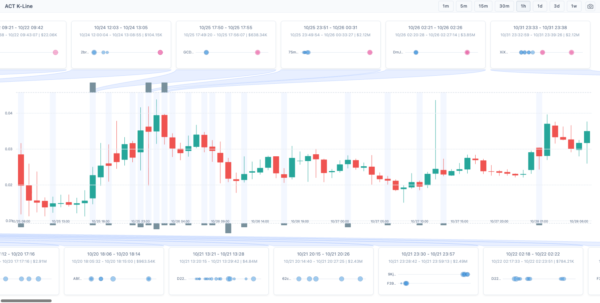
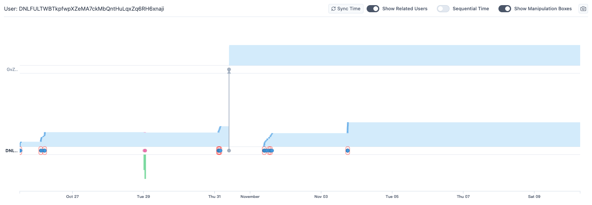
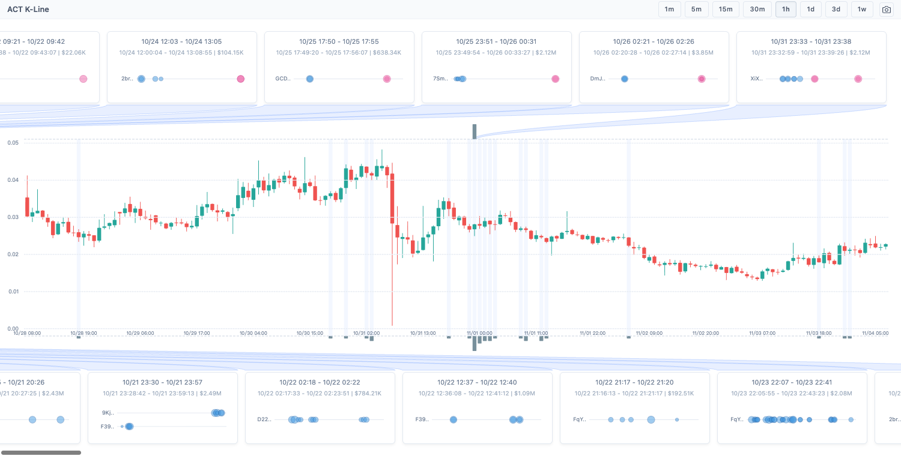
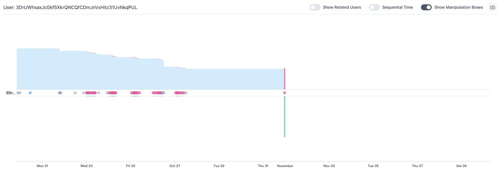
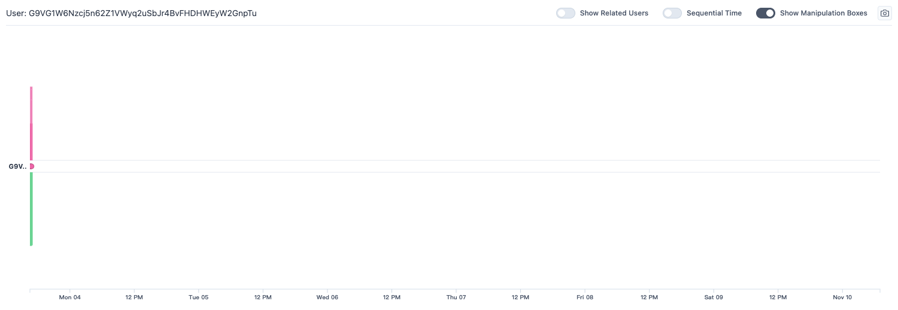
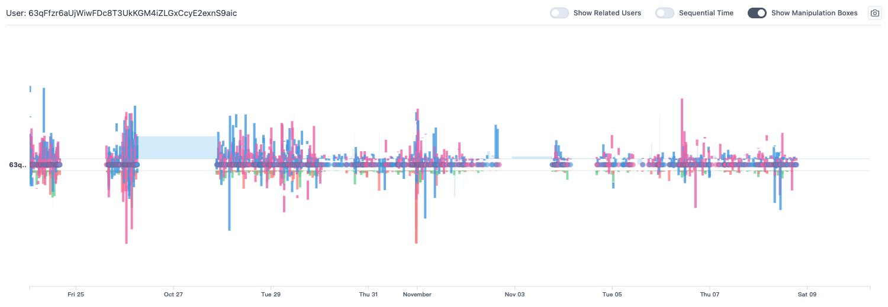
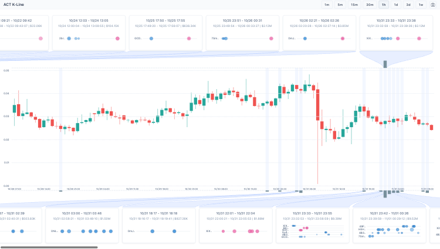
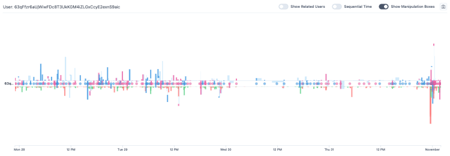
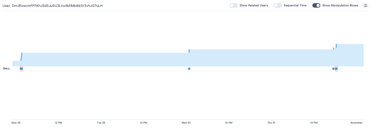

# Continued ACT Investigation

## Scope

This report continues the recommendations from `analysis-report.md` for the ACT session. The follow-up focused on five threads:

- Validate whether the original collusion case still holds.
- Search for sibling manipulation windows.
- Identify similar wallet roles outside the selected group.
- Follow DNL's overlooked storage sink.
- Test whether the campaign had a post-support exit phase.

The rendered evidence images used in this report are stored in `continued-investigation-assets/`.

## Actions Taken

1. Revisited the original three manipulation-card cohorts from the trace and checked which wallets repeated across those cohorts.
2. Rendered the core K-line window from `2024-10-25` through `2024-10-27` to review the highest-value support region.
3. Reviewed DmJ and DNL behavior after `2024-10-27` to test whether they immediately became exit sellers.
4. Followed DNL's large outgoing transfer path on `2024-10-31` and inspected the receiver `GvZknRDvFn1XXhBycPxw1kAL2dVDa2pAB5fJdRmmDZHD`.
5. Rendered the broader post-window K-line from `2024-10-28` through `2024-11-03` to look for sibling manipulation windows.
6. Compared large exit-seller candidates with high-frequency buy-sell candidates.
7. Rechecked `63q...9aic` and DmJ in the same aligned time window, `2024-10-27 15:00 UTC` through `2024-10-31 18:00 UTC`, to avoid mixing different behavioral roles.

## Intermediate Results

### Original Cohort Overlap

The original trace clicked three manipulation-card cohorts. Across those cards there were 17 unique wallets. `DmJ...7uLH` appeared in all three cohorts, `5YP...1xYv` appeared in the first two, and `7Sm...c7qb` appeared in the second and third.

This overlap still supports the original collusion hypothesis, especially because repeated wallets bridge multiple suspicious time windows.

### Core Support Window

The `2024-10-25` to `2024-10-27` K-line window remains the strongest support/manipulation region. It contains dense manipulation bands around the peak and subsequent decline.

The important caveat is post-window behavior. After `2024-10-27`, DmJ and DNL did not behave like pure exit sellers:

- DmJ had 34 buys, 0 sells, bought 3.93M ACT, and spent about $121.0K from `2024-10-29` through `2024-11-03`.
- DNL had 121 buys, 3 sells, bought 11.76M ACT, sold 0.15M ACT, and spent about $326.5K over the same interval.

This makes the original clicked component look more like continued support or accumulation plus custody movement than immediate exit.

### DNL Storage Sink

DNL sent 7.828572M ACT to `GvZknRDvFn1XXhBycPxw1kAL2dVDa2pAB5fJdRmmDZHD` in three transfers on `2024-10-31`:

| Time UTC | Amount ACT |
|---|---:|
| `2024-10-31 01:43:33` | 800,000.000000 |
| `2024-10-31 01:46:13` | 6,500,000.000000 |
| `2024-10-31 01:53:38` | 528,572.256551 |

The receiver has exactly those three behavior events, no local trades, no outgoing transfers, and a latest snapshot balance of 7.828572M ACT. This supports a storage sink interpretation more strongly than an operational relay interpretation.

### Post-Window Activity

The `2024-10-28` through `2024-11-03` K-line window shows dense manipulation bands around the `2024-10-31` crash/recovery and the following drift.

Two distinct post-window role types emerged:

| Role type | Wallet | Evidence |
|---|---|---|
| Large one-shot exit seller | `3Dr...qPUL` | Sold 34.20M ACT in 3 trades at `2024-10-31 15:32:27 UTC`, received about $745.7K, and ended with effectively zero latest balance. |
| Later smaller exit seller | `G9V...npTu` | Sold 4.84M ACT in 19 trades from `2024-11-03 08:34:24` to `08:51:10 UTC`, received about $69.8K, and was not present as a latest top-holder node. |
| Round-trip-like high-frequency actor | `63q...9aic` | From `2024-10-28` through `2024-11-03`, made 5,043 trades, bought 14.15M ACT, sold 14.15M ACT, spent about $397.9K, received about $399.7K, and ended near flat. |
| Round-trip-like high-frequency actor | `Hji...D3hs` | Made 1,084 trades, bought 34.95M ACT, sold 34.95M ACT, spent about $855.7K, and received about $925.0K. |
| Heavy high-frequency actor, not net exit | `6jv...6QPV` | Made 4,357 trades, bought 54.66M ACT, sold 48.14M ACT, and remained net long by 6.53M ACT. |

Visual examples:

### Aligned Role Comparison

To avoid comparing wallets across mismatched time domains, I rerendered the K-line, `63q...9aic`, and DmJ for the same window: `2024-10-27 15:00 UTC` through `2024-10-31 18:00 UTC`.

For `63qFfzr6aUjWiwFDc8T3UkKGM4iZLGxCcyE2exnS9aic`, that window contained 4,378 behavior events, including 2,241 buys and 2,137 sells. The ACT flow was near-balanced at 13.37M ACT bought and 13.92M ACT sold, which supports the high-frequency alternating or round-trip interpretation.

For `DmJRzwcmFFFKhJ5dSJuSU3Lns4bfiMb8b1V3vhJG7uLH`, the same window contained only 24 behavior events, all buys, totaling 3.90M ACT bought.

This comparison is important. `63q...9aic` and DmJ should not be grouped as the same behavioral role in this window. `63q...9aic` looks like a dense high-frequency buy-sell actor, while DmJ looks like a sparse directional accumulator.

## Findings

### F1. The Original Collusion Case Still Holds

The repeated cohort overlap remains meaningful. DmJ appears across all three clicked card cohorts, while `5YP...1xYv` and `7Sm...c7qb` bridge subsets of those cohorts. This supports the original hypothesis that the clicked cards were not isolated events.

### F2. DNL Has A Strong Storage-Custody Link

The DNL to `GvZ...DZHD` transfer path is the strongest new direct finding. The receiver's behavior is inert after receiving 7.828572M ACT, which fits a storage sink better than a trading or relay wallet.

### F3. Post-Window Activity Splits Into Different Roles

The post-window candidates do not all represent the same behavior. `3Dr...qPUL` and `G9V...npTu` are exit-seller candidates. `63q...9aic`, `Hji...D3hs`, and similar wallets are high-frequency buy-sell actors with near-balanced flows. `6jv...6QPV` is high-frequency but remains net long rather than exiting.

### F4. DmJ Is Not A Round-Trip Actor In The Aligned Window

The aligned comparison separates DmJ from `63q...9aic`. DmJ is a sparse directional buyer in the checked window, while `63q...9aic` is a dense alternating trader. This reduces the risk of overextending the "round-trip-like" label to wallets that played different roles.

### F5. The Post-Support Exit Hypothesis Is Only Partly Supported

The data supports the existence of exit activity after the original support window, but not a simple story where the same clicked component accumulated, supported, and then exited. I found no direct transfer relation between the top post-window exit sellers and the trace's clicked card users in the local transfer scan. The direct relation found in this follow-up is DNL to `GvZ...DZHD`.

## Bottom Line

The strongest new finding is DNL's storage sink: `GvZ...DZHD` received 7.828572M ACT from DNL within about ten minutes on `2024-10-31` and then stayed inert.

The strongest new lead is a separate post-window activity layer. `3Dr...qPUL` and `G9V...npTu` are exit-seller candidates, while `63q...9aic`, `Hji...D3hs`, and similar wallets look like high-frequency round-trip actors. These deserve follow-up, but current local evidence does not yet connect them directly to the DmJ/DNL clicked component.

The original clicked component still looks suspicious, but the follow-up points to a more complex structure: continued accumulation or support by DmJ and DNL, custody movement through DNL, and a partially separate post-window layer of exit sellers and high-frequency buy-sell actors.
