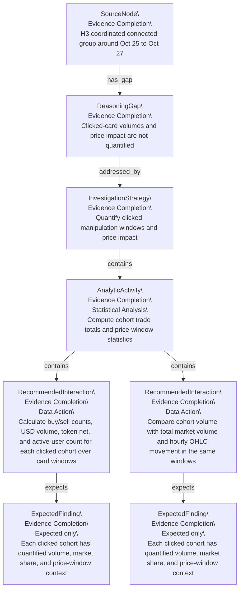
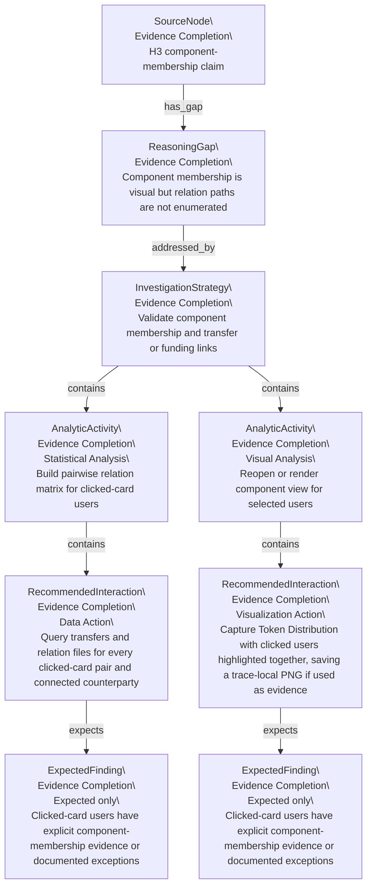
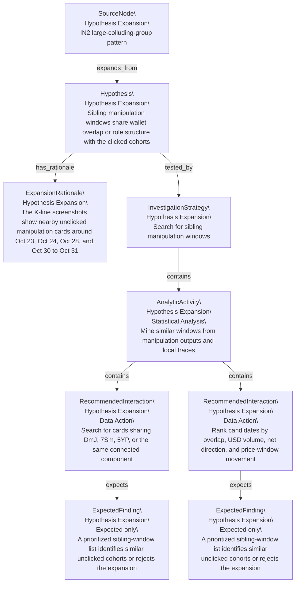
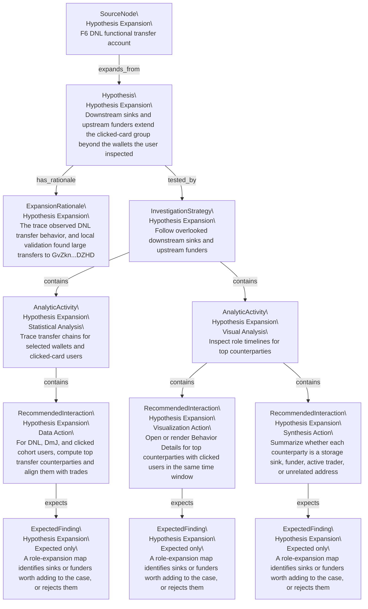
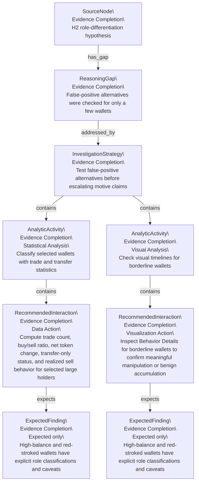

# Recommendation Plan Forest

This file is mechanically generated from `recommendation-plan-graph.json`. It is prescriptive: Expected Findings are plan targets, not evidence-backed Findings.

## Tree 1: SRC_H3_A

H3 coordinated connected group around Oct 25 to Oct 27

| Instance ID | Canonical ID | Parent | Relation | Kind | Recommendation Type | Status | Label |
|---|---|---|---|---|---|---|---|
| SRC_H3_A | SRC_H3_A |  |  | SourceNode | Evidence Completion | planned | H3 coordinated connected group around Oct 25 to Oct 27 |
| RG1@SRC_H3_A.1 | RG1 | SRC_H3_A | has_gap | ReasoningGap | Evidence Completion | planned | Clicked-card volumes and price impact are not quantified |
| RS1@SRC_H3_A.1.1 | RS1 | RG1@SRC_H3_A.1 | addressed_by | InvestigationStrategy | Evidence Completion | planned | Quantify clicked manipulation windows and price impact |
| PAA1@SRC_H3_A.1.1.1 | PAA1 | RS1@SRC_H3_A.1.1 | contains | AnalyticActivity | Evidence Completion | planned | Compute cohort trade totals and price-window statistics |
| PRI1@SRC_H3_A.1.1.1.1 | PRI1 | PAA1@SRC_H3_A.1.1.1 | contains | RecommendedInteraction | Evidence Completion | planned | Calculate buy/sell counts, USD volume, token net, and active-user count for each clicked cohort over card windows |
| EF1@SRC_H3_A.1.1.1.1.1 | EF1 | PRI1@SRC_H3_A.1.1.1.1 | expects | ExpectedFinding | Evidence Completion | planned | Each clicked cohort has quantified volume, market share, and price-window context |
| PRI2@SRC_H3_A.1.1.1.2 | PRI2 | PAA1@SRC_H3_A.1.1.1 | contains | RecommendedInteraction | Evidence Completion | planned | Compare cohort volume with total market volume and hourly OHLC movement in the same windows |
| EF1@SRC_H3_A.1.1.1.2.1 | EF1 | PRI2@SRC_H3_A.1.1.1.2 | expects | ExpectedFinding | Evidence Completion | planned | Each clicked cohort has quantified volume, market share, and price-window context |

## Tree 2: SRC_H3_B

H3 component-membership claim

| Instance ID | Canonical ID | Parent | Relation | Kind | Recommendation Type | Status | Label |
|---|---|---|---|---|---|---|---|
| SRC_H3_B | SRC_H3_B |  |  | SourceNode | Evidence Completion | planned | H3 component-membership claim |
| RG2@SRC_H3_B.1 | RG2 | SRC_H3_B | has_gap | ReasoningGap | Evidence Completion | planned | Component membership is visual but relation paths are not enumerated |
| RS2@SRC_H3_B.1.1 | RS2 | RG2@SRC_H3_B.1 | addressed_by | InvestigationStrategy | Evidence Completion | planned | Validate component membership and transfer or funding links |
| PAA2@SRC_H3_B.1.1.1 | PAA2 | RS2@SRC_H3_B.1.1 | contains | AnalyticActivity | Evidence Completion | planned | Build pairwise relation matrix for clicked-card users |
| PRI3@SRC_H3_B.1.1.1.1 | PRI3 | PAA2@SRC_H3_B.1.1.1 | contains | RecommendedInteraction | Evidence Completion | planned | Query transfers and relation files for every clicked-card pair and connected counterparty |
| EF2@SRC_H3_B.1.1.1.1.1 | EF2 | PRI3@SRC_H3_B.1.1.1.1 | expects | ExpectedFinding | Evidence Completion | planned | Clicked-card users have explicit component-membership evidence or documented exceptions |
| PAA3@SRC_H3_B.1.1.2 | PAA3 | RS2@SRC_H3_B.1.1 | contains | AnalyticActivity | Evidence Completion | planned | Reopen or render component view for selected users |
| PRI4@SRC_H3_B.1.1.2.1 | PRI4 | PAA3@SRC_H3_B.1.1.2 | contains | RecommendedInteraction | Evidence Completion | planned | Capture Token Distribution with clicked users highlighted together, saving a trace-local PNG if used as evidence |
| EF2@SRC_H3_B.1.1.2.1.1 | EF2 | PRI4@SRC_H3_B.1.1.2.1 | expects | ExpectedFinding | Evidence Completion | planned | Clicked-card users have explicit component-membership evidence or documented exceptions |

## Tree 3: SRC_IN2

IN2 large-colluding-group pattern

| Instance ID | Canonical ID | Parent | Relation | Kind | Recommendation Type | Status | Label |
|---|---|---|---|---|---|---|---|
| SRC_IN2 | SRC_IN2 |  |  | SourceNode | Hypothesis Expansion | planned | IN2 large-colluding-group pattern |
| PH1@SRC_IN2.1 | PH1 | SRC_IN2 | expands_from | Hypothesis | Hypothesis Expansion | planned | Sibling manipulation windows share wallet overlap or role structure with the clicked cohorts |
| ER1@SRC_IN2.1.1 | ER1 | PH1@SRC_IN2.1 | has_rationale | ExpansionRationale | Hypothesis Expansion | planned | The K-line screenshots show nearby unclicked manipulation cards around Oct 23, Oct 24, Oct 28, and Oct 30 to Oct 31 |
| RS3@SRC_IN2.1.2 | RS3 | PH1@SRC_IN2.1 | tested_by | InvestigationStrategy | Hypothesis Expansion | planned | Search for sibling manipulation windows |
| PAA4@SRC_IN2.1.2.1 | PAA4 | RS3@SRC_IN2.1.2 | contains | AnalyticActivity | Hypothesis Expansion | planned | Mine similar windows from manipulation outputs and local traces |
| PRI5@SRC_IN2.1.2.1.1 | PRI5 | PAA4@SRC_IN2.1.2.1 | contains | RecommendedInteraction | Hypothesis Expansion | planned | Search for cards sharing DmJ, 7Sm, 5YP, or the same connected component |
| EF3@SRC_IN2.1.2.1.1.1 | EF3 | PRI5@SRC_IN2.1.2.1.1 | expects | ExpectedFinding | Hypothesis Expansion | planned | A prioritized sibling-window list identifies similar unclicked cohorts or rejects the expansion |
| PRI6@SRC_IN2.1.2.1.2 | PRI6 | PAA4@SRC_IN2.1.2.1 | contains | RecommendedInteraction | Hypothesis Expansion | planned | Rank candidates by overlap, USD volume, net direction, and price-window movement |
| EF3@SRC_IN2.1.2.1.2.1 | EF3 | PRI6@SRC_IN2.1.2.1.2 | expects | ExpectedFinding | Hypothesis Expansion | planned | A prioritized sibling-window list identifies similar unclicked cohorts or rejects the expansion |

## Tree 4: SRC_F6

F6 DNL functional transfer account

| Instance ID | Canonical ID | Parent | Relation | Kind | Recommendation Type | Status | Label |
|---|---|---|---|---|---|---|---|
| SRC_F6 | SRC_F6 |  |  | SourceNode | Hypothesis Expansion | planned | F6 DNL functional transfer account |
| PH2@SRC_F6.1 | PH2 | SRC_F6 | expands_from | Hypothesis | Hypothesis Expansion | planned | Downstream sinks and upstream funders extend the clicked-card group beyond the wallets the user inspected |
| ER2@SRC_F6.1.1 | ER2 | PH2@SRC_F6.1 | has_rationale | ExpansionRationale | Hypothesis Expansion | planned | The trace observed DNL transfer behavior, and local validation found large transfers to GvZkn...DZHD |
| RS4@SRC_F6.1.2 | RS4 | PH2@SRC_F6.1 | tested_by | InvestigationStrategy | Hypothesis Expansion | planned | Follow overlooked downstream sinks and upstream funders |
| PAA5@SRC_F6.1.2.1 | PAA5 | RS4@SRC_F6.1.2 | contains | AnalyticActivity | Hypothesis Expansion | planned | Trace transfer chains for selected wallets and clicked-card users |
| PRI7@SRC_F6.1.2.1.1 | PRI7 | PAA5@SRC_F6.1.2.1 | contains | RecommendedInteraction | Hypothesis Expansion | planned | For DNL, DmJ, and clicked cohort users, compute top transfer counterparties and align them with trades |
| EF4@SRC_F6.1.2.1.1.1 | EF4 | PRI7@SRC_F6.1.2.1.1 | expects | ExpectedFinding | Hypothesis Expansion | planned | A role-expansion map identifies sinks or funders worth adding to the case, or rejects them |
| PAA6@SRC_F6.1.2.2 | PAA6 | RS4@SRC_F6.1.2 | contains | AnalyticActivity | Hypothesis Expansion | planned | Inspect role timelines for top counterparties |
| PRI8@SRC_F6.1.2.2.1 | PRI8 | PAA6@SRC_F6.1.2.2 | contains | RecommendedInteraction | Hypothesis Expansion | planned | Open or render Behavior Details for top counterparties with clicked users in the same time window |
| EF4@SRC_F6.1.2.2.1.1 | EF4 | PRI8@SRC_F6.1.2.2.1 | expects | ExpectedFinding | Hypothesis Expansion | planned | A role-expansion map identifies sinks or funders worth adding to the case, or rejects them |
| PRI9@SRC_F6.1.2.2.2 | PRI9 | PAA6@SRC_F6.1.2.2 | contains | RecommendedInteraction | Hypothesis Expansion | planned | Summarize whether each counterparty is a storage sink, funder, active trader, or unrelated address |
| EF4@SRC_F6.1.2.2.2.1 | EF4 | PRI9@SRC_F6.1.2.2.2 | expects | ExpectedFinding | Hypothesis Expansion | planned | A role-expansion map identifies sinks or funders worth adding to the case, or rejects them |

## Tree 5: SRC_H2

H2 role-differentiation hypothesis

| Instance ID | Canonical ID | Parent | Relation | Kind | Recommendation Type | Status | Label |
|---|---|---|---|---|---|---|---|
| SRC_H2 | SRC_H2 |  |  | SourceNode | Evidence Completion | planned | H2 role-differentiation hypothesis |
| RG3@SRC_H2.1 | RG3 | SRC_H2 | has_gap | ReasoningGap | Evidence Completion | planned | False-positive alternatives were checked for only a few wallets |
| RS5@SRC_H2.1.1 | RS5 | RG3@SRC_H2.1 | addressed_by | InvestigationStrategy | Evidence Completion | planned | Test false-positive alternatives before escalating motive claims |
| PAA7@SRC_H2.1.1.1 | PAA7 | RS5@SRC_H2.1.1 | contains | AnalyticActivity | Evidence Completion | planned | Classify selected wallets with trade and transfer statistics |
| PRI10@SRC_H2.1.1.1.1 | PRI10 | PAA7@SRC_H2.1.1.1 | contains | RecommendedInteraction | Evidence Completion | planned | Compute trade count, buy/sell ratio, net token change, transfer-only status, and realized sell behavior for selected large holders |
| EF5@SRC_H2.1.1.1.1.1 | EF5 | PRI10@SRC_H2.1.1.1.1 | expects | ExpectedFinding | Evidence Completion | planned | High-balance and red-stroked wallets have explicit role classifications and caveats |
| PAA8@SRC_H2.1.1.2 | PAA8 | RS5@SRC_H2.1.1 | contains | AnalyticActivity | Evidence Completion | planned | Check visual timelines for borderline wallets |
| PRI11@SRC_H2.1.1.2.1 | PRI11 | PAA8@SRC_H2.1.1.2 | contains | RecommendedInteraction | Evidence Completion | planned | Inspect Behavior Details for borderline wallets to confirm meaningful manipulation or benign accumulation |
| EF5@SRC_H2.1.1.2.1.1 | EF5 | PRI11@SRC_H2.1.1.2.1 | expects | ExpectedFinding | Evidence Completion | planned | High-balance and red-stroked wallets have explicit role classifications and caveats |

## Reading Notes

- Evidence Completion branches fill Reasoning Gaps under existing reasoning.
- Hypothesis Expansion branches propose new Hypotheses from existing reasoning.
- Expected Findings must be converted to real Findings only after follow-up evidence exists.
