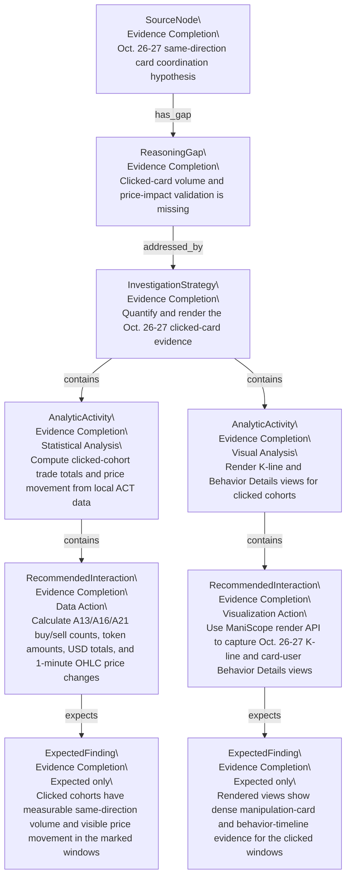
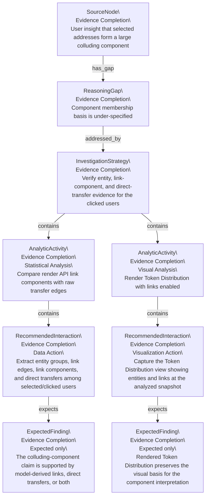
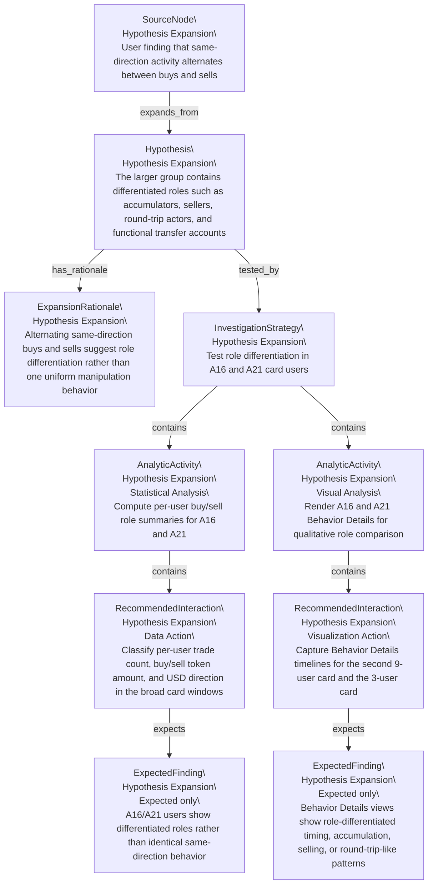

# Recommendation Plan Forest

This file is mechanically generated from `recommendation-plan-graph.json`. It is prescriptive: Expected Findings are plan targets, not evidence-backed Findings.

## Tree 1: SRC_H3

Oct. 26-27 same-direction card coordination hypothesis

| Instance ID | Canonical ID | Parent | Relation | Kind | Recommendation Type | Status | Label |
|---|---|---|---|---|---|---|---|
| SRC_H3 | SRC_H3 |  |  | SourceNode | Evidence Completion | planned | Oct. 26-27 same-direction card coordination hypothesis |
| RG1@SRC_H3.1 | RG1 | SRC_H3 | has_gap | ReasoningGap | Evidence Completion | planned | Clicked-card volume and price-impact validation is missing |
| RS1@SRC_H3.1.1 | RS1 | RG1@SRC_H3.1 | addressed_by | InvestigationStrategy | Evidence Completion | planned | Quantify and render the Oct. 26-27 clicked-card evidence |
| PAA1@SRC_H3.1.1.1 | PAA1 | RS1@SRC_H3.1.1 | contains | AnalyticActivity | Evidence Completion | planned | Compute clicked-cohort trade totals and price movement from local ACT data |
| PRI1@SRC_H3.1.1.1.1 | PRI1 | PAA1@SRC_H3.1.1.1 | contains | RecommendedInteraction | Evidence Completion | planned | Calculate A13/A16/A21 buy/sell counts, token amounts, USD totals, and 1-minute OHLC price changes |
| PEF1@SRC_H3.1.1.1.1.1 | PEF1 | PRI1@SRC_H3.1.1.1.1 | expects | ExpectedFinding | Evidence Completion | planned | Clicked cohorts have measurable same-direction volume and visible price movement in the marked windows |
| PAA2@SRC_H3.1.1.2 | PAA2 | RS1@SRC_H3.1.1 | contains | AnalyticActivity | Evidence Completion | planned | Render K-line and Behavior Details views for clicked cohorts |
| PRI2@SRC_H3.1.1.2.1 | PRI2 | PAA2@SRC_H3.1.1.2 | contains | RecommendedInteraction | Evidence Completion | planned | Use ManiScope render API to capture Oct. 26-27 K-line and card-user Behavior Details views |
| PEF2@SRC_H3.1.1.2.1.1 | PEF2 | PRI2@SRC_H3.1.1.2.1 | expects | ExpectedFinding | Evidence Completion | planned | Rendered views show dense manipulation-card and behavior-timeline evidence for the clicked windows |

## Tree 2: SRC_IN16

User insight that selected addresses form a large colluding component

| Instance ID | Canonical ID | Parent | Relation | Kind | Recommendation Type | Status | Label |
|---|---|---|---|---|---|---|---|
| SRC_IN16 | SRC_IN16 |  |  | SourceNode | Evidence Completion | planned | User insight that selected addresses form a large colluding component |
| RG2@SRC_IN16.1 | RG2 | SRC_IN16 | has_gap | ReasoningGap | Evidence Completion | planned | Component membership basis is under-specified |
| RS2@SRC_IN16.1.1 | RS2 | RG2@SRC_IN16.1 | addressed_by | InvestigationStrategy | Evidence Completion | planned | Verify entity, link-component, and direct-transfer evidence for the clicked users |
| PAA3@SRC_IN16.1.1.1 | PAA3 | RS2@SRC_IN16.1.1 | contains | AnalyticActivity | Evidence Completion | planned | Compare render API link components with raw transfer edges |
| PRI3@SRC_IN16.1.1.1.1 | PRI3 | PAA3@SRC_IN16.1.1.1 | contains | RecommendedInteraction | Evidence Completion | planned | Extract entity groups, link edges, link components, and direct transfers among selected/clicked users |
| PEF3@SRC_IN16.1.1.1.1.1 | PEF3 | PRI3@SRC_IN16.1.1.1.1 | expects | ExpectedFinding | Evidence Completion | planned | The colluding-component claim is supported by model-derived links, direct transfers, or both |
| PAA4@SRC_IN16.1.1.2 | PAA4 | RS2@SRC_IN16.1.1 | contains | AnalyticActivity | Evidence Completion | planned | Render Token Distribution with links enabled |
| PRI4@SRC_IN16.1.1.2.1 | PRI4 | PAA4@SRC_IN16.1.1.2 | contains | RecommendedInteraction | Evidence Completion | planned | Capture the Token Distribution view showing entities and links at the analyzed snapshot |
| PEF4@SRC_IN16.1.1.2.1.1 | PEF4 | PRI4@SRC_IN16.1.1.2.1 | expects | ExpectedFinding | Evidence Completion | planned | Rendered Token Distribution preserves the visual basis for the component interpretation |

## Tree 3: SRC_F12

User finding that same-direction activity alternates between buys and sells

| Instance ID | Canonical ID | Parent | Relation | Kind | Recommendation Type | Status | Label |
|---|---|---|---|---|---|---|---|
| SRC_F12 | SRC_F12 |  |  | SourceNode | Hypothesis Expansion | planned | User finding that same-direction activity alternates between buys and sells |
| PH1@SRC_F12.1 | PH1 | SRC_F12 | expands_from | Hypothesis | Hypothesis Expansion | planned | The larger group contains differentiated roles such as accumulators, sellers, round-trip actors, and functional transfer accounts |
| ER1@SRC_F12.1.1 | ER1 | PH1@SRC_F12.1 | has_rationale | ExpansionRationale | Hypothesis Expansion | planned | Alternating same-direction buys and sells suggest role differentiation rather than one uniform manipulation behavior |
| RS3@SRC_F12.1.2 | RS3 | PH1@SRC_F12.1 | tested_by | InvestigationStrategy | Hypothesis Expansion | planned | Test role differentiation in A16 and A21 card users |
| PAA5@SRC_F12.1.2.1 | PAA5 | RS3@SRC_F12.1.2 | contains | AnalyticActivity | Hypothesis Expansion | planned | Compute per-user buy/sell role summaries for A16 and A21 |
| PRI5@SRC_F12.1.2.1.1 | PRI5 | PAA5@SRC_F12.1.2.1 | contains | RecommendedInteraction | Hypothesis Expansion | planned | Classify per-user trade count, buy/sell token amount, and USD direction in the broad card windows |
| PEF5@SRC_F12.1.2.1.1.1 | PEF5 | PRI5@SRC_F12.1.2.1.1 | expects | ExpectedFinding | Hypothesis Expansion | planned | A16/A21 users show differentiated roles rather than identical same-direction behavior |
| PAA6@SRC_F12.1.2.2 | PAA6 | RS3@SRC_F12.1.2 | contains | AnalyticActivity | Hypothesis Expansion | planned | Render A16 and A21 Behavior Details for qualitative role comparison |
| PRI6@SRC_F12.1.2.2.1 | PRI6 | PAA6@SRC_F12.1.2.2 | contains | RecommendedInteraction | Hypothesis Expansion | planned | Capture Behavior Details timelines for the second 9-user card and the 3-user card |
| PEF6@SRC_F12.1.2.2.1.1 | PEF6 | PRI6@SRC_F12.1.2.2.1 | expects | ExpectedFinding | Hypothesis Expansion | planned | Behavior Details views show role-differentiated timing, accumulation, selling, or round-trip-like patterns |

## Reading Notes

- Evidence Completion branches fill Reasoning Gaps under existing reasoning.
- Hypothesis Expansion branches propose new Hypotheses from existing reasoning.
- Expected Findings must be converted to real Findings only after follow-up evidence exists.
