# ManiScope ACT Trace Step Map

## Purpose

This file maps the evidence in `session.json`, screenshots, and annotations to the intentions, findings, insights, and follow-up recommendations in [analysis-report.md](analysis-report.md). It uses compact analytical step nodes rather than every raw interaction, because the exported trace contains many low-level toggles, scrolls, and zoom updates that are better understood as evidence bundles.

## Representation choice

The map is a claim-traceability graph:

- Step nodes bundle observed trace evidence.
- Intention nodes describe Tasks, Analytic Questions, and Hypotheses.
- Finding nodes describe user-authored Findings, analyst-inferred Findings, and high-level Insights.
- Recommendation nodes describe Investigation Strategies and Analytic Activities that follow from the evidence.

Confidence labels:

- Direct evidence: user-authored annotation or logged action.
- Strong inference: supported by multiple trace steps or trace plus local data.
- Weak hypothesis: plausible but not yet fully validated.

## Step nodes

| Step ID | Evidence | What happened | Why it matters |
|---|---|---|---|
| Step01 | Actions 0-2; annotations 0-3; [annotation-0000](images/annotation-0000-token_distribution.png), [annotation-0001](images/annotation-0001-token_distribution.png), [annotation-0002](images/annotation-0002-token_distribution.png) | Snapshot updated, links toggled, and Token Distribution annotated for supply concentration, suspicious nodes, entities, and components. | Establishes initial risk surface. |
| Step02 | Action 3; annotations 4-5; [annotation-0004](images/annotation-0004-token_distribution.png), [annotation-0005](images/annotation-0005-behavior_details.png) | `6Z6RJJGrmVyndcPyTFhmLYHkHttiYtTccKpXFV9r2237` selected and judged as a top holder but not manipulator. | Separates supply concentration from manipulation. |
| Step03 | Actions 4-6; annotations 6-7; [annotation-0006](images/annotation-0006-token_distribution.png), [annotation-0007](images/annotation-0007-behavior_details.png) | `CqWVLXaj8r6vud5SfFr81SzmFoqXa5daLi1WbpQZxuhV` selected, zoomed, and checked with Sequential Time. | Shows detector adjudication and false-positive caution. |
| Step04 | Actions 7-11; annotations 8-10; [annotation-0008](images/annotation-0008-token_distribution.png), [annotation-0009](images/annotation-0009-behavior_details.png), [annotation-0010](images/annotation-0010-behavior_details.png) | `DNLFULTWBTkpfwpXZeMA7ckMbQntHuLqxZq6RH6xnaji` and `DmJRzwcmFFFKhJ5dSJuSU3Lns4bfiMb8b1V3vhJG7uLH` examined through related-user behavior. | Introduces functional-account and bridge-account roles. |
| Step05 | Action 12; annotation 12; [annotation-0012](images/annotation-0012-candlestick_chart.png) | K-line manipulation cards around `2024-10-25` to `2024-11-01` inspected, with the `2024-10-24` to `2024-10-27` price region marked. | Links behavioral evidence to market movement. |
| Step06 | Actions 13-15; annotation 13; [action-0014-source](images/action-0014-source-kline_chart-01.png), [annotation-0013](images/annotation-0013-behavior_details.png) | First 9-user manipulation card clicked and annotated as same-direction buying after DmJ's sell. | Provides cohort-level coordination evidence. |
| Step07 | Actions 16-20; annotations 14-15; [action-0017-source](images/action-0017-source-kline_chart-01.png), [annotation-0014](images/annotation-0014-behavior_details.png), [annotation-0015](images/annotation-0015-behavior_details.png) | Second 9-user card inspected in absolute and sequential time; alternating buy/sell behavior recorded. | Adds round-trip-like behavior to the coordination hypothesis. |
| Step08 | Actions 21-23; annotations 17-19; [action-0022-source](images/action-0022-source-kline_chart-01.png), [annotation-0017](images/annotation-0017-behavior_details.png), [annotation-0019](images/annotation-0019-token_distribution.png) | Three-user card inspected, final component and colluding-group insight created, session exported. | Synthesizes card and graph evidence into the high-level collusion claim. |
| Step09 | Local ACT data checks from `sorted_trades.csv` and `sorted_transfers.csv` | Analyst-side opportunity mining found DNL's untraced `2024-10-31` transfer sink, high-frequency post-window traders, and large post-window sell candidates. | Grounds the new similar-exploration and hindsight recommendations in ACT data rather than speculation alone. |

Trace gaps:

- Step05 to Step08 rely on card labels inferred from screenshots because exported card-click events contain users but not full card metadata.
- Step04 includes a timestamp anomaly: action 11 is logged after action 10 but has an earlier timestamp.
- Step06 and Step07 contain important zoom and scroll operations with no screenshots because zoom or scroll snapshots were disabled.

## Intention claim nodes

| ID | Scope | Claim | Confidence |
|---|---|---|---|
| T1 | Task | Configure and inspect ACT snapshot with links. | Direct evidence |
| T2 | Task | Check whether `6Z6RJJGrmVyndcPyTFhmLYHkHttiYtTccKpXFV9r2237` is manipulative. | Direct evidence |
| T3 | Task | Evaluate whether `CqWVLXaj8r6vud5SfFr81SzmFoqXa5daLi1WbpQZxuhV` is a true manipulator or normal accumulator. | Direct evidence |
| T4 | Task | Inspect functional or related accounts around `DNLFULTWBTkpfwpXZeMA7ckMbQntHuLqxZq6RH6xnaji` and `DmJRzwcmFFFKhJ5dSJuSU3Lns4bfiMb8b1V3vhJG7uLH`. | Direct evidence |
| T5 | Task | Relate manipulation cards to K-line price movement. | Direct evidence |
| T6 | Task | Inspect card-user cohorts in Behavior Details. | Direct evidence |
| T7 | Task | Synthesize trace findings into a colluding-group claim. | Direct evidence |
| AQ1 | Analytic Question | Is ACT's supply and holder graph suspicious enough to justify investigation? | Direct evidence |
| AQ2 | Analytic Question | Which flagged wallets are benign, functional, or manipulative? | Strong inference |
| AQ3 | Analytic Question | Did same-direction and round-trip card windows align with price movement? | Strong inference |
| AQ4 | Analytic Question | Are the clicked cohorts part of a larger connected collusive component? | Strong inference |
| H1 | Hypothesis | ACT manipulation is likely organized around a connected component rather than isolated wallets. | Weak hypothesis |
| H2 | Hypothesis | Some normal-looking accounts serve operational roles, such as storage, transfer, or detection-avoidance accounts. | Weak hypothesis |
| H3 | Hypothesis | The `2024-10-25` to `2024-10-27` behavior includes coordinated same-direction and round-trip-like activity that affected price. | Weak hypothesis |

## Finding and insight claim nodes

| ID | Scope | Claim | Confidence |
|---|---|---|---|
| F1 | Finding | Approximately 51 users held 30% of ACT supply, with many red-stroked suspicious nodes. | Direct evidence |
| F2 | Finding | Three detected entities held substantial funds and mixed suspicious with normal-looking accounts. | Direct evidence |
| F3 | Finding | Two entities and other holders were connected in a single component. | Direct evidence |
| F4 | Finding | `6Z6RJJGrmVyndcPyTFhmLYHkHttiYtTccKpXFV9r2237` was a top holder but not visibly manipulative. | Direct evidence |
| F5 | Finding | `CqWVLXaj8r6vud5SfFr81SzmFoqXa5daLi1WbpQZxuhV` looked like a normal accumulator despite a detector hit. | Direct evidence |
| F6 | Finding | `DNLFULTWBTkpfwpXZeMA7ckMbQntHuLqxZq6RH6xnaji` looked like a functional account that transferred tokens onward. | Direct evidence |
| F7 | Finding | `DmJRzwcmFFFKhJ5dSJuSU3Lns4bfiMb8b1V3vhJG7uLH` was visually associated with similar-period buying and price impact. | Direct evidence |
| F8 | Finding | The K-line region around `2024-10-24` to `2024-10-27` was marked as price-affected. | Direct evidence |
| F9 | Finding | A 9-user card cohort bought frequently in the same direction after DmJ's sell. | Direct evidence |
| F10 | Finding | Three selected card users were interpreted as belonging to the same component. | Direct evidence |
| MF1 | Finding | The analyst path is role-based rather than detector-only. | Strong inference |
| MF2 | Finding | `DmJRzwcmFFFKhJ5dSJuSU3Lns4bfiMb8b1V3vhJG7uLH` bridges all three clicked card cohorts. | Strong inference |
| MF3 | Finding | The first 9-user inferred card window contains pure buying among locally active users. | Strong inference |
| MF4 | Finding | The second 9-user cohort has round-trip-like aggregate local behavior over `2024-10-25` to `2024-10-27`. | Strong inference |
| MF5 | Finding | The 3-user card has a plausible round-trip signature among active users. | Strong inference |
| MF6 | Finding | DNL sent 7.83M ACT to `GvZknRDvFn1XXhBycPxw1kAL2dVDa2pAB5fJdRmmDZHD` on `2024-10-31`; that sink has no local trades or outgoing transfers. | Strong inference |
| MF7 | Finding | Unclicked post-window activity includes high-frequency wallets such as `HjiNTb9SJzVi9fc3ekr5PUMd3fCkFwEwAde52vDQD3hs` and `6jvYtr9G5WQnKs3cFsFtKmEfkbEnUXFhBKsmZad26QPV`. | Strong inference |
| MF8 | Finding | Large post-window sell candidates include `3DrUWhsaxJcGkf5XkrQNCQfCDmJnVxHitz31UvNkqPUL` and `G9VG1W6Nzcj5n62Z1VWyq2uSbJr4BvFHDHWEyW2GnpTu`. | Strong inference |
| IN1 | Insight | ACT presents a high-risk investigation surface. | Direct evidence |
| IN2 | Insight | Detector output needs analyst adjudication because flags mix passive, normal, functional, and bridge-like roles. | Strong inference |
| IN3 | Insight | The strongest trace-supported hypothesis is a connected collusive component active around `2024-10-25` to `2024-10-27`. | Weak hypothesis |

## Recommendation claim nodes

| ID | Scope | Recommendation | Target outcome |
|---|---|---|---|
| RS1 | Investigation Strategy | Continue the user's path by validating the core collusion case. | Case packet with role timeline, manipulation-window table, and component map. |
| RS2 | Investigation Strategy | Explore sibling manipulation windows similar to the user's selected windows. | Ranked unclicked-window list with card labels, active wallets, cohort volume, and known-wallet overlap. |
| RS3 | Investigation Strategy | Search for similar wallet roles outside the user's selected group. | Candidate roster of uninvestigated passive whales, functional accounts, bridge wallets, round-trip actors, and exit sellers. |
| RS4 | Investigation Strategy | Follow the DNL storage sink overlooked in the trace. | Downstream custody analysis for DNL and `GvZkn...DZHD`. |
| RS5 | Investigation Strategy | Test whether the campaign had a post-support exit phase. | Post-window exit analysis from `2024-10-28` through `2024-11-03`. |
| AA1 | Analytic Activity | Reconstruct role and window evidence. | Visual Analysis |
| AA2 | Analytic Activity | Quantify clicked cohorts and bridge wallets. | Statistical Analysis |
| AA3 | Analytic Activity | Recompute component and price-impact evidence. | Statistical Analysis |
| AA4 | Analytic Activity | Mine visible but unclicked K-line cards. | Visual Analysis |
| AA5 | Analytic Activity | Rank sibling windows from local data. | Statistical Analysis |
| AA6 | Analytic Activity | Build role-similarity features. | Statistical Analysis |
| AA7 | Analytic Activity | Inspect top role matches visually. | Visual Analysis |
| AA8 | Analytic Activity | Trace DNL downstream custody. | Statistical Analysis |
| AA9 | Analytic Activity | Inspect sink visibility in ManiScope. | Visual Analysis |
| AA10 | Analytic Activity | Compute post-window exits. | Statistical Analysis |
| AA11 | Analytic Activity | Compare exits to original component. | Statistical Analysis |
| AA12 | Analytic Activity | Inspect top exits visually. | Visual Analysis |

## Traceability matrix

| Step | Intention IDs | Finding or insight IDs | Recommendation IDs | Rationale |
|---|---|---|---|---|
| Step01 | T1, AQ1, H1 | F1, F2, F3, IN1 | RS1, RS3, AA3, AA6, AA7 | The user starts with graph structure and component risk; this supports validating the component and searching for similar roles elsewhere. |
| Step02 | T2, AQ2 | F4, MF1, IN2 | RS1, RS3, AA1, AA2, AA6, AA7 | The passive whale check becomes a role template and a false-positive control. |
| Step03 | T3, AQ2 | F5, MF1, IN2 | RS1, RS3, AA1, AA2, AA6, AA7 | The normal-accumulator check supports role-similarity searches and prevents overcalling detector hits. |
| Step04 | T4, AQ2, H2 | F6, F7, MF1, IN2 | RS1, RS4, AA1, AA2, AA8, AA9 | DNL and DmJ shift the inquiry toward functional accounts, related accounts, and downstream custody. |
| Step05 | T5, AQ3, H3 | F8 | RS1, RS2, RS5, AA3, AA4, AA5, AA10 | The price-impact claim justifies both validating the chosen windows and searching nearby unclicked windows. |
| Step06 | T6, AQ3, H3 | F9, MF2, MF3 | RS1, RS2, RS5, AA2, AA3, AA4, AA5, AA10 | The first 9-user card gives the template for sibling same-direction windows. |
| Step07 | T6, AQ3, H3 | MF2, MF4 | RS1, RS2, RS3, AA2, AA4, AA5, AA6 | The second card gives the template for round-trip-like role searches. |
| Step08 | T7, AQ4, H1, H3 | F10, MF2, MF5, IN3 | RS1, RS3, AA2, AA3, AA6, AA7 | The final insight ties card cohorts and component evidence into the collusion hypothesis. |
| Step09 | AQ2, AQ3, H2, H3 | MF6, MF7, MF8 | RS2, RS3, RS4, RS5, AA5, AA6, AA8, AA10, AA11 | Local data surfaces leads the user did not follow: DNL's storage sink, high-frequency sibling windows, and post-support exit candidates. |

## Mermaid graph

```mermaid
flowchart TD
  Step01["Step01: Snapshot and graph triage"]
  Step02["Step02: 6Z6 whale check"]
  Step03["Step03: CqW accumulator check"]
  Step04["Step04: DNL and DmJ role tracing"]
  Step05["Step05: K-line price region"]
  Step06["Step06: First 9-user same-direction card"]
  Step07["Step07: Second 9-user alternating pattern"]
  Step08["Step08: Three-user card and final insight"]
  Step09["Step09: Local opportunity mining"]

  T1["T1: Configure ACT snapshot"]
  T2["T2: Check 6Z6"]
  T3["T3: Check CqW"]
  T4["T4: Trace DNL and DmJ"]
  T5["T5: Relate cards to K-line"]
  T6["T6: Inspect card cohorts"]
  T7["T7: Synthesize collusion claim"]

  AQ1["AQ1: Supply and graph suspicious?"]
  AQ2["AQ2: Wallet roles?"]
  AQ3["AQ3: Card windows affect price?"]
  AQ4["AQ4: Cohorts in same component?"]

  H1["H1: Connected component campaign"]
  H2["H2: Normal-looking operational accounts"]
  H3["H3: Oct 25-27 coordinated price activity"]

  F1["F1: 51 users hold 30 percent"]
  F2["F2: Three fund-heavy entities"]
  F3["F3: Single component risk"]
  F4["F4: 6Z6 passive whale"]
  F5["F5: CqW normal accumulator"]
  F6["F6: DNL functional account"]
  F7["F7: DmJ price-relevant"]
  F8["F8: K-line price affected"]
  F9["F9: Same-direction 9-user buying"]
  F10["F10: Three addresses same component"]
  MF1["MF1: Role-based analysis"]
  MF2["MF2: DmJ bridges card cohorts"]
  MF3["MF3: First cohort pure local buying"]
  MF4["MF4: Second cohort round-trip-like"]
  MF5["MF5: Three-user card round-trip-like"]
  MF6["MF6: DNL untraced storage sink"]
  MF7["MF7: High-frequency unclicked activity"]
  MF8["MF8: Post-window exit candidates"]
  IN1["IN1: High-risk ACT surface"]
  IN2["IN2: Detector output needs adjudication"]
  IN3["IN3: Connected collusive component hypothesis"]

  RS1["RS1: Continue core case"]
  RS2["RS2: Explore sibling windows"]
  RS3["RS3: Search similar roles"]
  RS4["RS4: Follow DNL sink"]
  RS5["RS5: Test exit phase"]
  AA1["AA1: Visual role and window evidence"]
  AA2["AA2: Clicked cohort metrics"]
  AA3["AA3: Component and price metrics"]
  AA4["AA4: Mine unclicked cards visually"]
  AA5["AA5: Rank sibling windows"]
  AA6["AA6: Role-similarity features"]
  AA7["AA7: Visual role-match inspection"]
  AA8["AA8: DNL downstream custody"]
  AA9["AA9: Sink visibility inspection"]
  AA10["AA10: Post-window exits"]
  AA11["AA11: Exit-component overlap"]
  AA12["AA12: Visual exit inspection"]

  Step01 --> T1 --> AQ1 --> H1
  Step01 --> F1 --> IN1
  Step01 --> F2 --> IN1
  Step01 --> F3 --> IN1
  F3 --> H1

  Step02 --> T2 --> AQ2
  Step02 --> F4 --> MF1 --> IN2
  Step03 --> T3 --> AQ2
  Step03 --> F5 --> MF1
  Step04 --> T4 --> AQ2
  Step04 --> F6 --> H2
  Step04 --> F7 --> H3
  H2 --> IN2

  Step05 --> T5 --> AQ3 --> H3
  Step05 --> F8 --> H3
  Step06 --> T6 --> AQ3
  Step06 --> F9 --> MF3 --> H3
  Step06 --> MF2
  Step07 --> T6
  Step07 --> MF4 --> H3
  Step07 --> MF2
  Step08 --> T7 --> AQ4 --> H1
  Step08 --> F10 --> H1
  Step08 --> MF5 --> H3
  Step09 --> MF6 --> H2
  Step09 --> MF7 --> RS2
  Step09 --> MF8 --> RS5
  MF2 --> IN3
  H1 --> IN3
  H3 --> IN3

  IN2 --> RS1
  IN2 --> RS3
  IN3 --> RS1
  IN3 --> RS2
  IN3 --> RS3
  H2 --> RS4
  H3 --> RS5
  RS1 --> AA1
  RS1 --> AA2
  RS1 --> AA3
  RS2 --> AA4
  RS2 --> AA5
  RS3 --> AA6
  RS3 --> AA7
  RS4 --> AA8
  RS4 --> AA9
  RS5 --> AA10
  RS5 --> AA11
  RS5 --> AA12
```

## How to read the graph

The strongest direct-evidence path is:

`Step01 -> F1/F2/F3 -> IN1`, which supports the conclusion that ACT deserved deeper investigation.

The strongest role-analysis path is:

`Step02 + Step03 + Step04 -> MF1 -> IN2`, which shows why the user did not treat every red-stroked or detector-flagged wallet as equal.

The strongest collusion-hypothesis path is:

`Step06 + Step07 + Step08 -> MF2/MF3/MF4/MF5 -> H3 -> IN3`, combined with `Step01 + Step08 -> H1 -> IN3`.

The strongest new-opportunity path is:

`Step09 -> MF6/MF7/MF8 -> RS2/RS4/RS5`, which converts local ACT data validation into concrete sibling-window, DNL-sink, and exit-phase investigations.

The weakest path is the motive or intentional detection-avoidance claim under H2. The trace supports operational-account behavior and normal-looking accounts inside suspicious structures, but it does not prove intent.

## Suggestions for future trace analysis

- Export full manipulation card metadata when a card is clicked, including card type, time span, displayed amount, and card ID.
- Keep zoom and scroll screenshots enabled for traces meant for post-hoc analysis. Several important Behavior Details comparisons in this trace have state but no image.
- Add a component-membership export to the session so high-level component claims can be verified without reconstructing the graph from local data.
- When creating high-level insights, select both the visual annotation and the underlying card-click action if possible. This would make card-user provenance more explicit.
