# Trace Step Map

## Purpose

This map links compact trace steps to the Intention Space, Finding Space, and recommendation nodes used in `analysis-report.md`. The canonical Interaction-level reasoning representation is `reasoning-graph.json`; this file groups adjacent raw Interactions for readability.

## Representation choice

The map uses a claim-traceability graph:

- Step nodes `S1` to `S9` group logged Interactions, annotations, screenshots, and view state.
- Intention nodes use `T`, `AQ`, and `H` IDs.
- Finding-space nodes use `F` and `IN` IDs.
- Recommendation nodes use `RS` IDs, with detailed prescriptive structure in `recommendation-plan-graph.json`.

## Step nodes

| Step | Evidence | What happened | Why it matters |
|---|---|---|---|
| S1 | actions 0, 1, 2; annotations 0, 1, 2, 3; screenshots `images/action-0001-target-token_distribution-02.png`, `images/annotation-0000-token_distribution.png`, `images/annotation-0001-token_distribution.png`, `images/annotation-0002-token_distribution.png` | Snapshot `2024-11-09 23:00:00 UTC` was loaded; links were toggled off and on; the user annotated 51 holders, many suspicious nodes, three entity groups, and component connectivity. | Establishes high-level ACT manipulation-risk framing. |
| S2 | action 3; annotations 4, 5; screenshots `images/action-0004-source-token_distribution-01.png`, `images/action-0004-target-behavior_details-01.png`, `images/annotation-0004-token_distribution.png`, `images/annotation-0005-behavior_details.png` | User selected `6Z6R...2237` and inspected Behavior Details. | Tests whether a whale is actually manipulative. |
| S3 | actions 4, 5, 6; annotations 6, 7; screenshots `images/action-0005-source-token_distribution-01.png`, `images/action-0005-target-behavior_details-01.png`, `images/action-0007-source-behavior_details-01.png`, `images/annotation-0006-token_distribution.png`, `images/annotation-0007-behavior_details.png` | User selected `CqW...xuhV`, zoomed to an Oct 26 to Oct 27 Behavior Details window, and enabled Sequential Time. | Refines a same-direction detector result into a likely normal holder case. |
| S4 | actions 7, 8, 9, 10, 11; annotations 8, 9, 10; screenshots `images/action-0008-source-token_distribution-01.png`, `images/action-0008-target-behavior_details-01.png`, `images/action-0009-source-behavior_details-01.png`, `images/action-0011-source-behavior_details-01.png`, `images/annotation-0008-token_distribution.png`, `images/annotation-0009-behavior_details.png`, `images/annotation-0010-behavior_details.png` | User selected `DNL...naji`, showed related users, selected `DmJ...7uLH`, and annotated transfer behavior plus similar buying. | Introduces functional account and bridge-actor reasoning. |
| S5 | action 12; annotation 12; screenshot `images/annotation-0012-candlestick_chart.png` | User scrolled Same Direction manipulation cards and annotated the K-line price region. | Connects wallet behavior to the price phase. |
| S6 | actions 13, 14, 15; annotation 13; screenshots `images/action-0014-source-kline_chart-01.png`, `images/action-0014-target-behavior_details-01.png`, `images/action-0016-source-behavior_details-01.png`, `images/annotation-0013-behavior_details.png` | User clicked a 9-user manipulation card and inspected card-user Behavior Details. | Produces a same-direction cohort Finding around Oct 26. |
| S7 | actions 16, 17, 18, 19, 20; annotations 14, 15; screenshots `images/action-0017-source-kline_chart-01.png`, `images/action-0017-target-behavior_details-01.png`, `images/action-0019-source-behavior_details-01.png`, `images/annotation-0014-behavior_details.png`, `images/annotation-0015-behavior_details.png` | User clicked another 9-user card, enabled Sequential Time, and zoomed sequential behavior. | Produces the alternating buy/sell or round-trip-like Finding. |
| S8 | actions 21, 22; annotations 17, 18, 19; screenshots `images/action-0022-source-kline_chart-01.png`, `images/action-0022-target-behavior_details-01.png`, `images/annotation-0017-behavior_details.png`, `images/annotation-0019-token_distribution.png` | User clicked a 3-user card and tied those addresses back to Token Distribution component structure. | Synthesizes the large-colluding-group Insight. |
| S9 | action 23 | User exported the session with snapshots. | Preserves evidence but does not itself support the manipulation claims. |

## Claim nodes

### Intention Space

| ID | Scope | Label | Confidence |
|---|---|---|---|
| T1 | Task | Configure the ACT snapshot and inspect links. | Direct evidence |
| T2 | Task | Select large or suspicious wallets and inspect Behavior Details. | Direct evidence |
| T3 | Task | Inspect related users and transfer behavior. | Direct evidence |
| T4 | Task | Select manipulation card cohorts and compare behavior. | Direct evidence |
| T5 | Task | Export the session. | Direct evidence |
| AQ1 | Analytic Question | Is ACT holder distribution concentrated and connected enough to signal manipulation risk? | Strong inference |
| AQ2 | Analytic Question | Which selected wallets are passive, normal accumulators, functional accounts, or manipulators? | Strong inference |
| AQ3 | Analytic Question | Do clicked card cohorts align with price movement and component membership? | Strong inference |
| H1 | Hypothesis | ACT has high manipulation risk from concentrated, suspicious, connected holders. | Strong user-authored inference |
| H2 | Hypothesis | Suspicious status alone is insufficient; wallet roles differ. | Analyst reconstruction |
| H3 | Hypothesis | A large connected group coordinated activity around Oct 25 to Oct 27 and affected ACT price. | Strong user-authored inference |

### Action Space

| ID | Scope | Label | Activity Type |
|---|---|---|---|
| IS1 | Investigation Strategy | Build an initial structural risk case from Token Distribution. | n/a |
| IS2 | Investigation Strategy | Differentiate wallet roles through Behavior Details. | n/a |
| IS3 | Investigation Strategy | Test card-cohort coordination against K-line and component evidence. | n/a |
| AA1 | Analytic Activity | Inspect Token Distribution concentration, entities, and links. | Visual Analysis |
| AA2 | Analytic Activity | Inspect whale and accumulator behavior timelines. | Visual Analysis |
| AA3 | Analytic Activity | Inspect related users and transfer-linked behavior. | Visual Analysis |
| AA4 | Analytic Activity | Connect manipulation cards with K-line price movement. | Visual Analysis |
| AA5 | Analytic Activity | Compare repeated 9-user card cohorts in Behavior Details. | Visual Analysis |
| AA6 | Analytic Activity | Check final 3-user card component membership. | Visual Analysis |

### Finding Space

| ID | Scope | Label | Evidence |
|---|---|---|---|
| F1 | Finding | Snapshot and detector outputs were loaded for ACT at `2024-11-09 23:00:00 UTC`. | action 0 |
| F2 | Finding | About 51 holders control 30 percent of supply and many are suspicious. | annotation 0 |
| F3 | Finding | Three entity groups and a connected component are visible. | annotations 1 and 2 |
| IN1 | Insight | A small number of whales control most circulating supply while retail is peripheral. | annotation 3 |
| F4 | Finding | `6Z6R...2237` is a whale but not visibly manipulative. | annotations 4 and 5 |
| F5 | Finding | `CqW...xuhV` looks like a normal accumulator despite same-direction detection. | annotations 6 and 7 |
| F6 | Finding | `DNL...naji` appears to be a functional account with transfer-out behavior. | annotations 8 and 9 |
| F7 | Finding | Similar buying around `DmJ...7uLH` coincided with a visible price effect. | annotations 10 and 12 |
| F8 | Finding | K-line evidence placed the user's attention on Oct 25 to Oct 27 price movement. | annotation 12 |
| F9 | Finding | A clicked 9-user cohort bought frequently after `DmJ...7uLH` sold. | annotation 13 |
| F10 | Finding | A second cohort showed Same Direction activity alternating between buys and sells. | annotation 14 |
| F11 | Finding | Three clicked addresses fall in the same connected component. | annotation 17 |
| F12 | Finding | Most selected addresses belong to the identified component. | annotation 19 |
| IN2 | Insight | The selected addresses form a large colluding group. | annotation 18 |
| IN3 | Insight | The trace supports role differentiation, not a blanket "red node equals manipulator" rule. | analyst inference from S2 to S4 |

## Traceability matrix

| Step | Intention IDs | Finding IDs | Recommendation IDs | Rationale |
|---|---|---|---|---|
| S1 | T1, AQ1, H1, IS1, AA1 | F1, F2, F3, IN1 | RS2, RS3 | Initial structural evidence motivates component validation and sibling-window search. |
| S2 | T2, AQ2, H2, IS2, AA2 | F4, IN3 | RS5 | A passive whale case motivates false-positive controls. |
| S3 | T2, AQ2, H2, IS2, AA2 | F5, IN3 | RS5 | A flagged but likely normal accumulator motivates role classification. |
| S4 | T3, AQ2, H2, IS2, AA3 | F6, F7, IN3 | RS4, RS5 | Related-user and transfer behavior motivates downstream and upstream role tracing. |
| S5 | T4, AQ3, H3, IS3, AA4 | F8 | RS1, RS3 | K-line/card evidence motivates quantifying price-window effects and searching sibling windows. |
| S6 | T4, AQ3, H3, IS3, AA4 | F9 | RS1, RS2 | First clicked 9-user cohort motivates exact volume and component checks. |
| S7 | T4, AQ3, H3, IS3, AA5 | F10 | RS1, RS2 | Alternating buy/sell cohort pattern needs detector and relation validation. |
| S8 | T4, AQ3, H3, IS3, AA6 | F11, F12, IN2 | RS2, RS4 | Component membership is central to the collusion Insight and motivates relation and role expansion. |
| S9 | T5 | none | none | Export action preserves the trace but is not substantive evidence. |

## Mermaid graph

```mermaid
flowchart TD
  S1["S1 Snapshot, links, structural annotations"]
  S2["S2 6Z whale inspection"]
  S3["S3 CqW accumulator inspection"]
  S4["S4 DNL/DmJ related-user inspection"]
  S5["S5 K-line card scan"]
  S6["S6 First 9-user card"]
  S7["S7 Second 9-user card"]
  S8["S8 3-user card and component check"]
  S9["S9 Export session"]

  H1["H1 High manipulation risk"]
  H2["H2 Role differentiation needed"]
  H3["H3 Large connected colluding group"]
  AQ1["AQ1 Concentration and connectivity?"]
  AQ2["AQ2 Wallet roles?"]
  AQ3["AQ3 Card cohorts align with price/component?"]

  F2["F2 51 holders and many suspicious nodes"]
  F3["F3 Entity groups and component"]
  IN1["IN1 Whales control supply"]
  F4["F4 6Z passive whale"]
  F5["F5 CqW likely normal accumulator"]
  F6["F6 DNL functional transfer account"]
  F7["F7 Similar buying and price effect"]
  F8["F8 K-line focus on Oct 25-27"]
  F9["F9 9-user same-direction cohort"]
  F10["F10 Alternating buy/sell pattern"]
  F11["F11 3 addresses in component"]
  F12["F12 Most selected addresses in component"]
  IN2["IN2 Large colluding group"]
  IN3["IN3 Role differentiation"]

  RS1["RS1 Quantify clicked windows"]
  RS2["RS2 Validate component relations"]
  RS3["RS3 Search sibling windows"]
  RS4["RS4 Follow sinks/funders"]
  RS5["RS5 Test false positives"]

  S1 --> AQ1 --> H1
  S1 --> F2 --> IN1 --> H1
  S1 --> F3 --> IN1
  S2 --> F4 --> IN3 --> H2
  S3 --> F5 --> IN3
  S4 --> F6 --> IN3
  S4 --> F7 --> H3
  S5 --> F8 --> H3
  S6 --> F9 --> IN2 --> H3
  S7 --> F10 --> IN2
  S8 --> F11 --> IN2
  S8 --> F12 --> IN2
  S9 --> T5["T5 Export session"]

  H3 --> RS1
  H3 --> RS2
  H3 --> RS3
  F6 --> RS4
  H2 --> RS5
```

## How to read the graph

The strongest support path is `S1 -> F2/F3 -> IN1 -> H1`, followed by `S5 to S8 -> F8/F9/F10/F11/F12 -> IN2 -> H3`. The weakest path is the causal price-impact claim, because the trace shows temporal and visual alignment but not a counterfactual price-impact test.

The most important Reasoning Gaps are:

- Exact clicked-card detector events and market share are not preserved in `session.json`.
- Component membership is visually asserted, but pairwise relation paths are not enumerated.
- Downstream sinks and upstream funders were noticed indirectly but not followed.
- False-positive alternatives were considered for two wallets, but not systematically applied to all red-stroked or high-balance nodes.

Future trace analysis should preserve clicked card type, exact card time span, card amount, and detector event IDs in the action log. That would reduce reliance on screenshot transcription and local recomputation.
