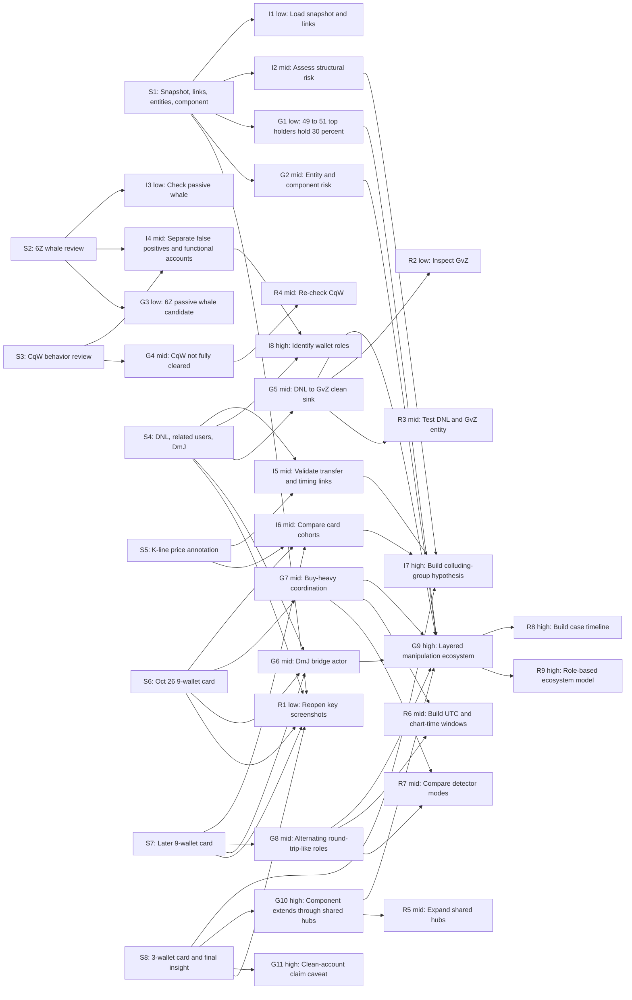

# Trace Step Map

## Purpose

This file maps the trace evidence in `session.json` and `images/` to user intentions, insights, and recommendations. It complements `analysis-report.md` by making the reasoning chain explicit.

The representation uses compact analytical step nodes rather than one node per raw UI action. This keeps the graph readable while preserving action indices, annotation IDs, screenshots, selected users, and selected card cohorts.

## Step Nodes

| Step | Evidence | What Happened | Why It Matters |
|---|---|---|---|
| S1 | Actions 0-2; annotations 0, 1, 2, 3; screenshots `images/annotation-0000-token_distribution.png`, `images/annotation-0001-token_distribution.png`, `images/annotation-0002-token_distribution.png` | User loaded ACT snapshot `2024-11-09 23:00:00 UTC`, toggled links, and annotated centralization, red suspicious nodes, entity groups, and a connected component. | Establishes the initial system-level manipulation-risk question. |
| S2 | Action 3; annotations 4, 5; screenshots `images/annotation-0004-token_distribution.png`, `images/annotation-0005-behavior_details.png`; selected user `6Z6RJJGrmVyndcPyTFhmLYHkHttiYtTccKpXFV9r2237` | User selected the largest whale and concluded it was not a manipulator because its balance came from transfers. | Shows the user is classifying roles rather than assuming all whales are malicious. |
| S3 | Actions 4-6; annotations 6, 7; screenshots `images/action-0005-target-behavior_details-01.png`, `images/action-0007-source-behavior_details-01.png`; selected user `CqWVLXaj8r6vud5SfFr81SzmFoqXa5daLi1WbpQZxuhV` | User selected CqW, zoomed Behavior Details, toggled Sequential Time, and judged the same-direction alert as likely normal accumulation. | Establishes a false-positive review path and a caveat that single-window behavior can look benign. |
| S4 | Actions 7-11; annotations 8, 9, 10; screenshots `images/action-0009-source-behavior_details-01.png`, `images/annotation-0009-behavior_details.png`, `images/annotation-0010-behavior_details.png`; selected users `DNLFULTWBTkpfwpXZeMA7ckMbQntHuLqxZq6RH6xnaji`, `DmJRzwcmFFFKhJ5dSJuSU3Lns4bfiMb8b1V3vhJG7uLH` | User selected DNL, enabled related users, then selected DmJ from Behavior Details. The annotations identify DNL as a functional account and mark transfers to a normal-looking account. | Provides concrete transfer and role evidence. |
| S5 | Action 12; annotation 12; screenshot `images/annotation-0012-candlestick_chart.png` | User scrolled K-line manipulation cards and annotated the price region, stating that the behavior affected price. | Bridges wallet behavior to market movement. |
| S6 | Actions 13-15; annotation 13; screenshots `images/action-0014-source-kline_chart-01.png`, `images/action-0014-target-behavior_details-01.png`, `images/annotation-0013-behavior_details.png`; selected card users: `5RA23pdRqxPHjGZT9kUCdywx5QgQ3NFo5NXiNSsCCVEz`, `CqWVLXaj8r6vud5SfFr81SzmFoqXa5daLi1WbpQZxuhV`, `5WF1V6TBDHxrZvPhh6doyE5ZEb8BaFFgqg7wR81zmZEw`, `DmJRzwcmFFFKhJ5dSJuSU3Lns4bfiMb8b1V3vhJG7uLH`, `35NoW8F4Q3Gcqf3Wf4RMmoAgS7FHchCjv3R2F241zuPQ`, `22JYebQtQSLchTXiRJVCx7hpPamN1YzLJKHET52S6eBm`, `EnMAi9raXU8KMBP3YLKAsLL1EnucWrggtBAxZAsmLBZ3`, `BgBmwgMG1cRQxHKkgYd42Gz8rpXtSNcnqgazWGPfdDon`, `5YPynSvVjWB6EQeFNg3WiKoGsm7J9doxpBY3sVMy1xYv` | User clicked a 9-user same-direction card and annotated the Oct 26 cluster as frequent same-direction buying after DmJ sold. | Strongest multi-wallet same-direction evidence in the session. |
| S7 | Actions 16-20; annotations 14, 15; screenshots `images/action-0017-target-behavior_details-01.png`, `images/annotation-0014-behavior_details.png`, `images/annotation-0015-behavior_details.png`; selected card users: `7SmhQ9r2TLLgS5cmWoFSVGZZw7sEySmZXzwBVscrc7qb`, `DmJRzwcmFFFKhJ5dSJuSU3Lns4bfiMb8b1V3vhJG7uLH`, `2brzD1rU8m71zf23bfgtw3vn9pqZG2CDxYU3nQ5pPizN`, `XiXRAfbXGgNsZw2hwPdqBsU461kXFfYgTMV8sgjRSvN`, `85TMiRBoDjZiFjHUwrrBkqZDh4o3SHMPtgbDXM7N7Qff`, `DNLFULTWBTkpfwpXZeMA7ckMbQntHuLqxZq6RH6xnaji`, `5YPynSvVjWB6EQeFNg3WiKoGsm7J9doxpBY3sVMy1xYv`, `ErAJGcJTEUqa11ag1MxLWZjqoqzgTtZKJk9cQiN9T3ZU`, `Eu4DNnkPbV9kMj81FwaZMHPqAHsBAVrwbtjGfKdRhVzh` | User clicked another 9-user card, toggled Sequential Time, zoomed event order, and annotated alternating same-direction buys and sells as round-trip-like. | Shows that the suspected campaign includes multiple behavior modes, not only accumulation. |
| S8 | Actions 21-23; annotations 17, 18, 19; screenshots `images/action-0022-source-kline_chart-01.png`, `images/action-0022-target-behavior_details-01.png`, `images/annotation-0017-behavior_details.png`, `images/annotation-0019-token_distribution.png`; selected card users: `7SmhQ9r2TLLgS5cmWoFSVGZZw7sEySmZXzwBVscrc7qb`, `DmJRzwcmFFFKhJ5dSJuSU3Lns4bfiMb8b1V3vhJG7uLH`, `GCDEuA5Q6KugDcN5wxnorwkeSrMYiPJse24pDfFbLZXz` | User clicked a 3-user card, annotated that the three addresses are in one connected component, then created a high-level insight that selected addresses form a large colluding group. | Final synthesis step that combines graph, behavior, transfer, and card evidence. |

## Intention Nodes

| ID | Level | Intention | Confidence |
|---|---|---|---|
| I1 | Low | Load the ACT snapshot and inspect links in Token Distribution. | Direct evidence |
| I2 | Mid | Assess manipulation risk from concentration, suspicious node styling, entities, and links. | Direct evidence |
| I3 | Low | Check whether the top whale `6Z6...r2237` is passive or manipulative. | Direct evidence |
| I4 | Mid | Separate false positives from functional accounts inside the suspicious structure. | Strong inference |
| I5 | Mid | Validate whether DNL, DmJ, and related wallets are connected through transfers and similar trading periods. | Strong inference |
| I6 | Mid | Compare multiple manipulation-card cohorts for repeated wallets and behavior patterns. | Strong inference |
| I7 | High | Build a large colluding-group hypothesis from graph, behavior, transfer, and card evidence. | Direct evidence |
| I8 | High | Identify different roles inside the suspected group rather than treating all wallets as identical. | Strong inference |

## Insight Nodes

| ID | Level | Insight | Confidence |
|---|---|---|---|
| G1 | Low | About 49 to 51 top holders account for 30 percent of user-held ACT at the late snapshot. | Direct evidence plus local validation |
| G2 | Mid | The Token Distribution graph suggests a structured risk pattern with entities and a connected component. | Direct evidence |
| G3 | Low | `6Z6...r2237` is a passive whale candidate with no local trade records. | Local validation |
| G4 | Mid | CqW's viewed same-direction alert may be a false positive, but broader transfer-neighbor context prevents fully clearing it. | Mixed evidence |
| G5 | Mid | DNL likely serves as a functional buyer and transfer-out wallet, while GvZ acts as a clean-looking sink. | Strong local validation |
| G6 | Mid | DmJ is a bridge actor because it appears in all three clicked card cohorts. | Direct evidence plus local validation |
| G7 | Mid | The Oct 26 9-wallet card is buy-heavy and consistent with coordinated accumulation. | Strong inference |
| G8 | Mid | The later 9-wallet card is mixed and round-trip-like, with alternating buy and sell roles. | Strong inference |
| G9 | High | The strongest narrative is a layered manipulation ecosystem with different wallet roles. | Strong inference |
| G10 | High | The suspected component likely extends beyond clicked wallets through shared transfer-neighbor hubs. | Local validation, needs follow-up |
| G11 | High | The broad "clean-looking accounts are intentional" claim is proven for DNL to GvZ but remains a hypothesis for other entities. | Caveated inference |

## Recommendation Nodes

| ID | Level | Recommendation | Expected Evidence |
|---|---|---|---|
| R1 | Low | Reopen key screenshots `annotation-0009`, `annotation-0013`, `annotation-0014`, and `annotation-0019`. | Visual evidence for transfers, same-direction buying, alternating clusters, and graph component membership. |
| R2 | Low | Inspect GvZ in Behavior Details. | Confirmation that it is a passive storage wallet after receiving DNL transfers. |
| R3 | Mid | Treat DNL and GvZ as a candidate entity and test network-based entity detection. | Whether direct-transfer grouping catches the functional-buyer and clean-sink relationship. |
| R4 | Mid | Re-check CqW with related users and shared transfer-neighbor data before clearing it. | Whether CqW is benign accumulation or part of broader infrastructure. |
| R5 | Mid | Expand the transfer component around `5Q544f...ge4j1`, `BQ72n...GQDV`, `7tPwv...QVzK`, `7NoYC...g9e9`, and `CapuX...LVps`. | Whether these hubs are controllers, routing wallets, funding sources, or benign infrastructure. |
| R6 | Mid | Build UTC and chart-time versions of each card window. | Exact active users, trade direction, notional, and price-return validation without time-display ambiguity. |
| R7 | Mid | Compare entity-based and non-entity-based manipulation results for the A, B, and C cohorts. | Which wallets are individually suspicious and which only become suspicious when grouped. |
| R8 | High | Build a case timeline from `2024-10-24` to `2024-11-03` centered on DmJ, DNL, GvZ, 5YP, 7Sm, XiX, Eu4, and GCDE. | A defensible sequence of accumulation, transfer-out, price movement, and alternating trade behavior. |
| R9 | High | Model the suspected component as a role-based ecosystem, not a flat colluder list. | Cleaner distinction between passive whales, sinks, bridges, buyers, and round-trip-like traders. |

## Traceability Matrix

| Step | Intentions | Insights | Recommendations | Rationale |
|---|---|---|---|---|
| S1 | I1, I2, I7 | G1, G2 | R1, R9 | The initial graph annotations motivate the whole manipulation-risk inquiry and later colluding-group framing. |
| S2 | I3, I4, I8 | G3, G9 | R9 | The passive-whale review forces role separation and prevents overgeneralizing every whale as a manipulator. |
| S3 | I4, I8 | G4 | R4, R9 | The user treated CqW as likely normal from behavior, but local shared-neighbor evidence makes it a caveated role. |
| S4 | I5, I8 | G5, G6, G9 | R1, R2, R3, R8, R9 | DNL to GvZ and DmJ's related behavior supply the strongest role-specific evidence. |
| S5 | I5, I6 | G7, G8 | R6, R8 | The K-line annotation links detected behavior to price movement and requires exact window validation. |
| S6 | I6, I7, I8 | G6, G7, G9 | R6, R7, R8, R9 | The A cohort is a multi-wallet buy-heavy event, and DmJ links it to other evidence. |
| S7 | I6, I7, I8 | G6, G8, G9 | R6, R7, R8, R9 | The B cohort adds alternating buy/sell roles and repeated wallets, broadening the campaign model. |
| S8 | I6, I7 | G6, G9, G10, G11 | R1, R5, R8, R9 | The final insight explicitly combines earlier annotations into a large colluding-component hypothesis. |

## Claim-Traceability Graph

## How To Read The Graph

The strongest reasoning path is:

`S4 -> G5 -> G9 -> R8/R9`

This path is strong because it has direct transfer evidence, local validation, and clear role implications.

The second strongest path is:

`S6 + S7 + S8 -> G6/G7/G8/G10 -> G9 -> R8`

This path is strong because repeated wallets connect multiple card cohorts, and the final user-authored insight explicitly aggregates earlier annotations.

The weakest path is:

`S1 -> G11`

The graph shows why this remains caveated. The user's broad clean-looking-account hypothesis is plausible, but only DNL to GvZ has direct, high-confidence transfer proof in this analysis.

## Trace Gaps And Follow-Up Suggestions

- The trace does not store exact manipulation-card time windows in `actionInfo`, only card users. Future exports should include card type, label, exact time span, detected amount, and whether the clicked card is Round Trip or Same Direction.
- Time-window validation is currently sensitive to chart-time versus raw UTC interpretation. Future trace analysis should compute both versions when screenshots are the only source of card timestamps.
- The user did not create a final note on CqW after local or related-user validation. It should remain a caveated false-positive candidate, not a cleared account.
- UI component membership should be exported as structured data. Screenshots show component membership visually, but local post-analysis has to approximate it through transfer neighbors and selected users.
