# User Reasoning Forest

This file is mechanically generated from `reasoning-graph.json`. Each tree is rooted at one Hypothesis. Shared canonical nodes are duplicated into tree node instances, and each duplicate keeps its `canonicalId`.

## Tree 1: H1

ACT has high manipulation risk from concentrated, suspicious, connected holders

| Instance ID | Canonical ID | Parent | Relation | Kind | Scope | Salience | Confidence | Label |
|---|---|---|---|---|---|---|---|---|
| H1 | H1 |  |  | Hypothesis | High |  | Strong user-authored inference | ACT has high manipulation risk from concentrated, suspicious, connected holders |
| IN1@H1.1 | IN1 | H1 | supports | Insight | High |  | Direct user-authored Insight | A small number of whales control most circulating supply while retail is peripheral |
| F2@H1.1.1 | F2 | IN1@H1.1 | supports | Finding | Low |  | Direct user annotation | About 51 holders control 30 percent of supply and many are suspicious |
| AA1@H1.1.1.1 | AA1 | F2@H1.1.1 | produces | AnalyticActivity | Mid |  | Direct evidence | Inspect Token Distribution concentration, entities, and links |
| I0@H1.1.1.1.1 | I0 | AA1@H1.1.1.1 | contains | Interaction | Low | primary | Direct evidence | Update ACT snapshot at 2024-11-09 23:00:00 UTC |
| I2@H1.1.1.1.2 | I2 | AA1@H1.1.1.1 | contains | Interaction | Low | primary | Direct evidence | Toggle Token Distribution links on |
| I1@H1.1.1.1.3 | I1 | AA1@H1.1.1.1 | contains | Interaction | Low | supporting | Direct evidence | Toggle Token Distribution links off |
| F3@H1.1.2 | F3 | IN1@H1.1 | supports | Finding | Mid |  | Direct user annotation | Three entity groups and a connected component are visible |
| AA1@H1.1.2.1 | AA1 | F3@H1.1.2 | produces | AnalyticActivity | Mid |  | Direct evidence | Inspect Token Distribution concentration, entities, and links |
| I0@H1.1.2.1.1 | I0 | AA1@H1.1.2.1 | contains | Interaction | Low | primary | Direct evidence | Update ACT snapshot at 2024-11-09 23:00:00 UTC |
| I2@H1.1.2.1.2 | I2 | AA1@H1.1.2.1 | contains | Interaction | Low | primary | Direct evidence | Toggle Token Distribution links on |
| I1@H1.1.2.1.3 | I1 | AA1@H1.1.2.1 | contains | Interaction | Low | supporting | Direct evidence | Toggle Token Distribution links off |
| AQ1@H1.2 | AQ1 | H1 | contains | AnalyticQuestion | Mid |  | Strong inference | Is ACT holder distribution concentrated and connected enough to signal manipulation risk? |
| F1@H1.2.1 | F1 | AQ1@H1.2 | supports | Finding | Low |  | Direct evidence | Snapshot and detector outputs were loaded for ACT at 2024-11-09 23:00:00 UTC |
| AA1@H1.2.1.1 | AA1 | F1@H1.2.1 | produces | AnalyticActivity | Mid |  | Direct evidence | Inspect Token Distribution concentration, entities, and links |
| I0@H1.2.1.1.1 | I0 | AA1@H1.2.1.1 | contains | Interaction | Low | primary | Direct evidence | Update ACT snapshot at 2024-11-09 23:00:00 UTC |
| I2@H1.2.1.1.2 | I2 | AA1@H1.2.1.1 | contains | Interaction | Low | primary | Direct evidence | Toggle Token Distribution links on |
| I1@H1.2.1.1.3 | I1 | AA1@H1.2.1.1 | contains | Interaction | Low | supporting | Direct evidence | Toggle Token Distribution links off |
| AA1@H1.2.2 | AA1 | AQ1@H1.2 | motivates | AnalyticActivity | Mid |  | Direct evidence | Inspect Token Distribution concentration, entities, and links |
| I0@H1.2.2.1 | I0 | AA1@H1.2.2 | contains | Interaction | Low | primary | Direct evidence | Update ACT snapshot at 2024-11-09 23:00:00 UTC |
| I2@H1.2.2.2 | I2 | AA1@H1.2.2 | contains | Interaction | Low | primary | Direct evidence | Toggle Token Distribution links on |
| I1@H1.2.2.3 | I1 | AA1@H1.2.2 | contains | Interaction | Low | supporting | Direct evidence | Toggle Token Distribution links off |
| T1@H1.3 | T1 | H1 | contains | Task | Low |  | Direct evidence | Configure the ACT snapshot and inspect links |
| I0@H1.3.1 | I0 | T1@H1.3 | motivates | Interaction | Low | primary | Direct evidence | Update ACT snapshot at 2024-11-09 23:00:00 UTC |
| I2@H1.3.2 | I2 | T1@H1.3 | motivates | Interaction | Low | primary | Direct evidence | Toggle Token Distribution links on |
| I1@H1.3.3 | I1 | T1@H1.3 | motivates | Interaction | Low | supporting | Direct evidence | Toggle Token Distribution links off |
| IS1@H1.4 | IS1 | H1 | motivates | InvestigationStrategy | High |  | Strong inference | Build an initial structural risk case from Token Distribution |
| AA1@H1.4.1 | AA1 | IS1@H1.4 | contains | AnalyticActivity | Mid |  | Direct evidence | Inspect Token Distribution concentration, entities, and links |
| I0@H1.4.1.1 | I0 | AA1@H1.4.1 | contains | Interaction | Low | primary | Direct evidence | Update ACT snapshot at 2024-11-09 23:00:00 UTC |
| I2@H1.4.1.2 | I2 | AA1@H1.4.1 | contains | Interaction | Low | primary | Direct evidence | Toggle Token Distribution links on |
| I1@H1.4.1.3 | I1 | AA1@H1.4.1 | contains | Interaction | Low | supporting | Direct evidence | Toggle Token Distribution links off |

```mermaid
flowchart BT
  n_H1["Hypothesis\\nACT has high manipulation risk from concentrated, suspicious, connected holders\\nStrong user-authored inference"]
  n_IN1_H1_1["Insight\\nA small number of whales control most circulating supply while retail is peripheral\\nDirect user-authored Insight"]
  n_F2_H1_1_1["Finding\\nAbout 51 holders control 30 percent of supply and many are suspicious\\nDirect user annotation"]
  n_AA1_H1_1_1_1["AnalyticActivity\\nVisual Analysis\\nInspect Token Distribution concentration, entities, and links\\nDirect evidence"]
  n_I0_H1_1_1_1_1["Interaction\\nsalience: primary\\nModel Action\\nUpdate ACT snapshot at 2024-11-09 23:00:00 UTC\\nDirect evidence"]
  n_I2_H1_1_1_1_2["Interaction\\nsalience: primary\\nVisualization Action\\nToggle Token Distribution links on\\nDirect evidence"]
  n_I1_H1_1_1_1_3["Interaction\\nsalience: supporting\\nVisualization Action\\nToggle Token Distribution links off\\nDirect evidence"]
  n_F3_H1_1_2["Finding\\nThree entity groups and a connected component are visible\\nDirect user annotation"]
  n_AA1_H1_1_2_1["AnalyticActivity\\nVisual Analysis\\nInspect Token Distribution concentration, entities, and links\\nDirect evidence"]
  n_I0_H1_1_2_1_1["Interaction\\nsalience: primary\\nModel Action\\nUpdate ACT snapshot at 2024-11-09 23:00:00 UTC\\nDirect evidence"]
  n_I2_H1_1_2_1_2["Interaction\\nsalience: primary\\nVisualization Action\\nToggle Token Distribution links on\\nDirect evidence"]
  n_I1_H1_1_2_1_3["Interaction\\nsalience: supporting\\nVisualization Action\\nToggle Token Distribution links off\\nDirect evidence"]
  n_AQ1_H1_2["AnalyticQuestion\\nIs ACT holder distribution concentrated and connected enough to signal manipulation risk?\\nStrong inference"]
  n_F1_H1_2_1["Finding\\nSnapshot and detector outputs were loaded for ACT at 2024-11-09 23:00:00 UTC\\nDirect evidence"]
  n_AA1_H1_2_1_1["AnalyticActivity\\nVisual Analysis\\nInspect Token Distribution concentration, entities, and links\\nDirect evidence"]
  n_I0_H1_2_1_1_1["Interaction\\nsalience: primary\\nModel Action\\nUpdate ACT snapshot at 2024-11-09 23:00:00 UTC\\nDirect evidence"]
  n_I2_H1_2_1_1_2["Interaction\\nsalience: primary\\nVisualization Action\\nToggle Token Distribution links on\\nDirect evidence"]
  n_I1_H1_2_1_1_3["Interaction\\nsalience: supporting\\nVisualization Action\\nToggle Token Distribution links off\\nDirect evidence"]
  n_AA1_H1_2_2["AnalyticActivity\\nVisual Analysis\\nInspect Token Distribution concentration, entities, and links\\nDirect evidence"]
  n_I0_H1_2_2_1["Interaction\\nsalience: primary\\nModel Action\\nUpdate ACT snapshot at 2024-11-09 23:00:00 UTC\\nDirect evidence"]
  n_I2_H1_2_2_2["Interaction\\nsalience: primary\\nVisualization Action\\nToggle Token Distribution links on\\nDirect evidence"]
  n_I1_H1_2_2_3["Interaction\\nsalience: supporting\\nVisualization Action\\nToggle Token Distribution links off\\nDirect evidence"]
  n_T1_H1_3["Task\\nConfigure the ACT snapshot and inspect links\\nDirect evidence"]
  n_I0_H1_3_1["Interaction\\nsalience: primary\\nModel Action\\nUpdate ACT snapshot at 2024-11-09 23:00:00 UTC\\nDirect evidence"]
  n_I2_H1_3_2["Interaction\\nsalience: primary\\nVisualization Action\\nToggle Token Distribution links on\\nDirect evidence"]
  n_I1_H1_3_3["Interaction\\nsalience: supporting\\nVisualization Action\\nToggle Token Distribution links off\\nDirect evidence"]
  n_IS1_H1_4["InvestigationStrategy\\nBuild an initial structural risk case from Token Distribution\\nStrong inference"]
  n_AA1_H1_4_1["AnalyticActivity\\nVisual Analysis\\nInspect Token Distribution concentration, entities, and links\\nDirect evidence"]
  n_I0_H1_4_1_1["Interaction\\nsalience: primary\\nModel Action\\nUpdate ACT snapshot at 2024-11-09 23:00:00 UTC\\nDirect evidence"]
  n_I2_H1_4_1_2["Interaction\\nsalience: primary\\nVisualization Action\\nToggle Token Distribution links on\\nDirect evidence"]
  n_I1_H1_4_1_3["Interaction\\nsalience: supporting\\nVisualization Action\\nToggle Token Distribution links off\\nDirect evidence"]
  n_IN1_H1_1 -->|supports| n_H1
  n_F2_H1_1_1 -->|supports| n_IN1_H1_1
  n_AA1_H1_1_1_1 -->|produces| n_F2_H1_1_1
  n_I0_H1_1_1_1_1 -->|contains| n_AA1_H1_1_1_1
  n_I2_H1_1_1_1_2 -->|contains| n_AA1_H1_1_1_1
  n_I1_H1_1_1_1_3 -->|contains| n_AA1_H1_1_1_1
  n_F3_H1_1_2 -->|supports| n_IN1_H1_1
  n_AA1_H1_1_2_1 -->|produces| n_F3_H1_1_2
  n_I0_H1_1_2_1_1 -->|contains| n_AA1_H1_1_2_1
  n_I2_H1_1_2_1_2 -->|contains| n_AA1_H1_1_2_1
  n_I1_H1_1_2_1_3 -->|contains| n_AA1_H1_1_2_1
  n_AQ1_H1_2 -->|contains| n_H1
  n_F1_H1_2_1 -->|supports| n_AQ1_H1_2
  n_AA1_H1_2_1_1 -->|produces| n_F1_H1_2_1
  n_I0_H1_2_1_1_1 -->|contains| n_AA1_H1_2_1_1
  n_I2_H1_2_1_1_2 -->|contains| n_AA1_H1_2_1_1
  n_I1_H1_2_1_1_3 -->|contains| n_AA1_H1_2_1_1
  n_AA1_H1_2_2 -->|motivates| n_AQ1_H1_2
  n_I0_H1_2_2_1 -->|contains| n_AA1_H1_2_2
  n_I2_H1_2_2_2 -->|contains| n_AA1_H1_2_2
  n_I1_H1_2_2_3 -->|contains| n_AA1_H1_2_2
  n_T1_H1_3 -->|contains| n_H1
  n_I0_H1_3_1 -->|motivates| n_T1_H1_3
  n_I2_H1_3_2 -->|motivates| n_T1_H1_3
  n_I1_H1_3_3 -->|motivates| n_T1_H1_3
  n_IS1_H1_4 -->|motivates| n_H1
  n_AA1_H1_4_1 -->|contains| n_IS1_H1_4
  n_I0_H1_4_1_1 -->|contains| n_AA1_H1_4_1
  n_I2_H1_4_1_2 -->|contains| n_AA1_H1_4_1
  n_I1_H1_4_1_3 -->|contains| n_AA1_H1_4_1
```

## Tree 2: H2

Suspicious status alone is insufficient because selected wallet roles differ

| Instance ID | Canonical ID | Parent | Relation | Kind | Scope | Salience | Confidence | Label |
|---|---|---|---|---|---|---|---|---|
| H2 | H2 |  |  | Hypothesis | High |  | Analyst reconstruction | Suspicious status alone is insufficient because selected wallet roles differ |
| IN3@H2.1 | IN3 | H2 | supports | Insight | High |  | Analyst inference | The trace supports role differentiation rather than a blanket red-node-equals-manipulator rule |
| F4@H2.1.1 | F4 | IN3@H2.1 | supports | Finding | Low |  | Direct user annotation | 6Z6R...2237 is a whale but not visibly manipulative |
| AA2@H2.1.1.1 | AA2 | F4@H2.1.1 | produces | AnalyticActivity | Mid |  | Direct evidence | Inspect whale and accumulator behavior timelines |
| I3@H2.1.1.1.1 | I3 | AA2@H2.1.1.1 | contains | Interaction | Low | primary | Direct evidence | Select wallet 6Z6R...2237 from Token Distribution |
| I4@H2.1.1.1.2 | I4 | AA2@H2.1.1.1 | contains | Interaction | Low | primary | Direct evidence | Select wallet CqW...xuhV from Token Distribution |
| I5@H2.1.1.1.3 | I5 | AA2@H2.1.1.1 | contains | Interaction | Low | primary | Direct evidence | Zoom Behavior Details for CqW...xuhV to Oct 26 to Oct 27 |
| I6@H2.1.1.1.4 | I6 | AA2@H2.1.1.1 | contains | Interaction | Low | supporting | Direct evidence | Enable Sequential Time for CqW...xuhV |
| F5@H2.1.2 | F5 | IN3@H2.1 | supports | Finding | Low |  | Direct user annotation | CqW...xuhV looks like a normal accumulator despite same-direction detection |
| AA2@H2.1.2.1 | AA2 | F5@H2.1.2 | produces | AnalyticActivity | Mid |  | Direct evidence | Inspect whale and accumulator behavior timelines |
| I3@H2.1.2.1.1 | I3 | AA2@H2.1.2.1 | contains | Interaction | Low | primary | Direct evidence | Select wallet 6Z6R...2237 from Token Distribution |
| I4@H2.1.2.1.2 | I4 | AA2@H2.1.2.1 | contains | Interaction | Low | primary | Direct evidence | Select wallet CqW...xuhV from Token Distribution |
| I5@H2.1.2.1.3 | I5 | AA2@H2.1.2.1 | contains | Interaction | Low | primary | Direct evidence | Zoom Behavior Details for CqW...xuhV to Oct 26 to Oct 27 |
| I6@H2.1.2.1.4 | I6 | AA2@H2.1.2.1 | contains | Interaction | Low | supporting | Direct evidence | Enable Sequential Time for CqW...xuhV |
| F6@H2.1.3 | F6 | IN3@H2.1 | supports | Finding | Mid |  | Direct user annotation with role inference | DNL...naji appears to be a functional account with transfer-out behavior |
| AA3@H2.1.3.1 | AA3 | F6@H2.1.3 | produces | AnalyticActivity | Mid |  | Direct evidence | Inspect related users and transfer-linked behavior |
| I7@H2.1.3.1.1 | I7 | AA3@H2.1.3.1 | contains | Interaction | Low | primary | Direct evidence | Select wallet DNL...naji from Token Distribution |
| I8@H2.1.3.1.2 | I8 | AA3@H2.1.3.1 | contains | Interaction | Low | primary | Direct evidence | Enable Show Related Users for DNL...naji |
| I9@H2.1.3.1.3 | I9 | AA3@H2.1.3.1 | contains | Interaction | Low | primary | Direct evidence | Select DmJ...7uLH from Behavior Details |
| I10@H2.1.3.1.4 | I10 | AA3@H2.1.3.1 | contains | Interaction | Low | supporting | Direct evidence | Enable Show Related Users for DmJ...7uLH |
| I11@H2.1.3.1.5 | I11 | AA3@H2.1.3.1 | contains | Interaction | Low | low | Direct evidence | Hover Behavior Details user label DmJ...7uLH |
| F7@H2.1.4 | F7 | IN3@H2.1 | supports | Finding | Mid |  | Direct user annotation | Similar buying around DmJ...7uLH coincided with a visible price effect |
| AA3@H2.1.4.1 | AA3 | F7@H2.1.4 | produces | AnalyticActivity | Mid |  | Direct evidence | Inspect related users and transfer-linked behavior |
| I7@H2.1.4.1.1 | I7 | AA3@H2.1.4.1 | contains | Interaction | Low | primary | Direct evidence | Select wallet DNL...naji from Token Distribution |
| I8@H2.1.4.1.2 | I8 | AA3@H2.1.4.1 | contains | Interaction | Low | primary | Direct evidence | Enable Show Related Users for DNL...naji |
| I9@H2.1.4.1.3 | I9 | AA3@H2.1.4.1 | contains | Interaction | Low | primary | Direct evidence | Select DmJ...7uLH from Behavior Details |
| I10@H2.1.4.1.4 | I10 | AA3@H2.1.4.1 | contains | Interaction | Low | supporting | Direct evidence | Enable Show Related Users for DmJ...7uLH |
| I11@H2.1.4.1.5 | I11 | AA3@H2.1.4.1 | contains | Interaction | Low | low | Direct evidence | Hover Behavior Details user label DmJ...7uLH |
| AQ2@H2.2 | AQ2 | H2 | contains | AnalyticQuestion | Mid |  | Strong inference | Which selected wallets are passive, normal accumulators, functional accounts, or manipulators? |
| AA2@H2.2.1 | AA2 | AQ2@H2.2 | motivates | AnalyticActivity | Mid |  | Direct evidence | Inspect whale and accumulator behavior timelines |
| I3@H2.2.1.1 | I3 | AA2@H2.2.1 | contains | Interaction | Low | primary | Direct evidence | Select wallet 6Z6R...2237 from Token Distribution |
| I4@H2.2.1.2 | I4 | AA2@H2.2.1 | contains | Interaction | Low | primary | Direct evidence | Select wallet CqW...xuhV from Token Distribution |
| I5@H2.2.1.3 | I5 | AA2@H2.2.1 | contains | Interaction | Low | primary | Direct evidence | Zoom Behavior Details for CqW...xuhV to Oct 26 to Oct 27 |
| I6@H2.2.1.4 | I6 | AA2@H2.2.1 | contains | Interaction | Low | supporting | Direct evidence | Enable Sequential Time for CqW...xuhV |
| AA3@H2.2.2 | AA3 | AQ2@H2.2 | motivates | AnalyticActivity | Mid |  | Direct evidence | Inspect related users and transfer-linked behavior |
| I7@H2.2.2.1 | I7 | AA3@H2.2.2 | contains | Interaction | Low | primary | Direct evidence | Select wallet DNL...naji from Token Distribution |
| I8@H2.2.2.2 | I8 | AA3@H2.2.2 | contains | Interaction | Low | primary | Direct evidence | Enable Show Related Users for DNL...naji |
| I9@H2.2.2.3 | I9 | AA3@H2.2.2 | contains | Interaction | Low | primary | Direct evidence | Select DmJ...7uLH from Behavior Details |
| I10@H2.2.2.4 | I10 | AA3@H2.2.2 | contains | Interaction | Low | supporting | Direct evidence | Enable Show Related Users for DmJ...7uLH |
| I11@H2.2.2.5 | I11 | AA3@H2.2.2 | contains | Interaction | Low | low | Direct evidence | Hover Behavior Details user label DmJ...7uLH |
| T2@H2.3 | T2 | H2 | contains | Task | Low |  | Direct evidence | Select large or suspicious wallets and inspect Behavior Details |
| I3@H2.3.1 | I3 | T2@H2.3 | motivates | Interaction | Low | primary | Direct evidence | Select wallet 6Z6R...2237 from Token Distribution |
| I4@H2.3.2 | I4 | T2@H2.3 | motivates | Interaction | Low | primary | Direct evidence | Select wallet CqW...xuhV from Token Distribution |
| I5@H2.3.3 | I5 | T2@H2.3 | motivates | Interaction | Low | primary | Direct evidence | Zoom Behavior Details for CqW...xuhV to Oct 26 to Oct 27 |
| I6@H2.3.4 | I6 | T2@H2.3 | motivates | Interaction | Low | supporting | Direct evidence | Enable Sequential Time for CqW...xuhV |
| T3@H2.4 | T3 | H2 | contains | Task | Low |  | Direct evidence | Inspect related users and transfer behavior |
| I7@H2.4.1 | I7 | T3@H2.4 | motivates | Interaction | Low | primary | Direct evidence | Select wallet DNL...naji from Token Distribution |
| I8@H2.4.2 | I8 | T3@H2.4 | motivates | Interaction | Low | primary | Direct evidence | Enable Show Related Users for DNL...naji |
| I9@H2.4.3 | I9 | T3@H2.4 | motivates | Interaction | Low | primary | Direct evidence | Select DmJ...7uLH from Behavior Details |
| I10@H2.4.4 | I10 | T3@H2.4 | motivates | Interaction | Low | supporting | Direct evidence | Enable Show Related Users for DmJ...7uLH |
| I11@H2.4.5 | I11 | T3@H2.4 | motivates | Interaction | Low | low | Direct evidence | Hover Behavior Details user label DmJ...7uLH |
| IS2@H2.5 | IS2 | H2 | motivates | InvestigationStrategy | High |  | Strong inference | Differentiate wallet roles through Behavior Details |
| AA2@H2.5.1 | AA2 | IS2@H2.5 | contains | AnalyticActivity | Mid |  | Direct evidence | Inspect whale and accumulator behavior timelines |
| I3@H2.5.1.1 | I3 | AA2@H2.5.1 | contains | Interaction | Low | primary | Direct evidence | Select wallet 6Z6R...2237 from Token Distribution |
| I4@H2.5.1.2 | I4 | AA2@H2.5.1 | contains | Interaction | Low | primary | Direct evidence | Select wallet CqW...xuhV from Token Distribution |
| I5@H2.5.1.3 | I5 | AA2@H2.5.1 | contains | Interaction | Low | primary | Direct evidence | Zoom Behavior Details for CqW...xuhV to Oct 26 to Oct 27 |
| I6@H2.5.1.4 | I6 | AA2@H2.5.1 | contains | Interaction | Low | supporting | Direct evidence | Enable Sequential Time for CqW...xuhV |
| AA3@H2.5.2 | AA3 | IS2@H2.5 | contains | AnalyticActivity | Mid |  | Direct evidence | Inspect related users and transfer-linked behavior |
| I7@H2.5.2.1 | I7 | AA3@H2.5.2 | contains | Interaction | Low | primary | Direct evidence | Select wallet DNL...naji from Token Distribution |
| I8@H2.5.2.2 | I8 | AA3@H2.5.2 | contains | Interaction | Low | primary | Direct evidence | Enable Show Related Users for DNL...naji |
| I9@H2.5.2.3 | I9 | AA3@H2.5.2 | contains | Interaction | Low | primary | Direct evidence | Select DmJ...7uLH from Behavior Details |
| I10@H2.5.2.4 | I10 | AA3@H2.5.2 | contains | Interaction | Low | supporting | Direct evidence | Enable Show Related Users for DmJ...7uLH |
| I11@H2.5.2.5 | I11 | AA3@H2.5.2 | contains | Interaction | Low | low | Direct evidence | Hover Behavior Details user label DmJ...7uLH |

```mermaid
flowchart BT
  n_H2["Hypothesis\\nSuspicious status alone is insufficient because selected wallet roles differ\\nAnalyst reconstruction"]
  n_IN3_H2_1["Insight\\nThe trace supports role differentiation rather than a blanket red-node-equals-manipulator rule\\nAnalyst inference"]
  n_F4_H2_1_1["Finding\\n6Z6R...2237 is a whale but not visibly manipulative\\nDirect user annotation"]
  n_AA2_H2_1_1_1["AnalyticActivity\\nVisual Analysis\\nInspect whale and accumulator behavior timelines\\nDirect evidence"]
  n_I3_H2_1_1_1_1["Interaction\\nsalience: primary\\nVisualization Action\\nSelect wallet 6Z6R...2237 from Token Distribution\\nDirect evidence"]
  n_I4_H2_1_1_1_2["Interaction\\nsalience: primary\\nVisualization Action\\nSelect wallet CqW...xuhV from Token Distribution\\nDirect evidence"]
  n_I5_H2_1_1_1_3["Interaction\\nsalience: primary\\nVisualization Action\\nZoom Behavior Details for CqW...xuhV to Oct 26 to Oct 27\\nDirect evidence"]
  n_I6_H2_1_1_1_4["Interaction\\nsalience: supporting\\nVisualization Action\\nEnable Sequential Time for CqW...xuhV\\nDirect evidence"]
  n_F5_H2_1_2["Finding\\nCqW...xuhV looks like a normal accumulator despite same-direction detection\\nDirect user annotation"]
  n_AA2_H2_1_2_1["AnalyticActivity\\nVisual Analysis\\nInspect whale and accumulator behavior timelines\\nDirect evidence"]
  n_I3_H2_1_2_1_1["Interaction\\nsalience: primary\\nVisualization Action\\nSelect wallet 6Z6R...2237 from Token Distribution\\nDirect evidence"]
  n_I4_H2_1_2_1_2["Interaction\\nsalience: primary\\nVisualization Action\\nSelect wallet CqW...xuhV from Token Distribution\\nDirect evidence"]
  n_I5_H2_1_2_1_3["Interaction\\nsalience: primary\\nVisualization Action\\nZoom Behavior Details for CqW...xuhV to Oct 26 to Oct 27\\nDirect evidence"]
  n_I6_H2_1_2_1_4["Interaction\\nsalience: supporting\\nVisualization Action\\nEnable Sequential Time for CqW...xuhV\\nDirect evidence"]
  n_F6_H2_1_3["Finding\\nDNL...naji appears to be a functional account with transfer-out behavior\\nDirect user annotation with role inference"]
  n_AA3_H2_1_3_1["AnalyticActivity\\nVisual Analysis\\nInspect related users and transfer-linked behavior\\nDirect evidence"]
  n_I7_H2_1_3_1_1["Interaction\\nsalience: primary\\nVisualization Action\\nSelect wallet DNL...naji from Token Distribution\\nDirect evidence"]
  n_I8_H2_1_3_1_2["Interaction\\nsalience: primary\\nVisualization Action\\nEnable Show Related Users for DNL...naji\\nDirect evidence"]
  n_I9_H2_1_3_1_3["Interaction\\nsalience: primary\\nVisualization Action\\nSelect DmJ...7uLH from Behavior Details\\nDirect evidence"]
  n_I10_H2_1_3_1_4["Interaction\\nsalience: supporting\\nVisualization Action\\nEnable Show Related Users for DmJ...7uLH\\nDirect evidence"]
  n_I11_H2_1_3_1_5["Interaction\\nsalience: low\\nVisualization Action\\nHover Behavior Details user label DmJ...7uLH\\nDirect evidence"]
  n_F7_H2_1_4["Finding\\nSimilar buying around DmJ...7uLH coincided with a visible price effect\\nDirect user annotation"]
  n_AA3_H2_1_4_1["AnalyticActivity\\nVisual Analysis\\nInspect related users and transfer-linked behavior\\nDirect evidence"]
  n_I7_H2_1_4_1_1["Interaction\\nsalience: primary\\nVisualization Action\\nSelect wallet DNL...naji from Token Distribution\\nDirect evidence"]
  n_I8_H2_1_4_1_2["Interaction\\nsalience: primary\\nVisualization Action\\nEnable Show Related Users for DNL...naji\\nDirect evidence"]
  n_I9_H2_1_4_1_3["Interaction\\nsalience: primary\\nVisualization Action\\nSelect DmJ...7uLH from Behavior Details\\nDirect evidence"]
  n_I10_H2_1_4_1_4["Interaction\\nsalience: supporting\\nVisualization Action\\nEnable Show Related Users for DmJ...7uLH\\nDirect evidence"]
  n_I11_H2_1_4_1_5["Interaction\\nsalience: low\\nVisualization Action\\nHover Behavior Details user label DmJ...7uLH\\nDirect evidence"]
  n_AQ2_H2_2["AnalyticQuestion\\nWhich selected wallets are passive, normal accumulators, functional accounts, or manipulators?\\nStrong inference"]
  n_AA2_H2_2_1["AnalyticActivity\\nVisual Analysis\\nInspect whale and accumulator behavior timelines\\nDirect evidence"]
  n_I3_H2_2_1_1["Interaction\\nsalience: primary\\nVisualization Action\\nSelect wallet 6Z6R...2237 from Token Distribution\\nDirect evidence"]
  n_I4_H2_2_1_2["Interaction\\nsalience: primary\\nVisualization Action\\nSelect wallet CqW...xuhV from Token Distribution\\nDirect evidence"]
  n_I5_H2_2_1_3["Interaction\\nsalience: primary\\nVisualization Action\\nZoom Behavior Details for CqW...xuhV to Oct 26 to Oct 27\\nDirect evidence"]
  n_I6_H2_2_1_4["Interaction\\nsalience: supporting\\nVisualization Action\\nEnable Sequential Time for CqW...xuhV\\nDirect evidence"]
  n_AA3_H2_2_2["AnalyticActivity\\nVisual Analysis\\nInspect related users and transfer-linked behavior\\nDirect evidence"]
  n_I7_H2_2_2_1["Interaction\\nsalience: primary\\nVisualization Action\\nSelect wallet DNL...naji from Token Distribution\\nDirect evidence"]
  n_I8_H2_2_2_2["Interaction\\nsalience: primary\\nVisualization Action\\nEnable Show Related Users for DNL...naji\\nDirect evidence"]
  n_I9_H2_2_2_3["Interaction\\nsalience: primary\\nVisualization Action\\nSelect DmJ...7uLH from Behavior Details\\nDirect evidence"]
  n_I10_H2_2_2_4["Interaction\\nsalience: supporting\\nVisualization Action\\nEnable Show Related Users for DmJ...7uLH\\nDirect evidence"]
  n_I11_H2_2_2_5["Interaction\\nsalience: low\\nVisualization Action\\nHover Behavior Details user label DmJ...7uLH\\nDirect evidence"]
  n_T2_H2_3["Task\\nSelect large or suspicious wallets and inspect Behavior Details\\nDirect evidence"]
  n_I3_H2_3_1["Interaction\\nsalience: primary\\nVisualization Action\\nSelect wallet 6Z6R...2237 from Token Distribution\\nDirect evidence"]
  n_I4_H2_3_2["Interaction\\nsalience: primary\\nVisualization Action\\nSelect wallet CqW...xuhV from Token Distribution\\nDirect evidence"]
  n_I5_H2_3_3["Interaction\\nsalience: primary\\nVisualization Action\\nZoom Behavior Details for CqW...xuhV to Oct 26 to Oct 27\\nDirect evidence"]
  n_I6_H2_3_4["Interaction\\nsalience: supporting\\nVisualization Action\\nEnable Sequential Time for CqW...xuhV\\nDirect evidence"]
  n_T3_H2_4["Task\\nInspect related users and transfer behavior\\nDirect evidence"]
  n_I7_H2_4_1["Interaction\\nsalience: primary\\nVisualization Action\\nSelect wallet DNL...naji from Token Distribution\\nDirect evidence"]
  n_I8_H2_4_2["Interaction\\nsalience: primary\\nVisualization Action\\nEnable Show Related Users for DNL...naji\\nDirect evidence"]
  n_I9_H2_4_3["Interaction\\nsalience: primary\\nVisualization Action\\nSelect DmJ...7uLH from Behavior Details\\nDirect evidence"]
  n_I10_H2_4_4["Interaction\\nsalience: supporting\\nVisualization Action\\nEnable Show Related Users for DmJ...7uLH\\nDirect evidence"]
  n_I11_H2_4_5["Interaction\\nsalience: low\\nVisualization Action\\nHover Behavior Details user label DmJ...7uLH\\nDirect evidence"]
  n_IS2_H2_5["InvestigationStrategy\\nDifferentiate wallet roles through Behavior Details\\nStrong inference"]
  n_AA2_H2_5_1["AnalyticActivity\\nVisual Analysis\\nInspect whale and accumulator behavior timelines\\nDirect evidence"]
  n_I3_H2_5_1_1["Interaction\\nsalience: primary\\nVisualization Action\\nSelect wallet 6Z6R...2237 from Token Distribution\\nDirect evidence"]
  n_I4_H2_5_1_2["Interaction\\nsalience: primary\\nVisualization Action\\nSelect wallet CqW...xuhV from Token Distribution\\nDirect evidence"]
  n_I5_H2_5_1_3["Interaction\\nsalience: primary\\nVisualization Action\\nZoom Behavior Details for CqW...xuhV to Oct 26 to Oct 27\\nDirect evidence"]
  n_I6_H2_5_1_4["Interaction\\nsalience: supporting\\nVisualization Action\\nEnable Sequential Time for CqW...xuhV\\nDirect evidence"]
  n_AA3_H2_5_2["AnalyticActivity\\nVisual Analysis\\nInspect related users and transfer-linked behavior\\nDirect evidence"]
  n_I7_H2_5_2_1["Interaction\\nsalience: primary\\nVisualization Action\\nSelect wallet DNL...naji from Token Distribution\\nDirect evidence"]
  n_I8_H2_5_2_2["Interaction\\nsalience: primary\\nVisualization Action\\nEnable Show Related Users for DNL...naji\\nDirect evidence"]
  n_I9_H2_5_2_3["Interaction\\nsalience: primary\\nVisualization Action\\nSelect DmJ...7uLH from Behavior Details\\nDirect evidence"]
  n_I10_H2_5_2_4["Interaction\\nsalience: supporting\\nVisualization Action\\nEnable Show Related Users for DmJ...7uLH\\nDirect evidence"]
  n_I11_H2_5_2_5["Interaction\\nsalience: low\\nVisualization Action\\nHover Behavior Details user label DmJ...7uLH\\nDirect evidence"]
  n_IN3_H2_1 -->|supports| n_H2
  n_F4_H2_1_1 -->|supports| n_IN3_H2_1
  n_AA2_H2_1_1_1 -->|produces| n_F4_H2_1_1
  n_I3_H2_1_1_1_1 -->|contains| n_AA2_H2_1_1_1
  n_I4_H2_1_1_1_2 -->|contains| n_AA2_H2_1_1_1
  n_I5_H2_1_1_1_3 -->|contains| n_AA2_H2_1_1_1
  n_I6_H2_1_1_1_4 -->|contains| n_AA2_H2_1_1_1
  n_F5_H2_1_2 -->|supports| n_IN3_H2_1
  n_AA2_H2_1_2_1 -->|produces| n_F5_H2_1_2
  n_I3_H2_1_2_1_1 -->|contains| n_AA2_H2_1_2_1
  n_I4_H2_1_2_1_2 -->|contains| n_AA2_H2_1_2_1
  n_I5_H2_1_2_1_3 -->|contains| n_AA2_H2_1_2_1
  n_I6_H2_1_2_1_4 -->|contains| n_AA2_H2_1_2_1
  n_F6_H2_1_3 -->|supports| n_IN3_H2_1
  n_AA3_H2_1_3_1 -->|produces| n_F6_H2_1_3
  n_I7_H2_1_3_1_1 -->|contains| n_AA3_H2_1_3_1
  n_I8_H2_1_3_1_2 -->|contains| n_AA3_H2_1_3_1
  n_I9_H2_1_3_1_3 -->|contains| n_AA3_H2_1_3_1
  n_I10_H2_1_3_1_4 -->|contains| n_AA3_H2_1_3_1
  n_I11_H2_1_3_1_5 -->|contains| n_AA3_H2_1_3_1
  n_F7_H2_1_4 -->|supports| n_IN3_H2_1
  n_AA3_H2_1_4_1 -->|produces| n_F7_H2_1_4
  n_I7_H2_1_4_1_1 -->|contains| n_AA3_H2_1_4_1
  n_I8_H2_1_4_1_2 -->|contains| n_AA3_H2_1_4_1
  n_I9_H2_1_4_1_3 -->|contains| n_AA3_H2_1_4_1
  n_I10_H2_1_4_1_4 -->|contains| n_AA3_H2_1_4_1
  n_I11_H2_1_4_1_5 -->|contains| n_AA3_H2_1_4_1
  n_AQ2_H2_2 -->|contains| n_H2
  n_AA2_H2_2_1 -->|motivates| n_AQ2_H2_2
  n_I3_H2_2_1_1 -->|contains| n_AA2_H2_2_1
  n_I4_H2_2_1_2 -->|contains| n_AA2_H2_2_1
  n_I5_H2_2_1_3 -->|contains| n_AA2_H2_2_1
  n_I6_H2_2_1_4 -->|contains| n_AA2_H2_2_1
  n_AA3_H2_2_2 -->|motivates| n_AQ2_H2_2
  n_I7_H2_2_2_1 -->|contains| n_AA3_H2_2_2
  n_I8_H2_2_2_2 -->|contains| n_AA3_H2_2_2
  n_I9_H2_2_2_3 -->|contains| n_AA3_H2_2_2
  n_I10_H2_2_2_4 -->|contains| n_AA3_H2_2_2
  n_I11_H2_2_2_5 -->|contains| n_AA3_H2_2_2
  n_T2_H2_3 -->|contains| n_H2
  n_I3_H2_3_1 -->|motivates| n_T2_H2_3
  n_I4_H2_3_2 -->|motivates| n_T2_H2_3
  n_I5_H2_3_3 -->|motivates| n_T2_H2_3
  n_I6_H2_3_4 -->|motivates| n_T2_H2_3
  n_T3_H2_4 -->|contains| n_H2
  n_I7_H2_4_1 -->|motivates| n_T3_H2_4
  n_I8_H2_4_2 -->|motivates| n_T3_H2_4
  n_I9_H2_4_3 -->|motivates| n_T3_H2_4
  n_I10_H2_4_4 -->|motivates| n_T3_H2_4
  n_I11_H2_4_5 -->|motivates| n_T3_H2_4
  n_IS2_H2_5 -->|motivates| n_H2
  n_AA2_H2_5_1 -->|contains| n_IS2_H2_5
  n_I3_H2_5_1_1 -->|contains| n_AA2_H2_5_1
  n_I4_H2_5_1_2 -->|contains| n_AA2_H2_5_1
  n_I5_H2_5_1_3 -->|contains| n_AA2_H2_5_1
  n_I6_H2_5_1_4 -->|contains| n_AA2_H2_5_1
  n_AA3_H2_5_2 -->|contains| n_IS2_H2_5
  n_I7_H2_5_2_1 -->|contains| n_AA3_H2_5_2
  n_I8_H2_5_2_2 -->|contains| n_AA3_H2_5_2
  n_I9_H2_5_2_3 -->|contains| n_AA3_H2_5_2
  n_I10_H2_5_2_4 -->|contains| n_AA3_H2_5_2
  n_I11_H2_5_2_5 -->|contains| n_AA3_H2_5_2
```

## Tree 3: H3

A large connected group coordinated activity around Oct 25 to Oct 27 and affected ACT price

| Instance ID | Canonical ID | Parent | Relation | Kind | Scope | Salience | Confidence | Label |
|---|---|---|---|---|---|---|---|---|
| H3 | H3 |  |  | Hypothesis | High |  | Strong user-authored inference | A large connected group coordinated activity around Oct 25 to Oct 27 and affected ACT price |
| IN2@H3.1 | IN2 | H3 | supports | Insight | High |  | Direct user-authored Insight | The selected addresses form a large colluding group |
| F10@H3.1.1 | F10 | IN2@H3.1 | supports | Finding | Mid |  | Direct user annotation | A second cohort showed Same Direction activity alternating between buys and sells |
| AA5@H3.1.1.1 | AA5 | F10@H3.1.1 | produces | AnalyticActivity | Mid |  | Direct evidence | Compare repeated 9-user card cohorts in Behavior Details |
| I16@H3.1.1.1.1 | I16 | AA5@H3.1.1.1 | contains | Interaction | Low | primary | Direct evidence | Click second 9-user manipulation card |
| I18@H3.1.1.1.2 | I18 | AA5@H3.1.1.1 | contains | Interaction | Low | primary | Direct evidence | Enable Sequential Time for second card cohort |
| I19@H3.1.1.1.3 | I19 | AA5@H3.1.1.1 | contains | Interaction | Low | primary | Direct evidence | Zoom sequential Behavior Details for second cohort |
| I20@H3.1.1.1.4 | I20 | AA5@H3.1.1.1 | contains | Interaction | Low | supporting | Direct evidence | Zoom sequential Behavior Details again for second cohort |
| I17@H3.1.1.1.5 | I17 | AA5@H3.1.1.1 | contains | Interaction | Low | low | Direct evidence | Scroll manipulation cards after second 9-user card click |
| F11@H3.1.2 | F11 | IN2@H3.1 | supports | Finding | Mid |  | Direct user annotation | Three clicked addresses fall in the same connected component |
| AA6@H3.1.2.1 | AA6 | F11@H3.1.2 | produces | AnalyticActivity | Mid |  | Direct evidence | Check final 3-user card component membership |
| I21@H3.1.2.1.1 | I21 | AA6@H3.1.2.1 | contains | Interaction | Low | primary | Direct evidence | Click 3-user manipulation card involving 7Sm, DmJ, and GCD |
| I22@H3.1.2.1.2 | I22 | AA6@H3.1.2.1 | contains | Interaction | Low | low | Direct evidence | Scroll manipulation cards after 3-user card click |
| F12@H3.1.3 | F12 | IN2@H3.1 | supports | Finding | Mid |  | Direct user annotation | Most selected addresses belong to the identified component |
| AA6@H3.1.3.1 | AA6 | F12@H3.1.3 | produces | AnalyticActivity | Mid |  | Direct evidence | Check final 3-user card component membership |
| I21@H3.1.3.1.1 | I21 | AA6@H3.1.3.1 | contains | Interaction | Low | primary | Direct evidence | Click 3-user manipulation card involving 7Sm, DmJ, and GCD |
| I22@H3.1.3.1.2 | I22 | AA6@H3.1.3.1 | contains | Interaction | Low | low | Direct evidence | Scroll manipulation cards after 3-user card click |
| F9@H3.1.4 | F9 | IN2@H3.1 | supports | Finding | Mid |  | Direct user annotation | A clicked 9-user cohort bought frequently after DmJ...7uLH sold |
| AA4@H3.1.4.1 | AA4 | F9@H3.1.4 | produces | AnalyticActivity | Mid |  | Direct evidence | Connect manipulation cards with K-line price movement |
| I12@H3.1.4.1.1 | I12 | AA4@H3.1.4.1 | contains | Interaction | Low | primary | Direct evidence | Scroll Same Direction manipulation cards |
| I13@H3.1.4.1.2 | I13 | AA4@H3.1.4.1 | contains | Interaction | Low | primary | Direct evidence | Click first 9-user manipulation card |
| I15@H3.1.4.1.3 | I15 | AA4@H3.1.4.1 | contains | Interaction | Low | supporting | Direct evidence | Disable Sequential Time for first card cohort |
| I14@H3.1.4.1.4 | I14 | AA4@H3.1.4.1 | contains | Interaction | Low | low | Direct evidence | Scroll manipulation cards after first 9-user card click |
| F7@H3.2 | F7 | H3 | supports | Finding | Mid |  | Direct user annotation | Similar buying around DmJ...7uLH coincided with a visible price effect |
| AA3@H3.2.1 | AA3 | F7@H3.2 | produces | AnalyticActivity | Mid |  | Direct evidence | Inspect related users and transfer-linked behavior |
| I7@H3.2.1.1 | I7 | AA3@H3.2.1 | contains | Interaction | Low | primary | Direct evidence | Select wallet DNL...naji from Token Distribution |
| I8@H3.2.1.2 | I8 | AA3@H3.2.1 | contains | Interaction | Low | primary | Direct evidence | Enable Show Related Users for DNL...naji |
| I9@H3.2.1.3 | I9 | AA3@H3.2.1 | contains | Interaction | Low | primary | Direct evidence | Select DmJ...7uLH from Behavior Details |
| I10@H3.2.1.4 | I10 | AA3@H3.2.1 | contains | Interaction | Low | supporting | Direct evidence | Enable Show Related Users for DmJ...7uLH |
| I11@H3.2.1.5 | I11 | AA3@H3.2.1 | contains | Interaction | Low | low | Direct evidence | Hover Behavior Details user label DmJ...7uLH |
| F8@H3.3 | F8 | H3 | supports | Finding | Mid |  | Direct visual evidence | K-line evidence placed attention on Oct 25 to Oct 27 price movement |
| AA4@H3.3.1 | AA4 | F8@H3.3 | produces | AnalyticActivity | Mid |  | Direct evidence | Connect manipulation cards with K-line price movement |
| I12@H3.3.1.1 | I12 | AA4@H3.3.1 | contains | Interaction | Low | primary | Direct evidence | Scroll Same Direction manipulation cards |
| I13@H3.3.1.2 | I13 | AA4@H3.3.1 | contains | Interaction | Low | primary | Direct evidence | Click first 9-user manipulation card |
| I15@H3.3.1.3 | I15 | AA4@H3.3.1 | contains | Interaction | Low | supporting | Direct evidence | Disable Sequential Time for first card cohort |
| I14@H3.3.1.4 | I14 | AA4@H3.3.1 | contains | Interaction | Low | low | Direct evidence | Scroll manipulation cards after first 9-user card click |
| AQ3@H3.4 | AQ3 | H3 | contains | AnalyticQuestion | Mid |  | Strong inference | Do clicked card cohorts align with price movement and component membership? |
| AA4@H3.4.1 | AA4 | AQ3@H3.4 | motivates | AnalyticActivity | Mid |  | Direct evidence | Connect manipulation cards with K-line price movement |
| I12@H3.4.1.1 | I12 | AA4@H3.4.1 | contains | Interaction | Low | primary | Direct evidence | Scroll Same Direction manipulation cards |
| I13@H3.4.1.2 | I13 | AA4@H3.4.1 | contains | Interaction | Low | primary | Direct evidence | Click first 9-user manipulation card |
| I15@H3.4.1.3 | I15 | AA4@H3.4.1 | contains | Interaction | Low | supporting | Direct evidence | Disable Sequential Time for first card cohort |
| I14@H3.4.1.4 | I14 | AA4@H3.4.1 | contains | Interaction | Low | low | Direct evidence | Scroll manipulation cards after first 9-user card click |
| AA5@H3.4.2 | AA5 | AQ3@H3.4 | motivates | AnalyticActivity | Mid |  | Direct evidence | Compare repeated 9-user card cohorts in Behavior Details |
| I16@H3.4.2.1 | I16 | AA5@H3.4.2 | contains | Interaction | Low | primary | Direct evidence | Click second 9-user manipulation card |
| I18@H3.4.2.2 | I18 | AA5@H3.4.2 | contains | Interaction | Low | primary | Direct evidence | Enable Sequential Time for second card cohort |
| I19@H3.4.2.3 | I19 | AA5@H3.4.2 | contains | Interaction | Low | primary | Direct evidence | Zoom sequential Behavior Details for second cohort |
| I20@H3.4.2.4 | I20 | AA5@H3.4.2 | contains | Interaction | Low | supporting | Direct evidence | Zoom sequential Behavior Details again for second cohort |
| I17@H3.4.2.5 | I17 | AA5@H3.4.2 | contains | Interaction | Low | low | Direct evidence | Scroll manipulation cards after second 9-user card click |
| AA6@H3.4.3 | AA6 | AQ3@H3.4 | motivates | AnalyticActivity | Mid |  | Direct evidence | Check final 3-user card component membership |
| I21@H3.4.3.1 | I21 | AA6@H3.4.3 | contains | Interaction | Low | primary | Direct evidence | Click 3-user manipulation card involving 7Sm, DmJ, and GCD |
| I22@H3.4.3.2 | I22 | AA6@H3.4.3 | contains | Interaction | Low | low | Direct evidence | Scroll manipulation cards after 3-user card click |
| T4@H3.5 | T4 | H3 | contains | Task | Low |  | Direct evidence | Select manipulation-card cohorts and compare behavior |
| I12@H3.5.1 | I12 | T4@H3.5 | motivates | Interaction | Low | primary | Direct evidence | Scroll Same Direction manipulation cards |
| I13@H3.5.2 | I13 | T4@H3.5 | motivates | Interaction | Low | primary | Direct evidence | Click first 9-user manipulation card |
| I16@H3.5.3 | I16 | T4@H3.5 | motivates | Interaction | Low | primary | Direct evidence | Click second 9-user manipulation card |
| I18@H3.5.4 | I18 | T4@H3.5 | motivates | Interaction | Low | primary | Direct evidence | Enable Sequential Time for second card cohort |
| I19@H3.5.5 | I19 | T4@H3.5 | motivates | Interaction | Low | primary | Direct evidence | Zoom sequential Behavior Details for second cohort |
| I21@H3.5.6 | I21 | T4@H3.5 | motivates | Interaction | Low | primary | Direct evidence | Click 3-user manipulation card involving 7Sm, DmJ, and GCD |
| I15@H3.5.7 | I15 | T4@H3.5 | motivates | Interaction | Low | supporting | Direct evidence | Disable Sequential Time for first card cohort |
| I20@H3.5.8 | I20 | T4@H3.5 | motivates | Interaction | Low | supporting | Direct evidence | Zoom sequential Behavior Details again for second cohort |
| I14@H3.5.9 | I14 | T4@H3.5 | motivates | Interaction | Low | low | Direct evidence | Scroll manipulation cards after first 9-user card click |
| I17@H3.5.10 | I17 | T4@H3.5 | motivates | Interaction | Low | low | Direct evidence | Scroll manipulation cards after second 9-user card click |
| I22@H3.5.11 | I22 | T4@H3.5 | motivates | Interaction | Low | low | Direct evidence | Scroll manipulation cards after 3-user card click |
| IS3@H3.6 | IS3 | H3 | motivates | InvestigationStrategy | High |  | Strong inference | Test card-cohort coordination against K-line and component evidence |
| AA4@H3.6.1 | AA4 | IS3@H3.6 | contains | AnalyticActivity | Mid |  | Direct evidence | Connect manipulation cards with K-line price movement |
| I12@H3.6.1.1 | I12 | AA4@H3.6.1 | contains | Interaction | Low | primary | Direct evidence | Scroll Same Direction manipulation cards |
| I13@H3.6.1.2 | I13 | AA4@H3.6.1 | contains | Interaction | Low | primary | Direct evidence | Click first 9-user manipulation card |
| I15@H3.6.1.3 | I15 | AA4@H3.6.1 | contains | Interaction | Low | supporting | Direct evidence | Disable Sequential Time for first card cohort |
| I14@H3.6.1.4 | I14 | AA4@H3.6.1 | contains | Interaction | Low | low | Direct evidence | Scroll manipulation cards after first 9-user card click |
| AA5@H3.6.2 | AA5 | IS3@H3.6 | contains | AnalyticActivity | Mid |  | Direct evidence | Compare repeated 9-user card cohorts in Behavior Details |
| I16@H3.6.2.1 | I16 | AA5@H3.6.2 | contains | Interaction | Low | primary | Direct evidence | Click second 9-user manipulation card |
| I18@H3.6.2.2 | I18 | AA5@H3.6.2 | contains | Interaction | Low | primary | Direct evidence | Enable Sequential Time for second card cohort |
| I19@H3.6.2.3 | I19 | AA5@H3.6.2 | contains | Interaction | Low | primary | Direct evidence | Zoom sequential Behavior Details for second cohort |
| I20@H3.6.2.4 | I20 | AA5@H3.6.2 | contains | Interaction | Low | supporting | Direct evidence | Zoom sequential Behavior Details again for second cohort |
| I17@H3.6.2.5 | I17 | AA5@H3.6.2 | contains | Interaction | Low | low | Direct evidence | Scroll manipulation cards after second 9-user card click |
| AA6@H3.6.3 | AA6 | IS3@H3.6 | contains | AnalyticActivity | Mid |  | Direct evidence | Check final 3-user card component membership |
| I21@H3.6.3.1 | I21 | AA6@H3.6.3 | contains | Interaction | Low | primary | Direct evidence | Click 3-user manipulation card involving 7Sm, DmJ, and GCD |
| I22@H3.6.3.2 | I22 | AA6@H3.6.3 | contains | Interaction | Low | low | Direct evidence | Scroll manipulation cards after 3-user card click |

```mermaid
flowchart BT
  n_H3["Hypothesis\\nA large connected group coordinated activity around Oct 25 to Oct 27 and affected ACT price\\nStrong user-authored inference"]
  n_IN2_H3_1["Insight\\nThe selected addresses form a large colluding group\\nDirect user-authored Insight"]
  n_F10_H3_1_1["Finding\\nA second cohort showed Same Direction activity alternating between buys and sells\\nDirect user annotation"]
  n_AA5_H3_1_1_1["AnalyticActivity\\nVisual Analysis\\nCompare repeated 9-user card cohorts in Behavior Details\\nDirect evidence"]
  n_I16_H3_1_1_1_1["Interaction\\nsalience: primary\\nVisualization Action\\nClick second 9-user manipulation card\\nDirect evidence"]
  n_I18_H3_1_1_1_2["Interaction\\nsalience: primary\\nVisualization Action\\nEnable Sequential Time for second card cohort\\nDirect evidence"]
  n_I19_H3_1_1_1_3["Interaction\\nsalience: primary\\nVisualization Action\\nZoom sequential Behavior Details for second cohort\\nDirect evidence"]
  n_I20_H3_1_1_1_4["Interaction\\nsalience: supporting\\nVisualization Action\\nZoom sequential Behavior Details again for second cohort\\nDirect evidence"]
  n_I17_H3_1_1_1_5["Interaction\\nsalience: low\\nVisualization Action\\nScroll manipulation cards after second 9-user card click\\nDirect evidence"]
  n_F11_H3_1_2["Finding\\nThree clicked addresses fall in the same connected component\\nDirect user annotation"]
  n_AA6_H3_1_2_1["AnalyticActivity\\nVisual Analysis\\nCheck final 3-user card component membership\\nDirect evidence"]
  n_I21_H3_1_2_1_1["Interaction\\nsalience: primary\\nVisualization Action\\nClick 3-user manipulation card involving 7Sm, DmJ, and GCD\\nDirect evidence"]
  n_I22_H3_1_2_1_2["Interaction\\nsalience: low\\nVisualization Action\\nScroll manipulation cards after 3-user card click\\nDirect evidence"]
  n_F12_H3_1_3["Finding\\nMost selected addresses belong to the identified component\\nDirect user annotation"]
  n_AA6_H3_1_3_1["AnalyticActivity\\nVisual Analysis\\nCheck final 3-user card component membership\\nDirect evidence"]
  n_I21_H3_1_3_1_1["Interaction\\nsalience: primary\\nVisualization Action\\nClick 3-user manipulation card involving 7Sm, DmJ, and GCD\\nDirect evidence"]
  n_I22_H3_1_3_1_2["Interaction\\nsalience: low\\nVisualization Action\\nScroll manipulation cards after 3-user card click\\nDirect evidence"]
  n_F9_H3_1_4["Finding\\nA clicked 9-user cohort bought frequently after DmJ...7uLH sold\\nDirect user annotation"]
  n_AA4_H3_1_4_1["AnalyticActivity\\nVisual Analysis\\nConnect manipulation cards with K-line price movement\\nDirect evidence"]
  n_I12_H3_1_4_1_1["Interaction\\nsalience: primary\\nVisualization Action\\nScroll Same Direction manipulation cards\\nDirect evidence"]
  n_I13_H3_1_4_1_2["Interaction\\nsalience: primary\\nVisualization Action\\nClick first 9-user manipulation card\\nDirect evidence"]
  n_I15_H3_1_4_1_3["Interaction\\nsalience: supporting\\nVisualization Action\\nDisable Sequential Time for first card cohort\\nDirect evidence"]
  n_I14_H3_1_4_1_4["Interaction\\nsalience: low\\nVisualization Action\\nScroll manipulation cards after first 9-user card click\\nDirect evidence"]
  n_F7_H3_2["Finding\\nSimilar buying around DmJ...7uLH coincided with a visible price effect\\nDirect user annotation"]
  n_AA3_H3_2_1["AnalyticActivity\\nVisual Analysis\\nInspect related users and transfer-linked behavior\\nDirect evidence"]
  n_I7_H3_2_1_1["Interaction\\nsalience: primary\\nVisualization Action\\nSelect wallet DNL...naji from Token Distribution\\nDirect evidence"]
  n_I8_H3_2_1_2["Interaction\\nsalience: primary\\nVisualization Action\\nEnable Show Related Users for DNL...naji\\nDirect evidence"]
  n_I9_H3_2_1_3["Interaction\\nsalience: primary\\nVisualization Action\\nSelect DmJ...7uLH from Behavior Details\\nDirect evidence"]
  n_I10_H3_2_1_4["Interaction\\nsalience: supporting\\nVisualization Action\\nEnable Show Related Users for DmJ...7uLH\\nDirect evidence"]
  n_I11_H3_2_1_5["Interaction\\nsalience: low\\nVisualization Action\\nHover Behavior Details user label DmJ...7uLH\\nDirect evidence"]
  n_F8_H3_3["Finding\\nK-line evidence placed attention on Oct 25 to Oct 27 price movement\\nDirect visual evidence"]
  n_AA4_H3_3_1["AnalyticActivity\\nVisual Analysis\\nConnect manipulation cards with K-line price movement\\nDirect evidence"]
  n_I12_H3_3_1_1["Interaction\\nsalience: primary\\nVisualization Action\\nScroll Same Direction manipulation cards\\nDirect evidence"]
  n_I13_H3_3_1_2["Interaction\\nsalience: primary\\nVisualization Action\\nClick first 9-user manipulation card\\nDirect evidence"]
  n_I15_H3_3_1_3["Interaction\\nsalience: supporting\\nVisualization Action\\nDisable Sequential Time for first card cohort\\nDirect evidence"]
  n_I14_H3_3_1_4["Interaction\\nsalience: low\\nVisualization Action\\nScroll manipulation cards after first 9-user card click\\nDirect evidence"]
  n_AQ3_H3_4["AnalyticQuestion\\nDo clicked card cohorts align with price movement and component membership?\\nStrong inference"]
  n_AA4_H3_4_1["AnalyticActivity\\nVisual Analysis\\nConnect manipulation cards with K-line price movement\\nDirect evidence"]
  n_I12_H3_4_1_1["Interaction\\nsalience: primary\\nVisualization Action\\nScroll Same Direction manipulation cards\\nDirect evidence"]
  n_I13_H3_4_1_2["Interaction\\nsalience: primary\\nVisualization Action\\nClick first 9-user manipulation card\\nDirect evidence"]
  n_I15_H3_4_1_3["Interaction\\nsalience: supporting\\nVisualization Action\\nDisable Sequential Time for first card cohort\\nDirect evidence"]
  n_I14_H3_4_1_4["Interaction\\nsalience: low\\nVisualization Action\\nScroll manipulation cards after first 9-user card click\\nDirect evidence"]
  n_AA5_H3_4_2["AnalyticActivity\\nVisual Analysis\\nCompare repeated 9-user card cohorts in Behavior Details\\nDirect evidence"]
  n_I16_H3_4_2_1["Interaction\\nsalience: primary\\nVisualization Action\\nClick second 9-user manipulation card\\nDirect evidence"]
  n_I18_H3_4_2_2["Interaction\\nsalience: primary\\nVisualization Action\\nEnable Sequential Time for second card cohort\\nDirect evidence"]
  n_I19_H3_4_2_3["Interaction\\nsalience: primary\\nVisualization Action\\nZoom sequential Behavior Details for second cohort\\nDirect evidence"]
  n_I20_H3_4_2_4["Interaction\\nsalience: supporting\\nVisualization Action\\nZoom sequential Behavior Details again for second cohort\\nDirect evidence"]
  n_I17_H3_4_2_5["Interaction\\nsalience: low\\nVisualization Action\\nScroll manipulation cards after second 9-user card click\\nDirect evidence"]
  n_AA6_H3_4_3["AnalyticActivity\\nVisual Analysis\\nCheck final 3-user card component membership\\nDirect evidence"]
  n_I21_H3_4_3_1["Interaction\\nsalience: primary\\nVisualization Action\\nClick 3-user manipulation card involving 7Sm, DmJ, and GCD\\nDirect evidence"]
  n_I22_H3_4_3_2["Interaction\\nsalience: low\\nVisualization Action\\nScroll manipulation cards after 3-user card click\\nDirect evidence"]
  n_T4_H3_5["Task\\nSelect manipulation-card cohorts and compare behavior\\nDirect evidence"]
  n_I12_H3_5_1["Interaction\\nsalience: primary\\nVisualization Action\\nScroll Same Direction manipulation cards\\nDirect evidence"]
  n_I13_H3_5_2["Interaction\\nsalience: primary\\nVisualization Action\\nClick first 9-user manipulation card\\nDirect evidence"]
  n_I16_H3_5_3["Interaction\\nsalience: primary\\nVisualization Action\\nClick second 9-user manipulation card\\nDirect evidence"]
  n_I18_H3_5_4["Interaction\\nsalience: primary\\nVisualization Action\\nEnable Sequential Time for second card cohort\\nDirect evidence"]
  n_I19_H3_5_5["Interaction\\nsalience: primary\\nVisualization Action\\nZoom sequential Behavior Details for second cohort\\nDirect evidence"]
  n_I21_H3_5_6["Interaction\\nsalience: primary\\nVisualization Action\\nClick 3-user manipulation card involving 7Sm, DmJ, and GCD\\nDirect evidence"]
  n_I15_H3_5_7["Interaction\\nsalience: supporting\\nVisualization Action\\nDisable Sequential Time for first card cohort\\nDirect evidence"]
  n_I20_H3_5_8["Interaction\\nsalience: supporting\\nVisualization Action\\nZoom sequential Behavior Details again for second cohort\\nDirect evidence"]
  n_I14_H3_5_9["Interaction\\nsalience: low\\nVisualization Action\\nScroll manipulation cards after first 9-user card click\\nDirect evidence"]
  n_I17_H3_5_10["Interaction\\nsalience: low\\nVisualization Action\\nScroll manipulation cards after second 9-user card click\\nDirect evidence"]
  n_I22_H3_5_11["Interaction\\nsalience: low\\nVisualization Action\\nScroll manipulation cards after 3-user card click\\nDirect evidence"]
  n_IS3_H3_6["InvestigationStrategy\\nTest card-cohort coordination against K-line and component evidence\\nStrong inference"]
  n_AA4_H3_6_1["AnalyticActivity\\nVisual Analysis\\nConnect manipulation cards with K-line price movement\\nDirect evidence"]
  n_I12_H3_6_1_1["Interaction\\nsalience: primary\\nVisualization Action\\nScroll Same Direction manipulation cards\\nDirect evidence"]
  n_I13_H3_6_1_2["Interaction\\nsalience: primary\\nVisualization Action\\nClick first 9-user manipulation card\\nDirect evidence"]
  n_I15_H3_6_1_3["Interaction\\nsalience: supporting\\nVisualization Action\\nDisable Sequential Time for first card cohort\\nDirect evidence"]
  n_I14_H3_6_1_4["Interaction\\nsalience: low\\nVisualization Action\\nScroll manipulation cards after first 9-user card click\\nDirect evidence"]
  n_AA5_H3_6_2["AnalyticActivity\\nVisual Analysis\\nCompare repeated 9-user card cohorts in Behavior Details\\nDirect evidence"]
  n_I16_H3_6_2_1["Interaction\\nsalience: primary\\nVisualization Action\\nClick second 9-user manipulation card\\nDirect evidence"]
  n_I18_H3_6_2_2["Interaction\\nsalience: primary\\nVisualization Action\\nEnable Sequential Time for second card cohort\\nDirect evidence"]
  n_I19_H3_6_2_3["Interaction\\nsalience: primary\\nVisualization Action\\nZoom sequential Behavior Details for second cohort\\nDirect evidence"]
  n_I20_H3_6_2_4["Interaction\\nsalience: supporting\\nVisualization Action\\nZoom sequential Behavior Details again for second cohort\\nDirect evidence"]
  n_I17_H3_6_2_5["Interaction\\nsalience: low\\nVisualization Action\\nScroll manipulation cards after second 9-user card click\\nDirect evidence"]
  n_AA6_H3_6_3["AnalyticActivity\\nVisual Analysis\\nCheck final 3-user card component membership\\nDirect evidence"]
  n_I21_H3_6_3_1["Interaction\\nsalience: primary\\nVisualization Action\\nClick 3-user manipulation card involving 7Sm, DmJ, and GCD\\nDirect evidence"]
  n_I22_H3_6_3_2["Interaction\\nsalience: low\\nVisualization Action\\nScroll manipulation cards after 3-user card click\\nDirect evidence"]
  n_IN2_H3_1 -->|supports| n_H3
  n_F10_H3_1_1 -->|supports| n_IN2_H3_1
  n_AA5_H3_1_1_1 -->|produces| n_F10_H3_1_1
  n_I16_H3_1_1_1_1 -->|contains| n_AA5_H3_1_1_1
  n_I18_H3_1_1_1_2 -->|contains| n_AA5_H3_1_1_1
  n_I19_H3_1_1_1_3 -->|contains| n_AA5_H3_1_1_1
  n_I20_H3_1_1_1_4 -->|contains| n_AA5_H3_1_1_1
  n_I17_H3_1_1_1_5 -->|contains| n_AA5_H3_1_1_1
  n_F11_H3_1_2 -->|supports| n_IN2_H3_1
  n_AA6_H3_1_2_1 -->|produces| n_F11_H3_1_2
  n_I21_H3_1_2_1_1 -->|contains| n_AA6_H3_1_2_1
  n_I22_H3_1_2_1_2 -->|contains| n_AA6_H3_1_2_1
  n_F12_H3_1_3 -->|supports| n_IN2_H3_1
  n_AA6_H3_1_3_1 -->|produces| n_F12_H3_1_3
  n_I21_H3_1_3_1_1 -->|contains| n_AA6_H3_1_3_1
  n_I22_H3_1_3_1_2 -->|contains| n_AA6_H3_1_3_1
  n_F9_H3_1_4 -->|supports| n_IN2_H3_1
  n_AA4_H3_1_4_1 -->|produces| n_F9_H3_1_4
  n_I12_H3_1_4_1_1 -->|contains| n_AA4_H3_1_4_1
  n_I13_H3_1_4_1_2 -->|contains| n_AA4_H3_1_4_1
  n_I15_H3_1_4_1_3 -->|contains| n_AA4_H3_1_4_1
  n_I14_H3_1_4_1_4 -->|contains| n_AA4_H3_1_4_1
  n_F7_H3_2 -->|supports| n_H3
  n_AA3_H3_2_1 -->|produces| n_F7_H3_2
  n_I7_H3_2_1_1 -->|contains| n_AA3_H3_2_1
  n_I8_H3_2_1_2 -->|contains| n_AA3_H3_2_1
  n_I9_H3_2_1_3 -->|contains| n_AA3_H3_2_1
  n_I10_H3_2_1_4 -->|contains| n_AA3_H3_2_1
  n_I11_H3_2_1_5 -->|contains| n_AA3_H3_2_1
  n_F8_H3_3 -->|supports| n_H3
  n_AA4_H3_3_1 -->|produces| n_F8_H3_3
  n_I12_H3_3_1_1 -->|contains| n_AA4_H3_3_1
  n_I13_H3_3_1_2 -->|contains| n_AA4_H3_3_1
  n_I15_H3_3_1_3 -->|contains| n_AA4_H3_3_1
  n_I14_H3_3_1_4 -->|contains| n_AA4_H3_3_1
  n_AQ3_H3_4 -->|contains| n_H3
  n_AA4_H3_4_1 -->|motivates| n_AQ3_H3_4
  n_I12_H3_4_1_1 -->|contains| n_AA4_H3_4_1
  n_I13_H3_4_1_2 -->|contains| n_AA4_H3_4_1
  n_I15_H3_4_1_3 -->|contains| n_AA4_H3_4_1
  n_I14_H3_4_1_4 -->|contains| n_AA4_H3_4_1
  n_AA5_H3_4_2 -->|motivates| n_AQ3_H3_4
  n_I16_H3_4_2_1 -->|contains| n_AA5_H3_4_2
  n_I18_H3_4_2_2 -->|contains| n_AA5_H3_4_2
  n_I19_H3_4_2_3 -->|contains| n_AA5_H3_4_2
  n_I20_H3_4_2_4 -->|contains| n_AA5_H3_4_2
  n_I17_H3_4_2_5 -->|contains| n_AA5_H3_4_2
  n_AA6_H3_4_3 -->|motivates| n_AQ3_H3_4
  n_I21_H3_4_3_1 -->|contains| n_AA6_H3_4_3
  n_I22_H3_4_3_2 -->|contains| n_AA6_H3_4_3
  n_T4_H3_5 -->|contains| n_H3
  n_I12_H3_5_1 -->|motivates| n_T4_H3_5
  n_I13_H3_5_2 -->|motivates| n_T4_H3_5
  n_I16_H3_5_3 -->|motivates| n_T4_H3_5
  n_I18_H3_5_4 -->|motivates| n_T4_H3_5
  n_I19_H3_5_5 -->|motivates| n_T4_H3_5
  n_I21_H3_5_6 -->|motivates| n_T4_H3_5
  n_I15_H3_5_7 -->|motivates| n_T4_H3_5
  n_I20_H3_5_8 -->|motivates| n_T4_H3_5
  n_I14_H3_5_9 -->|motivates| n_T4_H3_5
  n_I17_H3_5_10 -->|motivates| n_T4_H3_5
  n_I22_H3_5_11 -->|motivates| n_T4_H3_5
  n_IS3_H3_6 -->|motivates| n_H3
  n_AA4_H3_6_1 -->|contains| n_IS3_H3_6
  n_I12_H3_6_1_1 -->|contains| n_AA4_H3_6_1
  n_I13_H3_6_1_2 -->|contains| n_AA4_H3_6_1
  n_I15_H3_6_1_3 -->|contains| n_AA4_H3_6_1
  n_I14_H3_6_1_4 -->|contains| n_AA4_H3_6_1
  n_AA5_H3_6_2 -->|contains| n_IS3_H3_6
  n_I16_H3_6_2_1 -->|contains| n_AA5_H3_6_2
  n_I18_H3_6_2_2 -->|contains| n_AA5_H3_6_2
  n_I19_H3_6_2_3 -->|contains| n_AA5_H3_6_2
  n_I20_H3_6_2_4 -->|contains| n_AA5_H3_6_2
  n_I17_H3_6_2_5 -->|contains| n_AA5_H3_6_2
  n_AA6_H3_6_3 -->|contains| n_IS3_H3_6
  n_I21_H3_6_3_1 -->|contains| n_AA6_H3_6_3
  n_I22_H3_6_3_2 -->|contains| n_AA6_H3_6_3
```

## Reading Notes

- Edges point from lower-level evidence toward higher-level reasoning support.
- `contradicts` edges mark counter-evidence and should be read as weakening the parent claim.
- Duplicate tree nodes with the same `canonicalId` are shared graph nodes expanded mechanically for readability.
- Interaction leaves are preserved by default, with `salience` indicating how central each logged user action is to the reasoning path.
